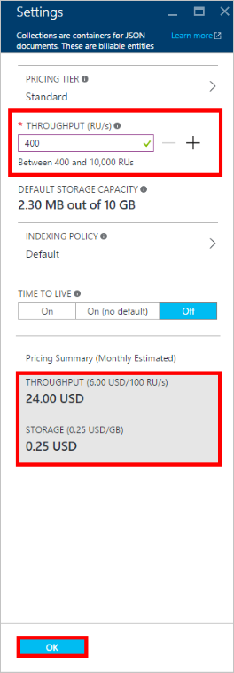

<properties
    pageTitle="Leistung Ebenen in DocumentDB | Microsoft Azure"
    description="Erfahren Sie, wie Sie reservieren Durchsatz auf Basis pro Websitesammlung die Leistung Ebenen in DocumentDB aktivieren."
    services="documentdb"
    authors="mimig1"
    manager="jhubbard"
    editor="monicar"
    documentationCenter=""/>

<tags
    ms.service="documentdb"
    ms.workload="data-services"
    ms.tgt_pltfrm="na"
    ms.devlang="na"
    ms.topic="article"
    ms.date="08/26/2016"
    ms.author="mimig"/>

# Leistung Ebenen in DocumentDB

Dieser Artikel enthält eine Übersicht der Leistung Ebenen in [Microsoft Azure DocumentDB](https://azure.microsoft.com/services/documentdb/).

Nach dem Lesen dieses Artikels, können Sie die folgenden Fragen beantworten ausführen:  

-   Was ist eine Leistungsstufe?
-   Wie ist Durchsatz für ein Datenbankkonto werden reserviert?
-   Wie arbeite ich mit Leistungsmerkmale?
-   Wie verwende ich Leistung Ebenen in Rechnung gestellt?

## Einführung in die Leistung Ebenen

Jede DocumentDB Websitesammlung erstellt haben, klicken Sie unter einem Standardkonto wird mit einer zugeordneten Leistungsstufe bereitgestellt. Jede Websitesammlung in einer Datenbank kann eine andere Leistungsstufe ermöglicht es Ihnen, weitere Durchsatz häufig verwendeter Websitesammlungen und weniger Durchsatz für selten verwendeter Websitesammlungen bestimmen haben. DocumentDB unterstützt beide Ebenen benutzerdefinierter Performance und vordefinierte Leistung Ebenen.  

Jede Leistungsstufe ist auf eine zugeordnete [Anforderung Einheit (RU)](documentdb-request-units.md) Zins begrenzt. Dies ist der Durchsatz, der für eine Websitesammlung basierend auf deren Leistungsstufe reserviert werden sollen, und ist ausschließlich für die Verwendung durch die Websitesammlung zur Verfügung.

<table border="0" cellspacing="0" cellpadding="0">
    <tbody>
        <tr>
            <td valign="top">

</td>
            <td valign="top">
Details
</td>
            <td valign="top">
Grenzwerte für Durchsatz
</td>
            <td valign="top">
Speicherlimits
</td>
            <td valign="top">
Version
</td>
            <td valign="top">
APIs
</td>            
        </tr>
        <tr>
            <td valign="top">
Benutzerdefinierter performance
</td>
            <td valign="top">
Speicher getaktete basierend auf Verwendung in GB an.

In einer anderen Einheit von 100 RU/s Durchsatz
</td>
            <td valign="top">
Unbegrenzte. 400 - 250.000 anfordern Einheiten/s standardmäßig (höhere per Anforderung)
</td>
            <td valign="top">
Unbegrenzte. 250 GB standardmäßig (höhere per Anforderung) 
</td>
            <td valign="top">
VERSION 2
</td>
            <td valign="top">
API 2015-12-16 und höher
</td>  
        </tr>
        <tr>
            <td valign="top">
Vordefinierte Leistung
</td>
            <td valign="top">
10 GB reserviert Speicher.

S1 = 250 RU von s, S2 = 1000 RU/s, S3 2500 RU/s =
</td>
            <td valign="top">
2500 RU/s
</td>
            <td valign="top">
10 GB
</td>
            <td valign="top">
VERSION 1
</td>
            <td valign="top">
Alle
</td>  
        </tr>        
    </tbody>
</table>                

DocumentDB ermöglicht einer umfangreichen Satz von Datenbankvorgänge einschließlich Abfragen, Abfragen mit benutzerdefinierten Funktionen (Functions, UDFs), gespeicherten Prozeduren und Trigger. Die von Verarbeitungskosten jeder dieser Vorgänge zugeordnet variiert basierend auf der CPU-, EA und zum Abschließen des Vorgangs erforderlich. Stattdessen nachdenkt und Verwalten von Hardware-Ressourcen, Sie können eine Anfrage Einheit als ein einzelnes Measure für die Ressourcen vorstellen verschiedene Datenbankvorgänge durchführen und eine Anwendung Anforderung service erforderlich.

Über die [Microsoft Azure-Portal](https://portal.azure.com), die [REST-API](https://msdn.microsoft.com/library/azure/mt489078.aspx) oder den [DocumentDB SDKs](https://msdn.microsoft.com/library/azure/dn781482.aspx)können Websitesammlungen erstellt werden. Die DocumentDB-APIs können Sie die Leistungsstufe einer Websitesammlung angeben.

> [AZURE.NOTE] Die Leistungsstufe einer Websitesammlung kann über die APIs oder das [Microsoft Azure-Portal](https://portal.azure.com/)angepasst werden. Leistung Ebene Änderungen werden innerhalb von 3 Minuten abgeschlossen erwartet.

## Festlegen der Leistung Ebenen für Websitesammlungen
Nachdem eine Auflistung erstellt wurde, wird die vollständige Zuweisung von RUs basierend auf dem vorgesehenen Leistungsstufe für die Websitesammlung reserviert.

Beachten Sie, dass sowohl benutzerdefinierte und vordefinierte Leistung DocumentDB basierend auf Reservierung von Durchsatz arbeitet. Durch das Erstellen einer Websitesammlungs, eine Anwendung wurde reserviert und ist in Rechnung gestellt für reservierte Durchsatz unabhängig davon, wie viel dieser Durchsatz aktiv verwendet wird. Mit benutzerdefinierter Performance Ebenen Speicher ist getaktete basierend auf Verbrauch, jedoch mit vordefinierte Leistungsmerkmale, 10 GB Speicher zum Zeitpunkt der Erstellung der Websitesammlung reserviert ist.  

Nachdem Websitesammlungen erstellt werden, können Sie die Leistungsstufe über die DocumentDB SDKs oder über das klassische Azure-Portal ändern.

> [AZURE.IMPORTANT] DocumentDB Standard-Sammlungen stündlich in Rechnung gestellt werden, und jeder Websitesammlung, die Sie erstellen, wird für eine mindestens eine Stunde der Verwendung Rechnung gestellt werden.

Wenn Sie die Leistungsstufe einer Websitesammlung innerhalb einer Stunde nach anpassen möchten, erhalten Sie für die höchsten Leistungsstufe festgelegt, während die Stunde Abrechnung. Beispielsweise, wenn Sie Ihre Leistungsstufe für eine Websitesammlung 8:53 Uhr erhöhen, werden Sie für die neue Ebene 8:00 Uhr ab belastet. Wenn Sie Ihre Leistungsstufe 8:53 Uhr verringern, wird entsprechend der neue Zinssatz 9:00 Uhr angewendet werden.

Anforderung Einheiten sind reserviert für jede Websitesammlung basierend auf der Leistung Ebene festlegen. Anforderung Einheitenverbrauch als ausgewertet wird eine Anzahl pro Sekunde. Anwendungen, die die Anforderung bereitgestellte Einheit Zins (oder Leistungsstufe) auf eine Auflistung überschreiten werden gedrosselt werden, bis die Rate unterhalb der reservierte Ebene für die Websitesammlung fällt. Wenn die Anwendung eine höhere Ebene des Durchsatzes erforderlich ist, können Sie die Leistungsstufe für jede Websitesammlung erhöhen.

> [AZURE.NOTE] Wenn eine Anwendung Leistungsmerkmale für eine oder mehrere Websitesammlungen überschreitet, werden Anfragen auf Basis pro Websitesammlung gedrosselt. Dies bedeutet, dass einige Anwendung erfolgreich durchgeführt werden kann, während andere gedrosselt werden können. Es wird empfohlen, eine kleine Anzahl Wiederholungsversuche beim um Spitzen im Datenverkehr Anforderung verarbeitet gedrosselt hinzufügen.

## Arbeiten mit Leistung Ebenen
DocumentDB Websitesammlungen können Sie Ihre Daten basierend auf den Abfragemuster und die Leistung Anforderungen Ihrer Anwendung zu gruppieren. Mit DocumentDBs automatische Indizierung und Abfrage-Support ist es üblich, heterogener Dokumente in der gleichen Sammlung weiterzuleiten. Die wichtigsten Aspekte bei der Entscheidung, ob separate Websitesammlungen verwendet werden sollte umfassen:

- Abfragen – eine Auflistung ist der Bereich für die Ausführung einer Abfrage an. Wenn Sie über eine Reihe von Dokumenten Abfragen müssen, stammen die effizientesten finden Sie hier Muster Zusammenstellung von Dokumenten in einer einzelnen Auflistung.
- Transaktionen – alle Transaktionen sind innerhalb einer einzelnen Auflistung auf beschränkt. Wenn Sie Dokumente, die innerhalb einer einzigen gespeicherten Prozedur oder eines Triggers aktualisiert werden müssen haben, wenn sie in der gleichen Sammlung gespeichert sind. Das heißt Partitionsschlüssel innerhalb einer Websitesammlung, die Begrenzungslinie Transaktion. Weitere Informationen hierzu finden Sie unter [Partitioning in DocumentDB](documentdb-partition-data.md) .
- Leistung Isolation – verfügt über eine Auflistung eine zugeordnete Leistungsstufe. Dies gewährleistet, dass jede Websitesammlung eine vorhersehbare Leistung durch reservierte RUs aufweist. Daten können in verschiedenen Websitesammlungen, mit unterschiedlichen Performance Ebenen, basierend auf Access Häufigkeit zugeordnet werden.

> [AZURE.IMPORTANT] Es ist wichtig zu verstehen, dass Ihnen zu vollständiger standard Sätzen basierend auf der Anzahl von Websitesammlungen erstellt, die von der Anwendung berechnet werden.

Es wird empfohlen, dass durch die Anwendung wird eine kleine Anzahl von Websitesammlungen verwenden, es sei denn, Sie große Speicher oder Durchsatz Anforderungen haben. Stellen Sie sicher, dass Sie die Anwendung Muster für die Erstellung einer neuen Websitesammlungen gut verstanden haben. Sie entscheiden möglicherweise reservieren Erstellen von Sammlungen als Management Aktion außerhalb Ihrer Anwendung behandelt. Ebenso wird den Leistung Pegel für eine Websitesammlung der Stundensatz ändern, an dem die Sammlung in Rechnung gestellt. Wenn eine Anwendung diese dynamisch angepasst wird, sollten Sie die Websitesammlung Leistung Ebenen überwachen.

## Ändern von S1, S2, S3 in benutzerdefinierter performance

Gehen Sie folgendermaßen zu ändern, verwenden Sie vordefinierte Durchsatz Ebenen zu User defined Durchsatz Ebenen Azure-Portal vor. Mithilfe benutzerdefinierter Durchsatz Ebenen können Sie Ihre Durchsatz an Ihre Bedürfnisse anpassen. Und wenn Sie ein Konto S1 weiterhin verwenden, können Sie den standardmäßigen Durchsatz von 250 RU/s 400 RU/s mit nur wenigen Klicks erhöhen.

Weitere Informationen zu den Preisen Änderungen Durchsatz User defined und vordefinierte Verwandte, finden Sie im Blogbeitrag [DocumentDB: alle erforderlichen Informationen zum Verwenden der neuen Preisgestaltung Optionen](https://azure.microsoft.com/blog/documentdb-use-the-new-pricing-options-on-your-existing-collections/).

> [AZURE.VIDEO changedocumentdbcollectionperformance]

1. Navigieren Sie in Ihrem Browser zu der [**Azure-Portal**](https://portal.azure.com).
2. Klicken Sie auf **Durchsuchen** -> **DocumentDB-Konten**, und wählen Sie dann das Konto DocumentDB zu ändern.   
3. Wählen Sie in der **Datenbanken** Lens die Datenbank zu ändern, und klicken Sie dann in der **Datenbank** Blade, wählen Sie die Sammlung zu ändern. Verwenden vordefinierte Durchsatz Konten verfügen über eine Preisgestaltung Ebene der S1, S2 oder S3.

      

4. Klicken Sie in das Blade **Websitesammlungen** auf **Weitere**, klicken Sie dann **Einstellungen** in der oberen Leiste.   
5. Klicken Sie auf die **Preise in** das Blade **Einstellungen** und beachten Sie, dass die monatlichen Kosten Schätzung für jeden Plan in das Blade **Wählen Sie Ihre Preisgestaltung Ebene** angezeigt wird. Um benutzerdefinierte Durchsatz zu ändern, klicken Sie auf **Standard**, und klicken Sie dann auf **Wählen Sie aus** , um die Änderungen zu speichern.

      

6. Zurück in das Blade **Einstellungen** die **Preise in** **Standard** geändert wird, und das **Durchsatz (RU/s)** mit einem Standardwert von 400 angezeigt wird. Festlegen den Durchsatz zwischen 400 und 10.000 [anfordern Einheiten](documentdb-request-units.md)MHzProzessoren (RU/s). **Zusammenfassung Preise** am unteren Rand der Seite wird automatisch aktualisiert, um eine Schätzung der monatlichen Kosten bereitzustellen. Klicken Sie auf **OK** , um die Änderungen zu speichern.

    

7. Klicken Sie auf die **Datenbank** Blade können Sie den neuen Durchsatz der Sammlung überprüfen.

    

Wenn Sie feststellen, dass Sie weitere Durchsatz (größer als 10.000 RU/s) oder mehr Speicher (größer als 10 GB) erforderlich ist, können Sie eine partitionierte Websitesammlung erstellen. Zum Erstellen einer partitionierten Auflistung finden Sie unter [Erstellen einer Websitesammlung](documentdb-create-collection.md).

>[AZURE.NOTE] Ändern der Leistung Ebenen einer Websitesammlung kann bis zu 2 Minuten dauern.

## Ändern der Leistung Ebenen, die mit dem .NET SDK

Eine weitere Möglichkeit zum Ändern Ihrer Websitesammlungen die Leistung Ebenen erfolgt über unsere SDKs. In diesem Abschnitt behandelt nur das Ändern einer Websitesammlung Leistungsstufe mit unserer [.NET SDK](https://msdn.microsoft.com/library/azure/dn948556.aspx), aber der Vorgang ist für unsere anderen [SDKs](https://msdn.microsoft.com/library/azure/dn781482.aspx)ähnlich. Wenn Sie mit unserer .NET SDK vertraut sind, finden Sie auf unserer [Lernprogramm-Erste Schritte](documentdb-get-started.md).

Hier ist ein Codeausschnitt für das Angebot Durchsatz zu 50.000 Anforderung Einheiten pro Sekunde ändern:

    //Fetch the resource to be updated
    Offer offer = client.CreateOfferQuery()
                      .Where(r => r.ResourceLink == collection.SelfLink)    
                      .AsEnumerable()
                      .SingleOrDefault();

    // Set the throughput to 5000 request units per second
    offer = new OfferV2(offer, 5000);

    //Now persist these changes to the database by replacing the original resource
    await client.ReplaceOfferAsync(offer);

    // Set the throughput to S2
    offer = new Offer(offer);
    offer.OfferType = "S2";

    //Now persist these changes to the database by replacing the original resource
    await client.ReplaceOfferAsync(offer);

> [AZURE.NOTE] Nach der Bereitstellung mit unter 10.000 Anforderung Einheiten pro Websitesammlungen können zweites zwischen Angebote mit User defined Durchsatz und vordefinierte Durchsatz (S1, S2, S3) zu einem beliebigen Zeitpunkt migriert werden. Sammlungen, die mit über 10.000 Anforderung Einheiten pro bereitgestellt werden können in vordefinierte Durchsatz Ebenen zweites konvertiert werden.

Besuchen Sie [MSDN](https://msdn.microsoft.com/library/azure/microsoft.azure.documents.client.documentclient.aspx) , um weitere Beispiele anzeigen und Weitere Informationen zu unseren Angebot Methoden aus:

- [**ReadOfferAsync**](https://msdn.microsoft.com/library/azure/microsoft.azure.documents.client.documentclient.readofferasync.aspx)
- [**ReadOffersFeedAsync**](https://msdn.microsoft.com/library/azure/microsoft.azure.documents.client.documentclient.readoffersfeedasync.aspx)
- [**ReplaceOfferAsync**](https://msdn.microsoft.com/library/azure/microsoft.azure.documents.client.documentclient.replaceofferasync.aspx)
- [**CreateOfferQuery**](https://msdn.microsoft.com/library/azure/microsoft.azure.documents.linq.documentqueryable.createofferquery.aspx)

## Ändern des Durchsatzes einer Websitesammlung

Wenn Sie bereits benutzerdefinierter Performance verwenden, können Sie den Durchsatz Ihrer Websitesammlung mit den folgenden Schritten ändern. Wenn Sie von einer Leistungsstufe S1, S2 oder S3 (vordefinierte Performance) in benutzerdefinierter Performance ändern müssen, finden Sie unter [Ändern von S1, S2, S3 zu benutzerdefinierter Performance](#changing-performance-levels-using-the-azure-portal).

1. Navigieren Sie in Ihrem Browser zu der [**Azure-Portal**](https://portal.azure.com).
2. Klicken Sie auf **Durchsuchen** -> **DocumentDB-Konten**, und wählen Sie dann das Konto DocumentDB zu ändern.   
3. Wählen Sie auf **DocumentDB Konto** vorher, in der **Datenbanken** Lens die Datenbank zu ändern, und klicken Sie dann in der **Datenbank** Blade, wählen Sie die Sammlung zu ändern.
4. Klicken Sie in das Blade **Websitesammlungen** in der oberen Leiste auf **Einstellungen** .   
5. Klicken Sie in den **Einstellungen** Blade erhöhen Sie den Wert im Feld **Durchsatz (RU/s)** , und klicken Sie dann auf **OK** , um die Änderungen zu speichern. Die **Preise Zusammenfassung** am unteren Rand der Blade aktualisiert und Sie die neuen geschätzten monatlichen Kosten dieser Websitesammlung in einem einzigen Bereich an.

    

Wenn Sie nicht sicher Faktor, um den Durchsatz erhöhen befinden, finden Sie unter [Estimating Durchsatz muss](documentdb-request-units.md#estimating-throughput-needs) und [Einheit Taschenrechner anfordern](https://www.documentdb.com/capacityplanner).

## Nächste Schritte

Untersuchen Sie diese Ressourcen, um weitere Informationen zur Preisgestaltung und Verwalten von Daten mit Azure DocumentDB:

- [DocumentDB Preise](https://azure.microsoft.com/pricing/details/documentdb/)
- [Verwalten von DocumentDB Kapazität](documentdb-manage.md)
- [Modellieren von Daten in DocumentDB](documentdb-modeling-data.md)
- [Vorherigen Daten in DocumentDB](documentdb-partition-data.md)
- [Anfordern von Einheiten](http://go.microsoft.com/fwlink/?LinkId=735027)

Weitere Informationen zum DocumentDB finden Sie unter der DocumentDB Azure- [Dokumentation](https://azure.microsoft.com/documentation/services/documentdb/).

Um mit Skalierung und Performance-Tests mit DocumentDB anzufangen, finden Sie unter [Leistung und Skala mit Azure DocumentDB testen](documentdb-performance-testing.md).

[1]: ./media/documentdb-performance-levels/documentdb-change-collection-performance7-9.png
[2]: ./media/documentdb-performance-levels/documentdb-change-collection-performance10-11.png
