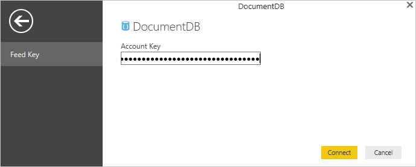
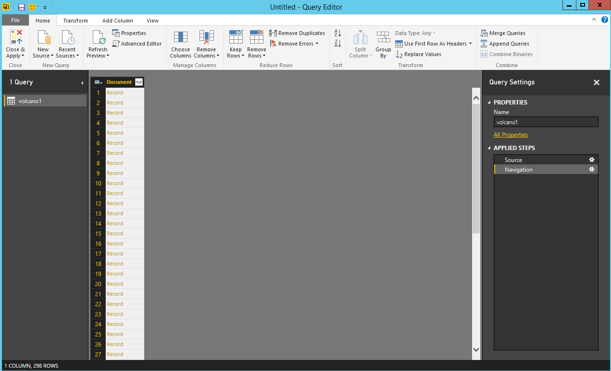
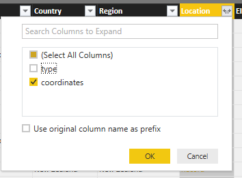
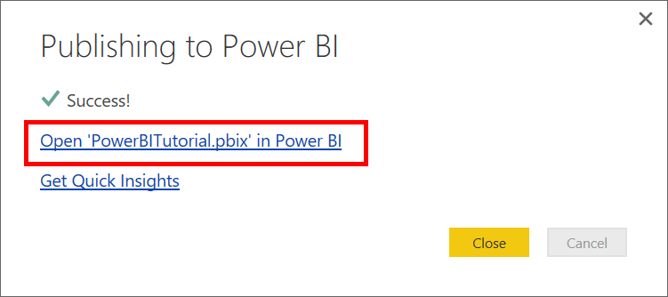
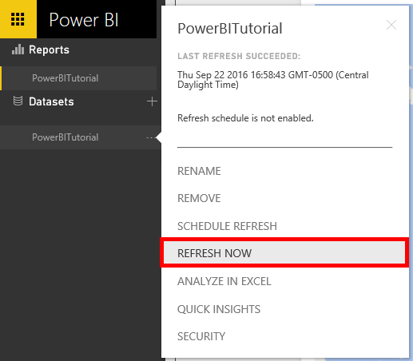

<properties
    pageTitle="Power BI-Lernprogramm für Verbinder DocumentDB | Microsoft Azure"
    description="Verwenden Sie dieses Lernprogramm Power BI JSON importieren, nützliche Berichte erstellen und Visualisieren von Daten mithilfe von DocumentDB und Power BI Netzwerke aus."
    keywords="Power Bi-Lernprogramm, Visualisieren von Daten, die Power Bi-connector"
    services="documentdb"
    authors="h0n"
    manager="jhubbard"
    editor="mimig"
    documentationCenter=""/>

<tags
    ms.service="documentdb"
    ms.workload="data-services"
    ms.tgt_pltfrm="na"
    ms.devlang="na"
    ms.topic="article"
    ms.date="09/22/2016"
    ms.author="hawong"/>

# Power BI-Lernprogramm für DocumentDB: Visualisieren von Daten mithilfe des Power BI-Verbinders

[PowerBI.com](https://powerbi.microsoft.com/) ist ein Onlinedienst, wo Sie erstellen können, und Teilen von Dashboards und Berichte mit Daten, die für Sie und Ihre Organisation wichtig sind.  Power BI-Desktop ist eine dedizierte Bericht authoring-Tool, die Sie zum Abrufen von Daten aus unterschiedlichen Datenquellen zusammenführen und Transformieren der Daten, leistungsfähige Berichte und Visualisierungen erstellen und Veröffentlichen von Berichten auf Power BI ermöglicht.  Mit der neuesten Version von Power BI-Desktop können Sie jetzt mit Ihrem Konto DocumentDB über den Verbinder DocumentDB für Power BI verbinden.   

In diesem Lernprogramm Power BI wir die einzelnen Schritte zum Verbinden mit einem DocumentDB-Konto in Power BI-Desktop, navigieren Sie zu einer Websitesammlung, in dem die Daten mithilfe des Navigators extrahiert werden soll, Transformieren JSON-Daten in Tabellenformat mit Power BI Desktop-Abfrage-Editor, erstellen und Veröffentlichen eines Berichts zu PowerBI.com.

Nach Abschluss dieses Lernprogramms Power BI, können Sie die folgenden Fragen beantworten ausführen:  

-   Wie kann ich Berichte mit Daten aus DocumentDB erstellen mithilfe von Power BI-Desktop?
-   Wie kann ich eine Verbindung mit einem Konto DocumentDB in Power BI-Desktop herstellen?
-   Wie kann ich eine Auflistung in Power BI-Desktop Abrufen von Daten aus?
-   Wie kann ich geschachtelte JSON-Daten in Power BI-Desktop transformieren?
-   Wie kann ich freigeben Meine Berichte in PowerBI.com und veröffentlichen?

## Erforderliche Komponenten

Bevor Sie den Anweisungen in diesem Lernprogramm Power BI folgen, stellen Sie sicher, dass Sie über Folgendes verfügen:

- [Die neueste Version von Power BI-Desktop](https://powerbi.microsoft.com/desktop).
- Zugriff auf unsere Demokonto oder Daten in Ihr Konto Azure DocumentDB.
    - Demokonto wird mit der in diesem Lernprogramm angezeigten Volcano Daten aufgefüllt. Dieses Demokonto nicht von einem beliebigen SLAs gebunden ist und ist nur für die Vorführung vorgesehen.  Wir reservieren rechts zum Ändern dieser Demo Konto einschließlich aber nicht beschränkt auf das Konto beenden, ändern die Taste, Einschränken des Zugriffs, ändern und löschen die Daten zu einem beliebigen Zeitpunkt ohne entsprechende Benachrichtigung oder Grund.
        - URL: https://analytics.documents.azure.com
        - Schreibgeschützte Schlüssel: MSr6kt7Gn0YRQbjd6RbTnTt7VHc5ohaAFu7osF0HdyQmfR + YhwCH2D2jcczVIR1LNK3nMPNBD31losN7lQ/Fkw ==
    - Oder Erstellen Ihrer eigenen Konto finden Sie unter [Verwenden des Portals Azure DocumentDB Datenbankkonto erstellen](https://azure.microsoft.com/documentation/articles/documentdb-create-account/). Klicken Sie dann zum Beispiel Volcano Daten, die ähnliche Was ist in diesem Lernprogramm verwendet werden (enthält jedoch keine GeoJSON Blöcke) zu gelangen, finden Sie auf der [Website NOAA](https://www.ngdc.noaa.gov/nndc/struts/form?t=102557&s=5&d=5) , und importieren Sie die Daten mit dem [Migrationstool für DocumentDB Daten](https://azure.microsoft.com/documentation/articles/documentdb-import-data/).

Wenn Sie Ihre Berichte in PowerBI.com freigeben zu können, müssen Sie ein Konto in PowerBI.com verfügen.  Weitere Informationen zu Power BI für Free und Power BI Pro finden, besuchen Sie [https://powerbi.microsoft.com/pricing](https://powerbi.microsoft.com/pricing).

## Lassen Sie uns beginnen
In diesem Lernprogramm wird angenommen, dass Sie eine Geologist Untersuchung Vulkane auf der ganzen Welt befinden.  Die Volcano Daten werden in einem DocumentDB-Konto gespeichert und die JSON-Dokumenten wie die folgenden aussehen.

    {
        "Volcano Name": "Rainier",
        "Country": "United States",
        "Region": "US-Washington",
        "Location": {
            "type": "Point",
            "coordinates": [
            -121.758,
            46.87
            ]
        },
        "Elevation": 4392,
        "Type": "Stratovolcano",
        "Status": "Dendrochronology",
        "Last Known Eruption": "Last known eruption from 1800-1899, inclusive"
    }

Sie möchten die Volcano Daten aus dem Konto DocumentDB abrufen und Visualisieren von Daten in einem interaktiven Power BI-Bericht, wie das unter.

Bereit zum Probieren Sie es? Lassen Sie uns beginnen.

1. Führen Sie Power BI-Desktop, auf Ihrem Computer.
2. Nachdem Sie Power BI-Desktop gestartet wird, wird *eine Willkommenseite* angezeigt.

    

3. Sie können direkt auf dem Bildschirm *Willkommen* **Daten abrufen**, finden Sie unter **Zuletzt verwendete Quellen**oder **Andere Berichte öffnen** .  Klicken Sie auf das X in der oberen rechten Ecke, um das Dialogfeld zu schließen. **Die Berichtsansicht Power BI-Desktops** wird angezeigt.

    

4. Wählen Sie im Menüband **Start** , und klicken Sie auf **Daten abrufen**.  Das Fenster **Daten abrufen** sollte angezeigt werden.

5. Klicken Sie auf **Azure**, wählen Sie **Microsoft Azure DocumentDB (Beta)**aus und klicken Sie dann auf **Verbinden**.  Das Fenster **Microsoft Azure DocumentDB verbinden** sollte angezeigt werden.

    

6. Geben Sie die DocumentDB Konto Endpunkt-URL, das Sie möchten, rufen Sie die Daten aus, wie unten dargestellt, und klicken Sie dann auf **OK**. Sie können die URL abrufen, aus dem URI-Feld in das Blade **[Tasten](documentdb-manage-account.md#keys)** des Portals Azure oder können Sie das Demokonto, in dem die URL ist `https://analytics.documents.azure.com`. 

    Nichts ein Datenbankname, Websitesammlung Name und SQL-Anweisung wie diese Felder optional sind.  Stattdessen können wir Navigator verwenden, um Wählen Sie die Datenbank und die Sammlung zu identifizieren, woher die Daten stammen.

    

7. Wenn Sie an diesen Endpunkt zum ersten Mal eine Verbindung herstellen, werden Sie aufgefordert, die Taste Konto anzugeben.  Rufen Sie den Schlüssel aus dem Feld **Primärschlüssel** in das **[Schreibgeschützte Schlüssel](documentdb-manage-account.md#keys)** Blade des Portals Azure oder können Sie das Demokonto, in dem Fall ist der Schlüssel ist `RcEBrRI2xVnlWheejXncHId6QRcKdCGQSW6uSUEgroYBWVnujW3YWvgiG2ePZ0P0TppsrMgscoxsO7cf6mOpcA==`. Geben Sie die kontoschlüssel ein, und klicken Sie auf **Verbinden**.

    Es empfiehlt sich, dass Sie die Taste schreibgeschützt verwenden, wenn Sie Berichte erstellen.  Dies verhindert unnötige Anzeigen des Schlüssels Master-Shape zu mögliches Sicherheitsrisiko. Die Taste schreibgeschützt steht aus dem Blade [Tasten](documentdb-manage-account.md#keys) des Portals Azure oder können Sie die oben angegebenen Demo-Kontoinformationen verwenden.

    

8. Wenn das Konto erfolgreich angeschlossen ist, wird der **Navigator** angezeigt.  **Navigator** wird eine Liste der Datenbanken unter dem Konto angezeigt.
9. Klicken Sie auf, und erweitern Sie der Datenbank kommen die Daten für den Bericht aus, wenn Sie das Demokonto, select **Volcanodb**verwenden.   

10. Markieren Sie nun eine Auflistung, der die Daten aus abgerufen werden. Wenn Sie das Demokonto verwenden, wählen Sie **volcano1**.

    Der Vorschaubereich zeigt eine Liste der **Eintrag** Elemente.  Ein Dokument wird als einen **Datensatz vom** Typ in Power BI dargestellt. Ebenso ist ein geschachtelter JSON-Block innerhalb eines Dokuments auch einen **Datensatz**aus.

    

11. Klicken Sie auf **Bearbeiten** , um den Abfrage-Editor starten, damit wir die Daten zu transformieren.

## Reduzieren und Transformieren von JSON-Dokumenten
1. Im Abfrage-Editor von Power BI sollte eine Spalte **Dokument** im mittleren Bereich angezeigt werden.

2. Klicken Sie auf das Steuerelement zum rechts neben der Spaltenüberschrift **Dokument** .  Im Kontextmenü mit einer Liste von Feldern wird angezeigt.  Wählen Sie die Felder, die Sie für den Bericht, beispielsweise Volcano Name, Land, Region, Speicherort, EoP, Typ, Status und Eruption für den letzten wissen müssen, und klicken Sie dann auf **OK**.

    

3. Im mittleren Bereich wird eine Vorschau des Ergebnisses mit den ausgewählten Feldern angezeigt.

    

4. In diesem Beispiel wird die Eigenschaft Position einen Textblock GeoJSON in einem Dokument.  Wie Sie sehen können, wird der Speicherort als einen **Datensatz vom** Typ in Power BI-Desktop dargestellt.  
5. Klicken Sie auf das Steuerelement zum rechts neben der Spaltenüberschrift Speicherort.  Das Kontextmenü mit den Feldern Typ und Koordinaten wird angezeigt.  Lassen Sie uns wählen Sie im Feld Koordinaten aus, und klicken Sie auf **OK**.

    

6. Im mittleren Bereich wird nun eine Spalte Koordinaten **Listentyp** .  Siehe am Anfang des Lernprogramms, bietet die GeoJSON Daten in diesem Lernprogramm vom Typ Punkt Breite und Werte in der Matrix Koordinaten aufgezeichnet.

    Das Element Koordinaten [0] repräsentiert Länge Koordinaten [1] Breite.
    

7. Um die Koordinaten Matrix zu reduzieren, erstellen wir eine **Benutzerdefinierte Spalte** mit der Bezeichnung LatLong.  Wählen Sie im Menüband **Spalte hinzufügen** , und klicken Sie auf **Benutzerdefinierte Spalte hinzufügen**.  Das Fenster **Hinzufügen benutzerdefinierte Spalte** sollte angezeigt werden.

8. Geben Sie einen Namen für die neue Spalte, z. B. LatLong ein.

9. Geben Sie dann die benutzerdefinierte Formel für die neue Spalte ein.  In unserem Beispiel werden wir die Breite und Werte durch ein Komma getrennt werden, wie mithilfe der folgenden Formel abgebildet verketten: `Text.From([Document.Location.coordinates]{1})&","&Text.From([Document.Location.coordinates]{0})`. Klicken Sie auf **OK**.

    Besuchen Sie für Weitere Informationen auf Data Analysis Expressions (DAX) DAX-Funktionen einschließlich [DAX grundlegende in Power BI-Desktop](https://support.powerbi.com/knowledgebase/articles/554619-dax-basics-in-power-bi-desktop).

    

10. Nun wird im mittleren Bereich die neue LatLong Spalte mit den Werten Breite und Länge, die durch ein Komma getrennt ausgefüllt angezeigt.

    

    Wenn Sie in der neuen Spalte ein Fehler auftreten, stellen Sie sicher, dass die angewendete Schritte unter Abfrageeinstellungen in der folgenden Abbildung entsprechen:

    

    Wenn Ihre Schritte unterscheiden, löschen Sie die zusätzliche Schritte, und versuchen Sie erneut, die benutzerdefinierte Spalte hinzuzufügen. 

11. Wir haben nun abgeschlossen Zusammenfassen von Daten in Tabellenformat.  Können Sie alle im Abfrage-Editor auf Form verfügbaren Funktionen für die Nutzung und Transformieren der Daten in DocumentDB.  Wenn Sie das Beispiel verwenden, ändern Sie den Datentyp ändern des **Datentyps** auf dem Menüband **Home** Erhöhung auf **ganze Zahl** .

    

12. Klicken Sie auf **Schließen und übernehmen** um das Datenmodell zu speichern.

    

## Erstellen von Berichten
Power BI-Berichtsansicht Desktop ist, in dem Sie Erstellen von Berichten zur Visualisierung von Daten beginnen können.  Sie können Berichte erstellen, per Drag & Drop Felder in den **Bericht** Zeichenbereich.

Sie sollten in der Berichtsansicht finden:

 1. Im Bereich **Felder** Dies ist die Stelle, an der Sie eine Liste von Datenmodellen mit Feldern angezeigt wird, für Berichte können.

 2. Klicken Sie im Bereich **Visualisierungen** . Ein Bericht kann eine einzelne oder mehrere Visualisierungen enthalten.  Wählen Sie die visuellen Typen Indexeigenschaften aus dem Bereich **Visualisierungen** auszuwählen.

 3. Der **Bericht** Zeichenbereich, dies ist die Stelle, an der Sie die visuellen Objekte für Ihren Bericht erstellen.

 4. **Die Berichtseite.** Sie können mehrere Berichtseiten in Power BI-Desktop hinzufügen.

Die nachstehende Abbildung zeigt die grundlegenden Schritte zum Erstellen eines einfachen interaktiven Karte View-Berichts von aus.

1. In unserem Beispiel erstellen wir eine Kartenansicht mit den Speicherort der einzelnen Volcano.  Klicken Sie im Bereich **Visualisierungen** klicken Sie auf der Karte visuell Typ wie aus dem Screenshot hervorgehoben.  Den Typ der Karte visuellen gezeichnet wird, klicken Sie auf den **Bericht** Zeichenbereich sollte angezeigt werden.  Klicken Sie im Bereich **Visualisierung** sollte auch eine Reihe von Eigenschaften, die im Zusammenhang mit der Karte visuell Typ angezeigt werden.

2. Nun Drag & drop das LatLong Feld aus dem Bereich **Felder** auf die Eigenschaft **Position** im Bereich **Visualisierungen** .
3. Als Nächstes Drag & drop das Volcano Namensfeld auf die Eigenschaft **Legende** .  

4. Klicken Sie dann ziehen Sie, und legen Sie das Feld Erhöhung auf die Eigenschaft **Größe** .  

5. Nun sollten Sie die Karte angezeigt visuellen mit eine Reihe von Blasen, der angibt, des Speicherorts der einzelnen Volcano mit der Größe der Blase wird eine der Erhöhung von den Vulkan abgleichen.

6. Sie haben nun einen einfachen Bericht erstellt.  Sie können den Bericht weiter anpassen, indem Sie mehrere Visualisierungen hinzufügen.  In diesem Fall hinzugefügt wir einen Datenschnitt Volcano Typ, um den Bericht interaktiv zu machen.  

    

## Veröffentlichen und Freigeben des Berichts
Wenn Sie den Bericht freigeben möchten, müssen Sie ein Konto in PowerBI.com verfügen.

1. Klicken Sie in der Power BI-Desktop auf der Multifunktionsleiste **Start** .
2. Klicken Sie auf **Veröffentlichen**.  Sie werden aufgefordert, den Benutzernamen und das Kennwort für Ihr Konto PowerBI.com eingeben.
3. Nachdem die Anmeldeinformationen authentifiziert wurde, wird der Bericht an Ihr Ziel veröffentlicht, die Sie ausgewählt haben.
4. Klicken Sie auf **Öffnen 'PowerBITutorial.pbix' in Power BI** zum Anzeigen und Freigeben des Berichts auf PowerBI.com.

    

## Erstellen Sie ein Dashboard in PowerBI.com

Jetzt, da Sie einen Bericht haben, können sie auf PowerBI.com freigeben

Wenn Sie den Bericht von Power BI-Desktop PowerBI.com veröffentlichen, wird ein **Bericht** und ein **Dataset** in Ihrem Mandanten PowerBI.com generiert. Nachdem Sie einen Bericht aufgerufen **PowerBITutorial** zu PowerBI.com veröffentlicht haben, werden Sie PowerBITutorial in Abschnitten für **Berichte** und **Datasets** auf PowerBI.com angezeigt.

   

Klicken Sie auf die Schaltfläche **Pin Live-Seite** , in dem Bericht PowerBI.com, zum Erstellen eines Dashboards freigegeben werden.

   

Folgen Sie dann die Anweisungen zum Erstellen eines neuen Dashboards [Anheften einer Kachel aus einem Bericht](https://powerbi.microsoft.com/documentation/powerbi-service-pin-a-tile-to-a-dashboard-from-a-report/#pin-a-tile-from-a-report) . 

Sie können auch ad-hoc-Änderungen auf Bericht ausführen, vor dem Erstellen eines Dashboards. Jedoch, empfiehlt es sich, dass Sie Power BI-Desktop verwenden, um die Änderungen ausführen und den Bericht zu PowerBI.com zentral.

## Aktualisieren von Daten in PowerBI.com

Es gibt zwei Methoden zum Aktualisieren von Daten, die ad-hoc- und geplanten aus.

Klicken Sie für eine ad-hoc-aktualisieren einfach auf die Eclipses (...), die im **Dataset**, z. B. PowerBITutorial. Es sollte eine Liste der Aktionen, einschließlich **Jetzt aktualisieren**angezeigt. Klicken Sie auf **Jetzt aktualisieren** , um die Daten zu aktualisieren.

Für eine planmäßigen Aktualisierung gehen folgendermaßen Sie vor.

1. Klicken Sie in der Aktionsliste auf **Terminplan aktualisieren** . 
    

2. Erweitern Sie auf **der Einstellungsseite** **Datenquellen-Anmeldeinformationen**. 

3. Klicken Sie auf **Anmeldeinformationen bearbeiten**. 

    Das Popup konfigurieren wird angezeigt. 

4. Geben Sie die EINGABETASTE, um eine Verbindung mit dem Konto DocumentDB für die gegebene Datengruppe, und klicken Sie auf **Anmelden**. 

5. Erweitern Sie der **Terminplan aktualisieren** und richten Sie des Zeitplans Dataset aktualisiert werden soll ein. 
  
6. Klicken Sie auf **Übernehmen** , und Sie haben die geplante Aktualisierung einrichten.

## Nächste Schritte
- Weitere Informationen zu Power BI finden Sie unter [Erste Schritte mit Power BI](https://powerbi.microsoft.com/documentation/powerbi-service-get-started/).
- Weitere Informationen zum DocumentDB finden Sie unter der [Startseite DocumentDB-Dokumentation](https://azure.microsoft.com/documentation/services/documentdb/).
