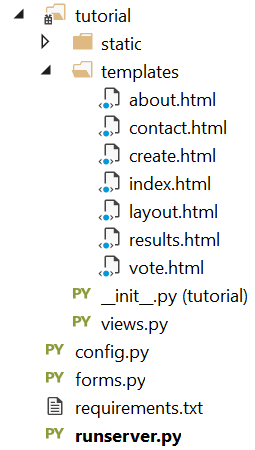

<properties
    pageTitle="Python wird Web Application Development mit DocumentDB | Microsoft Azure"
    description="Überprüfen einer Datenbank Lernprogramm zur Verwendung von DocumentDB zu speichern, und greifen Daten aus einer auf Azure gehostet wird Python Web-Anwendung. Suchen Sie nach Anwendung Entwicklung Lösungen." 
    keywords="Anwendungsentwicklung Datenbank Lernprogramm Python wird Python Webanwendung Python Web Development Documentdb Azure, Microsoft azure"
    services="documentdb"
    documentationCenter="python"
    authors="syamkmsft"
    manager="jhubbard"
    editor="cgronlun"/>

<tags
    ms.service="documentdb"
    ms.workload="data-management"
    ms.tgt_pltfrm="na"
    ms.devlang="python"
    ms.topic="hero-article"
    ms.date="08/25/2016"
    ms.author="syamk"/>

# <a name="python-flask-web-application-development-with-documentdb"></a>Python wird Web Application Development mit DocumentDB

> [AZURE.SELECTOR]
- [.NET](documentdb-dotnet-application.md)
- [Node.js](documentdb-nodejs-application.md)
- [Java](documentdb-java-application.md)
- [Python](documentdb-python-application.md)

In diesem Lernprogramm wird gezeigt, wie Azure DocumentDB verwenden, um zu speichern und Access-Daten in eine web-Anwendung auf Azure und wird vorausgesetzt, dass Sie einige vorherige Erfahrung mit Python und Azure Websites haben.

Dieses Lernprogramm behandelt:

1. Erstellen und Bereitstellen von einem Konto DocumentDB.
2. Erstellen eine Python MVC-Anwendung.
3. Herstellen einer Verbindung mit und Azure-DocumentDB aus der Webanwendung verwenden.
4. Die Webanwendung zu Azure Websites bereitgestellt.

Anhand dieses Lernprogramms erstellen Sie eine einfache Abstimmungsschaltfläche Anwendung, die Sie abstimmen einer Umfrage ermöglicht.


## <a name="database-tutorial-prerequisites"></a>Voraussetzungen für Datenbank-Lernprogramm

Bevor Sie den Anweisungen in diesem Artikel folgen, sollten Sie sicherstellen, dass Sie Folgendes installiert haben:

- Ein aktives Azure-Konto. Wenn Sie kein Konto haben, können Sie ein kostenloses Testversion Konto nur wenigen Minuten erstellen. Weitere Informationen finden Sie unter [Azure kostenlose Testversion](https://azure.microsoft.com/pricing/free-trial/).
- [Visual Studio 2013](http://www.visualstudio.com/) oder höher, oder [Visual Studio Express](), also die kostenlose Version. Speziell für Visual Studio 2015 werden die Anweisungen in diesem Lernprogramm geschrieben. 
- Python-Tools für Visual Studio aus [GitHub](http://microsoft.github.io/PTVS/). In diesem Lernprogramm verwendet Python Tools für im Vergleich mit einer 2015. 
- Azure Python SDK für Visual Studio, Version 2.4 oder höher von [azure.com](https://azure.microsoft.com/downloads/)zur Verfügung. Wir haben für Python 2.7 Microsoft Azure SDK verwendet.
- Python 2.7 aus [python.org][2]. Wir verwendet Python 2.7.11. 

> [AZURE.IMPORTANT] Wenn Sie zum ersten Mal Python 2.7 installieren, stellen Sie sicher, klicken Sie im Bildschirm anpassen Python 2.7.11 **Hinzufügen python.exe Pfad**auszuwählen.
> 
>    

- Microsoft Visual C++ Compiler für Python 2.7 vom [Microsoft Download Center][3].

## <a name="step-1-create-a-documentdb-database-account"></a>Schritt 1: Erstellen einer Datenbank DocumentDB-Konto

Erstes Erstellen eines Kontos DocumentDB. Wenn Sie bereits ein Konto haben, können Sie fahren Sie mit [Schritt2: Erstellen einer neue Python geben Webanwendung](#step-2:-create-a-new-python-flask-web-application).

[AZURE.INCLUDE [documentdb-create-dbaccount](../../includes/documentdb-create-dbaccount.md)]

<br/>
Wir werden nun zum Erstellen einer neuen Python man Web-Anwendungs von Grund von durchzuführen.

## <a name="step-2-create-a-new-python-flask-web-application"></a>Schritt 2: Erstellen einer neuen Python wird Webanwendung

1. Zeigen Sie in Visual Studio im Menü **Datei** auf **neu**, und klicken Sie dann auf **Projekt**.

    Klicken Sie im Dialogfeld **Neues Projekt** wird angezeigt.

2. Im linken Bereich erweitern Sie **Vorlagen** , und klicken Sie dann **Python**zu, und klicken Sie dann auf **Web**. 

3. Wählen Sie im mittleren Bereich, klicken Sie dann in den **Namen** im Feld Typ **Lernprogramm** **Wird Web-Projekt** aus, und klicken Sie dann auf **OK**. Denken Sie daran, dass Python Paketnamen Kleinbuchstaben, sein sollen, wie in der [Formatvorlage Leitfaden für Python-Code](https://www.python.org/dev/peps/pep-0008/#package-and-module-names)beschrieben.

    Für die neue Python wird die Lösung in ganz ein Web-Anwendung Entwicklungsframework, mit dem Sie Webanwendungen in Python schneller erstellen kann.

    

4. Klicken Sie auf **in einer virtuellen Umgebung installieren**, klicken Sie im Fenster **Python-Tools für Visual Studio** . 

    

5. Klicken Sie im Fenster **Virtuelle Umgebung hinzufügen** können Sie akzeptieren Sie die Standardeinstellungen und Python 2.7 als Basis-Umgebung verwenden, da PyDocumentDB Python derzeit nicht unterstützt 3.x, und klicken Sie dann auf **Erstellen**. Die erforderlichen Python virtuelle Umgebung für ein Projekt eingerichtet.

    

    Zeigt das Ausgabefenster `Successfully installed Flask-0.10.1 Jinja2-2.8 MarkupSafe-0.23 Werkzeug-0.11.5 itsdangerous-0.24 'requirements.txt' was installed successfully.` Wenn die Umgebung erfolgreich installiert wird.

## <a name="step-3-modify-the-python-flask-web-application"></a>Schritt 3: Ändern der Python wird Webanwendung

### <a name="add-the-python-flask-packages-to-your-project"></a>Hinzufügen der Pakete Python wird zu einem Projekt

Nachdem Sie Ihr Projekt eingerichtet haben, müssen Sie die erforderlichen geben Pakete zu einem Projekt, einschließlich Pydocumentdb, das Paket Python für DocumentDB hinzufügen.

1. Öffnen Sie im Explorer-Lösung die Datei mit dem Namen **requirements.txt** , und Ersetzen Sie den Inhalt mit den folgenden:

        flask==0.9
        flask-mail==0.7.6
        sqlalchemy==0.7.9
        flask-sqlalchemy==0.16
        sqlalchemy-migrate==0.7.2
        flask-whooshalchemy==0.55a
        flask-wtf==0.8.4
        pytz==2013b
        flask-babel==0.8
        flup
        pydocumentdb>=1.0.0

2. Speichern Sie die Datei **requirements.txt** . 
3. Mit der rechten Maustaste **Env** Lösung-Explorer und klicken Sie auf **Installieren von requirements.txt**.

    

    Nach Abschluss der Installation wird im Ausgabefenster Folgendes angezeigt:

        Successfully installed Babel-2.3.2 Tempita-0.5.2 WTForms-2.1 Whoosh-2.7.4 blinker-1.4 decorator-4.0.9 flask-0.9 flask-babel-0.8 flask-mail-0.7.6 flask-sqlalchemy-0.16 flask-whooshalchemy-0.55a0 flask-wtf-0.8.4 flup-1.0.2 pydocumentdb-1.6.1 pytz-2013b0 speaklater-1.3 sqlalchemy-0.7.9 sqlalchemy-migrate-0.7.2

    > [AZURE.NOTE] In Ausnahmefällen wird möglicherweise einen Fehler im Ausgabefenster angezeigt. In diesem Fall, überprüfen Sie, ob der Fehler zum Aufräumen verknüpft ist. Manchmal das Aufräumen schlägt fehl, aber die Installation weiterhin erfolgreich (führen Sie einen Bildlauf nach oben im Ausgabefenster zu dieser Prüfung). Sie können die Installation, indem Sie [die virtuelle Umgebung Überprüfung](#verify-the-virtual-environment)aktivieren. Wenn Fehler bei der Installation, aber die Überprüfung erfolgreich ist, ist es OK, um den Vorgang fortzusetzen.

### <a name="verify-the-virtual-environment"></a>Überprüfen Sie die virtuelle Umgebung

Wir stellen Sie sicher, dass alles ordnungsgemäß installiert ist.

1. Erstellen Sie die Lösung durch Drücken von **STRG**+**UMSCHALT**+**B**.
2. Nachdem das Build erfolgreich ist, starten Sie die Website durch Drücken von **F5**aus. Startet den man Development Server, und startet den Webbrowser. Es sollte die folgende Seite angezeigt.

    

3. Beenden Sie das Debuggen von der Website, indem Sie **UMSCHALT**drücken+**F5** in Visual Studio.

### <a name="create-database-collection-and-document-definitions"></a>Erstellen von Datenbank, Websitesammlungen und Dokumentdefinitionen

Jetzt erstellen wir eine Abstimmungsschaltfläche Anwendung durch neuen Dateien hinzufügen und aktualisieren andere.

1. Im Lösung-Explorer mit der rechten Maustaste in des Projekts **Lernprogramm** , klicken Sie auf **Hinzufügen**, und klicken Sie dann auf **Neues Element**. Wählen Sie **Leere Python-Datei** aus, und nennen Sie die Datei **forms.py**.  
2. Fügen Sie den folgenden Code zu der Datei forms.py, und speichern Sie die Datei.

```python
from flask.ext.wtf import Form
from wtforms import RadioField

class VoteForm(Form):
    deploy_preference  = RadioField('Deployment Preference', choices=[
        ('Web Site', 'Web Site'),
        ('Cloud Service', 'Cloud Service'),
        ('Virtual Machine', 'Virtual Machine')], default='Web Site')
```


### <a name="add-the-required-imports-to-viewspy"></a>Hinzufügen der erforderlichen Importe zu views.py

1. Erweitern Sie den Ordner **Lernprogramm** im Explorer-Lösung, und öffnen Sie die Datei **views.py** . 
2. Fügen Sie die folgenden Anweisungen an den Anfang der **views.py** Datei importieren, und klicken Sie dann speichern Sie die Datei ein. Diese Importieren DocumentDBs PythonSDK und die Pakete wird.

    ```python
    from forms import VoteForm
    import config
    import pydocumentdb.document_client as document_client
    ```


### <a name="create-database-collection-and-document"></a>Erstellen von Datenbank, Websitesammlungen und Dokument

- Immer noch in **views.py**fügen Sie den folgenden Code an das Ende der Datei ein. Dies sorgt für die Datenbank verwendet, indem Sie das Formular zu erstellen. Löschen Sie keine vorhandenen Code in **views.py**. Fügen Sie diese einfach an das Ende ein.

```python
@app.route('/create')
def create():
    """Renders the contact page."""
    client = document_client.DocumentClient(config.DOCUMENTDB_HOST, {'masterKey': config.DOCUMENTDB_KEY})

    # Attempt to delete the database.  This allows this to be used to recreate as well as create
    try:
        db = next((data for data in client.ReadDatabases() if data['id'] == config.DOCUMENTDB_DATABASE))
        client.DeleteDatabase(db['_self'])
    except:
        pass

    # Create database
    db = client.CreateDatabase({ 'id': config.DOCUMENTDB_DATABASE })

    # Create collection
    collection = client.CreateCollection(db['_self'],{ 'id': config.DOCUMENTDB_COLLECTION })

    # Create document
    document = client.CreateDocument(collection['_self'],
        { 'id': config.DOCUMENTDB_DOCUMENT,
          'Web Site': 0,
          'Cloud Service': 0,
          'Virtual Machine': 0,
          'name': config.DOCUMENTDB_DOCUMENT 
        })

    return render_template(
       'create.html',
        title='Create Page',
        year=datetime.now().year,
        message='You just created a new database, collection, and document.  Your old votes have been deleted')
```

> [AZURE.TIP] Die **CreateCollection** -Methode akzeptiert eine optionale **RequestOptions** als dritten Parameter. Dies kann verwendet werden, den Typ anbieten, für die Websitesammlung angeben. Wenn kein OfferType-Wert angegeben wird, wird die Sammlung mit den Standardtyp anbieten erstellt werden. Weitere Informationen zu DocumentDB bieten Typen finden Sie unter [Leistung Ebenen in DocumentDB](documentdb-performance-levels.md).


### <a name="read-database-collection-document-and-submit-form"></a>Lesen Sie der Datenbank, die Websitesammlung, Dokument, und senden Sie Formular

- Immer noch in **views.py**fügen Sie den folgenden Code an das Ende der Datei ein. Dies erledigt einrichten auf das Formular, lesen die Datenbank, Websitesammlungen und Dokument. Löschen Sie keine vorhandenen Code in **views.py**. Fügen Sie diese einfach an das Ende ein.

```python
@app.route('/vote', methods=['GET', 'POST'])
def vote(): 
    form = VoteForm()
    replaced_document ={}
    if form.validate_on_submit(): # is user submitted vote  
        client = document_client.DocumentClient(config.DOCUMENTDB_HOST, {'masterKey': config.DOCUMENTDB_KEY})

        # Read databases and take first since id should not be duplicated.
        db = next((data for data in client.ReadDatabases() if data['id'] == config.DOCUMENTDB_DATABASE))

        # Read collections and take first since id should not be duplicated.
        coll = next((coll for coll in client.ReadCollections(db['_self']) if coll['id'] == config.DOCUMENTDB_COLLECTION))

        # Read documents and take first since id should not be duplicated.
        doc = next((doc for doc in client.ReadDocuments(coll['_self']) if doc['id'] == config.DOCUMENTDB_DOCUMENT))

        # Take the data from the deploy_preference and increment our database
        doc[form.deploy_preference.data] = doc[form.deploy_preference.data] + 1
        replaced_document = client.ReplaceDocument(doc['_self'], doc)

        # Create a model to pass to results.html
        class VoteObject:
            choices = dict()
            total_votes = 0

        vote_object = VoteObject()
        vote_object.choices = {
            "Web Site" : doc['Web Site'],
            "Cloud Service" : doc['Cloud Service'],
            "Virtual Machine" : doc['Virtual Machine']
        }
        vote_object.total_votes = sum(vote_object.choices.values())

        return render_template(
            'results.html', 
            year=datetime.now().year, 
            vote_object = vote_object)

    else :
        return render_template(
            'vote.html', 
            title = 'Vote',
            year=datetime.now().year,
            form = form)
```


### <a name="create-the-html-files"></a>Erstellen von HTML-Dateien

1. Klicken Sie mit der rechten Maustaste auf die im Ordner **Vorlagen** im Explorer-Lösung in den Ordner **Lernprogramm** , klicken Sie auf **Hinzufügen**, und klicken Sie dann auf **Neues Element**. 
2. Wählen Sie **HTML-Seite**aus, und geben Sie dann im Namenfeld **create.html**. 
3. Wiederholen Sie die Schritte 1 und 2, um zwei zusätzliche HTML-Dateien erstellen: results.html und vote.html.
4. Fügen Sie den folgenden Code zu **create.html** in der `<body>` Element. Es wird die Meldung angezeigt, dass wir eine neue Datenbank, Websitesammlungen und Dokument erstellt haben.

    ```html
    
    
    <h2>{{ title }}.</h2>
    <h3>{{ message }}</h3>
    <p><a href="{{ url_for('vote') }}" class="btn btn-primary btn-large">Vote &raquo;</a></p>
    
    ```

5. Fügen Sie den folgenden Code zu **results.html** in der `<body`> Element. Es zeigt die Ergebnisse der Umfrage.

    ```html
    
    
    <h2>Results of the vote</h2>
        <br />
        
    
    <div class="row">
        <div class="col-sm-5">{{choice}}</div>
            <div class="col-sm-5">
                <div class="progress">
                    <div class="progress-bar" role="progressbar" aria-valuenow="{{vote_object.choices[choice]}}" aria-valuemin="0" aria-valuemax="{{vote_object.total_votes}}" style="width: {{(vote_object.choices[choice]/vote_object.total_votes)*100}}%;">
                                {{vote_object.choices[choice]}}
                </div>
            </div>
            </div>
    </div>
    
    
    <br />
    <a class="btn btn-primary" href="{{ url_for('vote') }}">Vote again?</a>
    
    ```

6. Fügen Sie den folgenden Code zu **vote.html** in der `<body`> Element. Zeigt die Umfrage, und die stimmen akzeptiert. Klicken Sie auf registrieren die stimmen, wird das Steuerelement an views.py übergeben, wo wir die Umwandlung Stimme erkannt und das Dokument entsprechend anfügen wird, über.

    ```html
    
    
    <h2>What is your favorite way to host an application on Azure?</h2>
    <form action="" method="post" name="vote">
        {{form.hidden_tag()}}
            {{form.deploy_preference}}
            <button class="btn btn-primary" type="submit">Vote</button>
    </form>
    
    ```

7. Ersetzen Sie im Ordner **Vorlagen** den Inhalt von **index.html** durch den folgenden Code ein. Dieses Dokument dient als die Startseite für eine Anwendung.
    
    ```html
    
    
    <h2>Python + DocumentDB Voting Application.</h2>
    <h3>This is a sample DocumentDB voting application using PyDocumentDB</h3>
    <p><a href="{{ url_for('create') }}" class="btn btn-primary btn-large">Create/Clear the Voting Database &raquo;</a></p>
    <p><a href="{{ url_for('vote') }}" class="btn btn-primary btn-large">Vote &raquo;</a></p>
    
    ```

### <a name="add-a-configuration-file-and-change-the-initpy"></a>Hinzufügen eine Konfigurationsdatei und Ändern der \_ \_Initialisierung\_\_.py

1. Lösung-Explorer mit der rechten Maustaste in des Projekts **Lernprogramm** , klicken Sie auf **Hinzufügen**, klicken Sie auf **Neues Element**, wählen Sie **Leere Python-Datei**aus und geben Sie den Namen der Datei **config.py**. Formulare in gegeben und ist diese Datei Config erforderlich. Sie können auch einen geheimen Schlüssel bereitstellen. Schlüssel ist jedoch nicht in diesem Lernprogramm erforderlich.

2. Fügen Sie den folgenden Code zu config.py, Sie müssen die Werte alter **DOCUMENTDB\_HOST** und **DOCUMENTDB\_Schlüssel** im nächsten Schritt.

    ```python
    CSRF_ENABLED = True
    SECRET_KEY = 'you-will-never-guess'
    
    DOCUMENTDB_HOST = 'https://YOUR_DOCUMENTDB_NAME.documents.azure.com:443/'
    DOCUMENTDB_KEY = 'YOUR_SECRET_KEY_ENDING_IN_=='
    
    DOCUMENTDB_DATABASE = 'voting database'
    DOCUMENTDB_COLLECTION = 'voting collection'
    DOCUMENTDB_DOCUMENT = 'voting document'
    ```

3. Im [Portal Azure](https://portal.azure.com/)-navigieren an die **Tasten** Blade durch Klicken auf **Durchsuchen**, **DocumentDB-Konten**, doppelklicken Sie auf den Namen des Kontos zu verwenden, und klicken Sie dann auf die Schaltfläche **Keys** im Bereich **Essentials** . Kopieren Sie in das Blade **Tasten** **URI** -Wert, und fügen Sie ihn in die Datei **config.py** als Wert für die **DOCUMENTDB\_HOST** Eigenschaft. 
4. Wieder im Portal Azure in das Blade **Tasten** , kopieren Sie den Wert des **Primärschlüssels** oder der **Sekundärschlüssel**, und fügen Sie ihn in die Datei **config.py** als Wert für die **DOCUMENTDB\_KEY** Eigenschaft.
5. In der ** \_ \_Initialisierung\_\_.py** ablegen, fügen Sie die folgende Zeile hinzu. 

        app.config.from_object('config')

    So, dass der Inhalt der Datei befindet:

    ```python
    from flask import Flask
    app = Flask(__name__)
    app.config.from_object('config')
    import tutorial.views
    ```

6. Nachdem Sie alle Dateien hinzugefügt haben, sollte die Lösung Explorer wie folgt aussehen:

    


## <a name="step-4-run-your-web-application-locally"></a>Schritt 4: Führen Sie die Webanwendung lokal

1. Erstellen Sie die Lösung durch Drücken von **STRG**+**UMSCHALT**+**B**.
2. Nachdem das Build erfolgreich ist, starten Sie die Website durch Drücken von **F5**aus. Folgendes sollte auf dem Bildschirm angezeigt werden.

    

3. Klicken Sie auf **Die Datenbank Abstimmungs-erstellen/löschen** , um die Datenbank zu erstellen.

    

4. Klicken Sie dann klicken Sie auf **Stimme ab** , und wählen Sie die gewünschte Option aus.

    

5. Für jede Stimme ab, die Sie umwandeln, erhöht es den entsprechenden Zähler aus.

    

6. Beenden Sie das Debuggen des Projekts, indem Sie UMSCHALT + F5 drücken.

## <a name="step-5-deploy-the-web-application-to-azure-websites"></a>Schritt 5: Bereitstellen der Webanwendung mit Azure-Websites

Jetzt, da Sie die vollständige Anwendung ordnungsgemäß gegen DocumentDB haben, werden wir dies zu Azure Websites bereitgestellt.

1. Mit der rechten Maustaste im Projekts im Solution Explorer (Stellen Sie sicher, dass Sie sind nicht immer noch lokal ausgeführt), und wählen Sie **Veröffentlichen**.  

    

2. Wählen Sie aus **Microsoft Azure Web Apps**im **Web veröffentlichen** , und klicken Sie dann auf **Weiter**.

    

3. Klicken Sie auf **neu**, klicken Sie im Fenster **Microsoft Azure Web Apps-Fenster** .

    

4. Klicken Sie im Fenster **Website erstellen, klicken Sie auf Microsoft Azure** Geben Sie eine **Web app-Name**, **App-Serviceplan**, **Ressourcengruppe**und **Region**, und klicken Sie auf **Erstellen**.

    

5. Klicken Sie im **Web veröffentlichen** klicken Sie auf **Veröffentlichen**.

    

3. In ein paar Sekunden Visual Studio Fertig stellen, Veröffentlichen der Webanwendung, und starten Sie einen Browser, wo Sie sehen können, Ihre praktische Arbeit in Azure ausgeführt!

## <a name="troubleshooting"></a>Behandlung von Problemen

Ist dies das erste Python-app, die Sie auf dem Computer ausgeführt haben, stellen Sie sicher, dass die folgenden Ordner (oder die entsprechende Installationsspeicherorte) in der Variablen PATH enthalten sind:

    C:\Python27\site-packages;C:\Python27\;C:\Python27\Scripts;

Wenn Sie erhalten eine Fehlermeldung, klicken Sie auf der Seite Ihre Stimme ab und Sie mit dem Namen des Projekts einen anderen Wert als **Lernprogramm**, stellen sicher, dass ** \_ \_Initialisierung\_\_.py** verweist auf die richtigen Projektnamen in der Textzeile: `import tutorial.view`.

## <a name="next-steps"></a>Nächste Schritte

Herzlichen Glückwunsch! Sie haben einfach Ihre erste Python Web-Anwendung mit Azure DocumentDB abgeschlossen und es zu Azure Websites veröffentlicht.

Wir aktualisieren und in diesem Thema häufig basierend auf Ihr Feedback verbessern.  Nachdem Sie des Lernprogramms erledigt schon, verwenden die Abstimmungsschaltflächen bitte am oberen und unteren Seitenrand und Sie sicher, dass Ihr Feedback auf was Verbesserungen, die angezeigt werden sollen vorgenommen werden. Wenn Sie uns, die Sie direkt in Verbindung setzen möchten, können Sie Ihre e-Mail-Adresse in Ihre Kommentare enthalten.

Um zusätzliche Funktionen an Ihrer Webanwendung hinzuzufügen, überprüfen Sie die APIs im [DocumentDB Python SDK](documentdb-sdk-python.md)zur Verfügung.

Weitere Informationen zu Azure, Visual Studio und Python finden Sie im [Python Developer Center](https://azure.microsoft.com/develop/python/). 

Weitere Lernprogramme Python wird, finden Sie unter [das man Mega-Lernprogramm Teil I: Hallo, Welt!](http://blog.miguelgrinberg.com/post/the-flask-mega-tutorial-part-i-hello-world). 

  [Visual Studio Express]: http://www.visualstudio.com/products/visual-studio-express-vs.aspx
  [2]: https://www.python.org/downloads/windows/
  [3]: https://www.microsoft.com/download/details.aspx?id=44266
  [Microsoft Web Platform Installer]: http://www.microsoft.com/web/downloads/platform.aspx
  [Azure portal]: http://portal.azure.com
