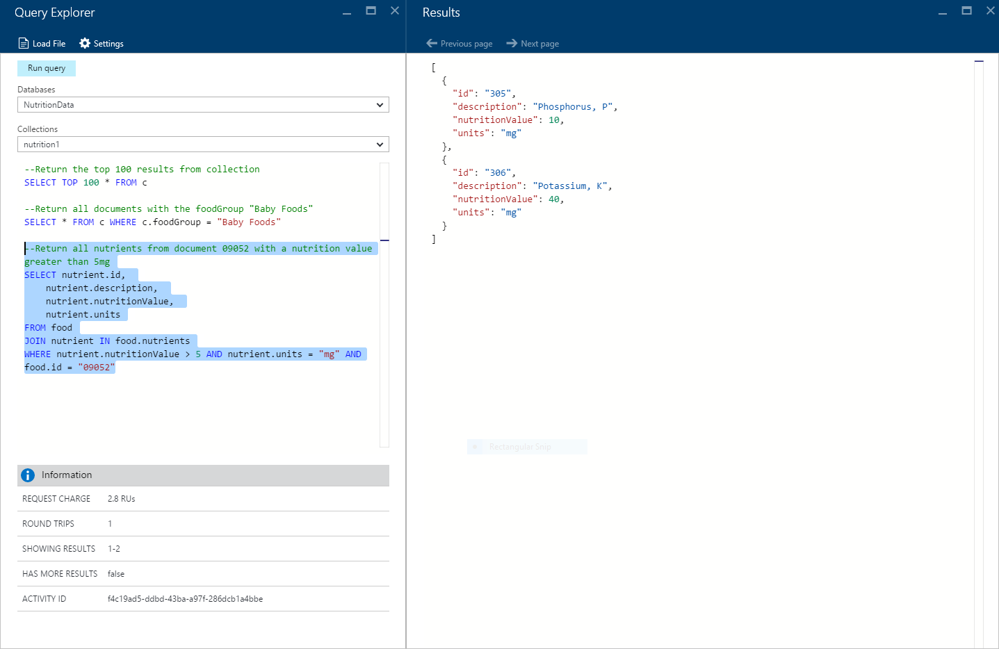
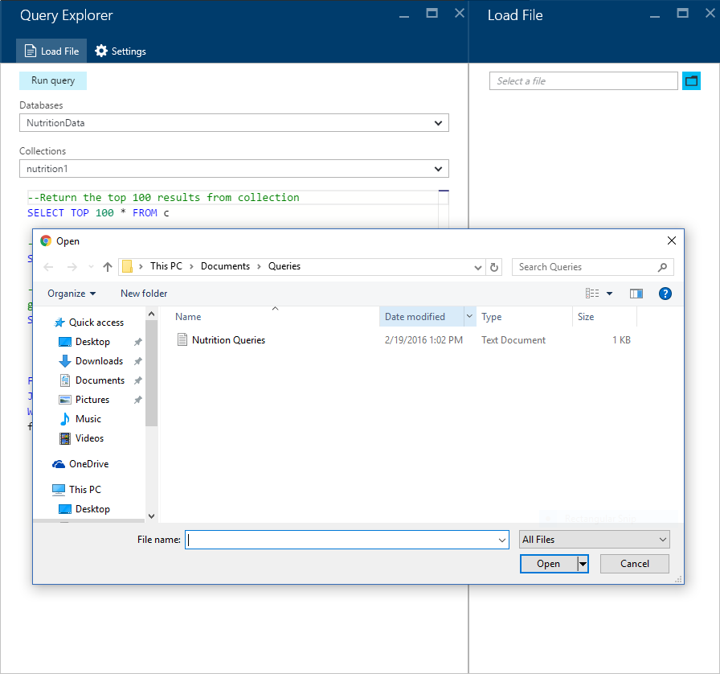

<properties
    pageTitle="DocumentDB Abfrage-Explorer: Eine SQL Abfrage-Editor | Microsoft Azure"
    description="Informationen Sie zu den DocumentDB Abfrage Explorer einer SQL-Abfrage-Editor im Portal Azure SQL-Abfragen schreiben und diese für eine Websitesammlung NoSQL DocumentDB auszuführen."
    keywords="Sql-Abfragen, Sql-Abfrage-Editor schreiben"
    services="documentdb"
    authors="kirillg"
    manager="jhubbard"
    editor="monicar"
    documentationCenter=""/>

<tags
    ms.service="documentdb"
    ms.workload="data-services"
    ms.tgt_pltfrm="na"
    ms.devlang="na"
    ms.topic="article"
    ms.date="08/30/2016"
    ms.author="kirillg"/>

# Schreiben, bearbeiten und Abspielen von SQL-Abfragen für DocumentDB mit dem Abfrage-Explorer 

Dieser Artikel enthält eine Übersicht über die [Microsoft Azure DocumentDB](https://azure.microsoft.com/services/documentdb/) Abfrage-Explorer ein Azure Portals Tool, die Sie schreiben, bearbeiten, und führen Sie die SQL-Abfragen für eine [Websitesammlung DocumentDB](documentdb-create-collection.md)ermöglicht.

1. Klicken Sie im Portal Azure in der Jumpbar auf **DocumentDB (NoSQL)**. Wenn **DocumentDB (NoSQL)** nicht angezeigt wird, klicken Sie auf **Weitere Dienste** , und klicken Sie dann auf **DocumentDB (NoSQL)**.

2. Klicken Sie auf **Abfrage-Explorer**, klicken Sie im Menü Ressource. 

    

3. Wählen Sie die **Datenbanken** und **Websitesammlungen** Abfrage aus der Dropdown-Listen in das Blade **Abfrage Explorer** , und geben Sie die Abfrage ausführen. 

    Die **Datenbanken** und **Websitesammlungen** Dropdown-Listen sind vorab eingetragenen je nach Kontext, in dem Sie die Abfrage Explorer starten. 

    Eine Standardabfrage von `SELECT TOP 100 * FROM c` steht zur Verfügung.  Können Sie die Standardabfrage annehmen oder erstellen eine eigenen Abfrage mithilfe der SQL-Abfragesprache in der [SQL-Abfrage Spickzettel:](documentdb-sql-query-cheat-sheet.md) oder im Artikel [SQL-Abfrage und SQL-Syntax](documentdb-sql-query.md) beschrieben.

    Klicken Sie auf die **Abfrage ausführen** , um die Ergebnisse anzuzeigen.

    

4. Das **Ergebnisse** Blade zeigt die Ausgabe der Abfrage an. 

    

## Arbeiten mit den Ergebnissen

Standardmäßig gibt Abfrage Explorer Ergebnisse in Gruppen von 100 ein.  Wenn Ihre Abfrage mehr als 100 Ergebnisse erzeugt, verwenden Sie einfach die **Nächste Seite** und **Vorherige Seite** Befehle zum Navigieren durch die Ergebnisgruppe ein.

Erfolgreiche Abfragen **im Informationsbereich** enthält Kennzahlen, wie etwa die Anfrage aufzulisten, die Anzahl der Schleifen die Abfrage vorgenommen, den Satz von Ergebnissen aktuell angezeigt wird, und zuvor erwähnt, ob es gibt mehrere Ergebnisse, die dann über den Befehl **Nächste Seite** als zugegriffen werden kann.

## Verwenden von mehreren Abfragen

Wenn Sie mehrere Abfragen verwenden und schnell zwischen ihnen wechseln möchten, können Sie geben alle Abfragen in das Textfeld Abfrage des Blades **Abfrage-Explorer** , und klicken Sie dann markieren Sie das Element, das Sie ausführen möchten, und klicken Sie dann auf **Abfrage ausführen** , um die Ergebnisse anzuzeigen.

## Hinzufügen von Abfragen aus einer Datei in der SQL-Abfrage-editor

Sie können den Inhalt einer vorhandenen Datei mithilfe des Befehls **Laden Datei** laden.

## Behandeln von Problemen mit

Wenn eine Abfrage mit Fehlern abgeschlossen ist, zeigt die Abfrage Explorer eine Liste mit Fehlern, die mit der Problembehandlung helfen können.

## Ausführen von DocumentDB SQL-Abfragen außerhalb des Portals

Der Abfrage-Explorer Azure-Portal ist nur eine Möglichkeit, SQL-Abfragen für DocumentDB ausführen. Sie können auch mithilfe der [REST-API](https://msdn.microsoft.com/library/azure/dn781481.aspx) oder im [Client SDKs](documentdb-sdk-dotnet.md)SQL-Abfragen ausführen. Weitere Informationen zur Verwendung dieser anderen Methoden finden Sie unter [Ausführen von SQL-Abfragen](documentdb-sql-query.md#executing-sql-queries)

## Nächste Schritte

Erfahren Sie mehr über die DocumentDB SQL-Grammatik im Abfrage-Explorer unterstützt, finden Sie im Artikel [SQL-Abfrage und SQL-Syntax](documentdb-sql-query.md) oder drucken Sie die [SQL-Abfrage Spickzettel aus:](documentdb-sql-query-cheat-sheet.md).
Sie können auch genießen ein wenig mit dem [Abfrage-Umgebung](https://www.documentdb.com/sql/demo) , in dem Sie Abfragen, die mit einer Stichprobendataset testen können.
