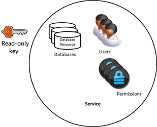
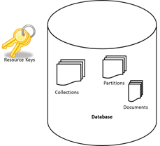

<properties 
    pageTitle="Informationen zum Sichern des Zugriffs auf Daten in DocumentDB | Microsoft Azure" 
    description="Informationen Sie zu Access-Steuerelement Konzepte in DocumentDB, einschließlich Master Tasten, schreibgeschützte Schlüssel, Benutzer und Berechtigungen." 
    services="documentdb" 
    authors="kiratp" 
    manager="jhubbard" 
    editor="monicar" 
    documentationCenter=""/>

<tags 
    ms.service="documentdb" 
    ms.workload="data-services" 
    ms.tgt_pltfrm="na" 
    ms.devlang="na" 
    ms.topic="article" 
    ms.date="09/19/2016" 
    ms.author="kipandya"/>

# Sichern des Zugriffs auf DocumentDB Daten

Dieser Artikel enthält eine Übersicht über sicheren Zugriff auf Daten aus [Microsoft Azure DocumentDB](https://azure.microsoft.com/services/documentdb/).

Wenn dieser Übersicht gelesen haben, können Sie die folgenden Fragen beantworten ausführen:  

-   Was sind DocumentDB Master Tasten?
-   Was sind DocumentDB schreibgeschützte Schlüssel?
-   Was sind die Ressource Token DocumentDB?
-   Wie kann ich DocumentDB Benutzer und Berechtigungen zum Sichern des Zugriffs auf DocumentDB Daten verwenden?

## DocumentDB Access Steuerung (Konzepte)

DocumentDB bietet erster Klasse Konzepte, um die Steuerung des Zugriffs auf DocumentDB Ressourcen.  Im Sinne dieses Themas sind DocumentDB Ressourcen in zwei Kategorien unterteilt:

- Administrative Ressourcen
    - Konto
    - Datenbank
    - Benutzer
    - Berechtigung
- Anwendungsressourcen
    - Websitesammlung
    - Angebot
    - Dokument
    - Anlage
    - Gespeicherte Prozedur
    - Auslösen
    - Benutzerdefinierte Funktion

Im Kontext dieser beiden Kategorien, DocumentDB unterstützt drei Arten von Access Steuerelement Rollen: Administrator, schreibgeschützt Administrator und Datenbankbenutzer zu berücksichtigen.  Rechte für jede Access Steuerelement Rolle sind:
 
- Konto manuell konfigurieren: Vollzugriff auf alle Ressourcen (administrative und Anwendung) in einem bestimmten DocumentDB-Konto.
- Schreibgeschützte Administrator: schreibgeschützten Zugriff auf alle Ressourcen (administrative und Anwendung innerhalb einer bestimmten DocumentDB-Konto. 
- Datenbankbenutzer: der DocumentDB Benutzer Ressource einer bestimmten Folge von DocumentDB Datenbankressourcen (z. B. Sammlungen, Dokumente, Skripts) zugeordnet.  Es kann eine oder mehrere Benutzerressourcen, die mit einer bestimmten Datenbank verknüpft ist, und jeder Benutzer Ressource möglicherweise eine oder mehrere Berechtigungen zugeordnet haben.

Mit dem oben genannten Kategorien und Ressourcen, denken Sie daran definiert das DocumentDB-Modell drei Arten von Access Konstrukte:

- Master-Shape Tasten: bei der Erstellung eines Kontos DocumentDB zwei Master Schlüssel (primären und sekundären) erstellt werden.  Aktivieren Sie diese Schlüssel vollständigen administrativen Zugriff auf alle Ressourcen innerhalb des DocumentDB-Kontos.

- Schreibgeschützte Schlüssel: bei der Erstellung eines Kontos DocumentDB zwei schreibgeschützte Schlüssel (primären und sekundären) erstellt werden.  Aktivieren Sie diese Schlüssel schreibgeschützten Zugriff auf alle Ressourcen innerhalb der DocumentDB-Konto ein.

- Ressource Token: eine Ressourcentoken eine DocumentDB Berechtigung Ressource zugeordnet ist, und erfasst werden die Beziehung zwischen dem Benutzer einer Datenbank als auch die Berechtigung hat diesen Benutzer für eine bestimmte DocumentDB Anwendungsressource (z. B. Auflistung, Dokument).

## Arbeiten mit master und schreibgeschützt DocumentDB-Tasten

Wie zuvor schon erwähnt, stellen DocumentDB Master Tasten vollständigen administrativen Zugriff auf alle Ressourcen innerhalb einer DocumentDB-Konto an, während schreibgeschützte Schlüssel Lesezugriff für alle Ressourcen innerhalb des Kontos aktivieren.  Der folgende Codeausschnitt veranschaulicht, wie eine DocumentDB Konto Endpunkt und Master Key Instanziieren eines DocumentClient und eine neue Datenbank erstellen. 

    //Read the DocumentDB endpointUrl and authorization keys from config.
    //These values are available from the Azure Classic Portal on the DocumentDB Account Blade under "Keys".
    //NB > Keep these values in a safe and secure location. Together they provide Administrative access to your DocDB account.
    
    private static readonly string endpointUrl = ConfigurationManager.AppSettings["EndPointUrl"];
    private static readonly SecureString authorizationKey = ToSecureString(ConfigurationManager.AppSettings["AuthorizationKey"]);
        
    client = new DocumentClient(new Uri(endpointUrl), authorizationKey);
    
    // Create Database
    Database database = await client.CreateDatabaseAsync(
        new Database
        {
            Id = databaseName
        });

## Übersicht über DocumentDB Ressource Token

Sie können eine Ressourcentoken (durch das Erstellen von DocumentDB Benutzer und Berechtigungen) Wenn Sie Zugriff auf Ihr Konto DocumentDB Ressourcen ein Client zur Verfügung stellen, die mit dem Schlüssel Master-Shape nicht vertrauenswürdig möchten. Ihre DocumentDB Master Keys gehören sowohl einen primären und sekundären Schlüssel, von denen jede administrativen Zugriff auf Ihr Konto und alle Ressourcen darin gewährt. Verfügbarmachen einer der Schlüssel Master-Shape wird Ihr Konto die Möglichkeit bösartiger oder fahrlässigen verwenden. 

Ebenso DocumentDB schreibgeschützte Schlüssel lesen Zugriff auf alle Ressourcen – außer berechtigt Ressourcen, natürlich – innerhalb eines Kontos DocumentDB und können nicht verwendet werden, um eine genauere Zugriff auf bestimmte DocumentDB Ressourcen bieten.

DocumentDB Ressource Token stellen eine sichere Alternative, durch die Clients zum Lesen, schreiben und Löschen von Ressourcen in Ihr Konto DocumentDB entsprechend den Berechtigungen, die Ihnen erteilt haben und ohne Notwendigkeit Master oder nur die wichtigsten gelesen, werden.

So sieht eine typische Entwurfsmuster vererbungseinstellungen Ressource Token möglicherweise angefordert, generiert und an den Kunden geliefert aus:

1. Ein Dienst Mid Ebene wird zu eine mobile Anwendung Benutzer Fotos freigeben dienen eingerichtet.
2. Der Dienst Mid Ebene besitzt die Master-Taste für das Konto DocumentDB.
3. Die app Foto wird auf mobilen Geräten des Endbenutzers installiert. 
4. Klicken Sie auf Login stellt die app Foto der Identität des Benutzers mit dem Dienst Mid Ebene her. Dieses Verfahren der Identität Niederlassung ist rein auf die Anwendung.
5. Sobald die Identität eingerichtet wurde, fordert der Dienst Mid Ebene Berechtigungen, die auf Grundlage der Identität.
6. Der Dienst der mittleren Schicht sendet eine Ressourcentoken wieder bei der Telefon-app.
7. Die Telefon-app kann weiterhin das Ressourcentoken verwenden direkt DocumentDB Zugriff auf Ressourcen mit den Berechtigungen, die vom Ressourcentoken und für das Intervall zulässig vom Ressourcentoken definiert. 
8. Wenn die Ressource-Sicherheitstoken abläuft, erhalten nachfolgende Anforderungen eine 401 nicht autorisierte Ausnahme.  Zu diesem Zeitpunkt die Telefon-app erneut bestimmt die Identität und ein neue Ressourcentoken anfordert.

## Arbeiten mit DocumentDB Benutzer und Berechtigungen
DocumentDB User Ressource ist eine Datenbank DocumentDB zugeordnet.  Jede Datenbank kann NULL oder mehr DocumentDB Benutzer enthalten.  Der folgende Codeausschnitt veranschaulicht, wie eine Ressource für DocumentDB Benutzer erstellen.

    //Create a user.
    User docUser = new User
    {
        Id = "mobileuser"
    };

    docUser = await client.CreateUserAsync(UriFactory.CreateDatabaseUri("db"), docUser);

> [AZURE.NOTE] Jeder Benutzer DocumentDB verfügt über eine PermissionsLink-Eigenschaft, die zum Abrufen der Liste der Berechtigungen des Benutzers verwendet werden kann.

Eine DocumentDB Berechtigung Ressource ist ein DocumentDB Benutzer zugeordnet.  Jeder Benutzer kann NULL oder mehr DocumentDB Berechtigungen enthalten.  Eine Ressource über die Berechtigung ermöglicht den Zugriff auf ein Sicherheitstoken, die der Benutzer bei dem Versuch, eine Ressource für bestimmte Anwendung zuzugreifen muss.
Es gibt zwei verfügbaren Zugriffsebenen, die von einer Ressource über die Berechtigung zur Verfügung gestellt werden können:

- Alle: Der Benutzer hat volle Berechtigungen für die Ressource
- Gelesen: Der Benutzer den Inhalt der Ressource kann nur lesen, aber schreiben, aktualisieren oder Löschen von Vorgängen für die Ressource nicht möglich.

> [AZURE.NOTE] Zur Ausführung DocumentDB Prozeduren auf der Benutzer die All-Berechtigung für die Auflistung verfügen muss, in dem die gespeicherte Prozedur ausgeführt wird.

Der folgende Codeausschnitt zeigt so erstellen Sie eine Ressource über die Berechtigung, lesen das Ressourcentoken der Ressource über die Berechtigung, und ordnen Sie die Berechtigungen des Benutzers über erstellt.

    // Create a permission.
    Permission docPermission = new Permission
    {
        PermissionMode = PermissionMode.Read,
        ResourceLink = documentCollection.SelfLink,
        Id = "readperm"
    };
            
  DocPermission = Client erwartet. CreatePermissionAsync (UriFactory.CreateUserUri ("Db", "Benutzer"), DocPermission) Console.WriteLine (docPermission.Id + "hat der Token:" + docPermission.Token);
  
Wenn Sie für Ihre Websitesammlung, und klicken Sie dann auf die Berechtigungen für die Websitesammlung Partitionsschlüssel angegeben haben, müssen Dokument- und Anlage Ressourcen auch die ResourcePartitionKey zusätzlich zu den ResourceLink einschließen.

Um einen bestimmten Benutzer zugeordneten Berechtigungen Ressourcen einfach zu erhalten, feed DocumentDB zur Verfügung stellt eine Berechtigung für jedes Benutzerobjekt.  Der folgende Codeausschnitt veranschaulicht, wie die Berechtigungen der Benutzer über erstellt zugeordnet abrufen, erstellen eine Berechtigungsliste und Instanziieren einer neuen DocumentClient im Namen des Benutzers.

    //Read a permission feed.
    FeedResponse<Permission> permFeed = await client.ReadPermissionFeedAsync(
      UriFactory.CreateUserUri("db", "myUser"));

    List<Permission> permList = new List<Permission>();
      
    foreach (Permission perm in permFeed)
    {
        permList.Add(perm);
    }
            
    DocumentClient userClient = new DocumentClient(new Uri(endpointUrl), permList);

> [AZURE.TIP] Ressource Token haben Standard gültige Zeitspanne von 1 Stunde.  Token Lebensdauer, kann jedoch explizit, bis zu einem Maximum von fünf Stunden angegeben werden.

## Nächste Schritte

- Weitere Informationen zu DocumentDB zu finden, klicken Sie auf [hier](http://azure.com/docdb).
- Weitere Informationen zum Verwalten von Schlüsseln für master und schreibgeschützt, klicken Sie auf [hier](documentdb-manage-account.md).
- Informationen zum DocumentDB Autorisierung Token zu erstellen, klicken Sie auf [hier](https://msdn.microsoft.com/library/azure/dn783368.aspx)
 
