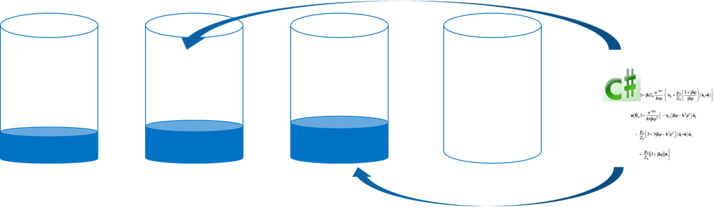
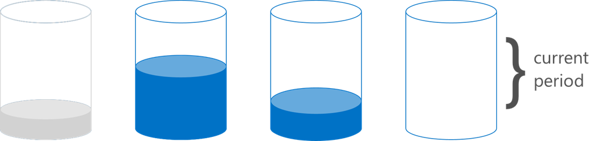

<properties 
    pageTitle="Gewusst wie: Implementieren der Client Seite mit den SDKs Partitionierung | Microsoft Azure" 
    description="Informationen Sie zum Verwenden der Azure DocumentDB SDKs zu Partition (Shard) Daten und Routing Besprechungsanfragen über mehrere Websitesammlungen" 
    services="documentdb" 
    authors="arramac" 
    manager="jhubbard" 
    editor="cgronlun" 
    documentationCenter=""/>

<tags 
    ms.service="documentdb" 
    ms.workload="data-services" 
    ms.tgt_pltfrm="na" 
    ms.devlang="na" 
    ms.topic="article" 
    ms.date="10/27/2016" 
    ms.author="arramac"/>

# <a name="how-to-partition-data-using-client-side-support-in-documentdb"></a>Wie Daten mithilfe von clientseitige Unterstützung in DocumentDB aufgeteilt

Azure DocumentDB unterstützt [Automatische Aufteilen von Websitesammlungen](documentdb-partition-data.md). Es gibt jedoch verwenden Fälle, in denen es hilfreich sein detaillierte Kontrolle Partitionierung Verhalten. Wir haben für die Partitionierung Aufgaben erforderlichen können Plate Codes zu reduzieren, Funktionalität im .NET, Node.js und Java-SDKs, die von Applications erstellen, die sich über mehrere Websitesammlungen skaliert werden vereinfacht hinzugefügt.

In diesem Artikel werden wir sehen Sie sich die Klassen und Schnittstellen in .NET SDK und wie Sie diese zum Entwickeln von Applications partitionierten verwenden können. Andere SDKs wie Java, Node.js und Python werden ähnliche Methoden und Schnittstellen für die clientseitige Partitionierung unterstützen.

## <a name="client-side-partitioning-with-the-documentdb-sdk"></a>Clientseitige Partitionierung mit dem SDK DocumentDB

Bevor wir Feldcodes in Partitionierung, Wiederholung uns einige grundlegende DocumentDB Konzepte, die sich auf die Partitionierung beziehen. Konto jeder DocumentDB Azure-Datenbank besteht aus einer Reihe von Datenbanken mit jeweils mehrere Websitesammlungen, von die jede gespeicherten Prozeduren, Trigger, UDFs, Dokumente und zugehörigen Anlagen enthalten kann. Websitesammlungen können verfügen über die folgenden Eigenschaften und einer Partition oder partitionierten selbst werden:

- Websitesammlungen bieten Leistung Isolation an. Daher besteht ein Leistungsvorteil in ähnlicher Dokumente in der gleichen Sammlung sortieren. Möglicherweise möchten Sie beispielsweise für Reihe Zeitdaten, Daten für den letzten Monat, gespeichert werden sollen, die häufig, innerhalb einer Websitesammlung mit höheren bereitgestellte Durchsatz abgefragt wird, während die ältere Daten innerhalb von Websitesammlungen mit geringer bereitgestellte Durchsatz platziert werden.
- ACID-Transaktionen h. gespeicherten Prozeduren und Trigger können keine Auflistung umfassen. Transaktionen sind innerhalb einer Einzelpartition Schlüsselwert innerhalb einer Websitesammlung beschränkt.
- Websitesammlungen erzwingen nicht über ein Schema, damit sie für JSON-Dokumente mit der gleichen Typ oder verschiedene Typen verwendet werden können.

Beginnend mit der Version [1.5.x Azure DocumentDB SDKs](documentdb-sdk-dotnet.md), können Sie Dokument Operationen direkt mit einer Datenbank durchführen. Intern verwendet die [DocumentClient](https://msdn.microsoft.com/library/azure/microsoft.azure.documents.client.documentclient.aspx) der PartitionResolver, die Sie angegeben haben, für die Datenbank die Weiterleitung von Anfragen der entsprechenden Auflistung.

>[AZURE.NOTE] [Serverseitige Partitionierung](documentdb-partition-data.md) eingeführt werden in REST-API 2015-12-16 und SDKs 1.6.0+ deprecates den clientseitige Partition Auflösung Ansatz für einfache Verwendungsfällen. Clientseitige Partitionierung ist jedoch flexibler und ermöglicht Ihnen Leistung Isolation über Partition Tasten steuern, Grad der Parallelität beim Lesen der Ergebnisse aus mehreren Partitionen steuern und Bereich/räumliche Ansätze im Vergleich zu Hash Partitionierung verwenden.

In .NET beträgt jede PartitionResolver Klasse beispielsweise eine Beton Implementierung einer [IPartitionResolver](https://msdn.microsoft.com/library/azure/microsoft.azure.documents.client.ipartitionresolver.aspx) Schnittstelle, die drei Methoden - [GetPartitionKey](https://msdn.microsoft.com/library/azure/microsoft.azure.documents.client.ipartitionresolver.getpartitionkey.aspx), [ResolveForCreate](https://msdn.microsoft.com/library/azure/microsoft.azure.documents.client.ipartitionresolver.resolveforcreate.aspx) und [ResolveForRead](https://msdn.microsoft.com/library/azure/microsoft.azure.documents.client.ipartitionresolver.resolveforread.aspx)verfügt. LINQ-Abfragen und ReadFeed Iteratoren verwenden Sie die ResolveForRead Methode intern aus, die alle Websitesammlungen durchlaufen, die für die Anforderung der Partitionsschlüssel entsprechen. Erstellen Sie auf ähnliche Weise Vorgänge verwenden, die die ResolveForCreate-Methode zum Weiterleiten an die richtige Partition erstellt. Es gibt keine Änderungen erforderlich für ersetzen, löschen und lesen, da diese Dokumente verwenden, die bereits den Bezug der entsprechenden Auflistung enthalten.

Die SDKs auch enthält zwei Klassen, die die zwei kanonische vorherigen Techniken, hashing und Bereich Suchvorgänge über eine [HashPartitionResolver](https://msdn.microsoft.com/library/azure/microsoft.azure.documents.partitioning.hashpartitionresolver.aspx) und eine [RangePartitionResolver](https://msdn.microsoft.com/library/azure/mt126047.aspx)unterstützen. Diese Klassen können Sie problemlos Partitionierungslogik an Ihrer Anwendung hinzufügen.  

## <a name="add-partitioning-logic-and-register-the-partitionresolver"></a>Hinzufügen von Logik vorherigen und Registrieren der PartitionResolver 

Hier ist ein Ausschnitt, die zum Erstellen einer [HashPartitionResolver](https://msdn.microsoft.com/library/azure/microsoft.azure.documents.partitioning.hashpartitionresolver.aspx) und registriert die DocumentClient für eine Datenbank mit ein.

```cs
// Create some collections to partition data.
DocumentCollection collection1 = await client.CreateDocumentCollectionAsync(...);
DocumentCollection collection2 = await client.CreateDocumentCollectionAsync(...);

// Initialize a HashPartitionResolver using the "UserId" property and the two collection self-links.
HashPartitionResolver hashResolver = new HashPartitionResolver(
    u => ((UserProfile)u).UserId, 
    new string[] { collection1.SelfLink, collection2.SelfLink });

// Register the PartitionResolver with the database.
this.client.PartitionResolvers[database.SelfLink] = hashResolver;

```

## <a name="create-documents-in-a-partition"></a>Erstellen Sie Dokumente in einer partition  

Nachdem die PartitionResolver registriert ist, können Sie ausführen erstellt und direkt mit der Datenbank fragt, wie unten dargestellt. In diesem Beispiel wird das SDK der PartitionResolver zum Extrahieren der Benutzer-ID, wandeln diese, und verwenden Sie dann diesen Wert zum Weiterleiten von des Vorgangs zum Erstellen der richtigen Auflistung verwendet.

```cs
Document johnDocument = await this.client.CreateDocumentAsync(
    database.SelfLink, new UserProfile("J1", "@John", Region.UnitedStatesEast));
Document ryanDocument = await this.client.CreateDocumentAsync(
    database.SelfLink, new UserProfile("U4", "@Ryan", Region.AsiaPacific, UserStatus.AppearAway));
```

## <a name="create-queries-against-partitions"></a>Erstellen von Abfragen für Partitionen  

Sie können die mithilfe der Methode [CreateDocumentQuery](https://msdn.microsoft.com/library/azure/microsoft.azure.documents.linq.documentqueryable.createdocumentquery.aspx) durch Übergabe in der Datenbank und Partitionsschlüssel Abfragen. Die Abfrage gibt ein einzelnes Resultset über alle Websitesammlungen in der Datenbank, die die Partitionsschlüssel zuordnen.  

```cs
// Query for John's document by ID - uses PartitionResolver to restrict the query to the partitions 
// containing @John. Again the query uses the database self link, and relies on the hash resolver 
// to route the appropriate collection.
var query = this.client.CreateDocumentQuery<UserProfile>(
    database.SelfLink, null, partitionResolver.GetPartitionKey(johnProfile))
    .Where(u => u.UserName == "@John");
johnProfile = query.AsEnumerable().FirstOrDefault();
```

## <a name="create-queries-against-all-collections-in-the-database"></a>Erstellen von Abfragen für alle Websitesammlungen in der Datenbank 

Auch können Sie alle Websitesammlungen in der Datenbank Abfragen und auflisten Ergebnisse, wie Sie anhand der anzeigen, indem Sie das Argument Partition überspringen.

```cs
// Query for all "Available" users. Here since there is no partition key, the query is serially executed 
// across each partition/collection and returns a single result-set. 
query = this.client.CreateDocumentQuery<UserProfile>(database.SelfLink)
    .Where(u => u.Status == UserStatus.Available);
foreach (UserProfile activeUser in query)
{
    Console.WriteLine(activeUser);
}
```

## <a name="hash-partition-resolver"></a>Hashing Partitionsresolver
Mit Hashpartitionierung, werden Partitionen zugewiesen, basierend auf dem Wert einer Hashfunktion, sodass Sie Besprechungsanfragen und Daten auf einer Anzahl von Partitionen gleichmäßig zu verteilen. Dieser Ansatz wird meist Partition Daten hergestellt oder von einer großen Anzahl von unterschiedlichen Clients verbraucht und eignet sich zum Speichern von Benutzerprofilen und Katalogelementen IoT ("Internet der Dinge") werden Daten. Hashpartitionierung wird auch von DocumentDBs serverseitigen Partitionierungsunterstützung innerhalb einer Websitesammlung verwendet werden.

**Hash Partitioning:**


Eine einfache Hashpartitionierung Farbschema über Websitesammlungen *N* wäre, nehmen Sie alle Dokument, *hash(d) mod N* Ermittlung der Websitesammlung, in dem es erteilt hat, zu berechnen. Ein Problem mit dieser einfachen Methode ist jedoch, dass es nicht funktioniert auch, wenn Sie neue Sammlungen hinzufügen oder Entfernen von Websitesammlungen wie folgt fast alle Daten abgerufen reshuffled erfordern würden. [Konsistent hashing] (http://citeseerx.ist.psu.edu/viewdoc/summary?doi=10.1.1.23.3738) ist, einen bekannten Algorithmus, der zu diesem ein hashing Schema, das die Menge der Daten Bewegung Zweck während hinzufügen oder Entfernen von Websitesammlungen erforderlich minimiert implementieren.

Die [HashPartitionResolver](https://msdn.microsoft.com/library/azure/microsoft.azure.documents.partitioning.hashpartitionresolver.aspx) -Klasse implementiert Logik, um eine konsistente Hash Anrufen über der angegebenen [IHashGenerator](https://msdn.microsoft.com/library/azure/microsoft.azure.documents.partitioning.ihashgenerator.aspx) über die Benutzeroberfläche Hashfunktion zu erstellen. Standardmäßig die HashPartitionResolver verwendet eine Hashfunktion MD5, aber Sie können diese sich mit Ihrer eigenen hashing Implementierung austauschen. Die HashPartitionResolver erstellt intern 16 Hashes oder "virtuelle Knoten" innerhalb der Hash anrufen für jede Websitesammlung um eine weitere gleichmäßige Verteilung der Dokumente über die Websitesammlungen zu erreichen, jedoch können Sie diese Nummer, damit Trade deaktivieren Schiefe von Daten mit der Menge an Client Seite Berechnung variieren.

**Konsistente hashing mit HashPartitionResolver:**


## <a name="range-partition-resolver"></a>Bereich Partitionsresolver

Bereichspartitionierung, werden Partitionen basiert, ob der Partitionsschlüssel in einem bestimmten Bereich zugewiesen. Dies wird häufig verwendet für verteilen mit Stempel Uhrzeiteigenschaften (z. B. EventTime zwischen 1 Apr 2015 und 14 Apr 2015). Die Klasse [RangePartitionResolver](https://msdn.microsoft.com/library/azure/mt126047.aspx) hilft Ihnen bei der Verwaltung einer Zuordnung zwischen einem Bereich\<T\> und Websitesammlung Self verknüpfen. 

[Bereich\<T\> ](https://msdn.microsoft.com/library/azure/mt126048.aspx) ist eine einfache Klasse, die alle Typen Zellbereiche verwaltet werden, die IComparable implementieren\<T\> und IEquatable\<T\> wie Zeichenfolgen oder Zahlen. Für liest und erstellt, Sie können in jeder beliebigen Bereich übergeben, und die Auflösung identifiziert alle Candidate-Sammlungen durch Identifizieren der Bereiche mit dem angeforderten Bereich Partitionen, die sich nicht schneiden. Dieses Feature kann hilfreich sein, wenn Bereichsabfragen anhand einer Reihe von Zeitdaten durchgeführt.

**Bereich der Partitionierung:**  

  

Bereich Aufteilung besonderen Fall ist, wenn der Bereich nur einen einzelnen Einzelwert, auch als "Lookup Partitionierung" bezeichnet wird. Dies wird häufig verwendet, für die Partitionierung nach Region (z. B. der Partitions Skandinavien enthält Norwegen, Dänemark und Schweden) oder für die Partitionierung Mandanten in einer Anwendung mit mehreren Mandanten.

## <a name="samples"></a>Beispiele 

Schauen Sie sich [DocumentDB Partitionierung Beispiele Github Projekt](https://github.com/Azure/azure-documentdb-dotnet/tree/287acafef76ad223577759b0170c8f08adb45755/samples/code-samples/Partitioning) , enthält Codeausschnitte zum Verwenden dieser PartitionResolvers und erweitern sie Implementieren eigener Server an bestimmten verwenden Fällen wie folgt aus: 

* So geben Sie einen beliebigen Lambda-Ausdruck für GetPartitionKey und verwenden Sie diese zusammengesetzten vorherigen Schlüssel implementieren oder verschiedene Typen von Objekten anders unterteilen.
* So eine einfache [LookupPartitionResolver](https://github.com/Azure/azure-documentdb-dotnet/blob/287acafef76ad223577759b0170c8f08adb45755/samples/code-samples/Partitioning/Partitioners/LookupPartitionResolver.cs) zu erstellen, die eine manuelle Nachschlagetabelle wird verwendet, um die Partitionierung ausführen. Dieses Muster ist für die Partitionierung basierend auf diskrete Werte wie Region, Mandanten-ID oder einer Anwendung gängige Namen.
* So eine [ManagedPartitionResolver](https://github.com/Azure/azure-documentdb-dotnet/blob/287acafef76ad223577759b0170c8f08adb45755/samples/code-samples/Partitioning/Partitioners/ManagedHashPartitionResolver.cs) zu erstellen, die automatisch basierende auf einer Vorlage, die definiert werden, einem naming Farbschema, IndexingPolicy und gespeicherten Prozeduren, die für neue Websitesammlungen Registrierung müssen Websitesammlungen erstellt werden.
* Wie Sie ein Farbschema zugängliche [SpilloverPartitionResolver](https://github.com/Azure/azure-documentdb-dotnet/blob/287acafef76ad223577759b0170c8f08adb45755/samples/code-samples/Partitioning/Partitioners/SpilloverPartitionResolver.cs) erstellen, die einfach neue Websitesammlungen erstellt wird, wie die alten Sammlungen überfüllt
* So serialisieren und Deserialisieren von Ihrer PartitionResolver Zustand als JSON, damit zwischen Prozessen und über Abschaltvorgänge gemeinsam nutzen können. Sie können diese Config-Dateien oder sogar in einer Websitesammlung DocumentDB beibehalten.
* Eine [DocumentClientHashPartitioningManager](https://github.com/Azure/azure-documentdb-dotnet/blob/287acafef76ad223577759b0170c8f08adb45755/samples/code-samples/Partitioning/Util/DocumentClientHashPartitioningManager.cs) Klasse für dynamisch hinzufügen und Entfernen von Partitionen zu einer Datenbank aufgeteilt basierend auf konsistente hashing. Intern wird mit einer [TransitionHashPartitionResolver](https://github.com/Azure/azure-documentdb-dotnet/blob/287acafef76ad223577759b0170c8f08adb45755/samples/code-samples/Partitioning/Partitioners/TransitionHashPartitionResolver.cs) zum Routing liest und schreibt während der Migration mithilfe einer der vier Modi - Informationen aus der alten Partitionierungsschema (ReadCurrent), das neue Bild (ReadNext), verbinden Sie die Ergebnisse aus beiden (ReadBoth) oder werden während der Migration (keine) nicht verfügbar.

Die Beispiele sind Quelle öffnen, und wir empfehlen Ihnen, Abruf Anfragen mit Beiträge, die andere Entwickler DocumentDB profitieren zu übermitteln. Lizenzinformationen finden Sie den [Beitrag Richtlinien](https://github.com/Azure/azure-documentdb-net/blob/master/Contributing.md) für Anleitungen zum mitwirken.  

>[AZURE.NOTE] Websitesammlungen erstellt werden Zins-Beschränkung durch DocumentDB, damit einige der hier gezeigten Beispielmethoden ein paar Minuten in Anspruch nehmen kann.

##<a name="faq"></a>Häufig gestellte Fragen
**Unterstützt DocumentDB serverseitigen Partitionierung?**

Ja, unterstützt DocumentDB [serverseitigen Partitionierung](documentdb-partition-data.md). DocumentDB unterstützt auch die clientseitige Partitionierung über clientseitige Partition Server für erweiterte verwenden Fällen.

**Wann sollte ich serverseitigen im Vergleich zu clientseitige Partitionierung werden verwendet?**
Für den meisten Fällen verwenden empfehlen wir die Verwendung der serverseitigen Aufteilung, da ganzer Verwaltungsaufgaben Datenpartitionierung und Weiterleiten von Besprechungsanfragen. Jedoch wenn Partitionierung Bereich oder eine spezialisierte Anwendungsfall-für Performance Isolationsgrad zwischen verschiedenen Werte von Tasten Partition haben, klicken Sie dann clientseitige Partitionierung empfiehlt es sich möglicherweise.

**Wie ich hinzufügen oder Entfernen von einer Websitesammlung auf Meine Partitionierungsschema?**

Betrachten Sie die Implementierung von DocumentClientHashPartitioningManager im Beispielprojekt für Beispiel wie Neupartitionierung implementieren können.

**Wie kann ich beibehalten oder freigeben Meine vorherigen Konfiguration für andere Clients?**

Können Sie den Partitionierer Zustand als JSON serialisiert und Konfiguration Dateien oder auch innerhalb des DocumentDB Websitesammlungen zu speichern. Sehen Sie sich die Methode RunSerializeDeserializeSample im Beispielprojekt für ein Beispiel an.

**Wie verketten ich unterschiedliche vorherigen Techniken?**

Sie können PartitionResolvers verketten, indem Sie Ihre eigenen IPartitionResolver, die eine oder mehrere vorhandene Server intern verwendet. Sehen Sie sich TransitionHashPartitionResolver im Beispielprojekt für ein Beispiel.

##<a name="references"></a>Verweise
* [Serverseitige Partitionierung in DocumentDB](documentdb-partition-data.md)
* [DocumentDB Websitesammlungen und Leistung Ebenen](documentdb-performance-levels.md)
* [Vorherigen Codebeispielen auf Github](https://github.com/Azure/azure-documentdb-dotnet/tree/287acafef76ad223577759b0170c8f08adb45755/samples/code-samples/Partitioning)
* [DocumentDB .NET SDK-Dokumentation auf MSDN](https://msdn.microsoft.com/library/azure/dn948556.aspx)
* [Beispiele für .NET DocumentDB](https://github.com/Azure/azure-documentdb-net)
* [Grenzwerte für DocumentDB](documentdb-limits.md)
* [Tipps DocumentDB Blog auf die Leistung](https://azure.microsoft.com/blog/2015/01/20/performance-tips-for-azure-documentdb-part-1-2/)
 
