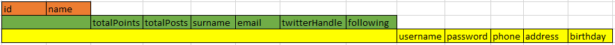
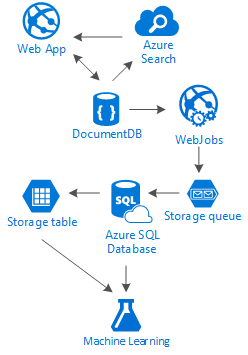

<properties 
    pageTitle="DocumentDB Entwurfsmuster: soziale Medien-apps | Microsoft Azure" 
    description="Erfahren Sie mehr über ein Entwurfsmuster für soziale Netzwerke durch die Speicherflexibilität DocumentDB und andere Dienste Azure Nutzung." 
    keywords="soziale Medien-apps"
    services="documentdb" 
    authors="ealsur" 
    manager="jhubbard" 
    editor="" 
    documentationCenter=""/>

<tags 
    ms.service="documentdb" 
    ms.workload="data-services" 
    ms.tgt_pltfrm="na" 
    ms.devlang="na" 
    ms.topic="article" 
    ms.date="09/27/2016" 
    ms.author="mimig"/>

# Mit DocumentDB für soziale Netzwerke vertraut

In einer massively miteinander verbunden Society Leben bedeutet, dass Sie an einem bestimmten Punkt in Nutzungsdauer Sie in einem **sozialen Netzwerk**integriert werden. Wir verwenden soziale Netzwerken an Freunde, Kollegen, Familie beibehalten oder manchmal Unsere Leidenschaft für Personen mit gemeinsamen Interessen freigeben.

Als Ingenieure oder Entwickler, wir möglicherweise haben gefragt, wie führen Sie diese Netzwerke speichern und Verbindung unsere Daten oder möglicherweise haben auch zum Erstellen oder Entwerfen eines neuen sozialen Netzwerks für eine bestimmte Nischenmarkt sich selbst Teamvorgänge betraut wurden. Das war wann tritt auf, die große Frage: wie alle diese Daten gespeichert werden?

Angenommen, wir ein neues und glänzendes soziales Netzwerk erstellen, in dem Artikel mit verwandten Medien wie Bilder, Videos oder sogar Musik unsere Benutzer gebucht werden kann. Benutzer können Beiträge kommentieren, und geben Sie Punkte für Bewertungen. Ein Feed der Beiträge, die Benutzern angezeigt wird, werden und werden auf der Startseite der Website Hauptfenster mit interagieren. Dies nicht wirklich komplex Klingeltöne (am ersten), aber aus Gründen der Vereinfachung, lassen Sie uns nicht mehr vorhanden (wir uns könnten, mit benutzerdefinierten Feeds Beziehungen auswirken, aber sie überschreitet das Ziel dieses Artikels).

Ja, wie wir dies speichern und wo?

Viele von Ihnen möglicherweise Erfahrung auf SQL-Datenbanken oder mindestens Konzept von [relationalen Daten modeling](https://en.wikipedia.org/wiki/Relational_model) haben und Sie möglicherweise dazu verleitet, mit dem Zeichnen ungefähr wie folgt aus:

 

Eine perfekte standardisierten und Tabellenteil Datenstruktur... die nicht skalieren. 

Nicht verstehen mich falsch, mit SQL-Datenbanken habe ich alle meine Nutzungsdauer gearbeitet, diese eignen sich hervorragend, aber wie jede Muster, Methode und Software-Plattform, es ist nicht für jedes Szenario.

Warum sind nicht die beste Option dar, in diesem Szenario SQL? Sehen wir uns die Struktur der einen einzelnen Beitrag, wenn ich in einer Website oder einer Anwendung, der dem Beitrag anzeigen ich tun würden zu einer Abfrage mit... Um nur einen einzigen Beitrag, nun Bild anzeigen ein Streams von Beiträgen, die dynamisch laden und angezeigt werden, klicken Sie auf dem Bildschirm, und Sie finden Sie unter möglicherweise, wo ich werde 8 Tabelle Verknüpfungen (!).

Wir konnten, eine SQL Server-Instanz humongous natürlich über ausreichend Leistung verwenden, um lösen Tausende von Abfragen mit folgenden viele Verknüpfungen zu dienen unsere Inhalte aber wirklich, warum wir würden, wenn eine einfachere Lösung vorhanden ist?

## Ständige NoSQL

Es sind spezielle Graph-Datenbanken, die [auf Azure ausführen](http://neo4j.com/developer/guide-cloud-deployment/#_windows_azure) können aber sind nicht preisgünstige und IaaS Services erforderlich (Infrastruktur als Dienst, virtuellen Computern hauptsächlich) und Wartung. Ich werde richten Sie den in diesem Artikel eine niedrigere Kosten-Lösung, die funktionieren in den meisten Fällen Azure des NoSQL Datenbank [DocumentDB](https://azure.microsoft.com/services/documentdb/)ausgeführt. Mit einem [NoSQL](https://en.wikipedia.org/wiki/NoSQL) Ansatz, die Daten im JSON-Format zu speichern und Anwenden von [Denormaliserung](https://en.wikipedia.org/wiki/Denormalization), kann unsere zuvor komplizierte Beitrag in ein einzelnes [Dokument](https://en.wikipedia.org/wiki/Document-oriented_database)umgewandelt werden:

    {
        "id":"ew12-res2-234e-544f",
        "title":"post title",
        "date":"2016-01-01",
        "body":"this is an awesome post stored on NoSQL",
        "createdBy":User,
        "images":["http://myfirstimage.png","http://mysecondimage.png"],
        "videos":[
            {"url":"http://myfirstvideo.mp4", "title":"The first video"},
            {"url":"http://mysecondvideo.mp4", "title":"The second video"}
        ],
        "audios":[
            {"url":"http://myfirstaudio.mp3", "title":"The first audio"},
            {"url":"http://mysecondaudio.mp3", "title":"The second audio"}
        ]
    }

Und mit keine Verknüpfungen und mit einer einzigen Abfrage abgerufen werden kann. Dies ist viel einfacher und recht einfach, und budget-wise, dies erforderlich macht weniger Ressourcen ein besseres Ergebnis erzielen.

Azure DocumentDB wird sichergestellt, dass alle, die die Eigenschaften für die [automatische Indizierung](documentdb-indexing.md), indiziert sind die gerade können [angepasst](documentdb-indexing-policies.md)werden. Der Schema frei Ansatz ermöglicht uns das Speichern von Dokumenten mit anderen und dynamische Strukturen, vielleicht morgen Beiträge in einer Liste von Kategorien oder Hashtags, die ihnen zugeordneten haben sollen, alle neuen Dokumente aus, mit der hinzugefügten Attribute mit ohne zusätzlichen Aufwand durch us-DocumentDB behandelt.

Kommentare auf einen Beitrag können als einfach in andere Beiträge mit einer übergeordneten Eigenschaft behandelt werden (Dies vereinfacht unsere Objekt-Zuordnung). 

    {
        "id":"1234-asd3-54ts-199a",
        "title":"Awesome post!",
        "date":"2016-01-02",
        "createdBy":User2,
        "parent":"ew12-res2-234e-544f"
    }

    {
        "id":"asd2-fee4-23gc-jh67",
        "title":"Ditto!",
        "date":"2016-01-03",
        "createdBy":User3,
        "parent":"ew12-res2-234e-544f"
    }

Und alle soziale Interaktionen auf ein anderes Objekt als Zähler gespeichert werden können:

    {
        "id":"dfe3-thf5-232s-dse4",
        "post":"ew12-res2-234e-544f",
        "comments":2,
        "likes":10,
        "points":200
    }

Erstellen von Feeds ist nur eine Frage Erstellen von Dokumenten, die eine Liste der Beitrag-Ids mit einer angegebenen Relevanz Reihenfolge enthalten kann:

    [
        {"relevance":9, "post":"ew12-res2-234e-544f"},
        {"relevance":8, "post":"fer7-mnb6-fgh9-2344"},
        {"relevance":7, "post":"w34r-qeg6-ref6-8565"}
    ]

Wir konnten "neuesten" Stream mit Beiträge sortiert nach dem Erstellungsdatum haben, ein "neuesten" Stream mit diesen Beiträge mit gefällt mehr in den letzten 24 Stunden, konnten wir auch einen benutzerdefinierten Stream für jeden Benutzer auf der Grundlage der Logik wie Followers und Interessen implementieren und wäre es immer noch eine Liste von Beiträgen. Es geht darum, wie Sie diese Listen erstellen, aber die Leistung Lesebereich ungehindert bleibt. Nachdem wir eine der folgenden Listen erfassen, senden wir eine einzelne Abfrage an alle DocumentDB mithilfe des [im Operator](documentdb-sql-query.md#where-clause) um Seiten von Beiträgen nacheinander zu erhalten.

Die Stare Streams mit [Azure App Services](https://azure.microsoft.com/services/app-service/) Hintergrundprozesse erstellt werden konnte: [Webjobs](../app-service-web/web-sites-create-web-jobs.md). Nachdem Sie ein Beitrag erstellt wurde, kann Hintergrund Verarbeitung mithilfe von [Azure-Speicher](https://azure.microsoft.com/services/storage/) [Warteschlangen](../storage/storage-dotnet-how-to-use-queues.md) und Webjobs ausgelöst wurde, mit dem [Azure Webjobs SDK](../app-service-web/websites-dotnet-webjobs-sdk.md), die Weitergabe Beitrag innerhalb Streams basierend auf eine eigene benutzerdefinierte Logik implementieren ausgelöst werden. 

Punkte und gefällt mir auf einen Beitrag können auf die gleiche Weise zum Erstellen einer Gelegenheit konsistenten Umgebung mit verzögert verarbeitet werden.

Followers sind schwieriger. DocumentDB weist 512Kb maximal Größe Dokument, damit Sie Speichern von Followers als ein Dokument mit dieser Struktur überlegen:

    {
        "id":"234d-sd23-rrf2-552d",
        "followersOf": "dse4-qwe2-ert4-aad2",
        "followers":[
            "ewr5-232d-tyrg-iuo2",
            "qejh-2345-sdf1-ytg5",
            //...
            "uie0-4tyg-3456-rwjh"
        ]
    }

Dies funktioniert für einen Benutzer mit wenigen Tausendertrennzeichen Followers, sondern, wenn einige Prominenten unsere Ränge, diesem Ansatz wird später verknüpft Treffer im Dokument Größe Linienende.

Um dieses Problem zu lösen, können wir einen gemischten Ansatz verwenden. Als Teil des Dokuments Benutzer Statistiken können wir die Anzahl der Followers speichern:

    {
        "id":"234d-sd23-rrf2-552d",
        "user": "dse4-qwe2-ert4-aad2",
        "followers":55230,
        "totalPosts":452,
        "totalPoints":11342
    }

Und Azure-Speicher Tabellen mithilfe einer [Erweiterung](https://github.com/richorama/AzureStorageExtensions#azuregraphstore) , einfache "A folgt B" Speichern und Abrufen ermöglicht, das ist-Diagramm des Followers gespeichert werden kann. Auf diese Weise können wir die Vorgehensweise zum Abrufen der genauen Followers Liste (Wenn sie benötigt) mit Azure-Speichertabellen, sondern auch für eine schnelle Zahlen Nachschlagen delegieren behalten wir DocumentDB verwenden.

## Die "Leiter" Muster und Daten Duplikate

Wie Sie in das JSON-Dokument, die auf einen Beitrag verweist bemerkt haben, gibt es mehrere Vorkommen eines Benutzers nachschlagen. Und würde haben richtig geraten rechts, dies bedeutet, dass die Informationen, die einen Benutzer, diese Denormaliserung, angegebenen darstellt möglicherweise in mehr als einer zentralen Stelle präsentieren.

Damit schneller Abfragen werden können, entstehen wir Kopien von Daten aus. Das Problem mit dieser Seite-Effekt ist, wenn durch eine Aktion ausführen, ein Benutzer Daten ändert, müssen wir finden alle Aktivitäten er jemals hat und aktualisieren sie alle. Nicht Sound sehr praktisch, rechts?

Graph-Datenbanken auf ihre Weise lösen, wir werden, indem Sie die Taste Attribute eines Benutzers nachschlagen, die wir in unserer Anwendung für jede Aktivität zeigen zu lösen. Wenn wir visuell einen Beitrag in unserer Anwendung anzeigen und nur der Ersteller des und Bild anzeigen, speichern alle Daten des Benutzers warum in das Attribut "CreatedBy"? Wenn für die einzelnen Kommentare wir gerade des Benutzers Bild angezeigt wird, benötigt nicht wirklich die restlichen seine Informationen. Hier kommt etwas ich "Leiter Muster" Anrufen in wiedergeben.

Werfen wir Benutzerinformationen als Beispiel:

    {
        "id":"dse4-qwe2-ert4-aad2",
        "name":"John",
        "surname":"Doe",
        "address":"742 Evergreen Terrace",
        "birthday":"1983-05-07",
        "email":"john@doe.com",
        "twitterHandle":"@john",
        "username":"johndoe",
        "password":"some_encrypted_phrase",
        "totalPoints":100,
        "totalPosts":24
    }
    
Betrachten Sie diese Informationen aus, können wir schnell erkennen, welche wichtige Informationen ist und die nicht angezeigt wird, wodurch einer "Leiter":

Der kleinste Schritt heißt eine UserChunk, die minimale Information, die ein Benutzer identifiziert und für Daten Duplikate verwendet wird. Verringern der Größe die doppelten Daten in nur die Informationen, die wir "anzeigen, wird", indem Sie reduzieren wir die Möglichkeit, umfangreiche Updates.

Im zweiten Schritt den Benutzer aufgerufen wird, sind die vollständigen Daten, die in den meisten Leistung abhängigen Abfragen auf DocumentDB, zugänglich und kritische verwendet werden soll. Sie enthält die Informationen, die durch eine UserChunk dargestellt werden.

Der größte ist der erweiterten Benutzer. Er enthält alle wichtige Benutzerinformationen sowie weitere Daten, die tatsächlich benötigt wird nicht, um schnell zu lesen oder seine Verwendung tatsächlichen (wie der Anmeldevorgang) ist. Diese Daten können außerhalb von DocumentDB, in Azure SQL-Datenbank oder Azure-Speichertabellen gespeichert werden.

Warum soll wir Teilen des Benutzers und speichern diese Informationen auch an anderen Speicherorten? Da Speicherplatz in DocumentDB [nicht unbegrenzte](documentdb-limits.md) ist und aus einer Leistung zeigen Sie auf Ansicht, desto größer der Dokumente, die costlier der Abfragen. Lassen Sie Dokumente schlanken, mit gültigen Informationen führen Sie die Leistung-abhängige Abfragen für Ihr soziales Netzwerk, und speichern die zusätzliche Informationen für den tatsächlichen Szenarien wie vollständiges Profil Bearbeitungen, Benutzernamen, sogar Datamining für Nutzungsanalysen und Big Data Initiativen. Wir wirklich egal, ob die Daten für Datamining tragen langsamer ist, da es auf Azure SQL-Datenbank ausgeführt wird, wir haben betreffen durch unsere Benutzer eine schnelle und schlanke Erfahrung haben. Ein Benutzer, die auf DocumentDB, gespeichert sind, sollte wie folgt aussehen:

    {
        "id":"dse4-qwe2-ert4-aad2",
        "name":"John",
        "surname":"Doe",
        "username":"johndoe"
        "email":"john@doe.com",
        "twitterHandle":"@john"
    }

Und ein Beitrag würde so aussehen:

    {
        "id":"1234-asd3-54ts-199a",
        "title":"Awesome post!",
        "date":"2016-01-02",
        "createdBy":{
            "id":"dse4-qwe2-ert4-aad2",
            "username":"johndoe"
        }
    }

Und eine Bearbeitung tritt auf, falls eines der Attribute des Abschnitts betroffen ist, ist einfach zu finden die betroffenen Dokumente mithilfe von Abfragen, die auf die indizierte Attribute verweisen (Wählen Sie * von Beiträgen p WHERE p.createdBy.id == "Edited_user_id") und dann die Blöcke aktualisieren.

## Das Suchfeld

Benutzer werden Glücklicherweise viel Inhalt generieren. Und wir sollten die Möglichkeit bieten, suchen und finden von Inhalten, die direkt in ihrer Inhalte Streams, vielleicht möglicherweise nicht, da wir die Ersteller nicht folgen können, oder vielleicht wir gerade versuchen, feststellen, dass die alte Beitrag konnten wir vor 6 Monaten.

Glücklicherweise und da wir Azure DocumentDB verwenden, können wir einfach implementieren ein Suchmodul mit [Azure suchen](https://azure.microsoft.com/services/search/) in ein paar Minuten und ohne eine einzelne Zeile mit Code (nur offensichtlich, dem Suchvorgang und Benutzeroberfläche) eingeben.

Warum ist dies so einfach?

Azure Suche implementiert, was sie [Indexer](https://msdn.microsoft.com/library/azure/dn946891.aspx), Hintergrundprozesse aufrufen, die in Ihrer Datenrepositorys einbinden und darin hinzufügen, aktualisieren oder Entfernen der Objekte in die Indizes festgelegt ist. Sie unterstützen ein [Indexer Azure SQL-Datenbank](https://blogs.msdn.microsoft.com/kaevans/2015/03/06/indexing-azure-sql-database-with-azure-search/), [Azure Blobs Indexer](../search/search-howto-indexing-azure-blob-storage.md) und Glücklicherweise [Azure DocumentDB Indexer](../documentdb/documentdb-search-indexer.md). Der Übergang Informationen aus DocumentDB Azure suchen recht einfach, beide Informationen im JSON-Format zu speichern, müssen wir nur [unseren Index erstellen](../search/search-create-index-portal.md) und welche Attribute von unsere Dokumente sollen Karte indiziert und befindet sich, in wenigen Minuten (hängt von der Größe der Daten), werden alle unsere Inhalte zur Verfügung, indem Sie die bestmögliche Lösung suchen als Dienst in der Cloud-Infrastruktur durchsucht werden. 

Weitere Informationen zur Azure suchen finden Sie auf der [Hitchhiker des Leitfadens zu suchen](https://blogs.msdn.microsoft.com/mvpawardprogram/2016/02/02/a-hitchhikers-guide-to-search/).

## Die zugrunde liegenden Kenntnisse

Nach dem Speichern dieses Inhaltstyps, die immer umfangreicher wird und wächst täglich, finden wir uns denken: wie kann ich mit diesem Streams Weg von Informationen aus meiner Benutzer?

Die Antwort ist einfach: setzen, um zu arbeiten, und erfahren Sie es.

Doch was können wir erfahren? Einige einfache Beispiele [Grüße Analyse](https://en.wikipedia.org/wiki/Sentiment_analysis), Inhalte Empfehlungen ausgehend von Einstellungen eines Benutzers oder sogar eine automatisierte Content Moderator, die wird sichergestellt, dass der gesamte Inhalt von unseren sozialen Netzwerk veröffentlicht für die Familie sicher ist.

Jetzt, da ich Sie verknüpft eingerichtet haben, werden Sie wahrscheinlich vorstellen, Sie benötigen einige PhD in Mathematik Wissenschaft, um diese Muster und Informationen von einfachen Datenbanken und Dateien zu extrahieren, aber Sie nicht mehr korrekt.

Ist [Azure maschinellen Schulung](https://azure.microsoft.com/services/machine-learning/), Teil der [Cortana Intelligence-Suite](https://www.microsoft.com/en/server-cloud/cortana-analytics-suite/overview.aspx)aus, die ein vollständig verwaltete Cloud-Dienst, den Sie Erstellen von Workflows mithilfe der Algorithmen in einer einfachen Drag and Drop-Benutzeroberfläche, ermöglicht Fehlercode Ihrer eigenen Algorithmen in [R](https://en.wikipedia.org/wiki/R_(programming_language)) , oder verwenden Sie einige der bereits erstellt und APIs verwenden, wie: [Text Analytics](https://gallery.cortanaanalytics.com/MachineLearningAPI/Text-Analytics-2), [Von dem Moderator melden](https://www.microsoft.com/moderator) oder [Vorschläge](https://gallery.cortanaanalytics.com/MachineLearningAPI/Recommendations-2)zu.

Um diese Szenarios maschinellen Learning zu erreichen, können wir [Azure Daten dem](https://azure.microsoft.com/services/data-lake-store/) verwenden, um die Informationen aus verschiedenen Quellen Aufnahme und [U-SQL](https://azure.microsoft.com/documentation/videos/data-lake-u-sql-query-execution/) verwenden, die Informationen zu verarbeiten und Generieren einer Ausgabe, die von Azure maschinellen Learning verarbeitet werden kann.

Eine andere verfügbare Option besteht darin, [Kognitive Dienste von Microsoft](https://www.microsoft.com/cognitive-services) verwenden, um unsere Benutzer Inhalt zu analysieren; nicht nur können wir verstehen sie besser (bis zu analysieren, was sie mit [Text Analytics-API](https://www.microsoft.com/cognitive-services/en-us/text-analytics-api)schreiben), sondern wir auch unerwünschte oder Reifen Inhalte erkennen und entsprechend vorgehen API [Sehschwäche Computer](https://www.microsoft.com/cognitive-services/en-us/computer-vision-api). Kognitive Dienste gehören zahlreiche Out-of-Box-Lösungen, die alle Arten von maschinellen Learning Knowledge verwenden nicht erforderlich ist.

## Abschluss

In diesem Artikel versucht, einige Light in die alternativen des Erstellens sozialer Netzwerken vollständig auf Azure mit LC-Diensten und Bereitstellen von hervorragende Ergebnisse durch die Verwendung einer Mehrstufige Speicher Lösung und Daten Verteilung namens "Leiter" fördern bringen.

Ist, dass es keine Silber Aufzählungszeichen für diese Art von Szenarien, es ist der Synergy erstellt durch die Kombination der hervorragende Dienstleistungen, mit denen uns großartige Erfahrung zu erstellen: der Geschwindigkeit und verschiedenste Azure DocumentDB, wenn eine hervorragende für soziale Netzwerke Anwendung, die Intelligence hinter einer Lösung für die herausragende Suche wie Azure Suche auch die Flexibilität von Azure App-Dienste Host sprachunabhängig Applikationen aber leistungsfähige Hintergrundprozesse und die erweiterbar Azure-Speicher und Azure SQL-Datenbank für nicht Speichern von großer Datenmengen und der analytischen Leistungsfähigkeit von Azure maschinellen Learning Knowledge und Intelligence, die für das Feedback an unsere Prozesse und Hilfe uns die richtige Inhalte an die richtigen Benutzer übermitteln kann.

## Nächste Schritte

Weitere Informationen zu den [Modellierung von Daten in DocumentDB](documentdb-modeling-data.md) Artikel modeling Daten. Wenn Sie in anderen Fällen wird DocumentDB interessiert sind, finden Sie unter [Allgemeine DocumentDB Anwendungsmöglichkeiten](documentdb-use-cases.md).

Oder erfahren Sie mehr über DocumentDB anhand der [DocumentDB Learning Path](https://azure.microsoft.com/documentation/learning-paths/documentdb/).
