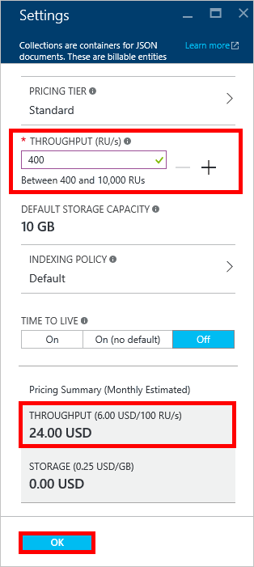

<properties 
    pageTitle="Verbesserte Verwendung Ihres Kontos DocumentDB S1 | Microsoft Azure" 
    description="Nutzen Sie höhere Durchsatz in Ihr Konto DocumentDB S1, indem Sie einige einfache Änderungen im Portal Azure machen." 
    services="documentdb" 
    authors="mimig1" 
    manager="jhubbard" 
    editor="monicar" 
    documentationCenter=""/>

<tags 
    ms.service="documentdb" 
    ms.workload="data-services" 
    ms.tgt_pltfrm="na" 
    ms.devlang="na" 
    ms.topic="article" 
    ms.date="08/25/2016" 
    ms.author="mimig"/>

# Verbesserte Verwendung Ihres Kontos DocumentDB

Wie folgt vor, um höhere Durchsatz für Ihr Konto Azure DocumentDB S1 nutzen. Mit kleinen, ohne zusätzliche Kosten können Sie den Durchsatz Ihrer vorhandenen S1-Konto vom 250 [RU/s](documentdb-request-units.md) bis 400 RU/s oder mehr erhöhen!  

> [AZURE.VIDEO changedocumentdbcollectionperformance]

## Ändern Sie auf benutzerdefinierter Performance Azure-Portal

1. Navigieren Sie in Ihrem Browser zu der [**Azure-Portal**](https://portal.azure.com). 
2. Klicken Sie auf **Durchsuchen** -> **DocumentDB (NoSQL)**, und wählen Sie dann das Konto DocumentDB zu ändern.   
3. Wählen Sie in der **Datenbanken** Lens die Datenbank zu ändern, und klicken Sie dann in der **Datenbank** Blade, wählen Sie die Sammlung mit der S1 Preisgestaltung Ebene.

      

4. Klicken Sie in der **Websitesammlung** Blade auf **Weitere**, und klicken Sie dann auf **Einstellungen**.   
5. Klicken Sie auf die **Preise in** das Blade **Einstellungen** und beachten Sie, dass die monatlichen Kosten Schätzung für jeden Plan angezeigt wird. Klicken Sie in das **Auswählen der Preisgestaltung Ebene** Blade auf **Standard**, und klicken Sie dann auf **Wählen Sie aus** , um die Änderungen zu speichern.

      

6. Zurück in das Blade **Einstellungen** die **Preise in** **Standard** geändert wird, und das **Durchsatz (RU/s)** mit einem Standardwert von 400 angezeigt wird. Klicken Sie auf **OK** , um die Änderungen zu speichern. 

    > [AZURE.NOTE] Sie können festlegen, dass den Durchsatz zwischen 400 und 10.000 [anfordern Einheiten](../articles/documentdb/documentdb-request-units.md)MHzProzessoren (RU/s). **Zusammenfassung Preise** am unteren Rand der Seite wird automatisch aktualisiert, um eine Schätzung der monatlichen Kosten bereitzustellen.
    
    

8. Klicken Sie auf die **Datenbank** Blade können Sie den FitNesse Durchsatz der Sammlung überprüfen. 

    

Weitere Informationen zu den Änderungen, die im Zusammenhang mit benutzerdefinierter und vordefinierte Durchsatz finden Sie im Blogbeitrag [DocumentDB: alle erforderlichen Informationen zum Verwenden der neuen Preisgestaltung Optionen](https://azure.microsoft.com/blog/documentdb-use-the-new-pricing-options-on-your-existing-collections/).

## Nächste Schritte

Wenn Sie feststellen, dass Sie weitere Durchsatz (größer als 10.000 RU/s) oder mehr Speicher (größer als 10 GB) erforderlich ist, können Sie eine partitionierte Websitesammlung erstellen. Zum Erstellen einer partitionierten Auflistung finden Sie unter [Erstellen einer Websitesammlung](documentdb-create-collection.md).