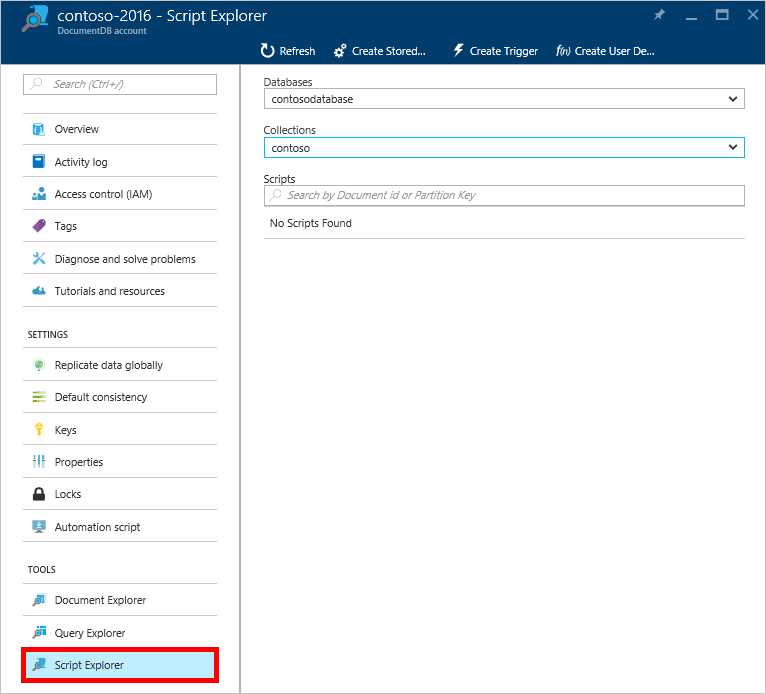
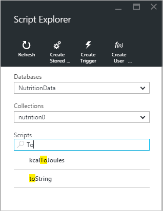
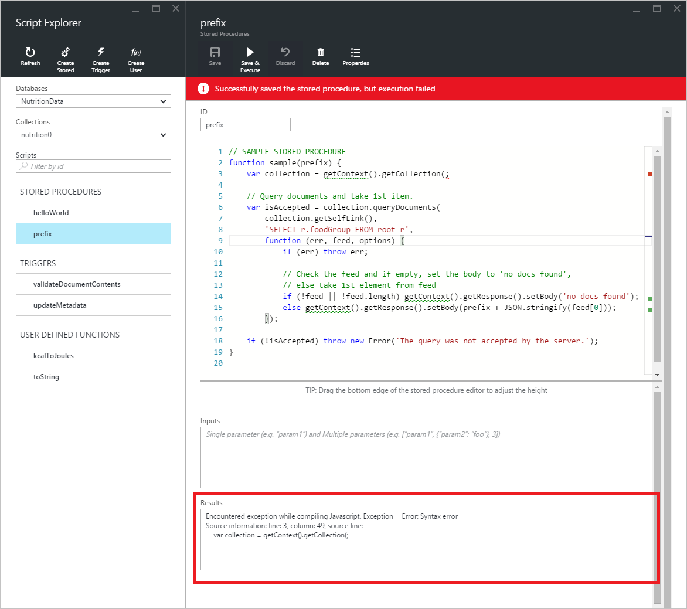

<properties
    pageTitle="DocumentDB Skript-Explorer, einem JavaScript-Editor | Microsoft Azure"
    description="Informationen Sie zu den DocumentDB Skript-Explorer ein Azure-Portal Tool zum Verwalten von DocumentDB serverseitige Programmierung Elemente einschließlich gespeicherten Prozeduren, Trigger und benutzerdefinierte Funktionen."
    keywords="JavaScript-editor"
    services="documentdb"
    authors="kirillg"
    manager="jhubbard"
    editor="monicar"
    documentationCenter=""/>

<tags
    ms.service="documentdb"
    ms.workload="data-services"
    ms.tgt_pltfrm="na"
    ms.devlang="na"
    ms.topic="article"
    ms.date="08/30/2016"
    ms.author="kirillg"/>

# Erstellen und Ausführen von gespeicherten Prozeduren, Trigger und benutzerdefinierte Funktionen, die mit dem DocumentDB Skript-Explorer

Dieser Artikel enthält eine Übersicht über die [Microsoft Azure DocumentDB](https://azure.microsoft.com/services/documentdb/) Skript-Explorer, also eine JavaScript-Editor im Azure-Portal, die Sie zum Anzeigen und Ausführen von DocumentDB serverseitige Programmierung Elemente einschließlich gespeicherten Prozeduren, Trigger und benutzerdefinierte Funktionen ermöglicht. Weitere Informationen über das DocumentDB serverseitigen Programmieren im Artikel [gespeicherte Prozeduren, Datenbanktrigger, und UDFs](documentdb-programming.md) finden.

## Skript-Explorer starten

1. Klicken Sie im Portal Azure in der Jumpbar auf **DocumentDB (NoSQL)**. Wenn **DocumentDB Konten** nicht angezeigt wird, klicken Sie auf **Weitere Dienste** , und klicken Sie dann auf **DocumentDB (NoSQL)**.

2. Klicken Sie auf **Skript-Explorer**, klicken Sie im Menü Ressourcen.

    
 
    Die **Sammlung** von **Datenbank** und Dropdown-Listenfeld Felder werden je nach Kontext automatisch ausgefüllt, in denen Sie Skript-Explorer starten.  Wenn Sie aus einer Datenbank Blade starten, beträgt beispielsweise dann die aktuelle Datenbank vorab eingetragenen.  Wenn Sie aus einer Websitesammlung Blade starten, wird die aktuelle Auflistung vorab eingetragenen.

4.  Verwenden Sie die **Datenbank** und **Websitesammlung** Dropdown-Listenfeld Felder auf einfache Weise die Sammlung ändern, aus der Skripts belegt sind ohne zu schließen und erneut starten Skript-Explorer.  

5. Skript-Explorer unterstützt auch den aktuell geladen Satz von Skripts anhand ihrer Id-Eigenschaft filtern.  Geben Sie einfach in das Feld Filter ein, und die Ergebnisse in der Liste Skript-Explorer basierend auf der angegebenen Kriterien gefiltert werden.

    

    > [AZURE.IMPORTANT] Skript-Explorer Filtern Funktionalität nur Filter aus der ***aktuell*** geladen Skripts und die aktuell ausgewählte Auflistung nicht automatisch aktualisiert.

5. Um die Liste der von Skript-Explorer geladen Skripts zu aktualisieren, klicken Sie einfach auf den Befehl **Aktualisieren** im Kopfbereich des Blades.

    

## Erstellen, anzeigen und Bearbeiten von gespeicherten Prozeduren, Trigger und benutzerdefinierte Funktionen

Skript-Explorer können Sie leicht Vorgänge auf DocumentDB serverseitige Programmierung Elemente durchführen.  

- Um ein Skript zu erstellen, indem Sie auf dem entsprechenden erstellen Befehl heraus Skript-Explorer, eine Id angeben, geben Sie den Inhalt des Skripts und klicken Sie auf **Speichern**.

    

- Beim Erstellen eines Triggers müssen Sie auch den Auslösevorgang, Typ und der Trigger angeben

    

- Wenn ein Skript anzeigen möchten, klicken Sie einfach auf das Skript, in dem Sie interessiert sind.

    

- Um ein Skript zu bearbeiten, nehmen Sie die gewünschten Änderungen in der JavaScript Editor und klicken Sie auf **Speichern**.

    

- Um ausstehenden Änderungen an ein Skript zu verwerfen, klicken Sie einfach auf den Befehl **verwerfen** .

    

- Skript-Explorer können Sie einfach Systemeigenschaften des aktuell geladen Skripts anzeigen, indem Sie auf den Befehl ' **Eigenschaften** '.

    

    > [AZURE.NOTE] Die Eigenschaft Zeitstempel (_ts) wird als Epoche Zeit intern dargestellt, aber Skript-Explorer zeigt den Wert in einem lesbaren personenbezogenen GMT-Format.

- Um ein Skript zu löschen, wählen Sie ihn in Skript-Explorer, und klicken Sie auf den Befehl **Löschen** .

    

- Bestätigen Sie die Löschaktion, indem Sie auf **Ja** , oder heben Sie die Löschaktion, indem Sie **keine**.

    

## Ausführen einer gespeicherten Prozedur

> [AZURE.WARNING] Ausführen von gespeicherten Prozeduren in Skript-Explorer wird noch für Server aufgeteilt Seite Websitesammlungen nicht unterstützt. Weitere Informationen finden Sie auf [Partitioning und Skalierung in DocumentDB](documentdb-partition-data.md).

Skript-Explorer können Sie serverseitigen gespeicherte Prozeduren vom Azure-Portal ausführen.

- Beim Öffnen eines neuen erstellen, die gespeicherte Prozedur Blades, wird eine Standardskript (*Präfix*) bereits bereitgestellt werden. Um das *Präfix* Skript oder Ihr eigenes Skript ausführen zu können, fügen Sie eine *Id* und *Eingaben*hinzu. Für gespeicherte Prozeduren, die mehrere Parameter akzeptieren, müssen alle Eingaben innerhalb einer Matrix zurück (z. B. *["Foo", "Bar"]*).

    

- Wenn Sie eine gespeicherte Prozedur ausführen zu können, klicken Sie einfach auf den Befehl **Speichern, und führen Sie** im Bereich der Skript-Editor.

    > [AZURE.NOTE] Der Befehl **Speichern & Ausführen** wird die gespeicherte Prozedur vor dem Ausführen, speichern, was bedeutet, dass sie die zuvor gespeicherte Version der gespeicherten Prozedur überschrieben werden.

- Erfolgreiche gespeicherte Prozedur Ausführungen Status *erfolgreich gespeichert und die gespeicherte Prozedur ausgeführt* werden und die zurückgegebenen Ergebnisse werden im *Ergebnisbereich* ausgefüllt werden.

    

- Wenn die Ausführung ein Fehler auftritt, wird der Fehler im *Ergebnisbereich* aufgefüllt.

    

## Arbeiten Sie mit Skripts außerhalb des Portals

Skript-Explorer Azure-Portal ist nur eine Möglichkeit für die Arbeit mit gespeicherten Prozeduren, Trigger und benutzerdefinierte Funktionen in DocumentDB. Sie können auch arbeiten mit Skripts mit der die REST-API und dem [Client SDKs](documentdb-sdk-dotnet.md). Die REST-API-Dokumentation enthält Beispiele für das Arbeiten mit [gespeicherten Prozeduren Verwendung von REST](https://msdn.microsoft.com/library/azure/mt489092.aspx), [benutzerdefinierte Funktionen, die Verwendung von REST](https://msdn.microsoft.com/library/azure/dn781481.aspx)und [Trigger Verwendung von REST](https://msdn.microsoft.com/library/azure/mt489116.aspx). Beispiele sind auch verfügbar mit zum [Arbeiten mit Skripts mit c#](documentdb-dotnet-samples.md#server-side-programming-examples) und [Arbeiten mit Skripts Node.js verwenden](documentdb-nodejs-samples.md#server-side-programming-examples).

## Nächste Schritte

Weitere Informationen zu DocumentDB serverseitige Programmierung im Artikel [gespeicherte Prozeduren, Datenbanktrigger, und UDFs](documentdb-programming.md) .

Der [Learning Path](https://azure.microsoft.com/documentation/learning-paths/documentdb/) ist auch eine nützliche Ressource zu steuern, während Sie Informationen zur DocumentDB Weitere.  
