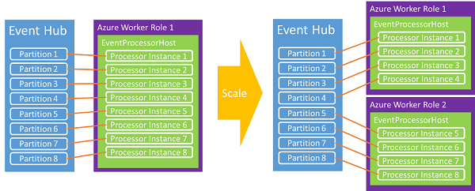

<properties 
    pageTitle="Programmierung Leitfaden für Azure Ereignis Hubs | Microsoft Azure"
    description="Beschreibt die Programmierung mit Azure Ereignis Hubs Azure .NET SDK verwenden."
    services="event-hubs"
    documentationCenter="na"
    authors="sethmanheim"
    manager="timlt"
    editor="" />
<tags 
    ms.service="event-hubs"
    ms.devlang="na"
    ms.topic="get-started-article"
    ms.tgt_pltfrm="na"
    ms.workload="tbd"
    ms.date="08/16/2016"
    ms.author="sethm" />

# <a name="event-hubs-programming-guide"></a>Ereignis Hubs programming guide

In diesem Thema werden die Programmierung mit Azure Ereignis Hubs mit dem Azure .NET SDK. Es wird ein Ereignis Hubs über der vorläufigen Verständnis angenommen. Eine konzeptionelle Übersicht Ereignis Hubs finden Sie unter dem [Ereignis Hubs Übersicht](event-hubs-overview.md).

## <a name="event-publishers"></a>Ereignisherausgeber

Senden von Ereignissen zu einem Ereignis Hub erfolgt entweder über HTTP bereitstellen oder über eine Verbindung AMQP 1.0. Die Wahl der wann verwenden, hängt von dem jeweiligen Szenario berücksichtigt werden. AMQP 1.0-Verbindungen als vermittelten Verbindungen in Dienstbus getaktete sind und Szenarios mit häufig verwendeten größeren Nachricht Mengen und unteren Wartezeit systemvoraussetzungen und besser geeignet sind, wie sie einen beständigen messaging Kanal bieten.

Erstellen und Verwalten von Ereignis Hubs mithilfe der Klasse [NamespaceManager](https://msdn.microsoft.com/library/azure/microsoft.servicebus.namespacemanager.aspx) . Wenn die APIs mit .NET verwaltet werden, werden die primäre Konstrukte für die Veröffentlichung von Daten auf Ereignis Hubs [EventHubClient](https://msdn.microsoft.com/library/azure/microsoft.servicebus.messaging.eventhubclient.aspx) und [EventData](https://msdn.microsoft.com/library/azure/microsoft.servicebus.messaging.eventdata.aspx) Klassen sind. [EventHubClient](https://msdn.microsoft.com/library/azure/microsoft.servicebus.messaging.eventhubclient.aspx) stellt den AMQP Kommunikationskanal über dem Ereignisse an den Hub Ereignis gesendet werden. Die [EventData](https://msdn.microsoft.com/library/azure/microsoft.servicebus.messaging.eventdata.aspx) Klasse stellt ein Ereignis dar und wird verwendet, um Nachrichten an ein Ereignis Hub zu veröffentlichen. Diese Klasse beinhaltet Textkörper, einige Metadaten und Kopfzeileninformationen über das Ereignis. Andere Eigenschaften werden beim passieren ein Ereignis Hub umfasst das Objekt [EventData](https://msdn.microsoft.com/library/azure/microsoft.servicebus.messaging.eventdata.aspx) hinzugefügt.

## <a name="get-started"></a>Erste Schritte

.NET Klassen, die Ereignis Hubs unterstützen, werden in der Microsoft.ServiceBus.dll Assembly bereitgestellt. Die einfachste Möglichkeit zum Verweisen auf die Bus-API und so konfigurieren Sie die Anwendung mit allen die Abhängigkeiten Dienstbus ist der [Dienst Bus NuGet-Paket](https://www.nuget.org/packages/WindowsAzure.ServiceBus)herunterladen. Alternativ können Sie das [Paket-Manager-Konsole](http://docs.nuget.org/docs/start-here/using-the-package-manager-console) in Visual Studio verwenden. Geben Sie hierzu den folgenden Befehl aus, klicken Sie im [Paket-Manager-Konsole](http://docs.nuget.org/docs/start-here/using-the-package-manager-console) aus:

```
Install-Package WindowsAzure.ServiceBus
```

## <a name="create-an-event-hub"></a>Erstellen Sie einen Ereignis Hub

Die Klasse [NamespaceManager](https://msdn.microsoft.com/library/azure/microsoft.servicebus.namespacemanager.aspx) können Hubs Ereignis zu erstellen. Beispiel:

```
var manager = new Microsoft.ServiceBus.NamespaceManager("mynamespace.servicebus.windows.net");
var description = manager.CreateEventHub("MyEventHub");
```

In den meisten Fällen empfiehlt es sich, dass Sie die [CreateEventHubIfNotExists](https://msdn.microsoft.com/library/azure/microsoft.servicebus.namespacemanager.createeventhubifnotexists.aspx) Methoden verwenden, um zu vermeiden, Ausnahmen generiert wird, wenn der Dienst neu gestartet wird. Beispiel:

```
var description = manager.CreateEventHubIfNotExists("MyEventHub");
```

Alle Ereignis Hubs Erstellung Vorgänge, einschließlich [CreateEventHubIfNotExists](https://msdn.microsoft.com/library/azure/microsoft.servicebus.namespacemanager.createeventhubifnotexists.aspx), erfordern **Verwalten** von Berechtigungen für den betreffenden Namespace. Wenn Sie die Berechtigungen für Ihre Publisher oder Consumer Applikationen einschränken möchten, können Sie diese vermeiden Vorgang Anrufe Herstellung Code erstellen, wenn Sie die Anmeldeinformationen mit eingeschränkten Berechtigungen verwenden.

Die [EventHubDescription](https://msdn.microsoft.com/library/azure/microsoft.servicebus.messaging.eventhubdescription.aspx) -Klasse enthält Details zu einem Ereignis-Hub, einschließlich die Autorisierungsregeln, die Nachricht Aufbewahrung Intervall, Partition IDs, Status und Pfad. Sie können diese Klasse verwenden, die Metadaten für ein Ereignis Hub zu aktualisieren.

## <a name="create-an-event-hubs-client"></a>Erstellen Sie einen Ereignis Hubs client

Die primäre Klasse für die Interaktion mit Ereignis Hubs ist [Microsoft.ServiceBus.Messaging.EventHubClient](https://msdn.microsoft.com/library/azure/microsoft.servicebus.messaging.eventhubclient.aspx). Diese Klasse bietet Funktionen, die Absender und Empfänger. Sie können diese mithilfe der Methode [Erstellen](https://msdn.microsoft.com/library/azure/microsoft.servicebus.messaging.eventhubclient.create.aspx) Klasse instanziieren, wie im folgenden Beispiel dargestellt.

```
var client = EventHubClient.Create(description.Path);
```

Diese Methode verwendet die Verbindungsinformationen Dienstbus in der App in den `appSettings` Abschnitt. Ein Beispiel für die `appSettings` XML verwendet, um die Verbindungsinformationen Dienstbus speichern finden Sie in der Dokumentation für die Methode [Microsoft.ServiceBus.Messaging.EventHubClient.Create(System.String)](https://msdn.microsoft.com/library/azure/microsoft.servicebus.messaging.eventhubclient.create.aspx) .

Eine weitere Möglichkeit besteht im Erstellen des Clients aus einer Verbindungszeichenfolge. Diese Option eignet gut Azure Worker-Rollen, da Sie die Zeichenfolge in der Konfigurationseigenschaften für die Worker speichern können. Beispiel:

```
EventHubClient.CreateFromConnectionString("your_connection_string");
```

Die Verbindungszeichenfolge werden in dem Format, wie er in der App für die vorherigen Methoden angezeigt wird:

```
Endpoint=sb://[namespace].servicebus.windows.net/;SharedAccessKeyName=Manage;SharedAccessKey=[key]
```

Schließlich kann es auch zum Erstellen eines [EventHubClient](https://msdn.microsoft.com/library/azure/microsoft.servicebus.messaging.eventhubclient.aspx) -Objekts aus einer [MessagingFactory](https://msdn.microsoft.com/library/azure/microsoft.servicebus.messaging.messagingfactory.aspx) -Instanz, wie im folgenden Beispiel gezeigt.

```
var factory = MessagingFactory.CreateFromConnectionString("your_connection_string");
var client = factory.CreateEventHubClient("MyEventHub");
```

Es ist wichtig, beachten Sie, dass die gleiche zugrunde liegenden TCP-Verbindung zusätzliche [EventHubClient](https://msdn.microsoft.com/library/azure/microsoft.servicebus.messaging.eventhubclient.aspx) -Objekte, die aus einem messaging Factory-Instanz erstellt wiederverwendet. Daher müssen diese Objekte maximal clientseitige auf Durchsatz. [Die Methode](https://msdn.microsoft.com/library/azure/microsoft.servicebus.messaging.eventhubclient.create.aspx) verwendet eine einzelne messaging Factory wieder. Wenn Sie einen sehr hohen Durchsatz von einem einzelnen Absender benötigen, können Sie mehrere Nachricht Factory und ein [EventHubClient](https://msdn.microsoft.com/library/azure/microsoft.servicebus.messaging.eventhubclient.aspx) Objekt aus jeder messaging Factory erstellen.

## <a name="send-events-to-an-event-hub"></a>Ereignisse an ein Ereignis Verteiler senden

Sie senden Ereignisse an einen Ereignis-Hub an, indem eine [EventData](https://msdn.microsoft.com/library/azure/microsoft.servicebus.messaging.eventdata.aspx) -Instanz erstellen und senden Sie sie über die Methode [Senden](https://msdn.microsoft.com/library/azure/microsoft.servicebus.messaging.eventhubclient.send.aspx) . Diese Methode akzeptiert einen einzigen [EventData](https://msdn.microsoft.com/library/azure/microsoft.servicebus.messaging.eventdata.aspx) Instanzparameter und sendet sie synchron an einen Hub Ereignis.

## <a name="event-serialization"></a>Ereignis Serialisierung

Die [EventData](https://msdn.microsoft.com/library/azure/microsoft.servicebus.messaging.eventdata.aspx) -Klasse hat [vier überladenen Konstruktoren](https://msdn.microsoft.com/library/azure/microsoft.servicebus.messaging.eventdata.eventdata.aspx) , die eine Vielzahl von Parametern, wie ein Objekt und Serialisierungsprogramm, ein Byte-Array oder einen Stream. Es ist auch möglich, Instanz die Klasse [EventData](https://msdn.microsoft.com/library/azure/microsoft.servicebus.messaging.eventdata.aspx) erstellt, und setzen Sie den Textkörper Stream danach. Bei Verwendung von JSON mit [EventData](https://msdn.microsoft.com/library/azure/microsoft.servicebus.messaging.eventdata.aspx)können **Encoding.UTF8.GetBytes()** Sie die Bytes für eine JSON-codierte Zeichenfolge abzurufen.

## <a name="partition-key"></a>Partitionsschlüssel

Die [EventData](https://msdn.microsoft.com/library/azure/microsoft.servicebus.messaging.eventdata.aspx) -Klasse verfügt über eine [PartitionKey](https://msdn.microsoft.com/library/azure/microsoft.servicebus.messaging.eventdata.partitionkey.aspx) -Eigenschaft, die den Absender, einen Wert angeben, der zum Erstellen einer Zuordnungs Partition gehasht ist aktiviert. Verwenden einer Partitionsschlüssel wird sichergestellt, dass alle Ereignisse mit demselben Schlüssel auf dieselbe Partition im Hub gesendet werden. Allgemeine Partition Tasten gehören Benutzer Sitzung IDs und eindeutigen Absender IDs. Die Eigenschaft [PartitionKey](https://msdn.microsoft.com/library/azure/microsoft.servicebus.messaging.eventdata.partitionkey.aspx) ist optional und kann angegeben werden, wenn Sie die [Microsoft.ServiceBus.Messaging.EventHubClient.Send(Microsoft.ServiceBus.Messaging.EventData)](https://msdn.microsoft.com/library/azure/microsoft.servicebus.messaging.eventdata.aspx) oder [Microsoft.ServiceBus.Messaging.EventHubClient.SendAsync(Microsoft.ServiceBus.Messaging.EventData)](https://msdn.microsoft.com/library/azure/microsoft.servicebus.messaging.eventdata.aspx) Methoden verwenden. Wenn Sie keinen Wert für [PartitionKey](https://msdn.microsoft.com/library/azure/microsoft.servicebus.messaging.eventdata.partitionkey.aspx)bereitstellt, werden die gesendeten Ereignisse auf mithilfe eines Modells Round-Robert verteilt.

## <a name="batch-event-send-operations"></a>Stapel Ereignis Sendevorgänge

Senden von Ereignissen stapelweise wächst Durchsatz erheblich. Die Methode [SendBatch](https://msdn.microsoft.com/library/azure/microsoft.servicebus.messaging.eventhubclient.sendbatch.aspx) verwendet einen Parameter **IEnumerable** vom Typ [EventData](https://msdn.microsoft.com/library/azure/microsoft.servicebus.messaging.eventdata.aspx) und sendet den gesamten Stapel einem an den Hub Ereignis.

```
public void SendBatch(IEnumerable<EventData> eventDataList);
```

Beachten Sie, dass der maximal 256 KB eines Ereignisses von ein einzigen Stapel nicht überschreiten darf. Darüber hinaus verwendet für jede Nachricht in den Stapel die gleichen Publisher-Identität. Es ist den Zuständigkeitsbereich Absender, stellen Sie sicher, dass der Stapel nicht die maximale Größe von Ereignisprotokollen Größe übersteigt. Ist dies der Fall ist, wird ein Client **Senden** Fehler ausgelöst.

## <a name="send-asynchronously-and-send-at-scale"></a>Asynchrone Senden und bei senden

Sie können auch asynchrone Ereignisse an ein Ereignis Verteiler senden. Asynchrone senden kann die Geschwindigkeit erhöhen, an der ein Client Ereignisse senden kann. [Senden](https://msdn.microsoft.com/library/azure/microsoft.servicebus.messaging.eventhubclient.send.aspx) und [SendBatch](https://msdn.microsoft.com/library/azure/microsoft.servicebus.messaging.eventhubclient.sendbatch.aspx) Methoden stehen in asynchrone Versionen, die ein [Task](https://msdn.microsoft.com/library/system.threading.tasks.task.aspx) -Objekt zurückgeben. Während dieses Verfahren Durchsatz erhöhen kann, sie können auch dazu führen, dass den Client Ereignisse zu senden, während der vom Dienst Ereignis Hubs gedrosselt wird weiterhin und kann dazu führen, in der Client bei Fehlern oder verlorene Nachrichten Wenn Sie nicht ordnungsgemäß implementiert. Darüber hinaus können Sie die Eigenschaft [RetryPolicy](https://msdn.microsoft.com/library/azure/microsoft.servicebus.messaging.cliententity.retrypolicy.aspx) auf dem Client Client "Wiederholen"-Steueroptionen.

## <a name="create-a-partition-sender"></a>Erstellen eines Absenders partition

Zwar am häufigsten verwendeten Ereignisse an ein Ereignis Verteiler mit Partitionsschlüssel senden, sollten Sie in einigen Fällen direkt auf eine bestimmte Partition Ereignisse zu senden. Beispiel:

```
var partitionedSender = client.CreatePartitionedSender(description.PartitionIds[0]);
```

[CreatePartitionedSender](https://msdn.microsoft.com/library/azure/microsoft.servicebus.messaging.eventhubclient.createpartitionedsender.aspx) gibt ein [EventHubSender](https://msdn.microsoft.com/library/azure/microsoft.servicebus.messaging.eventhubsender.aspx) -Objekt, das Sie, zum Veröffentlichen von Ereignissen zu einem bestimmten Ereignis Hub Partition verwenden können.

## <a name="event-consumers"></a>Ereignisempfänger

Ereignis Hubs weist zwei primären Modelle für Ereignis Ernährung: direkte Empfängern und Abstraktionen höherer Ebenen ein, wie z. B. [EventProcessorHost](https://msdn.microsoft.com/library/azure/microsoft.servicebus.messaging.eventprocessorhost.aspx). Direkte Empfänger sind eigene Koordinierung des Zugriffs auf innerhalb einer Gruppe Consumer verantwortlich.

### <a name="direct-consumer"></a>Direkte consumer

Am einfachsten lesbare aus einer-Abschnitt innerhalb einer Gruppe Consumer besteht darin, die Klasse [EventHubReceiver](https://msdn.microsoft.com/library/azure/microsoft.servicebus.messaging.eventhubreceiver.aspx) verwenden. Um eine Instanz dieser Klasse erstellen zu können, müssen Sie eine Instanz der Klasse [EventHubConsumerGroup](https://msdn.microsoft.com/library/azure/microsoft.servicebus.messaging.eventhubconsumergroup.aspx) verwenden. Im folgenden Beispiel muss die Partitions-ID angegeben werden, wenn den Empfänger für die Gruppe Consumer zu erstellen.

```
EventHubConsumerGroup group = client.GetDefaultConsumerGroup();
var receiver = group.CreateReceiver(client.GetRuntimeInformation().PartitionIds[0]);
```

Die [CreateReceiver](https://msdn.microsoft.com/library/azure/microsoft.servicebus.messaging.eventhubconsumergroup.createreceiver.aspx) -Methode hat mehrere überladenen, die Kontrolle über den zu erstellenden Reader zu erleichtern. Diese Methoden umfassen die Angabe eines Offsets als Zeichenfolge oder Zeitstempel und die Möglichkeit, um anzugeben, ob dies umfassen angegeben Offset zurückgegebenen Stream oder Start dahinter. Nachdem Sie den Empfänger erstellt haben, können Sie beginnen, Empfang von Ereignissen für das zurückgegebene Objekt. [Receive](https://msdn.microsoft.com/library/azure/microsoft.servicebus.messaging.eventhubreceiver.receive.aspx) -Methode hat vier überladenen, die steuern, die empfangen Vorgangsparameter, z. B. Stapelgröße und Wartezeit. Die asynchronen Versionen der folgenden Methoden können Sie um den Durchsatz der Consumer zu erhöhen. Beispiel:

```
bool receive = true;
string myOffset;
while(receive)
{
    var message = receiver.Receive();
    myOffset = message.Offset;
    string body = Encoding.UTF8.GetString(message.GetBytes());
    Console.WriteLine(String.Format("Received message offset: {0} \nbody: {1}", myOffset, body));
}
```

In Bezug auf eine bestimmte Partition werden die Nachrichten in der Reihenfolge empfangen, in denen sie das Ereignis Hub gesendet wurden. Der Offset ist ein Zeichenfolgentoken verwendet, um eine Nachricht in einer Partition zu identifizieren.

Beachten Sie, dass eine einzelne Partition innerhalb einer Gruppe Consumer mehr als 5 Leser gleichzeitig zu einem beliebigen Zeitpunkt verbunden haben kann. Leser verbinden oder unterbrochen, möglicherweise ihre Sitzungen aktiv bleiben für einige Minuten, bevor der Dienst erkennt, dass sie die Verbindung getrennt haben. Wiederherstellen der Verbindung mit einer Partition möglicherweise während dieses Zeitraums fehl. Ein vollständiges Beispiel von einem direkten Empfänger für Ereignis Hubs schreiben finden Sie unter der Stichprobe [Service Bus Hubs direkte Ereignisempfänger](https://code.msdn.microsoft.com/Event-Hub-Direct-Receivers-13fa95c6) .

### <a name="event-processor-host"></a>Ereignis Prozessor host

Die Klasse [EventProcessorHost](https://msdn.microsoft.com/library/azure/microsoft.servicebus.messaging.eventprocessorhost.aspx) verarbeitet Daten aus dem Ereignis Hubs. Beim Erstellen von Ereignis Leser über den Datenzugriffsdiensten, sollten Sie diese Implementierung verwenden. [EventProcessorHost](https://msdn.microsoft.com/library/azure/microsoft.servicebus.messaging.eventprocessorhost.aspx) bietet eine Thread-sicher, mehrere Prozess, sicherer Runtime-Umgebung für Ereignis Prozessor Implementierungen, die auch geänderte und Partition verleasen Management bereitstellt.

Wenn die Klasse [EventProcessorHost](https://msdn.microsoft.com/library/azure/microsoft.servicebus.messaging.eventprocessorhost.aspx) verwenden möchten, können Sie [IEventProcessor](https://msdn.microsoft.com/library/azure/microsoft.servicebus.messaging.ieventprocessor.aspx)implementieren. Diese Schnittstelle enthält drei Methoden:

- [OpenAsync](https://msdn.microsoft.com/library/azure/microsoft.servicebus.messaging.ieventprocessor.openasync.aspx)

- [CloseAsync](https://msdn.microsoft.com/library/azure/microsoft.servicebus.messaging.ieventprocessor.closeasync.aspx)

- [ProcessEventsAsync](https://msdn.microsoft.com/library/azure/microsoft.servicebus.messaging.ieventprocessor.processeventsasync.aspx)

Um die Verarbeitung von Ereignissen zu instanziieren, [EventProcessorHost](https://msdn.microsoft.com/library/azure/microsoft.servicebus.messaging.eventprocessorhost.aspx), Angeben der entsprechenden Parameter für Ihre Veranstaltung Hub. Rufen Sie dann [RegisterEventProcessorAsync](https://msdn.microsoft.com/library/azure/microsoft.servicebus.messaging.eventprocessorhost.registereventprocessorasync.aspx) , um die Implementierung [IEventProcessor](https://msdn.microsoft.com/library/azure/microsoft.servicebus.messaging.ieventprocessor.aspx) mit der Laufzeit zu registrieren. An dieser Stelle versucht der Host einer verleasen auf jeder Partition im Hub mit einem "gierige" Algorithmus erwerben. Diese Leasingverträge eines bestimmten Zeitrahmens dauert und dann erneuert werden müssen. Als neue Knoten Worker Instanzen in diesem Fall online geschaltet, verleasen Reservierungen zu platzieren, und über die Anzeigedauer der laden Übergänge zwischen Knoten als jede Versuche, weitere Leases zu erwerben.



Im Laufe der Zeit wird eine Gleichgewichtszustand eingerichtet. Diese Funktion dynamische ermöglicht automatische CPU-basierten Skalierung, Nutzer für sowohl vergrößern und zu skalieren Dropdownfeld angewendet werden. Da Ereignis Hubs eine direkte Konzepts der Nachricht zählt nicht verfügen, ist durchschnittliche CPU-Auslastung oft die beste Möglichkeit zurück Ende oder Consumer Maßstab messen. Wenn Herausgeber beginnen, veröffentlichen mehr Ereignisse als Nutzer verarbeitet werden können, kann der CPU erhöhen auf Nutzer verwendet werden, eine automatische Skalierung auf die Anzahl der Instanzen Worker verursachen.

Die [EventProcessorHost](https://msdn.microsoft.com/library/azure/microsoft.servicebus.messaging.eventprocessorhost.aspx) -Klasse implementiert auch einen Azure-Speicher-basierten geänderte bereit. Dieses Verfahren speichert den Offset auf Grundlage einer pro Partition, damit jeder Consumer feststellen kann, was der letzte Prüfpunkt aus der vorherigen Consumer wurde. Wie teilt den Übergang zwischen Knoten über Leases, ist dies der Synchronisierung Verfahren, das Laden verlagern erleichtert.

## <a name="publisher-revocation"></a>Publisher-Sperrung

Zusätzlich zu den erweiterten Laufzeit-Features von [EventProcessorHost](https://msdn.microsoft.com/library/azure/microsoft.servicebus.messaging.eventprocessorhost.aspx)ermöglicht Ereignis Hubs Publisher Sperrung akzeptieren, um bestimmte Herausgeber von Ereignis an ein Ereignis Verteiler senden blockieren. Diese Features sind besonders hilfreich, wenn ein Token Publisher gefährdet oder ein Softwareupdates verursacht, damit Sie nicht ordnungsgemäß Verhalten. In diesen Fällen kann die Identität des Herausgebers, deren SAS Token, die gehört, für die Veröffentlichung von Ereignissen blockiert werden.

Weitere Informationen zu Publisher-Sperrung und Informationen zum Senden an Ereignis Hubs Herausgeber finden Sie unter der Stichprobe [Ereignis Hubs großen Maßstab Secure veröffentlichen](https://code.msdn.microsoft.com/Service-Bus-Event-Hub-99ce67ab) .

## <a name="next-steps"></a>Nächste Schritte

Weitere Informationen zum Ereignis Hubs Szenarien finden Sie auf folgenden Links:

- [Ereignis Hubs API (Übersicht)](event-hubs-api-overview.md)
- [Ereignis Hubs (Übersicht)](event-hubs-overview.md)
- [Ereignis Hubs Codebeispielen](http://code.msdn.microsoft.com/site/search?query=event hub&f[0].Value=event hub&f[0].Type=SearchText&ac=5)
- [Ereignis Prozessor Host-API-Referenz](https://msdn.microsoft.com/library/azure/microsoft.servicebus.messaging.eventprocessorhost.aspx)
