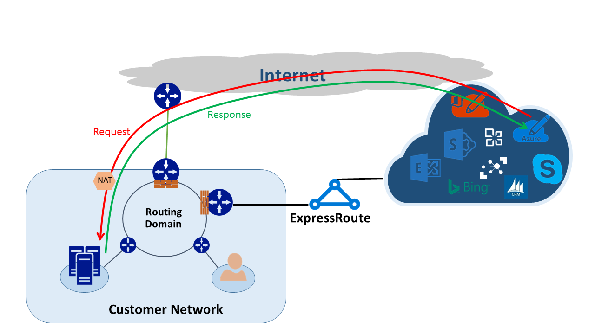

<properties
   pageTitle="Asymmetrische routing | Microsoft Azure"
   description="In diesem Artikel führt Sie durch die Probleme, die ein Kunden konfrontiert möglicherweise mit asymmetrische routing in einem Netzwerk, die mehrere Links zu einem Ziel enthält."
   documentationCenter="na"
   services="expressroute"
   authors="osamazia"
   manager="carmonm"
   editor=""/>
<tags
   ms.service="expressroute"
   ms.devlang="na"
   ms.topic="get-started-article"
   ms.tgt_pltfrm="na"
   ms.workload="infrastructure-services"
   ms.date="10/10/2016"
   ms.author="osamazia"/>

# Asymmetrische routing mit mehreren Netzwerkpfade

In diesem Artikel wird erläutert, wie nach vorne und zurück, dass Netzwerkdatenverkehr möglicherweise anderen Ort leitet verwenden, wenn mehrere Pfade zwischen Netzwerk Quell- und Zielfelder verfügbar sind.

Es ist wichtig, zwei Konzepte asymmetrische routing schwer zu verstehen. Eine wird das Verhalten mehrerer Netzwerkpfade. Das andere ist wie Geräte, wie eine Firewall, Zustand beibehalten. Diese Arten von Geräten werden dynamische Geräte bezeichnet. Eine Kombination dieser beiden Faktoren erstellt Szenarien, bei denen die Verkehr über ein Gerät mit dynamische verworfen wird, da das dynamische Gerät erkennen nicht, dass Datenverkehr mit dem Gerät selbst stammt.

## Mehrere Netzwerkpfade

Wenn ein Unternehmensnetzwerk nur einen Link mit dem Internet über ihren Internetdienstanbieter enthält, durchläuft gesamten Verkehr über das Internet im selben Pfad. Häufig kaufen Unternehmen mehrere Schaltkreise, als redundante Pfade, um Netzwerk Verfügbarkeit zu verbessern. In diesem Fall ist es möglich, dass eine andere Verknüpfung, die außerhalb des Netzwerks, mit dem Internet, wechselt durchläuft einen einzigen Link, und der Rückgabetyp Datenverkehr durchläuft. Dies wird auch als asymmetrische routing bezeichnet. Asymmetrische Routing akzeptiert reverse Netzwerkverkehr einen anderen Pfad aus den ursprünglichen Fluss.

Obwohl es hauptsächlich im Internet auftritt, gilt auch asymmetrische routing anderen Kombinationen von mehreren Pfaden. Es gilt, z. B. sowohl den Pfad eines Internet und eine private Pfad, die wechseln zum gleichen Ziel, und klicken Sie auf mehrere private Wege, die zu demselben Ziel zu wechseln.

Jeder Router auf die Möglichkeit, von der Quelle zum Ziel, berechnet den besten Pfad zum Erreichen eines Ziels. Der Router Ermittlung der beste mögliche Pfad basiert auf zwei Dinge:

-   Routing zwischen externen Netzwerken basiert auf ein routing-Protokoll Rahmen Gateway Protocol (BGP). BGP Werbung von Nachbarn akzeptiert und durchläuft eine Reihe von vor, um die beste Pfad für das gewünschte Ziel zu bestimmen. Speichert den besten Pfad in routing-Tabelle.
-   Die Länge einer Subnetz Maske einer Routing zugeordnet wirkt sich auf Weiterleitung Pfade. Wenn ein Router mehrere Werbung für die IP-Adresse, jedoch mit anderen Subnetz Eingabeformaten empfängt, zieht der Router die Ankündigung mit einer längeren Subnetzmaske, da er eine weitere spezifische Routing angesehen wird.

## Dynamische Geräte

Routern Prüfen der IP-Header eines Pakets für das routing. Bei einigen Geräten suchen auch tieferen im Paket. Diese Geräte in der Regel, schauen Sie sich Layer4 (Übertragung Control Protocol, oder TCP; oder Benutzer Datagrammprotokoll oder UDP), oder sogar Layer7 Kopfzeilen (Application Layer). Diese Arten von Geräten sind Sicherheitsgeräte oder Bandbreite-Optimierung Geräte. 

Eine Firewall ist ein gängiges Beispiel für eine dynamische Gerät. Eine Firewall oder verweigert ein Paket passieren seiner Schnittstellen basierend auf verschiedenen Feldern wie Protokoll, Ports und URL-Header. Diese Ebene der Überprüfung Paket zusammengeführt werden, eine hohe Belastung auf dem Gerät. Um die Leistung zu verbessern, untersucht die Firewall das erste Paket eines Flusses. Wenn sie das Paket aus, um den Vorgang fortzusetzen zulässt, bleibt Fluss Informationen in der Tabelle "Status". Alle nachfolgenden Pakete im Zusammenhang mit dieser Fluss zulässig sind, basierend auf der ersten Festlegung. Ein Paket, das Bestandteil einer vorhandenen Fluss ist möglicherweise an der Firewall werden. Wenn die Firewall ohne vorherige Statusinformationen aufweist, legt die Firewall das Paket ab.

## Asymmetrische routing mit ExpressRoute

Wenn Sie mit Microsoft bis Azure ExpressRoute verbinden, folgendermaßen aus Ihrem Netzwerk Änderungen:

-   Sie verfügen über mehrere Links an Microsoft. Ein Link ist Ihre Verbindung zum Internet hergestellt und anderen über ExpressRoute. Einige Datenverkehr an Microsoft möglicherweise über das Internet gehen aber zurückkommen über ExpressRoute (oder umgekehrt).
-   Sie erhalten weitere spezifische IP-Adressen über ExpressRoute. Ja, möchten Sie lieber für den Datenverkehr in Ihrem Netzwerk an Microsoft für das Dienstleistungsangebot über ExpressRoute, Routern immer ExpressRoute.

Um den Effekt zu verstehen, die, den folgenden zwei Änderungen in einem Netzwerk installiert haben, sehen Sie sich einige Szenarien. Als Beispiel Sie nur eine Verbindung mit dem Internet haben und Sie alle Microsoft-Dienste über das Internet nutzen. Der Datenverkehr in Ihrem Netzwerk zurück zu Microsoft durchläuft den gleichen Internet-Link und wird durch die Firewall. Die Firewall Einträge illustrieren, wie es das erste Paket sieht und Absenderadresse Pakete nicht zulässig sind, da in der Tabelle Zustand des Ablaufs vorhanden ist.

Klicken Sie dann auf ExpressRoute aktivieren und Microsoft über ExpressRoute angebotenen Dienste nutzen. Alle anderen Dienste von Microsoft, die über das Internet genutzt werden. Sie bereitstellen eine separate Firewall bei der Kante, die mit ExpressRoute verbunden ist. Microsoft Ankündigung spezifischere Präfixe mit Ihrem Netzwerk über ExpressRoute für bestimmte Dienste. Routing-Infrastruktur wählt ExpressRoute als bevorzugten Pfad für diese Präfixe. Wenn Sie Ihre öffentlichen IP-Adressen an Microsoft nicht über ExpressRoute ankündigen möchten, kommuniziert Microsoft mit Ihrer öffentlichen IP-Adressen über das Internet. Weiterleitung von Datenverkehr in Ihrem Netzwerk an Microsoft verwendet ExpressRoute und reverse Datenverkehr von Microsoft im Internet. Wenn die Firewall am Rand ein Pakets Antwort für einen Fluss, die in der Tabelle "Status" nicht gefunden wird sieht, löscht es die Rückgabe von Daten aus.

Wenn Sie den gleichen Netzwerk Adresse (Netzwerkadressübersetzung) Pool für ExpressRoute und im Internet verwenden, werden Sie ähnliche Problemen mit den Clients in Ihrem Netzwerk auf private IP-Adressen angezeigt. Anforderung von Diensten wie Windows Update wechseln über das Internet, da die IP-Adressen für diese Dienste über ExpressRoute nicht bekannt gegeben werden. Allerdings kommt die Rückgabe von Daten über ExpressRoute zurück. Wenn Microsoft eine IP-Adresse mit der Maske aus dem Internet und ExpressRoute eingeht, zieht es ExpressRoute über das Internet an. Wenn eine Firewall oder ein anderes dynamische Gerät, das in Ihrem Netzwerk Kante und gegenüberliegende ExpressRoute ist keine vorherige Informationen zur Übertragung aufweist, verwirft es der Pakete, die zu diesem Fluss gehören.

## Asymmetrische Weiterleitung Lösungen

Sie haben zwei grundlegende Optionen zur Lösung des Problems asymmetrische Routing. Eine ist über Weiterleitung und anderen mithilfe der Quelle-basierten NAT (SNAT).

### Routing

Stellen Sie sicher, dass Ihre öffentlichen IP-Adressen zu entsprechenden WAN-Netzwerk (WAN) Links bekannt gegeben werden. Beispielsweise, wenn Sie im Internet für Authentifizierungsdatenverkehr und ExpressRoute für Ihren e-Mail-Verkehr verwenden möchten, sollten Sie nicht Ihre öffentlichen IP-Adressen von Active Directory Federation Services (AD FS) über ExpressRoute ankündigen. Darüber hinaus muss nicht zu einer lokalen verfügbar machen AD FS-Datenbankserver an IP-Adressen, die der Router über ExpressRoute empfängt. Leitet über ExpressRoute empfangen sind weitere spezifische, sodass sie ExpressRoute den bevorzugten Pfad für Authentifizierungsdatenverkehr an Microsoft vornehmen. Dadurch wird die asymmetrische routing.

Wenn Sie für die Authentifizierung ExpressRoute verwenden möchten, stellen Sie sicher, dass Sie über ExpressRoute ohne NAT AD FS öffentliche IP-Adressen ankündigen möchten Auf diese Weise Datenverkehr, stammen von Microsoft und wechselt zum einer lokalen, AD FS-Server geht über ExpressRoute. Rückgabe von Daten von Kunden an Microsoft verwendet ExpressRoute, weil es die bevorzugte Routing über das Internet ist.

### Quelle-basierten NAT

Eine weitere Möglichkeit zum Beheben von Problemen mit asymmetrische routing wird mithilfe der SNAT. Angenommen, haben Sie nicht die öffentliche IP-Adresse eines lokalen Simple Mail Transfer Protocol (SMTP)-Servers über ExpressRoute bekannt gegeben, da Sie für diese Art der Kommunikation mit dem Internet ausgefüllt werden sollen. Eine Anforderung, die mit Microsoft stammen, und klicken Sie dann zu Ihrem lokalen SMTP-Server geht durchläuft im Internet. Sie SNAT eingehenden Anforderung einer internen IP-Adresse. Umgekehrter Datenverkehr vom SMTP-Server geht an die Kante Firewall (die Sie für NAT verwenden) statt bis ExpressRoute. Die Rückgabe von Daten wechselt über das Internet.

## Asymmetrische Weiterleitung Erkennung

Traceroute ist die beste Methode, um sicherzustellen, dass Ihr Netzwerkverkehr erwarteten Pfad durchlaufen ist. Wenn Sie den Datenverkehr an Microsoft den Pfad Internet Ausführen von Ihrem lokalen SMTP-Server erwarten, ist der erwarteten Traceroute vom SMTP-Server nach Office 365 angezeigt. Das Ergebnis erfolgreich überprüft wird, dass Datenverkehr tatsächlich um Ihres Netzwerks gegen im Internet und nicht gegen ExpressRoute verlassen wird.
