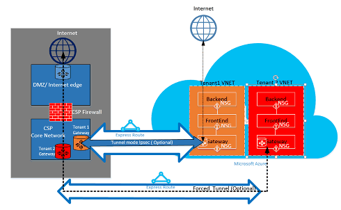

<properties
   pageTitle="Azure ExpressRoute für die Lösungsanbieter Cloud | Microsoft Azure"
   description="Dieser Artikel enthält Informationen für Cloud-Dienstanbieter, die Azure Services einbinden möchten und ExpressRoute in ihre Angebote."
   documentationCenter="na"
   services="expressroute"
   authors="richcar"
   manager="carmonm"
   editor=""/>
<tags
   ms.service="expressroute"
   ms.devlang="na"
   ms.topic="get-started-article"
   ms.tgt_pltfrm="na"
   ms.workload="infrastructure-services"
   ms.date="10/10/2016"
   ms.author="richcar"/>

# ExpressRoute für Cloud Solution Provider (CSP)

Microsoft stellt Hyper-Skala Services für traditionell Händler und Distributors (CSP) neue Dienste schnell bereitstellen können und Lösungen für Ihren Kunden, ohne dass investieren in diese neue Dienste entwickeln. Damit der Cloud Lösung (CSP) die Möglichkeit, diese neue Dienste direkt verwalten können, stellt Microsoft-Programmen und APIs, mit denen den CSP Microsoft Azure-Ressourcen für Ihre Kunden verwalten können. Eine dieser Ressourcen ist ExpressRoute. ExpressRoute ermöglicht CSP zu vorhandenen Ressourcen für Kunden mit Azure-Webdiensten herstellen. ExpressRoute ist ein hochgeschwindigkeit private Communications-Link zu Diensten in Azure. 

ExpresRoute besteht aus zwei Schaltkreise hohen Verfügbarkeit, die mit einem einzelnen Kunden Abonnements verknüpft sind und kann nicht freigegeben werden, indem Sie mehrere Kunden. Jede Verbindung sollte in einen anderen Router zum Verwalten der hohen Verfügbarkeit beendet werden.

>[AZURE.NOTE] Es gibt Bandbreite und Verbindung FESTSTELLTASTE auf ExpressRoute, was bedeutet, dass große/komplexen Implementierungen mehrere ExpressRoute Schaltkreise für einen einzelnen Kunden erforderlich ist.

Microsoft Azure bietet eine wachsende Anzahl von Diensten, die Sie an Ihre Kunden anbieten können.  Um optimale übernehmen Vorteil dieser Dienste erfordert die Verwendung ExpressRoute-Verbindungen mit hohen Geschwindigkeit bieten niedriger Wartezeit Zugriff auf die Microsoft Azure-Umgebung.

## Microsoft Azure management
Microsoft stellt CSPs mit APIs für die Kundenabonnements Azure verwalten, indem programmgesteuerten Integration in Ihrer eigenen Service Management-Systeme. Unterstützte Verwaltungsfunktionen finden Sie [hier](https://msdn.microsoft.com/library/partnercenter/dn974944.aspx).

## Microsoft Azure ressourcenverwaltung
Je nach den Vertrag, den Sie mit Ihren Kunden haben legt fest, wie das Abonnement verwaltet werden soll. Der Anbieter kann direkt verwalten die Erstellung und Wartung von Ressourcen oder den Kunden erhalten die Kontrolle über die Microsoft Azure-Abonnement und die Azure Ressourcen erstellen, wie sie benötigen, kann. Wenn Ihr Kunde die Erstellung von Ressourcen in ihren Microsoft Azure-Abonnement verwaltet werden diese verwenden Sie eine der zwei Modelle:-Modell "Verbinden über" oder "Direkte an" Modell. Diese Modelle werden in den folgenden Abschnitten ausführlich beschrieben.  

### Verbinden über Modell

  

Im Modell verbinden über erstellt der Anbieter, den eine direkte Verbindung zwischen Ihrem Datacenter und Ihres Kunden Azure-Abonnement. Die direkte Verbindung wird hergestellt ExpressRoute, verbinden Ihr Netzwerk mit Azure verwenden. Klicken Sie dann verbunden Ihren Kunden mit Ihrem Netzwerk. Dieses Szenario erfordert, dass das Netzwerk CSP Azure Services Zugriff auf der Kunden durchläuft. 

Wenn Ihres Kunden andere Azure Abonnements, die nicht von den Ihnen verwalteten aufweist, würden sie im öffentlichen Internet oder eigene private Verbindung verwenden, Verbindung zum nach der Bereitstellung unter dem Abonnement nicht CSP Dienste. 

CSP Azure Services verwalten wird davon ausgegangen, dass der Anbieter, den eine zuvor definierte Kunden Identität Store weist die für die Verwaltung ihrer Abonnements CSP bis Administrate-On-Behalf-Of (AOBO) klicken Sie dann in der Azure-Active Directory repliziert werden möchten. Key Treiber für dieses Szenario enthalten, in dem einer angegebenen Partner oder Dienstanbieter verfügt über eine definierte Beziehung mit dem Kunden, verbraucht der Kunden Provider Services aktuell oder des Partners weist Neugier bieten eine Kombination aus Anbieter gehostet und Azure gehostete Lösungen für Flexibilität und die Adresse des Kunden Herausforderung bieten die CSP alleine nicht erfüllt werden kann. Dieses Modell ist in der **Abbildung**unten dargestellt.

### Verbinden mit Modell

Die Verbindung zum Modell Dienstanbieter erstellt eine direkte Verbindung zwischen ihren Kunden Datacenter und dem CSP nach der Bereitstellung Azure-Abonnement mithilfe von ExpressRoute über des Kunden (Customer) Netzwerk.

>[AZURE.NOTE] Für ExpressRoute müssten der Kunden erstellen und Verwalten der ExpressRoute Verbindung.  

Dieses Szenario Connectivity erfordert, dass Sie der Kunden verbindet, direkt über einem Kundennetzwerk zugreifen CSP verwalteten Azure-Abonnement über eine direkte Netzwerkverbindung, die erstellt wird, im Besitz und ganz oder teilweise vom Kunden verwaltet. Für diese Kunden, die angenommen wird, dass der Anbieter derzeit keine sind ein Kunden Identitätsspeicher eingerichtet und der Anbieter würde unterstützen Sie den Kunden bei der Replikation ihrer aktuellen identifizieren Store in Azure Active Directory für die Verwaltung ihrer Abonnements über AOBO. Wichtigsten Gründe für dieses Szenario einschließen, einem angegebenen Partner oder Dienstanbieter verfügt über eine definierte Beziehung mit dem Kunden, der Kunden Provider Services derzeit verbraucht oder des Partners weist Neugier Dienste bereitzustellen, die ausschließlich auf Azure gehostete Lösungen ohne die Notwendigkeit einer vorhandenen Anbieter Datacenter oder Infrastruktur basieren.

Die Auswahl zwischen diesen zwei Option basieren auf Ihres Kunden Anforderungen und Ihre aktuellen müssen Azure-Dienste bereitzustellen. Ausführliche Informationen zu diesen Modellen und zugeordneten rollenbasierte Zugriff steuern, Netzwerke und Identität entwurfmustern fallen Details in den folgenden Links:
-   **Rolle basierend Access Steuerelement (RBAC)** – RBAC basiert auf Azure Active Directory.  Weitere Informationen zu Azure RBAC finden Sie [hier](../active-directory/role-based-access-control-configure.md).
-   **Networking** – umfasst die verschiedenen Themen der Netzwerke in Microsoft Azure.
-   **Azure Active Directory (AAD)** – AAD stellt die Identität Verwaltung für Microsoft Azure und 3rd Party SaaS Applications. Weitere Informationen finden Sie unter Azure AD- [hier](https://azure.microsoft.com/documentation/services/active-directory/).  

## Netzwerk-Geschwindigkeit
ExpressRoute unterstützt das Netzwerk Geschwindigkeit von 50 Mb/s, 10Gb/s. Dadurch wird die Kunden erwerben Netzwerk-Bandbreite für ihre Umgebung erforderlich.

>[AZURE.NOTE] Netzwerk-Bandbreite erhöht werden kann, ohne Unterbrechung Kommunikation Bedarf, aber zum Verringern des Netzwerks Geschwindigkeit erfordert die Verbindung zu beenden, und es in der unteren Geschwindigkeit im Netzwerk neu zu erstellen.  

ExpressRoute unterstützt die Verbindung von mehreren vNets zu einer einzelnen ExpressRoute Verbindung für eine bessere Nutzung von der höheren Geschwindigkeit Verbindungen. Eine einzelne ExpressRoute Verbindung kann für mehrere Azure-Abonnements, die denselben Kunden und Besitz genutzt werden.

## Konfigurieren von ExpressRoute
ExpressRoute kann zur Unterstützung von drei Arten von Datenverkehr ([Domänen routing](#ExpressRoute-routing-domains)) über eine einzelne ExpressRoute Verbindung konfiguriert werden. Dieser Datenverkehr in Microsoft peering, Azure peering von öffentlichen und privaten peering getrennt. Sie können eine oder alle Arten von Verkehr über eine einzelne ExpressRoute Verbindung gesendet werden, oder verwenden mehrere ExpressRoute Schaltkreise abhängig von der Größe der Isolation erforderlich, die für Ihren Kunden und ExpressRoute Verbindung auswählen. Die Sicherheitslage Ihres Kunden möglicherweise nicht zulässig, öffentlichen und privaten Datenverkehr über die gleiche Verbindung zu durchlaufen.

### Verbinden über Modell
In einer Konfiguration verbinden über werden die verantwortlich ist für alle den Netzwerke Grundlagen Verbindung Ihre Kunden Rechenzentrumsressourcen zu Abonnements in Azure gehostet. Jeder der Ihres Kunden die gewünschte Azure-Funktionen benötigen eigene Verbindung ExpressRoute, die von der Sie verwaltet werden. Die Sie verwenden die gleiche Weise, die der Kunden verwenden würden, um die Verbindung ExpressRoute beschaffen. Sie führen Sie die gleichen Schritte im Artikel [ExpressRoute Workflows](./expressroute-workflows.md) für die Bereitstellung von Verbindung und Verbindung Staaten. Konfigurieren der Sie dann der leitet Rahmen Gateway Protocol (BGP), um den Datenverkehr zwischen dem lokalen Netzwerk und Azure vNet parallelen steuern.

### Verbinden mit Modell
In einer Konfiguration verbinden zu Ihren Kunden bereits verfügt über eine vorhandene Verbindung zu Azure oder initiieren eine Verbindung zum Internet Service Provider ExpressRoute aus Datencenters des Kunden direkt in Azure, statt Datencenters verknüpfen. Um die Bereitstellung zu beginnen, werden Ihren Kunden die Schritte wie oben im Modell verbinden über beschrieben. Nachdem die Verbindung hergestellt wurde müssen Ihren Kunden so konfigurieren Sie die lokalen Router, um Ihre Netzwerk und die Azure vNets zugreifen können.

Können helfen Ihnen bei der Verbindung einrichten und konfigurieren die Arbeitspläne an, damit die Ressourcen in Ihrer Datacenter(s) zur Kommunikation mit den Clientressourcen Datencenters oder zusammen mit den Ressourcen in Azure gehostet wird.

## ExpressRoute routing-Domänen
ExpressRoute bietet drei routing Domänen: öffentliche und Private sowie Microsoft peering. Jeder dieser Domänen routing mit identischen Routern aktive Konfiguration für hohe Verfügbarkeit konfiguriert sind. Detaillierte Informationen zur ExpressRoute Domänen routing suchen [können](./expressroute-circuit-peerings.md).

Sie können benutzerdefinierte leitet Filter, um nur die Routen zu ermöglichen, die Sie zulassen oder müssen möchten definieren. Weitere Informationen oder dazu, wie Sie diese Änderungen finden Sie in diesem Artikel: [Erstellen und Ändern von routing für eine ExpressRoute Verbindung mithilfe der PowerShell](./expressroute-howto-routing-classic.md) Weitere Details zum routing-Filter.

>[AZURE.NOTE] Für Microsoft und öffentliche Peering Connectivity muss durch eine öffentliche IP-Adresse Besitz des Kunden oder CSP und muss zu allen definierten Regeln eingehalten werden. Weitere Informationen finden Sie auf der Seite [ExpressRoute erforderliche Komponenten](expressroute-prerequisites.md) .  

## Routing
ExpressRoute stellt eine Verbindung zu den Azure Netzwerken über das Azure-virtuellen Netzwerkgateway her. Netzwerkgateways bieten für Azure virtuelle Netzwerke routing.

Erstellen von virtuellen Netzwerken Azure erstellt auch eine Standardtabelle Weiterleitung für die vNet, um den Datenverkehr in die Subnetze des der vNet zu leiten. Ist die standardmäßige Routingtabelle nicht ausreichend für die benutzerdefinierte Lösung können leitet zum Weiterleiten von ausgehenden Datenverkehrs benutzerdefinierten Einheiten oder blockieren leitet zu bestimmten Teilnetzen oder externen Netzwerken erstellt werden.

### Standard-routing
Die Standard-Routing-Tabelle umfasst die folgenden leitet:

- In einem Subnetz Routing
- Subnetz Subnetz, innerhalb des virtuellen Netzwerks
- Mit dem Internet
- Virtuelle Netzwerk-virtuelle Netzwerk VPN-Gateway verwenden
- Virtuelle Netzwerk-zu-lokalen Netzwerk über ein VPN oder ExpressRoute gateway

  

### Benutzerdefinierte routing (UDR)
Leitet User defined ermöglichen die Steuerung des Datenverkehrs ausgehend vom zugeordneten Subnetz nach anderen Subnetzen in das virtuelle Netzwerk oder auf eine der anderen vordefinierten Gateways (ExpressRoute; Internet oder VPN). Die Standard-System-routing-Tabelle kann mit einer benutzerdefinierten routing-Tabelle ersetzt werden, die die Standard-routing-Tabelle mit benutzerdefinierten leitet ersetzt. Mit benutzerdefinierten routing, Kunden bestimmte leitet Einheiten wie Firewalls oder Intrusion Erkennung Einheiten erstellen oder das Subnetz hostet die User defined Routing Zugriff auf bestimmte Subnetze hindern. Suchen Sie einen Überblick über die Benutzer definiert ist [hier](../virtual-network/virtual-networks-udr-overview.md). 

## Sicherheit
Je nachdem, welches Modell verwendet, verbinden, oder Verbinden durchlaufen, wird Ihren Kunden definiert die Sicherheitsrichtlinien in deren vNet oder bietet die Sicherheit Richtlinie Anforderungen beim Anbieter zu deren vNets definieren. Die folgenden Sicherheitskriterien können definiert werden:

1.  **Grad der Isolation Kunden** – der Azure-Plattform bietet Kunden Isolation durch Speichern von Kunden-ID und vNet Informationen in einer sicheren Datenbank, die zum Kapseln des Kunden Datenverkehr in einen GRE-Tunnel verwendet wird.
2.  **Netzwerk Sicherheit Gruppe (NSG)** Regeln sind für den Datenverkehr zulässig, in die und aus der Subnetze vNets in Azure definieren. Standardmäßig die NSG enthalten auf Block von Regeln zum Blockieren aus dem Internet an den vNet und Regeln für Datenverkehr innerhalb einer vNet zulassen. Weitere Informationen zu Sicherheitsgruppen Netzwerk suchen [können](https://azure.microsoft.com/blog/network-security-groups/).
3.  **Erzwingen, dass Tunnel** – Dies ist eine Option zum Umleiten Internet gebunden Datenverkehr in Azure über die ExpressRoute-Verbindung zu den auf lokale Datacenter umgeleitet werden. Weitere Informationen zu Erzwungene Tunnel suchen [können](./expressroute-routing.md#advertising-default-routes).  

4.  **Verschlüsselung** –, obwohl die Schaltkreise ExpressRoute für einen bestimmten Kunden vorgesehen sind, besteht die Möglichkeit, dass der Netzwerkanbieter verletzt werden konnte, über die ein Eindringling Paket Datenverkehr untersuchen. Zur Behebung dieses potenzieller eines Kunden oder CSP kann verschlüsseln Verkehr über die Verbindung IPSec-Tunnel-Modus Richtlinien für den gesamten Verkehr zwischen auf lokale Ressourcen und Azure parallelen definieren Ressourcen (in den optional Tunnelmodus IPSec für Kunden 1 in Abbildung 5 verweisen: ExpressRoute Sicherheit, oben). Die zweite Option wäre eine Firewall-Anwendung an jedem Endpunkt der ExpressRoute Verbindung zu verwenden. Dies erfordert eine zusätzliche 3rd Party firewall virtuellen Computern/Einheiten auf beide Enden zur Verschlüsselung des Datenverkehrs über die Verbindung ExpressRoute installiert sein.

  

## Nächste Schritte
Der Cloud Solution Provider-Service stellt Ihnen eine Möglichkeit, einen Wert an Ihre Kunden ohne die Notwendigkeit teure Infrastruktur und Videofunktionen Einkäufe, bei weitgehender Ihre Position als die primäre Outsourcing-Anbieter zu vergrößern. Nahtlose Integration mit Microsoft Azure erfolgt über die CSP-API, so dass Sie die Verwaltung von Microsoft Azure innerhalb Ihrer vorhandenen Management Framework integriert werden soll.  

Weitere Informationen finden Sie unter den folgenden Links:

[Microsoft Cloud Solution Provider-Programm](https://partner.microsoft.com/en-US/Solutions/cloud-reseller-overview).  
[Vorbereiten auf als Cloud Lösungsanbieter transact](https://partner.microsoft.com/en-us/solutions/cloud-reseller-pre-launch).  
[Microsoft Cloud Solution Provider Ressourcen](https://partner.microsoft.com/en-us/solutions/cloud-reseller-resources).
