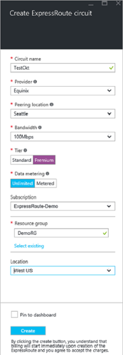

<properties
   pageTitle="Erstellen und Ändern einer ExpressRoute Verbindung mithilfe von Ressourcenmanager und Azure-Portal | Microsoft Azure"
   description="In diesem Artikel beschreibt das Erstellen, bereitstellen, stellen Sie sicher, aktualisieren, löschen und eine Verbindung ExpressRoute entziehen."
   documentationCenter="na"
   services="expressroute"
   authors="cherylmc"
   manager="carmonm"
   editor=""
   tags="azure-resource-manager"/>
<tags
   ms.service="expressroute"
   ms.devlang="na"
   ms.topic="article"
   ms.tgt_pltfrm="na"
   ms.workload="infrastructure-services"
   ms.date="10/10/2016"
   ms.author="cherylmc"/>

# Erstellen und Ändern einer Verbindung ExpressRoute

> [AZURE.SELECTOR]
[Azure-Portal - Ressourcenmanager](expressroute-howto-circuit-portal-resource-manager.md)
[PowerShell - Ressourcenmanager](expressroute-howto-circuit-arm.md)
[PowerShell - Klassisch](expressroute-howto-circuit-classic.md)

Dieser Artikel beschreibt, wie Sie eine Verbindung Azure ExpressRoute mithilfe der Azure-Portal und dem Modell zur Bereitstellung von Azure Ressourcenmanager erstellen. Die folgenden Schritte zeigen auch zum Überprüfen des Status der Verbindung, aktualisieren Sie sie oder löschen und es entziehen.

**Informationen zu Datenmodellen Azure-Bereitstellung**

[AZURE.INCLUDE [vpn-gateway-clasic-rm](../../includes/vpn-gateway-classic-rm-include.md)] 

## Vorbemerkung

- Überprüfen Sie die [erforderlichen Komponenten](expressroute-prerequisites.md) und [Workflows](expressroute-workflows.md) Vorbemerkung Konfiguration.
- Stellen Sie sicher, dass Sie auf das [Azure-Portal](https://portal.azure.com)zugreifen.
- Stellen Sie sicher, dass Sie Berechtigungen zum Erstellen neuer Netzwerke Ressourcen verfügen. Wenn Sie nicht über die entsprechenden Berechtigungen verfügen, wenden Sie sich an den Administrator der Benutzerkonten.

## Erstellen und Bereitstellen einer ExpressRoute-Verbindung

### 1. Melden Sie sich bei der Azure-portal

Navigieren Sie zu der [Azure-Portal](http://portal.azure.com) einen Browser und melden Sie sich mit Ihrem Konto Azure.

### 2. erstellen Sie eine neue ExpressRoute-Verbindung

>[AZURE.IMPORTANT] Ihre Verbindung ExpressRoute wird ab dem Zeitpunkt berechnet, die ein Dienstschlüssel ausgestellt wurde. Stellen Sie sicher, dass Sie diesen Vorgang ausführen, wenn der Connectivity-Anbieter für die Bereitstellung der Verbindung bereit ist.

1. Sie können eine Verbindung ExpressRoute durch Auswahl der Option zum Erstellen einer neuen Ressource erstellen. Klicken Sie auf **neu** > **Networking** > **ExpressRoute**, wie in der folgenden Abbildung dargestellt:

    

2. Nachdem Sie **ExpressRoute**geklickt haben, sehen Sie das **Verbindung erstellen ExpressRoute** Blade. Wenn Sie die Werte in dieser Blade ausfüllen, stellen Sie sicher, dass Sie den richtigen SKU Ebene und die Erfassung von Daten angeben.

    - **Ebene** bestimmt, ob ein ExpressRoute Standard oder ein ExpressRoute Premium Add-on aktiviert ist. Sie können **Standard** zum Abrufen von standard SKU oder **Premium** für das Add-on Premium angeben.

    - **Erfassung von Daten** bestimmt den Typ der Abrechnung. Sie können für eine unbegrenzte Datentarif **getaktete** für einen getaktete Datentarif und **unbeschränkt** angeben. Beachten Sie, dass können Sie den Typ von **getaktete** in **unbeschränkt**ändern, aber Sie können den Typ von **unbeschränkt** in **getaktete**ändern.

    

>[AZURE.IMPORTANT] Bitte beachten Sie, dass die Position Peering den [Standort](expressroute-locations.md) gibt an, wo Sie mit Microsoft peering. Dies ist **nicht** verknüpfte Eigenschaft "Speicherort" bezieht sich auf die "geography", in dem der Anbieter Azure Netzwerk Ressourcen befindet. Während sie nicht verknüpft sind, ist es empfiehlt sich das ein Netzwerk Ressource Identitätsanbieter geografischen nahe der Peering Position der Verbindung auswählen. 

### 3. Schaltkreise und Eigenschaften anzeigen

**Alle diese Schaltkreise anzeigen**

Sie können alle diese Schaltkreise anzeigen, die Sie erstellt haben, indem Sie im Menü links auf **alle Ressourcen** auswählen.
    

**Anzeigen der Eigenschaften**

    You can view the properties of the circuit by selecting it. On this blade, note the service key for the circuit. You must copy the circuit key for your circuit and pass it down to the service provider to complete the provisioning process. The circuit key is specific to your circuit.

### 4. senden Sie die Taste Dienst an Ihren Connectivity-Anbieter für Bereitstellung

In diesem Blade stellt **Anbieterstatus** auf den aktuellen Status der auf der Seite Service Provider bereitgestellt. **Verbindung Status** stellt den Status auf der Seite Microsoft. Weitere Informationen zur Bereitstellung von Staaten Verbindung finden Sie unter Artikel [Workflows](expressroute-workflows.md#expressroute-circuit-provisioning-states) .

Wenn Sie eine neue ExpressRoute Verbindung erstellen, werden die Verbindung in den folgenden Status aus:

Anbieterstatus: nicht nach der Bereitstellung 
Verbindung ist Status: aktiviert

Die Verbindung wird in den folgenden Status ändern, wenn der Connectivity-Anbieter gerade es für Sie aktiviert ist:

Anbieterstatus: Bereitstellung 
Verbindung ist Status: aktiviert

Damit Sie eine Verbindung ExpressRoute verwenden können muss es in den folgenden Status:

Anbieterstatus: nach der Bereitstellung 
Verbindung ist Status: aktiviert

### 5. regelmäßig überprüfen des Status und der Status der Verbindung-Taste

Sie können die Eigenschaften der Verbindung anzeigen, die Sie interessiert sind, indem Sie es auswählen. Überprüfen Sie den **Anbieterstatus** , und stellen Sie sicher, dass es **bereitgestellt** verschoben wurde, bevor Sie fortfahren.

### 6. routing-Konfiguration erstellen

Eine schrittweise Anleitung finden Sie im Artikel [ExpressRoute Verbindung routing-Konfiguration](expressroute-howto-routing-portal-resource-manager.md) , Peerings Verbindung zu erstellen.

>[AZURE.IMPORTANT] Diese Anweisungen beziehen sich nur auf Schaltkreise, die mit Dienstanbieter erstellt werden, die Ebene 2 Connectivity Services anbieten. Wenn Sie einen Dienstanbieter verwenden, der verwaltete bietet Schicht 3 Services (in der Regel eine IP VPN, wie MPLS), Ihren Anbieter Connectivity konfigurieren und Verwalten von routing für Sie.

### 7. Link eine virtuelle Netzwerk eine Verbindung ExpressRoute

Verknüpfen Sie als Nächstes ein virtuelles Netzwerk mit Ihrer ExpressRoute Verbindung. Verwenden Sie beim Arbeiten mit dem Modell zur Bereitstellung von Ressourcenmanager [Linking virtuelle Netzwerke zu ExpressRoute Schaltkreise](expressroute-howto-linkvnet-arm.md) Artikel.

## Aufrufen des Status einer Verbindung ExpressRoute

Sie können den Status des eine Verbindung, indem Sie es auswählen anzeigen. 

## Ändern einer Verbindung ExpressRoute

Sie können bestimmte Eigenschaften des eine Verbindung ExpressRoute beeinträchtigt Connectivity ändern. Sie können nicht zu diesem Zeitpunkt ExpressRoute Verbindung Eigenschaften ändern, mithilfe des Azure-Portals. Allerdings können Sie PowerShell verwenden, um Eigenschaften der Verbindung zu ändern. Weitere Informationen finden Sie im Abschnitt, der [eine Verbindung ExpressRoute mithilfe der PowerShell ändern](expressroute-howto-circuit-arm.md#modify).

Sie können ohne Ausfallzeiten folgende Aktionen ausführen:

- Aktivieren Sie oder deaktivieren Sie ein ExpressRoute Premium Add-on für Ihre ExpressRoute Verbindung.

- Vergrößern Sie die Bandbreite der Verbindung ExpressRoute. Beachten Sie, dass das Herabstufen der Bandbreite des eine Verbindung nicht unterstützt wird. 

- Ändern Sie den Messfunktionen Plan aus getaktete Daten zum unbeschränkte Daten ein. Beachten Sie, dass die Erfassung ändern zu getaktete Daten aus einer unbeschränkten Daten planen wird nicht unterstützt.

-  Sie können aktivieren und Deaktivieren von **Klassischen Vorgänge zulassen**.

Weitere Informationen zu den Grenzwerten und Einschränkungen finden Sie in der [ExpressRoute häufig gestellte Fragen](expressroute-faqs.md).

## Aufheben der Bereitstellung und Löschen einer Verbindung ExpressRoute

Sie können Ihre ExpressRoute Verbindung löschen, indem Sie auf das Symbol **Löschen** . Beachten Sie Folgendes:

- Sie müssen alle virtuellen Netzwerke aus der Verbindung ExpressRoute Verknüpfung aufheben. Wenn dies nicht möglich ist, überprüfen Sie, ob alle virtuelle Netzwerke, um die Verbindung verknüpft sind aus.

- Wenn ExpressRoute Verbindung-Anbieter provisioning Dienststatus **Provisioning** oder **bereitgestellt** wird, müssen Sie mit Ihrem Dienstanbieter zu entziehen von der Verbindung auf ihrer Seite arbeiten. Wir werden weiterhin Ressourcen reservieren und mit Ihnen abrechnen bis Dienstanbieter abgeschlossen ist, Aufheben der Verbindung und benachrichtigt uns.

- Wenn der Dienstanbieter die Verbindung hat hat (Anbieter provisioning Dienststatus auf **nach der Bereitstellung nicht**festgelegt) können Sie die Verbindung dann löschen. Hiermit wird die Rechnung für die Verbindung abgebrochen.

## Nächste Schritte

Nachdem Sie Ihre Verbindung erstellt haben, stellen Sie sicher, dass Sie die folgenden Aktionen ausführen:

- [Erstellen Sie und ändern Sie die Weiterleitung für Ihr ExpressRoute-Verbindung](expressroute-howto-routing-portal-resource-manager.md)
- [Verknüpfen von virtuellen Netzwerks mit Ihrer ExpressRoute-Verbindung](expressroute-howto-linkvnet-arm.md)
