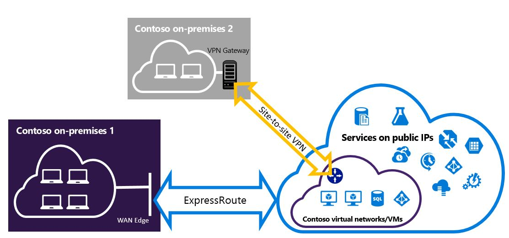

<properties
   pageTitle="Konfigurieren von Expressroute und Standort-zu-Standort VPN-Verbindungen, die für das Modell zur Bereitstellung von Ressourcenmanager gleichzeitig verwendet werden können | Microsoft Azure"
   description="In diesem Artikel Schritte zum Konfigurieren von ExpressRoute und eine Website-zu-Standort VPN-Verbindung, die für Ressourcenmanager Modell gleichzeitig verwendet werden kann."
   documentationCenter="na"
   services="expressroute"
   authors="charwen"
   manager="carmonm"
   editor=""
   tags="azure-resource-manager"/>
<tags
   ms.service="expressroute"
   ms.devlang="na"
   ms.topic="get-started-article"
   ms.tgt_pltfrm="na"
   ms.workload="infrastructure-services"
   ms.date="10/10/2016"
   ms.author="charleywen"/>

# Konfigurieren von ExpressRoute und zwischen Standorten gleichzeitig vorhandener Verbindungen für das Modell zur Bereitstellung von Ressourcenmanager

> [AZURE.SELECTOR]
- [PowerShell - Ressourcenmanager](expressroute-howto-coexist-resource-manager.md)
- [PowerShell - klassisch](expressroute-howto-coexist-classic.md)

Die Möglichkeit zum Konfigurieren von Website-zu-Standort VPN und ExpressRoute bietet mehrere Vorteile. Sie können Standort-zu-Standort VPN als sichere Failover Pfad für ExressRoute konfigurieren, oder verwenden Website-zu-Standort VPN Verbindung zu Websites, die nicht über ExpressRoute verbunden sind. Die Schritte zum Konfigurieren der beiden Szenarien in diesem Artikel werden behandelt. In diesem Artikel gilt für das Modell zur Bereitstellung von Ressourcenmanager. Diese Konfiguration ist nicht verfügbar in der Azure-Portal.

**Informationen zu Datenmodellen Azure-Bereitstellung**

[AZURE.INCLUDE [vpn-gateway-clasic-rm](../../includes/vpn-gateway-classic-rm-include.md)] 

>[AZURE.IMPORTANT] ExpressRoute Schaltkreise müssen vorab konfiguriert sein, bevor Sie die folgenden Schritte befolgen. Stellen Sie sicher, dass Sie die Führungslinien zu [einer ExpressRoute Verbindung erstellen](expressroute-howto-circuit-arm.md) und [Konfigurieren von routing](expressroute-howto-routing-arm.md) befolgt haben, bevor Sie die folgenden Schritte.

## Grenzwerte und Einschränkungen

- **Während der Übertragung routing wird nicht unterstützt.** Sie können keine (über Azure) zwischen Ihrem lokalen Netzwerk wider, die über die Standort-zu-Standort VPN und Ihr lokales Netzwerk wider, die über ExpressRoute weiterleiten.
- **Grundlegende SKU Gateway wird nicht unterstützt.** Sie müssen einen Gateway nicht grundlegende SKU für das [Gateway ExpressRoute](expressroute-about-virtual-network-gateways.md) und [VPN-Gateway](../vpn-gateway/vpn-gateway-about-vpngateways.md)verwenden.
- **Nur Routing-basierten VPN-Gateway wird unterstützt.** Sie müssen ein Routing-basierten [VPN-Gateway](../vpn-gateway/vpn-gateway-about-vpngateways.md)verwenden.
- **Statische Routing sollten für das VPN-Gateway konfiguriert werden.** Wenn sowohl ExpressRoute auf einer Website-zu-Standort VPN auf Ihr lokale Netzwerk verbunden ist, müssen Sie eine statische Routing in Ihrem lokalen Netzwerk zum Weiterleiten von Website-zu-Standort VPN-Verbindung mit dem öffentlichen Internet konfiguriert haben.
- **ExpressRoute Gateways muss zuerst konfiguriert werden.** Bevor Sie das Website-zu-Standort VPN Gateway hinzufügen, müssen Sie zuerst das Gateway ExpressRoute erstellen.

## Konfigurations-designs

### Konfigurieren einer Standort-zu-Standort VPN als Failover Pfad für ExpressRoute

Sie können eine Verbindung zwischen Standorten VPN als Sicherung für ExpressRoute konfigurieren. Dies gilt nur für virtuelle Netzwerke an den Azure privaten Peeringliste Pfad verknüpft. Es gibt keine VPN-basierten Failoverlösung für Dienste über Azure öffentlichen und Microsoft Peerings zugegriffen werden kann. Die Verbindung ExpressRoute ist immer der primäre Link. Durch den Pfad der Website-zu-Standort VPN wird Datenfluss nur, wenn die Verbindung ExpressRoute schlägt fehl.
>[AZURE.NOTE] Während der ExpressRoute Verbindung kann bevorzugte Standort-zu-Standort VPN bei beide leitet identisch sind, wird Azure die Longuest Präfix Übereinstimmung verwendet, das Routing in Richtung des Pakets Ziel auswählen.

### Konfigurieren eines Standort-zu-Standort VPN Verbindung zu Websites, die nicht über ExpressRoute verbunden sind

Sie können Ihrem Netzwerk, in dem einige Websites verbinden direkt in Azure über Standort-zu-Standort VPN und einige Websites durch Expressroute, konfigurieren. 

>[AZURE.NOTE] Eine Konfigurieren eines virtuellen Netzwerks als Router Übertragung nicht möglich.

## Markieren die Schritte zum Verwenden

Es gibt zwei unterschiedliche Verfahren zur Auswahl um Verbindungen konfiguriert werden, die gleichzeitig verwendet werden können. Die Verfahren, die Sie auswählen, hängt davon ab, ob Sie ein vorhandenes virtuelles Netzwerk haben, um eine Verbindung herstellen möchten, oder Sie ein neues virtuelles Netzwerk erstellen möchten.

- Ich nicht über eine VNet verfügen und müssen Sie einen erstellen.
    
    Wenn Sie bereits über ein virtuelles Netzwerk besitzen, führt dieses Verfahren Sie durch Erstellen eines neuen virtuellen Netzwerks Modell zur Bereitstellung von Ressourcenmanager verwenden und Erstellen von neuen ExpressRoute und Standort-zu-Standort VPN-Verbindungen. Führen Sie die Schritte im Abschnitt Artikel [zum Erstellen eines neuen virtuellen Netzwerks und gleichzeitig vorhandener Verbindungen](#new)um konfigurieren.

- Ich habe bereits ein Ressourcenmanager Bereitstellungsmodell VNet.

    Sie verfügen bereits ein virtuelles Netzwerk in Ort mit einer vorhandenen Website-zu-Standort VPN oder ExpressRoute Verbindung. Im Abschnitt [zum Konfigurieren von Coexsiting-Verbindungen für eine bereits vorhandene VNet](#add) führt Sie durch das Gateway zu löschen, und klicken Sie dann erstellen neue ExpressRoute und Standort-zu-Standort VPN-Verbindungen. Beachten Sie, dass die Schritte bei der Erstellung der neuen Verbindungen in einer ganz bestimmten Reihenfolge ausgeführt werden müssen. Verwenden Sie nicht die Anweisungen im Weitere Artikel der Gateways und Verbindungen zu erstellen.

    In diesem Verfahren wird erstellen Verbindungen, die gleichzeitig vorhanden sein können ist es erforderlich, um das Gateway zu löschen, und konfigurieren Sie dann auf neue Gateways. Dies bedeutet, dass Sie Ausfall Ihre Cross lokale Verbindungen gedrückt, während Sie löschen und neu erstellen, Ihre Gateway und Verbindungen, aber nicht Ihrem virtuellen Computern oder Dienste mit einem neuen virtuellen Netzwerk migrieren müssen. Von virtuellen Computern und Dienstleistungen bleibt, über den Lastenausgleich kommunizieren, während Ihr Gateway konfigurieren, wenn sie dazu konfiguriert sind.

## So erstellen ein neues virtuelles Netzwerk und gleichzeitig vorhandener Verbindungen

Dieses Verfahren wird führen Sie durch Erstellen einer VNet und Erstellen von Website-zu-Standort und ExpressRoute Verbindungen, die gemeinsam verwendet werden.
    
1. Sie müssen die neueste Version der Azure-PowerShell-Cmdlets installieren. Weitere Informationen zum Installieren der PowerShell-Cmdlets finden Sie unter [Informationen zum Installieren und konfigurieren Azure PowerShell](../powershell-install-configure.md) . Beachten Sie, dass die Cmdlets, die Sie für diese Konfiguration verwenden, werden möglicherweise geringfügig was Sie vertraut sein können. Achten Sie darauf, dass die in diesen Anweisungen angegebenen Cmdlets verwenden zu können.

2. Melden Sie sich Ihr Konto und das Einrichten der Umgebung.
    
        login-AzureRmAccount
        Select-AzureRmSubscription -SubscriptionName 'yoursubscription'
        $location = "Central US"
        $resgrp = New-AzureRmResourceGroup -Name "ErVpnCoex" -Location $location

3. Erstellen Sie ein virtuelles Netzwerk, einschließlich Gateway Subnetz ein. Weitere Informationen über die virtuelle Netzwerkkonfiguration finden Sie unter [Azure-virtuellen Netzwerkkonfiguration](../virtual-network/virtual-networks-create-vnet-arm-ps.md).

    >[AZURE.IMPORTANT] Das Gateway Subnetz muss /27 oder eine kürzere Präfix (z. B. /26 oder /25).
    
    Erstellen einer neuen VNet an.

        $vnet = New-AzureRmVirtualNetwork -Name "CoexVnet" -ResourceGroupName $resgrp.ResourceGroupName -Location $location -AddressPrefix "10.200.0.0/16" 

    Fügen Sie Subnetze hinzu.

        Add-AzureRmVirtualNetworkSubnetConfig -Name "App" -VirtualNetwork $vnet -AddressPrefix "10.200.1.0/24"
        Add-AzureRmVirtualNetworkSubnetConfig -Name "GatewaySubnet" -VirtualNetwork $vnet -AddressPrefix "10.200.255.0/24"

    Speichern Sie die Konfiguration VNet.

        $vnet = Set-AzureRmVirtualNetwork -VirtualNetwork $vnet

4. Erstellen eines Gateways ExpressRoute an. Weitere Informationen zu den ExpressRoute Gateway-Konfiguration finden Sie unter [ExpressRoute Gateway-Konfiguration](expressroute-howto-add-gateway-resource-manager.md). Die GatewaySKU muss *Standard*, *HighPerformance*oder *UltraPerformance*.

        $gwSubnet = Get-AzureRmVirtualNetworkSubnetConfig -Name "GatewaySubnet" -VirtualNetwork $vnet
        $gwIP = New-AzureRmPublicIpAddress -Name "ERGatewayIP" -ResourceGroupName $resgrp.ResourceGroupName -Location $location -AllocationMethod Dynamic
        $gwConfig = New-AzureRmVirtualNetworkGatewayIpConfig -Name "ERGatewayIpConfig" -SubnetId $gwSubnet.Id -PublicIpAddressId $gwIP.Id
        $gw = New-AzureRmVirtualNetworkGateway -Name "ERGateway" -ResourceGroupName $resgrp.ResourceGroupName -Location $location -IpConfigurations $gwConfig -GatewayType "ExpressRoute" -GatewaySku Standard 

5. Verknüpfen Sie das Gateway ExpressRoute die ExpressRoute angeschlossen. Nachdem Sie diesen Schritt abgeschlossen ist, wird die Verbindung zwischen Ihrem lokalen Netzwerk und Azure, bis ExpressRoute, eingerichtet. Weitere Informationen zu den Vorgang verknüpfen finden Sie unter [Link VNets zu ExpressRoute](expressroute-howto-linkvnet-arm.md).

        $ckt = Get-AzureRmExpressRouteCircuit -Name "YourCircuit" -ResourceGroupName "YourCircuitResourceGroup"
        New-AzureRmVirtualNetworkGatewayConnection -Name "ERConnection" -ResourceGroupName $resgrp.ResourceGroupName -Location $location -VirtualNetworkGateway1 $gw -PeerId $ckt.Id -ConnectionType ExpressRoute

6. Erstellen Sie anschließend das Standort-zu-Standort VPN-Gateway ein. Weitere Informationen zu Gateway-Konfiguration die Option VPN finden Sie unter [Konfigurieren einer VNet mit einer Verbindung zwischen Standorten](../vpn-gateway/vpn-gateway-create-site-to-site-rm-powershell.md). Die GatewaySKU muss *Standard*, *HighPerformance*oder *UltraPerformance*. Die VpnType muss *RouteBased*.

        $gwSubnet = Get-AzureRmVirtualNetworkSubnetConfig -Name "GatewaySubnet" -VirtualNetwork $vnet
        $gwIP = New-AzureRmPublicIpAddress -Name "VPNGatewayIP" -ResourceGroupName $resgrp.ResourceGroupName -Location $location -AllocationMethod Dynamic
        $gwConfig = New-AzureRmVirtualNetworkGatewayIpConfig -Name "VPNGatewayIpConfig" -SubnetId $gwSubnet.Id -PublicIpAddressId $gwIP.Id
        New-AzureRmVirtualNetworkGateway -Name "VPNGateway" -ResourceGroupName $resgrp.ResourceGroupName -Location $location -IpConfigurations $gwConfig -GatewayType "Vpn" -VpnType "RouteBased" -GatewaySku "Standard"

    Azure VPN-Gateway unterstützt das BGP. Sie können in den folgenden Befehl - EnableBgp angeben.

        $azureVpn = New-AzureRmVirtualNetworkGateway -Name "VPNGateway" -ResourceGroupName $resgrp.ResourceGroupName -Location $location -IpConfigurations $gwConfig -GatewayType "Vpn" -VpnType "RouteBased" -GatewaySku "Standard" -EnableBgp $true

    Sie können die IP-Adresse und die AS-Nummer, die für das Gateway VPN in $azureVpn.BgpSettings.BgpPeeringAddress und $azureVpn.BgpSettings.Asn Azure verwendet peering BGP suchen. Weitere Informationen finden Sie unter [Konfigurieren von BGP](../vpn-gateway/vpn-gateway-bgp-resource-manager-ps.md) Azure VPN-Gateway.

7. Erstellen einer lokalen Standort VPN Gateway Entität an. Dieser Befehl konfigurieren nicht das lokale VPN-Gateway. Stattdessen können Sie die lokale gatewayeinstellungen bereitstellen wie die öffentliche IP-Adresse und der lokalen Adresse Leerzeichen, damit das Gateway Azure VPN darauf zugreifen kann.

    Wenn Sie Ihrem lokale VPN-Gerät unterstützt nur statisches routing, können Sie die statischen leitet auf folgende Weise konfigurieren.

        $MyLocalNetworkAddress = @("10.100.0.0/16","10.101.0.0/16","10.102.0.0/16")
        $localVpn = New-AzureRmLocalNetworkGateway -Name "LocalVPNGateway" -ResourceGroupName $resgrp.ResourceGroupName -Location $location -GatewayIpAddress *<Public IP>* -AddressPrefix $MyLocalNetworkAddress

    Wenn es sich bei Ihrem lokale VPN-Gerät unterstützt das BGP und dynamisches routing aktivieren möchten, müssen Sie die IP-Adresse und den AS-Zahl mit Ihrem lokale VPN-Gerät peering BGP wissen.

        $localVPNPublicIP = "<Public IP>"
        $localBGPPeeringIP = "<Private IP for the BGP session>"
        $localBGPASN = "<ASN>"
        $localAddressPrefix = $localBGPPeeringIP + "/32"
        $localVpn = New-AzureRmLocalNetworkGateway -Name "LocalVPNGateway" -ResourceGroupName $resgrp.ResourceGroupName -Location $location -GatewayIpAddress $localVPNPublicIP -AddressPrefix $localAddressPrefix -BgpPeeringAddress $localBGPPeeringIP -Asn $localBGPASN

8. Konfigurieren von Ihrem lokalen VPN-Gerät für die Verbindung mit dem neuen Azure VPN Gateway. Weitere Informationen zur Konfiguration von VPN-Gerät finden Sie unter [VPN-Gerätekonfiguration](../vpn-gateway/vpn-gateway-about-vpn-devices.md).

9. Verknüpfen Sie das Gateway Standort-zu-Standort VPN auf Azure mit dem lokalen Gateway ein.

        $azureVpn = Get-AzureRmVirtualNetworkGateway -Name "VPNGateway" -ResourceGroupName $resgrp.ResourceGroupName
        New-AzureRmVirtualNetworkGatewayConnection -Name "VPNConnection" -ResourceGroupName $resgrp.ResourceGroupName -Location $location -VirtualNetworkGateway1 $azureVpn -LocalNetworkGateway2 $localVpn -ConnectionType IPsec -SharedKey <yourkey>

## So konfigurieren Sie Coexsiting-Verbindungen für eine bereits vorhandene VNet

Wenn Sie ein vorhandenes virtuelles Netzwerk haben, überprüfen Sie die Größe des Gateways Subnetz. Ist das Gateway Subnetz /28 oder /29, müssen Sie das Gateway virtuelles Netzwerk löschen und erhöhen Sie die Größe des Gateways Subnetz. Die Schritte in diesem Abschnitt zeigt Ihnen, wie das geht.

Ist das Gateway Subnetz /27 oder größere und über ExpressRoute das virtuelle Netzwerk verbunden ist, können Sie überspringen Sie die folgenden Schritte aus, und fahren Sie mit ["Schritt 6: erstellen einen Website-zu-Standort VPN Gateway"](#vpngw) im vorherigen Abschnitt. 

>[AZURE.NOTE] Wenn Sie das vorhandene Gateway löschen, werden Ihnen vor Ort während der Bearbeitung auf dieser Konfiguration die Verbindung mit Ihrem Netzwerk virtuelle gesperrt. 

1. Sie müssen die neueste Version der Azure-PowerShell-Cmdlets installieren. Weitere Informationen zum Installieren der PowerShell-Cmdlets finden Sie unter [Informationen zum Installieren und konfigurieren Azure PowerShell](../powershell-install-configure.md) . Beachten Sie, dass die Cmdlets, die Sie für diese Konfiguration verwenden, werden möglicherweise geringfügig was Sie vertraut sein können. Achten Sie darauf, dass die in diesen Anweisungen angegebenen Cmdlets verwenden zu können. 

2. Löschen Sie das vorhandene ExpressRoute oder Website-zu-Standort VPN Gateway ein. 

        Remove-AzureRmVirtualNetworkGateway -Name <yourgatewayname> -ResourceGroupName <yourresourcegroup>

3. Löschen Sie Gateway Subnetz ein.
        
        $vnet = Get-AzureRmVirtualNetwork -Name <yourvnetname> -ResourceGroupName <yourresourcegroup> 
        Remove-AzureRmVirtualNetworkSubnetConfig -Name GatewaySubnet -VirtualNetwork $vnet

4. Hinzufügen von einem Gateway Subnetz, die /27 ist oder größere.
    >[AZURE.NOTE] Wenn Sie nicht über ausreichend IP-Adressen in Ihrem Netzwerk virtuelle, um die Größe des Gateways Subnetz erhöhen Links verfügen, müssen Sie mehr Platz der IP-Adresse hinzufügen.

        $vnet = Get-AzureRmVirtualNetwork -Name <yourvnetname> -ResourceGroupName <yourresourcegroup>
        Add-AzureRmVirtualNetworkSubnetConfig -Name "GatewaySubnet" -VirtualNetwork $vnet -AddressPrefix "10.200.255.0/24"

    Speichern Sie die Konfiguration VNet.

        $vnet = Set-AzureRmVirtualNetwork -VirtualNetwork $vnet

5. An diesem Punkt müssen Sie eine VNet mit keine Gateways. Zum Erstellen von neuen Gateways, und führen Sie Ihre Verbindungen, können Sie mit [Schritt 4: erstellen ein Gateways ExpressRoute](#gw), gefunden in den vorherigen Schritten fortfahren.

## Konfiguration von Punkt-zu-Standort VPN-Gateway hinzufügen
Führen Sie die folgenden Schritte zur Konfiguration Punkt-zu-Standort das VPN-Gateway in einem gemeinsamen Vorhandensein Setup hinzufügen.

1. Fügen Sie die Adresse Ressourcenpool VPN-Client hinzu. 

        $azureVpn = Get-AzureRmVirtualNetworkGateway -Name "VPNGateway" -ResourceGroupName $resgrp.ResourceGroupName
        Set-AzureRmVirtualNetworkGatewayVpnClientConfig -VirtualNetworkGateway $azureVpn -VpnClientAddressPool "10.251.251.0/24"

2. Hochladen Sie das Zertifikat der Stamm VPN in Azure für das VPN-Gateway. In diesem Beispiel wird davon ausgegangen, dass das Zertifikat der Stamm in dem lokalen Computer gespeichert ist, auf dem die folgenden PowerShell-Cmdlets ausgeführt werden. 

        $p2sCertFullName = "RootErVpnCoexP2S.cer"
        $p2sCertMatchName = "RootErVpnCoexP2S"
        $p2sCertToUpload=get-childitem Cert:\CurrentUser\My | Where-Object {$_.Subject -match $p2sCertMatchName}
        if ($p2sCertToUpload.count -eq 1){
            write-host "cert found"
        } else {
            write-host "cert not found"
            exit
        } 
        $p2sCertData = [System.Convert]::ToBase64String($p2sCertToUpload.RawData)
        Add-AzureRmVpnClientRootCertificate -VpnClientRootCertificateName $p2sCertFullName -VirtualNetworkGatewayname $azureVpn.Name -ResourceGroupName $resgrp.ResourceGroupName -PublicCertData $p2sCertData

Weitere Informationen zum Punkt-zu-Standort VPN finden Sie unter [Konfigurieren einer Punkt-zu-Standort-Verbindung](../vpn-gateway/vpn-gateway-howto-point-to-site-rm-ps.md).

## Nächste Schritte

Weitere Informationen zu ExpressRoute finden Sie im [ExpressRoute häufig gestellte Fragen](expressroute-faqs.md).
