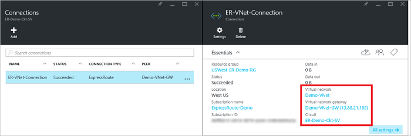

<properties
   pageTitle="Verknüpfen Sie ein virtuelles Netzwerk mit einer ExpressRoute Verbindung mithilfe der Modell zur Bereitstellung von Ressourcenmanager und Azure-Portal | Microsoft Azure"
   description="Dieses Dokument enthält eine Übersicht über virtuelle Netzwerke (VNets) zu ExpressRoute Schaltkreise verknüpfen."
   services="expressroute"
   documentationCenter="na"
   authors="cherylmc"
   manager="carmonm"
   editor=""
   tags="azure-resource-manager"/>
<tags
   ms.service="expressroute"
   ms.devlang="na"
   ms.topic="article"
   ms.tgt_pltfrm="na"
   ms.workload="infrastructure-services"
   ms.date="10/10/2016"
   ms.author="cherylmc" />

# Erstellen einer Verknüpfung ein virtuelles Netzwerk mit einer ExpressRoute-Verbindung

> [AZURE.SELECTOR]
- [Azure-Portal - Ressourcenmanager](expressroute-howto-linkvnet-portal-resource-manager.md)
- [PowerShell - Ressourcenmanager](expressroute-howto-linkvnet-arm.md)
- [PowerShell - klassisch](expressroute-howto-linkvnet-classic.md)

In diesem Artikel helfen Ihnen die virtuelle Netzwerke (VNets) Azure ExpressRoute Schaltkreise mit dem Modell zur Bereitstellung von Ressourcenmanager und Azure-Portal verknüpfen. Virtuelle Netzwerke können entweder im selben Abonnement, oder er können ein anderes Abonnement enthalten sein.

**Informationen zu Datenmodellen Azure-Bereitstellung**

[AZURE.INCLUDE [vpn-gateway-clasic-rm](../../includes/vpn-gateway-classic-rm-include.md)]

## Voraussetzungen für die Konfiguration

- Stellen Sie sicher, dass Sie [erforderliche Komponenten](expressroute-prerequisites.md), [routing Anforderungen](expressroute-routing.md)und [Workflows](expressroute-workflows.md) überprüft haben, bevor Sie mit der Konfiguration beginnen.
- Sie müssen eine aktive ExpressRoute Verbindung.
    - Führen Sie die Schritte zum [Erstellen einer Verbindung ExpressRoute](expressroute-howto-circuit-arm.md) und haben Sie die Verbindung von Ihrem Anbieter Connectivity aktiviert.

    - Stellen Sie sicher, dass Sie Azure private peering für Ihre Verbindung konfiguriert haben. Finden Sie im Artikel [Konfigurieren routing](expressroute-howto-routing-portal-resource-manager.md) , routing Anweisungen aus.

    - Sicherstellen Sie, dass Azure private peering konfiguriert ist und die BGP peering zwischen Ihrem Netzwerk und Microsoft von besteht, damit Sie End-to-End-Konnektivität aktivieren können.

    - Stellen Sie sicher, dass Sie ein virtuelles Netzwerk und ein Gateway virtuelles Netzwerk erstellt und nach der Bereitstellung vollständig verfügen. Folgen Sie den Anweisungen zum Erstellen eines [VPN-Gateway](../articles/vpn-gateway/vpn-gateway-howto-site-to-site-resource-manager-portal.md) (folgen nur Schritte 1 bis 5).

Sie können bis zu 10 virtuelle Netzwerke eine standard ExpressRoute Verbindung verknüpfen. Alle virtuellen Netzwerke muss in der gleichen geopolitische Region bei Verwendung eine standard ExpressRoute Verbindung. Sie können eine virtuelle Netzwerke außerhalb der geopolitische Region der Verbindung ExpressRoute link oder eine größere Anzahl von virtuellen Netzwerken zu Ihrem ExpressRoute Verbindung herstellen, wenn Sie das ExpressRoute Premium Add-on aktiviert. Überprüfen Sie die [häufig gestellte Fragen zu](expressroute-faqs.md) Weitere Details auf das Add-on Premium.

## Herstellen einer Verbindung eine Verbindung mit einem virtuellen Netzwerk im selben-Abonnement

### Erstellen eine Verbindung

1. Stellen Sie sicher, dass Ihre ExpressRoute Verbindung und Azure private peering erfolgreich konfiguriert wurden. Folgen Sie den Anweisungen in [Erstellen einer Verbindung ExpressRoute](expressroute-howto-circuit-arm.md) und [routing konfigurieren](expressroute-howto-routing-arm.md). Ihre Verbindung ExpressRoute sollte wie die folgende Abbildung aussehen.

    

    >[AZURE.NOTE] BGP Konfigurationsinformationen werden nicht angezeigt, wenn Sie der Layer 3-Anbieter Ihre Peerings konfiguriert. Wenn Ihre Verbindung in einem bereitgestellte Zustand ist, sollten Sie Verbindungen zu erstellen sein.

2. Nun können Sie eine Verbindung zum Verknüpfen von Schlüsselaufgaben virtuelles Netzwerk Ihrer ExpressRoute Verbindung bereitgestellt. Klicken Sie auf **Verbindung** > **Hinzufügen** , öffnen das Blade **Verbindung hinzufügen** und konfigurieren Sie die Werte. Finden Sie im folgenden Beispiel für den Verweis ein.

      

3. Nachdem die Verbindung erfolgreich konfiguriert wurde, wird Ihre Verbindungsobjekt die Informationen für die Verbindung angezeigt.

    

### So löschen Sie eine Verbindung

Sie können eine Verbindung löschen, indem Sie auf das Symbol **Löschen** auf das Blade für die Verbindung.

## Herstellen einer Verbindung eine Verbindung mit einem virtuellen Netzwerk in ein anderes Abonnement

Sie können nicht zu diesem Zeitpunkt virtuelle Netzwerke über Abonnements verbinden, mithilfe des Azure-Portals. PowerShell können Sie jedoch Aktion. Finden Sie weitere Informationen im Artikel [PowerShell](expressroute-howto-linkvnet-arm.md) aus.

## Nächste Schritte

Weitere Informationen zu ExpressRoute finden Sie im [ExpressRoute häufig gestellte Fragen](expressroute-faqs.md).
