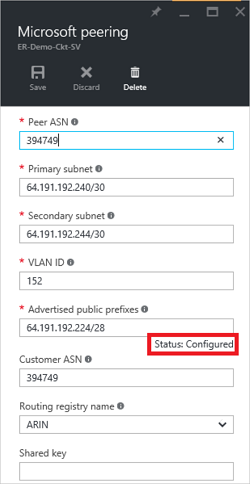

<properties
   pageTitle="Konfigurieren von routing für eine ExpressRoute Verbindung mit dem Portal Azure | Microsoft Azure"
   description="In diesem Artikel führt Sie durch die Schritte zum Erstellen und die privat, öffentlich und Microsoft peering eine Verbindung ExpressRoute bereitgestellt. Dieser Artikel zeigt Ihnen auch So prüfen Sie den Status, aktualisieren oder Löschen von Peerings für Ihre Verbindung."
   documentationCenter="na"
   services="expressroute"
   authors="cherylmc"
   manager="carmonm"
   editor=""
   tags="azure-resource-manager"/>
<tags
   ms.service="expressroute"
   ms.devlang="na"
   ms.topic="hero-article" 
   ms.tgt_pltfrm="na"
   ms.workload="infrastructure-services"
   ms.date="10/10/2016"
   ms.author="cherylmc"/>

# Erstellen und Ändern von routing für eine Verbindung ExpressRoute

> [AZURE.SELECTOR]
[Azure-Portal - Ressourcenmanager](expressroute-howto-routing-portal-resource-manager.md)
[PowerShell - Ressourcenmanager](expressroute-howto-routing-arm.md)
[PowerShell - Klassisch](expressroute-howto-routing-classic.md)

In diesem Artikel führt Sie durch die Schritte zum Erstellen und Verwalten von routing-Konfiguration für eine ExpressRoute Verbindung mithilfe von Azure-Portal und dem Modell zur Bereitstellung von Ressourcenmanager.

**Informationen zu Datenmodellen Azure-Bereitstellung**

[AZURE.INCLUDE [vpn-gateway-clasic-rm](../../includes/vpn-gateway-classic-rm-include.md)] 

## Voraussetzungen für die Konfiguration

- Stellen Sie sicher, dass Sie der Seite [erforderliche Komponenten](expressroute-prerequisites.md) , der Seite [routing von Anforderungen](expressroute-routing.md) und der Seite [Workflows](expressroute-workflows.md) überprüft haben, bevor Sie mit der Konfiguration beginnen.
- Sie müssen eine aktive ExpressRoute Verbindung. Führen Sie die Schritte zum [Erstellen einer Verbindung ExpressRoute](expressroute-howto-circuit-arm.md) und haben Sie die Verbindung von Ihrem Anbieter Connectivity aktiviert werden, bevor Sie fortfahren. Die Verbindung ExpressRoute muss sich in einem Zustand bereitgestellten und aktiviert für Sie die nachfolgend beschriebenen Cmdlets ausführen zu können.

Diese Anweisungen beziehen sich nur auf Schaltkreise mit Dienstanbieter Geschenk Schicht 2 Connectivity Services erstellt. Wenn Sie einen Dienstanbieter Geschenk verwaltete Layer 3-Dienste (in der Regel ein IPVPN, wie MPLS) verwenden, wird Ihrem Anbieter Connectivity konfigurieren und Verwalten von routing für Sie. 

>[AZURE.IMPORTANT] Wir anzeigen derzeit nicht so konfiguriert, dass der Dienstanbieter durch den Dienst Verwaltungsportal Peerings. Wir arbeiten, klicken Sie auf diese Funktion bald aktivieren. Erkundigen Sie Ihren Service-Anbieter, bevor Sie BGP Peerings konfigurieren.

Sie können eine, zwei oder alle drei Peerings (Azure private, Azure öffentlichen und Microsoft) für eine ExpressRoute Verbindung konfigurieren. Sie können Peerings in einer beliebigen Reihenfolge konfigurieren ausgewählt haben. Jedoch müssen Sie sicherstellen, dass Sie die Konfiguration der einzelnen Peeringliste nacheinander abgeschlossen haben. 

## Azure private peering

Dieser Abschnitt enthält Anweisungen zum Erstellen, abrufen, aktualisieren und löschen Sie die Azure private Peeringliste Konfiguration für eine Verbindung ExpressRoute. 

### Zum Erstellen von Azure private peering

1. Konfigurieren der Verbindung ExpressRoute. Stellen Sie sicher, dass die Verbindung vollständig vom Connectivity-Anbieter, bevor Sie fortfahren bereitgestellt wird.

    

2. Private Azure peering für die Verbindung zu konfigurieren. Stellen Sie sicher, dass Sie die folgenden Elemente haben, bevor Sie mit den nächsten Schritten fortfahren:

    - Keine/30 Subnetz für die primäre Verknüpfung. Dies darf nicht Teil des alle Adressbereichs für virtuelle Netzwerke reserviert sein.
    - Keine/30 Subnetz für den sekundären Link. Dies darf nicht Teil des alle Adressbereichs für virtuelle Netzwerke reserviert sein.
    - Eine gültige VLAN-ID dieses peering auf herstellen. Sicherstellen Sie, dass die gleiche VLAN-ID keine anderen peering in der Verbindung verwendet werden.
    - ALS Zahl für peering. Sie können sowohl 2 Bytes und 4-Byte-Zeichen als Zahlen verwenden. Sie können eine privaten als Zahl für diese peering. Stellen Sie sicher, dass Sie keine 65515 verwenden.
    - Ein MD5-Hash, wenn Sie eine verwenden. **Dies ist optional**.

3. Wählen Sie die Private Azure Peeringliste Zeile aus, wie unten dargestellt.
    
    
    

4. Konfigurieren von privaten peering. Die nachstehende Abbildung zeigt ein Beispiel für die Konfiguration.

    

    
5. Speichern Sie die Konfiguration, nachdem Sie alle Parameter angegeben haben. Sobald die Konfiguration erfolgreich zugestimmt haben, sehen Sie etwas ähnlich wie im folgenden Beispiel wird.

    
    

### Azure private Peeringliste Details anzeigen

Sie können die Eigenschaften eines privaten Azure peering, indem Sie die peering auswählen anzeigen.

### Aktualisieren von Azure private Peeringliste Konfiguration

Sie können markieren Sie die Zeile für peering und ändern die Peeringliste Eigenschaften. 

### So löschen Sie Azure private peering

Sie können Ihre Peeringliste Konfiguration entfernen, indem Sie auf das Löschsymbol, wie unten dargestellt.

## Azure öffentlichen peering

Dieser Abschnitt enthält Anweisungen zum Erstellen, abrufen, aktualisieren und löschen Sie die Azure öffentliche Peeringliste Konfiguration für eine Verbindung ExpressRoute. 

### Zum Erstellen von Azure öffentlichen peering

1. Konfigurieren von ExpressRoute Verbindung. Stellen Sie sicher, dass die Verbindung vollständig vom Connectivity-Anbieter bereitgestellt wird, bevor Sie fortfahren weiter.

    

2. Öffentliche Azure peering für die Verbindung zu konfigurieren. Stellen Sie sicher, dass Sie die folgenden Elemente haben, bevor Sie mit den nächsten Schritten fortfahren:

    - Keine/30 Subnetz für die primäre Verknüpfung. 
    - Keine/30 Subnetz für den sekundären Link. 
    - Alle IP-Adressen verwendet, um die Einrichtung dieser peering muss gültige öffentliche IPv4-Adressen.
    - Eine gültige VLAN-ID dieses peering auf herstellen. Sicherstellen Sie, dass die gleiche VLAN-ID keine anderen peering in der Verbindung verwendet werden.
    - ALS Zahl für peering. Sie können sowohl 2 Bytes und 4-Byte-Zeichen als Zahlen verwenden.
    - Ein MD5-Hash, wenn Sie eine verwenden. **Dies ist optional**.

3. Markieren Sie die Azure öffentliche Peeringliste Zeile aus, wie unten dargestellt.
    
    
    

4. Konfigurieren von öffentlichen peering. Die nachstehende Abbildung zeigt ein Beispiel für die Konfiguration.

    

    
5. Speichern Sie die Konfiguration, nachdem Sie alle Parameter angegeben haben. Sobald die Konfiguration erfolgreich zugestimmt haben, sehen Sie etwas ähnlich wie im folgenden Beispiel wird.

    
    

### Azure öffentlichen Peeringliste Details anzeigen

Sie können die Eigenschaften eines öffentlichen Azure peering durch Auswahl der peering anzeigen.

### Aktualisieren von Azure öffentlichen Peeringliste Konfiguration

Sie können markieren Sie die Zeile für peering und ändern die Peeringliste Eigenschaften. 

### So löschen Sie Azure öffentlichen peering

Sie können Ihre Peeringliste Konfiguration entfernen, indem Sie auf das Löschsymbol, wie unten dargestellt.

## Microsoft peering

Dieser Abschnitt enthält Anweisungen zum Erstellen, abrufen, aktualisieren und löschen Sie die Microsoft Peeringliste Konfiguration für eine Verbindung ExpressRoute. 

### Zum Erstellen von Microsoft peering

1. Konfigurieren von ExpressRoute Verbindung. Stellen Sie sicher, dass die Verbindung vollständig vom Connectivity-Anbieter bereitgestellt wird, bevor Sie fortfahren weiter.

    

2. Microsoft peering für die Verbindung zu konfigurieren. Stellen Sie sicher, dass Sie die folgende Informationen verfügen, bevor Sie fortfahren.

    - Keine/30 Subnetz für die primäre Verknüpfung. Dies muss ein gültiges öffentlichen IPv4-Präfix Sie Besitz und registriert in einer RIR / IKV.
    - Keine/30 Subnetz für den sekundären Link. Dies muss ein gültiges öffentlichen IPv4-Präfix Sie Besitz und registriert in einer RIR / IKV.
    - Eine gültige VLAN-ID dieses peering auf herstellen. Sicherstellen Sie, dass die gleiche VLAN-ID keine anderen peering in der Verbindung verwendet werden.
    - ALS Zahl für peering. Sie können sowohl 2 Bytes und 4-Byte-Zeichen als Zahlen verwenden.
    - **Angekündigt Präfixe:** Sie müssen eine Liste der alle Präfixe angeben, den, die Sie über die Sitzung BGP ankündigen möchten. Es werden nur öffentliche IP-Adresspräfixe akzeptiert. Sie können eine kommagetrennte Liste senden, wenn Sie eine Reihe von Präfixe senden möchten. Diese Präfixe müssen Ihnen in einer RIR registriert sein / IKV.
    - **Kunden ASN:** Wenn Sie Werbung Präfixe, die nicht sind zu den peering als Zahl registriert sind, können Sie die AS-Nummer angeben, die sie registriert sind. **Dies ist optional**.
    - **Registrierungsname für das Datensatzrouting:** Sie können angeben, dass die RIR / IKV, anhand derer die als Zahl und Präfixe registriert sind. **Dies ist optional.**
    - MD5-Hash, wenn Sie eine verwenden. **Dies ist optional.**
    
3. Sie können auswählen, auf die peering, konfigurieren, wie unten dargestellt werden sollen. Wählen Sie die Microsoft Peeringliste Zeile ein.
    
    
    

4.  Konfigurieren von Microsoft peering. Die nachstehende Abbildung zeigt ein Beispiel für die Konfiguration.

    

    
5. Speichern Sie die Konfiguration, nachdem Sie alle Parameter angegeben haben. 

    Wenn Ihre Verbindung zum Ruft eine Validierung erforderlich Zustand (siehe unten), müssen Sie ein Ticket Support zum Nachweis des Eigentums an die Präfixe, um unser Supportteam anzeigen, öffnen.  
    
    

    Sie können direkt vom Portal wie unten dargestellt Support-Ticket öffnen.   
    
    

6. Sobald die Konfiguration erfolgreich zugestimmt haben, sehen Sie etwas ähnlich wie im folgenden Beispiel wird.

    
    

### Microsoft Peeringliste Details anzeigen

Sie können die Eigenschaften eines öffentlichen Azure peering durch Auswahl der peering anzeigen.

### Aktualisieren von Microsoft Peeringliste Konfiguration

Sie können markieren Sie die Zeile für peering und ändern die Peeringliste Eigenschaften. 

### So löschen Sie Microsoft peering

Sie können Ihre Peeringliste Konfiguration entfernen, indem Sie auf das Löschsymbol, wie unten dargestellt.

## Nächste Schritte

Im nächsten Schritt [Verknüpfen eines VNet zu einer ExpressRoute Verbindung](expressroute-howto-linkvnet-arm.md).

-  Weitere Informationen zu ExpressRoute Workflows finden Sie unter [ExpressRoute Workflows](expressroute-workflows.md).

-  Weitere Informationen zu Verbindung peering finden Sie unter [ExpressRoute Schaltkreise und Domänen routing](expressroute-circuit-peerings.md).

-  Weitere Informationen zum Arbeiten mit virtuelle Netzwerke finden Sie unter [virtuellen Network (Übersicht)](../virtual-network/virtual-networks-overview.md).

