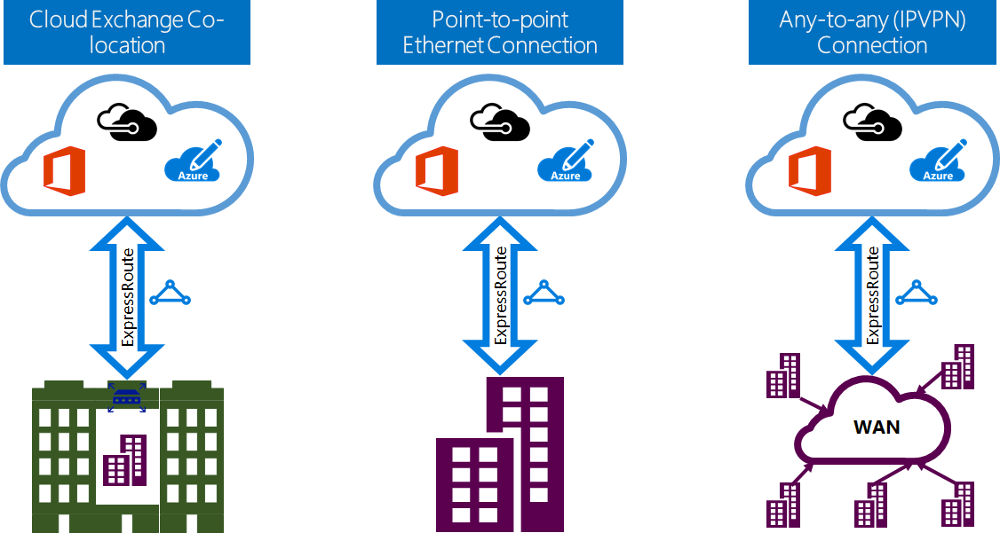

<properties 
   pageTitle="Einführung in ExpressRoute | Microsoft Azure"
   description="Diese Seite enthält eine Übersicht über den ExpressRoute-Dienst, einschließlich der Funktionsweise einer ExpressRoute Verbindung."
   documentationCenter="na"
   services="expressroute"
   authors="cherylmc"
   manager="carmonm"
   editor=""/>
<tags 
   ms.service="expressroute"
   ms.devlang="na"
   ms.topic="get-started-article" 
   ms.tgt_pltfrm="na"
   ms.workload="infrastructure-services" 
   ms.date="10/10/2016"
   ms.author="cherylmc"/>

# ExpressRoute – technische Übersicht

Microsoft Azure ExpressRoute können Sie Ihre lokalen Netzwerken in der Microsoft-Cloud über eine dedizierte private Verbindung von einem Connectivity-Anbieter erleichtert zu erweitern. Mit ExpressRoute können Sie Verbindungen zu Microsoft-Cloud-Diensten, wie etwa Microsoft Azure, Office 365 und CRM Online herstellen. Konnektivität kann aus einer n: n-(IP VPN) Netzwerk, einem Punkt Ethernet-Netzwerk oder eine virtuelle Cross-Verbindung über einen Anbieter Konnektivität in einer gemeinsamen Speicherort Einrichtung sein. ExpressRoute Verbindungen gehen Sie nicht über das öffentliche Internet. Dadurch wird die ExpressRoute-Verbindungen mit mehr Zuverlässigkeit, höhere Geschwindigkeit, unteren Wartezeiten und höhere Sicherheit als normalen Verbindungen über das Internet bieten.

**Die wichtigsten Vorteile:**

- Schicht 3-Konnektivität zwischen Ihrem lokalen Netzwerk und der Microsoft-Cloud über einen Connectivity-Anbieter. Konnektivität kann von einem any-to-any (IPVPN) Netzwerk, einem Punkt Ethernet-Verbindung oder über eine virtuelle Cross-Verbindung über ein Exchange-Ethernet-sein.
- Die Verbindung zu Microsoft-Cloud-Diensten über alle Regionen in der Region geopolitische.
- Globale Verbindung zu Microsoft-Diensten über alle Regionen mit ExpressRoute Premium-Add-On.
- Dynamisches routing zwischen Ihrem Netzwerk und Microsoft über Protokolle nach Industriestandard (BGP).
- Integrierte Redundanz in jeder Peeringliste Speicherort für höhere Zuverlässigkeit.
- Verfügbarkeit der Verbindung [Vereinbarung zum SERVICELEVEL](https://azure.microsoft.com/support/legal/sla/).
- QoS und Unterstützung für mehrere Klassen des Diensts für spezielle Applikationen, wie z. B. Skype für Unternehmen.

Finden Sie weitere Details der [ExpressRoute häufig gestellte Fragen](expressroute-faqs.md) .

## Wie kann ich meine Netzwerk an Microsoft mit ExpressRoute verbinden?

Sie können eine Verbindung zwischen Ihrem lokalen Netzwerk und der Microsoft-Cloud auf drei verschiedene Arten erstellen:

### Gemeinsame am einer Cloud exchange

Wenn Sie an einem Ort mit einem Exchange Cloud gemeinsame ansässig sind, können Sie virtuelle Cross-Verbindungen mit der Microsoft Cloud über die gemeinsame Speicherortanbieter Ethernet-Exchange bestellen. Gemeinsame Speicherort Anbieter können entweder Schicht 2 Cross-Verbindungen oder verwaltete Layer 3 Cross-Verbindungen zwischen Ihrer Infrastruktur in der Funktion gemeinsame Speicherort und der Microsoft-Cloud anbieten.

### Punkt Ethernet-Verbindungen 

Sie können Ihren lokalen Rechenzentren/Büros mit der Microsoft-Cloud über Punkt Ethernet-Link herstellen. Punkt Ethernet-Anbieter Layer 2-Verbindungen können anbieten oder verwaltete Layer 3-Verbindungen zwischen der Website und der Microsoft-Cloud.

### N: n-(IPVPN) Netzwerken

Sie können Ihre WAN mit der Microsoft-Cloud integrieren. IPVPN Anbieter (normalerweise MPLS VPN) bieten eine n: n-Konnektivität zwischen Ihrem Verzweigung Büros und Rechenzentren. Die Microsoft-Cloud kann zu Ihrem WAN, wie alle anderen Zweigstelle aussehen wird miteinander verbunden sind. WAN-Anbieter bieten in der Regel eine verwaltete Layer 3-Konnektivität. ExpressRoute-Funktionen und Features sind über alle vorstehenden Connectivity-Modelle alle identisch. 

Ein oder mehrere Connectivity-Modelle können Connectivity-Anbieter bieten eine. Sie können mit Ihren Connectivity-Anbieter, um das Modell zu wählen, das für Sie am besten geeignete arbeiten.

## ExpressRoute Funktionen

ExpressRoute unterstützt die folgenden Features und Funktionen: 

### Schicht 3-Konnektivität

Microsoft verwendet Protokoll nach Industriestandard dynamische Weiterleitung (BGP) austauschen leitet zwischen Ihrem lokalen Netzwerk, Ihre Instanzen in Azure und Microsoft öffentliche Adressen.  Wir richten Sie mehrere BGP Sitzungen mit Ihrem Netzwerk für andere Datenverkehr Profile. Weitere Informationen hierzu finden Sie im Artikel [ExpressRoute Verbindung und Domänen routing](expressroute-circuit-peerings.md) .

### Redundanz

Jede ExpressRoute-Verbindung besteht aus zwei Verbindungen mit zwei Microsoft Enterprise Kante Routern (MSEEs) aus dem Connectivity-Anbieter / Ihr Netzwerk Kante. Microsoft benötigen Sie zwei BGP Verbindung aus dem Connectivity-Anbieter / Ihrer Seite – mehrwertiges Nachschlagefeld zu jeder einen MSEE. Sie können auch nicht redundante Geräte bereitstellen / Ethernet auslöst an Ihrem Ende. Jedoch verwenden Connectivity-Anbieter redundante Geräte um sicherzustellen, dass Ihre Verbindungen an Microsoft redundante Weise erfüllt werden. Eine redundante Layer 3 Connectivity-Konfiguration ist eine Vorbedingung für unsere [Vereinbarung zum SERVICELEVEL](https://azure.microsoft.com/support/legal/sla/) gültig sein. 

### Verbindung zu Microsoft-Cloud-Diensten

[AZURE.INCLUDE [expressroute-office365-include](../../includes/expressroute-office365-include.md)]

ExpressRoute Verbindungen Aktivieren des Zugriffs auf die folgenden Dienste:

- Microsoft Azure-Dienste
- Microsoft Office 365-Diensten
- Microsoft CRM Online services 
 
Besuchen Sie die Seite [ExpressRoute häufig gestellte Fragen](expressroute-faqs.md) für eine ausführliche Liste der Dienste, die über ExpressRoute unterstützt.

### Verbindung zu alle Bereiche innerhalb einer geopolitische region

Sie können verbinden mit Microsoft in einem unsere [Peeringliste Speicherorte](expressroute-locations.md) und haben Zugriff auf alle Bereiche innerhalb der geopolitische Region. 

Angenommen, wenn Microsoft in Amsterdam bis ExpressRoute besteht, haben Sie Zugriff auf alle Microsoft-Cloud-Dienste, die in Nord Europa und westlichen Europa gehostet wird. Finden Sie im Artikel [ExpressRoute Partner und Peeringliste Speicherorte](expressroute-locations.md) für eine Übersicht der geopolitischen Regionen, zugeordneten Microsoft Cloud-Regionen und entsprechenden ExpressRoute Peeringliste Positionen.

### Globale Konnektivität mit ExpressRoute Premium Add-On erforderlich.

Sie können das Feature ExpressRoute Premium Add-on, um Konnektivität über geopolitische hinweg erweitern aktivieren. Beispielsweise, wenn Sie mit Microsoft in Amsterdam bis ExpressRoute verbunden sind, Sie haben Zugriff auf alle Microsoft-Cloud-Dienste, die in allen Regionen gehostet wird, auf der ganzen Welt (nationale Wolken werden ausgeschlossen). Sie können in Südamerika oder Australien bereitgestellt, die gleiche Weise, wie Sie die Regionen Nord- und Westen Europe Zugriff auf Dienste zugreifen.

### Rich-Konnektivität Partnerökosystem

ExpressRoute verfügt über eine ständig wachsende Netz von Connectivity-Anbieter und SI-Partner zur Verfügung. Sie können im Artikel [ExpressRoute Anbieter und Speicherorte](expressroute-locations.md) für die neuesten Informationen verweisen.

### Verbindung zu nationalen Wolken

Microsoft arbeitet isoliert Cloud-Umgebungen für spezielle geopolitischen Regionen und Kundensegmente. Schlagen Sie in der Seite [ExpressRoute Anbieter und](expressroute-locations.md) eine Liste der nationalen Wolken und Anbieter.

### Unterstützte Bandbreitenoptionen

Sie können ExpressRoute Schaltkreise für eine Vielzahl von Bandbreiten erwerben. Die Liste der unterstützten Bandbreiten lautet wie folgt. Achten Sie darauf, wenden Sie sich an Ihren Anbieter Connectivity, um die Liste der unterstützten Bandbreiten zu bestimmen, die sie bieten.

- 50 MB /
- 100 MB/s
- 200 MB
- 500 MB/s
- 1 Gbps
- 2 GB/s
- 5 Gbps
- 10 Gbps

### Dynamische Skalierung der Bandbreite

Sie haben die Möglichkeit, die ExpressRoute Verbindung Bandbreite (für optimale Leistung einzeln) erhöhen ohne zu unterbrechen von unten Ihre Verbindungen. 

### Flexible Abrechnung Datenmodellen

Sie können eine Abrechnung Modell auswählen, die für Sie am besten geeignet ist. Wählen Sie zwischen den unten aufgeführten Abrechnung Modelle aus. Der [ExpressRoute häufig gestellte Fragen zur](expressroute-faqs.md) Seite Weitere Informationen hierzu finden Sie unter. 

- **Unbegrenzte Daten**. Ist die Verbindung ExpressRoute basierend auf eine monatliche Gebühr belastet, und alle eingehenden und ausgehenden Datenübertragung kostenlos hinzugefügt wurde. 
- **Getaktete Daten**. Die Verbindung ExpressRoute wird basierend auf eine monatliche Gebühr berechnet. Alle eingehenden Datenübertragung ist kostenlos. Ausgehende Datenübertragung werden pro GB Datenübertragung in Rechnung gestellt. Die Übertragung Sätzen Daten variieren je nach Region.
- **ExpressRoute Premium-Add-On**. Die ExpressRoute Premium ist ein Add-on über die Verbindung ExpressRoute. Das ExpressRoute Premium Add-on bietet die folgenden Funktionen: 
    - Höhere Routing Grenzwerte für Azure öffentlichen und Azure private peering von 4.000 leitet zu 10.000 weitergeleitet.
    - Globale Konnektivität für Dienste. Eine ExpressRoute Verbindung in jeder Region (nationale Wolken ausgenommen) erstellt haben Zugriff auf Ressourcen über eine andere Region in der Welt. Beispielsweise kann ein virtuelles Netzwerk erstellt in Europa Westen durch eine ExpressRoute Verbindung nach der Bereitstellung im Silicon Valley zugegriffen werden.
    - Höhere Anzahl von VNet Links pro ExpressRoute Verbindung von 10 zu einer größeren Grenzwert, je nach die Bandbreite der Verbindung.

## Nächste Schritte

- Informationen Sie zu ExpressRoute Verbindungen und Domänen routing. Finden Sie unter [ExpressRoute Schaltkreise und Domänen routing](expressroute-circuit-peerings.md).
- Suchen nach einem Dienstanbieter. Finden Sie unter [ExpressRoute Partner und Peeringliste Speicherorte](expressroute-locations.md).
- Stellen Sie sicher, dass alle erforderlichen Komponenten vorhanden sind. Finden Sie unter [Voraussetzungen für die ExpressRoute](expressroute-prerequisites.md).
- Die Anforderungen für das [Routing](expressroute-routing.md), [NAT](expressroute-nat.md) und [QoS](expressroute-qos.md)finden Sie unter.
- Konfigurieren Sie die Verbindung ExpressRoute.
    - [Erstellen einer Verbindung ExpressRoute](expressroute-howto-circuit-classic.md)
    - [Konfigurieren der Weiterleitung](expressroute-howto-routing-classic.md)
    - [Verknüpfen eines VNet zu einer ExpressRoute Verbindung](expressroute-howto-linkvnet-classic.md)
