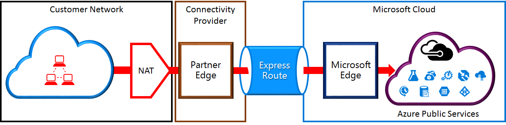

<properties
   pageTitle="NAT Anforderungen für ExpressRoute Schaltkreise | Microsoft Azure"
   description="Diese Seite enthält ausführliche Anforderungen für das Konfigurieren und Verwalten von NAT für ExpressRoute Schaltkreise."
   documentationCenter="na"
   services="expressroute"
   authors="cherylmc"
   manager="carmonm"
   editor=""/>
<tags
   ms.service="expressroute"
   ms.devlang="na"
   ms.topic="get-started-article"
   ms.tgt_pltfrm="na"
   ms.workload="infrastructure-services"
   ms.date="10/10/2016"
   ms.author="cherylmc"/>

# ExpressRoute NAT Anforderungen

Die Verbindung zu Microsoft-Cloud-Diensten mit ExpressRoute müssen Sie einrichten und Verwalten von NATs. Einige Connectivity-Anbieter bieten einrichten und Verwalten von NAT als verwalteter Dienst an. Wenden Sie sich an Ihren Anbieter Connectivity, um festzustellen, ob sie eine Dienstleistung bieten. Wenn dies nicht der Fall ist, müssen eingehalten werden an den nachfolgend beschriebenen. 

Überprüfen der Seite [ExpressRoute Schaltkreise und Domänen routing](expressroute-circuit-peerings.md) , um eine Übersicht der verschiedenen Domänen routing zu erhalten. Um die öffentliche IP-Adresse Azure öffentlichen und Microsoft peering erfüllen, wird empfohlen, dass Sie NAT zwischen Ihrem Netzwerk und Microsoft einrichten. Dieser Abschnitt enthält eine detaillierte Beschreibung der NAT-Infrastruktur, die Sie einrichten müssen.

## NAT Anforderungen für Azure öffentlichen peering

Der Azure öffentliche Peeringliste Pfad können Sie alle Dienste, die über ihre öffentlichen IP-Adressen in Azure gehostet Verbindung. Hierzu gehören Dienste aufgeführt, die in die [ExpessRoute häufig gestellte Fragen](expressroute-faqs.md) und alle Dienste von ISVs auf Microsoft Azure gehostet wird. Verbindung zu Microsoft Azure-Dienste auf Öffentliche peering wird immer in das Microsoft-Netzwerk aus Ihrem Netzwerk initiiert. Datenverkehr an Microsoft Azure auf Öffentliche peering muss gültige öffentliche IPv4-Adressen SNATed sein, bevor sie das Microsoft-Netzwerk zu gelangen. Die folgende Abbildung enthält ein Bild auf hoher Ebene wie die NAT so eingerichtet werden konnte die oben angegebenen Anforderung entsprechen.

 

### NAT IP-Pool und Routing Werbung

Sie müssen sicherstellen, dass Datenverkehr Azure öffentlichen Peeringliste Pfad mit gültigen öffentlichen IPv4-Adresse eingeben, wird. Microsoft muss das Eigentum an dem Pool IPv4 NAT Adressen anhand einer regionalen Weiterleitung Internet Registry (RIR) oder eine Weiterleitung Internet-Registrierung (IKV) überprüfen können. Ein Häkchen wird basierend auf den AS-Nummer wird dies mit und die IP-Adressen für Programm vorhanden ist. ausgeführt werden Schlagen Sie in der [Weiterleitung Anforderungen ExpressRoute](expressroute-routing.md) Seite Informationen zum routing Register.
 
Es gibt keine Einschränkungen auf die Länge des Präfixes NAT IP durch diese peering angekündigt. Überwachen der NAT Ressourcenpool und stellen Sie sicher, dass Sie nicht NAT Sitzungen Sicherstellung werden müssen.

>[AZURE.IMPORTANT] Die NAT IP-Ressourcenpool an Microsoft angekündigt muss mit dem Internet angekündigt. Dadurch wird die Verbindung zu anderen Microsoft-Diensten unterbrochen.

## NAT Anforderungen für Microsoft peering

Der Microsoft Peeringliste Pfad können Sie die Verbindung mit Microsoft-Cloud-Diensten, die über den Azure öffentlichen Peeringliste Pfad nicht unterstützt werden. Die Liste der Dienste umfasst Office 365-Diensten, wie z. B. Exchange Online, SharePoint Online, Skype for Business und CRM Online. Microsoft erwartet bidirektionale Konnektivität auf der Microsoft-peering unterstützen. Datenverkehr an Microsoft Cloud-Dienste muss gültige öffentliche IPv4-Adressen SNATed sein, bevor sie das Microsoft-Netzwerk zu gelangen. Datenverkehr von Microsoft-Cloud-Diensten mit Ihrem Netzwerk muss SNATed sein, bevor sie in Ihrem Netzwerk gelangen. Die folgende Abbildung enthält ein Bild auf hoher Ebene wie die NAT Setup für Microsoft peering werden sollen.
 
 

#### Verkehr von Ihrem Netzwerk an Microsoft gesendet wurden

- Sie müssen sicherstellen, dass Datenverkehr den Microsoft Peeringliste Pfad mit einer gültigen öffentlichen IPv4-Adresse eingeben, wird. Microsoft muss den Besitzer des dem Pool IPv4 NAT Adressen gegen die regionalen Weiterleitung Internet Registry (RIR) oder eine Weiterleitung Internet-Registrierung (IKV) überprüfen können. Ein Häkchen wird basierend auf den AS-Nummer wird dies mit und die IP-Adressen für Programm vorhanden ist. ausgeführt werden Schlagen Sie in der [Weiterleitung Anforderungen ExpressRoute](expressroute-routing.md) Seite Informationen zum routing Register.

- Für das Azure öffentliche Peeringliste Setup und andere ExpressRoute Schaltkreise verwendete IP-Adressen müssen nicht an Microsoft durch die Sitzung BGP angekündigt. Es gibt keine Beschränkung auf die Länge des Präfixes NAT IP durch diese peering angekündigt.

    >[AZURE.IMPORTANT] Die NAT IP-Ressourcenpool an Microsoft angekündigt muss mit dem Internet angekündigt. Dadurch wird die Verbindung zu anderen Microsoft-Diensten unterbrochen.

#### Verkehr von Microsoft, die mit Ihrem Netzwerk bestimmt ist

- Bestimmte Szenarios erfordern Microsoft Connectivity Service-Endpunkten in Ihrem Netzwerk gehostet einleiten. Eine typische Beispiele für das Szenario wäre Konnektivität zum ADFS-Server in Ihrem Netzwerk aus Office 365 gehostet wird. In diesem Fall müssen Sie entsprechende Präfixe auf Ihrem Netzwerk in der Microsoft peering verloren gehen. 

- Sie müssen SNAT Datenverkehr in IP-Adressen in Ihrem Netzwerk von Microsoft. 

## Nächste Schritte

- Die Anforderungen für das [Routing](expressroute-routing.md) und [QoS](expressroute-qos.md)finden Sie unter.
- Workflow-Informationen finden Sie unter [ExpressRoute Verbindung provisioning Workflows und Status Verbindung](expressroute-workflows.md).
- Konfigurieren Sie die Verbindung ExpressRoute.

    - [Erstellen einer Verbindung ExpressRoute](expressroute-howto-circuit-classic.md)
    - [Konfigurieren der Weiterleitung](expressroute-howto-routing-classic.md)
    - [Verknüpfen eines VNet zu einer ExpressRoute Verbindung](expressroute-howto-linkvnet-classic.md)

