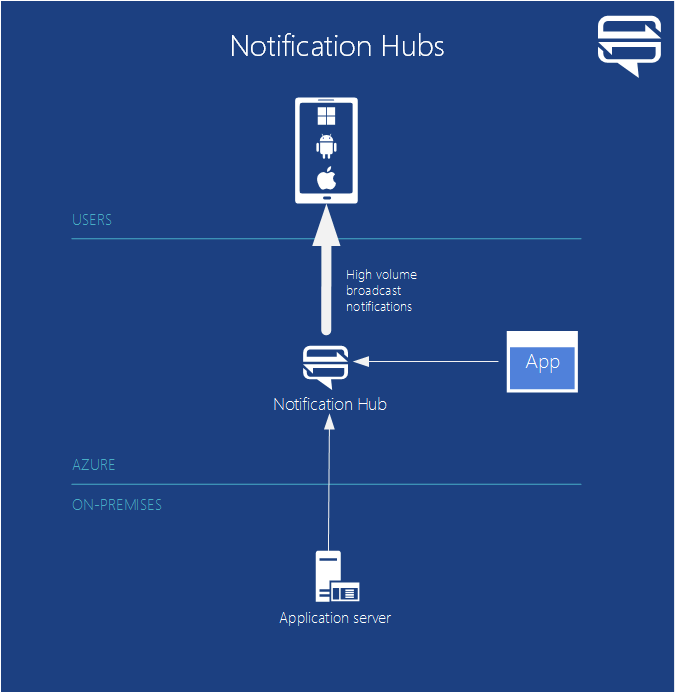
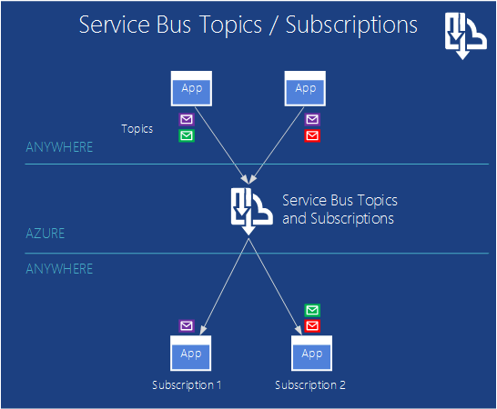

<properties
    pageTitle="Einführung in Microsoft Azure | Microsoft Azure"
    description="Neu bei Microsoft Azure? Sie erhalten einen Überblick der grundlegenden der Dienste vergleichbar mit Beispiele, wie sie hilfreich sind."
    services=" "
    documentationCenter=".net"
    authors="rboucher"
    manager="carolz"
    editor=""/>

<tags
    ms.service="multiple"
    ms.workload="multiple"
    ms.tgt_pltfrm="na"
    ms.devlang="na"
    ms.topic="article"
    ms.date="06/30/2015"  
    ms.author="robb"/>

# Einführung in Microsoft Azure

Microsoft Azure ist Microsoft Anwendungsplattform für die öffentliche Cloud.  Das Ziel dieses Artikels ist eine Grundlage zur Verfügung, für das Verständnis der Grundlagen von Azure, auch wenn Sie etwas über die Cloud nicht kennen computing.

**Wie in diesem Artikel lesen**

Azure nimmt immer zu, damit es überlastet ist.  Beginnen Sie mit den grundlegenden Diensten, die in diesem Artikel zuerst aufgeführt sind, und wechseln Sie dann auf Weitere Dienste. Das bedeutet nicht nur die zusätzlichen Dienste kann nicht direkt verwendet, aber die grundlegenden Dienste bilden das Herzstück einer Anwendung in Azure ausgeführt.

**Geben Sie feedback**

Ihr Feedback ist wichtig. In diesem Artikel erhalten Sie einen effektiven Azure im Überblick. Wenn dies nicht der Fall, teilen Sie uns im Abschnitt "Kommentare" am unteren Rand der Seite ein. Geben Sie einige Details auf was Sie erwartet angezeigt und wie Sie im Artikel zu verbessern.  

## Die Komponenten Azure

Azure gruppiert Dienste in Kategorien im Verwaltungsportal und auf verschiedene visuelle wie die [Was ist Azure Infographic](https://azure.microsoft.com/documentation/infographics/azure/) . Verwaltungsportal ist verwenden zum Verwalten die meisten (aber nicht alle) Services in Azure.

In diesem Artikel wird eine **andere Organisation** verwenden auf zu sprechen Services basierend auf ähnliche Funktion und wichtige untergeordnete Dienste aufrufen, die größere gehören.  

   
 *Abbildung: Azure bietet Internet zugänglichen Anwendungsdienste in Azure Rechenzentren ausgeführt.*

## Verwaltungsportal
Azure verfügt über eine Web-Oberfläche namens im [Verwaltungsportal](http://manage.windowsazure.com) , mit dem Administratoren zugreifen und am häufigsten verwalten können, aber nicht alle Azure-Features.  Microsoft-Versionen in der Regel das neuere Benutzeroberfläche Portal in Beta vor dem eine ältere zurückziehen. Das neuere Objekt wird das ["Azure Preview-Portals"](https://portal.azure.com/)bezeichnet.

Es ist in der Regel eine lange Überlappung, wenn beide Portals aktiviert sind. Aber Core Services in beiden communityportalen angezeigt werden, möglicherweise nicht alle Funktionen in beiden zur Verfügung. Neuere Services möglicherweise in das neuere Portal vor- und ältere Services angezeigt und Funktionalität kann nur in das ältere Objekt vorhanden sein.  Wenn Sie etwas im Portal ältere finden nicht das neuere Objekt und umgekehrt Prüfung ist hier die Nachricht.

## Berechnen

Eine der grundlegendsten Maßnahmen, die Cloud-Plattform unterstützt ist der Programme ausgeführt werden. Jedes der Modelle Azure berechnen verfügt über eine eigene Rolle ausprobieren.

Können Sie diese Technologien separat verwenden oder kombinieren Sie sie je nach Bedarf, um die richtigen Grundlage für eine Anwendung zu erstellen. Der Ansatz, die, den Sie auswählen, welche Probleme abhängt, versuchen Sie zu lösen.

### Azure-virtuellen Computern

   
*Abbildung: Azure-virtuellen Computern bietet Ihnen Vollzugriff auf virtuellen Computern Instanzen in der Cloud.*

Die Möglichkeit zum Erstellen eines virtuellen Computers bei Bedarf aus, ob vom ein Standardbild oder von einem Sie angeben, kann sehr hilfreich sein. Dieser Ansatz, bekannt als Infrastructure as a Service (IaaS), wird an, was Azure-virtuellen Computern bietet. Abbildung 2 zeigt eine Kombination aus wie ein virtuellen Computern virtueller (Computer) ausgeführt wird und wie Sie einen aus einer virtuellen Festplatte erstellen.  

Zum Erstellen eines virtuellen Computers geben Sie die virtuelle Festplatte Größe des virtuellen Computers zu verwenden.  Sie Zahlen klicken Sie dann für die Zeit, die der virtuellen Computer ausgeführt wird. Sie Zahlen durch die Minute und nur während der Ausführung, obwohl eine Belastung minimalen Speicher Übersichtlichkeit dient, die virtuelle Festplatte verfügbar ist. Azure bietet eine Sammlung von Stock virtuelle Festplatten ("Bilder" bezeichnet), die kein startfähiges Betriebssystem zu enthalten. Hierzu gehören Microsoft und Partner Optionen wie Windows Server und Linux, SQL Server, Oracle und vieles mehr. Sie können zum Erstellen von virtuellen Festplatten und Bilder, und Laden Sie diese selbst. Sie können auch virtuelle Festplatten hochladen, die nur Daten enthalten, und greifen sie dann aus der laufenden virtuellen Computern.

Wo die virtuelle Festplatte stammt, können Sie dauerhaft während der Ausführung eines virtuellen Computers vorgenommenen Änderungen speichern. Wählen Sie das nächste Mal ein virtuellen Computers zu, von dieser virtuellen Festplatte erstellen, Punkte, wo Sie unterbrochen. Die virtuelle Festplatten, die den virtuellen Computern wieder befinden sich in Azure-Speicher Blobs, wir später zu sprechen.  Das heißt, Sie redundant sicherstellen, dass Ihre virtuellen Computern aufgrund Hardware und Datenträger Fehlern verschwinden wird nicht erhalten. Es ist auch möglich, kopieren die geänderte virtuelle Festplatte aus Azure, und klicken Sie dann lokal ausführen.

Die Anwendung ausgeführt wird, in eine oder mehrere virtuelle Computer, je nachdem wie Sie es vor dem erstellt oder jetzt ganz neu erstellen möchten.

Dieser Ansatz ganz allgemeine, in die cloud computing kann viele verschiedene Probleme behoben verwendet werden.

**Szenarien virtuellen Computern**

1.  **Test-/** - möglicherweise eine preisgünstige Entwicklung und Test-Plattform zu erstellen, die Sie beenden können, wenn Sie es mit fertig sind, verwenden können. Sie können auch erstellen und ausführen, verwenden jeden Sprachen und Bibliotheken, die Ihnen gefällt. Diese Anwendungen können eine der Optionen Management Daten, die Azure ermöglicht, und Sie können auch mit SQL Server oder einem anderen DBMS in eine oder mehrere virtuelle Computer ausgeführt.
2.  **Verschieben von Applications in Azure (heben Sie und UMSCHALT)** – "Heben Sie und UMSCHALT" bezieht sich auf Ihrer Anwendung viel verschieben, wie Sie ein Gabelstapler verwenden würden, um eine große Objekt zu verschieben.  Sie "heben" die virtuelle Festplatte aus Ihrem lokalen Datencenter, und es in Azure "UMSCHALT" und dort ausgeführt werden.  Sie müssen in der Regel etwas arbeiten, um die Abhängigkeiten von anderen Systemen entfernen möchten. Wenn zu viele vorhanden sind, können Sie stattdessen die Option 3 auswählen.  
3.  **Erweitern Ihrer Datacenter** - verwenden Azure-virtuellen Computern als Erweiterung des Datencenters lokalen SharePoint oder einer anderen Anwendung ausgeführt. Um dies zu unterstützen, ist es möglich, die Windows-Domänen in der Cloud zu erstellen, indem Sie Active Directory in Azure-virtuellen Computern ausführen. Azure Virtual Network (später erwähnt) können Sie Ihr lokales Netzwerk und in Ihrem Netzwerk gemeinsam in Azure einbinden.

### Web Apps

   
 *Abbildung: Azure Web Apps führt eine Anwendung Website in der Cloud ohne den zugrunde liegenden Webserver verwalten.*

Eines der am häufigsten verwendeten Dinge, die Personen in der Cloud ist Websites und Web-Programme ausführen. Azure-virtuellen Computern Dies ermöglicht es, aber es immer noch bewirkt, dass Sie mit den Zuständigkeitsbereich Verwalten von einem oder mehreren virtuellen Computern und den zugrunde liegenden Betriebssystemen. Cloud Services-Web-Rollen können dafür, aber bereitstellen und verwalten diese erfordert weiterhin administrative Arbeit.  Was passiert, wenn Sie nur eine Website, wobei eines anderen Benutzers möchten sorgt dafür, dass die administrativen Arbeitsaufwand?

Dies ist genau das, was Web Apps enthält. Dieses Modell berechnen bietet eine verwaltete Web-Umgebung, die mit Azure-Verwaltungsportal als auch APIs. Sie können eine vorhandene Website-Anwendung in Web Apps unverändert verschieben, oder Sie können eine neue direkt in der Cloud erstellen. Sobald eine Website ausgeführt wird, können Sie hinzufügen oder entfernen Instanzen dynamisch, sich auf Azure Web Apps zu Doppelraten-Anfragen über diese laden zu verlassen. Azure Apps bietet sowohl zu einer freigegebenen Option Ihrer Website auf einem virtuellen Computer mit anderen Websites ausgeführt wird, eine mögliche Standardoption, mit dem eine Website auf einem eigenen virtuellen Computer ausgeführt werden kann. Die Option standard ermöglicht Ihnen außerdem, (computing Power) der Instanzen vergrößern, falls erforderlich.

Für die Entwicklung unterstützt Web Apps .NET, PHP, Node.js, Java und Python zusammen mit SQL-Datenbank und MySQL (von ClearDB, einem Microsoft-Partner) für relationale Speicher an. Darüber hinaus integrierten Unterstützung für mehrere beliebte Applikationen, einschließlich WordPress, Joomla und Drupal. Das Ziel ist eine Plattform kostengünstiger, skalierbare und gestreut nützliche für das Erstellen von Websites und Web-Applikationen in der öffentlichen Cloud bereitstellen.

**Web Apps-Szenarien**

Web Apps ist für Unternehmen, Entwickler und Web Entwurf Behörden hilfreich sein soll. Erstellen ist es eine einfach zu verwaltende, skalierbare, sehr sichere und hochgradig verfügbare Lösung für die Ausführung von Anwesenheitsinformationen Websites. Wenn Sie eine Website einrichten müssen, empfiehlt es sich, beginnen Sie mit Azure Web Apps, und fahren Sie mit der Cloud Services, nachdem Sie ein Feature benötigen, die nicht verfügbar ist. Finden Sie am Ende der Abschnitt "Berechnen" für weitere Links, mit denen Sie zwischen den Optionen auswählen können.

### Cloud-Dienste
   
*Abbildung: Azure Cloud Services bietet einen Ort zum Ausführen von hochgradig skalierbaren benutzerdefiniertem Codes auf einer Plattform als Umgebung Service (PaaS)*

Angenommen, Sie erstellen möchten eine Cloudanwendung, die viele gleichzeitige Benutzer unterstützen kann viel Administration setzt voraus, und wechselt nie ab. Sie möglicherweise eine definierte Software-Anbieter, z. B., die entschieden hat, auf die zweifache Software als Service (SaaS) durch Erstellen einer Version von eine Anwendung in der Cloud. Oder Sie möglicherweise neu erstellen einer Consumeranwendung, die Sie erwarten schnelles vergrößert wird. Wenn Sie auf Azure erstellen, sollte der Ausführungsmodell Sie werden verwendet?

Es gibt einige Einschränkungen Azure Web Apps ermöglicht diese Art von Web-Anwendung zu erstellen. Sie müssen nicht Administratorzugriff, beispielsweise, was bedeutet, dass Sie beliebige Software installieren können. Azure-virtuellen Computern erhalten Sie zahlreiche Flexibilität, einschließlich Administratorzugriff, und natürlich können Sie sie zum Erstellen einer Anwendungs sehr skalierbaren, aber Sie müssen verschiedene Aspekte des Zuverlässigkeit und Administration selbst behandeln. Sie möchten, ist eine Option, die das Steuerelement zu erhalten, das Sie müssen, aber auch behandelt, die meisten Aufgaben für Zuverlässigkeit und Verwaltung erforderlich ist.

Dies ist genau das, was von Azure Cloud Services bereitgestellt wird. Diese Technologie soll die Gesetze unterstützen skalierbare, zuverlässigen und Applikationen Tiefst-Administrator, und es ist ein Beispiel für die Plattform als Service (PaaS) eine so genannte hat. Wenn Sie es verwenden möchten, erstellen Sie mit Hilfe der Technologie, die Sie, die wie z. B. c#, Java, PHP, Python, Node.js oder eine andere auswählen Anwendung. Klicken Sie dann den Code ausführt, virtuellen-(Instanzen genannt) eine Version von Windows Server.

Aber diese virtuellen Computern unterscheiden sich von der zugewiesenen Aufgaben mit Azure virtuellen Computern zu erstellen. Für eine Sache, Azure selbst verwaltet werden, die Dinge wie Betriebssystempatches installieren und Bilder automatisch neu einführen korrigiert. Dies bedeutet, dass eine Anwendung beibehalten des Status im Web oder Arbeitskollegen Rolleninstanzen dürfen nicht; Sie sollten stattdessen in eine der Managementoptionen Azure Daten im nächsten Abschnitt beschrieben gehalten werden. Azure überwacht auch diese virtuellen Computern, die einen Neustart von beliebiger dieser Fail. Sie können die Cloud Services mehr oder weniger Instanzen automatisch als Antwort auf Demand erstellen festlegen. So können Sie höhere Verwendung behandeln, und klicken Sie dann Skalieren zurück, damit Sie möglichst viele bezahlen nicht zur Verfügung, wenn weniger Verwendung vorhanden ist.

Sie haben zwei Rollen, um eine Auswahl treffen bei der Erstellung einer Instanz, beide basierend auf dem Windows-Server. Der wichtigste Unterschied zwischen den beiden ist, dass eine Instanz von einer Webrolle IIS, ausgeführt wird, während eine Instanz der Worker-Rolle nicht der Fall ist. Beide werden auf die gleiche Weise, verwaltet jedoch und häufig Anwendung beide verwendet werden. Beispielsweise möglicherweise eine Instanz der Rolle Web Anfragen von Benutzern akzeptieren, und eine Worker-Rolle-Instanz für die Verarbeitung zu übergeben. Um eine Anwendung nach oben oder nach unten zu skalieren, können Sie anfordern, dass Azure weitere Instanzen von entweder Rolle erstellen, oder fahren Sie vorhandene Instanzen. Und ähnliche zu Azure virtuellen Computern werden berechnet, nur für die Zeit, dass jede Instanz der Rolle Web oder Arbeitskollegen ausgeführt wird.

**Cloud Services-Szenarien**

Cloud Services eignen sich zur Unterstützung von umfangreichen skalieren, wenn Sie mehr über die Plattform Kontrolle benötigen über die Azure Web Apps hinausgehen, aber keine Kontrolle über dem zugrunde liegenden Betriebssystem benötigen.

#### Auswählen eines Modells berechnen
Die Seite [Azure Web Apps, Cloud-Diensten und virtuellen Computern Vergleich](./app-service-web/choose-web-site-cloud-service-vm.md) enthält ausführlichen Informationen zum Auswählen eines Modells berechnen.

## Datenverwaltung

Daten von Applications erforderlich, und unterschiedliche Arten von Applications benötigen Sie verschiedene Arten von Daten. Aus diesem Grund bietet Azure zum Speichern und Verwalten von Daten auf verschiedene Weise an. Azure bietet viele Speicheroptionen, aber alle wurden dazu ausgelegt für sehr dauerhaften Speicher.  Mit einer der folgenden Optionen gibt es immer 3 Kopien Ihrer Daten über eine Azure Datacenter – 6, wenn Sie zulassen, dass Azure mit Geo-Redundanz zu einem anderen Datacenter mindestens 300 Meilen abwesend sichern synchron gehalten.     

### Auf virtuellen Computern
Die Möglichkeit zum Ausführen von SQL Server oder einem anderen DBMS in einen virtuellen Computer mit Azure virtuellen Computern erstellt wurde bereits erwähnt wurde. Stellen Sie fest, dass diese Option nicht auf relationalen Systemen beschränkt ist; Sie können auch NoSQL Technologien wie MongoDB und Cassandra ausführen. Eigene Datenbank das Betriebssystem ist recht einfach It repliziert wofür wir verwendet wird in eine eigene Rechenzentren sind-erfordert aber auch die Verwaltung dieser DBMS behandeln.  In anderen Optionen verarbeitet Azure weitere oder alle der Verwaltung für Sie.

Der Zustand des virtuellen Computers und alle weiteren Daten Datenträger erstellen oder Hochladen werden erneut von Blob-Speicher (das später besprochen) unterstützt.  

### SQL Azure-Datenbank
   

*Abbildung: Azure SQL-Datenbank bietet einen verwalteten relationalen Datenbank in der Cloud.*

Für relationale Speicher bietet Azure das Feature SQL-Datenbank. Lassen Sie nicht die benennen Sie zu täuschen. Dies unterscheidet sich von einer normalen SQL-Datenbank von SQL Server auf Windows Server ausgeführt bereitgestellt.  

Früher genannt SQL Azure, enthält Azure SQL-Datenbank alle über die wichtigsten Features von einer relationalen Datenbank Managementsystem, einschließlich atomare Transaktionen gleichzeitiger Data Access von mehreren Benutzern mit Datenintegrität, ANSI SQL-Abfragen und eine vertraute programming Modell. Wie SQL Server, SQL-Datenbank mit kann Entität Framework zugegriffen werden, zugreifen auf ADO.NET, JDBC und anderen vertrauten Daten Technologien. Darüber hinaus werden die meisten der T-SQL-Sprache zusammen mit SQL Server-Tools, wie etwa SQL Server Management Studio unterstützt. Bei jeder ist mit SQL Server (oder einer anderen relationalen Datenbank), mit der SQL-Datenbank einfach.

SQL-Datenbank ist nicht nur ein DBMS in der Cloud-It ist eine PaaS-Diensts. Weiterhin steuern Sie, Ihre Daten und wer darauf zugreifen können, aber SQL-Datenbank sorgt dafür, dass der administrative Routinearbeit wie Verwalten der Hardwareinfrastruktur und automatisch die Datenbank und Betriebssystem-Software auf dem neuesten Stand halten. SQL-Datenbank bietet auch eine hohe Verfügbarkeit, der automatischen Sicherung, Point-in-Time wiederherstellen Funktionen und Kopien können über hinweg Ländern / Regionen zu reproduzieren.  

**Szenarien für SQL-Datenbank**

Wenn Sie eine Azure-Anwendung (mit den berechnen Modelle) erstellen, die relationale Speicher benötigt, kann die SQL-Datenbank eine gute Option sein. Außerhalb der Cloud ausgeführt Applications können diesen Dienst, jedoch Sie auch, damit es zahlreiche andere Szenarios gibt. Beispielsweise können in der SQL-Datenbank gespeicherte Daten aus verschiedenen Client-Systeme, einschließlich Desktops, Laptops, Mobiltelefonen und Tablets zugegriffen werden. Und da es integrierten hohen Verfügbarkeit durch Replikation bereitstellt, SQL-Datenbank Ausfallzeit zu minimieren.

### Tabellen
  

*Abbildung: Azure Tabellen enthält eine flache NoSQL Möglichkeit zum Speichern von Daten.*

Dieses Feature ist manchmal unterschiedliche Begriffe als Teil der größere sogenannten "Azure-Speicher" bezeichnet. Wenn Sie "Tabellen", "Azure Tabellen" oder "Speichertabellen" angezeigt wird, ist es das gleiche.  

Und nicht nach dem Namen verwechselt werden: Diese Technologie relationale Speicher nicht zur Verfügung. Tatsächlich ist es ein Beispiel für einen NoSQL Ansatz einen Schlüssel/Wert-Speicher bezeichnet. Azure Tabellen zulassen, dass eine Anwendung Eigenschaften verschiedener Typen, z. B. Zeichenfolgen, Zahlen und Datumsangaben zu speichern. Eine Anwendung kann eine Gruppe von Eigenschaften dann können, indem Sie einen eindeutigen Schlüssel für diese Gruppe abrufen. Während Sie komplexe Vorgänge wie Verknüpfungen unterstützt werden, bieten Tabellen schnellen Zugriff auf eingegebenen Daten. Sie können auch sehr skalierbar und mit einer einzelnen Tabelle soviel wie eine TB Daten aufnehmen können. Und Vergleichen von deren Vereinfachung Tabellen sind in der Regel kostengünstiger, als relationale SQL-Datenbank-Speicher verwenden.

**Szenarien für Tabellen**

Angenommen, Sie erstellen möchten eine Azure-Anwendung, das schnellen Zugriff auf eingegebenen Daten zahlreiche es vielleicht, aber keine komplexe SQL-Abfragen für diese Daten ausführen muss. Angenommen Sie, dass Sie eine Consumeranwendung erstellen, die Kunden Profilinformationen für jeden Benutzer gespeichert werden muss. Ihre app ist dies sehr beliebte, daher Sie für große Datenmengen zulassen müssen, aber viele mit diesen Daten jenseits speichern, wird nicht führen sie dann auf einfache Weise abrufen. Dies ist genau die Art der Szenario, in dem Azure Tabellen sinnvoll ist.

### BLOBs
    
*Abbildung: Azure Blobs stellt unstrukturierte binäre Daten.*  

Azure Blobs (erneut sind "BLOB-Speicher" und nur-Speicher Blobs"genauso) Dient zum Speichern von unstrukturierten binärer Daten. Wie Tabellen Blobs bietet preisgünstige Speicher und ein einzelnes Blob kann als 1TB (eine TB) so groß sein. Azure Applications können auch Azure Laufwerke, auf denen Blobs permanenten Speicher für ein Windows-Dateisystem in einer Azure Instanz bereitgestellt bereitstellen können. Die Anwendung sieht normale Windows-Dateien, aber den Inhalt in einem Blob tatsächlich gespeichert sind.

BLOB-Speicher von vielen anderen Azure Features (einschließlich virtuellen Computern) verwendet, damit Ihre Auslastung sicher zu behandeln können.

**Szenarien für Blobs**

Eine Anwendung, die video, großer Dateien oder andere binäre Informationen speichert kann Blobs für einfache, effizient Speicher verwenden. BLOBs werden häufig auch in Verbindung mit anderen Diensten wie Inhalt Netzwerk für die Bereitstellung verwendet wir später sprechen wird.  

### Import / Export
  

*Abbildung: Azure importieren / exportieren bietet die Möglichkeit, versenden eine physische Festplatte oder aus Azure für schneller und kostengünstiger Massendaten importieren oder exportieren.*  

Manchmal möchten Sie eine große Datenmenge in Azure zu verschieben. Die würde sehr lange dauern, vielleicht Tage, und verwenden Sie keine große Bandbreite. In diesen Fällen können Sie Azure importieren/exportieren, wodurch Sie Materialien für den Bitlocker verschlüsselt 3,5" SATA-Festplatten direkt an Azure Data Center, in dem Microsoft die Daten in Blob-Speicher für Sie übertragen werden.  Nach Abschluss des Uploads liefert Microsoft Laufwerke vorlesen.  Sie können auch anfordern, dass große Datenmengen aus Blob-Speicher auf Festplatten exportiert und wieder an Sie per e-Mail gesendet werden.

**Szenarien für den Import / Export**

- **Große Data Migration** – jedes Mal, wenn Sie große Datenmengen (TB) haben, die in Azure hochgeladen werden soll, der Import/Export-Dienst ist häufig deutlich schneller und vielleicht kostengünstiger als ihn über das Internet übertragen. Sobald die Daten in Blobs ist, können Sie ihn in andere Formen wie Tabellenspeicher oder einer SQL-Datenbank verarbeiten.

- **Archivierte Daten Wiederherstellung** – Sie können Import/Export-haben Microsoft durchstellen große Datenmengen in Azure BLOB-Speicher zu einem Speichergerät, die Sie senden und gespeichert haben klicken Sie dann das Gerät wieder an einem Speicherort, der Sie die gewünschte übermittelt.. Da dies einige Zeit in Anspruch nehmen wird, ist es keine gute Option für die Wiederherstellung. Es empfiehlt sich für archivierte Daten, denen Sie zum schnellen Zugriff benötigen.

### Dateidienst
    
*Abbildung: Azure File-Services bietet SMB \\ \\: Server\Freigabe Pfade für die Anwendung, die in der Cloud ausgeführt.*

Lokal häufig haben große Mengen von Dateispeicher über das Protokoll verwenden (SMB = Server Message Block) zugegriffen werden kann ein \\ \\: Server\Freigabe Format. Azure verfügt jetzt über eine Dienst, der Sie in der Cloud dieses Protokoll verwenden kann. In Azure ausgeführt Applications können gemeinsamen Nutzung von Dateien zwischen virtuellen Computern vertraut Dateisystem-APIs wie ReadFile und WriteFile verwenden. Darüber hinaus können Dateien auch zur gleichen Zeit über eine REST-Schnittstelle zugegriffen werden, die sodass die Freigaben lokal zugreifen, wenn Sie ein virtuelles Netzwerk auch einrichten können. Azure Dateien basiert auf den Dienst Blob, damit sie die gleichen Verfügbarkeit, Zuverlässigkeit, Skalierbarkeit und Azure-Speicher integriert Geo-Redundanz erbt.

**Szenarien für Azure-Dateien**

- **Migrieren von vorhandenen apps in der Cloud** - seine einfacher zu migrieren lokalen Applications in der Cloud, die Dateifreigaben zum Freigeben von Daten zwischen Teile der Anwendung verwenden. Jeder virtuellen Computer eine Verbindung herstellt, auf die Dateifreigabe und dann können lesen und Schreiben von Dateien, wie es anhand einer lokalen Datei freigeben möchten.

- **Freigegebene Anwendungseinstellungen** - ein gemeinsames Muster für verteilten Applikationen besteht darin, Konfigurationsdateien an einem zentralen Speicherort gespeichert haben, in dem sie aus vielen verschiedenen virtuellen Computern zugegriffen werden kann. Diese Konfigurationsdateien können in einer Azure Dateifreigabe gespeichert und von allen Anwendungsinstanzen gelesen werden. Die Einstellungen können auch über der REST-Schnittstelle verwaltet werden, wodurch weltweit Zugriff auf die Konfigurationsdateien.

- **Freigeben von Diagnoseprotokollen** - können Sie speichern und Freigeben von Diagnoseprotokollen Dateien wie Protokolle, Kennzahlen und Absturz speichert. Diese Dateien Probleme ermöglicht verfügbar über die SMB und die restlichen Schnittstelle Applikationen mit einer Vielzahl von Analysetools für die Verarbeitung und Analysieren von Daten Diagnose.

- **Entwicklung und Test/Debuggen** – Wenn Entwickler oder Administratoren auf virtuellen Computern in der Cloud arbeiten, benötigen sie oft eine Reihe von Tools oder Dienstprogramme. Installieren und diese Dienstprogramme auf jedem virtuellen Computer verteilen ist Zeit in Anspruch nehmen. Mit Azure-Dateien ein Entwickler oder Administrator ihre bevorzugten Tools in einem freigegebenen Ordner speichern und alle virtuellen Computers zu verbinden.

## Netzwerke

Azure ausgeführt wird heute in vielen Rechenzentren auf der ganzen Welt verteilt. Wenn Sie eine Anwendung ausführen oder Speichern von Daten, können Sie eine oder mehrere der folgenden Rechenzentren verwenden auswählen. Sie können auch mit diesen Rechenzentren auf verschiedene Weise mithilfe der folgenden Dienste herstellen.

### Virtuelles Netzwerk
   

*Abbildung: Virtuelle Netzwerke bietet ein privates Netzwerk in der Cloud, sodass andere Dienste können miteinander kommunizieren, oder auf lokale Ressourcen Wenn Sie von einrichten VPN Cross lokale Verbindung.*  

Eine hilfreiche Methode, um eine öffentliche Cloud verwenden ist, dies als Erweiterung von Ihrem eigenen Datencenter zu behandeln.

Da Sie bei Bedarf virtuellen Computern erstellen können, klicken Sie dann entfernen (und bezahlen beenden) Wenn sie nicht mehr benötigt werden, können Sie Power computing, nur, wenn die gewünschte haben. Und da Azure-virtuellen Computern virtuellen Computern unter SharePoint, Active Directory und anderen vertraut lokalen Software erstellen können, kann die Programme, die bereits dieser Ansatz arbeiten.

Zum Anlegen besonders hilfreich, sollte jedoch die Benutzer in der Lage, als ob sie in Ihrem eigenen Datencenter ausgeführt wurden diese Anwendungen zu behandeln. Dies ist genau das, was virtuelles Netzwerk Azure ermöglicht. Mit einem VPN-Gateway-Gerät, kann ein Administrator richten Sie ein virtuelles privates Netzwerk (VPN) zwischen dem lokalen Netzwerk und Ihre virtuellen Computern, die zu einem virtuellen Netzwerk in Azure bereitgestellt werden. Da Sie eine eigene IP-Adressen v4 in der Cloud virtuellen Computern zuweisen, werden diese in Ihrem eigenen Netzwerk angezeigt. Benutzer in Ihrer Organisation die Applikationen zugreifen können diese virtuellen Computern enthalten, als ob sie lokal ausgeführt wurden.

Weitere Informationen zum Planen und Erstellen eines virtuellen Netzwerks, das für Sie geeigneten finden Sie unter [Virtuelles Netzwerk](./virtual-network/virtual-networks-overview.md).

### Express-Routing

   

*Abbildung: ExpressRoute ein Azure-virtuellen Netzwerk verwendet, aber Verbindungen über schneller dedizierten Linien anstelle der öffentlichen Internet weiterleitet.*  

Wenn Sie benötigen mehr Bandbreite oder Sicherheit als ein virtuelles Azure-Netzwerk Verbindung bereitgestellt werden, können Sie in ExpressRoute suchen. In einigen Fällen kann ExpressRoute auch Sie Geld speichern. Sie benötigen weiterhin ein virtuelles Netzwerk in Azure, aber die Verknüpfung zwischen Azure und Ihre Website verwendet eine dedizierte Verbindung, die nicht über das Internet öffentlichen verlaufen ist. Um diesen Dienst verwenden zu können, müssen Sie eine Vereinbarung mit einem Netzwerk-Dienstanbieter oder Exchange-Anbieter verfügen.

Einrichten einer ExpressRoute Verbindung mehr Zeit erforderlich ist, und planen, daher sollten Sie beginnen mit einem Website-zu-Standort VPN, und klicken Sie dann an eine Verbindung ExpressRoute migrieren.

Weitere Informationen zu ExpressRoute finden Sie unter [ExpressRoute – technische Übersicht](./expressroute/expressroute-introduction.md).

### Datenverkehr-Manager

   

*Abbildung: Azure Datenverkehr-Manager können Sie für globale Datenverkehr an Ihrem Dienst basierend auf intelligente Regeln.*

Wenn mehrere Rechenzentren Azure-Anwendung ausgeführt wird, können Sie Azure Datenverkehr Manager zum Weiterleiten von Besprechungsanfragen, die von Benutzern intelligente über Instanzen der Anwendung verwenden. Sie können auch Datenverkehr auf Dienste, die nicht in Azure ausgeführt, solange sie über das Internet zugänglich sind.  

Für Benutzer nur einen einzelnen Teil der ganzen Welt Anwendung Azure möglicherweise nur eine Azure Datacenter ausführen. Eine Anwendung für Benutzer, die auf der ganzen Welt verteilt ist jedoch eher auf mehrere Rechenzentren vielleicht sogar alle ausgeführt werden. In diesem Fall zweiten Sie ein Problem konfrontiert: wie Sie intelligente Weiterleitung der Benutzer auf Anwendungsinstanzen? In den meisten Fällen, möchten Sie möglicherweise jeder Benutzer, die sich am nächsten Datencenter zugreifen, da es wahrscheinlich sich die optimale Antwortzeit erhält. Jedoch was passiert, wenn diese Instanz der Anwendung ist überladenen oder nicht verfügbar? In diesem Fall wäre es nett, um ihre Anforderung automatisch an ein anderes Datacenter zu leiten. Dies ist genau das, was von Azure Datenverkehr Manager bereits erledigt ist.

Der Besitzer der Anwendung definiert Regeln, die angeben, wie Besprechungsanfragen, die von Benutzern in Rechenzentren geleitet werden soll, und klicken Sie dann beruht auf den Datenverkehr Manager zur Durchführung dieser Regeln. Beispielsweise Benutzer möglicherweise an der nächstgelegenen Azure Datacenter normal weitergeleitet werden, aber wenn die Antwort-Zeiten Rechenzentrum Standard die Antwortzeit von anderen Rechenzentren überschreitet mit einer weiteren gesendet. Für Global verteilten Applikationen mit vielen Benutzern eignet sich einen integrierten Dienst, Behandeln von Problemen, wie diese Probleme.

Datenverkehr Manager Directory Name Service (DNS) verwendet, um Benutzer-Endpunkte Routing, aber weiteren Datenverkehr geht nicht über den Datenverkehr-Manager, nachdem die Verbindung hergestellt wird. Dadurch wird verhindert, dass Datenverkehr Manager wird ein, der der Dienst Kommunikation verlangsamen möglicherweise Engpass.

## Developer Services
Azure bietet eine Reihe von Tools besser Entwickler und IT-Experten erstellen und Verwalten von Applications in der Cloud.  

### Azure SDK
Zurück in 2008 unterstützt das allererste Vorabversion von Azure nur .NET Development. Heute, können, Sie jedoch erstellen Azure Applications in einer beliebigen ziemlich Sprache. Microsoft bietet SDKs sprachspezifischen derzeit für .NET, Java, PHP, Node.js, Ruby und Python. Es gibt auch eine allgemeine Azure SDK, die grundlegende Unterstützung für alle Sprachen, z. B. C++ bereitstellt.  

Diese SDKs helfen Sie erstellen, bereitstellen und Verwalten von Azure Applications. Sie sind verfügbar, entweder [www.microsoftazure.com](https://azure.microsoft.com/downloads/) oder GitHub, und sie können mit Visual Studio und "Ellipse" verwendet werden. Azure bietet auch Befehlszeilentools, mit denen Entwickler mit jeder Umgebung-Editor oder Entwicklung, einschließlich Tools für die Bereitstellung von Applications in Azure von Linux und Macintosh-Betriebssysteme auf.

Zusammen mit hilft Ihnen, Azure Applications erstellen, auch diese SDKs bieten Clientbibliotheken, die Ihnen helfen, Erstellen von Software, Azure Services verwendet. Sie möglicherweise beispielsweise eine Anwendung, die liest und schreibt Azure BLOBs, erstellen oder erstellen ein Tools, das über die Benutzeroberfläche Azure Management Azure Applications bereitstellt.

### Visual Studio Team Services

Visual Studio Team Services wird darüber liegendem eine Zahl Dienstleistungen, die Hilfe zum Entwickeln von Applications in der Azure marketing Namen.

Zur Vermeidung von Verwirrung - bietet es keine gehostete oder webbasierte Version von Visual Studio. Sie benötigen weiterhin die lokale laufende Kopie von Visual Studio. Aber es bietet viele andere Tools, die sehr hilfreich sein können.

Es ist ein Team Foundation-Dienst, der Versionskontrolle und die Überwachung von Arbeitselementen bietet aufgerufen gehosteten Quelle Steuerelement-System enthalten.  Sie können sogar Git für die Versionskontrolle verwenden, wenn Sie es, die vorziehen. Und Sie können das Quelle Steuerelement-System, die, das Sie, indem Sie Project verwenden, variieren. Sie können Teamprojekte unbegrenzte private verfügbare an einer beliebigen Stelle in der Welt erstellen.  

Visual Studio Team Services bietet einen laden testen. Sie können beim Laden Tests in Visual Studio auf virtuellen Computern in der Cloud erstellten ausführen. Geben Sie die Gesamtzahl der Benutzer, denen Sie laden mit testen möchten, und Visual Studio Team Services ermittelt automatisch, wie viele Agents benötigt werden, die erforderlichen virtuellen Computern beginnen, und führen Sie die Tests laden. Wenn Sie MSDN-Abonnent sind, erhalten Sie Tausende von kostenlosen Benutzer-Minuten Last testen jeden Monat.

Visual Studio Team Services bietet auch Unterstützung für agilen Entwicklung mit Features wie fortlaufender Integration erstellt, Kanban-Übersichten und virtuelle Teams Chatrooms.

**Visual Studio-Team Services Szenarien**

Visual Studio Team Services ist eine gute Option für Unternehmen, die müssen weltweit zusammenarbeiten und nicht bereits die Infrastruktur direkte vergeblich. Setup in Minuten erhalten, wählen Sie ein Datenquellen-Steuerelement-System, und Schreiben von Code und Erstellen von diesem Tag starten.  Die Teamtools bieten einen Ort für die Koordinierung und Zusammenarbeit und die zusätzlichen Tools bieten die Analyse zum Testen und optimieren schnell eine Anwendung erforderlich sind.

Aber an Organisationen, die bereits eine lokale System neue Projekte auf Visual Studio Team Services, um festzustellen, ob es effektiver ist testen können.   

### Anwendung Einsichten

  

*Abbildung: Überwachung der Anwendung Einsichten Performance und die Verwendung der live Web oder Gerät app.*

Wenn Sie Ihre app - veröffentlicht haben, ob die Ausführung auf mobilen Geräten, Desktops oder Webbrowser - teilt Anwendung Einsichten wie es ausführt, und was Benutzer mit ihr tun. Diese Anzahl von Abstürzen und langsam Antwort beibehalten werden, benachrichtigen automatisch ein, wenn die Zahlen inakzeptabel Schwellenwerten Cross und helfen Ihnen bei einem beliebigen Probleme erkennen.

Wenn Sie ein neues Feature entwickeln, Planen Sie deren Erfolg-Benutzer gemessen. Durch die Analyse der von Verwendungsmustern berücksichtigen, verstehen, was für Ihre Kunden am besten geeignete und verbessern Ihre app in jeder Entwicklungszyklus.

Obwohl es in Azure gehostet wird, funktioniert Anwendung Einsichten für eine große und wachsende Auswahl von apps, klicken Sie auf sowohl deaktivieren Azure. Sowohl die J2EE ASP.NET Web, apps verdeckt werden, ebenso wie iOS, Android, OSX und Windows Applications. Telemetrieprotokoll wird gesendet, aus einer SDK mithilfe der app zu analysiert und in der Anwendung Einsichten Dienst in Azure angezeigt werden.

Wenn Sie noch spezialisiertere Analytics möchten, exportieren Sie werden Streams einer Datenbank oder Power BI oder eine beliebige andere Tools.

**Anwendung Einsichten Szenarien**

Entwickeln Sie eine app. Es möglicherweise eine Web app oder eine app Gerät oder ein Gerät app mit einem Web-Back-End.

* Optimieren Sie die Leistung der app aus, nach der Veröffentlichung, oder es in zwar Laden Sie testen.  Anwendung Einsichten aggregiert werden von allen installierten Instanzen und stellt Ihnen der Reaktionszeiten, Anfrage und Ausnahme zählt, Abhängigkeit Reaktionszeiten und anderen Performance Indicators Diagramme. Diese helfen Ihnen, die Leistung Ihrer Anwendung zu optimieren. Sie können den Code ein, um weitere Berichte Einfügen bestimmter Daten, wenn Sie es benötigen.
* Erkennen und Diagnostizieren von Problemen in Ihrer live-app. Sie können Benachrichtigungen per e-Mail erhalten, wenn Performance Indicators zulässigen Schwellenwerte cross. Sie können bestimmte Benutzer Sitzungen, beispielsweise die Anforderung angezeigt, die eine Ausnahme verursacht ermitteln.
* Nachverfolgen von Verwendung zur Bewertung des Erfolgs jedes neue Features. Wenn Sie einen neuen Benutzertextabschnitt entwerfen, Planen Sie messen, wie viel sie verwendet wird, und gibt an, ob der Benutzer ihre erwarteten Ziele zu erreichen. Anwendung Einsichten erhalten Sie grundlegende Verwendungsdaten wie Ansichten der Webseite, und Code, um die Benutzerfunktionalität ausführlicher nachverfolgen können einfügen.

### Automatisierung
Niemand "gefällt mir" in der gleichen manuelle Prozesse immer wieder ausführen Zeit verschwenden. Azure Automatisierung bietet eine Möglichkeit, erstellen, überwachen, verwalten und Bereitstellen von Ressourcen in Ihrer Umgebung Azure.  

Automation verwendet "Runbooks", die Windows PowerShell-Workflows (statt nur reguläre PowerShell) im Hintergrund verwendet. Runbooks werden ohne Interaktion mit dem Benutzer ausgeführt werden soll. PowerShell-Workflows können den Status eines Skripts an Kontrollpunkten unterwegs gespeichert werden. Wenn ein Fehler auftritt, müssen Sie dann kein Skript vom Anfang zu starten. Sie können am letzten Prüfpunkt neu starten. Dies speichert viele arbeiten möchten, müssen das Skript jede mögliche Fehler zu behandeln.

**Automatisierungsszenarien**

Azure Automatisierung ist eine gute Wahl, wenn die manuellen, langer, fehlerhaften und häufig wiederholten Aufgaben in Azure automatisieren.

### API Management

Erstellen und Veröffentlichen von Anwendungsprogrammierungsschnittstellen (APIs) im Internet ist ein gängiges Verfahren zum Bereitstellen von Applications-Dienste. Wenn Dienste (z. B. Wetterdaten) resellable sind, kann eine Organisation andere dritte gleichen Dienste für eine Gebühr Zugriff auf zulassen. Wie Sie für weitere Partner skalieren, müssen Sie normalerweise optimieren und Steuern des Zugriffs.  Einige Partner möglicherweise auch die Daten in einem anderen Format benötigen.

Azure-API Management erleichtert Organisationen APIs Partner, Mitarbeiter und Drittanbieter-Entwickler sicher und bei veröffentlichen. Es stellt einen anderen API Endpunkt und fungiert als Proxy den ist-Endpunkt zu lenken, und Bereitstellen von Diensten wie zwischenspeichern, Transformation, begrenzungsebene, Access-Steuerelement und Analytics Aggregation.

**API Management Szenarien**

Angenommen, Ihr Unternehmen verfügt über eine Reihe von Geräten, dass alle wieder an einen zentralen Dienst zum Abrufen von Daten – beispielsweise einem Versandunternehmen aufrufen, der Geräte in jeder LKW ständige müssen.  Das Unternehmen sollten natürlich ein System einrichten, dass es eigene Trucks nachverfolgen, sodass es zuverlässig Vorhersagen und Übermittlungszeiten aktualisieren kann. Sie können Sie wissen, wie viele Trucks es hat und ordnungsgemäß planen.  Jede LKW wird ein Gerät benötigen, die an einem zentralen Ort mit seiner Position und Geschwindigkeit Daten vielleicht wieder Anrufe.

Ein Kunden des Unternehmens Versand wahrscheinlich nutzbringend auch diese Positionierung Daten abrufen.  Der Kunde könnten sie erfahren, wie weit Produkte zu folgen, in dem sie, wie viel sie bezahlen entlang bestimmte leitet (wenn zusammen mit, was sie versenden bezahlt) weiterkommen, verwenden. Wenn das Unternehmen Versand diese Daten bereits fasst zusammen, möglicherweise viele Kunden dafür bezahlen.  Aber dann muss das Unternehmen Versand Kunden geben Sie die Daten zu ermöglichen. Nachdem sie Zugriff auf Kunden ermöglichen, sie verfügen möglicherweise nicht steuern, wie oft die Daten abgefragt werden. Sie müssen angeben Regeln, wer welche Daten zugreifen können. Alle diese Regeln nutzen, müssen Sie in ihrer externen API integriert werden. Dies ist die Stelle, an der API Management helfen können.  

## Identität und Zugriff

Arbeiten mit Identität gehört die meisten Applikationen. Wenn Sie wissen, wer ein Benutzer ist, können Anwendung entscheiden, wie sie mit diesen Benutzer interagieren soll. Azure bietet Dienste verfolgen Identität ebenso wie es in Stores Identität zu integrieren, die Sie bereits verwendet werden können.

### Active Directory

Wie die meisten Directory Dienste speichert Azure Active Directory Informationen über Benutzer und der Organisationen, denen sie angehören. Sie können sich Benutzer anmelden und dann Anzeigespalte diese mit Token, die auf Anwendungen, um seine Identität zu beweisen angezeigt werden kann. Sie können auch die Synchronisierung von Benutzerinformationen mit Windows Server Active Directory lokal in Ihrem lokalen Netzwerk ausgeführt. Während die Verfahren und Azure Active Directory verwendeten Datenformaten nicht identisch mit denen in Windows Server Active Directory sind, sind die Funktionen, die es führt sehr ähnlich.

Es ist wichtig zu verstehen, dass Azure Active Directory hauptsächlich für den Einsatz von Cloud-Clientanwendungen ausgelegt ist. Sie können von Applications ausgeführt Azure, beispielsweise oder auf andere Cloud-Plattformen verwendet werden. Es wird auch der Microsoft Cloud, z. B. von Personen in Office 365 verwendet werden. Wenn Sie Ihr Datencenter in der Cloud mit Azure-virtuellen Computern und Azure-virtuellen Netzwerk erweitern möchten, nicht jedoch Azure Active Directory und die richtige Wahl. Möchten Sie stattdessen Active Directory von Windows Server auf virtuellen Computern ausführen.

Damit können die Informationen zugreifen, die darin enthaltenen Applications, bietet Azure Active Directory eine REST-API aufgerufen Azure-Active Directory-Diagramm. Diese API kann keine Plattform Access Directory-Objekte und die Beziehungen zwischen diesen ausgeführt Applications.  Beispielsweise möglicherweise eine autorisierte Anwendung diese API verwenden, um Informationen zu einem Benutzer, die Gruppen, zu denen gehört und andere Informationen. Applikationen können auch Beziehungen zwischen Benutzer their für soziale Netzwerke Graph-Vermietung diese Intelligenter arbeiten mit den Verbindungen zwischen Personen anzeigen.

Ist eine weitere Möglichkeit für diesen Dienst, Azure Active Directory Access Control vereinfacht Anwendung Identitätsinformationen aus Facebook, Google, Windows Live ID und andere beliebte Identitätsanbieter annehmen. Statt dass die Anwendung die unterschiedlichen Datenformaten und von jedem der folgenden Anbieter verwendeten Protokolle zu verstehen, übersetzt Access Control aller Folien in einer einzelnen gebräuchliches Format. Darüber hinaus können eine Anwendung Benutzernamen von einer oder mehrerer Active Directory-Domänen annehmen. Beispielsweise möglicherweise ein Lieferanten unter Bereitstellen einer Anwendungs SaaS Azure Active Directory Access Control verwenden, Benutzer in jeder der seiner Kunden einmaliges Anmelden mit der Anwendung gewähren.

Directory Services sind eine Core Grundlage lokal computing. Es sollte nicht überraschende sein, dass sie in der Cloud auch wichtig sind.

### Mehrstufige Authentifizierung
   

*Abbildung: Kombinierte Authentifizierung stellt die Funktionalität für eine Anwendung zur Überprüfung von mehr als eine Art der Identifizierung*

Sicherheit ist immer wichtig. Mehrstufige Authentifizierung (MFA) hilft, stellen Sie sicher, dass nur die Benutzer sich selbst ihren Konten zugreifen. MFA (auch bekannt als zweifaktorielle Varianzanalyse Authentifizierung oder "2FA") erfordert, dass Benutzer zwei dieser drei Methoden der Identität Überprüfung für Benutzer anmelden-ins und Transaktionen bereitstellen.

- Etwas wissen (in der Regel ein Kennwort)
- Etwas, das Sie (ein vertrauenswürdiges Gerät, das nicht einfach besitzen, wie ein Telefon dupliziert ist)
- Etwas werden (Biometrik)

Also, wenn sich der Benutzer anmeldet, können Sie erforderlich machen, um seine Identität mit mobile-app, einen Anruf oder einer Textnachricht in Kombination mit dessen Kennwort auch zu überprüfen. Standardmäßig unterstützt Azure Active Directory die Verwendung von Kennwörtern als einzige Authentifizierungsmethode für Benutzer anmelden-ins aus. MFA zusammen mit Azure AD- oder mit benutzerdefinierten Programmen und Verzeichnissen können mit dem MFA SDK. Sie können Sie mithilfe von mehrstufige Authentifizierungsserver auch zusammen mit lokalen Anwendungen verwenden.

**MFA Szenarien**

Login Schutz für wichtige Konten wie Bank Benutzernamen und den Zugriff auf den Quellcode, in dem nicht autorisierten Eintrag eine hohe Kosten financial oder geistige Eigenschaft hätte.   

## Mobile

Wenn Sie eine app für ein mobiles Gerät erstellen, kann Azure helfen, Daten in der Cloud speichern, Benutzerauthentifizierung und Pushbenachrichtigungen zu senden, ohne dass Sie eine Vielzahl von benutzerdefiniertem Code schreiben.

Während Sie die Back-End für eine mobile-app von virtuellen Computern, die Cloud Services oder Web Apps jeden Fall erstellen können, können Sie viel weniger Zeit, Schreiben von Komponenten des zugrunde liegenden mithilfe des Azure Services investieren.

### Mobile-Apps

*Abbildung: Mobilen Apps Funktionsumfang häufig von Clientanwendungen, die mit mobilen Geräten Schnittstelle erforderlich.*

Azure Mobile-Apps bietet viele nützliche Funktionen, die Sie speichern können Zeit, wenn Sie einer Back-End für eine Mobile Anwendung zu erstellen. Es ermöglicht Ihnen, führen Sie einfach bereitgestellt und Verwaltung von Daten in einer SQL-Datenbank gespeichert. Mit einem serverseitigen Code können Sie problemlos Speicheroptionen für weitere Daten wie Blob-Speicher oder MongoDB verwenden. Mobile-Apps bietet Unterstützung für Benachrichtigungen, obwohl in bestimmten Fällen Sie stattdessen Benachrichtigung Hubs verwenden können wie im folgenden beschrieben.  Der Dienst wurde auch eine REST-API, die die mobile Anwendung aufrufen kann, um die Arbeit erledigen. Mobile-Apps bietet auch die Möglichkeit, Benutzer über die Microsoft und Active Directory und anderen bekannten Identitätsanbieter wie Facebook, Twitter und Google authentifizieren.   

Sie können andere Azure-Diensten wie Dienstbus und Worker-Rollen verwenden und auf lokale Systeme verbinden. Sie können sogar 3rd Party Add-Ons aus dem Azure-Speicher (wie etwa SendGrid für e-Mail) nutzen, um zusätzliche Funktionen bereitzustellen.

Native Clientbibliotheken für Android, iOS, HTML/JavaScript, Windows Phone und Windows Store erleichtern für apps auf alle wichtigen mobilen Plattformen entwickeln. Ein REST-API können Sie Mobile Dienste und Authentifizierungsinformationen Funktionalität mit apps auf unterschiedlichen Plattformen verwenden. Ein einzelner mobiler Dienst kann mehrere Client-apps eine Sicherungskopie, sodass Sie ein konsistentes Erscheinungsbild über Geräte bereitstellen können.

Da Azure bereits großer Maßstab unterstützt, können Sie den Datenverkehr behandeln, wie Ihre app immer häufiger verwendet wird.  Für die Überwachung und Protokollierung werden unterstützt, um Behandeln von Problemen und Leistung verwalten.

### Benachrichtigung Hubs

  

*Abbildung: Benachrichtigung Hubs Funktionsumfang häufig von Clientanwendungen, die mit mobilen Geräten Schnittstelle erforderlich.*

Beim Schreiben von Code zum Ausführen von Benachrichtigungen in Azure Mobile-Apps können ist Hubs Benachrichtigung zu übertragen Millionen von hochgradig personalisierter Pushbenachrichtigungen innerhalb weniger Minuten optimiert.  Sie müssen nicht über die Details wie Mobilfunkanbieter oder Gerätehersteller Gedanken machen. Sie können einzelne oder Millionen von Benutzern mit einer einzelnen API Anruf Zielgruppen ausrichten.

Für die Arbeit mit einem beliebigen Back-End-Benachrichtigung Hubs dient. Sie können Azure Mobile-Apps, eine benutzerdefinierte Back-End-in der Cloud ausgeführt wird, klicken Sie auf eine beliebige Anbieter oder eine lokale Back-End-verwenden.

**Benachrichtigung Hub Szenarien** Wenn Sie ein mobiles Spiel Player schaltet ausgeführt wurden schreiben würden, müssen Sie Player 2 benachrichtigt, dass die Spieler 1 ihre aktivieren abgeschlossen. Wenn dies alles ist, die Sie ausführen müssen, können Sie nur Mobile-Apps. Aber wenn Sie 100.000 Benutzer hatten spielen Sie Ihre und sollen nacheinander zu senden, die vertrauliche Angebot kostenlos für jede Person, Benachrichtigung Hubs besser geeignet ist.

Sie können die aktuelle Neuigkeiten, senden, Sport Ereignisse, und Product Ankündigung Benachrichtigungen Millionen von Benutzern mit geringer Wartezeit. Unternehmen können ihre Mitarbeiter über neue Zeit vertrauliche Kommunikation, wie z. B. sales-Leads benachrichtigen, damit Mitarbeiter nicht ständig Überprüfen von e-Mail- oder einer anderen Anwendung um informiert zu bleiben. Sie können auch one-einmalig-Kennwörter für kombinierte Authentifizierung erforderlich senden.

## Sichern
Jedes Unternehmen muss zum Sichern und Wiederherstellen von Daten. Sie können Azure Sicherung und Wiederherstellung Ihrer Anwendung in der Cloud oder lokal verwenden. Azure bietet verschiedene Optionen zum unterstützen je nach Typ der Sicherung an.

### Website-Wiederherstellung

Azure Website Wiederherstellung (vormals Hyper-V Wiederherstellung Manager) helfen Ihnen die wichtigen Programme durch die Replikation und Wiederherstellung websiteübergreifend koordinieren schützen. Website Wiederherstellung ermöglicht ausgehend von Hyper-V, VMWare oder SAN zu Ihrer eigenen Website sekundäre auf einer Hoster Website oder auf Azure Applications schützen, und vermeiden Sie die Kosten und Komplexität der erstellen und Verwalten von Ihren eigenen sekundäre Speicherort. Azure verschlüsselt Daten und Kommunikation und Sie haben die Möglichkeit, die Verschlüsselung für bei der restlichen Daten zu aktivieren.

Überwacht kontinuierlich die Integrität Ihrer Dienste und hilft Automatisieren der Wiederherstellung klar strukturiertes Dienste bei einer Website Ausfall der primären Datencenter. Virtuellen Computern kann in einer Weise orchestrierter geschaltet werden von helfen Service schnell, auch für komplexe mit mehreren Ebenen Auslastung wiederherstellen.

Website Wiederherstellung funktioniert mit vorhandenen Technologien wie Hyper-V Replica, System Center und SQL Server immer auf. Schauen Sie sich [Azure Website Wiederherstellung Übersicht](site-recovery/site-recovery-overview.md) , weitere Details.

### Azure Sicherung
  

*Abbildung: Azure Sicherung sichert Daten aus lokalen Windows-Servern in der Cloud.*  

Azure Sicherung sichert Daten aus lokalen Servern unter Windows Server in der Cloud. Sie können Ihre Sicherungskopien direkt aus der Sicherungsdatei Tools in Windows Server 2012, Windows Server 2012 Essentials oder System Center 2012 - Data Protection Manager verwalten. Alternativ können Sie einen speziellen Sicherung Agent verwenden.

Daten ist sicherer, da Sicherungen vor der Übertragung verschlüsselt sind und verschlüsselte in Azure gespeichert und geschützt werden, indem Sie ein Zertifikat, das Sie hochladen. Der Dienst verwendet die gleichen redundante und hochgradig verfügbaren Datenschutz in Azure-Speicher gefunden.  Sie können Dateien und Ordner, die sich regelmäßig oder unmittelbar, Sichern entweder vollständige oder inkrementelle Sicherungskopien ausgeführt. Nach Daten in der Cloud gesichert werden, können autorisierte Benutzer ohne weiteres Sicherungskopien auf einen beliebigen Server wiederherstellen. Darüber hinaus ermöglicht eine konfigurierbare Daten Aufbewahrungsrichtlinien, Daten Komprimierung und Daten begrenzungsebene übertragen, sodass Sie die Kosten zum Speichern und übertragen Sie Daten verwalten können.

**Szenarien für Azure Sicherung**

Wenn Sie bereits mit Windows Server oder System Center Azure Sicherung natürlich eine Lösung stellt für Ihre Dateisystem Servern, virtuellen Computern und SQL Server-Datenbanken sichern.  Es funktioniert mit verschlüsselten, verschlüsselten und komprimierte Dateien. [Überprüfen Sie die erforderlichen Komponenten von Azure sichern](http://technet.microsoft.com/library/dn296608.aspx) , sollten Sie zuerst sind einige Einschränkungen, da.

## Messaging und Integration

Unabhängig davon, was es tut muss Code häufig mit anderen Code interagieren.  In einigen Fällen erforderlich, ist grundlegende in der Warteschlange messaging. In anderen Fällen sind komplexere Interaktionen erforderlich. Azure bietet verschiedene Möglichkeiten zur Lösung dieser Probleme. Abbildung 5 zeigt die Auswahlmöglichkeiten.

### Warteschlangen

*Abbildung: Warteschlangen zulassen, wodurch zwischen Teilen einer Anwendung an und dieselbe Skalierung erleichtern.*  

Queuing ist ein einfaches Konzept: eine Anwendung stellen Sie eine Nachricht in einer Warteschlange, und die Nachricht wird von einer anderen Anwendung später lesen. Wenn die Anwendung nur für dieses Recht einfach Dienst benötigt, möglicherweise Azure Warteschlangen die beste Option dar.

Aufgrund der Art und Weise, die über einen Zeitraum der Azure vergrößert wurde, die ähnliche Warteschlange Dienste Azure-Speicher und Service Bus Warteschlangen anbieten. Die Gründe, warum Sie übereinander liegende verwenden möchten, werden in relativ Whitepaper [Azure Warteschlangen und Service Bus Warteschlangen - verglichen und Contrasted](http://msdn.microsoft.com/library/azure/hh767287.aspx)behandelt.  In vielen Szenarios funktionieren entweder.

**Warteschlange-Szenarien**

Eine häufige Verwendung von Warteschlangen ist heute auf eine Instanz der Rolle Web mit einer Instanz der Rolle Arbeitskollegen innerhalb der gleichen Cloud Services-Anwendung kommunizieren lassen.

Nehmen Sie beispielsweise an, dass Sie die Anwendung Azure für das Freigeben von video erstellen. Die Anwendung von PHP-Code in einer Webrolle, mit dem Benutzer hochladen, und sehen Sie sich Videos, zusammen mit einer in c#, die hochgeladene Video in verschiedenen Formaten übersetzt implementiert Worker-Rolle ausführen besteht aus.

Wenn eine Instanz der Rolle Web ein neues Video von einem Benutzer erhält, können Sie das Video in einer Blob speichern und dann Senden einer Nachricht an eine Worker-Rolle über eine Warteschlange ein anderer Benutzer, wo diese neue Video zu finden. Eine Instanz Worker Rolle-It keine Rolle, welche Chi-wird und klicken Sie dann lesen die Nachricht aus der Warteschlange und erforderlichen video von Übersetzungen im Hintergrund führen.

Strukturieren die Anwendung auf diese Weise ermöglicht das asynchronen Verarbeitung und macht zudem die Anwendung einfacher zu skalieren, da die Anzahl der Instanzen von Web Rolle und Worker Rolleninstanzen unabhängig voneinander variiert werden kann. Sie können auch die Warteschlangengröße als Trigger verwenden, um die Anzahl der Worker-Rollen nach oben oder unten zu skalieren. Zu hoch, und Sie weitere Rollen hinzufügen. Wenn es unteren erhält, können Sie die Anzahl der laufenden Rollen Geld sparen reduzieren.  

Sie können in demselben Muster zwischen viele verschiedene Teile der Anwendung verwenden, auch wenn diese Web- und Worker Rollen verwenden nicht.  Es ermöglicht Ihnen, die Teile auf beiden Seiten der Warteschlange nach oben oder unten als Bedarf skalieren und Verarbeitungszeit erfordert.

### Dienstbus
Müssen, ob sie in der Cloud, in der Data Center auf einem mobilen Gerät oder ein anderes Element, ausgeführt Applications interagieren. Das Ziel der Azure-Dienstbus besteht darin an einer beliebigen Stelle Datenaustausch ziemlich ausgeführt Applications lassen.

Zusätzlich zu den Warteschlangen (1: 1-) an früherer Stelle beschrieben stellt die Dienstbus auch in anderen Kommunikationsmethoden.

#### Service Bus Relay

*Abbildung: Service Bus Relay ermöglicht die Kommunikation zwischen Clientanwendungen auf unterschiedlichen Seiten einer Firewall.*

Dienstbus ermöglicht direkten Kommunikation über deren Relay Service auf sichere Weise zu interagieren über Firewalls bereitstellen. Dienstbus Relays können Anwendungen kommunizieren, indem Sie den Austausch von Nachrichten über einen Endpunkt in der Cloud, anstatt lokal gehostet.

**Service Bus Relay Szenarien**

Programme, die über Dienstbus kommunizieren möglicherweise Azure Applications oder Software für einige andere Cloud-Plattform ausgeführt. Sie können auch außerhalb der Cloud, jedoch ausgeführt werden. Betrachten Sie beispielsweise eine Fluglinie, die Dienste Reservierung in Computern in einem eigenen Datacenter implementiert. Die Fluglinie muss verfügbar machen Dienste, um viele Clients, einschließlich Einchecken Kioske in Flughäfen, Reservierung Agent umsteigebahnhöfe, oder vielleicht sogar Kunden Telefone. Verwendet dies möglicherweise Dienstbus dazu grob verknüpfte Interaktionen zwischen den verschiedenen Anwendung erstellen.

#### Service Bus Topics und Abonnements
   
 *Abbildung: Service Bus Topics ermöglicht mehreren apps Bereitstellen von Nachrichten und anderen Anwendungen abonnieren zum Empfangen von Nachrichten, die bestimmten Kriterien entsprechen.*

Dienst dieses Bedienfeld enthält veröffentlichen und abonnieren sogenannte Themen und Abonnements. Mit Publish-subscribe kann eine Anwendung Nachrichten zu einem Thema, senden, während andere Programme Abonnements für dieses Thema erstellen können. Dadurch wird die 1: n-Kommunikation zwischen eine Reihe von Applications, ganz dieselbe Nachricht von mehreren Empfängern gelesen werden können.

**Service Bus Topics und Abonnements Szenarien**

Jederzeit sind Sie einrichten, wo es gibt viele Nachrichten, die alle wichtig sind, aber verschiedene untergeordnete Systeme müssen nur mit unterschiedlichen Untergruppen diese weitergeben Service Bus Thema anhören und Abonnements sind eine gute Wahl.

### BizTalk-Dienste
   
 *Abbildung: BizTalk Services bietet die Möglichkeit, Nachrichten im XML-Format in der Cloud umzuwandeln.*

Manchmal müssen Sie Systeme die Kommunikation mithilfe verschiedener Formate, Textnachrichten zu verbinden. Es ist üblich für Unternehmen haben andere Datenbankschemas und XML-Formaten, messaging, selbst wenn ein allgemeiner Standard verfügbar ist. Anstatt viele von benutzerdefiniertem Code zu schreiben, können BizTalk Server lokal Sie verschiedene Systeme integrieren.  Azure BizTalk Services bietet den gleichen Typ des Diensts, aber in der Cloud. Sie können nur für was Sie verwenden und nicht skalieren, wie Sie auf lokale müssten kümmern bezahlen.

**BizTalk Services Szenarien**

Business-to-Business (B2B) Interaktionen benötigen normalerweise diese Art von Übersetzung aus.  Teile des es verschiedene Teile Lieferanten bestellen muss beispielsweise einem Unternehmen Flugzeuge erstellen. Haben sie viele Teile Lieferanten ein.  Derjenigen Bestellungen sollte automatisierte werden, um direkt aus den Flugzeug Builder-Systemen in den Hilfesystemen von Lieferanten zu wechseln.  Weder Business deren grundlegenden Systeme und Nachrichtenformate ändern möchte, und es ist sehr wahrscheinlich nicht, dass diese Formate identisch sind. BizTalk-Dienste können Nachrichten und Übersetzen zwischen den neuen Formaten beide Methoden. Entweder Flugzeug Lieferanten kann die Arbeit zum Übersetzen ausführen oder die verschiedenen Lieferanten können Sie, je nachdem, welcher Wer möchte, dass mehr Kontrolle und der Menge an Übersetzung erforderlich.     

## Berechnen der Unterstützung
Azure bietet Unterstützung für Dienste, die nicht immer ausführen müssen.  

### Scheduler

   
*Abbildung: Azure Scheduler bietet eine Möglichkeit zum Planen von Aufträgen zu einem bestimmten Zeitpunkt für eine bestimmte Dauer.*

Manchmal müssen Applikationen nur zu einem bestimmten Zeitpunkt ausführen. Klicken Sie auf Azure können Sie Geld mit dieser Art von app statt zu lassen die Anwendung nur Daten zum Verarbeiten warten 24 x 7 ausführe speichern. Azure Scheduler können Sie planen, wenn eine Anwendung basierend auf Intervall oder einen Kalender ausgeführt werden soll. Es ist zuverlässig und stellen sicher, dass ein Vorgang ausgeführt wird, selbst wenn Netzwerk, Computer- und Data Center Fehlern vorhanden sind. Sie verwenden die Scheduler REST-API zum Verwalten der folgenden Aktionen aus.

Bei einer geplanten Erinnerung wird Scheduler HTTP oder HTTPS-Nachrichten an einen bestimmten Endpunkt sendet, oder kann eine Nachricht in einer Warteschlange Speicher setzen.  Daher müssen Sie haben eine Anwendung entweder einen Endpunkt barrierefreien aufweisen oder es eine Speicherwarteschlange zu überwachen. Klicken Sie dann, nachdem sie die Nachricht wird, können sie jeden Aktion ausführen es zu programmiert ist.

**Scheduler-Szenarien**

- Laufende Anwendungsaktionen: beispielsweise ein Dienst möglicherweise regelmäßig Abrufen von Daten aus Twitter und Sammeln von Daten in eine normale Feed.
- Tägliche Wartung: Log Verarbeitung oder zuvor gelöschter Sicherungskopien Prozesse und andere zeitweise planen Aufgaben.
- Aufgaben, die in der Nacht ausgeführt werden.
- Web Applications Aufgaben wie tägliche Kürzen von Protokollen Durchführen einer Sicherung und anderen Wartungsaufgaben. Ein Administrator möglicherweise so sichern Sie ihre Datenbank beispielsweise um 1 Uhr jeden Tag für den nächsten 9 Monaten auswählen.

Der Scheduler-API können Sie erstellen, aktualisieren, löschen, anzeigen und Verwalten von Websitesammlungen Position und geplante Aufträge programmgesteuert.

## Leistung

Leistung ist immer für eine Anwendung wichtig. Applikationen meist immer wieder dieselben Daten zugreifen. Eine Möglichkeit für optimale Leistung ist keine Kopie der Daten näher mit der Anwendung, die die abzurufenden sie benötigte Zeit minimieren zu behalten. Azure bietet verschiedene Dienste für auf diese Weise.

### Azure Zwischenspeichern.

   
 **Abbildung: Anwendung Azure kann Daten im Speicher zwischengespeichert und sogar über viele Worker-Rollen von Teilen**

Zugreifen auf Daten in einem der Azure Datenmanagement Services-SQL-Datenbank, Tabellen oder Blobs gespeichert – ist ganz schnell. Noch Zugriff auf Daten im Speicher gespeichert ist noch schneller. Aus diesem Grund kann die Leistung der Anwendung eine in-Memory-Kopie häufig verwendeter Daten planmäßigen verbessert werden. Sie können des Azure im Arbeitsspeicher Zwischenspeichern dazu verwenden.

Eine Cloud Services-Anwendung kann Daten in diesem Cache speichern und dann abrufen, ohne beständigen Speicher zugreifen. Cache innerhalb Ihrer Anwendung virtuellen Computern verwaltet werden kann, oder zur Verfügung gestellt werden virtuellen Computern dedizierter ausschließlich zum Zwischenspeichern. In beiden Fällen kann der Cache verteilt werden, mit den Daten enthaltenen verteilt über mehrere virtuellen Computern in einer Azure Datacenter.

Azure verfügt über eine Anzahl von verschiedenen Cache Technologien, die über einen Zeitraum verschoben wurden. In der Reihenfolge, die sie eingeführt wurden, es ist eine freigegebene in Rolle verwaltet und Redis Cache. Das freigegebene Zwischenspeichern ist eine ältere Technologie, und Sie dürfen nicht mit neue Implementierungen erstellen. Verwaltete Cache weist die gleiche Features des Caches In-Rolle, aber als verwalteter Dienst außerhalb der Azure-Verwaltungsportal. Der Redis Cache ist in der Vorschau. Die Implementierung Redis hat die größte Anzahl von Features, und es wird empfohlen, beim Schreiben von Codes für neuen Zwischenspeichern.

**Azure Cache Szenarien**

Eine Anwendung, die einen Produktkatalog wiederholt liest möglicherweise nutzbringend verwenden diese Art von zwischenspeichern, beispielsweise seit der Daten es muss verfügbar schneller. Die Technologie unterstützt auch das Sperren, lassen ihn mit Lese-/Schreibzugriff als auch schreibgeschützte Daten verwendet werden. Und ASP.NET Applications können den Dienst verwenden, um die Sitzungsdaten mit nur einer Änderung der Konfiguration zu speichern.

### Bereitstellung von Inhalten Netzwerk
   
 **Abbildung: Kopien eines Blob können auf Websites auf der ganzen Welt zwischengespeichert werden sollen.**

Angenommen Sie, Sie müssen zum Speichern von Blob-Daten, die von Benutzern auf der ganzen Welt zugegriffen wird. Möglicherweise ist es ein Video von der neuesten World Cup Übereinstimmung, z. B. Treiber-Updates oder eine beliebte e-Mail-Adressbuch. Speichern einer Kopie der Daten in mehreren Azure Rechenzentren hilft, aber wenn es zahlreiche Benutzer gibt, reicht wahrscheinlich nicht aus. Für noch bessere Leistung können Sie die CDN Azure verwenden.

Das CDN enthält Dutzende von Websites auf der ganzen Welt, Speichern von Kopien von Azure Blobs jedes kann. Beim ersten ein Benutzer in ein Teil der Welt ein bestimmtes Blob, greift auf wird die darin enthaltenen Informationen aus einer Azure Datacenter in lokalen CDN-Speicher in dieser Geography kopiert. Danach werden Zugriffe aus diesen Teil der Welt der Blob kopieren in die CDN Cache verwenden – sie brauchen ganz nach der nächste Azure Datacenter wechseln. Das Ergebnis ist schneller Zugriff auf häufig verwendeter Daten von Benutzern an einer beliebigen Stelle in der Welt.

**CDN Szenarien**

Es ist üblich, CDN mit Media-Dienste zu verwenden, um das Video weltweit vorführen. Video normalerweise umfangreich ist und keine große Bandbreite erfordert.  Media-Dienste wird an anderer Stelle auf dieser Seite gesprochen haben.

## Big Data und große berechnen

### HDInsight (Hadoop)
   
 **Abbildung: HDInsight hilft, mit der Massen Verarbeitung großer Datenmengen**

Vielen Jahren hat der Großteil Datenanalyse in relationaler Daten in einem Datawarehouse mithilfe einer relationalen DBMS gespeichert ausgeführt wurde. Diese Art von BA ist wichtig, und es werden längere Zeit zu gelangen. Doch was passiert, wenn die Daten Sie analysieren möchten, ist so groß, dass relationale Datenbanken nur verarbeitet werden können? Ein, und nehmen Sie an, dass sich die Daten relational nicht? Es kann sein, dass der Server in einem Datencenter zurückliegenden Ereignisdaten aus Sensoren oder etwas anderes protokolliert. In solchen Fällen müssen Sie sogenannte ein Problem big Data. Sie benötigen einen anderen Ansatz.

Die dominante Technologie heute, zum Analysieren von Daten groß ist Hadoop. Quellprojekt eines Apache zu öffnen, diese Technologie speichert Daten unter Verwendung der Hadoop Distributed Datei System (HDFS), und klicken Sie dann ermöglicht Entwicklern MapReduce Aufträge zum Analysieren von Daten zu erstellen. HDFS verteilt Daten über mehrere Server, und klicken Sie dann ausgeführt Abschnitte mit den Auftrag MapReduce auf jeweils ganz können großen Daten parallel verarbeitet werden.

HDInsight ist der Name der Azure des Apache Hadoop-basierten Dienst an. HDInsight kann HDFS Daten auf dem Cluster speichern und verteilen Sie es über mehrere virtuelle Computer an. Diese sich auch die Logik eines Auftrags MapReduce über diesen virtuellen Computern verbreitet. Nur mit lokal Hadoop, ist Daten verarbeitete lokal der Logik und die Daten auf funktioniert werden auf dem gleichen virtuellen Computer- und parallel für eine bessere Leistung. HDInsight kann auch in Azure Speicher Tresor Luftsauerstoff-, Datenspeicher die Blobs verwendet.  Luftsauerstoff verwenden, können Sie Zeit und Geld sparen, da löschen HDInsight Cluster nicht in verwenden, aber weiterhin Ihre Daten in der Cloud belassen.

HDinsight unterstützt andere Komponenten der Hadoop-Netz ebenfalls, einschließlich der Struktur und Schwein. Microsoft hat auch Komponenten, die für die Arbeit mit Daten, die von HDInsight erzeugten erleichtern traditionelle BI-Tools, wie etwa die HiveODBC Netzwerkadapter verwenden und Daten-Explorer, die Arbeit mit Excel erstellt.

### High Performance Computing (große Berechnung)

Eine der am häufigsten attraktiven Methoden verwenden eine Cloud ist high Performance computing (HPC) und anderen Clientanwendungen "Große berechnen" ausführen. Beispiele für spezielle engineering entwickelte Industriestandard Nachricht übergeben Interface (MPI) als auch so genannte sehr parallel Applications, solche finanzielle Risiken Modellen verwenden.

Das wesentliche des Big berechnen ist Code auf vielen verschiedenen Computern zur gleichen Zeit ausgeführt werden. Auf Azure Maschinen Dies bedeutet ausgeführt viele virtuelle gleichzeitig alle arbeiten parallel, einige Problem zu lösen. Auf diese Weise erfordert irgendwie Ressourcen und zum Planen von Applications, d. h., um diese Instanzen seine Arbeit verteilt. Microsoft kostenlosen HPC Pack und andere berechnen Cluster-Lösungen können auch in Azure, nutzen Sie die hinzuzufügende Kapazität bei Bedarf einer lokalen berechnungscluster oder ausführen große berechnen von Applications vollständig in der Cloud Azure berechnen und Infrastruktur-Dienste ausführen.

Azure bietet eines virtuellen Computers Instanzengrößen mit unterschiedlichen Konfigurationen CPU-Kerne, Speicher, Speicherkapazität und andere Merkmale zu verschiedenen Komponenten erfüllen. Die zuletzt eingefügten Arbeit eines A8 und A9 Instanzen für viele stark Auslastung und parallele MPI Applikationen vor allem berechnen, da diese hochgeschwindigkeit, Multikernprozessoren CPUs und große Mengen Arbeitsspeicher verfügen. In bestimmten Konfigurationen nutzen die Instanzen einer Low-Wartezeit mit hohem Durchsatz Anwendung Netzwerk in der Cloud, die remote direkte Memory Access (RDMA)-Technologie für maximale Effizienz von Applications für parallele MPI enthält.

Azure bietet auch Entwickler große berechnen und Partner sämtlicher Berechnungsfunktionen, Services, Architektur Auswahlmöglichkeiten und Entwicklungstools. Azure unterstützt benutzerdefinierte große berechnen Workflows im Zusammenhang mit speziellen Datenworkflows und Projekt- und Aufgabenzeilen Planung Muster, die für Tausende von skalieren können Kerne zu berechnen.

## Medien

   
 **Abbildung: Media-Dienste ist eine Plattform für Applikationen Videos und andere Medien, die auf der ganzen Welt Clients bereitstellen.**

Video bildet einen großen Teil des Internetdatenverkehr heute, und diesen Prozentsatz wird morgen noch größer sein. Noch Video im Web bereitstellen, ist nicht einfach. Es gibt zahlreiche Variablen, wie etwa die Codierung Algorithmus und die Auflösung des Bildschirms des Benutzers ein. Video bietet sich, dass Bursts Bedarf an, wie ein Samstag Nacht Sammlung Wenn viele Personen feststellen, dass sie einen Film online ansehen möchten.

Angegebenen deren Beliebtheit, empfiehlt es sich um ein sicheres sicher, dass viele neue Clientanwendungen, verwenden von Video erstellt werden. Noch aller Folien müssen einige dieselben Probleme und Bereitstellen von jeweils lösen dieser Probleme auf einem eigenen ist keine sinnvoll lösen. Eine bessere Vorgehensweise besteht im Erstellen einer Plattform, die allgemeine Lösungen für viele Clientanwendungen über bereitstellt. Und diese Plattform in der Cloud erstellen hat einige Vorteile löschen. Es kann jeweils je nach Bedarf berechnet gestreut verfügbar sein, und sie können auch die Streuung Nachfrage, auf die video Applikationen häufig stoßen behandeln.

Dieses Problem bezieht sich auf Azure Media-Dienste. Es bietet eine Reihe von Cloud-Komponenten, die für Personen erstellen und Ausführen von Applications mit Videos und andere Medien Leben erleichtern.

Wie in die Abbildung dargestellt, bietet Media-Dienste eine Reihe von Komponenten, die Arbeit mit Videos und andere Medien. Enthält beispielsweise eine Medien Aufnahme Komponente zum Hochladen von Videos in Media-Dienste (gespeichert ist in Azure Blobs), eine Codierung Komponente, verschiedene Formate für video und audio unterstützt, einer Komponente von Schutz von Inhalten, die Verwaltung digitaler Rechte bereitstellt, einer Komponente zum Einfügen von Werbung in einem Videodatenstrom, Komponenten für das streaming und mehr. Microsoft-Partner können auch Komponenten für die Plattform bereitstellen und dann angeben, dass Microsoft diese Komponenten verteilen und in deren Auftrag zurück.

Programme, die diese Plattform verwenden können Azure oder an anderer Stelle ausgeführt werden. Beispielsweise eine desktop-Anwendung für ein video Herstellung Haus zulassen, dass Benutzer zum Hochladen von Videos zu Media-Dienste möglicherweise dann verarbeiten, es auf verschiedene Weise. Sie können auch möglicherweise ein Cloud-basierten Content Management-Dienst auf Windows Azure ausgeführte abhängig Media-Dienste zu verarbeiten und Verteilen von Video. Wo er ausgeführt wird, und was bedeutet, wählt jede Anwendung welche Komponenten, die sie verwenden möchten, muss über Rest Schnittstellen auf Sie zuzugreifen.

Zum Verteilen, was es erzeugt, kann eine Anwendung verwenden das Azure CDN, ein anderes CDN, oder Bits einfach direkt an Benutzer senden. Es wird es jedoch Video erstellt Media-Dienste von verschiedenen Client-Systemen, einschließlich Windows, Macintosh, HTML 5, iOS, Android, Windows Phone, Flash- und Silverlight verwendet werden kann. Ziel ist es, moderne Medien Applications erstellen erleichtern.

**Verweise**

Für eine visuelle Ansicht Media-Dienste wie funktioniert, Herunterladen der [Azure Media Services Poster][Azure Media Services Poster].

## Commerce

Ist der zunehmenden von Software als Service transformieren wie wir Applications erstellen. Es ist auch transformieren, wie wir Applikationen verkaufen. Da eine Anwendung SaaS in der Cloud verfügbar ist, ist es sinnvoll, die seiner Kunden möglichen Lösungen online gesucht werden sollen. Und diese Änderung gilt für Daten sowie Applications. Warum sehen sollte nicht für erhältlich Datasets Personen in der Cloud? Microsoft bezieht sich auf beide der folgenden Probleme mit dem [Azure Marketplace](https://azure.microsoft.com/marketplace/).

   
 **Abbildung: Azure Marketplace und Azure-Store können Sie suchen und Azure Applications und kommerzielle Datasets kaufen und verwenden diese als Teil Ihrer Azure Applications.**

Der Unterschied zwischen den beiden ist, dass Marketplace außerhalb der Azure-Verwaltungsportal, aber der Store innerhalb des Portals zugegriffen werden kann. Potenzielle Kunden können suchen, um Azure Applications zu finden, die ihren Anforderungen entsprechen. Für kommerzielle Datasets sowie, durchsuchen einschließlich demographischen Daten, Finanzdaten, geografischen Daten und Kunden. Wenn sie etwas, die sie interessiert finden, können sie ihn vom Lieferanten, direkt über die Marketplace oder Store Webadressen oder in einigen Fällen aus dem Verwaltungsportal zugreifen. Applikationen können auch die Bing-Suchfeld-API über dem Marketplace, und gewähren von Zugriff auf die Ergebnisse von Suchvorgängen im Web verwenden.

**Commerce-Szenarien**

SendGrid ist eine Anwendung in den Azure-Speicher, die Sie e-Mails senden können. Es bietet zusätzliche Funktionen wie zuverlässigen Übermittlungs- und Statistik.  Sie können diese Anwendung und der zugehörigen Dienste kaufen, anstatt versuchen, eine solche Infrastruktur selbst zu erstellen.  

## Erste Schritte

Jetzt, da Sie den Überblick haben, besteht der nächste Schritt können Sie Ihre erste Azure-Anwendung zu erstellen. Wählen Sie Ihre Sprache aus, [die entsprechende SDK erhalten](/downloads/)möchten, und beginnen Sie damit. Cloud computing ist das neue Standardformat – jetzt beginnen.

[Azure Media Services Poster]: http://azure.microsoft.com/documentation/infographics/media-services/
