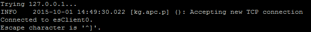
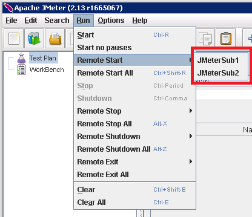
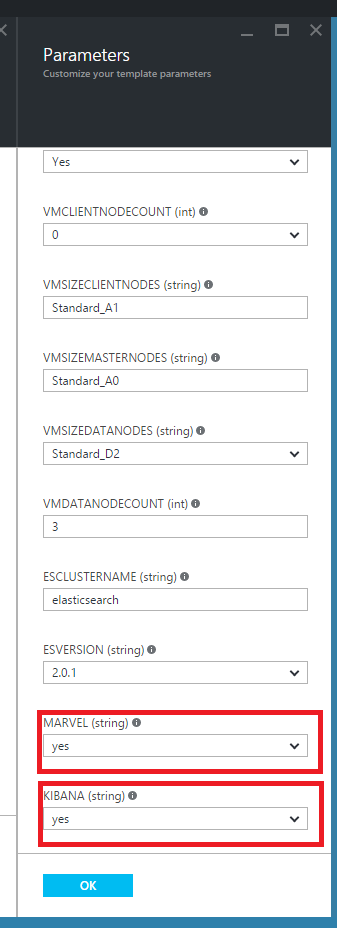
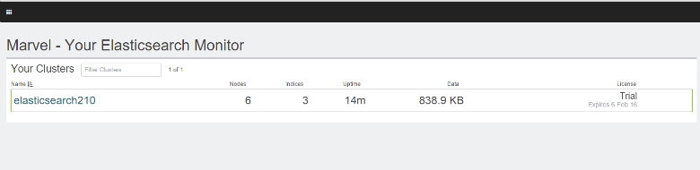
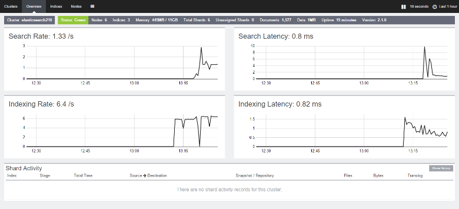

<properties
   pageTitle="Erstellen einer Performance-Tests Umgebung für Elasticsearch | Microsoft Azure"
   description="Informationen zum Einrichten einer Umgebung für die Leistung von einem Cluster Elasticsearch testen."
   services=""
   documentationCenter="na"
   authors="dragon119"
   manager="bennage"
   editor=""
   tags=""/>

<tags
   ms.service="guidance"
   ms.devlang="na"
   ms.topic="article"
   ms.tgt_pltfrm="na"
   ms.workload="na"
   ms.date="09/22/2016"
   ms.author="masashin"/>
   
# <a name="creating-a-performance-testing-environment-for-elasticsearch-on-azure"></a>Erstellen einer Umgebung für Elasticsearch auf Azure testen Leistung

[AZURE.INCLUDE [pnp-header](../../includes/guidance-pnp-header-include.md)]

Dieser Artikel ist [Teil einer Serie](guidance-elasticsearch.md). 

Dieses Dokument beschreibt das Einrichten einer Umgebung für die Leistung von einem Cluster Elasticsearch testen. Diese Konfiguration wurde verwendet, um die Leistung von Aufnahme und Abfrage Auslastung, zu testen, wie [Optimieren Daten Aufnahme][]Leistungsabfall für Elasticsearch auf Azure beschrieben.

Im Verlauf des Testens Leistung verwendet [Apache JMeter](http://jmeter.apache.org/), mit dem [Standardsatz](http://jmeter-plugins.org/wiki/StandardSet/) von-Plug-Ins in einer mit einem Satz von dedizierten virtuellen Computern (nicht Bestandteil der Elasticsearch Cluster), die speziell für den Zweck konfiguriert Master-/untergeordnete-Konfiguration installiert. 

Der [Server-Agent PerfMon](http://jmeter-plugins.org/wiki/PerfMonAgent/) wurde auf den einzelnen Knoten Elasticsearch installiert. Die folgenden Abschnitte enthalten Anweisungen für die testumgebung, neu zu erstellen, sodass Sie Ihre eigenen Performance-Tests mit JMeter durchführen können. Diese Anweisungen wird davon ausgegangen, dass Sie bereits einen Elasticsearch Cluster mit Knoten über ein Azure-virtuellen Netzwerk verbunden erstellt haben. 

Beachten Sie, dass die testumgebung, die auch als eine Reihe von Azure-virtuellen Computern mithilfe einer einzelnen Azure Ressourcengruppe verwaltet ausgeführt wird.

[Marvel](https://www.elastic.co/products/marvel) wurde auch installiert und so konfiguriert ist, aktivieren die interne Aspekte der Elasticsearch Cluster zu überwachen und einfacher analysiert. Wenn die JMeter Statistiken einer Höchstwert oder Wellental Leistungsabfall angezeigt wurden, kann Informationen verfügbar bis Marvel besonderem die Ursache des Fluktuationen ermitteln sein.

Die folgende Abbildung zeigt die Struktur des gesamten Systems. 


Beachten Sie die folgenden Punkte:

- Das JMeter Master-Shape virtueller Computer ausgeführt wird, Windows Server, um die Benutzeroberfläche Umgebung für die Konsole JMeter bereitzustellen. Die VM JMeter Master-Shape stellt die Benutzeroberfläche (die *Jmeter* Anwendung) Tester Tests erstellen, Tests ausführen und die Ergebnisse visualisieren aktivieren. Diesem virtuellen Computer koordiniert mit dem Server JMeter virtuellen Computern, die die Anfragen tatsächlich zu senden, die die Tests bilden.

- Führen Sie die untergeordneten virtuellen Computern JMeter Ubuntu Server (Linux), ist keine Benutzeroberfläche erforderlich für diese virtuelle Computer. Der Server JMeter virtuellen Computern ausführen die JMeter Server-Software (die *Jmeter-Server-* Anwendung) für Anfragen an den Elasticsearch Cluster.

- Dedizierte Client-Knoten wurden nicht verwendet, obwohl dedizierte master-Knoten wurden.

- Die Anzahl der Datenknoten im Cluster kann je nach den zu testenden abweichen.

- Führen Sie alle Knoten im Cluster Elasticsearch Marvel Leistung zur Laufzeit beobachten und der JMeter Server-Agent zum Sammeln von Daten für eine spätere Analyse.

- Beim Elasticsearch 2.0.0 testen und später eine der Datenknoten auch Kibana führt. Dies ist erforderlich, von der Version von Marvel, die für Elasticsearch 2.0.0 ausgeführt wird und höher.

## <a name="creating-an-azure-resource-group-for-the-virtual-machines"></a>Erstellen einer Azure Ressourcengruppe für den virtuellen Computern

Das JMeter Master-Shape muss direkt zu den einzelnen Knoten in der Elasticsearch Cluster zum Sammeln von Performance-Daten herstellen können. Ist die JMeter VNet aus dem Elasticsearch Cluster VNet distinct, umfasst dann dies Konfigurieren der einzelnen Knoten Elasticsearch mit einer öffentlichen IP-Adresse. Dies ist ein Problem mit der Elasticsearch-Konfiguration, und die JMeter virtuellen Computern in der gleichen VNet als Elasticsearch Cluster mithilfe derselben Ressourcengruppe Implementierung in Betracht ziehen, können Sie in diesem Fall diese erste Prozedur auslassen.

Zuerst [eine Ressourcengruppe erstellen](../resource-group-template-deploy-portal.md). Dieses Dokument wird davon ausgegangen, dass Ihre Ressourcengruppe *JMeterPerformanceTest*heißt. Wenn Sie die JMeter virtuellen Computern in der gleichen VNet als Elasticsearch Cluster ausführen möchten, verwenden Sie derselben Ressourcengruppe als diesem Cluster statt einen neuen zu erstellen.

## <a name="creating-the-jmeter-master-virtual-machine"></a>Erstellen der JMeter master virtuellen Computern

Nächste [Erstellen eines Windows virtuellen Computers](../virtual-machines/virtual-machines-windows-hero-tutorial.md) mithilfe des *Windows Server 2008 R2 SP1* Bildes.  Es empfiehlt sich, eine Größe virtueller Computer mit ausreichend Adern und Arbeitsspeicher zum Ausführen der Leistungstests auswählen. Dadurch werden idealerweise einen Computer mit mindestens 2 Kerne und 3,5 GB RAM (A2 Standard oder vergrößern).

<!-- TODO add info on why disabling diagnostics is positive --> 

Es empfiehlt sich, dass Sie die Diagnose deaktivieren. Wenn Sie den virtuellen Computer im Portal erstellen, geschieht dies auf *Einstellungen* vorher in Abschnitt *Überwachung* unter *Diagnose*. Lassen Sie die anderen Einstellungen die Standardwerte aus.

Stellen Sie sicher, dass die virtuellen Computer und alle zugeordneten Ressourcen durch [Untersuchen der Ressourcengruppe](../azure-portal/resource-group-portal.md#manage-resource-groups) im Portal erfolgreich erstellt wurden. Die aufgelisteten Ressourcen sollte eines virtuellen Computers, eine Netzwerksicherheitsgruppe und eine öffentliche IP-Adresse aller mit demselben Namen und Netzwerkkonto Benutzeroberfläche und Speicher mit Namen basierend auf, die von den virtuellen Computer bestehen.

## <a name="creating-the-jmeter-subordinate-virtual-machines"></a>Erstellen der JMeter untergeordneten virtuellen Computern

[Erstellen eines Linux virtuellen Computers](../virtual-machines/virtual-machines-linux-quick-create-portal.md) nun mit dem Bild *Ubuntu Server 14.04 LTS* .  Wählen Sie als mit dem JMeter master virtuellen Computer mit ausreichend Adern und Arbeitsspeicher zum Ausführen der Leistungstests die Größe eines virtuellen Computer ein. Dadurch werden idealerweise einen Computer mit mindestens 2 Kernen und mindestens 3,5 GB RAM (Standard A2 oder vergrößern).

In diesem Fall wird empfohlen, dass Sie die Diagnose deaktivieren.

Sie können beliebig viele untergeordnete virtuellen Computern wie gewünscht erstellen. 

## <a name="installing-jmeter-server-on-the-jmeter-subordinate-vms"></a>Installieren von JMeter Server auf der untergeordneten virtuellen Computern JMeter

Standardmäßig keine Verbindung zu, indem Sie eine Remotedesktop-Verbindung (RDP) zu öffnen, und die untergeordneten virtuellen Computern JMeter Linux ausgeführt werden. Stattdessen können Sie auf jedes virtuellen Computers [kitten zum Öffnen eines Fensters Befehlszeile verwenden](../virtual-machines/virtual-machines-linux-mac-create-ssh-keys.md) .

Nachdem Sie auf einen der untergeordneten virtueller Computer verbunden haben, werden wir Bash verwenden, um setup JMeter.

Installieren Sie zuerst die Java Runtime-Umgebung, die zum Ausführen von JMeter erforderlich.

```bash
sudo add-apt-repository ppa:webupd8team/java
sudo apt-get update
sudo apt-get install oracle-java8-installer
```

Herunterladen Sie die JMeter-Software, die als Zip-Datei verpackt jetzt.

```bash
wget http://apache.mirror.anlx.net/jmeter/binaries/apache-jmeter-2.13.zip
```

Installieren Sie den Befehl extrahieren, und klicken Sie dann verwenden Sie, um die Software JMeter zu erweitern. Die Software wird in einem Ordner namens **Apache-Jmeter-2,13**kopiert.

```bash
sudo apt-get install unzip
unzip apache-jmeter-2.13.zip
```

Wechseln Sie zum Verzeichnis *Papierkorb* die Programmdateien JMeter gedrückt, und stellen Sie die *Jmeter-Server* und *Jmeter* Programme ausführbare.

```bash
cd apache-jmeter-2.13/bin
chmod u+x jmeter-server
chmod u+x jmeter
```

Nun müssen wir zum Bearbeiten der Datei `jmeter.properties` befindet sich im aktuellen Ordner (verwenden Sie den Text-Editor, die Sie am häufigsten mit, wie z. B. *vi* oder *Vim*vertraut sind). Suchen Sie die folgenden Zeilen ein:

```yaml
...
client.rmi.localport=0
...
server.rmi.localport=4000
...
```

Entfernen Sie die Kommentarzeichen (Entfernen des Zeilenabstands \##-Zeichen) und ändern Sie diese Zeilen aus, wie unten dargestellt, und klicken Sie dann die Datei speichern und schließen Sie den Editor:

```yaml
...
client.rmi.localport=4441
...
server.rmi.localport=4440
```

Jetzt, führen Sie folgende Befehle zum Port 4441 für Datenverkehr TCP öffnen (Dies ist der Port *Jmeter-Server* , überprüfen, den Sie soeben konfiguriert haben):

```bash
sudo iptables -A INPUT -m state --state NEW -m tcp -p tcp --dport 4441 -j ACCEPT
```

Laden Sie die Zip-Datei, die mit der standard-Auflistung des-Plug-Ins für JMeter (diese-Plug-Ins bieten Leistung Überwachung Indikatoren), und Entzippen Sie die Datei in den Ordner **Apache-Jmeter-2,13** . Entzippen die Datei an diesem Speicherort werden die-Plug-Ins in den richtigen Ordner platziert.

Wenn Sie aufgefordert werden, die die Lizenz-Datei zu ersetzen, geben Sie A (für alle):

```bash
wget http://jmeter-plugins.org/downloads/file/JMeterPlugins-Standard-1.3.0.zip
unzip JMeterPlugins-Standard-1.3.0.zip
```

Verwenden Sie `nohup` auf den Server JMeter im Hintergrund zu starten. Es sollte reagieren, indem Sie die Anzeige einer Prozess-ID und einer Nachricht, die angibt, dass es ein remote-Objekt erstellt hat und Befehle empfangen beginnen.  Führen Sie den folgenden Befehl im Verzeichnis ~/apache-jmeter-2.13/bin. 

```bash
nohup jmeter-server &
```

> [AZURE.NOTE]Ist der virtuellen Computer war(en) wird das Programm JMeter-Server beendet. Sie müssen eine Verbindung mit den virtuellen Computer, und starten Sie ihn erneut manuell erneut. Alternativ können Sie das System, um den Befehl *Jmeter-Server* beim Start automatisch ausgeführt durch Hinzufügen die folgenden Befehle zum Konfigurieren der `/etc/rc.local` Datei (vor dem Befehl *Beenden 0* ):

```bash
sudo -u <username> bash << eoc
cd /home/<username>/apache-jmeter-2.13/bin
nohup ./jmeter-server &
eoc
```

Ersetzen Sie `<username>` mit Ihren Anmeldenamen ein.

Es ist sinnvoll, um das terminal-Fenster geöffnet zu halten, damit Sie den Fortschritt des Servers JMeter überwachen können, während der Test ausgeführt wird.

Sie müssen diese Schritte für jede JMeter virtuellen untergeordneten Computer wiederholen.

## <a name="installing-the-jmeter-server-agent-on-the-elasticsearch-nodes"></a>Installieren der JMeter Server-Agent auf den Knoten Elasticsearch

Dieses Verfahren wird davon ausgegangen, dass Sie Anmeldung Zugriff auf die Elasticsearch Knoten haben. Wenn Sie den Cluster mithilfe der Ressourcenmanager Vorlage erstellt haben, können Sie mit jeder Knoten über virtueller Computer, im Feld Gehe zu verbinden, wie im Abschnitt Elasticsearch Suchtopologie [Elasticsearch ausgeführt wird, klicken Sie auf Azure](guidance-elasticsearch-running-on-azure.md)dargestellt. Sie können auch mithilfe von kitten in Sprung verbinden. 

Hier können Sie den Befehl *ssh* einzelnen Knoten im Cluster Elasticsearch bei der Anmeldung beim verwenden.

Melden Sie sich einem der Elasticsearch Knoten als Administrator an.  Geben Sie an der Befehlszeile Bash die folgenden Befehle zum Erstellen von Ordnern für den Server-Agent JMeter gedrückt, und in diesen Ordner verschieben:

```bash
mkdir server-agent
cd server-agent
```

Führen Sie die folgenden Befehle den Befehl *Entzippen Sie ihn* installieren (sofern es noch nicht installiert ist), herunterladen Sie die JMeter Server-Agent-Software und Entzippen Sie ihn:

```bash
sudo apt-get install unzip
wget http://jmeter-plugins.org/downloads/file/ServerAgent-2.2.1.zip
unzip ServerAgent-2.2.1.zip
```
 
Führen Sie den folgenden Befehl zum Konfigurieren der Firewalls und aktivieren TCP Datenverkehr passieren Port 4444 (Dies ist der vom Server-Agent JMeter verwendete Port):

```bash
sudo iptables -A INPUT -m state --state NEW -m tcp -p tcp --dport 4444 -j ACCEPT
```

Führen Sie zum Starten der JMeter Server-Agent im Hintergrund den folgenden Befehl ein:

```bash
nohup ./startAgent.sh &
```

Der Server-Agent JMeter sollte mit den Nachrichten, die angibt, dass es gestartet wurde und Port 4444 hört Antworten.  Drücken Sie die EINGABETASTE, um ein Eingabeaufforderungsfenster zu erhalten, und führen Sie den folgenden Befehl aus.

```bash
telnet <nodename> 4444
```

Ersetzen Sie `<nodename>` durch den Namen Ihres-Knotens. (Suchen Sie den Namen Ihres Knotens durch Ausführen der `hostname` Befehl.) Dieser Befehl wird eine Telnet-Verbindung zum Port 4444 auf Ihrem lokalen Computer geöffnet. Diese Verbindung können Sie überprüfen, ob der Server-Agent JMeter korrekt ausgeführt wird.

Wenn der Server-Agent JMeter nicht ausgeführt wird, erhalten Sie die Antwort 

`*telnet: Unable to connect to remote host: Connection refused*.`

Wenn der Server-Agent JMeter ausgeführt wird und Port 4444 ordnungsgemäß konfiguriert wurden, sollten Sie die folgende Antwort sehen:



> [AZURE.NOTE] Die Sitzung bietet keine irgendeiner auffordern, nachdem die Verbindung hergestellt hat.

Die Sitzung geben Sie den folgenden Befehl aus:

``` 
test
```

Wenn der Server-Agent JMeter konfiguriert ist und ordnungsgemäß überwacht, sollten sie darauf hinzuweisen, dass er den Befehl empfangen und mit der Meldung *Yep*beantworten.

> [AZURE.NOTE]Sie können in anderen Befehlen abzurufenden Daten zum Überwachen der Leistung eingeben. Beispielsweise den Befehl `metric-single:cpu:idle` bieten Ihnen den aktuellen Anteil der Zeit, die CPU im Leerlauf (Dies ist eine Momentaufnahme) ist. Eine vollständige Liste der Befehle finden Sie auf der Seite [PerfMon Server-Agent](http://jmeter-plugins.org/wiki/PerfMonAgent/) . : Wieder zum Aufrufen von es er Perfmon Server Agent. >>

Geben Sie in die Sitzung beenden Sie die Sitzung und zurück zu den Bash Eingabeaufforderungsfenster den folgenden Befehl aus:

``` 
exit
```

> [AZURE.NOTE]Wie Sie mit der JMeter untergeordnete virtuellen Computern, falls Sie sich abmelden oder wenn diesem Computer geschlossen wird und neu gestartet dann der JMeter Server-Agent mithilfe von manuell neu gestartet werden müssen die `startAgent.sh` Befehl. Wenn Sie die JMeter Server-Agent zum automatischen starten möchten, fügen Sie den folgenden Befehl an das Ende der `/etc/rc.local` Datei, bevor Sie den Befehl *Beenden 0* . 
> Ersetzen Sie `<username>` mit Ihren Anmeldenamen ein:

```bash
sudo -u <username> bash << eoc
cd /home/<username>/server-agent
nohup ./startAgent.sh &
eoc
```

Sie können jetzt entweder wiederholen Sie diesen gesamten Vorgang für alle anderen Knoten im Cluster Elasticsearch, oder Sie können die `scp` Befehl zum Kopieren der Server-Agent-Ordner und Inhalt an jede andere Knoten und die Verwendung der `ssh` Befehl Starten der JMeter Server-Agent, wie unten dargestellt. e ersetzen `<username>` mit Ihren Benutzernamen ein, und `<nodename>` mit dem Namen des Knotens, in dem Sie kopieren, und führen die Software (Sie möglicherweise aufgefordert, Ihr Kennwort einzugeben, wie Sie jedem Befehl ausführen) möchten:

```bash
scp -r \~/server-agent <username>@<nodename>:\~
ssh <nodename> sudo iptables -A INPUT -m state --state NEW -m tcp -p tcp --dport 4444 -j ACCEPT
ssh <nodename> -n -f 'nohup \~/server-agent/startAgent.sh'
```

## <a name="installing-and-configuring-jmeter-on-the-jmeter-master-vm"></a>Installieren und Konfigurieren von JMeter des master-virtuellen Computers JMeter

Klicken Sie im Azure-Portal auf **Ressourcengruppen**. Klicken Sie in das Blade **Ressourcengruppen** auf der Ressourcengruppe mit den JMeter und untergeordneten virtuellen Computern.  Klicken Sie in das Blade **Ressourcengruppe** auf die **JMeter master virtueller Computer**. Klicken Sie in das Blade virtuellen Computers, auf der Symbolleiste auf **Verbinden**. Öffnen Sie die RDP-Datei nach Aufforderung durch den Webbrowser. Windows erstellt eine Remotedesktop-Verbindung zu Ihrem virtuellen Computer an.  Geben Sie den Benutzernamen und das Kennwort für den virtuellen Computer, wenn Sie dazu aufgefordert werden.

Auf dem virtuellen Computer, mit dem Internet Explorer wechseln Sie zu der Seite [Java für Windows herunterladen](http://www.java.com/en/download/ie_manual.jsp) . Folgen Sie den Anweisungen zum Herunterladen, und führen Sie das Installationsprogramm Java an.

In den Webbrowser wechseln Sie zur Seite [Apache JMeter herunterladen](http://jmeter.apache.org/download_jmeter.cgi) und Herunterladen der Zip die letzte Binärdatei enthalten. Speichern Sie die Zip an einem geeigneten Ort auf Ihrem virtuellen Computer an.

Wechseln Sie zu der Website [Benutzerdefinierte JMeter-Plug-Ins](http://jmeter-plugins.org/) , und Laden Sie das standardmäßige Set-Plug-Ins. Speichern Sie die Zip in denselben Ordner wie die JMeter Download aus dem vorherigen Schritt.

Wechseln Sie in Windows-Explorer zu dem Ordner mit der Apache-Jmeter -*Funktionen Länge und LÄNGEB* Zip-Datei, wobei *Funktionen Länge und LÄNGEB* die aktuelle Version von JMeter ist. Extrahieren Sie die Dateien in den aktuellen Ordner an.

Extrahieren Sie die Dateien in der JMeterPlugins-Standard -*Yyy*ZIP-Datei, wobei *Yyy* der aktuellen Version der-Plug-Ins in den Apache steht-Jmeter -*Funktionen Länge und LÄNGEB* Ordner. Dadurch wird die-Plug-Ins in den richtigen Ordner für JMeter hinzugefügt. Sie können die Bibliothek Ordner zusammenführen und die Lizenz und Infos zu Dateien überschreiben, wenn Sie dazu aufgefordert werden.

Wechseln Sie zu der Apache-Jmeter -*Funktionen Länge und*LÄNGEB/bin Ordner und Bearbeiten der jmeter.properties-Datei mit dem Editor.  In der `jmeter.properties` Datei, suchen Sie den Abschnitt mit der Bezeichnung *Remote Hosts und RMI Konfiguration*.  Suchen Sie in diesem Abschnitt der Datei die folgende Zeile ein:

```yaml
remote_hosts=127.0.0.1
```

Ändern Sie diese Zeile und Ersetzen Sie die IP-Adresse 127.0.0.1 mit einer durch Trennzeichen getrennte Liste von IP-Adressen oder Hostnamen für jede der untergeordneten JMeter Server. Beispiel:

```yaml
remote_hosts=JMeterSub1,JMeterSub2
```

Suchen Sie die folgende Zeile aus, und klicken Sie dann Entfernen der `#` Zeichen am Anfang dieser Zeile, und ändern Sie den Wert der Einstellungen für die client.rmi.localport aus:

```yaml
#client.rmi.localport=0
```

An:

```yaml
client.rmi.localport=4440
```

Speichern Sie die Datei, und schließen Sie Editor. 

Klicken Sie in der Windows-Symbolleiste auf **Start**, klicken Sie auf **Verwaltung**, und klicken Sie dann auf **Windows-Firewall mit erweiterter Sicherheit**.  Klicken Sie im Windows-Firewall mit erweiterter Sicherheit-Fenster im linken Bereich mit der rechten Maustaste **Eingehende Regeln**, und klicken Sie dann auf **Neue Regel**.

Klicken Sie in die **Neue eingehende Regel-Assistenten**auf der Seite **Regeltyp** wählen Sie **Anschluss**, und klicken Sie dann auf **Weiter**.  Wählen Sie auf der Seite Protokolle und Ports **TCP**, wählen Sie in der Typ des Textfelds **bestimmte lokale Ports**, `4440-4444`, und klicken Sie dann auf **Weiter**.  Klicken Sie auf der Seite Aktion wählen Sie **Zulassen die Verbindung**aus, und klicken Sie dann auf **Weiter**. Klicken Sie auf der Profilseite lassen Sie alle Optionen aktiviert, und klicken Sie dann auf **Weiter**.  Klicken Sie auf der Seite Name den **Namen** Textfeld geben *JMeter*, und klicken Sie dann auf **Fertig stellen**.  Schließen Sie die Windows-Firewall mit erweiterter Sicherheit Fenster an.

In Windows-Explorer, in der Apache-Jmeter -**Xx/bin-Ordner, doppelklicken Sie auf der Windows-Batchdatei *Jmeter* um die Benutzeroberfläche zu starten. Die Benutzeroberfläche sollte angezeigt werden:


Klicken Sie in der Menüleiste auf **Ausführen**, klicken Sie auf **Remote Start**, und stellen Sie sicher, dass die zwei JMeter untergeordneten Computer aufgelistet werden:



Sie können nun zum Testen der Leistung zu beginnen.

## <a name="installing-and-configuring-marvel"></a>Installieren und Konfigurieren von Marvel

Die Vorlage Elasticsearch Schnellstart für Azure installieren und konfigurieren Sie die entsprechende Version von Marvel automatisch, wenn Sie festlegen, dass die Parameter MARVEL und KIBANA ("Ja") true, wenn das Cluster erstellen:



Wenn Sie einem vorhandenen Cluster Sie die Installation manuell ausführen müssen Marvel hinzugefügt werden und der Prozess unterscheidet sich je nachdem, ob Sie Elasticsearch Version arbeiten 1.7.x haben oder 2.x, wie im folgenden Verfahren beschrieben.

### <a name="installing-marvel-with-elasticsearch-173-or-earlier"></a>Installieren von Marvel mit Elasticsearch 1,73 oder einer früheren Version

Wenn Sie mit dem Elasticsearch 1.7.3 oder einer früheren Version, führen Sie folgende Schritte *auf jedem Knoten* im Cluster:

- Melden Sie sich bei dem Knoten und im Stammverzeichnis Elasticsearch verschieben.  Unter Linux ist typische Start Verzeichnis `/usr/share/elasticsearch`.

-  Führen Sie zum Herunterladen und installieren das Plug-in Marvel für Elasticsearch den folgenden Befehl ein:

```bash
sudo bin/plugin -i elasticsearch/marvel/latest
```

- Beenden Sie und neu starten Sie Elasticsearch auf dem Knoten:

```bash
sudo service elasticsearch restart
```

- Um zu überprüfen, dass Marvel ordnungsgemäß installiert wurde, öffnen Sie einen Webbrowser, und rufen Sie die URL `http://<server>:9200/_plugin/marvel`. Ersetzen Sie `<server>` mit dem Namen oder die IP-Adresse eines beliebigen Elasticsearch Servers im Cluster.  Stellen Sie sicher, dass eine ähnliche unten dargestellten Seite angezeigt wird:


### <a name="installing-marvel-with-elasticsearch-200-or-later"></a>Installieren von Marvel mit Elasticsearch 2.0.0 oder höher

Wenn Sie später, führen Sie folgende Aufgaben *auf den einzelnen Knoten* im Cluster oder Elasticsearch 2.0.0 verwenden:

Melden Sie sich bei dem Knoten, und wechseln Sie im Stammverzeichnis Elasticsearch (in der Regel `/usr/share/elasticsearch`) führen Sie die folgenden Befehle zum Herunterladen und installieren das Plug-in Marvel für Elasticsearch:

```bash
sudo bin/plugin install license
sudo bin/plugin install marvel-agent
```

Beenden Sie und neu starten Sie Elasticsearch auf dem Knoten:

```bash
sudo service elasticsearch restart
```

Ersetzen Sie das folgende Verfahren, `<kibana-version>` mit 4.2.2, wenn Sie Elasticsearch 2.0.0 oder Elasticsearch 2.0.1 verwenden oder mit 4.3.1 bei Verwendung von Elasticsearch 2.1.0 oder höher.  Ersetzen Sie `<marvel-version>` mit 2.0.0, wenn Sie Elasticsearch 2.0.0 oder Elasticsearch 2.0.1 verwenden oder mit 2.1.0 bei Verwendung von Elasticsearch 2.1.0 oder höher.  Führen Sie folgende Aufgaben *auf einem Knoten* im Cluster aus:

Melden Sie sich bei dem Knoten und Laden Sie den entsprechenden Build von Kibana für Ihre Version von Elasticsearch aus der [Elasticsearch-Website herunterladen](https://www.elastic.co/downloads/past-releases), und dann extrahieren Sie das Paket:

```bash
wget https://download.elastic.co/kibana/kibana/kibana-<kibana-version>-linux-x64.tar.gz
tar xvzf kibana-<kibana-version>-linux-x64.tar.gz
```

Öffnen Sie Anschluss 5601 eingehende Anfragen annehmen:

```bash
sudo iptables -A INPUT -m state --state NEW -m tcp -p tcp --dport 5601 -j ACCEPT
```

Wechseln Sie zum Ordner Config Kibana (`kibana-<kibana-version>-linux-x64/config`), Bearbeiten der `kibana.yml` Datei, und fügen Sie die folgende Zeile hinzu. Ersetzen Sie `<server>` mit dem Namen oder die IP-Adresse eines Servers Elasticsearch im Cluster:

```yaml
elasticsearch.url: "http://<server>:9200"
```

Wechseln Sie zum Ordner Bin Kibana (`kibana-<kibana-version>-linux-x64/bin`), und führen Sie den folgenden Befehl aus, das Marvel-Plug-in Kibana integrieren:

```bash
sudo ./kibana plugin --install elasticsearch/marvel/<marvel-version>
```

Starten Sie Kibana an:

```bash
sudo nohup ./kibana &
```

Um die Installation Marvel zu überprüfen, öffnen Sie einen Webbrowser, und rufen Sie die URL `http://<server>:5601/app/marvel`. Ersetzen Sie `<server>` mit dem Namen oder die IP-Adresse des Servers mit Kibana.

Stellen Sie sicher, dass eine ähnliche unten dargestellten Seite angezeigt wird (der Namen des Ihren Cluster variiert wahrscheinlich aus, die in der Abbildung dargestellt).



Klicken Sie auf den Link, die Ihren Cluster entspricht (elasticsearch210 in die vorstehende Abbildung). Eine Seite ähnlich dem unten dargestellten sollte angezeigt werden:




[Optimieren von Daten Aufnahme Leistung für Elasticsearch auf Azure]: guidance-elasticsearch-tuning-data-ingestion-performance.md  