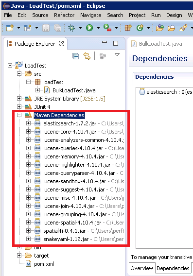
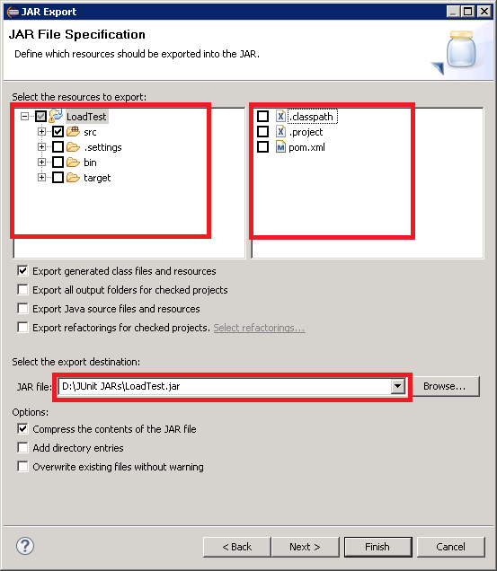
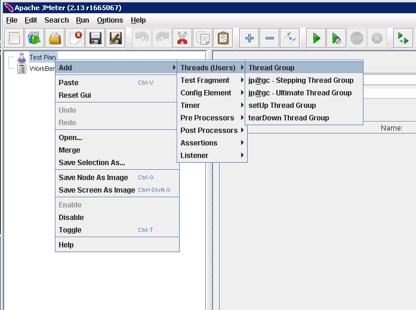

<properties
   pageTitle="Bereitstellen einer JMeter JUnit Demo zum Testen der Leistung Elasticsearch | Microsoft Azure"
   description="So verwenden Sie eine JUnit Demo zum Generieren und Hochladen von Daten in einem Cluster Elasticsearch."
   services=""
   documentationCenter="na"
   authors="dragon119"
   manager="bennage"
   editor=""
   tags=""/>

<tags
   ms.service="guidance"
   ms.devlang="na"
   ms.topic="article"
   ms.tgt_pltfrm="na"
   ms.workload="na"
   ms.date="09/22/2016"
   ms.author="masashin"/>
   
# Bereitstellen einer JMeter JUnit Demo zum Testen der Leistung Elasticsearch

[AZURE.INCLUDE [pnp-header](../../includes/guidance-pnp-header-include.md)]

Dieser Artikel ist [Teil einer Serie](guidance-elasticsearch.md). 

Dieses Dokument beschreibt das Erstellen und Verwenden einer JUnit Demo, die generieren und Daten zu einem Cluster Elasticsearch als Teil eines JMeter Testplan hochladen kann. Dieser Ansatz bietet einen hochgradig flexiblen Ansatz zum Testen laden, der große Datenmengen Test ohne abhängig von externen Datendateien generieren können.

> [AZURE.NOTE] Die Auslastungstests verwendet, um die Leistung von Daten Aufnahme [Optimieren Daten Aufnahme](guidance-elasticsearch-tuning-data-ingestion-performance.md) Leistungsabfall für Elasticsearch beschriebenen bewerten erstellt wurden, mit diesem Ansatz. In diesem Dokument werden die Details des Codes JUnit beschrieben.

Testen Daten Aufnahme und Leistung zu steigern der JUnit Code wurde Entwicklung mithilfe von "Ellipse" (Mars), Abhängigkeiten wurden gelöst Maven verwenden. Nachfolgend wird den Schritt-für-Schritt-Prozess für "Ellipse" installieren, konfigurieren Maven, einen JUnit Test erstellen und Bereitstellen von dieser Test als eine Anforderung JUnit Demo in einem JMeter Test beschrieben.

> [AZURE.NOTE] Ausführliche Informationen zu Struktur und Konfiguration der testumgebung finden Sie unter [Erstellen einer Leistung testen Umgebung für Elasticsearch auf Azure][].

## Installieren der erforderlichen Komponenten

Sie benötigen die [Java Runtime-Umgebung](http://www.java.com/en/download/ie_manual.jsp) auf Ihrem Entwicklungscomputer.
Sie benötigen außerdem die [Ellipse IDE für Java-Entwickler](https://www.eclipse.org/downloads/index.php?show_instructions=TRUE)zu installieren.

> [AZURE.NOTE] Wenn Sie den JMeter virtuellen master Computer, die als Ihre Entwicklungsumgebung [Erstellen einer Leistung testen Umgebung für Elasticsearch auf Azure][] beschrieben verwenden, laden Sie die Windows-32-Bit-Version des Installationsprogramms "Ellipse".

## Erstellen ein Projekt JUnit für Laden Elasticsearch testen

Starten Sie die Ellipse IDE, wenn er noch nicht ausgeführt wird, und schließen Sie dann auf der Seite **Willkommen** .  Klicken Sie auf im Menü **Datei** , und klicken Sie dann auf **Java-Projekt**.

Im Fenster **Projekt Java** Geben Sie den Namen eines Projekts, wählen Sie **Standard verwenden JRE**aus und klicken Sie dann auf **Fertig stellen**.

Erweitern Sie im **Paket-Explorer** -Fenster den Knoten mit dem Namen nach Projekt aus. Stellen Sie sicher, dass sie einen Ordner mit dem Namen **Src** und ein Verweis auf die angegebene JRE enthält.

Mit der rechten Maustaste in des Ordners **Src** , klicken Sie auf **neu**, und klicken Sie dann auf **JUnit Test Case**.

Klicken Sie im Fenster **neue JUnit Test Case** select **neue Junit 4-Test**ausgeführt wird, geben Sie einen Namen für das Paket (Dies kann sein identisch mit den Namen des Projekts, obwohl üblicherweise mit einem Kleinbuchstaben Buchstaben beginnen soll), einen Namen für die Test-Klasse, und wählen Sie die Optionen, die die Methodenstubs erforderlich für den Test generieren. Lassen Sie das Feld **Klasse testenden** leer, und klicken Sie dann auf **Fertig stellen**.

Wenn das folgende **neuen JUnit Test Case** -Dialogfeld angezeigt wird, wählen Sie die Option aus, um den Erstellungspfad JUnit 4 Bibliothek hinzu, und klicken Sie dann auf **OK**. 

Stellen Sie sicher, dass der Gerüst Code für den Test JUnit generiert und im Java-Editor-Fenster angezeigt wird.

Im **Paket-Explorer**mit der rechten Maustaste in des Knotens für Ihr Projekt, klicken Sie auf **Konfigurieren**, und klicken Sie dann auf **Konvertieren zu Maven Projekt**.

> [AZURE.NOTE]Maven ermöglicht Ihnen weitere einfach externe Abhängigkeiten (wie etwa die Elasticsearch Java-Client-Bibliotheken) verwalten, hängt ein Projekts.

Klicken Sie im Dialogfeld **neue POM erstellen** in der Dropdown-Liste **Verpackung** **Jar**wählen Sie aus, und klicken Sie dann auf **Fertig stellen**.

Klicken Sie im Bereich, die unterhalb des Projekts Modell (POM)-Editors angezeigt wird, werden möglicherweise die Warnung angezeigt "Build Pfad Gibt Ausführung Umgebung J2SE-1,5. Es gibt keine JREs im Arbeitsbereich installiert, die mit dieser Umgebung grundsätzlich kompatibel sind", die auf Ihrem Entwicklungscomputer abhängig davon, welche Version von Java installiert ist. Wenn Sie eine Version von Java, die liegt nach Version 1.5 können Sie diese Warnung bedenkenlos ignorieren besitzen.

Im POM-Editor erweitern Sie die **Eigenschaften** , und klicken Sie dann auf **Erstellen**.

Klicken Sie im Dialogfeld **Eigenschaft hinzufügen** klicken Sie im Feld **Name** Geben Sie *es.version*, geben Sie im Feld **Wert** *1.7.2*, und klicken Sie dann auf **OK**. Dies ist die Version der Bibliothek Elasticsearch Java-Client verwenden (diese Version möglicherweise in der Zukunft ersetzt werden, und die Version als POM Eigenschaft definieren und verweisen auf diese Eigenschaft an anderer Stelle innerhalb des Projekts ermöglicht die Version schnell geändert werden soll).

Klicken Sie auf der Registerkarte **Abhängigkeiten** an der Basis des Editors POM, und klicken Sie neben der Liste der **Abhängigkeiten** klicken Sie dann auf **Hinzufügen** .

Geben Sie im Dialogfeld **Abhängigkeit wählen Sie** im Feld **Gruppe Id** *org.elasticsearch*, geben Sie im Feld **Element-Id** *Elasticsearch*in das Feld Geben Sie **Version** * \${es.version}*, und klicken Sie dann auf **OK**. Informationen über die Elasticsearch Java-Client-Bibliothek wird im online Maven zentralen Repository gespeichert, und diese Konfiguration automatisch heruntergeladen wird der Bibliothek und deren Abhängigkeiten, wenn das Projekt erstellt wird.

Klicken Sie im Menü **Datei** auf **Alles speichern**. Diese Aktion wird speichern und erstellen Sie das Projekt, die Abhängigkeiten von Maven angegebenen herunterladen. Stellen Sie sicher, dass im Paket-Explorer der Ordner Maven Abhängigkeiten angezeigt wird. Erweitern Sie diesen Ordner zum Anzeigen der JAR-Dateien heruntergeladen haben, um die Elasticsearch Java-Client-Bibliothek zu unterstützen.

## Importieren von einem vorhandenen JUnit Testprojekt in "Ellipse"

Bei dieser Vorgehensweise wird vorausgesetzt, dass Sie ein Projekt Maven heruntergeladen haben, die zuvor erstellt wurde, mithilfe von "Ellipse".

Starten Sie die Ellipse IDE. Klicken Sie im Menü **Datei** auf **Importieren**.

Im Fenster **Wählen Sie aus** erweitern Sie den Ordner **Maven** , klicken Sie auf **Vorhandene Maven Projekte**, und klicken Sie dann auf **Weiter**.

Geben Sie im Fenster **Maven Projekte** der Ordner halten das Projekt (den Ordner mit der pom.xml-Datei), klicken Sie auf **Alles auswählen**, und klicken Sie dann auf **Fertig stellen**.

Erweitern Sie im **Paket-Explorer** -Fenster den Knoten entspricht dem Projekt aus. Stellen Sie sicher, dass das Projekt einen Ordner mit dem Namen **Src**enthält. Dieser Ordner enthält den Quellcode für die Teststatistik eines JUnit. Das Projekt kann kompiliert und nach den folgenden Anweisungen bereitgestellt werden.

## Bereitstellen eines JUnit Tests zu JMeter

Dieses Verfahren setzt voraus, Sie haben ein Projekt mit einer JUnit Test-Klasse namens LoadTest Namen erstellt `BulkLoadTest.java` , Konfigurationsparameter aus einer Zeichenfolge an einen Konstruktor (Dies ist das Verfahren, die JMeter erwartet) akzeptiert.

In der IDE "Ellipse" im **Paket-Explorer**mit der rechten Maustaste in des Projektknoten, und klicken Sie dann auf **Exportieren**.

Im **Export-Assistenten**auf der Seite **auswählen** erweitern Sie den Knoten **Java** , **JAR-Datei**klicken Sie auf, und klicken Sie dann auf **Weiter**.

Erweitern Sie auf der Seite **JAR-Dateispezifikation** im Feld **Wählen Sie die zu exportierende Ressourcen aus** das Projekt **Projekts**heben Sie die Auswahl, und deaktivieren Sie **pom.xml**. Geben Sie einen Dateinamen und einen Speicherort für die JAR-Datei (es sollte die Erweiterung .jar angegebenen) im Feld **JAR-Datei** , und klicken Sie dann auf **Fertig stellen**.

Mit dem Windows-Explorer, kopieren Sie die JAR-Datei, die Sie soeben erstellt haben, um die Gestaltungsvorlage JVM JMeter und speichern Sie sie in der Apache Jmeter 2.13\\Bibliothek\\Junit Ordner unterhalb des Ordners, in dem Sie JMeter installiert haben (Siehe das Verfahren "Master JMeter virtuellen Computers erstellen" beim Erstellen [einer Leistung testen Umgebung für Elasticsearch auf Azure](guidance-elasticsearch-creating-performance-testing-environment.md) für Weitere Informationen.)

Zurück zu "Ellipse", erweitern Sie im **Paket-Explorer** -Fenster, und notieren Sie die JAR-Dateien und deren Speicherorte im Ordner für das Projekt Maven Abhängigkeiten aufgeführt. Beachten Sie, dass die Dateien angezeigt, die in der folgenden Abbildung unterschiedlich sein können, je nachdem, welche Version von Elasticsearch arbeiten:

Jeder JAR-Datei im Ordner Maven Abhängigkeiten der Apache Jmeter 2.13 verwiesen wird mit dem Windows-Explorer kopieren\\Bibliothek\\Junit Ordner des master-virtuellen Computers JMeter.

Wenn die Bibliothek\\Junit Ordner bereits frühere Versionen dieser JAR-Dateien enthält, dann entfernen. Wenn Sie diese im Ort belassen klicken Sie dann die Teststatistik eines JUnit funktioniert möglicherweise nicht wie Verweise in der falschen Gläser aufgelöst werden konnte.

Halten Sie auf dem Master JMeter virtuellen Computer JMeter, wenn aktuell ausgeführt wird.  Starten Sie JMeter.  In JMeter mit der rechten Maustaste **Test Plan**, klicken Sie auf **Hinzufügen**, klicken Sie auf **Threads (Benutzer)**, und klicken Sie dann auf **Gruppe Thread**.

Unter dem Knoten **Test Plan** mit der rechten Maustaste **Thread Gruppe**, klicken Sie auf **Hinzufügen**, klicken Sie auf **Demo**und klicken Sie dann auf **JUnit anfordern**.

Wählen Sie auf der Seite **JUnit Anforderung** **Suche für JUnit4 Anmerkungen (statt JUnit 3)**. Wählen Sie in der Dropdown-Liste **Objektname** Ihrer JUnit laden Test-Klasse (werden diese im Formular *aufgeführt &lt;Paket&gt;.&lt; Klasse&gt;*), in der **Test-Methode** testen Dropdown-Liste auswählen die JUnit Methode (Dies ist die Methode, die dem Test zugeordnete Arbeit tatsächlich ausführt, und sollte mit markiert wurde die *@test* Anmerkungen im Projekt "Ellipse"), und geben Sie alle Werte, die an den Konstruktor im **Konstruktor Zeichenfolge Bezeichnung** übergeben werden. Die Details in der folgenden Abbildung dargestellt werden nur Beispiele; der **Objektname**, * *Methode zur Prüfung*und * *Konstruktor Zeichenfolge Bezeichnung** wird wahrscheinlich von der angezeigten unterscheiden.

Wenn Ihre Klasse in der Dropdownliste **Objektname** nicht angezeigt wird, bedeutet es wahrscheinlich, dass die JAR-nicht ordnungsgemäß exportiert wurde oder nicht in der Bibliothek platziert wurde\\Junit Ordner oder einige der abhängige Gläser fehlen aus der Bibliothek\\Junit Ordner. In diesem Fall exportieren Sie das Projekt aus "Ellipse" erneut, und stellen Sie sicher, dass Sie die Ressource **Src** ausgewählt haben, kopieren die JAR-Datei in der Bibliothek\\Junit Ordner, und stellen Sie sicher, dass Sie alle die abhängige Gläser aufgelistet, indem Sie Maven in den Ordner Bibliothek kopiert haben.

Schließen Sie JMeter. Es gibt keine müssen den Testplan speichern aus.  Kopieren Sie die JAR-Datei mit der JUnit Test-Klasse, um die /home/&lt;Benutzername&gt;/apache-jmeter-2.13/lib/junit Ordner auf jede der untergeordneten virtuellen Computern JMeter (*&lt;Benutzername&gt; * ist der Name des Benutzers administrative Sie angegeben, wenn Sie den virtuellen Computer erstellt haben, finden Sie in der Prozedur "Den JMeter untergeordneten virtuellen Computern erstellen" beim Erstellen [einer Leistung testen Umgebung für Elasticsearch auf Azure](guidance-elasticsearch-creating-performance-testing-environment.md) für Weitere Informationen.)

Kopieren Sie die abhängigen JAR-Dateien erforderlich, die durch die JUnit Test-Klasse, die /home/&lt;Benutzername&gt;/apache-jmeter-2.13/lib/junit Ordner auf jede der untergeordneten virtuellen Computern JMeter. Vergewissern Sie sich zuerst alle älteren Versionen von JAR-Dateien aus diesem Ordner entfernen.

Sie können die `pscp` Programm, mit Dateien von einem Windows-Computer auf Linux kopieren.

[Erstellen einer Umgebung für Elasticsearch auf Azure testen Leistung]: guidance-elasticsearch-creating-performance-testing-environment.md
