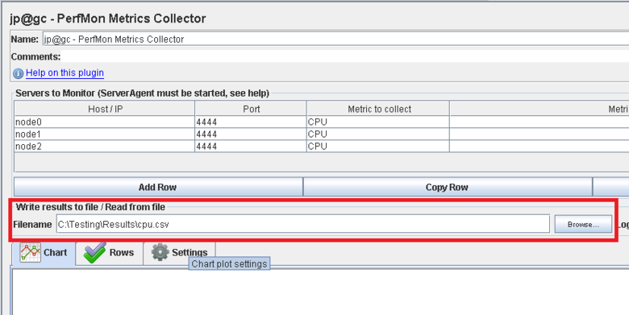
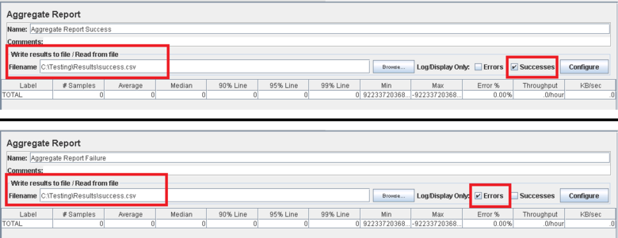

<properties
   pageTitle="Implementierung eines JMeter-Test-Plans für Elasticsearch | Microsoft Azure"
   description="Ausführen von Leistung überprüft für Elasticsearch mit JMeter."
   services=""
   documentationCenter="na"
   authors="dragon119"
   manager="bennage"
   editor=""
   tags=""/>

<tags
   ms.service="guidance"
   ms.devlang="na"
   ms.topic="article"
   ms.tgt_pltfrm="na"
   ms.workload="na"
   ms.date="09/22/2016"
   ms.author="masashin" />
   
# <a name="implementing-a-jmeter-test-plan-for-elasticsearch"></a>Implementierung eines JMeter-Test-Plans für Elasticsearch

[AZURE.INCLUDE [pnp-header](../../includes/guidance-pnp-header-include.md)]

Dieser Artikel ist [Teil einer Serie](guidance-elasticsearch.md). 

Leistung durchgeführten gegen Elasticsearch wurden mithilfe von JMeter Testpläne zusammen mit Java-Code als JUnit Test zur Durchführung von Aufgaben, z. B. Hochladen von Daten in den Cluster integriert implementiert. Die Testpläne und JUnit Code werden in [Optimieren Daten Aufnahme Leistung für Elasticsearch auf Azure][]und [Optimieren Datenaggregation und Leistung von Abfragen für Elasticsearch auf Azure][]beschrieben.

Der Zweck dieses Dokuments ist Zusammenfassung die wichtige Erfahrung gewonnen aus erstellen und Ausführen dieser Pläne testen. [Bewährte Methoden für die JMeter](http://jmeter.apache.org/usermanual/best-practices.html) auf die Seite der Apache JMeter Website enthält weitere GRG Hinweise zur Verwendung JMeter effektiv.

## <a name="implementing-a-jmeter-test-plan"></a>Implementierung eines JMeter Testplans

Die folgende Liste enthält eine Übersicht über die Elemente, die Sie beim Erstellen eines JMeter Testplans berücksichtigen sollten:

- Erstellen einer eigenen Threadgruppe für jeden Test, die Sie ausführen möchten. Einen Test kann mehrere Schritte, einschließlich Logik Controller, Zeitgeber, vor und nach der Prozessoren, Samplern und Listener enthalten.

- Vermeiden Sie zu viele Threads in einer Threadgruppe erstellen. Zu viele Threads bewirkt, dass JMeter mit "Nicht genügend Arbeitsspeicher" treten Ausnahmen. Es empfiehlt sich, weitere JMeter untergeordneten Servern hinzufügen jedes ausgeführt wenige Threads als versuchen, eine große Anzahl von Threads auf einem einzelnen JMeter Server ausgeführt werden.


- Um die Leistung von Cluster bewerten, Einbinden von der [Perfmon Kennzahlen Collection](http://jmeter-plugins.org/wiki/PerfMon/) -Plug-Ins in den Testplan. Hierbei handelt es sich um einen JMeter befinden, der als eine standard JMeter-Plug-Ins verfügbar ist. Die unformatierten Leistungsdaten in eine Reihe von Dateien in durch Trennzeichen getrennte Werte (CSV) Format gespeichert und nach Abschluss der Test zu verarbeiten. Dies ist effizienter und wendet eine geringere Belastung JMeter als bei dem Versuch, die Daten zu verarbeiten, wie bei seiner Aufnahme. 



Ein Tool können solche Excel zu importieren Sie die Daten und erstellen einen Zellbereich Diagramme analytischen Zwecken.

Berücksichtigen Sie die folgende Informationen erfassen:

- CPU-Auslastung für jeden Knoten im Cluster Elasticsearch.

- Die Anzahl von Bytes, die pro Sekunde vom Datenträger für jeden Knoten lesen.

- Falls möglich, Wartezeit, der Prozentsatz der CPU-Zeit für e/a auf den einzelnen Knoten ausgeführt werden. Dies ist nicht immer für Windows-virtuellen Computern möglich, aber für Linux können Sie Erstellen einer benutzerdefinierten Metrikwertes (ein Mitarbeiter Metrisch), die den folgenden Shellbefehl zum Aufrufen der *Vmstat* auf einem Knoten ausgeführt wird:

```Shell
sh:-c:vmstat 1 5 | awk 'BEGIN { line=0;total=0;}{line=line+1;if(line&gt;1){total=total+\$16;}}END{print total/4}'
```

Feld 16 in der Ausgabe von *Vmstat* enthält die CPU-Wartezeit für e/a. Weitere Informationen darüber, wie diese Anweisung funktioniert der [Befehl Vmstat](http://linuxcommand.org/man_pages/vmstat8.html)angezeigt wird.

- Die Anzahl von Bytes gesendet und empfangen werden im Netzwerk an jeden Knoten.

- Verwenden Sie separaten Zusammenfassungsberichts Listener, um die Leistung und Häufigkeit der erfolgreiche und fehlgeschlagene Vorgänge aufzeichnen. Erfassen Sie erfolgreiche und fehlgeschlagene Daten zu anderen Dateien ein.



- Lassen Sie jede JMeter Testfall so einfach wie möglich, sodass Sie direkt mit Aktionen für einen bestimmten Test Leistung zu koordinieren können. Test-Fälle, in denen komplexe Logik erforderlich, sollten Sie diese Logik in einem Test JUnit encapsulating und verwenden Sie die Anfrage JUnit Demo in JMeter den Test ausgeführt.

- Verwenden Sie die HTTP-Anforderung Demo auf HTTP-Vorgänge ausführen, beispielsweise GET, POST, setzen oder löschen. Sie können beispielsweise Elasticsearch Suchvorgänge ausführen, indem mithilfe einer Abfrage bereitstellen und die Abfragedetails im *Textkörper Daten* bereitstellen:


- Zum Steigern der Wiederholbarkeit und Wiederverwendung, parametrisieren JMeter Testpläne zu testen. Dann können scripting um die Ausführung von Testplänen zu automatisieren.

## <a name="implementing-a-junit-test"></a>Implementieren eines JUnit testen

Sie können komplexe Code in einem JMeter Testplan durch Erstellen eines oder mehrerer JUnit Tests integrieren. Sie können einen Testanruf JUnit mithilfe einer Java integrierte Entwicklungsumgebung (IDE) wie "Ellipse" schreiben. [Bereitstellen einer JMeter JUnit Demo zum Testen der Leistung Elasticsearch][] enthält Informationen zum Einrichten einer entsprechenden Entwicklungsumgebung.

In der folgenden Liste sind einige bewährte Methoden, denen, die Sie folgen soll, wenn Sie den Code für einen JUnit Test schreiben, zusammengefasst:

- Mithilfe des Klassenkonstruktors Test um Initialization Parameter in den Test zu übergeben. JMeter kann einen Konstruktor verwenden, der eine einzelne Zeichenfolgenargument verwendet. Im Konstruktor Analysieren dieses Argument in die einzelnen Elemente, wie im folgenden Code Beispiel dargestellt:

```Java
private String hostName = "";
private String indexName = "";
private String typeName = "";
private int port = 0;
private String clusterName = "";
private int itemsPerBatch = 0;

/\* JUnit test class constructor \*/
public ElasticsearchLoadTest2(String params) {
    /* params is a string containing a set of comma separated values for:
        hostName
        indexName
        typeName
        port
        clustername
        itemsPerBatch
    */

    /* Parse the parameter string into an array of string items */
    String delims = "\[ \]\*,\[ \]\*"; // comma surrounded by zero or more spaces
    String\[\] items = params.split(delims);

    /* Note: Parameter validation code omitted */

    /* Use the parameters to populate variables used by the test */
    hostName = items[0];
    indexName = items[1];
    typeName = items[2];
    port = Integer.parseInt(items[3]);
    clusterName = items[4];
    itemsPerBatch = Integer.parseInt(items[5]);

    if(itemsPerBatch == 0)
        itemsPerBatch = 1000;
}
```

- Vermeiden Sie e/a-Vorgänge oder andere zeitaufwändiger Vorgänge im Konstruktor oder Test-Klasse einrichten, da sie jedes Mal ausgeführt, wenn der JUnit Test ausgeführt wird. (Der gleiche JUnit Test Tausende von Zeiten für jeden Leistungstest ausgeführt, von JMeter ausgeführt werden kann.)

- Erwägen Sie einmalige Konfiguration für teure Test Fall Initialisierung.

- Wenn der Test eine große Anzahl von Eingabeparameter erfordert, Test-Konfigurationsinformationen in einer separaten Konfigurationsdatei speichern und den Speicherort der Datei an den Konstruktor übergeben.

- Vermeiden Sie die Dateipfade im Laden Testcode codieren. Dies können zu Fehlern aufgrund von Unterschieden zwischen in verschiedenen Betriebssystemen, wie Windows und Linux führen.

- Verwenden Sie Assertionen, um anzugeben, dass Fehlern in JUnit Methoden zu testen, damit Sie diese mit JMeter nachverfolgen und als eine geschäftliche Kriterien verwenden können. Wieder Informationen über die Ursache des Fehlers, falls möglich, übergeben, siehe fett im folgenden Beispiel:

```Java
@Test
public void bulkInsertTest() throws IOException {
    ...
    BulkResponse bulkResponse = bulkRequest.execute().actionGet();
    assertFalse(
        bulkResponse.buildFailureMessage(), bulkResponse.hasFailures());
        ...
}
```


[Running Elasticsearch on Azure]: guidance-elasticsearch-running-on-azure.md
[Optimieren von Daten Aufnahme Leistung für Elasticsearch auf Azure]: guidance-elasticsearch-tuning-data-ingestion-performance.md
[Bereitstellen einer JMeter JUnit Demo zum Testen der Leistung Elasticsearch]: guidance-elasticsearch-deploying-jmeter-junit-sampler.md
[Optimieren von Datenaggregation und Leistung von Abfragen für Elasticsearch auf Azure]: guidance-elasticsearch-tuning-data-aggregation-and-query-performance.md
