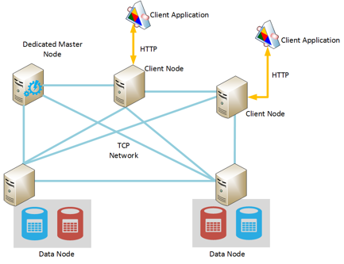
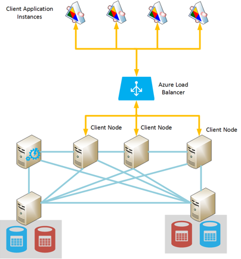
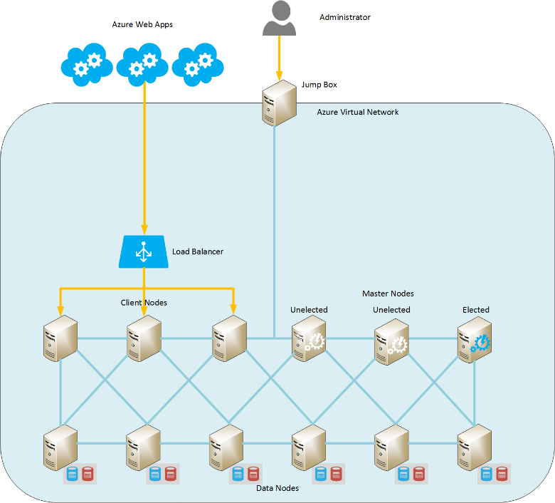

<properties
   pageTitle="Elasticsearch auf Windows Azure ausgeführte | Microsoft Azure"
   description="So installieren, konfigurieren und Azure Elasticsearch ausgeführt."
   services=""
   documentationCenter="na"
   authors="dragon119"
   manager="bennage"
   editor=""
   tags=""/>

<tags
   ms.service="guidance"
   ms.devlang="na"
   ms.topic="article"
   ms.tgt_pltfrm="na"
   ms.workload="na"
   ms.date="09/22/2016"
   ms.author="masashin"/>

# <a name="running-elasticsearch-on-azure"></a>Elasticsearch auf Windows Azure ausgeführte

[AZURE.INCLUDE [pnp-header](../../includes/guidance-pnp-header-include.md)]

Dieser Artikel ist [Teil einer Serie](guidance-elasticsearch.md). 

## <a name="overview"></a>(Übersicht)

Dieses Dokument enthält eine kurze Einführung in die allgemeine Struktur der Elasticsearch, und klicken Sie dann beschrieben, wie Sie einen Elasticsearch Cluster mit Azure implementieren können. Er berührt über bewährte Methoden für die Bereitstellung von einem Elasticsearch-Cluster auf die verschiedenen funktionsübergreifendes Leistung und Anforderungen an Ihrem System sowie in Anbetracht wie Ihren Anforderungen ausgeführt werden sollte, die Konfiguration und Suchtopologie, die Sie auswählen.

> [AZURE.NOTE] Dieser Leitfaden wird davon ausgegangen einige grundlegende Kenntnisse von [Elasticsearch][]aus.

## <a name="the-structure-of-elasticsearch"></a>Die Struktur der Elasticsearch 

Elasticsearch ist eine Dokument-Datenbank, die als ein Suchmodul dienen hochgradig optimiert. Dokumente werden im JSON-Format serialisiert. Daten werden, bleibt in Indizes, implementiert mithilfe von [Apache Lucene][], obwohl die Details werden von der Ansicht abstrahiert, und es nicht erforderlich ist, Lucene vollständig zu verstehen, damit Sie Elasticsearch verwenden können.

### <a name="clusters-nodes-indexes-and-shards"></a>Cluster, Knoten, Indizes und mehrere Shards hinweg

Elasticsearch implementiert eine gruppierte Architektur, die Sharding zum Verteilen von Daten auf mehreren Knoten und Replikation zur Bereitstellung hoher Verfügbarkeit verwendet. Dokumente werden in Indizes gespeichert. Kann der Benutzer angeben, welche Felder in einem Dokument verwendet werden, um ihn in einen Index eindeutig zu identifizieren, oder das System kann ein Feld mit einem und Werte automatisch generieren. Der Index wird verwendet, um Dokumente physisch organisieren und ist, dass die Tilgungsanteile bedeutet zum Auffinden von Dokumenten. 

Ein Index enthält eine Reihe von mehrere Shards hinweg. Dokumente werden über mehrere Shards hinweg mit einem hashing Verfahren basierend auf Schlüsselwerte im Index und die Anzahl der mehrere Shards hinweg im Index gleichmäßig verteilte. 

Indizes können repliziert werden. In diesem Fall wird jede Shard im Index kopiert. Elasticsearch stellt sicher, dass jeder ursprünglichen Shard für einen Index (als "primäre Shard" bezeichnet) und deren Kopie immer auf verschiedenen Knoten befinden. Wenn ein Dokument hinzugefügt oder geändert wird, Schreiben alle Vorgänge auf der primären Shard vor- und klicken Sie dann auf jedes Replikat ausgeführt werden. 

Die folgende Abbildung zeigt die wesentlichen Aspekte einer Elasticsearch Cluster mit drei Knoten. Ein Index wurde erstellt, das aus zwei primären mehrere Shards hinweg mit zwei Replikaten für jede Shard (sechs mehrere Shards hinweg in allen) besteht.


*Eine einfache Elasticsearch Cluster, enthält zwei primäre Knoten und zwei Sätze von Replikaten*

In diesem Cluster befinden primären Shard 1 und primären Shard 2 auf separate Knoten helfen, die Last gleichmäßig zu verteilen. Die Replikate werden auf ähnliche Weise verteilt. Wenn Sie ein einzelner Knoten fehlschlägt, haben die verbleibenden Knoten ausreichend Informationen zum Aktivieren des Systems funktionieren weiterhin. Falls erforderlich, Stufen Elasticsearch ein Replikat Shard um einen primären Shard werden, wenn der entsprechende primäre Shard nicht verfügbar ist.

### <a name="node-roles"></a>Rollen von Knoten

Die Knoten in einem Cluster Elasticsearch können die folgenden Rollen ausführen:

- Ein **Datenknoten** kann eine oder mehrere mehrere Shards hinweg enthalten, die Indexdaten enthalten.

- Ein **Clientknoten** , die keine Indexdaten enthält, aber, eingehende Anfragen von Clientanwendungen auf den entsprechenden Datenknoten vorgenommene behandelt.
 
- **Master-Knoten** , die keine Indexdaten enthält, aber die führt Cluster Management Vorgänge wie das Verwalten von, und routing-Informationen im Cluster verteilen (die Liste der Knoten welche mehrere Shards hinweg enthalten), bestimmen festzulegen, welche Knoten stehen zur Verfügung und Verschieben von mehrere Shards hinweg als Knoten angezeigt und verschwinden und Wiederherstellung nach Fehler Knoten koordinieren. Mehrere Knoten können als Master konfiguriert werden, aber nur von einem wird tatsächlich werden sich entschieden haben, führen Sie die Gestaltungsvorlage Funktionen. Wenn dieser Knoten fehlschlägt, eine andere Wahl stattfindet und in einer anderen berechtigt master Knoten wird sich entschieden haben, und übernehmen.

> [AZURE.NOTE]Markierte master-Knoten ist entscheidend, einen guten Zustand des Cluster. Die anderen Knoten pingen, regelmäßig, um sicherzustellen, dass es immer noch zur Verfügung steht. Wenn der markierte master-Knoten auch als Datenknoten fungiert, ist es, Wahrscheinlichkeit, dass der Knoten beschäftigt verwendet werden kann und Fail auf diese Pings reagieren. In diesem Fall das Master-Shape gilt als ausgefallen und einen anderen master Knoten an ihrer Stelle gewählt wird. 

 Die folgende Abbildung zeigt ein Suchtopologie, die eine Mischung aus dedizierten Master-Shape, Client und Datenknoten in einem Cluster Elasticsearch enthält.



*Ein Elasticsearch Cluster mit verschiedenen Arten von Knoten*

### <a name="costs-and-benefits-of-using-client-nodes"></a>Vor- und Nachteile der Verwendung von Client-Knoten

Wenn eine Anwendung eine Abfrage zu einem Cluster Elasticsearch übermittelt, ist der Knoten mit dem sich die Anwendung verbindet verantwortlich für die Abfrageprozess zu leiten. Der Knoten leitet die Anforderung an jedem Datenknoten und sammelt die Ergebnisse die kumulierte Informationen für die Anwendung zurückgegeben. Wenn eine Abfrage Aggregationen und anderen Berechnungen umfasst, führt der Knoten mit dem sich die Anwendung verbindet die notwendigen Vorgänge nach dem Abrufen der Daten aus jeder der anderen Knoten. Dieses Verfahren Punkt (XY) / sammeln kann dazu Verarbeitung und Speicherkapazität Ressourcen beanspruchen.

Mithilfe von dedizierten Client-Knoten für folgende Aufgaben können Datenknoten Fokussierung auf Verwalten und Speichern von Daten. Das Ergebnis ist, dass viele Szenarien, die komplexe Abfragen und Aggregationen umfassen, nutzbringend verwenden können dedizierte Client-Knoten. Die Auswirkung der Verwendung von dedizierten Client-Knoten wird jedoch wahrscheinlich abhängig von Ihrem Szenario, Arbeitsbelastung und Clustergröße variieren. 

> [AZURE.NOTE] Weitere Informationen über den Vorgang des Videogeräten finden Sie in [Optimieren Datenaggregation und Leistung von Abfragen für Elasticsearch auf Azure][] .

### <a name="connecting-to-a-cluster"></a>Herstellen einer Verbindung mit einem cluster

Elasticsearch stellt eine Reihe von REST-APIs für Clientanwendungen erstellen und Senden von Anfragen zu einem Cluster zur Verfügung. Wenn Sie eine Anwendung mit .NET Framework entwickeln, zwei höhere Stufen APIs stehen – [Elasticsearch.Net und verschachteln][].

Wenn Sie mit Java Clientanwendungen erstellen, können Sie die [Knoten-Client-API][] Client eine Knoten dynamisch erstellen und diese zum Cluster hinzufügen. Erstellen von Client Knoten dynamisch ist nützlich, wenn es sich bei Ihrem System relativ wenigen langer Lebensdauer Verbindungen verwendet. Client-Knoten mithilfe der API Knoten erstellt werden, sofern die Cluster routing zugeordnet werden soll (die Details der Knoten enthalten, die mehrere Shards hinweg) durch das master-Knoten. Diese Informationen ermöglicht die Java-Anwendung Verbindung direkt zu den entsprechenden Knoten beim Indizieren oder Abfragen von Daten, verringern die Anzahl der Abschnitte, die möglicherweise notwendig sein, wenn andere APIs verwenden.

Die Kosten dieser Vorgehensweise wird der Aufwand für den Clientknoten in der Cluster registrieren. Wenn eine große Anzahl von Client-Knoten verschwinden schnell angezeigt werden, kann der Einfluss der Wartung und verteilen die Weiterleitung Cluster-Karte beträchtlich sein.

Die folgende Abbildung zeigt eine Konfiguration, die ein Lastenausgleich verwendet zum Weiterleiten von Besprechungsanfragen an eine Gruppe von Clientknoten, obwohl dieselbe Strategie verwendet werden kann, um direkt mit Datenknoten herstellen, wenn Client-Knoten nicht verwendet werden.



*Client-Anwendungsinstanzen Herstellen einer Verbindung mit einem Elasticsearch Cluster über den Lastenausgleich Azure*

> [AZURE.NOTE]Sie können mithilfe der [Lastenausgleich Azure][] um Cluster mit dem öffentlichen Internet verfügbar zu machen, oder verwenden Sie eine [interne Lastenausgleich][] , wenn die Clientanwendungen und Cluster vollständig innerhalb der gleichen privaten virtuellen Netzwerk (VNet) enthalten sind.

### <a name="node-discovery"></a>Knoten-Suche

Elasticsearch basiert auf Peer-to-Peer-Kommunikation, damit andere Knoten in einem Cluster entdecken ein wichtiger im Lebenszyklus eines Knotens ist. Knoten Discovery ermöglicht neue Datenknoten dynamisch zu einem Cluster, der wiederum Cluster transparent skalieren können hinzugefügt werden. Ausfall eines Knotens Daten aus anderen Knoten Kommunikation Besprechungsanfragen beantworten, kann darüber hinaus master-Knoten entscheiden Sie, dass der Datenknoten fehlgeschlagen ist, und nehmen die erforderlichen Schritte aus, die mehrere Shards hinweg neu zuweisen, die sie an andere Datenknoten Betrieb gedrückt wurde.

Elasticsearch Knoten Discovery erfolgt mithilfe eines Discovery-Modul. Das Discovery-Modul ist ein Plug-in, die um ein anderen Discovery-Verfahren verwenden aktiviert werden kann. Das Standard-Discovery-Modul ([macht][]) wird ein Knoten Emission Ping-Anfragen zu anderen Knoten im selben Netzwerk zu suchen. Wenn andere Knoten reagieren, tratschen diese Informationen für den Austausch. Master-Knoten kann dann mehrere Shards hinweg auf den neuen Knoten verteilen, (sofern er ein Datenknoten ist) und Cluster neu zu verteilen. Das macht Discovery-Modul übernimmt auch den Wahlprozess master und das Protokoll zum Auffinden von Ausfall eines Knotens.

Darüber hinaus, wenn Sie als Azure-virtuellen Computern (virtuellen Computern) Elasticsearch Knoten ausführen, wird Multicastnachrichten nicht unterstützt. Für diese Gründe sollten Sie die Suche macht, um bestimmte messaging verwenden, und geben Sie eine Liste der gültige Kontakt-Knoten in der Konfigurationsdatei elasticsearch.yml konfigurieren.

Wenn Sie einen Elasticsearch Cluster in einem Azure-virtuellen Netzwerk hosten, können Sie angeben, dass die Private DHCP zugewiesenen IP-adressiert jeweilige virtueller Computer im Cluster bleiben soll zugewiesenen (statisch). Sie können die macht Discovery bestimmte messaging verwenden diese statischen IP-Adressen konfigurieren. Wenn Sie virtuellen Computern mit dynamischen IP-Adressen verwenden, lassen Sie beachten Sie, dass ein virtueller Computer angehalten wird und dem Neustart sie eine neue IP-Adresse, wodurch Discovery schwieriger zugewiesen werden konnte. Um dieses Szenario zu behandeln, können Sie das macht Discovery-Modul für die [Azure-Cloud-Plug-Ins][]wechseln. Diese-Plug-in verwendet die Azure-API der Erkennungsmechanismus implementiert wird dem Azure Abonnementinformationen basiert.

> [AZURE.NOTE]Die aktuelle Version von der Azure-Cloud-Plug-Ins müssen Sie das Zertifikat Management für Ihr Abonnement Azure im Java-Schlüsselspeicher auf dem Elasticsearch Knoten installieren, und geben Sie den Speicherort und die Anmeldeinformationen für den Zugriff auf den Schlüsselspeicher in der Datei elasticsearch.yml. Diese Datei wird als Klartext, aufbewahrt werden, wird es äußerst wichtig ist, dass Sie, dass diese Datei nur zugegriffen werden, indem Sie das Konto sicherstellen, mit dem Elasticsearch-Dienst. 
> 
> Darüber hinaus kann dieser Ansatz mit Azure Ressourcenmanager Bereitstellungen nicht kompatibel. Aus diesen Gründen empfiehlt es sich, dass Sie statische IP-Adressen für master-Knoten, und diese Knoten verwenden macht Discovery bestimmte messaging über den Cluster implementiert wird. In der folgenden Konfiguration (der elasticsearch.yml-Datei für eine Stichprobe Datenknoten werden entnommen) Bezug IP-Adressen der Hosts master Knoten im Cluster an:

```yaml
discovery.zen.ping.multicast.enabled: false  
discovery.zen.ping.unicast.hosts: ["10.0.0.10","10.0.0.11","10.0.0.12"]
```

## <a name="general-system-guidelines"></a>Allgemeine Regelung Richtlinien

Elasticsearch kann auf einer Vielzahl von Computern, die von einem einzelnen Laptop bis hin zu einem Cluster High-End-Servern ausgeführt werden. Weitere Ressourcen bedarfsgerecht computing, dass Power und schnelle Festplatten sind jedoch verfügbar bessere die Leistung. In den folgenden Abschnitten werden die grundlegenden Hard- und Software Anforderungen für die Ausführung von Elasticsearch.

### <a name="memory-requirements"></a>Arbeitsspeicher Anforderungen 

Elasticsearch versucht, die Daten im Speicher für Geschwindigkeit zu speichern. Zwischen 14 und 28 GB RAM (D3 oder D4 virtuellen Computern) sollte der Herstellung Server Hosten von einem Knoten für eine typische Enterprise oder professionellen Bereitstellung auf Azure mittlerer Größe verfügen. **Verteilen Sie die Last über weitere Knoten statt Erstellen Knoten mit mehr Speicher** (Versuche haben gezeigt, dass mithilfe von größeren Knoten mit mehr Speicher erweiterte Wiederherstellungszeiten im Fall eines Fehlers führen kann.) Jedoch zwar erstellen Cluster mit einer sehr großen Anzahl von kleinen Knoten Verfügbarkeit und Durchsatz erhöhen kann, wird er nötigenfalls auch den Aufwand beim Verwalten und Warten von einem solchen System.

**50 % der den verfügbaren Speicher auf einem Server auf den Elasticsearch Heap reservieren**. Wenn Sie Linux Festlegen der ES_HEAP_SIZE Umgebungsvariablen verwenden, bevor Elasticsearch ausgeführt. Alternativ, wenn Sie Windows oder Linux verwenden, können Sie angeben Arbeitsspeichergröße in die `Xmx` und `Xms` Parameter beim Starten von Elasticseach. Legen Sie beide Parameter in den gleichen Wert für das Ändern der Größe des Heaps zur Laufzeit Java virtuellen Computern (JVM) zu vermeiden. Jedoch **nicht mehr als 30 GB reservieren**. Verwenden Sie den verbleibenden Speicher für den Cache für das Betriebssystem von Dateien an.

> [AZURE.NOTE]Elasticsearch nutzt Lucene Bibliothek zum Erstellen und Verwalten von Indizes. Lucene Strukturen verwenden Sie ein Datenträger-basierten Format, und diese Strukturen in der Dateisystemcache Zwischenspeichern wird Leistung erheblich verbessern.

Beachten Sie, dass die maximale optimale Heapgröße für Java auf einem 64-Bit-Computer nur 30 GB überschritten hat. Über diese Größe, die Java wechselt bei der Verwendung einer erweiterten Verfahren zum Verweisen auf Objekte auf dem Heap, die erhöht der Arbeitsspeicher Anforderungen für jedes Objekt und reduziert die Leistung. 

Die standardmäßige Java Garbagecollector (gleichzeitige kennzeichnen und Zug) möglicherweise auch untergeordnete optimal ausgeführt werden, ist die Heapgröße über 30GB. Es wird derzeit nicht empfohlen, wechseln zu einer anderen Garbagecollector wie Elasticsearch und Lucene nur gegen Standard getestet wurden.

Arbeitsspeicher nicht overcommit, wie Auslagern Hauptfenster Speicher auf den Datenträger Leistung stark beeinträchtigt werden. Deaktivieren Sie, falls möglich vollständig austauschen (die Details hängen davon ab, das Betriebssystem). Wenn dies nicht möglich ist aktivieren Sie die Einstellung *Mlockall* in der Konfigurationsdatei Elasticsearch (elasticsearch.yml) wie folgt:

```yaml
bootstrap.mlockall: true
```

Diese Einstellung Konfiguration bewirkt, dass die JVM seinen Speicher sperren und verhindert, dass es vom Betriebssystem ausgetauscht.

### <a name="disk-and-file-system-requirements"></a>Datei- und Systemanforderungen

Verwenden Sie Daten Datenträger gesicherten von Premium Speicher zum Speichern von mehrere Shards hinweg. Datenträger sollte Größe angepasst werden, um die maximale Datenmenge in Ihrer mehrere Shards hinweg, geschätztes halten, obwohl weiteren Datenträger später hinzugefügt werden kann. Sie können eine Shard auf mehrere Datenträger auf einem Knoten erweitern.

> [AZURE.NOTE]Elasticsearch komprimiert die Daten für gespeicherte Felder mit dem Algorithmus LZ4 und in Elasticsearch 2.0 oder höher können Sie die Art der Komprimierung ändern. Sie können den Komprimierungsalgorithmus zu DEFLATE von den Dienstprogrammen *Zip* und *Gzip* verwendete wechseln. Dieses Verfahren Komprimierung kann weitere Ressourcen beanspruchen, aber erwägen Sie es für archivierte Log Daten. Dieser Ansatz kann dazu beitragen um Index zu verkleinern.

Es ist nicht unbedingt erforderlich, dass alle Knoten in einem Cluster die gleiche Datenträgerlayout und Kapazität verfügen. Jedoch ein Knoten mit einer sehr großen Datenträgerkapazität im Vergleich zu anderen Knoten in einem Cluster werden weitere Daten gewinnen und benötigen höhere Verarbeitung Power, diese Daten zu behandeln. Somit der Knoten werden kann "wichtiges" im Vergleich zu anderen Knoten, und dies kann, wiederum Leistung auswirken.

Verwenden Sie, falls möglich RAID 0 (Striping). Andere Arten von RAID, die Unstimmigkeit und Spiegelung implementieren sind nicht erforderlich, wie Elasticsearch einen eigenen hohen Verfügbarkeit-Lösung in Form von Replikaten enthält.

> [AZURE.NOTE]Vor dem Elasticsearch 2.0.0 könnten Sie Striping Ebene der Software auch angeben mehrerer Verzeichnisse der *path.data* Konfiguration Einstellung implementieren. In Elasticsearch 2.0.0 wird diese Art der Striping nicht mehr unterstützt. Stattdessen andere mehrere Shards hinweg möglicherweise, die verschiedenen Wege zugewiesen werden, aber aller Dateien in einer einzelnen Shard werden auf den gleichen Pfad geschrieben werden. Wenn Sie Striping benötigen, sollten Sie die Daten auf das Betriebssystem oder Hardwareebene aufteilen. 

Um Speicher, jede **virtueller Computer sollte eine dedizierte Premium Speicher-Konto haben**liegenden.

Lucene Bibliothek können eine große Anzahl von Dateien zum Speichern von Indexdaten, und Elasticsearch kann eine große Anzahl von Sockets für die Kommunikation zwischen Knoten und Clients geöffnet. Stellen Sie sicher, dass das Betriebssystem, das für die Unterstützung der Anzahl der geöffneten Dateideskriptoren (bis zu 64000 Wenn genügend Arbeitsspeicher zur Verfügung steht) konfiguriert ist. Beachten Sie, dass die standardmäßige Konfiguration für viele Linux-Versionen die Anzahl der geöffneten Dateideskriptoren 1024 schränkt, welche viel zu klein ist.

Elasticsearch verwendet eine Kombination aus zugeordneten Speichers (Mmap) e/a und Java neuen e/a (NIO), um gleichzeitigen Zugriff auf Datendateien und Indizes optimieren. Wenn Sie Linux verwenden, sollten Sie das Betriebssystem, um sicherzustellen, dass genügend virtueller Speicher verfügbar mit Leerzeichen für 256K Arbeitsspeicher Karte Bereiche konfigurieren.

> [AZURE.NOTE]Viele Linux Verteilung Standard bei der Verwendung von des vollständig ' wissenschaftsmesse ' Warteschlangen (CFQ) Scheduler zum Schreiben von Daten auf einem Datenträger beim anordnen. Dieser Planer ist nicht für SSDs optimiert. Erwägen Sie das Betriebssystem, das zum Verwenden der Scheduler NOOP oder der Stichtag Scheduler, beide effektiver für SSDs sind neu zu konfigurieren.

### <a name="cpu-requirements"></a>CPU-Anforderungen

Azure-virtuellen Computern sind in einer Vielzahl von CPU-Konfigurationen verfügbar zwischen 1 und 32 Kerne unterstützen. Für einen Datenknoten ist ein guter Ausgangspunkt eines standard DS-Serie virtuellen Computer, und wählen Sie entweder die DS3 (4 Kerne) oder D4 (8 Kerne) SKUs. Die DS3 enthält auch 14GB RAM, während der DS4 28 GB enthält. 

Verwenden die GS (für Premium-Speicher) und G-Serie (für standard-Speicher) Xeon E5 V3 Prozessoren die Auslastung hilfreich sein können, die stark berechnen ankommt, wie z. B. umfangreiche Aggregationen sind. Die neuesten Informationen finden Sie auf [Größe für virtuelle Computer][].

### <a name="network-requirements"></a>Netzwerk-Anforderungen

Elasticsearch erfordert die Bandbreite des Netzwerks zwischen 1 und 10 Gbps, je nach Größe und Flüchtigkeit Cluster befinden, das sie implementiert. Elasticsearch migriert werden mehrere Shards hinweg zwischen Knoten aus, wenn mehrere Knoten zu einem Cluster hinzugefügt werden. Elasticsearch wird davon ausgegangen, die die Uhrzeit der Kommunikation zwischen allen Knoten entspricht ungefähr und die relativen Position der mehrere Shards hinweg frei, die auf diesen Knoten nicht berücksichtigt. Darüber hinaus kann ein Replikation signifikante Netzwerk e/a zwischen mehrere Shards hinweg entstehen. Aus diesen Gründen **vermeiden Cluster auf, die in unterschiedlichen Regionen sind, Knoten erstellen**.

### <a name="software-requirements"></a>Softwareanforderungen

Sie können Elasticsearch ausführen, klicken Sie auf Windows oder Linux. Der Dienst Elasticsearch wird als Java JAR-Bibliothek bereitgestellt und ist abhängig von anderen Java-Bibliotheken, die in das Paket Elasticsearch enthalten sind. Sie müssen die Java 7 (Update 55 oder höher) oder Java installieren 8 (Update 20 oder höher) JVM Elasticsearch ausführen.

> [AZURE.NOTE]Als die *Xmx* und *Xms* Arbeitsspeicher Parameter (festgelegte Befehlszeilenoptionen an die Elasticsearch-Engine – finden Sie unter [Arbeitsspeicher Anforderungen][]) ändern Sie die Standardeinstellungen für JVM Konfiguration nicht. Elasticsearch wurde unter Verwendung der Standardeinstellungen entwickelt; Ändern sie können dazu führen, dass Elasticsearch nicht mehr detuned und schlecht ausführen.

### <a name="deploying-elasticsearch-on-azure"></a>Bereitstellen von Elasticsearch auf Azure

Zwar nicht schwierig eine einzelne Instanz von Elasticsearch bereitgestellt wird, kann die Erstellung einer Anzahl von Knoten und installieren und Konfigurieren von Elasticsearch auf jeweils eines Prozesses Zeit in Anspruch nehmen und fehlerhaften sein. Wenn Sie erwägen, Elasticsearch auf Azure-virtuellen Computern ausgeführt, gibt es drei Optionen, die Ihnen helfen können, um ist die Wahrscheinlichkeit von Fehlern zu verringern.

- Verwenden die Ressourcenmanager Azure- [Vorlage](https://azure.microsoft.com/marketplace/partners/elastic/elasticsearchelasticsearch/) in Azure Marketplace. Diese Vorlage wird von elastisch erstellt. Sie können Sie kommerzielle Erweiterungen wie Schild, Marvel, Monitor, usw. hinzufügen.

- Verwenden die Azure Schnellstart- [Vorlage](https://github.com/Azure/azure-quickstart-templates/tree/master/elasticsearch) , um Cluster zu erstellen. Mit dieser Vorlage kann einen Cluster ausgehend von Windows Server 2012 oder Ubuntu Linux 14.0.4 erstellen. Sie können Sie Versuche Features wie Dateispeicher Azure verwenden. Diese Vorlage dient für die Recherchieren und Testen Aufgaben in diesem Dokument.

- Verwenden von Skripts, die automatisierte oder unbeaufsichtigt ausgeführt werden können. Skripts, die erstellen und Bereitstellen einen Elasticsearch Cluster können, stehen im [Repository GitHub][elasticsearch-scripts]

## <a name="cluster-and-node-sizing-and-scalability"></a>Cluster und Knoten Ziehpunkte und Skalierbarkeit 

Elasticsearch ermöglicht eine Reihe von Bereitstellungstopologien, soll die unterschiedliche Anforderungen und Ebenen Skala zu unterstützen. In diesem Abschnitt werden einige allgemeinen Topologien erläutert und beschreibt die Kriterien für die Cluster basierend auf diesen Topologien.

### <a name="elasticsearch-topologies"></a>Elasticsearch Topologien

Die folgende Abbildung illustriert diese als Ausgangsbasis für das Entwerfen einer Suchtopologie Elasticsearch für Azure:



*Vorgeschlagene Ausgangspunkt zum Erstellen eines Elasticsearch Clusters mit Azure*

Diese Suchtopologie enthält sechs Datenknoten zusammen mit drei Client und drei master-Knoten (nur ein master-Knoten sich entschieden haben, ist, die anderen zwei stehen für die Wahl soll, wenn das markierte Master-Shape fehlschlägt.) Jeder Knoten wird als einen separaten virtuellen implementiert. Azure Webanwendungen werden Client-Knoten über ein Lastenausgleich geleitet. 

In diesem Beispiel befinden sich in allen Knoten und die Webanwendungen im gleichen virtuellen Netzwerk, das effektiv von außen wird isoliert. Wenn der Cluster extern verfügbar sein muss (oftmals als Teil einer lokalen Clients einbinden Hybrid-Lösung), Sie können den Lastenausgleich Azure bereitstellen eine öffentliche IP-Adresse verwenden, aber Sie müssen zusätzliche Sicherheit Vorsichtsmaßnahmen, um unbefugten Zugriff auf den Cluster zu verhindern. 

"Springen Feld optional" ist ein virtueller Computer, die nur für Administratoren verfügbar ist. Diesem virtuellen Computer verfügt über eine Netzwerkverbindung das virtuelle Netzwerk, aber auch eine nach außen gegenüberliegende-Verbindung zum Administrator Anmeldung aus einem externen Netzwerk zulassen (diese Anmeldung sollten geschützt werden, mit der ein sicheres Kennwort oder Zertifikat). Ein Administrator kann melden Sie sich an das springen, und klicken Sie dann von dort aus direkt Herstellen einer Verbindung mit allen Knoten im Cluster. 

Alternative Ansätze gehören mithilfe ein Standort-zu-Standort VPN zwischen einer Organisation und das virtuelle Netzwerk, oder verwenden für die Verbindung mit dem virtuellen Netzwerk [ExpressRoute][] Schaltkreise. Diese Verfahren zulassen administrativen Zugriff auf den Cluster ohne Cluster mit dem öffentlichen Internet verfügbar zu machen.

Um die Verfügbarkeit von virtuellen Computer beibehalten möchten, sind die Datenknoten in demselben Satz Azure Verfügbarkeit gruppiert. Ebenso werden Client-Knoten in einen weiteren Satz von Verfügbarkeit aufrechterhalten und die master-Knoten in einer Gruppe von Dritten Verfügbarkeit gespeichert sind.

Diese Suchtopologie ist relativ einfach zu skalieren, einfach weitere Knoten des entsprechenden Typs hinzufügen, und stellen Sie sicher, dass sie mit demselben Clusternamen in der Datei elasticsearch.yml konfiguriert sind. Client-Knoten müssen außerdem die Back-End-Pool für Azure Lastenausgleich hinzugefügt werden.

**Auffinden von Geo Cluster**

**Knoten in einem Cluster über Regionen nicht verteilt werden, wie dies die Leistung der Kommunikation zwischen den Knoten auswirken können** (siehe [Netzwerk Anforderungen][]). Auffinden von Geo Daten in der Nähe Benutzern in anderen Regionen müssen Sie mehrere Cluster erstellen. In diesem Fall Sie berücksichtigen müssen, wie (und ob) Cluster synchronisieren möchten. Mögliche Lösungen umfassen:

[Tribe Knoten][] ähneln sich mit einem Clientknoten, können sie mehrere Elasticsearch Cluster teilnehmen und alle als eine große Cluster anzeigen. Daten werden weiterhin lokal verwaltet, durch jeden Cluster (Updates werden nicht über Cluster hinweg weitergeleitet), jedoch alle Daten wird angezeigt. Ein Tribe Knoten kann Abfragen, erstellen und Verwalten von Dokumenten in eine beliebige Cluster. 

Die primären Einschränkungen sind, dass ein Tribe Knoten kann nicht verwendet werden, um einen neuen Index erstellen und Indexnamen für alle Cluster eindeutig sein müssen. Daher ist es wichtig, dass Sie berücksichtigen, wie Indizes benannt werden, beim Entwerfen Cluster aus Tribe Knoten zugegriffen werden soll.

Verwenden dieses Verfahren, jeder Cluster kann enthalten die Daten, die vor allem von lokalen Clientanwendungen zugegriffen werden, aber diese Clients weiterhin zugreifen und remote-Daten zwar mit möglichen erweiterten Wartezeit ändern können. Die folgende Abbildung zeigt ein Beispiel für diese Suchtopologie. Der Tribe-Knoten in Cluster 1 wird hervorgehoben; die anderen Cluster können auch Tribe Knoten aufweisen, auch wenn diese nicht im Diagramm angezeigt werden:


*Eine Clientanwendung Zugriff auf mehrere Cluster über einen Tribe-Knoten*

In diesem Beispiel die Clientanwendung eine Verbindung herstellt, auf dem Tribe-Knoten im Cluster 1 (gemeinsame befindet sich in der gleichen Region), aber dieser Knoten ist so konfiguriert, dass in Access Cluster 2 und 3 für Cluster, die möglicherweise in unterschiedlichen Regionen angezeigt werden kann. Die Clientanwendung kann Anfragen senden, die Abfragen und Ändern von Daten in einem Cluster befinden.

> [AZURE.NOTE]Tribe Knoten erfordern multicast Discovery Verbindung zum Cluster, die ein Sicherheitsrisiko darstellen können. Finden Sie im Abschnitt [Knoten Discovery][] Weitere Details aus.

- Implementieren der Geo-Replikation zwischen Cluster. Bei dieser Vorgehensweise bei jeder Cluster vorgenommene Änderungen weitergegeben werden in nahezu in Echtzeit auf Cluster befindet sich in anderen Data Center. Drittanbieter--Plug-Ins sind verfügbar für Elasticsearch, die diese Funktion, wie etwa das [PubNub Änderungen-Plug-in][]zu unterstützen.

- Verwenden der [Elasticsearch Momentaufnahme und Modul wiederherstellen][]. Wenn die Daten sehr langsam-verschieben und nur von einem einzigen Cluster geändert werden, können Sie erwägen Momentaufnahmen periodische Kopie der Daten erstellen und dann wiederhergestellt diese Momentaufnahmen in andere Cluster (Momentaufnahmen können in Azure Blob Storage gespeichert werden, wenn Sie das [Azure-Cloud-Plug-in][]installiert haben). Diese Lösung funktioniert jedoch nicht gut für sich schnell ändernder Daten oder wenn Sie Daten in mehr als einem Cluster geändert werden können.

**Kleine Topologien**

Umfangreiche Topologien, umfasst Cluster mit dedizierten Master-Shape, Client und Daten Knoten möglicherweise nicht für jedes Szenario eignen. Wenn Sie eine kleine Herstellung oder Entwicklungssystem erstellen, sollten Sie Cluster 3-Knoten in der folgenden Abbildung gezeigt.

Schließen Sie Clientanwendungen direkt an alle verfügbaren Datenknoten im Cluster. Cluster enthält drei mehrere Shards hinweg gekennzeichnet P1-P3 (um Wachstum zu ermöglichen) plus Replikate R1-R3 gekennzeichnet. Mit drei Knoten ermöglicht Elasticsearch, die mehrere Shards hinweg und Replikate verteilen, dass, wenn ein Knoten fehlschlägt beliebiges keine Daten verloren.


*Eine 3-Knoten-Cluster mit 3 mehrere Shards hinweg und der*

Wenn Sie eine Entwicklung Installation auf einem eigenständigen Computer ausführen können Sie einen Cluster mit einem einzelnen Knoten konfigurieren, die als Master-Shape, Client und Datenspeicher fungiert. Alternativ können Sie mehrere Knoten als Cluster durch Starten von mehr als eine Instanz des Elasticsearch auf dem gleichen Computer ausgeführt starten. Die folgende Abbildung zeigt ein Beispiel.


*Eine Entwicklungskonfiguration mehrere Elasticsearch Knoten auf dem gleichen Computer ausgeführt*

Beachten Sie, dass keiner dieser eigenständigen Konfigurationen für eine Herstellung-Umgebung vorgeschlagen werden, wie sie Konflikte verursachen können, es sei denn, Ihr Entwicklungscomputer sehr viel Arbeitsspeicher und mehrere schnelle Datenträger weist. Darüber hinaus bieten nicht sie, dass ein hoher Verfügbarkeit garantiert. Wenn der Computer fehlschlägt, sind alle Knoten verloren.

### <a name="scaling-a-cluster-and-data-nodes"></a>Skalierung einer Knoten Cluster und Daten

Elasticsearch kann in zwei Dimensionen skalieren: vertikal (mit größer, leistungsfähigeren Computer) und horizontal (verteilen die Last auf Computern).

**Elasticsearch Datenknoten vertikal skalieren**

Wenn Sie einen Elasticsearch Cluster mithilfe von Azure-virtuellen Computern hosten, kann jeder Knoten eines virtuellen Computers entsprechen. Die Beschränkung der vertikalen Skalierbarkeit für einen Knoten weitgehend unterliegt der SKUs den virtuellen Computer und die generelle Einschränkungen auf einzelne Speicherkonten und Azure-Abonnements angewendet. 

Die Seite [Azure-Abonnement und Beschränkungen Service, Kontingente, und Einschränkungen](../azure-subscription-service-limits.md) werden diese Grenzwerte ausführlich beschrieben, aber soweit Erstellen eines Elasticsearch Clusters betrifft ist, die Elemente in der folgenden Liste sind die relevanten. 

- Jedes Storage-Konto ist auf 20.000 IOPS eingeschränkt. Jeder virtuelle Computer in Cluster sollte eine spezielle nutzen (vorzugsweise Premium) Speicher-Konto.

- Die Anzahl der Datenknoten in einem virtuellen Netzwerk. Wenn Sie nicht die Ressourcenmanager Azure verwenden, ist es maximal 2048 virtueller Computer Instanzen pro virtuelle Netzwerk. Während dies für vielen Fällen ausreichend, wenn Sie eine sehr große Konfiguration mit Tausende von Knoten haben Beweisen sollte kann es eine Beschränkung handeln.

- Anzahl der Speicherkonten pro Abonnement pro Region. Sie können bis zu 100 Speicherkonten pro Abonnement Azure in jeder Region erstellen. Speicherkonten werden verwendet, um virtuelle Laufwerke zu halten, und jedes Storage-Konto sind maximal 500TB Abstand.

- Die Anzahl der Kerne pro Abonnement. Die maximale ist standardmäßig 20 Kerne pro Abonnement, aber dies kann bis zu 10.000 Kerne durch eine höhere Grenzen durch Support-Ticket anfordern vergrößert werden. 

- Die Speichermenge pro virtueller Speicher. Geringere Größe virtuellen Computern haben Datenmengen verfügbaren Arbeitsspeicher (D1 Autos 3,5 GB haben und D2 Autos 7 GB haben) eingeschränkt. Diesen Computern möglicherweise nicht für Szenarien geeignet, die erfordern Elasticsearch Zwischenspeichern große Datenmengen gute Leistung (Aggregieren von Daten oder zu analysieren einer großen Anzahl der Dokumente während der Eingabe von Daten, beispielsweise) zu erzielen.

- Die maximale Anzahl der Laufwerke pro virtueller Speicher. Diese Einschränkung kann die Größe und Leistung von einem Cluster einschränken. Wenige Datenträger bedeutet, dass weniger Daten aufnehmen können und Leistung kann reduziert werden, indem Sie weniger Festplatten für Striping verfügbar.

- Die Anzahl der Domänen aktualisieren / einen Fehler Domänen pro Verfügbarkeit festlegen. Wenn Sie virtuelle Computer mit dem Azure Ressource-Manager erstellen, kann jeden Satz Verfügbarkeit bis zu 3 Fehlerstrukturanalyse und 20 Update-Domänen zugeordnet werden. Diese Einschränkung kann die Stabilität von einem großen Cluster auswirken, die fortlaufende Updates häufige ausgesetzt wird.

Darüber hinaus sollten Sie wahrscheinlich nicht erwägen virtuellen Computern mit mehr als 64GB Arbeitsspeicher. Wie im Abschnitt [Speicher Anforderungen][]beschrieben, sollten Sie nicht mehr als 30 GB RAM jedes virtuellen Computers auf die JVM zuordnen und ermöglichen das Betriebssystem, das den verbleibenden Speicher für e/a-Pufferung zu nutzen.

Mit dieser Einschränkungen Denken Sie daran sollten Sie immer die virtuellen Laufwerke für den virtuellen Computern in einem Cluster auf Speicherkonten verringern Sie die Wahrscheinlichkeit von e/a-begrenzungsebene verteilt. In einem sehr großen Cluster müssen Sie die Umgestaltung Ihrer logischen Infrastruktur und ihn in separaten funktionsübergreifendes Partitionen aufteilen. Beispielsweise müssen Sie über Abonnements, den Cluster aufgeteilt zwar dieses Verfahren zu weiteren Probleme geben aufgrund der erforderlichen virtuelle Netzwerke Verbindung führen kann.

**Horizontale Skalierung eines Elasticsearch Clusters**

Intern wird die Beschränkung der horizontalen Skalierbarkeit innerhalb Elasticsearch, durch die Anzahl der mehrere Shards hinweg für jeden Index definiert bestimmt. Zunächst viele mehrere Shards hinweg, die denselben Knoten in einem Cluster zugewiesen werden können, jedoch mit zunehmender Datenmengen zusätzliche Knoten hinzugefügt werden können und mehrere Shards hinweg können auf diese Knoten verteilt werden. In der Theorie nur, wenn die Anzahl der Knoten die Anzahl der mehrere Shards hinweg erreicht wird das System nicht mehr horizontal skalieren.

Wie bei der vertikalen Skalierung, gibt es einige Probleme, die Sie beim Implementieren der horizontale Skalierung, einschließlich einzusetzen berücksichtigen sollten:

- Die maximale Anzahl von virtuellen Maschinen, die Sie in ein Azure-virtuellen Netzwerk herstellen können. Dies kann die horizontale Skalierbarkeit für einen sehr großen Cluster einschränken. Sie können einen Cluster Knoten erstellen, die mehrere eine virtuelle Netzwerk, die diese Beschränkung, doch kann dieses Verfahren zu umgehen zu reduzierte Leistung aufgrund der fehlenden Ort für die einzelnen Knoten mit den Kollegen führen kann.

- Die Anzahl der Laufwerke pro virtueller Speicher. Unterstützung von anderen Reihe und SKUs unterschiedlich viele verbundenen Laufwerke.
Darüber hinaus können Sie auch betrachten den temporären Speicher enthalten, mit dem virtuellen Computer verwenden, um einen bestimmten Zeitraum schneller Daten Speicher, bereitzustellen zwar bestehen Stabilität und Wiederherstellung Auswirkungen, die Sie berücksichtigen sollten (finden Sie unter [Konfigurieren von Stabilität und Wiederherstellung auf Elasticsearch auf Azure] [ elasticsearch-resilience-recovery] für Weitere Informationen). D-Serie DS-Serie, Dv2-Serie und der virtuellen Computern GS-Serie SSDs für temporärer Speicher verwenden.

Sie könnten bietet [Virtuellen Computern skalieren Sätze] [ vmss] starten und Beenden von virtuellen Computern als bestimmt erfordert. Allerdings ist dieser Ansatz nicht für eine Elasticsearch Cluster aus den folgenden Gründen geeignet:

- Dieser Ansatz empfiehlt sich am besten für statusfreie virtuellen Computern. Jedes Mal, die Sie hinzufügen oder entfernen ein Knotens aus einem Cluster Elasticsearch mehrere Shards hinweg sind neu reserviert, um den Lastenausgleich, und dieses Verfahren kann dazu Datenmengen Netzwerkverkehr und e/a-generieren und Daten Aufnahme Sätzen kann stark beeinträchtigt. Sie müssen beurteilen, ob diese Verwaltungsaufwand lohnt sich die Vorteile von die weitere Verarbeitung und Speicherressourcen, die durch Starten von dynamisch weitere virtuellen Computern verfügbar sind.

- Virtueller Computer Start geschieht nicht sofort, und es kann einige Minuten dauern, bevor weitere virtuelle Computer Verfügung stehen zur, oder diese beenden. Auf diese Weise Skalierung darf nur längere Änderungen in Demand verarbeitet verwendet werden.

- Nach dem skalieren müssen Sie tatsächlich wieder Skalierung berücksichtigen? Entfernen eines virtuellen Computers von einem Elasticsearch Cluster kann ein Vorgang der Ressource stark erfordern, dass Elasticsearch stellt wieder her, die mehrere Shards hinweg und Replikate, die sich auf die virtuellen Computer befinden, und diese auf einem oder mehreren der verbleibenden Knoten neu sein. Mehrere virtuelle Computer gleichzeitig entfernen, könnte die Integrität des Cluster, wodurch Wiederherstellung schwierig gefährdet. Darüber hinaus viele Elasticsearch Implementierungen mit der Zeit wachsen, aber die Art der Daten ist, sodass ist nicht mit Lautstärke zu verkleinern. Es ist möglich, Dokumente manuell zu löschen, und Dokumente können auch mit dem TTL-Wert (Zeit, live) konfiguriert werden, nach denen sie abgelaufen sind und erhalten entfernt, jedoch in den meisten Fällen, die ist es wahrscheinlich, dass der zuvor zugewiesene Speicherplatz erneut, indem Sie neue oder geänderte Dokumente schnell verwendet werden. Fragmentierung innerhalb eines Indexes möglicherweise auftreten, wenn Dokumente entfernt oder geändert werden, Sie können in diesem Fall Elasticsearch HTTP [Optimieren][] API verwenden (Elasticsearch 2.0.0 und frühere Versionen) oder die [Erzwingen Sie die Zusammenführung][] API (Elasticsearch 2.1.0 und höher) Defragmentierung ausführen.

### <a name="determining-the-number-of-shards-for-an-index"></a>Ermitteln der Anzahl der mehrere Shards hinweg für einen index

Die Anzahl der Knoten in einem Cluster kann über einen Zeitraum abweichen, aber die Anzahl der mehrere Shards hinweg in einem Index wird festgelegt, nachdem der Index erstellt wurde. Zum Hinzufügen oder entfernen mehrere Shards hinweg erfordert neu Rekonstruieren der Daten – ein Verfahren zum Erstellen eines neuen Indexes mit den erforderlichen Anzahl mehrere Shards hinweg, und klicken Sie dann die Daten aus dem alten Index in das neue (können Aliase zum Isolieren Benutzer darauf, dass Daten erneut indexiert wurde hat – finden Sie weitere Informationen hierzu unter [Optimieren Datenaggregation und Leistung von Abfragen für Elasticsearch auf Azure][] ) kopieren.
Daher ist es wichtig, um die Anzahl der mehrere Shards hinweg zu ermitteln, die Sie wahrscheinlich vor dem Erstellen des ersten Indexes in Ihren Cluster erforderlich sind. Führen Sie die folgenden Schritte aus, um diese Anzahl einzurichten:

- Erstellen Sie einen einzigen Knoten Cluster mit derselben Hardwarekonfiguration, die Sie in der Herstellung bereitstellen möchten.

- Erstellen Sie einen Index, der die Struktur entspricht, die Sie in der Herstellung verwenden möchten. Geben Sie diesen Index eine einzelne Shard und der keine.

- Fügen Sie eine bestimmte Menge der Herstellung realistische Daten auf den Index.

- Ausführen von typische Abfragen, Aggregationen und aufgrund der Ergebnisse gegen den Index und messen die Zeit Durchsatz und Antwort.

- Wenn die Zeit Durchsatz und Antwort innerhalb von Grenzen zulässig sind, wiederholen Sie den Vorgang ab Schritt 3 (Weitere Daten hinzufügen).

- Wenn Sie angezeigt werden, um die Kapazität der Shard (Reaktionszeiten und Durchsatz beginnen immer inakzeptabel) erreicht haben, notieren Sie sich die Lautstärke von Dokumenten.

- Die Kapazität einer einzelnen Shard der erwarteten Anzahl von Dokumenten in der Herstellung der erforderlichen mehrere Shards hinweg liegen (Sie sollten einige Rand der Fehler bei der Berechnung einschließen wie Extrapolation nicht präzise Wissenschaft ist) aufgeführt.

> [AZURE.NOTE]Denken Sie daran, dass jede Shard als einen Index Lucene implementiert wird, die es Arbeitsspeicher, CPU-Leistung und Datei Ziehpunkte verbraucht. Die weitere mehrere Shards hinweg stehen Ihnen, weitere Ressourcen, die Sie benötigen.

Darüber hinaus weitere mehrere Shards hinweg erstellen möglicherweise Skalierbarkeit (je nach Ihrer Auslastung und Szenario) sowie kann erhöht Aufnahme Datendurchsatz, aber es möglicherweise die Effektivität von vielen Abfragen zu verringern. Standardmäßig wird eine Abfrage Abfragen jeder Shard von einem Index ( [benutzerdefinierte routing][] können Sie dieses Verhalten zu ändern, wenn Sie, welche mehrere Shards hinweg die benötigten Daten wissen auf befindet) verwendet. 

Bei dieser Vorgehensweise kann nur eine Schätzung für die Anzahl der mehrere Shards hinweg generieren, und die Lautstärke von Dokumenten in der Herstellung erwartet möglicherweise nicht bekannt sein. In diesem Fall sollten Sie die ursprüngliche Lautstärke (wie oben) und die geschätzte geometrischen Zins ermitteln. Erstellen Sie eine entsprechende Anzahl von mehrere Shards hinweg, die den Wertzuwachs Daten für den Zeitraum, bis Sie die Datenbank neu indizieren möchten behandelt werden können. 

Weitere Strategien für Szenarien wie das Ereignismanagement verwendet und Protokollierung gehören paralleles Indizes.
Erstellen Sie einen neuen Index für die Daten, die jeden Tag aufgenommen und können greifen Sie diesen Index ein Alias zu, der täglich aktiviert ist, zeigen Sie auf den letzten Index. Dieser Ansatz können Sie einfacher Alter Auschecken alten Daten (Sie können Informationen enthalten, die nicht mehr benötigt wird Indizes löschen) und bleibt verwaltbare Datenmengen.

Orientieren Sie, die die Anzahl der Knoten nicht unbedingt die Anzahl der mehrere Shards hinweg entsprechen. Angenommen, wenn Sie mehrere Shards 50 hinweg erstellen, können Sie sie zunächst auf 10 Knoten verteilt, und fügen Sie weitere Knoten zum Skalieren des Systems, als die Lautstärke des Arbeit erhöht. Vermeiden Sie einige wenige Knoten (1000 mehrere Shards hinweg verteilt über 2 Knoten, beispielsweise) eine besonders große Anzahl von mehrere Shards hinweg erstellen. Obwohl der theoretisch Skalierung des Systems auf 1000 Knoten mit dieser Konfiguration konnte ausgeführt 500 mehrere Shards hinweg auf einem einzelnen Knoten Risiken vereinheitlichtem die Leistung des Knotens.

> [AZURE.NOTE]Für Systeme, die Daten-Aufnahme sind extra fett, bietet eine Primzahl der mehrere Shards hinweg. Der Standardalgorithmus, den für das routing von Dokumenten zu mehrere Shards hinweg erzeugt Elasticsearch verwendet eine weitere selbst in diesem Fall verteilt.

### <a name="security"></a>Sicherheit

Standardmäßig Elasticsearch implementiert minimale Sicherheit und bietet keine Mitteln der Authentifizierung und Autorisierung. Diese Aspekte erfordern die zugrunde liegenden Betriebssystem und Netzwerk konfigurieren und Verwenden von-Plug-Ins und Drittanbieter-Dienstprogramme. Beispiele: [Schild][]und [Guard suchen][].

> [AZURE.NOTE]Schild ist ein Plug-in vom elastisch für die Benutzerauthentifizierung, Daten Verschlüsselung, rollenbasierte Access-Steuerelements, IP-Filtern und Überwachung bereitgestellt. Es möglicherweise erforderlich, vor das zugrunde liegenden Betriebssystem, um weitere Sicherheitsmaßnahmen, wie z. B. Datenträger Verschlüsselung implementieren konfigurieren.

In einem System Herstellung, sollten Sie auch so:

- Verhindern, dass nicht autorisierten Zugriff auf den Cluster.
- Identifizieren und Authentifizieren von Benutzern.
- Autorisieren die Vorgänge, die authentifizierte Benutzer ausführen können.
- Schützen Sie den Cluster nicht autorisiert oder beschädigen Vorgänge.
- Schützen Sie die Daten vor unbefugtem Zugriff.
- Erfüllen Sie gesetzliche Vorschriften für kommerzielle Daten Sicherheit (sofern zutreffend).

### <a name="securing-access-to-the-cluster"></a>Sichern des Zugriffs auf cluster

Elasticsearch ist ein Netzwerkdienst. Die Knoten in einem Cluster Elasticsearch für eingehenden Clientanfragen über HTTP hören und kommunizieren miteinander über einen TCP-Kanal. Sie sollten nicht autorisierte Clients oder Services verhindern kann zum Senden von Besprechungsanfragen über das HTTP- und TCP Pfade Maßnahmen. Berücksichtigen Sie die folgenden Elemente aus. 

- Definieren Sie Sicherheitsgruppen Netzwerk, um den eingehenden und ausgehenden Netzwerkdatenverkehr für ein virtuelles Netzwerk oder virtueller Computer nur bestimmte Ports zu beschränken.

- Ändern der Standardport für Client Web Access (9200) und den programmgesteuerten Netzwerkzugriff (9300) verwendet. Verwenden Sie eine Firewall einzelnen Knoten solchen bösartiger Datenverkehr im Internet zu schützen.

- Je nach Standort und Konnektivität von Clients platzieren Sie den Cluster in einem privaten Subnetz mit kein direkter Zugriff auf das Internet aus. Wenn Cluster außerhalb der Subnetz verfügbar gemacht werden muss, leiten Sie alle Anfragen über einen Bastion-Server oder ausreichend gesicherte Proxy, um den Cluster zu schützen.

Wenn Sie direkten Zugriff auf Knoten, verwenden Sie ein Proxyserver [Nginx](http://nginx.org/en/) konfigurieren und HTTPS-Authentifizierung angeben müssen.

> [AZURE.NOTE]Verwenden einen Proxyserver, wie z. B. Nginx, können Sie auch Zugriff auf die Funktionalität einschränken. Sie können beispielsweise Nginx, damit nur Anfragen zu konfigurieren die \_Endpunkt suchen, wenn Sie benötigen, um zu verhindern, dass Clients Ausführen anderer Vorgänge.

Wenn Sie umfassender Netzwerk Zugriffsschutz benötigen, verwenden Sie die Schild oder Suche Guard-Plug-Ins.

### <a name="identifying-and-authenticating-users"></a>Identifizieren und Authentifizieren von Benutzern

Alle Anfragen von Clients mit dem Cluster vorgenommen müssen authentifiziert sein. Darüber hinaus sollten Sie verhindern, dass die unbefugte Knoten dem Cluster beitreten, wie diese einer gefährlichen in das System angeben können, die Authentifizierung umgangen werden.

Elasticsearch-Plug-Ins sind verfügbar, ausführen kann verschiedene Arten der Authentifizierung, einschließlich:

- **HTTP-Standardauthentifizierung**. Benutzernamen und Kennwörter sind in jeder Anfrage enthalten. Alle Anfragen müssen mithilfe von SSL/TLS oder ähnlichem Maße Schutz verschlüsselt werden.

- **LDAP und Active Directory-Integration**. Dieser Ansatz erfordert, dass Clients Rollen in LDAP oder Active Directory-Gruppen zugewiesen werden.

- **Systemeigene Authentifizierung**. Wird in den Elasticsearch Cluster selbst definierte Identitäten verwendet.

- **TLS-Authentifizierung**. Verwenden Sie TLS-Authentifizierung in einem Cluster, um alle Knoten authentifizieren.

- **IP-Filterung**. Verwenden Sie die IP-Filterung zum Herstellen einer Verbindung und auch verhindern, dass Knoten aus diesen Subnetzen dem Cluster beitreten Clients von unbefugten Subnetzen verhindern.

### <a name="authorizing-client-requests"></a>Autorisieren von Client-Anfragen

Autorisierung hängt von der Elasticsearch-Plug-in verwendet, um diesen Dienst bereitstellen. Beispielsweise stellt ein Plug-in, der normalerweise Standardauthentifizierung enthält, Features, die die Ebene der Authentifizierung, zu definieren, während ein Plug-in, das LDAP oder AD verwendet wird in der Regel Clients Rollen zuordnen und Zugriffsrechte für diesen Rollen zuweisen. Wenn Sie alle-Plug-in verwenden zu können, sollten Sie die folgenden Punkte:

- Benötigen Sie die Vorgänge einschränken, die ein Client ausführen kann? Sollte ein Client beispielsweise können den Status der Cluster überwachen oder erstellen und Löschen von Indizes können?

- Sollte der Client auf bestimmte Indizes beschränkt werden? Dies ist in einem mehrere nützlich: keine Bindestrich pro Formatvorlage Guide. >> Situation, wo Mandanten möglicherweise eigene bestimmten Folge von Indizes zugewiesen werden, und diese Indizes sollten nicht zu anderen Mandanten zugegriffen werden kann.

- Sollte den Client durch Lesen und Schreiben von Daten in einen Index können? Ein Client möglicherweise Suchvorgänge ausführen, die Abrufen von Daten mithilfe eines Indexes aber hinzufügen oder Entfernen von Daten aus diesen Index, beispielsweise verhindert werden muss.

Die meisten Sicherheit-Plug-Ins Bereich derzeit Vorgänge auf das Cluster oder Index und nicht um eine Teilmenge Dokumente in Indizes. Dies ist aus Gründen der Effizienz. Es ist daher nicht einfach um Besprechungsanfragen für bestimmte Dokumente in einem einzigen Index zu beschränken. Wenn Sie diese Art der Genauigkeit benötigen, speichern Sie Dokumente in separate Indizes und gemeinsames Verwenden von Aliases dieser Gruppe Indizes. 

Beispielsweise in einem Personal-System, wenn Benutzer A ist Zugriff auf alle Dokumente, die Informationen über die Mitarbeiter in der Abteilung X enthalten, Benutzer B erfordert Zugriff auf alle Dokumente, die Informationen über die Mitarbeiter in Abteilung Y enthalten, und Benutzer C erfordert Zugriff auf alle Dokumente, die Informationen in beiden Abteilungen Mitarbeiter enthalten, erstellen Sie zwei Indizes (für Abteilung X und Y-Abteilung) , und einen Alias, die beide Indizes verweist. Benutzer A Lesezugriff auf den ersten Index, gewähren Sie Lesezugriff auf den zweiten Index Benutzer B und Benutzer C Lesezugriff auf beide Indizes über den Alias. Weitere Informationen finden Sie unter [Index pro Benutzer mit Aliases abfangen][].

### <a name="protecting-the-cluster"></a>Schützen von cluster

Cluster kann durch Missbrauch gefährdet werden, wenn sie nicht sorgfältig geschützt ist. 

**Deaktivieren des dynamischen Abfrage in Elasticsearch Skripting** fragt, wie diese zu Sicherheitsupdates führen können. Verwenden einer systemeigenen Skripts anstelle der Abfrage scripting; ein systemeigener Skript ist eine Elasticsearch-Plug-in Java geschrieben und in einer JAR-Datei kompiliert.

Dynamische Abfrage scripting wird jetzt standardmäßig deaktiviert. Führen Sie nicht wieder zu aktivieren sie, wenn Sie einen sehr guten Grund dazu haben.

**Vermeiden Abfragezeichenfolge Suchbegriffe für Benutzer verfügbar zu machen** , wie diese Art von Suche ermöglicht Benutzern Ressource ankommt Abfragen ungehinderte ausführen. Diese Suchen konnte stark beeinträchtigt die Leistung von Cluster und das System geöffnet, damit Sie DOS-Angriffen rendern können. Darüber hinaus kann die Abfragezeichenfolge suchen potenziell vertrauliche Informationen verfügbar machen.

**Verhindern, dass Vorgänge in Anspruch nimmt sehr viel Speicher** , wie diese kann in Elasticsearch fehlerhafte auf einem Knoten resultierender Out-of-Memory-Ausnahmen verursachen. Langer ressourcenintensive Vorgänge können auch zum Implementieren DOS-Angriffen verwendet werden. Beispiele für:

Vermeiden Sie Suchabfragen, die versuchen, laden sehr großen Felder in den Speicher (Wenn eine Abfrage sortiert wird, Skripts oder Facette aus diesen Feldern), wie ein:

- Durchsucht der Abfrage mehrere Indizes gleichzeitig an.

- Suchvorgänge, die eine große Anzahl von Feldern abrufen. Diese suchen können Arbeitsspeicher blockieren, indem bewirken, dass eine große Datenmenge Feld zwischengespeichert werden. Standardmäßig im Feld Datencache ist unbegrenzte Größe, aber können, legen Sie die [indices.fielddata.cache.*](https://www.elastic.co/guide/en/elasticsearch/reference/current/modules-fielddata.html) Eigenschaften in der Konfigurationsdatei elasticsearch.yml die verfügbaren Ressourcen einschränken. Sie können auch das [Feld Daten Schutzschalter][] um zu verhindern, dass die zwischengespeicherten Daten aus einem einzigen Feld aus dem erschöpfen Speicher, und die [Anforderung Schutzschalter][] So beenden Sie die einzelne Abfragen aus stark auszulasten Arbeitsspeicher konfigurieren. Die Kosten für diesen Parameter festlegen, wird die höhere Wahrscheinlichkeit, dass einige weiß nicht Abfragen oder das Timeout erreicht ist.
 
> [AZURE.NOTE]Mithilfe von [Dokument-Werte][] kann die Anforderungen Arbeitsspeicher Indizes reduzieren, indem Felddaten auf einem Datenträger speichern statt in den Speicher geladen. Dies kann helfen, um die Wahrscheinlichkeit, dass Speicherüberlauf auf einem Knoten jedoch mit einer Verringerung der Geschwindigkeit zu verringern.

> Elasticsearch stets davon ausgegangen, dass sie ihre aktuelle Aufgaben ausführen, um Speicherplatz aufweist. Wenn dies nicht der Fall ist, kann der Dienst Elasticsearch stürzt ab. Elasticsearch bietet Endpunkte, die Informationen zur Ressource: Einsatz (die HTTP [Katze APIs][]) zurückgeben, und Sie sollten Sie diese Informationen sorgfältig überwachen.

**Wartet zu lange ein Segment in Bearbeitung Arbeitsspeicher zu leeren**. Dies kann in-Memory-Puffer Leerzeichen blockieren.
Falls erforderlich, [die Translog konfigurieren][] , um die Grenzwerte auf welche Daten verringern geleert wird auf einem Datenträger.

**Erstellen von Indizes mit großen Mengen von Metadaten**. Ein Index, der Dokumente mit einer großen Variation in Feldnamen enthält, kann sehr viel Speicher nutzen. Weitere Informationen finden Sie unter [Zuordnung Explosion][].
  
Die Definition eines langer oder einer Abfrage stark Vorgang ist hochgradig Szenario-spezifische. Die Arbeitsbelastung erwartet in der Regel durch eine Cluster möglicherweise ein vollständig anderes Profil über die Arbeitsbelastung auf einem anderen. Bestimmen, welche Vorgänge unannehmbar seien erfordert erheblichen Recherchieren und Anwendungen testen.

Initiative ergreifen Sie, erkennen Sie und beenden Sie bösartige Aktivitäten, bevor sie erheblichen Schäden oder Datenverluste verursachen.
Erwägen Sie eine Sicherheit für die Überwachung und Benachrichtigung System, die schnell erkennen kann, ungewöhnliche Muster Daten zugreifen und Auslösen von Benachrichtigungen beim, z. B. Login benutzeranforderungen fehl, unerwartete Knoten beitreten zu oder verlassen Cluster oder Vorgänge abzubrechen mehr Zeit als erwartet. Tools, die diese Aufgaben ausführen können, gehören Elasticearch [Monitor][].

### <a name="protecting-the-data"></a>Schützen von Daten

Sie können Daten Inflight mithilfe von SSL/TLS schützen, aber Elasticsearch bietet sich nicht auf einer beliebigen integrierten Formulars Daten-Verschlüsselung Informationen, die auf dem Datenträger gespeichert ist. Denken Sie daran, dass diese Information in gewöhnliche Datei enthalten ist, und alle Benutzer mit Zugriff auf diese Dateien möglicherweise die Daten manipulieren, die diese, beispielsweise halten Sie sie in ihren eigenen Cluster kopiert werden. Beachten Sie die folgenden Punkte:

- Schützen Sie die Dateien von Elasticsearch verwendet, um die Daten enthalten. Zufällige Lese- oder Schreibzugriff auf Identitäten als Elasticsearch Dienst nicht zulassen.

- Verschlüsseln Sie die Daten in diese Dateien frei, die mit einer Verschlüsselung Dateisystem.

> [AZURE.NOTE]Azure unterstützt jetzt Verschlüsselung Festplatten für Linux und Windows-virtuellen Computern an. Weitere Informationen finden Sie unter [Azure Datenträger Verschlüsselung für Windows und Linux IaaS virtuellen Computern Vorschau][].

### <a name="meeting-regulatory-requirements"></a>Besprechung gesetzlich

Gesetzlich sind hauptsächlich im Überwachung Vorgänge aus, um die Aufzeichnung der Ereignisse, verwalten und Gewährleistung des Datenschutzes dieser Vorgänge, um zu verhindern, dass sie gerade überwacht (wiedergegeben) von einer externen Stelle. Insbesondere sollten Sie auch so:

- Verfolgen aller Besprechungsanfragen (erfolgreichen oder nicht), und alle Versuche Zugriff auf das System.

- Verschlüsseln Sie die Kommunikation von Clients vorgenommen Cluster als auch Knoten-zu-Knoten-Kommunikation vom Cluster ausgeführt. Sie sollten SSL/TLS für alle Clusterkommunikation implementieren. Elasticsearch unterstützt austauschbare zwar auch, wenn Ihre Organisation aus den verfügbaren über SSL/TLS distinct Anforderungen hat.

- Speichern Sie alle Daten im Überwachungsbericht sicher. Die Lautstärke der Audit Informationen kann sehr schnell wächst und robust geschützt werden muss, um eine Manipulation der Audit-Informationen.

- Sicheres Audit Daten archivieren.

### <a name="monitoring"></a>Für die Überwachung

Überwachung ist wichtig, auf der Ebene des Betriebssystems sowohl auf der Ebene Elasticsearch.

Sie können die Überwachung Ebene mit bestimmten Tools Betriebssystem-Betriebssystem ausführen. Unter Windows enthält diese Elemente wie Performance Monitor mit den entsprechenden Leistungsindikatoren unter Linux Sie Tools wie *Vmstat*, *Iostat*und *Top*können zwar ein. Die wichtigsten Elemente zum Überwachen der Ebene der Betriebssystem in gehören CPU-Auslastung, e/a-Datenträger, e/a-Wartezeiten und Netzwerkverkehr.
In einem optimierten Elasticsearch Cluster CPU-Auslastung durch den Prozess Elasticsearch sollten hoch, und Datenträger e/a warten Sie, wie oft sollten minimal sein.

Ebene der Software sollten Sie die Durchsatz und Antwort Zeiten von Besprechungsanfragen, zusammen mit den Details der Anfragen überwachen, die ein Fehler auftreten. Elasticsearch bietet eine Reihe von APIs, die Sie verwenden können, um die Leistung unterschiedliche Aspekte von einem Cluster untersuchen. Die beiden wichtigsten APIs sind *_cluster/Gesundheit* und *_nodes/Stats*. Die *_cluster/Gesundheit* API kann verwendet werden, um eine Momentaufnahme der den allgemeinen Zustand des Cluster sowie mit detaillierten Informationen für jeden Index, bereitzustellen, wie im folgenden Beispiel gezeigt:

`GET _cluster/health?level=indices`

Im unten gezeigten Beispielausgabe wurde mit dieser API generiert:

```json
{
    "cluster_name": "elasticsearch",
    "status": "green",
    "timed_out": false,
    "number_of_nodes": 6,
    "number_of_data_nodes": 3,
    "active_primary_shards": 10,
    "active_shards": 20,
    "relocating_shards": 0,
    "initializing_shards": 0,
    "unassigned_shards": 0,
    "delayed_unassigned_shards": 0,
    "number_of_pending_tasks": 0,
    "number_of_in_flight_fetch": 0,
    "indices": {
        "systwo": {
            "status": "green",
            "number_of_shards": 5,
            "number_of_replicas": 1,
            "active_primary_shards": 5,
            "active_shards": 10,
            "relocating_shards": 0,
            "initializing_shards": 0,
            "unassigned_shards": 0
        },
        "sysfour": {
            "status": "green",
            "number_of_shards": 5,
            "number_of_replicas": 1,
            "active_primary_shards": 5,
            "active_shards": 10,
            "relocating_shards": 0,
            "initializing_shards": 0,
            "unassigned_shards": 0
        }
    }
}
```

Diese Cluster enthält zwei Indizes mit dem Namen *Systwo* und *Sysfour*. Wichtige Statistiken für jeden Index zu überwachen sind die Status, Active_shards und Unassigned_shards. Der Status grünen sein sollte, die Anzahl der Active_shards sollten entsprechen, die Number_of_shards und Number_of_replicas und Unassigned_shards sollten 0 (null). 

Wenn der Status rot angezeigt wird, klicken Sie dann Teil des Indexes fehlt oder ist beschädigt. Sie können dies überprüfen, wenn die Einstellung *Active_shards* kleiner als *Number_of_shards* - (*Number_of_replicas* + 1 ist) und Unassigned_shards nicht NULL ist. Beachten Sie, dass der Status Gelb zeigt an, dass ein Index in einem vorübergehenden Zustand, entweder als Ergebnis hinzufügen Weitere Replikate oder mehrere Shards hinweg verschoben ist. Der Status sollte in Grün wechseln, wenn der Übergang durchgeführt wurde. 

Wenn es für einen längeren Zeitraum oder ändert sich in Rot gelben bleibt, achten Sie darauf, ob alle wichtigen e/a-Ereignisse (beispielsweise ein Fehler Festplatte oder im Netzwerk) auf der Ebene Betriebssystem aufgetreten sind.

Die \_Knoten/Stats API gibt umfassende Informationen zu den einzelnen Knoten im Cluster aus:

`GET _nodes/stats`

Die Ausgabe generiert enthält Details zum Speichern von Indizes auf den einzelnen Knoten (einschließlich der Größe und Anzahl Dokumente), Anzeigedauer für leistungsfähigeren Indizierung, Abfragen, Suche, zusammenführen, zwischenspeichern, Betriebssystem und Prozessinformationen, Statistiken über die JVM (einschließlich Garbage Collection-Leistung), und thread Pools. Weitere Informationen finden Sie unter [Überwachen der einzelnen Knoten][].

Wenn Sie ein erheblichen Teil Elasticsearch Anfragen mit *EsRejectedExecutionException* Fehlermeldungen fehlschlagen, fällt Elasticsearch aufrechterhalten mit der Arbeit, die den Weg gesendet werden. In diesem Fall müssen Sie den Engpass zu identifizieren, der hinter fallen Elasticsearch verursacht. Berücksichtigen Sie die folgenden Elemente:

- Wenn der Engpass aufgrund einer Ressource Einschränkung ist, wie z. B. nicht genügend Arbeitsspeichers der für die JVM bewirken, dass eine große Anzahl von Freispeichersammlungen, sollten Sie zuordnen zusätzliche Ressourcen (in diesem Fall die JVM zum Verwenden von mehr Speicher finden Sie oben auf 50 % der den verfügbaren Speicherplatz auf dem Knoten – [Arbeitsspeicher Anforderungen][]konfigurieren).

- Wenn Cluster großen angezeigt wird e/a warten Sie, wie oft und die Seriendruck-Statistiken erfasst für einen Index mithilfe der \_Knoten/Stats API große Werte enthalten, und klicken Sie dann der Index ist überladene schreiben. Besuchen Sie die Punkte in [Optimieren Ressourcen für Indizierung Vorgänge](guidance-elasticsearch-tuning-data-ingestion-performance.md#optimizing-resources-for-indexing-operations) zum Optimieren der Leistung bei der Indizierung ausgelöst.

- Schränken Sie Clientanwendungen, die Erfassung Datenoperationen durchführen und bestimmen Sie den Effekt, den diese Leistung definiert wurde. Wenn dieser Ansatz deutliche Verbesserung angezeigt wird, sollten Sie entweder die Einschränkung Aufbewahrung oder Skalierung durch verteilen die Last für Schreiben überladene Indizes auf weitere Knoten.
Weitere Informationen finden Sie unter [Optimieren Daten Aufnahme Leistung für Elasticsearch auf Azure][].

- Wenn die Suche Statistik für einen Index darauf hinzuweisen, dass Abfragen sehr lange dauert sind und beachten Sie, wie die Abfragen optimiert werden. Beachten Sie, dass Sie die Werte *Query_time_in_millis* und *Query_total* , die durch die Suchstatistik gemeldet zum Berechnen eines groben Leitfadens für die Abfrage Effizienz verwenden können. die Formel *Query_time_in_millis* / bieten Ihnen*Query_total* eine durchschnittliche Zeit für jede Abfrage.

### <a name="tools-for-monitoring-elasticsearch"></a>Tools zum Überwachen der Elasticsearch

Eine Vielzahl von Tools stehen zur Durchführung alltägliche Überwachung Elasticsearch produziert. Diese Tools verwenden in der Regel die zugrunde liegenden Elasticsearch APIs zum Sammeln von Informationen und die Details in einer Weise, die einfacher ist zu sehen, als unformatierten Daten präsentieren. Gängige Beispiele [Elasticsearch-Kopf][], [Bigdesk][], [Kopf][]und [Marvel][].

Führen Sie als-Plug-Ins für die Software Elasticsearch Elasticsearch-Kopf, Bigdesk und Kopf. Neuere Versionen von Marvel können unabhängig voneinander ausführen, aber [Kibana][] Bereitstellung von Daten erfassen und hosting-Umgebung erforderlich. Der Vorteil der Verwendung von Marvel mit Kibana ist, dass Sie in einer separaten-Umgebung aus dem Cluster Elasticsearch Überwachung implementieren können, aktivieren Sie Probleme mit Elasticsearch untersuchen, die möglicherweise nicht möglich, wenn die Überwachungstools als Teil der Software Elasticsearch ausführen. Beispielsweise fällt Elasticsearch wiederholt oder sehr langsam ausgeführt wird, Tools, die als Elasticsearch-Plug-Ins ausgeführt werden auch wirkt sich für die Überwachung und Diagnose schwieriger vornimmt.

Betriebssystem auf oberster Ebene können Sie Tools wie das Feature Log Analytics [Azure Vorgänge Management Suite][] oder [Azure-Diagnose mit dem Portal Azure][] Erfassen von Leistungsdaten für virtuelle Computer Hostinganbieter Elasticsearch Knoten. Eine andere Möglichkeit besteht darin, [Logstash][] Leistung erfassen und melden Sie sich Daten, speichern diese Informationen in einem separaten Elasticsearch Cluster verwenden (verwenden Sie nicht dieselbe Zuordnungseinheit, die Sie verwenden oder eine Anwendung), und klicken Sie dann Kibana zur Visualisierung von Daten verwenden. Weitere Informationen finden Sie unter [Microsoft Azure-Diagnose mit ELK][].

### <a name="tools-for-testing-elasticsearch-performance"></a>Tools zum Testen der Leistung Elasticsearch

Andere Tools zur Verfügung, wenn Sie Benchmarks Elasticsearch oder einen Cluster zum Testen der Leistung Wert. Diese Tools sollen verwendet werden, eine Entwicklung oder Umgebung statt der Herstellung testen.
Ein Beispiel für häufig verwendete ist [Apache JMeter][].

JMeter verwendet wurde, um Dokumente im Zusammenhang mit dieser Anleitung beschrieben benchmarking und andere laden Prüfungen auszuführen. [Erstellen einer Leistung testen Umgebung für Elasticsearch auf Azure][] Beschreibung detaillierte wie JMeter konfiguriert und verwendet wurde.

[Running Elasticsearch on Azure]: guidance-elasticsearch-running-on-azure.md
[Optimieren von Daten Aufnahme Leistung für Elasticsearch auf Azure]: guidance-elasticsearch-tuning-data-ingestion-performance.md
[Erstellen einer Umgebung für Elasticsearch auf Azure testen Leistung]: guidance-elasticsearch-creating-performance-testing-environment.md
[Implementing a JMeter Test Plan for Elasticsearch]: guidance-elasticsearch-implementing-jmeter-test-plan.md
[Deploying a JMeter JUnit Sampler for Testing Elasticsearch Performance]: guidance-elasticsearch-deploying-jmeter-junit-sampler.md
[Optimieren von Datenaggregation und Leistung von Abfragen für Elasticsearch auf Azure]: guidance-elasticsearch-tuning-data-aggregation-and-query-performance.md
[Configuring Resilience and Recovery on Elasticsearch on Azure]: guidance-elasticsearch-configuring-resilience-and-recovery.md
[Running the Automated Elasticsearch Resiliency Tests]: guidance-elasticsearch-configuring-resilience-and-recovery

[Apache JMeter]: http://jmeter.apache.org/
[Apache Lucene]: https://lucene.apache.org/
[Verschlüsselung für Windows und Linux IaaS virtuellen Computern Vorschau Azure Festplatten]: ../azure-security-disk-encryption.md
[Azure Lastenausgleich]: ../load-balancer/load-balancer-overview.md
[ExpressRoute]: ../expressroute/expressroute-introduction.md
[Interner Lastenausgleich]:  ../load-balancer/load-balancer-internal-overview.md
[Größen für virtuellen Computern]: ../virtual-machines/virtual-machines-linux-sizes.md

[Arbeitsspeicher Anforderungen]: #memory-requirements
[Netzwerk-Anforderungen]: #network-requirements
[Knoten-Suche]: #node-discovery
[Query Tuning]: #query-tuning

[elasticsearch-scripts]: https://github.com/mspnp/azure-guidance/tree/master/scripts/ps
[A Highly Available Cloud Storage Service with Strong Consistency]: http://blogs.msdn.com/b/windowsazurestorage/archive/2011/11/20/windows-azure-storage-a-highly-available-cloud-storage-service-with-strong-consistency.aspx
[Azure-Cloud-Plug-Ins]: https://www.elastic.co/blog/azure-cloud-plugin-for-elasticsearch
[Mit dem Portal Azure Azure-Diagnose]: https://azure.microsoft.com/blog/windows-azure-virtual-machine-monitoring-with-wad-extension/
[Azure Vorgänge Management Suite]: https://www.microsoft.com/server-cloud/operations-management-suite/overview.aspx
[Azure Quickstart Templates]: https://azure.microsoft.com/documentation/templates/
[Bigdesk]: http://bigdesk.org/
[Katze APIs]: https://www.elastic.co/guide/en/elasticsearch/reference/1.7/cat.html
[Konfigurieren der translog]: https://www.elastic.co/guide/en/elasticsearch/reference/current/index-modules-translog.html
[Benutzerdefinierte routing]: https://www.elastic.co/guide/en/elasticsearch/reference/current/mapping-routing-field.html
[Dokument-Werte]: https://www.elastic.co/guide/en/elasticsearch/guide/current/doc-values.html
[Elasticsearch]: https://www.elastic.co/products/elasticsearch
[Elasticsearch-Kopf]: https://mobz.github.io/elasticsearch-head/
[Elasticsearch.Net & verschachteln]: http://nest.azurewebsites.net/
[elasticsearch-resilience-recovery]: guidance-elasticsearch-configuring-resilience-and-recovery.md
[Elasticsearch Snapshot und Wiederherstellen-Modul]: https://www.elastic.co/guide/en/elasticsearch/reference/current/modules-snapshots.html
[Index pro Benutzer mit Aliases abfangen]: https://www.elastic.co/guide/en/elasticsearch/guide/current/faking-it.html
[Feld Daten Schutzschalter]: https://www.elastic.co/guide/en/elasticsearch/reference/current/circuit-breaker.html#fielddata-circuit-breaker
[Erzwingen des Seriendrucks]: https://www.elastic.co/guide/en/elasticsearch/reference/2.1/indices-forcemerge.html
[gossiping]: https://en.wikipedia.org/wiki/Gossip_protocol
[Kibana]: https://www.elastic.co/downloads/kibana
[Kopf]: https://github.com/lmenezes/elasticsearch-kopf
[Logstash]: https://www.elastic.co/products/logstash
[Explosion Zuordnung]: https://www.elastic.co/blog/found-crash-elasticsearch#mapping-explosion
[Marvel]: https://www.elastic.co/products/marvel
[Microsoft Azure-Diagnose mit ELK]: http://aka.ms/AzureDiagnosticsElk
[Überwachen der einzelne Knoten]: https://www.elastic.co/guide/en/elasticsearch/guide/current/_monitoring_individual_nodes.html#_monitoring_individual_nodes
[nginx]: http://nginx.org/en/
[Knoten-Client-API]: https://www.elastic.co/guide/en/elasticsearch/client/java-api/current/client.html
[Optimieren]: https://www.elastic.co/guide/en/elasticsearch/reference/1.7/indices-optimize.html
[PubNub Änderungen-Plug-Ins]: http://www.pubnub.com/blog/quick-start-realtime-geo-replication-for-elasticsearch/
[Anforderung Schutzschalter]: https://www.elastic.co/guide/en/elasticsearch/reference/current/circuit-breaker.html#request-circuit-breaker
[Suche Guard]: https://github.com/floragunncom/search-guard
[Schild]: https://www.elastic.co/products/shield
[Transport Client API]: https://www.elastic.co/guide/en/elasticsearch/client/java-api/current/transport-client.html
[Tribe Knoten]: https://www.elastic.co/blog/tribe-node
[vmss]: https://azure.microsoft.com/documentation/services/virtual-machine-scale-sets/
[Monitor]: https://www.elastic.co/products/watcher
[Macht]: https://www.elastic.co/guide/en/elasticsearch/reference/current/modules-discovery-zen.html
