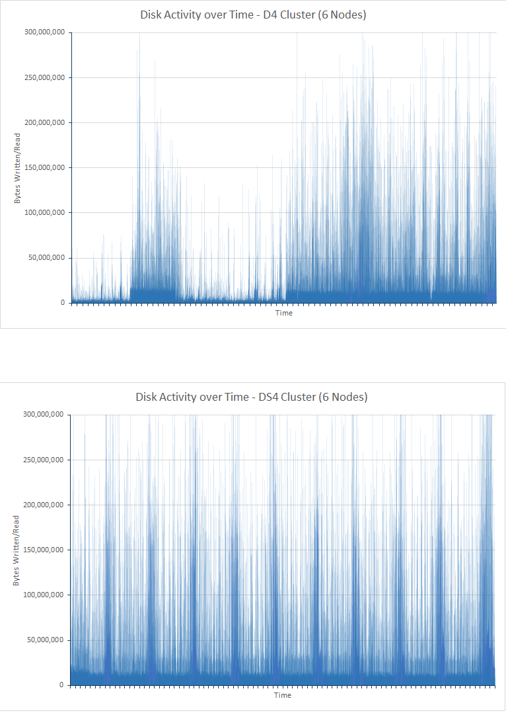
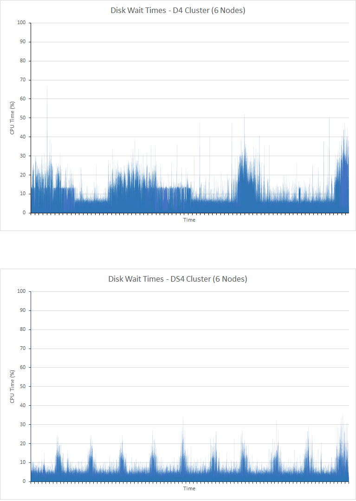
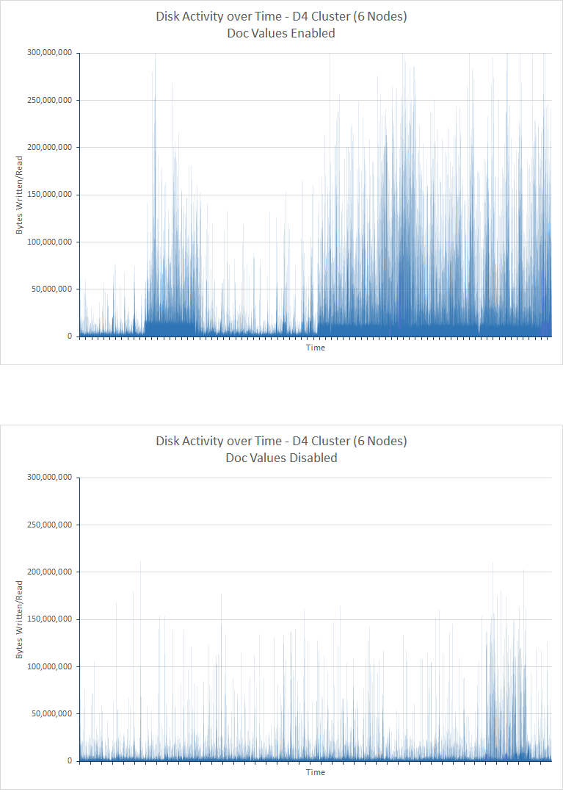
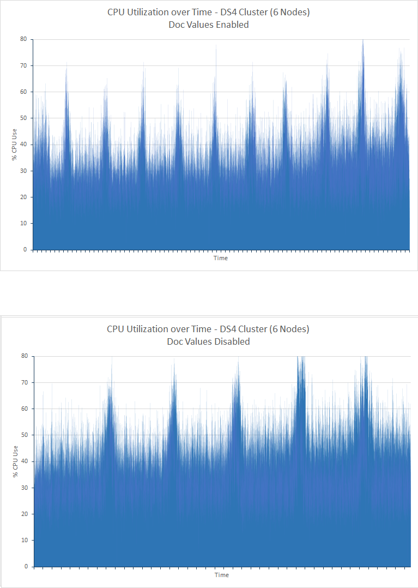
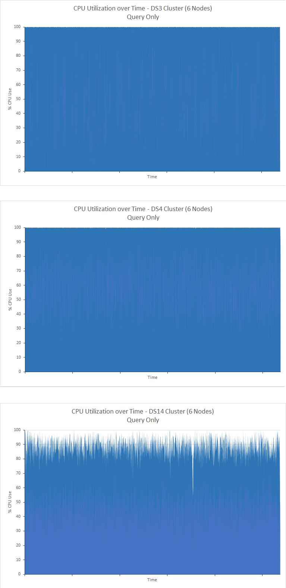

<properties
   pageTitle="Optimieren der Daten Aggregation und Abfrage-Leistung mit Elasticsearch auf Azure | Microsoft Azure"
   description="Eine Zusammenfassung der Aspekte beim Abfragen und Leistung für Elasticsearch zu optimieren."
   services=""
   documentationCenter="na"
   authors="dragon119"
   manager="bennage"
   editor=""
   tags=""/>

<tags
   ms.service="guidance"
   ms.devlang="na"
   ms.topic="article"
   ms.tgt_pltfrm="na"
   ms.workload="na"
   ms.date="09/22/2016"
   ms.author="masashin"/>
   
# <a name="tuning-data-aggregation-and-query-performance-with-elasticsearch-on-azure"></a>Optimieren der Daten Aggregation und Abfrage-Leistung mit Elasticsearch auf Azure

[AZURE.INCLUDE [pnp-header](../../includes/guidance-pnp-header-include.md)]

Dieser Artikel ist [Teil einer Serie](guidance-elasticsearch.md). 

Ein primärer Grund für die Verwendung von Elasticsearch ist zur Unterstützung von Suchbegriffe, durch die Daten. Sollen Benutzer können die Informationen schnell zu finden, die sie suchen. Darüber hinaus muss das System anderer Benutzer Fragen der Daten, Korrelationen anfordern, und hier Schlussfolgerungen, die Business Entscheidungen steuern können. Diese Verarbeitung ist, welche Daten von Informationen unterscheidet.

Dieses Dokument enthält eine Übersicht über die Optionen, die Sie berücksichtigen können, wenn die beste Methode bestimmen Sie Ihrem System für die Abfrage, und suchen Sie Leistung zu optimieren.

Alle Leistung empfohlenen hängen weitgehend die Szenarien, die für Ihre Situation, gelten die Lautstärke der Daten, die Sie indizieren und die Rate, Anwendungen und Benutzer Abfragen von Daten. Sie sollten die Ergebnisse der Änderungen sorgfältig in Konfiguration oder Indizierung Struktur verwenden Ihre eigenen Daten und Auslastung zur Bewertung der Vorteile der bestimmten Szenarien testen. Zu diesem Zweck beschreibt dieses Dokument auch eine Reihe von Benchmarks, die für ein bestimmtes Szenario mit unterschiedlichen Konfigurationen implementiert durchgeführt wurden. Sie können Ansatz zur Bewertung der Leistung Ihrer eigenen Systeme anpassen. Die Details dieser Tests werden in der [Anlage](#appendix-the-query-and-aggregation-performance-test)beschrieben.

## <a name="index-and-query-performance-considerations"></a>Index und Abfrage Leistungsaspekte

In diesem Abschnitt werden einige allgemeinen Faktoren, die Sie vorstellen, sollten über beim Entwerfen, die Unterstützung für schnelle Abfragen und suchen müssen indiziert.

### <a name="storing-multiple-types-in-an-index"></a>Speichern mehrere Typen in einem index

Ein Index Elasticsearch kann mehrere Typen enthalten. Es empfiehlt sich möglicherweise vermeiden dieser Ansatz und erstellen einen Index für jeden Typ. Beachten Sie die folgenden Punkte:

- Verschiedene Typen möglicherweise andere Analyzern anzugeben, und es ist nicht immer klar welche Analyzer Elasticsearch verwenden soll, wenn eine Abfrage durchgeführt werden auf der Indexebene statt Ebene der Typ. Details finden Sie unter [Typ Tricks zu vermeiden](https://www.elastic.co/guide/en/elasticsearch/guide/current/mapping.html#_avoiding_type_gotchas) .

- Mehrere Shards hinweg für Indizes, die mehrere Arten halten werden wahrscheinlich größer als die Indizes sein, die einen einzelnen Typ enthalten. Das Vergrößern eines Shard, die mehr Aufwand ist Elasticsearch zum Filtern von Daten erforderlich beim Ausführen von Abfragen.

- Ist es eine signifikante Nichtübereinstimmung zwischen Datenbestände für die Typen, kann Informationen für ein bestimmtes spärlich verteilt werden viele mehrere Shards hinweg die Effizienz der Suchbegriffe, die diese Daten abrufen verringert.

    

    ***Die Auswirkungen der Freigabe eines Indexes zwischen Typen*** 

    Im oberen Bereich des Diagramms wird von Dokumenten des Typs A und b Typ der gleiche Index gemeinsam verwendet. Es gibt viele weitere Dokumente vom Typ A als Typ b sucht Typ eine wird beinhaltet die Abfrage alle vier mehrere Shards hinweg. Im unteren Bereich des Diagramms zeigt den Effekt, wenn separate Indizes für jedes Typs erstellt werden. In diesem Fall erfordern sucht Typ eine wird nur den Zugriff auf zwei mehrere Shards hinweg.

- Kleine mehrere Shards hinweg können als große mehrere Shards hinweg, denen es einfacher für Elasticsearch, um die Last auf Knoten ausdehnen gleichmäßiger verteilt werden.

- Möglicherweise müssen Sie verschiedene Typen unterschiedliche Aufbewahrungsrichtlinien Perioden zu Zahlen ist. Es kann schwierig sein, alte Daten archivieren, die mehrere Shards hinweg für aktive Daten freigibt.


Klicken Sie unter bestimmten Umständen Freigabe eines Indexes verschiedene Typen kann jedoch effizient ist:

- Suchvorgänge Intervalls regelmäßig Arten frei, die im selben Index.

- Die Typen müssen nur eine geringe Anzahl von Dokumenten, die jeder. Verwalten einer separaten Gruppe von mehrere Shards hinweg für jeden Typ kann ein erheblichen Aufwand in diesem Fall werden.


### <a name="optimizing-index-types"></a>Optimieren von Indextypen

Ein Index Elasticsearch enthält eine Kopie der ursprünglichen JSON-Dokumente, die verwendet wurden, um es zu füllen. Diese Information ist enthalten, der [* \_Quelle*](https://www.elastic.co/guide/en/elasticsearch/reference/current/mapping-source-field.html#mapping-source-field) Feld der einzelnen indizierte Elemente. Diese Daten ist nicht durchsucht, aber standardmäßig zurückgegebene *erhalten* , und *Suchen Sie* Besprechungsanfragen. Dieses Feld wird jedoch budgetgerecht Verwaltungsaufwand und belegt Speicher, mehrere Shards hinweg zu vergrößern, und erhöhen die Lautstärke der e/a ausgeführt. Sie können Deaktivieren der * \_Quelle* Feld auf Basis pro Typ:

```http
PUT my_index
{
  "mappings": {
    "my_type": {
      "_source": {
        "enabled": false
      }
    }
  }
}
```
Deaktivieren dieses Feld entfernt auch die Möglichkeit, die folgenden Vorgänge ausführen:

- Aktualisieren von Daten in den Index mithilfe der *Aktualisieren* API.

- Suche, die hervorgehobene Daten zurückgeben.

- Neu aus einem Elasticsearch Index direkt auf eine andere rekonstruieren.

- Ändern von Zuordnungen oder Analysis-Einstellungen.

- Anzeigen des ursprünglichen Dokuments Debuggen Abfragen.


### <a name="reindexing-data"></a>Vollständige Daten

Die Anzahl der mehrere Shards hinweg eines Indexes zur Verfügung bestimmt schließlich die Kapazität des Indexes. Sie können die erforderlichen eine Schätzung initial (und laufenden) wie viele mehrere Shards hinweg ausgeführt werden müssen, aber sollten Sie Ihr Dokument erneute Indizierung Strategie Vorfeld immer. In vielen Fällen neu rekonstruieren-vorgesehenen Aufgabe möglicherweise mit zunehmender Datenmenge. Sie sollten nicht reservieren einer großen Anzahl mehrere Shards hinweg, um einen Index zu Beginn aus Gründen der suchmaschinenoptimierung, aber neue mehrere Shards hinweg zugewiesen werden, wie die Menge der Daten erweitert. In anderen Fällen müssen neu rekonstruieren auf Weitere Ad-hoc-Basis ausgeführt werden, wenn Ihre schätzt über Volume Wachstum einfach Beweisen nicht zuverlässig.

> [AZURE.NOTE] Neu rekonstruieren nicht für Daten möglicherweise erforderlich, die im schnell Alter. In diesem Fall möglicherweise eine Anwendung einen neuen Index für jeden Zeitraum erstellen. Beispiele für Performance-Protokolle enthalten oder audit-Daten, die in einem frisch Index jeden Tag gespeichert werden kann.

<!-- -->

Effektiv Dies umfasst, erstellen einen neuen Index aus den Daten in einer alten Schablone, und dann den alten Index zu entfernen. Wenn Sie ein Index groß ist, dieses Verfahren kann Zeit in Anspruch nehmen, und möglicherweise müssen Sie sicherstellen, dass die Daten in diesem Zeitraum durchsuchbare bleiben. Daher sollten Sie ein [Alias für jeden Index](https://www.elastic.co/guide/en/elasticsearch/reference/current/indices-aliases.html)erstellen und Abfragen sollte Abrufen von Daten über diese Aliase. Während der neu rekonstruieren, behalten Sie den Alias, zeigen Sie auf den alten Index bei, und wechseln Sie dann darauf, um den neuen Index verwiesen wird, wenn dies abgeschlossen ist. Dieser Ansatz eignet sich auch für den Zugriff auf einen neuen Index jeden Tag erstellten zeitbasierte Daten. Verwenden Sie zum Zugreifen auf des aktuelle Daten einen Alias, der den neuen Index übernommen, wie sie erstellt wurde.

### <a name="managing-mappings"></a>Verwalten von Zuordnungen

Elasticsearch verwendet Zuordnungen um zu ermitteln, wie die Daten interpretiert, die in jedes Feld in einem Dokument auftritt. Jeder verfügt über eine eigene Zuordnung, die ein Schema für diesen Typ effektiv definiert. Anhand dieser Informationen Elasticsearch invertierte Indizes für jedes Feld in den Dokumenten in einem Typ generieren. In allen Dokumenten hat jedes Feld Datentyp (z. B. *Zeichenfolge*, *Datum*oder *langen*) und einen Wert. Sie können die Zuordnungen für einen Index angeben, beim erstmaligen des Indexes Erstellung oder können durch Elasticsearch abgeleitet werden, wenn neue Dokumente in einen Typ hinzugefügt werden. Berücksichtigen Sie jedoch die folgenden Punkte:

- Dynamisch generierte Zuordnungen können dazu führen, dass Fehler, je nachdem, wie die Felder interpretiert werden, wenn Dokumente eines Indexes hinzugefügt werden. Beispielsweise Dokument 1 konnte ein Feld ein, der eine Zahl enthalten und Ursachen Elasticsearch zum Hinzufügen einer Zuordnung, die angibt, in diesem Feld wird eine *lange*. Wenn in einem Dokument nachfolgende hinzugefügt wird welches Feld A enthält nicht numerische Daten, und dann kann nicht ausgeführt werden. In diesem Fall sollte Feld A wahrscheinlich als Zeichenfolge interpretiert worden sein, wenn das erste Dokument hinzugefügt wurde. Diese Zuordnung angeben, wenn der Index erstellt wird, kann um solche Probleme zu helfen.

- Entwerfen Sie Ihre Dokumente, um zu vermeiden, sehr große Zuordnungen generieren, da dies erheblichen Aufwand beim Suchvorgänge durch zusätzlichen, viel Speicher nutzen und auch dazu führen, Abfragen dass treten nach Daten zu suchen. Treffen Sie eine einheitliche Benennungskonvention für Felder in Dokumenten, die denselben Typ gemeinsam nutzen. Beispielsweise verwenden Sie nicht Feldnamen wie "Vorname", "Vorname" und "Vorname" in anderen Dokumenten. Verwenden Sie den gleichen Feldnamen in jedem Dokument ein. Darüber hinaus führen Sie Werte als Schlüssel verwenden (Dies ist ein gemeinsames Konzept in Spalte-Familie Datenbanken, aber kann dazu führen, dass Effizienz und Fehlern mit Elasticsearch.) Weitere Informationen finden Sie unter [Zuordnung Explosion](https://www.elastic.co/blog/found-crash-elasticsearch#mapping-explosion).

- Verwenden Sie *Not_analyzed* Tokenvorgang gegebenenfalls zu vermeiden. Beispielsweise, wenn ein Dokument als Zeichenfolgenfeld *Daten* , die den Wert "ABC-Qualität" enthält enthält möglicherweise dann versuchen, eine Suche nach allen Dokumenten durchführen, die diesen Wert wie folgt entsprechen:

  ```http
  GET /myindex/mydata/_search
  {
    "query" : {
      "filtered" : {
        "filter" : {
          "term" : {
            "data" : "ABC-DEF"
          }
        }
      }
    }
  }
  ```

 Diese Suche tritt jedoch die erwarteten Ergebnisse aufgrund der Art zurück, in dem die Zeichenfolge ABC-Qualität Token ist, wenn es indiziert ist. Es wird effektiv zwei Token, ABC und Qualität, durch einen Bindestrich aufgeteilt werden soll. Diese Funktion dient zur Unterstützung von vollständigen Text suchen, aber Sie bei Bedarf die Zeichenfolge, die als ein einzelnes atomare Element interpretiert werden sollten Sie Tokenvorgang deaktivieren, wenn das Dokument auf den Index hinzugefügt wird. Sie können eine Zuordnung wie folgt verwenden:

  ```http
  PUT /myindex
  {
    "mappings" : {
      "mydata" : {
        "properties" : {
          "data" : {
            "type" : "string",
            "index" : "not_analyzed"
          }
        }
      }
    }
  }
  ```

  Weitere Informationen finden Sie unter [Suchen genauen Werte](https://www.elastic.co/guide/en/elasticsearch/guide/current/_finding_exact_values.html#_term_filter_with_text).


### <a name="using-doc-values"></a>Verwenden von Doc-Werte

Viele Abfragen und Aggregationen erfordern, dass die Daten als Teil des Suchvorgangs sortiert sind. Sortieren benötigt wird, eine Liste der Dokumente ein oder mehrere Ausdrücke zuzuordnen. Wenn Sie diesen Prozess unterstützen, kann Elasticsearch aller Werte für ein Feld, das als Schlüssel für die Sortierung verwendet wird, in den Speicher laden. Diese Informationen werden als *Fielddata*bezeichnet. Der Zweck besteht darin, dass Fielddata im Arbeitsspeicher Zwischenspeichern weniger e/a budgetgerecht und möglicherweise schneller als wiederholt dieselben Daten von einem Datenträger lesen. Wenn Sie ein Feld verfügt kann hohe Kardinalität Speichern von der Fielddata klicken Sie dann im Speicher zahlreiche Heapspeicher, möglicherweise auch die Möglichkeit, die andere gleichzeitige Vorgänge beeinträchtigen oder sogar verbraucht Speicher verursacht Elasticsearch zum Fehlschlagen nutzen.

Als eine weitere Möglichkeit unterstützt Elasticsearch auch *Doc-Werte*. Ein Dokument Wert ähnelt ein Element des Fielddata im Speicher mit dem Unterschied, dass es auf einem Datenträger gespeichert und erstellt, wenn die Daten in einem Index gespeichert werden (Fielddata wird dynamisch erstellt, wenn eine Abfrage ausgeführt wird.) Doc Werte belegen keine Heapspeicher und daher eignen sich für Abfragen, Sortier- oder Aggregieren von Daten über, die Felder eine große Anzahl eindeutiger Werte enthalten können. Darüber hinaus kann die Vakuum auf dem Heap dazu beitragen versetzt die Leistungsunterschiede Abrufen von Daten aus dem Datenträger und aus dem Speicher lesen. Handelt es sich um ein wahrscheinlich nicht so häufig auf dabei, und andere gleichzeitige Vorgänge, die Arbeitsspeicher nutzen sind wahrscheinlich weniger vorzunehmen.

Sie aktivieren oder deaktivieren Dokument Werte pro-Eigenschaft für einen Index, mit dem *Doc_values* -Attribut aus, wie im folgenden Beispiel gezeigt:

```http
PUT /myindex
{
  "mappings" : {
    "mydata" : {
      "properties" : {
        "data" : {
          ...
          "doc_values": true
        }
      }
    }
  }
}
```
> [AZURE.NOTE] Doc-Werte werden mit Elasticsearch Version 2.0.0 oder höher standardmäßig aktiviert.

Die genaue Auswirkung der Verwendung von Dokument-Werte ist wahrscheinlich nicht hochgradig speziell für Ihre eigenen Daten und Abfragen Szenarien, also bereiten Sie sich auf Leistung zu testen, um ihre Nützlichkeit erwirkten durchführen. Beachten Sie auch die Doc, die Werte in Zeichenfolgenfeldern analysierten nicht funktionieren. Weitere Informationen finden Sie unter [Dokument Werte](https://www.elastic.co/guide/en/elasticsearch/guide/current/doc-values.html#doc-values).

### <a name="using-replicas-to-reduce-query-contention"></a>Verwendung von Replikaten Abfrage Konflikte verringern

Eine gemeinsame Strategie zum Steigern der Leistung von Abfragen ist viele Replikate von jedem Index erstellen. Abrufen von Datenoperationen können durch Abrufen von Daten von einer Replikation erfüllt werden. Jedoch kann diese Strategie stark beeinträchtigt die Leistung der Erfassung Datenoperationen, damit er muss mit Vorsicht in Szenarien verwendet werden, die wechselnder Auslastung betreffen. Darüber hinaus ist diese Strategie nur von nutzen, wenn Replikate auf Knoten verteilt werden, und führen Sie keinen Anspruch für Ressourcen mit primären mehrere Shards hinweg, die denselben Index gehören. Denken Sie daran, dass es zum Vergrößern oder verkleinern die Anzahl der Replikate für einen Index dynamisch möglich ist.

### <a name="using-the-shard-request-cache"></a>Verwenden des Shard Anforderung Caches

Elasticsearch kann die lokalen Daten angefordert von Abfragen auf jede Shard im Arbeitsspeicher Zwischenspeichern. Diese ermöglicht Suchbegriffe, die gleichen Datenabfrage schneller ausgeführt, können Daten aus dem Datenträger, sondern Arbeitsspeicher Speicher gelesen werden. Zwischenspeichern von Daten auf diese Weise kann die Leistung von einige Suchvorgänge, aber die anderen gleichzeitig ausgeführten Aufgaben zur Verfügung Arbeitsspeicher verringern daher verbessern. Es gibt auch das Risiko, dass die Daten aus dem Cache bereitgestellt ist veraltet. Die Daten im Cache ungültig ist nur, wenn die Shard aktualisiert wird, und die Daten geändert wurde. Der Wert der Einstellung *Aktualisierungsintervall* des Indexes unterliegt die Häufigkeit von aktualisiert.

Die Anfrage für einen Index Zwischenspeichern ist standardmäßig deaktiviert, aber Sie können es wie folgt aktivieren:

```http
PUT /myindex/_settings
{
  "index.requests.cache.enable": true
}
```

Shard Anforderung Cache wird am besten geeigneten Informationen wie zurückliegenden handelt oder die Protokollierung Daten relativ statisch bleibt.

### <a name="using-client-nodes"></a>Verwenden von Client-Knoten

Alle Abfragen werden von den Knoten verarbeitet, die zuerst die Anforderung empfängt. Dieser Knoten sendet weiteren Anfragen an alle anderen Knoten mehrere Shards hinweg für die Indizes abgefragt wird, enthält, und klicken Sie dann sammelt die Ergebnisse für die Antwort zurückgeben. Wenn eine Abfrage Aggregieren von Daten oder durchführen komplexe Berechnungen, ist der ursprüngliche Knoten zur Durchführung der entsprechenden Verarbeitung verantwortlich ist. Wenn das System zur Unterstützung von relativ wenigen komplexe Abfragen verfügt, erwägen Sie das Erstellen von einem Ressourcenpool des Clients Knoten, die Laden von den Datenknoten zu beheben. Umgekehrt, wenn das System über eine große Anzahl von einfachen Abfragen verarbeitet verfügt, dann senden Sie diese Anfragen direkt an den Datenknoten, und verwenden ein Lastenausgleich, um die Anfragen gleichmäßig verteilen.

### <a name="tuning-queries"></a>Optimieren von Abfragen

Tipps für die Leistung von Elasticsearch Abfragen maximieren Zusammenfassen von die folgenden Punkte:

- Vermeiden Sie Abfragen, die Platzhaltern möglichst betreffen.

- Wenn das gleiche Feld unterliegen den vollständigen Text Such- und genaue Übereinstimmung mit ist, sollten Sie die Daten für das Feld in Formularen analysierten und nonanalyzed speichern. Durchführen von Volltextindex Suchvorgänge in das Feld analysierten und genaue Übereinstimmung mit dem nonanalyzed Feld.

- Nur die Daten, die notwendigen zurückgeben. Wenn Sie große Dokumente haben, aber eine Anwendung nur frei, die in eine Teilmenge der Felder Informationen benötigt, kehren Sie diese Teilmenge von Abfragen statt der gesamten Dokumente zurück. Diese Strategie kann die Anforderungen Netzwerk Bandbreite Cluster verringern.

- Wann immer möglich, verwenden Sie bei der Suche nach Daten Filter anstelle von Abfragen. Ein Filter bestimmt einfach an, ob ein Dokument angegebenen Kriterium entspricht, während eine Abfrage auch wie Schließen eines Dokuments eine Übereinstimmung wird berechnet (Bewertung). Intern, die Werte durch einen Filter generiert werden als Bitmap angibt Übereinstimmung/keine Übereinstimmung für jedes Dokument gespeichert, und sie können nach Elasticsearch zwischengespeichert werden. Gleichen Filterkriterien später auftritt, kann die Bitmap aus dem Cache abgerufen und verwendet, um schnell die passende Dokumente abgerufen werden sollen. Weitere Informationen finden Sie unter [Internen Filtervorgangs](https://www.elastic.co/guide/en/elasticsearch/guide/current/_finding_exact_values.html#_internal_filter_operation).

- Verwenden Sie *Bool* Filter für Vergleiche statischen, und nur *und*, *oder*und *nicht* Filter für dynamisch berechneten Filter, wie die scripting (Variablen) haben oder der *Geo -\* * Filter.

- Wenn eine Abfrage *Bool* Filter *und*, *oder*, kombiniert oder *nicht* mit *Geo -* * Filter, platzieren Sie den *und*/*oder*/*nicht Geo-** Filter die letzten, damit sie den kleinsten Datenmenge möglich ausgeführt werden.

    In ähnlicher Weise, eine *Post_filter* mit teure Filter Vorgänge ausführen. Diese Filter werden zuletzt ausgeführt werden.

- Verwenden von Aggregationen statt Aspekte. Vermeiden Sie die Berechnung der Aggregate, die analysiert werden oder für die Anzahl der möglichen Werte.

    > **Hinweis**: Aspekte in Elasticsearch Version 2.0.0 entfernt wurden.

- Verwenden Sie die Aggregation *Kardinalität* anstelle der Aggregation *Value_count* , wenn die Anwendung einen genauen Wert der übereinstimmenden Elemente erforderlich ist. Ein genauen Wert kann schnell veralten und viele Clientanwendungen nur eine angemessene Annäherung anfordern.

- Vermeiden Sie Skripting. Skripts in Abfragen und Filtern können teure und die Ergebnisse werden nicht zwischengespeichert. Langer Skripts können Suchthreads endlos, bewirken, dass nachfolgende Anforderungen an die in der Warteschlange nutzen. Wenn die Warteschlange voll ist, werden außerdem Anfragen zurückgewiesen.

## <a name="testing-and-analyzing-aggregation-and-search-performance"></a>Testen und Analysieren der Leistung von Aggregation und suchen

In diesem Abschnitt werden die Ergebnisse einer Reihe von Tests, die für unterschiedliche Cluster und Indexkonfigurationen durchgeführt wurden. Zwei Arten von Tests wurden durchgeführt:

- * *Aufnahme *und Abfrage* testen **. Dieser Test Schritte mit einer leeren Index, der ausgefüllt wurde, als die Zeichenfolge des Tests einfügen Massenimport (jedem Vorgang hinzugefügt 1000 Dokumente). Eine Anzahl von Abfragen suchen Dokumente im vorhergehenden 15-minütiges Zeitraum hinzugefügt und Generieren von Aggregationen entwickelt wurden zur gleichen Zeit in Intervallen von 5 Sekunden wiederholt. Dieser Test wurde in der Regel darf 24 Stunden ausführen, um die Auswirkungen eines Herausforderung Arbeitsbelastung, umfasst umfangreiche Daten Aufnahme mit in der Nähe in Echtzeit Abfragen zu reproduzieren.

- **Die *Abfrage nur* **zu testen. Dieser Test ist ähnlich wie die *Aufnahme und Abfrage* testen, außer dass das Webpart Aufnahme nicht angegeben wird, und der Index auf den einzelnen Knoten ist bereits mit 100 Millionen Dokumenten ausgefüllt. Eine geänderte Menge von Abfragen wird ausgeführt. das Dokumente, die in den letzten 15 Minuten hinzugefügten einschränken Time-Element wurde entfernt, wie die Daten nun statische wurde. Die Tests 90 Minuten ausgeführt haben, ist es weniger Zeit erforderlich, um ein Muster Leistung aufgrund der feste Datenmenge festzulegen.

---

Jedes Dokument im Index hat dasselbe Schema. Diese Tabelle enthält eine Übersicht über die Felder im Schema:

Namen                          | Typ         | Notizen |
  ----------------------------- | ------------ | -------------------------------------------------------- |
  Organisation                  | Zeichenfolge      | Der Test generiert 200 eindeutige Organisationen. |
  CustomField1 - CustomField5   |Zeichenfolge       |Hierbei handelt es sich um Felder fünf Zeichenfolge, die auf eine leere Zeichenfolge festgelegt werden.|
  DateTimeRecievedUtc           |Zeitstempel    |Datum und Uhrzeit, an dem das Dokument hinzugefügt wurde.|
  Host                          |Zeichenfolge       |In diesem Feld wird auf eine leere Zeichenfolge festgelegt.|
  HttpMethod                    |Zeichenfolge       |In diesem Feld wird festgelegt, auf einen der folgenden Werte: "Veröffentlichen", "Abrufen", "Setzen".|
  HttpReferrer                  |Zeichenfolge       |In diesem Feld wird auf eine leere Zeichenfolge festgelegt.|
  HttpRequest                   |Zeichenfolge       |In diesem Feld wird mit zufälliger Text zwischen 10 und 200 Zeichen lang aufgefüllt.|
  HttpUserAgent                 |Zeichenfolge       |In diesem Feld wird auf eine leere Zeichenfolge festgelegt.|
  HttpVersion                   |Zeichenfolge       |In diesem Feld wird auf eine leere Zeichenfolge festgelegt.|
  Organisationsname              |Zeichenfolge       |In diesem Feld wird auf den gleichen Wert wie das Feld "Organisation" festgelegt.|
  SourceIp                      |IP           |Dieses Feld enthält eine IP-Adresse "Origin" der Daten angibt. |
   SourceIpAreaCode              |Lange         |In diesem Feld wird auf 0 festgelegt.|
  SourceIpAsnNr                 |Zeichenfolge       |In diesem Feld wird festgelegt, um "AS\#\#\#\#\#".|
  SourceIpBase10                |Lange         |In diesem Feld wird auf 500 festgelegt.|
  SourceIpCountryCode           |Zeichenfolge       |Dieses Feld enthält einen 2 Zeichen bestehende Ländercode. |
  SourceIpCity                  |Zeichenfolge       |Dieses Feld enthält eine Zeichenfolge, die einen Ort in einem Land identifiziert. |
  SourceIpLatitude              |Double       |Dieses Feld enthält einen zufälligen Wert an.|
  SourceIpLongitude             |Double       |Dieses Feld enthält einen zufälligen Wert an.|
  SourceIpMetroCode             |Lange         |In diesem Feld wird auf 0 festgelegt.|
  SourceIpPostalCode            |Zeichenfolge       |In diesem Feld wird auf eine leere Zeichenfolge festgelegt.|
  SourceLatLong                 |Geo Punkt   |In diesem Feld wird eine zufällige Geo Punkt festgelegt.|
  Quellport                    |Zeichenfolge       |Dieses Feld wird mit der Zeichenfolge Darstellung eine Zufallszahl ausgefüllt.|
  TargetIp                      |IP           |Dies ist eine zufällige IP-Adresse im Bereich 0.0.100.100 zu 255.9.100.100 aufgefüllt.|
  SourcedFrom                   |Zeichenfolge       |In diesem Feld wird die Zeichenfolge "MonitoringCollector" festgelegt.|
  TargetPort                    |Zeichenfolge       |Dieses Feld wird mit der Zeichenfolge Darstellung eine Zufallszahl ausgefüllt.|
  Bewertung                        |Zeichenfolge       |Dieses Feld wird mit einem 20 verschiedener Zeichenfolgenwerte zufällig ausgewählten ausgefüllt.|
  UseHumanReadableDateTimes     |Boolesch      |In diesem Feld wird auf falsch festgelegt.|
 
Die folgenden Abfragen wurden als eine Reihe von jeder Iteration der Tests durchgeführt. Die Namen in Kursivschrift dienen diese Abfragen im weiteren Verlauf dieses Dokuments verweisen. Notiz, die auf das Kriterium Zeit (Dokumente, die in den letzten 15 Minuten hinzugefügt) vergessen wurde die *Abfrage nur* Tests:

- Wie viele Dokumente mit den Wert jeder *Bewertung* in den letzten 15 Minuten (*Anzahl von Bewertung*) eingegeben wurden? 

- Wie viele Dokumente während der letzten 15 Minuten (*Anzahl über einen Zeitraum*) in den einzelnen Intervallen 5 Minuten hinzugefügt wurden?

- Wie viele Dokumente jedes Werts *Bewertung* wurden in den letzten 15 Minuten (*Zugriffe nach Land*) für jedes Land hinzugefügt?

- Welche 15 Organisationen auftreten, die meisten häufig in Dokumente, die in den letzten 15 Minuten (*Top 15 Organisationen*) hinzugefügt?

- Wie viele verschiedene Organisationen in Dokumenten, die in den letzten 15 Minuten (*Anzahl der eindeutigen Organisationen*) hinzugefügten ausgeführt?

- Wie viele Dokumente in den letzten 15 Minuten (*Gesamtanzahl der Treffer Count*) hinzugefügt wurden?

- Wie viele verschiedene *SourceIp* Werte in Dokumenten, die in den letzten 15 Minuten (*Anzahl der eindeutigen IP*) hinzugefügten ausgeführt?


Die Definition des Indexes und die Details der Abfragen werden in der [Anlage](#appendix-the-query-and-aggregation-performance-test)beschrieben.

Die Tests wurden zu verstehen, die Auswirkungen der folgenden Variablen entworfen:

- **Datenträgertyp**. Überprüft wurden in einem Cluster 6-Knoten D4 virtueller Computer mithilfe der standardmäßigen Speicher (Festplatten) ausgeführt und wiederholt in einem Cluster 6-Knoten DS4 virtueller Computer Premium Speicher (SSDs) verwenden.

- **Maschinelle Größe - Skalierung nach oben**. Überprüft wurden ausgeführt wird, klicken Sie auf einen Cluster mit 6 Knoten, DS3 virtuellen Computern ( *kleine* Cluster bezeichnet) umfasst, wiederholt in einem Cluster DS4 virtueller Computer ( *Medium* Cluster) und wiederholt erneut auf einem Cluster DS14 Maschinen ( *großen* Cluster). In der folgenden Tabelle werden die Hauptmerkmale von jeder VM SKU zusammengefasst:

 Cluster | VIRTUELLER COMPUTER SKU        | Anzahl der Kerne | Anzahl der Datenträger Daten | RAM (GB) |
---------|---------------|-----------------|----------------------|----------|
 Kleine   | Standard DS3  | 4               | 8                    | 14       |
 Mittel  | Standard-DS4  | 8               | 16                   | 28       |
 Große   | Standard-DS14 | 16              | 32                   | 112      |

- **Größe der Zuordnungseinheiten - Skalierung**. Überprüft wurden für Cluster DS14 virtueller Computer mit 1, 3 und 6 Knoten ausgeführt.

- **Anzahl der Index Replikate**. Tests wurden durchgeführt Indizes mit 1 und 2 Replikate konfiguriert.

- **Dokument-Werte**. Anfangs wurden die Tests mit den Index festlegen *Doc_values* festlegen auf *true* (der Standardwert) ausgeführt werden. Mit *Doc_values* auf *false*festgelegt wurden ausgewählten Tests wiederholt.

- **Zwischenspeichern**. Tests wurden mit dem Shard Anforderung Cache aktiviert wird, klicken Sie auf den Index ausgeführt.

- **Anzahl der mehrere Shards hinweg**. Überprüft wurden wiederholt wechselnder mehrere Shards hinweg verwenden, um festzulegen, ob Abfragen über weniger und größere mehrere Shards hinweg oder weitere, kleinere mehrere Shards hinweg mit Indizes effizienter ausgeführt wurde.


## <a name="performance-results---disk-type"></a>Leistungsergebnisse - Datenträgertyp

Datenträger Leistung wurde durch Ausführen der *Aufnahme und Abfrage* testen, auf dem Cluster 6-Knoten D4 virtueller Computer (mit Festplatten), und klicken Sie auf die Cluster mit 6 Knoten DS4 virtueller Computer (mit SSDs) ausgewertet. Die Konfiguration des Elasticsearch in beide Cluster wurde für das gleiche. Die Daten auf 16 Festplatten auf den einzelnen Knoten, verteilt wurde und jeder Knoten hatten 14GB RAM für Java virtuellen Computern (JVM) ausgeführt Elasticsearch reserviert, wurde der verbleibende Speicher (auch 14GB) für die Verwendung des Betriebssystems gelassen. Jeder Test ausgeführt wurde für 24 Stunden. Dieses Zeitraums wurde aktiviert, die Auswirkungen der steigenden Datenmengen offensichtlich sind und das System konstant zu ermöglichen. Die folgende Tabelle führt die Ergebnisse Hervorhebung der Reaktionszeiten der verschiedenen Vorgänge, die den Test besteht aus.

 Cluster | Abfrage-Vorgang            | Durchschnittliche Antwortzeit (ms) |
---------|----------------------------|----------------------------|
 D4      | Aufnahme                  | 978                        |
         | Anzahl nach Bewertung            | 103                        |
         | Zählen Over Zeit            | 134                        |
         | Zugriffe nach Land            | 199                        |
         | Die besten 15 Organisationen       | 137                        |
         | Anzahl der eindeutigen Organisationen | 139                        |
         | Eindeutige IP-zählen            | 510                        |
         | Zählen der Gesamtanzahl der Treffer           | 89                         |
 DS4     | Aufnahme                  | 511                        |
         | Anzahl nach Bewertung            | 187                        |
         | Zählen Over Zeit            | 411                        |
         | Zugriffe nach Land            | 402                        |
         | Die besten 15 Organisationen       | 307                        |
         | Anzahl der eindeutigen Organisationen | 320                        |
         | Eindeutige IP-zählen            | 841                        |
         | Zählen der Gesamtanzahl der Treffer           | 236                        |

Auf den ersten Blick scheint es, dass der DS4 Cluster Abfragen weniger gut als D4 Cluster, manchmal verdoppelt (oder schlechter) die Antwortzeit ausgeführt. Dies nicht durch den gesamten Textabschnitt informieren. Die folgende Tabelle zeigt die Anzahl der Erfassung Vorgänge ausgeführte Arbeit von jedem Cluster (Denken Sie daran, dass jede Operation 1000 Dokumente lädt):

 Cluster | Die Anzahl der Erfassung Vorgänge |
---------|---------------------------|
 D4      | 264769                    |
 DS4     | 503157                    |

DS4 Cluster konnte fast doppelt so viele Daten als D4 Cluster während der Prüfung zu laden. Daher müssen bei der Analyse der Reaktionszeiten für jeden Vorgang Sie auch berücksichtigen, wie viele Dokumente muss jede Abfrage durchsuchen, und wie viele Dokumente zurückgegeben werden. Hierbei handelt es sich um dynamische Zahlen, wie die Lautstärke der Dokumente im Index ständig größer wird. Sie können nicht einfach Dividieren von 264769 503137 (die Anzahl der Erfassung Operationen jeder Cluster) und Multiplizieren Sie das Ergebnis dann durch die durchschnittliche Antwortzeit für jede Abfrage ausgeführte Arbeit von D4 Cluster eine vergleichende Informationen zu erteilen, wie dies den Betrag der i/o gleichzeitig durch den Vorgang Aufnahme durchgeführt werden ignoriert. Sie sollten stattdessen messen die physische Datenmenge in geschriebenen und von der Festplatte gelesen werden, während der Test fortschreitet. Der JMeter Testplan erfasst werden diese Informationen für die einzelnen Knoten. Die zusammengefassten Ergebnisse sind:

 Cluster | Durchschnittliche Anzahl von Bytes bei jedem Vorgang geschrieben/gelesen |
---------|----------------------------------------------|
 D4      | 13471557                                     |
 DS4     | 24643470                                     |

Diese Daten zeigt, dass der DS4 Cluster einer e/a-Rate ungefähr 1,8 Mal mit D4 Cluster bewältigen konnte. Vorausgesetzt, dass abgesehen von der Art der Datenträger, alle anderen Ressourcen identisch sind, muss der Unterschied aufgrund mit SSDs lieber Festplatten.

Um daraus Blocksatz helfen, die folgenden Diagramme veranschaulichen, die wie die e/a über einen Zeitraum von jedem Cluster ausgeführt wurde:



<!-- -->

***Festplatten-Aktivität für die Cluster D4 und DS4***

Das Diagramm für den Cluster D4 zeigt signifikante Variation, insbesondere während der ersten Hälfte des Tests. Dies wurde wahrscheinlich durch begrenzungsebene, um die e/a-Rate zu verringern. Bei den ersten Schritten des Tests können die Abfragen schnell auszuführen, wie es wenig Daten ist zu analysieren. Der Datenträger im Cluster D4 sind daher wahrscheinlich ausgeführt werden, in der Nähe Clientvorgänge ein-/Ausgabe pro zweiten (IOPS) Kapazität, obwohl jedem e/a-Vorgang nicht viele Daten zurückgeben werden möglicherweise. DS4 Cluster ist eine höhere IOPS Rate unterstützen und im gleiche Maß begrenzungsebene nicht beeinträchtigt werden, die e/a-Sätze werden weitere reguläre. Um diese Theorie unterstützen, anzeigen das nächste Paar der Diagramme an, wie die CPU über einen Zeitraum von Datenträger e/a blockiert wurde (die Datenträger Wartezeiten in den Diagrammen dargestellt werden der Anteil der Zeit, die die CPU warten auf e/a):



***CPU-Datenträger e/a-warten Zeiten für die Cluster D4 und DS4***

Es ist wichtig zu verstehen, dass es zwei überwiegend Gründe für e/a-Vorgänge gibt, die CPU blockieren:

- Das e/a-Subsystem kann lesen oder Schreiben von Daten in den oder aus dem Datenträger werden.

- Das e/a-Subsystem konnte von der Umgebung Host gedrosselt werden. Azure Datenträger mit Festplatten implementiert haben einen maximalen Durchsatz von 500 IOPS und SSDs haben einen maximalen Durchsatz von 5000 IOPS.


Für den Cluster D4 Wartezeit die Zeitdauer für e/a während der ersten Hälfte der Test korreliert eng in invertierte Weise mit dem Diagramm mit der e/a-Sätze. Perioden niedrige e/a entsprechen Perioden signifikante an, die die CPU gesperrten aufwenden, dies weist darauf hin, dass e/a gedrosselt wird. Die Situation Änderungen als weitere Daten zum Cluster hinzugefügt und in der zweiten Hälfte der Test Spitzen in e/a-Wartezeiten Spitzen in Datendurchsatz entsprechen. An diesem Punkt ist die CPU bei der Durchführung real e/a blockiert. Mit dem Cluster DS4 erneut, wird die Wartezeit für e/a viel mehr gerade. Jeder Höchstwert entspricht ein gleichwertiger Höchstwert in e/a-Leistung statt in einem Tiefpunkt, dies bedeutet, dass es ist zu wenig oder gar Drosselung auftritt.

Es gibt einen weiteren Faktor zu berücksichtigen ist. Während der Prüfung generiert D4 Cluster 10584 Aufnahme, und 21 Abfragefehlern. Der Test auf dem Cluster DS4 gefertigt keine Fehler an.

## <a name="performance-results---scaling-up"></a>Leistungsergebnisse - Skalierung nach oben

Skalierung testen wurde durch Ausführen von Tests für Cluster mit 6 Knoten DS3, DS4 und DS14 virtuellen Computern durchgeführt. Diese SKUS wurden ausgewählt, da eines DS4 virtuellen Computers doppelt so viele CPUs und Speicher als eine DS3 bietet und ein Computer DS14 CPU-Ressourcen erneut während der viermal die Speichermenge verdoppelt. In der folgenden Tabelle werden die wichtigsten Aspekte des jede SKU verglichen:

 SKU  | \#CPUs | Speicher (GB) | Max Laufwerks-IOPS | Max-Bandbreite (MB/s)|
------|-------------|-------------|---------------|--------------|
 DS3  | 4           | 14          | 12,800| 128 |
 DS4  | 8           | 28          | 25,600| 256 |
 DS14 | 16          | 112         | 50.000| 512 |

In der folgenden Tabelle werden die Ergebnisse des Ausführens der Tests auf den kleinen (DS3), Mittel (DS4) und Groß (DS14) Cluster zusammengefasst. Jeder virtueller Computer verwendet SSDs, die die Daten enthalten soll. Jeder Test ausgeführt wurde für 24 Stunden.

Die Tabelle Berichte die Anzahl der erfolgreichen Anfragen für jede Art von Abfrage (Fehlern sind nicht eingeschlossen). Die Anzahl der Anfragen zu übermitteln für jede Art von Abfrage ist gleich ungefähr bei einer Ausführung des Tests. Dies ist, da der JMeter Testplan ein einzelnes Vorkommen jeder Abfrage (Anzahl von Bewertung, zählen Over Zeit, Treffer nach Land, Top 15 Organisationen, eindeutige Anzahl Organisationen, Anzahl der eindeutigen IP- und Gesamtzahl Treffer) zusammen in einer einzelnen Einheit bekannt als eine *Transaktion testen führt* (diese Transaktion wird unabhängig von der Aufgabe, die den Erfassung-Vorgang ausführt, die von einem separaten Thread ausgeführt wird). Jeder Iteration des Testplans führt eine einzelne Testtransaktion. Die Anzahl der abgeschlossenen Test Transaktionen ist daher ein Maß für die Anzeigedauer Antwort die langsamste Abfrage in jede Transaktion.

| Cluster      | Abfrage-Vorgang            | Anzahl der Anfragen | Durchschnittliche Antwortzeit (ms) |
|--------------|----------------------------|--------------------|----------------------------|
| KKLEINSTE (DS3)  | Aufnahme                  | 207284             | 3328                       |
|              | Anzahl nach Bewertung            | 18444              | 268                        |
|              | Zählen Over Zeit            | 18444              | 340                        |
|              | Zugriffe nach Land            | 18445              | 404                        |
|              | Die besten 15 Organisationen       | 18439              | 323                        |
|              | Anzahl der eindeutigen Organisationen | 18437              | 338                        |
|              | Eindeutige IP-zählen            | 18442              | 468                        |
|              | Zählen der Gesamtanzahl der Treffer           | 18428              | 294   
|||||
| Mittel (DS4) | Aufnahme                  | 503157             | 511                        |
|              | Anzahl nach Bewertung            | 6958               | 187                        |
|              | Zählen Over Zeit            | 6958               | 411                        |
|              | Zugriffe nach Land            | 6958               | 402                        |
|              | Die besten 15 Organisationen       | 6958               | 307                        |
|              | Anzahl der eindeutigen Organisationen | 6956               | 320                        |
|              | Eindeutige IP-zählen            | 6955               | 841                        |
|              | Zählen der Gesamtanzahl der Treffer           | 6958               | 236                        |
|||||
| Groß (DS14) | Aufnahme                  | 502714             | 511                        |
|              | Anzahl nach Bewertung            | 7041               | 201                        |
|              | Zählen Over Zeit            | 7040               | 298                        |
|              | Zugriffe nach Land            | 7039               | 363                        |
|              | Die besten 15 Organisationen       | 7038               | 244                        |
|              | Anzahl der eindeutigen Organisationen | 7037               | 283                        |
|              | Eindeutige IP-zählen            | 7037               | 681                        |
|              | Zählen der Gesamtanzahl der Treffer           | 7038               | 200                        |

Diese Zahlen anzuzeigen, damit dieser Test, die Leistung von DS4 und DS14 Cluster wurden einigermaßen ähnliche. Die Reaktionszeiten für die Abfragevorgänge für den Cluster DS3 vorne Anfangs vergleichen auch angezeigt werden, und die Anzahl der Abfrageoperationen weit mehr als die Werte für den Cluster DS4 und DS14 ist. Eine sollte aber auch sicherer Benachrichtigung über die Erfassung Zinssatz sowie der infolge Anzahl von Dokumenten durchsuchten nutzen. Im Cluster DS3 Aufnahme weit mehr eingeschränkt ist, und am Ende der Test die Datenbank enthaltenen nur ungefähr 40 % der Dokumente von jedem der anderen beiden Cluster lesen. Dies ist möglicherweise aufgrund der Verarbeitungsressourcen, Netzwerk- und Festplatten Bandbreite eines DS3 virtuellen Computers im Vergleich zu einer DS4 oder DS14 virtueller Computer zur Verfügung. Da eines DS4 virtuellen Computers doppelt so viele Ressourcen als eines DS3 virtuellen Computers verfügbar weist, und eine DS14 zweimal (viermal für Arbeitsspeicher) die Ressourcen eines DS4 virtuellen Computers weist, eine Frage bleibt: Warum die Differenz zwischen den Cluster DS4 und DS14 in Sätzen Aufnahme erheblich kleiner als, ist das zwischen die DS3 und DS4 Cluster auftritt? Dies kann aufgrund der Netzwerkverkehr und die Bandbreite Beschränkungen der Azure-virtuellen Computern sein. Die folgenden Diagramme anzeigen dieser Daten für alle drei Cluster:



**Netzwerk-Auslastung für die Durchführung der Aufnahme und Abfrage testen DS3, DS4 und DS14-Cluster** 

<!-- -->

Die Grenzwerte der verfügbaren Bandbreite mit Azure-virtuellen Computern sind nicht veröffentlicht und können abweichen, aber die Fakultät, die Aktivität Netzwerk scheint in einen Mittelwert von ungefähr 2.75GBps für die beiden DS4 verlangsamte haben und DS14 überprüft wird vorgeschlagen, dass solche maximal erreicht wurde und der primäre Faktor Einschränken des Durchsatz geworden. Bei der Cluster DS3 wurde die Netzwerkaktivität deutlich niedriger, damit die untere Leistung eher aufgrund Nebenbedingungen für die Verfügbarkeit von anderen Ressourcen ist.

Um die Auswirkungen der Erfassung Vorgänge isolieren und veranschaulichen, wie die Leistung von Abfragen als Knoten von skalieren variiert, wurde eine Reihe von Abfrage nur Tests mit denselben Knoten ausgeführt. In der folgenden Tabelle werden die Ergebnisse auf jeden Cluster zusammengefasst:

> [AZURE.NOTE] Sie sollten nicht vergleichen die Leistung und die Anzahl der Anfragen ausgeführt, indem Sie Abfragen in der *Abfrage nur* testen, mit denen vom Test *Aufnahme und Abfrage* ausführen. Dies ist, da die Abfragen geändert wurden und die Lautstärke der betreffenden Dokumente unterscheidet.

| Cluster      | Abfrage-Vorgang            | Anzahl der Anfragen | Durchschnittliche Antwort Ttme (ms) |
|--------------|----------------------------|--------------------|----------------------------|
| KKLEINSTE (DS3)  | Anzahl nach Bewertung            | 464                | 11758                      |
|              | Zählen Over Zeit            | 464                | 14699                      |
|              | Zugriffe nach Land            | 463                | 14075                      |
|              | Die besten 15 Organisationen       | 464                | 11856                      |
|              | Anzahl der eindeutigen Organisationen | 462                | 12314                      |
|              | Eindeutige IP-zählen            | 461                | 19898                      |
|              | Zählen der Gesamtanzahl der Treffer           | 462                | 8882  
|||||
| Mittel (DS4) | Anzahl nach Bewertung            | 1045               | 4489                       |
|              | Zählen Over Zeit            | 1045               | 7292                       |
|              | Zugriffe nach Land            | 1053               | 7564                       |
|              | Die besten 15 Organisationen       | 1055               | 5066                       |
|              | Anzahl der eindeutigen Organisationen | 1051               | 5231                       |
|              | Eindeutige IP-zählen            | 1051               | 9228                       |
|              | Zählen der Gesamtanzahl der Treffer           | 1051               | 2180                       |
|||||
| Groß (DS14) | Anzahl nach Bewertung            | 1842               | 1927                       |
|              | Zählen Over Zeit            | 1839               | 4483                       |
|              | Zugriffe nach Land            | 1838               | 4761                       |
|              | Die besten 15 Organisationen       | 1842               | 2117                       |
|              | Anzahl der eindeutigen Organisationen | 1837               | 2393                       |
|              | Eindeutige IP-zählen            | 1837               | 7159                       |
|              | Zählen der Gesamtanzahl der Treffer           | 1837               | 642                        |

In diesem Fall die Trends bei die durchschnittliche Reaktionszeiten über verschiedene Cluster ist übersichtlicher. Netzwerkverkehr ist deutlich unterhalb der 2.75GBps zuvor erforderlich, durch die DS4 und DS14 Cluster (die wahrscheinlich im Netzwerk in die Aufnahme und Abfrage Tests ausgelastet), und die 1.5GBps für den Cluster DS3. Es ist sogar näher an 200MBps in allen Fällen dargestellt durch die nachfolgenden Diagrammen:



***Netzwerk-Auslastung für die DS3 DS4 und DS14 Cluster Durchführung des Abfrage nur Tests*** 

Die Beschränkung in die Cluster DS3 und DS4 erscheint nun CPU-Auslastung, die für einen Großteil der Zeit nahezu 100 % ist. In der DS14 bildet den Mittelwert Cluster die CPU-Verwendung nur über 80 %. Dies ist immer noch hoch, jedoch klar hervorgehoben Vorteile von gibt es weitere CPUs zur Verfügung. Die folgende Abbildung zeigt die CPU-Verwendungsmuster für die Cluster DS3, DS4 und DS14.



***CPU-Auslastung für die Durchführung des Abfrage nur Tests DS3 und DS14-Cluster*** 

## <a name="performance-results---scaling-out"></a>Leistungsergebnisse - Skalierung

Um zu veranschaulichen, wie das System, mit der Anzahl der Knoten skaliert, wurden Tests mit DS14 Cluster mit 1, 3 und 6 Knoten ausgeführt. Nur dieses Mal der *Abfrage nur* Test ausgeführt wurde, verwenden 100 Millionen Dokumente und 90 Minuten ausführen:

| Cluster | Abfrage-Vorgang            | Anzahl der Anfragen | Durchschnittliche Antwortzeit (ms) |
|---------|----------------------------|--------------------|----------------------------|
| 1 Knoten  | Anzahl nach Bewertung            | 288                | 6216                       |
|         | Zählen Over Zeit            | 288                | 28933                      |
|         | Zugriffe nach Land            | 288                | 29455                      |
|         | Die besten 15 Organisationen       | 288                | 9058                       |
|         | Anzahl der eindeutigen Organisationen | 287                | 19916                      |
|         | Eindeutige IP-zählen            | 284                | 54203                      |
|         | Zählen der Gesamtanzahl der Treffer           | 287                | 3333                       |
|||||
| 3 Knoten | Anzahl nach Bewertung            | 1194               | 3427                       |
|         | Zählen Over Zeit            | 1194               | 5381                       |
|         | Zugriffe nach Land            | 1191               | 6840                       |
|         | Die besten 15 Organisationen       | 1196               | 3819                       |
|         | Anzahl der eindeutigen Organisationen | 1190               | 2938                       |
|         | Eindeutige IP-zählen            | 1189               | 12516                      |
|         | Zählen der Gesamtanzahl der Treffer           | 1191               | 1272                       |
|||||
| 6 Knoten | Anzahl nach Bewertung            | 1842               | 1927                       |
|         | Zählen Over Zeit            | 1839               | 4483                       |
|         | Zugriffe nach Land            | 1838               | 4761                       |
|         | Die besten 15 Organisationen       | 1842               | 2117                       |
|         | Anzahl der eindeutigen Organisationen | 1837               | 2393                       |
|         | Eindeutige IP-zählen            | 1837               | 7159                       |
|         | Zählen der Gesamtanzahl der Treffer           | 1837               | 642                        |

Die Anzahl der Knoten macht eine deutliche Abweichung der Abfrage bei der Cluster, obwohl eine nichtlinear Weise. Der Cluster mit 3 Knoten schließt ungefähr 4 dreimal so viele Abfragen als Cluster mit den einzelnen Knoten ab, während der Cluster mit 6 Knoten 6 Zeiten so viele behandelt. Um Hilfe erläutert, dass sich diese, anzeigen die folgenden Diagramme an, wie die CPU durch die drei Cluster belegt wurde:


***CPU-Auslastung für die 1, 3 und Ausführen des Abfrage nur Tests-Cluster mit 6 Knoten***

Zuordnungseinheiten Single und 3-Knoten sind CPU-gebundene, während zwar CPU-Auslastung hoch im Cluster 6-Knoten ist es freie Verarbeitungskapazität steht. In diesem Fall sind Faktoren wahrscheinlich den Durchsatz eingeschränkt werden. Dies kann durch Tests mit 9 und 12-Knoten wahrscheinlich Weitere freie Verarbeitungskapazität Anzeigen der bestätigt werden.

Die Daten in der obigen Tabelle wird aufgezeigt, wie die durchschnittliche Reaktionszeiten für die Abfragen variieren. Dies ist das Element, das beim Testen, wie ein System für bestimmte Typen von Abfrage skaliert am häufigsten informativen ist. Einige Suchbegriffe sind klar wesentlich effizienter, wenn mehr Knoten als andere, dauern. Dies wird möglicherweise durch das Verhältnis zwischen der Anzahl der Knoten und die Anzahl der Dokumente in den Cluster zunehmender, jeder Cluster enthaltenen 100 Millionen Dokumente. Wenn Sie Suchvorgänge durchführen, die betreffen Aggregieren von Daten, Elasticsearch verarbeitet und die Daten als Teil des Prozesses Aggregation im Speicher auf den einzelnen Knoten abgerufen. Wenn Knoten mehr vorhanden sind, ist es weniger Daten zum Abrufen, Puffer, und auf den einzelnen Knoten verarbeiten.

## <a name="performance-results---number-of-replicas"></a>Leistungsergebnisse - Anzahl der Replikate

Die *Aufnahme und Abfrage* überprüft wurden für einen Index mit einem einzelnen Replikat ausführen. Klicken Sie auf die 6-Knoten DS4 und DS14 Cluster mithilfe eines Indexes mit zwei Replikaten konfiguriert wurden die Tests wiederholt. Alle Tests ist für 24 Stunden. In der nachfolgenden Tabelle zeigt die komparativen Ergebnisse für einen und zwei Replikate:

| Cluster | Abfrage-Vorgang            | Durchschnittliche Antwortzeit (ms) - 1 Replikat | Durchschnittliche Antwortzeit (ms) – 2 Replikate | % Differenz Antwort Zeitpunkt |
|---------|----------------------------|----------------------------------------|-----------------------------------------|-------------------------------|
| DS4     | Aufnahme                  | 511                                    | 655                                     | + 28 %                          |
|         | Anzahl nach Bewertung            | 187                                    | 168                                     | -10 %                          |
|         | Zählen Over Zeit            | 411                                    | 309                                     | -25 %                          |
|         | Zugriffe nach Land            | 402                                    | 562                                     | + 40 %                          |
|         | Die besten 15 Organisationen       | 307                                    | 366                                     | + 19 %                          |
|         | Anzahl der eindeutigen Organisationen | 320                                    | 378                                     | + 18 %                          |
|         | Eindeutige IP-zählen            | 841                                    | 987                                     | + 17 %                          |
|         | Zählen der Gesamtanzahl der Treffer           | 236                                    | 236                                     | + 0 %                           |
||||||
| DS14    | Aufnahme                  | 511                                    | 618                                     | + 21 %                          |
|         | Anzahl nach Bewertung            | 201                                    | 275                                     | + 37 %                          |
|         | Zählen Over Zeit            | 298                                    | 466                                     | + 56 %                          |
|         | Zugriffe nach Land            | 363                                    | 529                                     | + 46 %                          |
|         | Die besten 15 Organisationen       | 244                                    | 407                                     | + 67 %                          |
|         | Anzahl der eindeutigen Organisationen | 283                                    | 403                                     | + 42 %                          |
|         | Eindeutige IP-zählen            | 681                                    | 823                                     | + 21 %                          |
|         | Zählen der Gesamtanzahl der Treffer           | 200                                    | 221                                     | + 11 %                          |

Die Erfassung Rate geringere als die Anzahl der Replikationen erhöht. Dies sollten Sie berücksichtigen, wie Elasticsearch mehr Kopien der jedes Dokument, schreiben ist zusätzliche Datenträger e/a generieren.  Dies wird durch die Diagramme für den Cluster DS14 für Indizes mit 1 und 2 Replikaten in der nachstehenden Abbildung gezeigt wiedergegeben. Bei den Index mit 1 Replikat wurde die durchschnittliche e/a-Rate 16896573 Bytes/Sekunde. Für den Index mit 2 Replikaten wurde die durchschnittliche e/a-Rate nur über doppelt so viele 33986843 Bytes/Sekunde.


***E/a-Sätzen für Knoten mit 1 und 2 Replikaten Durchführung der Aufnahme und Abfrage testen***

| Cluster | Abfrage                      | Durchschnittliche Antwortzeit (ms) - 1 Replikat | Durchschnittliche Antwortzeit (ms) – 2 Replikate |
|---------|----------------------------|----------------------------------------|-----------------------------------------|
| DS4     | Anzahl nach Bewertung            | 4489                                   | 4079                                    |
|         | Zählen Over Zeit            | 7292                                   | 6697                                    |
|         | Zugriffe nach Land            | 7564                                   | 7173                                    |
|         | Die besten 15 Organisationen       | 5066                                   | 4650                                    |
|         | Anzahl der eindeutigen Organisationen | 5231                                   | 4691                                    |
|         | Eindeutige IP-zählen            | 9228                                   | 8752                                    |
|         | Zählen der Gesamtanzahl der Treffer           | 2180                                   | 1909                                    |
|||||
| DS14    | Anzahl nach Bewertung            | 1927                                   | 2330                                    |
|         | Zählen Over Zeit            | 4483                                   | 4381                                    |
|         | Zugriffe nach Land            | 4761                                   | 5341                                    |
|         | Die besten 15 Organisationen       | 2117                                   | 2560                                    |
|         | Anzahl der eindeutigen Organisationen | 2393                                   | 2546                                    |
|         | Eindeutige IP-zählen            | 7159                                   | 7048                                    |
|         | Zählen der Gesamtanzahl der Treffer           | 642                                    | 708                                     |

Diese Ergebnisse zeigen eine Verbesserung in Mittelwert Antwortzeit für den DS4 Cluster, jedoch eine Erhöhung für den Cluster DS14. Wenn Sie Hilfe bei der Interpretation dieser Ergebnisse, sollten Sie auch die Anzahl der Abfragen, die durch jeden Test ausgeführt:

| Cluster | Abfrage                      | Anzahl abgeschlossener - 1 Replikat | Anzahl abgeschlossener - 2 Replikate |
|---------|----------------------------|------------------------------|-------------------------------|
| DS4     | Anzahl nach Bewertung            | 1054                         | 1141                          |
|         | Zählen Over Zeit            | 1054                         | 1139                          |
|         | Zugriffe nach Land            | 1053                         | 1138                          |
|         | Die besten 15 Organisationen       | 1055                         | 1141                          |
|         | Anzahl der eindeutigen Organisationen | 1051                         | 1136                          |
|         | Eindeutige IP-zählen            | 1051                         | 1135                          |
|         | Zählen der Gesamtanzahl der Treffer           | 1051                         | 1136                          |
|||||
| DS14    | Anzahl nach Bewertung            | 1842                         | 1718                          |
|         | Zählen Over Zeit            | 1839                         | 1716                          |
|         | Zugriffe nach Land            | 1838                         | 1714                          |
|         | Die besten 15 Organisationen       | 1842                         | 1718                          |
|         | Anzahl der eindeutigen Organisationen | 1837                         | 1712                          |
|         | Eindeutige IP-zählen            | 1837                         | 1712                          |
|         | Zählen der Gesamtanzahl der Treffer           | 1837                         | 1712                          |

Diese Daten zeigt, dass die Anzahl der Abfragen ausgeführt, von dem DS4 Cluster in Übereinstimmung mit der Rückgang durchschnittliche Reaktionszeiten erhöht, jedoch erneut die Umkehrung der Cluster DS14 wahr ist. Eine, die wesentlichen besteht darin, dass die CPU-Auslastung des der DS4 in die Tests Replikat-1 und 2-Kopie cluster wurde ungleichmäßig verteilt. Einige Knoten ausgestellt ähnlich Auslastung von 100 %, während andere freie Verarbeitungskapazität hatte. Die Verbesserung der Leistung hängt wahrscheinlich die höhere Möglichkeit zum Verteilen von Verarbeitung auf den Knoten im Cluster. Die folgende Abbildung zeigt die Variante in CPU Verarbeitung zwischen den am häufigsten leicht und häufig verwendeten virtuellen Computern (Knoten 4 und 3):


***CPU-Auslastung für die wenigsten verwendeten und am häufigsten verwendeten Knoten im Cluster DS4 Durchführung des Abfrage nur Tests***

Für den Cluster DS14 war dies nicht der Fall. CPU-Auslastung für beide Tests auf allen Knoten unteren wurde, und die Verfügbarkeit von eine zweite Replikation geworden ist kleiner ein Vorteil und mehrere als Aufwand:


***CPU-Auslastung für die wenigsten verwendeten und am häufigsten verwendeten Knoten im Cluster DS14 Durchführung des Abfrage nur Tests***

Diese Ergebnisse zeigen die Ihrem System sorgfältig analysieren, bei der Entscheidung, ob Sie mehrere Replikate verwenden müssen. Sie sollten mindestens eine Kopie jeder Index (es sei denn, Sie bereit sind, verlieren Daten aus, wenn ein Knoten nicht enttäuschen) immer haben, aber zusätzliche Replikate können eine Belastung für das System für kleine Vorteil, abhängig von Ihrer Auslastung und die Hardware-Ressourcen für den Cluster verfügbar vorgangseinschränkung.

## <a name="performance-results---doc-values"></a>Leistungsergebnisse - Dokument Werte

Die *Aufnahme und Abfrage* Tests wurden mit Doc, Werte aktiviert, wodurch Elasticsearch zum Speichern von Daten für die Felder auf dem Datenträger Sortierung verwendeten ausgeführt. Die Tests wurden mit Doc-Werten deaktiviert ist, damit Elasticsearch Fielddata dynamisch erstellt, und es im Speicher zwischengespeichert wiederholt. Alle Tests ist für 24 Stunden. In der nachfolgenden Tabelle vergleicht die Reaktionszeiten für Tests führen für Cluster mit 6 Knoten mit D4, DS4 und DS14 virtuellen Computern (D4 Cluster verwendet reguläre Festplatten, während die Cluster DS4 und DS14 SSDs verwenden) erstellt.

| Cluster | Abfrage-Vorgang            | Durchschnittliche Antwortzeit (ms) - Dokument Werte aktiviert | Durchschnittliche Antwortzeit (ms) - Dokument Werte deaktiviert | % Differenz Antwort Zeitpunkt |
|---------|----------------------------|-------------------------------------------------|--------------------------------------------------|-------------------------------|
| D4      | Aufnahme                  | 978                                             | 835                                              | -15 %                          |
|         | Anzahl nach Bewertung            | 103                                             | 132                                              | + 28 %                          |
|         | Zählen Over Zeit            | 134                                             | 189                                              | + 41 %                          |
|         | Zugriffe nach Land            | 199                                             | 259                                              | + 30 %                          |
|         | Die besten 15 Organisationen       | 137                                             | 184                                              | + 34 %                          |
|         | Anzahl der eindeutigen Organisationen | 139                                             | 197                                              | + 42 %                          |
|         | Eindeutige IP-zählen            | 510                                             | 604                                              | + 18 %                          |
|         | Zählen der Gesamtanzahl der Treffer           | 89                                              | 134                                              | + 51 %                          |
||||||
| DS4     | Aufnahme                  | 511                                             | 581                                              | + 14 %                          |
|         | Anzahl nach Bewertung            | 187                                             | 190                                              | + 2 %                           |
|         | Zählen Over Zeit            | 411                                             | 409                                              | -0,5 %                         |
|         | Zugriffe nach Land            | 402                                             | 414                                              | + 3 %                           |
|         | Die besten 15 Organisationen       | 307                                             | 284                                              | -% 7                           |
|         | Anzahl der eindeutigen Organisationen | 320                                             | 313                                              | -2 %                           |
|         | Eindeutige IP-zählen            | 841                                             | 955                                              | + 14 %                          |
|         | Zählen der Gesamtanzahl der Treffer           | 236                                             | 281                                              | + 19 %                          |
||||||
| DS14    | Aufnahme                  | 511                                             | 571                                              | + 12 %                          |
|         | Anzahl nach Bewertung            | 201                                             | 232                                              | + 15 %                          |
|         | Zählen Over Zeit            | 298                                             | 341                                              | + 14 %                          |
|         | Zugriffe nach Land            | 363                                             | 457                                              | + 26 %                          |
|         | Die besten 15 Organisationen       | 244                                             | 338                                              | + 39 %                          |
|         | Anzahl der eindeutigen Organisationen | 283                                             | 350                                              | + 24 %                          |
|         | Eindeutige IP-zählen            | 681                                             | 909                                              | + 33 %                          |
|         | Zählen der Gesamtanzahl der Treffer           | 200                                             | 245                                              | + 23 %                          |

Die nächste Tabelle vergleicht die Anzahl der Erfassung Operationen die Tests durch:

| Cluster | Anzahl der Erfassung Vorgänge - Dokument Werte aktiviert | Anzahl der Erfassung Vorgänge - Werte Dokument deaktiviert | % Differenz in \number Aufnahme Vorgänge |
|---------|----------------------------------------------|-----------------------------------------------|-----------------------------------------|
| D4      | 264769                                       | 408690                                        | + 54 %                                    |
| DS4     | 503137                                       | 578237                                        | + 15 %                                    |
| DS14    | 502714                                       | 586472                                        | + 17 %                                    |

Die verbesserte Aufnahme Sätzen auftreten mit Dokument Werte deaktiviert, da weniger Daten wie Dokumente eingefügt werden auf den Datenträger geschrieben werden. Verbesserte Leistung tritt besonders mit den D4 virtuellen Computer Festplatten zum Speichern von Daten verwenden. In diesem Fall die Antwortzeit für Aufnahme Vorgänge auch geringere mit 15 % (siehe die erste Tabelle in diesem Abschnitt). Dies konnte aufgrund der Vakuum auf die Festplatten der wahrscheinlich wurden während der Ausführung möglichst ähnlich ihre IOPS Grenzen im Test Dokument Werte aktiviert ist, finden Sie unter den Datenträgertyp-Test für Weitere Informationen. Das folgende Diagramm vergleicht die e/a-Leistung der D4 virtueller Computer mit Doc-Werten aktiviert (Werte frei, die auf dem Datenträger) und Doc Werte deaktiviert (Werte im Speicher festgehalten):


***Festplatten-Aktivität für den Cluster D4 mit Werten Dokument aktiviert und deaktiviert***

Die Erfassung Werte für die virtuelle Computer mithilfe von SSDs anzeigen hingegen vergrößert sich die die Anzahl der Dokumente, sondern auch eine Erhöhung der Antwort Zeitpunkt der Erfassung Vorgänge an. Mit einem oder zwei kleine Ausnahmen wurden die Reaktionszeiten Abfrage auch schlechter. Die SSDs sind weniger wahrscheinlich eine Verbindung mit Doc-Werten aktiviert, in der Nähe ihre Grenzen IOPS ausgeführt werden, damit die Änderungen Leistungsabfall aufgrund von eher erhöht werden Verarbeitung Aktivität und den Verwaltungsaufwand für die Verwaltung des JVM Heaps. Dies fällt durch Vergleich der CPU-Auslastung mit Doc-Werten aktiviert und deaktiviert. Im nächste Diagramm hervorgehoben diese Daten für den DS4 Cluster, die Stelle, an der meisten die CPU-Auslastung aus der 30-40 % Band mit verschoben Doc-Werte aktiviert ist, in das 40-50 % Band mit deaktiviert Doc-Werten (DS14 Cluster hat einen ähnlichen Trend gezeigt):


***CPU-Auslastung für den DS4 Cluster mit Werten Dokument aktiviert und deaktiviert***

Wenn Sie die Effekte Doc-Werte für die Leistung von Abfragen von Daten Aufnahme unterscheiden zu können, wurden Paare von Abfrage nur Tests für die Cluster DS4 und DS14 mit Dokument Werte aktiviert und deaktiviert durchgeführt. In der folgenden Tabelle werden die Ergebnisse dieser Tests zusammengefasst:

| Cluster | Abfrage-Vorgang            | Durchschnittliche Antwortzeit (ms) - Dokument Werte aktiviert | Durchschnittliche Antwortzeit (ms) - Dokument Werte deaktiviert | % Differenz Antwort Zeitpunkt |
|---------|----------------------------|-------------------------------------------------|--------------------------------------------------|-------------------------------|
| DS4     | Anzahl nach Bewertung            | 4489                                            | 3736                                             | – 16 %                          |
|         | Zählen Over Zeit            | 7293                                            | 5459                                             | -25 %                          |
|         | Zugriffe nach Land            | 7564                                            | 5930                                             | -% 22                          |
|         | Die besten 15 Organisationen       | 5066                                            | 3874                                             | -% 14                          |
|         | Anzahl der eindeutigen Organisationen | 5231                                            | 4483                                             | -2 %                           |
|         | Eindeutige IP-zählen            | 9228                                            | 9474                                             | + 3 %                           |
|         | Zählen der Gesamtanzahl der Treffer           | 2180                                            | 1218                                             | -44 %                          |
||||||
| DS14    | Anzahl nach Bewertung            | 1927                                            | 2144                                             | + 11 %                          |
|         | Zählen Over Zeit            | 4483                                            | 4337                                             | -3 %                           |
|         | Zugriffe nach Land            | 4761                                            | 4840                                             | + 2 %                           |
|         | Die besten 15 Organisationen       | 2117                                            | 2302                                             | + 9 %                           |
|         | Anzahl der eindeutigen Organisationen | 2393                                            | 2497                                             | + 4 %                           |
|         | Eindeutige IP-zählen            | 7159                                            | 7639                                             | + 7 %                           |
|         | Zählen der Gesamtanzahl der Treffer           | 642                                             | 633                                              | -1 %                           |

Denken Sie daran, dass mit Elasticsearch 2.0 oder höher, Doc Werte standardmäßig aktiviert sind. In die Tests darüber liegendem DS4 Cluster wird angezeigt, dass einen positiven Effekt generelle, während die Umkehrung für den DS14 Cluster im Allgemeinen wahr ist (in den beiden Fällen, wo eine bessere Leistung mit Doc-Werten deaktiviert bietet, sind sehr geringfügig) Deaktivieren von Doc-Werte.

Für den Cluster DS4 wurde CPU-Auslastung in beiden Fällen nahezu 100 %, für die Dauer der beiden Prüfungen, die angibt, dass der Cluster CPU-gebunden wurde. Verringerten sich jedoch die Anzahl der verarbeiteten Abfragen von 7369 auf 5894 (20 %). Beachten Sie, dass wenn Dokument Werte deaktiviert sind Elasticsearch Fielddata im Speicher dynamisch generiert und dadurch werden die CPU-Leistung Anspruch genommen. Dieser Konfiguration hat den Zinsfuß e/a- aber höhere Belastung CPUs sind bereits in der Nähe-Funktionen, die die maximalen verringert, in diesem Fall Abfragen schneller mit Doc-Werten deaktiviert sind, aber befinden sich weniger hiervon.

In der DS14-Tests mit und ohne Dokument Werte CPU wurde Aktivität hoch, aber nicht (100 %). Die Anzahl der Abfragen ausgeführt wurde etwas höher (etwa 4 %) in Tests mit Doc-Werten aktiviert:

| Cluster | Abfrage                      | Anzahl abgeschlossener - Dokument Werte aktiviert | Anzahl abgeschlossener - Werte Dokument deaktiviert |
|---------|----------------------------|---------------------------------------|----------------------------------------|
| DS4     | Anzahl nach Bewertung            | 1054                                  | 845                                    |
|         | Zählen Over Zeit            | 1054                                  | 844                                    |
|         | Zugriffe nach Land            | 1053                                  | 842                                    |
|         | Die besten 15 Organisationen       | 1055                                  | 846                                    |
|         | Anzahl der eindeutigen Organisationen | 1051                                  | 839                                    |
|         | Eindeutige IP-zählen            | 1051                                  | 839                                    |
|         | Zählen der Gesamtanzahl der Treffer           | 1051                                  | 839  
|||||                                  |
| DS14    | Anzahl nach Bewertung            | 1772                                  | 1842                                   |
|         | Zählen Over Zeit            | 1772                                  | 1839                                   |
|         | Zugriffe nach Land            | 1770                                  | 1838                                   |
|         | Die besten 15 Organisationen       | 1773                                  | 1842                                   |
|         | Anzahl der eindeutigen Organisationen | 1769                                  | 1837                                   |
|         | Eindeutige IP-zählen            | 1768                                  | 1837                                   |
|         | Zählen der Gesamtanzahl der Treffer           | 1769                                  | 1837                                   |

## <a name="performance-results---shard-request-cache"></a>Leistungsergebnisse - Shard Anforderung cache

Um zu veranschaulichen, wie die Leistung die Zwischenspeichern von Indexdaten im Speicher der einzelnen Knoten auswirken können, die *Abfrage- und Aufnahme* -Prüfung durchgeführt wurde, auf einer DS4 und ein DS14 Cluster mit 6 Knoten mit Index Zwischenspeichern aktiviert - finden Sie im Abschnitt [Verwenden des Shard Anforderung Caches](#using-the-shard-request-cache) für Weitere Informationen. Die Ergebnisse wurden mit den generierten von früheren Tests mit demselben Index jedoch mit Index Zwischenspeichern deaktiviert verglichen werden. In der folgenden Tabelle werden die Ergebnisse zusammengefasst. Beachten Sie, dass die Daten Falle wurde, weist um nur die ersten 90 Minuten des Tests verwischen, zu diesem Zeitpunkt der komparative Trend offensichtlich wurde und den Test zu wahrscheinlich haben nicht, die alle weiteren Einsichten zurückgegeben würde:

| Cluster | Abfrage-Vorgang            | Durchschnittliche Antwortzeit (ms) - Indexcache deaktiviert. | Durchschnittliche Antwortzeit (ms) - Indexcache aktiviert | % Differenz Antwort Zeitpunkt |
|---------|----------------------------|---------------------------------------------------|--------------------------------------------------|-------------------------------|
| DS4     | Aufnahme                  | 504                                               | 3260                                             | + 547 %                         |
|         | Anzahl nach Bewertung            | 218                                               | 273                                              | + 25 %                          |
|         | Zählen Over Zeit            | 450                                               | 314                                              | -30 %                          |
|         | Zugriffe nach Land            | 447                                               | 397                                              | -11 %                          |
|         | Die besten 15 Organisationen       | 342                                               | 317                                              | -% 7                           |
|         | Anzahl der eindeutigen Organisationen | 370                                               | 324                                              | -12 %                         |
|         | Eindeutige IP-zählen            | 760                                               | 355                                              | -53 %                          |
|         | Zählen der Gesamtanzahl der Treffer           | 258                                               | 291                                              | + 12 %                          |
||||||
| DS14    | Aufnahme                  | 503                                               | 3365                                             | + 569 %                         |
|         | Anzahl nach Bewertung            | 234                                               | 262                                              | + 12 %                          |
|         | Zählen Over Zeit            | 357                                               | 298                                              | -% 17                          |
|         | Zugriffe nach Land            | 416                                               | 383                                              | -% 8                           |
|         | Die besten 15 Organisationen       | 272                                               | 324                                              | -% 7                           |
|         | Anzahl der eindeutigen Organisationen | 330                                               | 321                                              | -3 %                           |
|         | Eindeutige IP-zählen            | 674                                               | 352                                              | -48 %                          |
|         | Zählen der Gesamtanzahl der Treffer           | 227                                               | 292                                              | + 29 %                          |

Diese Daten zeigt zwei interessante Punkte:

-  Daten Aufnahme Sätzen werden durch das Aktivieren der Index Zwischenspeichern erheblich beeinträchtigt werden.

-  Index Zwischenspeichern verbessert die Anzeigedauer Antwort alle Arten von Abfragen nicht unbedingt und kann eine negative Auswirkung auf bestimmte zusammengesetzte Operationen wie ausgeführte Arbeit von der Anzahl von Bewertung und Gesamtzahl der Treffer Abfragen haben.
 

Um zu verstehen, warum das System dieses Verhalten aufweist, sollten Sie die Anzahl der Abfragen, die in jedem Fall erfolgreich durchgeführt werden, während der Test ausgeführt. Die folgende Tabelle enthält eine Übersicht über diese Daten:

| Cluster | Abfrage-Vorgang            | Vorgänge/Abfragen Count - Indexcache deaktiviert. | Vorgänge/Abfragen Count - Indexcache aktiviert |
|---------|----------------------------|-------------------------------------------------|------------------------------------------------|
| DS4     | Aufnahme                  | 38611                                           | 13232                                          |
|         | Anzahl nach Bewertung            | 524                                             | 18704                                          |
|         | Zählen Over Zeit            | 523                                             | 18703                                          |
|         | Zugriffe nach Land            | 522                                             | 18702                                          |
|         | Die besten 15 Organisationen       | 521                                             | 18706                                          |
|         | Anzahl der eindeutigen Organisationen | 521                                             | 18700                                          |
|         | Eindeutige IP-zählen            | 521                                             | 18699                                          |
|         | Zählen der Gesamtanzahl der Treffer           | 521                                             | 18701                                          |
||||                                        |
| DS14    | Aufnahme                  | 38769                                           | 12835                                          |
|         | Anzahl nach Bewertung            | 528                                             | 19239                                          |
|         | Zählen Over Zeit            | 528                                             | 19239                                          |
|         | Zugriffe nach Land            | 528                                             | 19238                                          |
|         | Die besten 15 Organisationen       | 527                                             | 19240                                          |
|         | Anzahl der eindeutigen Organisationen | 524                                             | 19234                                          |
|         | Eindeutige IP-zählen            | 524                                             | 19234                                          |
|         | Zählen der Gesamtanzahl der Treffer           | 527                                             | 19236                                          |

Sie können sehen, dass zwar die Erfassung Rate beim Zwischenspeichern aktiviert wurde ungefähr 1/3 dieser war Zwischenspeichern deaktiviert wurde, die Anzahl der Abfragen ausgeführt mit dem Faktor 34 erhöht. Abfragen nicht mehr so viele Datenträger e/a zu tätigen und keinen auf dem Datenträgerressourcen in Anspruch. Dies wird durch die Diagramme in der folgenden Abbildung wiedergegeben, die die e/a-Aktivität für alle vier Fälle vergleichen:


***E/a-Aktivität für den Test Aufnahme und Abfrage mit Index Zwischenspeichern deaktiviert und aktiviert***

Der Rückgang Festplatte auffällt auch, dass die CPU weniger e/a abgeschlossen gewartet Zeitaufwand. Dies wird in der nächsten Abbildung hervorgehoben:


***CPU-Zeit Wartezeit für den Festplatten-für den Test Aufnahme und Abfrage ausführen mit Index Zwischenspeichern deaktiviert und aktiviert***

Die Reduzierung der Datenträger, e/a auffällt, dass Elasticsearch nehmen einen viel größerer Anteil an seiner Zeit mit dem Verarbeiten Abfragen von Daten, im Speicher festgehalten. Dies erhöht die CPU-Auslastung offensichtlich wird, wenn Sie die CPU-Auslastung für alle vier Fälle betrachten. Die folgenden Diagramme anzeigen wie CPU-Verwendung mit Zwischenspeichern aktiviert mehr betreffen wurde:


***CPU-Auslastung zur Aufnahme und Abfrage testen mit Index Zwischenspeichern deaktiviert und aktiviert***

Die Lautstärke des Netzwerks e/a in beiden Szenarien für die Dauer der Tests war gestreut vergleichbar. Die Tests ohne Zwischenspeichern angezeigt wurden einer nachlässt während des Testzeitraums, aber der längere und ein 24-Stunden, die dieser Tests ergeben, dass diese Statistik bei ungefähr 2.75GBps verlangsamte ausgeführt wird. Die nachstehende Abbildung zeigt diese Daten für die DS4 Cluster (die Daten für die Cluster DS14 war sehr ähnlich):


***Netzwerk-Datenverkehr Datenträger für den Test Aufnahme und Abfrage mit Index Zwischenspeichern deaktiviert und aktiviert***

Wie in der [vertikalen Skalierung](#performance-results-scaling-up) Test beschrieben, die Einschränkungen auf Netzwerk-Bandbreite mit Azure-virtuellen Computern werden nicht veröffentlicht und können abweichen, aber moderieren Ebenen CPU-als auch Datenträger Tätigkeit vorgeschlagenen Netzwerkverkehr die Beschränkung in diesem Szenario möglicherweise.

Zwischenspeichern eignet sich besser skalieren für Szenarien, wo die Daten selten ändert. Markieren Sie den Einfluss der in diesem Szenario Zwischenspeichern der *Abfrage nur* Tests mit Zwischenspeichern aktiviert durchgeführt wurden. Die Ergebnisse sind abgebildet (diese Tests für 90 Minute ausgeführt haben, und die Indizes getesteten enthalten 100 Millionen Dokumente):

| Cluster | Abfrage                      | Durchschnittliche Antwortzeit (ms) | Anzahl der Abfragen ausgeführt |
|---------|----------------------------|----------------------------|-------------------------|
|         |                            | **Cache deaktiviert.**         | **Cache aktiviert**       |
| DS4     | Anzahl nach Bewertung            | 4489                       | 210                     |
|         | Zählen Over Zeit            | 7292                       | 211                     |
|         | Zugriffe nach Land            | 7564                       | 231                     |
|         | Die besten 15 Organisationen       | 5066                       | 211                     |
|         | Anzahl der eindeutigen Organisationen | 5231                       | 211                     |
|         | Eindeutige IP-zählen            | 9228                       | 218                     |
|         | Zählen der Gesamtanzahl der Treffer           | 2180                       | 210                     |
|         |                            |                            |                         |
| DS14    | Anzahl nach Bewertung            | 1927                       | 211                     |
|         | Zählen Over Zeit            | 4483                       | 219                     |
|         | Zugriffe nach Land            | 4761                       | 236                     |
|         | Die besten 15 Organisationen       | 2117                       | 212                     |
|         | Anzahl der eindeutigen Organisationen | 2393                       | 212                     |
|         | Eindeutige IP-zählen            | 7159                       | 220                     |
|         | Zählen der Gesamtanzahl der Treffer           | 642                        | 211                     |

Die Varianz der Leistung der Vorwärtszugriff Tests ist aufgrund der Differenz in den verfügbaren Ressourcen zwischen den DS4 und DS14 virtuellen Computern. In beiden Fällen des Cache Tests wurde die durchschnittliche Antwortzeit erheblich abgelegt, wie Daten direkt aus dem Speicher abgerufen. Es ist auch zu beachten, dass die Reaktionszeiten für den Cache DS4 und DS14 Cluster überprüft wurden trotz geben diese Abweichung mit den Ergebnissen Vorwärtszugriff sehr ähnlich. Es gibt auch wenig Unterschiede zwischen der Reaktionszeiten für jede Abfrage innerhalb jeder Test, treffen sie alle ungefähr 220ms. E/a-Sätze und CPU-Auslastung für beide Cluster wurden als einmal alle Daten im Speicher ist sehr niedrig wenig e/a- oder Verarbeitung erforderlich ist. Die Rate Netzwerk e/a wurde, der nicht gespeicherte Tests, bestätigen, dass die Bandbreite einer Beschränkung in dieser Test möglicherweise ähnelt. Sie können diese Informationen für den DS4 Cluster die folgenden Diagramme vorführen. Das Profil der DS14 Cluster wurde sehr ähnlich:


***E/a-, CPU-Auslastung und Netzwerk Auslastung für den Test Abfrage nur mit Index Zwischenspeichern aktiviert***

Die Zahlen in der obigen Tabelle wird empfohlen, mithilfe der DS14 Architektur wenig Vorteile zeigt Ihre zeitliche Verteilung der DS4 verwenden. Tatsächlich die Anzahl von Beispielen, die vom Cluster DS14 generiert wurde, etwa 5 % unterhalb der DS4 Cluster, aber dies möglicherweise auch durch Netzwerk Einschränkungen, die über einen Zeitraum geringfügig variieren können.

## <a name="performance-results---number-of-shards"></a>Leistungsergebnisse - Anzahl mehrere Shards hinweg

Diese Prüfung wurde, um festzustellen, ob die Anzahl der mehrere Shards hinweg für einen Index erstellt eine Einfluss auf die abfrageleistung für diesen Index hat.

Separate Tests durchgeführt hat zuvor gezeigt, dass die Shard Konfiguration eines Indexes der Kostensatz Aufnahme Daten auswirken kann. Die Tests durchgeführt bestimmt abfrageleistung gefolgt von einer ähnlichen Methoden, aber zu einem 6-Knoten Cluster auf DS14 Hardware eingeschränkt wurden. Dieser Ansatz hilft, die Anzahl der Variablen, minimieren, damit alle Unterschiede Leistungsabfall aufgrund der Lautstärke mehrere Shards hinweg werden sollen.

Die *Abfrage nur* Prüfung auf Kopien mit demselben Index mit 7, 13, 23, 37 und 61 primären mehrere Shards hinweg konfiguriert durchgeführt wurde. Index enthaltenen 100 Millionen Dokumente und ein einzelnes Replikat, die Verdopplung des mehrere Shards hinweg über den Cluster hatte. Jeder Test ausgeführt wurde, 90 Minuten. In der folgenden Tabelle werden die Ergebnisse zusammengefasst. Der Mittelwert Antwort Uhrzeit angezeigt, die Antwortzeit für die JMeter Testtransaktion, die die vollständige Menge der Abfragen Steuerelementgruppe ein von jeder Iteration des Tests ausgeführt wird. Die Notiz im Abschnitt [Ergebnisse für Performance - Skalierung von](#performance-results-scaling-up) Weitere Informationen finden Sie unter:

| Anzahl der mehrere Shards hinweg          | Shard Layout (mehrere Shards hinweg pro Knoten, einschließlich Replikate) | Anzahl der Abfragen ausgeführt | Mittelwert der Antwortzeit (ms) |
|---------------------------|----------------------------------------------------|-----------------------------|------------------------|
| 7 (14 einschließlich Replikate) | 3-2-2-2-2-3                                        | 7461                        | 40524                  |
| 13 (26)                   | 5-4-5-4-4-4                                        | 7369                        | 41055                  |
| 23 (46)                   | 7-8-8-7-8-8                                        | 14193                       | 21283                  |
| 37 (74)                   | 13-12-12-13-12-12                                  | 13399                       | 22506                  |
| 61 (122)                  | 20-21-20-20-21-20                                  | 14743                       | 20445                  |

Diese Ergebnisse darauf hinzuweisen, dass es in Leistung ein erheblichen Unterschied zwischen den 13(26) Shard Cluster zu 23,(46) Shard ist, Durchsatz nahezu verdoppelt und Reaktionszeiten halbieren. Dies ist wahrscheinlich der Konfiguration der virtuellen Computern und die Strukturen, die elasticsearch Suchabfragen Verarbeitungszeit verwendet. Suchabfragen werden in der Warteschlange, und jeder Suchabfrage wird von einem einzigen Suchfeld Thread behandelt. Die Anzahl der Suchthreads erstellt einen Elasticsearch-Knoten ist eine Funktion, die Anzahl der Prozessoren auf dem Computer, auf den Knoten Hostinganbieter verfügbar. Die Ergebnisse sollten, dass mit nur 4 oder 5 mehrere Shards hinweg auf einem Knoten, Verarbeitungsressourcen nicht vollständig genutzt werden. Dies wird unterstützt, indem Sie die CPU-Auslastung während der Ausführung dieser Tests. Die folgende Abbildung zeigt eine Momentaufnahme Marvel beim Ausführen des 13(26) Shard Tests entnommen:


***CPU-Auslastung für den Test Abfrage nur auf dem 7(14) Shard cluster***

Vergleichen Sie diese Zahlen, mit denen die 23(46) Shard-Tests zurück:


***CPU-Auslastung für den Test Abfrage nur auf dem 23(46) Shard cluster***

In der 23(46) Shard-Test war CPU-Auslastung weit höher. Jeder Knoten enthält 7 oder 8 mehrere Shards hinweg. Die DS14 Architektur bietet 16 Prozessoren und Elasticsearch ist besser ausnutzen, diese Anzahl von Kernen mit den zusätzlichen mehrere Shards hinweg. Die Zahlen in der obigen Tabelle vorschlagen, dass die Anzahl der mehrere Shards hinweg über diesen Punkt hinaus erhöht möglicherweise der Leistung etwas verbessern, jedoch sollten Sie diese Zahlen anhand der zusätzlichen Aufwand für die Verwaltung umfangreicher mehrere Shards hinweg offset. Diese Tests bedeutet, dass die optimale Anzahl mehrere Shards hinweg pro Knoten halb so viele Prozessorkerne auf den einzelnen Knoten verfügbar ist. Beachten Sie jedoch, dass diese Ergebnisse, beim Ausführen von Abfragen erzielt wurden. Wenn Sie Ihrem System Daten importiert werden, sollten Sie auch, wie Sharding die Leistung Aufnahme Datenoperationen auswirken kann. 

## <a name="summary"></a>Zusammenfassung

Elasticsearch bietet viele Optionen, die Sie, zum Strukturieren von Indizes und Optimieren Sie sie verwenden können, um umfangreiche Abfragevorgänge zu unterstützen. Dieses Dokument weist zusammengefasst, einige allgemeine Konfigurationen und Techniken, mit denen Sie Ihre Datenbank für die Abfrage zu optimieren. Kann Sie jedoch erkennen, dass es eine Wechselbeziehung gibt zwischen Optimieren einer Datenbank zum schnellen Abruf im Gegensatz zu Unterstützung großer Datenmengen Aufnahme unterstützen. Manchmal kann Neuigkeiten gut für Abfragen sich negativ auf Vorgänge für das Einfügen und umgekehrt auswirken. In einem System, das dem wechselnder Auslastung ausgesetzt wird, müssen Sie bewerten, wo der Saldo liegt, und passen die Systemparameter entsprechend.

Darüber hinaus kann die Verfügbarkeit der verschiedenen Konfigurationen und Techniken variieren je nach der Struktur der Daten und die Einschränkungen (oder auf andere Weise) der Hardware wird das System auf zusammengesetzt. Viele der in diesem Dokument angezeigte Tests veranschaulichen, wie die Auswahl der Hardware-Plattform Durchsatz auswirken kann, und auch wie einige Strategien in bestimmten Fällen Vorteil, jedoch in anderen negativ sein können. Wichtig ist, um grundlegende Informationen zu den verfügbaren Optionen, und führen Sie dann die strengen Benchmarks, verwenden Ihre eigenen Daten, um die am besten geeignete Kombination zu ermitteln.

Denken Sie daran, dass eine Datenbank Elasticsearch nicht unbedingt ein statisches Element ist. Es wahrscheinlich über einen Zeitraum wächst, und die Strategien verwendet, um die Daten zu strukturieren regelmäßig überarbeitet werden müssen. Es möglicherweise z. B. erforderlich sein, zu skalieren, skalieren oder neu indizieren von Daten mit zusätzlichen mehrere Shards hinweg. Zunehmender System in Größe und Komplexität bereiten Sie ständig testen Leistung, um sicherzustellen, dass Sie weiterhin alle gewährleistet, dass Ihre Kunden SLAs erfüllt sind.

## <a name="appendix-the-query-and-aggregation-performance-test"></a>Anlage: die Abfrage und Aggregation Leistung testen

In diesem Anhang werden die Leistung vorgenommenen gegen Elasticsearch Cluster. Die Tests wurden mithilfe von JMeter auf einem separaten Satz von virtuellen Computern ausgeführt. Details die Konfiguration der testumgebung bei der [Erstellung einer Umgebung für Elasticsearch auf Azure testen Leistung](guidance-elasticsearch-creating-performance-testing-environment.md)beschrieben werden. Zum Ausführen Ihrer eigenen Tests, Sie können eigene JMeter Testplan, folgen den Anweisungen in diesem Anhang manuell erstellen, oder Sie können die verfügbaren automatisierten Testskripts separat verwenden. Weitere Informationen finden Sie unter [die automatisierten Elasticsearch Leistungstests ausführen](guidance-elasticsearch-running-automated-performance-tests.md).

Die Daten Abfrage Arbeitsbelastung durchgeführt den Satz von Abfragen, die bei der Durchführung einer umfangreichen Hochladen von Dokumenten zur gleichen Zeit nachfolgend beschriebenen. Der Zweck dieser Arbeitsbelastung wurde in einer Umgebung für die Herstellung simulieren, in dem neue Daten ständig hinzugefügt wird während Suchvorgänge ausgeführt werden. Die Abfragen wurden strukturiert, um nur die neuesten Daten aus Dokumenten, die in den letzten 15 Minuten hinzugefügten abzurufen.

Jedes Dokument in einem einzelnen Index mit dem Namen *Idx*gespeichert wurde, und dem Typ *Dokument*hatte. Sie können die folgende HTTP-Anforderung zum Erstellen des Indexes verwenden. Die Einstellungen für *Number_of_replicas* und *Number_of_shards* unterscheiden sich von den Werten in vielen der Tests abgebildet. Darüber hinaus für Tests Fielddata statt Werte Doc, jede Eigenschaft verwendet, die mit dem Attribut kommentiert wurde *"Doc_values": falsch*.

**Wichtig**: Index gelöscht und erneut vor jedem Testlauf erstellt wurde. 

``` http
PUT /idx
{  
    "settings" : {
        "number_of_replicas": 1,
        "refresh_interval": "30s",
        "number_of_shards": "5",
        "index.translog.durability": "async"    
    },
    "doc": {
        "mappings": {
            "event": {
                "_all": {
                    "enabled": false
                },
                "_timestamp": {
                    "enabled": true,
                    "store": true,
                    "format": "date_time"
                },
                "properties": {
                    "Organization": {
                        "type": "string",
                        "index": "not_analyzed"
                    },
                    "CustomField1": {
                        "type": "string",
                        "index": "not_analyzed"
                    },
                    "CustomField2": {
                        "type": "string",
                        "index": "not_analyzed"
                    },
                    "CustomField3": {
                        "type": "string",
                        "index": "not_analyzed"
                    },
                    "CustomField4": {
                        "type": "string",
                        "index": "not_analyzed"
                    },
                    "CustomField5": {
                        "type": "string",
                        "index": "not_analyzed"
                    },
                    "DateTimeReceivedUtc": {
                        "type": "date",
                        "format": "dateOptionalTime"
                    },
                    "Host": {
                        "type": "string",
                        "index": "not_analyzed"
                    },
                    "HttpMethod": {
                        "type": "string",
                        "index": "not_analyzed"
                    },
                    "HttpReferrer": {
                        "type": "string",
                        "index": "not_analyzed"
                    },
                    "HttpRequest": {
                        "type": "string",
                        "index": "not_analyzed"
                    },
                    "HttpUserAgent": {
                        "type": "string",
                        "index": "not_analyzed"
                    },
                    "HttpVersion": {
                        "type": "string",
                        "index": "not_analyzed"
                    },
                    "OrganizationName": {
                        "type": "string",
                        "index": "not_analyzed"
                    },
                    "SourceIp": {
                        "type": "ip"
                    },
                    "SourceIpAreaCode": {
                        "type": "long"
                    },
                    "SourceIpAsnNr": {
                        "type": "string",
                        "index": "not_analyzed"
                    },
                    "SourceIpBase10": {
                        "type": "long"
                    },
                    "SourceIpCity": {
                        "type": "string",
                        "index": "not_analyzed"
                    },
                    "SourceIpCountryCode": {
                        "type": "string",
                        "index": "not_analyzed"
                    },
                    "SourceIpLatitude": {
                        "type": "double"
                    },
                    "SourceIpLongitude": {
                        "type": "double"
                    },
                    "SourceIpMetroCode": {
                        "type": "long"
                    },
                    "SourceIpPostalCode": {
                        "type": "string",
                        "index": "not_analyzed"
                    },
                    "SourceIpRegion": {
                        "type": "string",
                        "index": "not_analyzed"
                    },
                    "SourceLatLong": {
                        "type": "geo_point",
                        "doc_values": true,
                        "lat_lon": true,
                        "geohash": true
                    },
                    "SourcePort": {
                        "type": "string",
                        "index": "not_analyzed"
                    },
                    "SourcedFrom": {
                        "type": "string",
                        "index": "not_analyzed"
                    },
                    "TargetIp": {
                        "type": "ip"
                    },
                    "TargetPort": {
                        "type": "string",
                        "index": "not_analyzed"
                    },
                    "Rating": {
                        "type": "string",
                        "index": "not_analyzed"
                    },
                    "UseHumanReadableDateTimes": {
                        "type": "boolean"
                    }
                }
            }
        }
    }
}
```

Die folgenden Abfragen wurden vom Test ausgeführt:
* Wie viele Dokumente mit den Wert jeder Bewertung in den letzten 15 Minuten eingegeben wurden?

  ```http
  GET /idx/doc/_search
  {
    "query": {
      "bool": {
        "must": [
          {
            "range": {
              "DateTimeReceivedUtc": {
                "gte": "now-15m",
                "lte": "now"
              }
            }
          }
        ],
        "must_not": [],
        "should": []
      }
    },
    "from": 0,
    "size": 0,
    "aggs": {
      "2": {
        "terms": {
          "field": "Rating",
          "size": 5,
          "order": {
            "_count": "desc"
          }
        }
      }
    }
  }
  ```

* Wie viele Dokumente während der letzten 15 Minuten in jeder 5 Minuten-Intervall hinzugefügt wurden?

  ```http
  GET /idx/doc/_search
  {
    "query": {
      "bool": {
        "must": [
          {
            "range": {
              "DateTimeReceivedUtc": {
                "gte": "now-15m",
                "lte": "now"
              }
            }
          }
        ],
        "must_not": [],
        "should": []
      }
    },
    "from": 0,
    "size": 0,
    "sort": [],
    "aggs": {
      "2": {
        "date_histogram": {
          "field": "DateTimeReceivedUtc",
          "interval": "5m",
          "time_zone": "America/Los_Angeles",
          "min_doc_count": 1,
          "extended_bounds": {
            "min": "now-15m",
            "max": "now"
          }
        }
      }
    }
  }
  ```

* Wie viele Dokumente jedes Werts Bewertung in den letzten 15 Minuten für jedes Land hinzugefügt wurden?

  ```HTTP
  GET /idx/doc/_search
  {
    "query": {
      "filtered": {
        "query": {
          "query_string": {
            "query": "*",
            "analyze_wildcard": true
          }
        },
        "filter": {
          "bool": {
            "must": [
              {
                "query": {
                  "query_string": {
                    "query": "*",
                    "analyze_wildcard": true
                  }
                }
              },
              {
                "range": {
                  "DateTimeReceivedUtc": {
                    "gte": "now-15m",
                    "lte": "now"
                  }
                }
              }
            ],
            "must_not": []
          }
        }
      }
    },
    "size": 0,
    "aggs": {
      "2": {
        "terms": {
          "field": "Rating",
          "size": 5,
          "order": {
            "_count": "desc"
          }
        },
        "aggs": {
          "3": {
            "terms": {
              "field": "SourceIpCountryCode",
              "size": 15,
              "order": {
                "_count": "desc"
              }
            }
          }
        }
      }
    }
  }
  ```

* Welche 15 Organisationen am häufigsten in Dokumenten, die in den letzten 15 Minuten hinzugefügten ausgeführt werden?

  ```http
  GET /idx/doc/_search
  {
    "query": {
      "filtered": {
        "query": {
          "query_string": {
            "query": "*",
            "analyze_wildcard": true
          }
        },
        "filter": {
          "bool": {
            "must": [
              {
                "query": {
                  "query_string": {
                    "query": "*",
                    "analyze_wildcard": true
                  }
                }
              },
              {
                "range": {
                  "DateTimeReceivedUtc": {
                    "gte": "now-15m",
                    "lte": "now"
                  }
                }
              }
            ],
            "must_not": []
          }
        }
      }
    },
    "size": 0,
    "aggs": {
      "2": {
        "terms": {
          "field": "Organization",
          "size": 15,
          "order": {
            "_count": "desc"
          }
        }
      }
    }
  }
  ```

* Wie viele verschiedene Organisationen in Dokumenten, die in den letzten 15 Minuten hinzugefügten ausgeführt?

  ```http
  GET /idx/doc/_search
  {
    "query": {
      "filtered": {
        "query": {
          "query_string": {
            "query": "*",
            "analyze_wildcard": true
          }
        },
        "filter": {
          "bool": {
            "must": [
              {
                "query": {
                  "query_string": {
                    "query": "*",
                    "analyze_wildcard": true
                  }
                }
              },
              {
                "range": {
                  "DateTimeReceivedUtc": {
                    "gte": "now-15m",
                    "lte": "now"
                  }
                }
              }
            ],
            "must_not": []
          }
        }
      }
    },
    "size": 0,
    "aggs": {
      "2": {
        "cardinality": {
          "field": "Organization"
        }
      }
    }
  }
  ```

* Wie viele Dokumente in den letzten 15 Minuten hinzugefügt wurden?

  ```http
  GET /idx/doc/_search
  {
    "query": {
      "filtered": {
        "query": {
          "query_string": {
            "query": "*",
            "analyze_wildcard": true
          }
        },
        "filter": {
          "bool": {
            "must": [
              {
                "query": {
                  "query_string": {
                    "analyze_wildcard": true,
                    "query": "*"
                  }
                }
              },
              {
                "range": {
                  "DateTimeReceivedUtc": {
                    "gte": "now-15m",
                    "lte": "now"
                  }
                }
              }
            ],
            "must_not": []
          }
        }
      }
    },
    "size": 0,
    "aggs": {}
  }
  ```

* Wie viele verschiedene SourceIp Werte in Dokumenten, die in den letzten 15 Minuten hinzugefügten ausgeführt?

  ```http
  GET /idx/doc/_search
  {
    "query": {
      "filtered": {
        "query": {
          "query_string": {
            "query": "*",
            "analyze_wildcard": true
          }
        },
        "filter": {
          "bool": {
            "must": [
              {
                "query": {
                  "query_string": {
                    "query": "*",
                    "analyze_wildcard": true
                  }
                }
              },
              {
                "range": {
                  "DateTimeReceivedUtc": {
                    "gte": "now-15m",
                    "lte": "now"
                  }
                }
              }
            ],
            "must_not": []
          }
        }
      }
    },
    "size": 0,
    "aggs": {
      "2": {
        "cardinality": {
          "field": "SourceIp"
        }
      }
    }
  }
  ```
