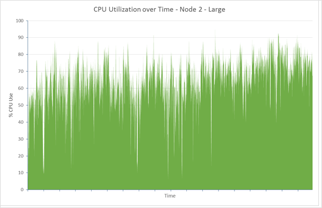
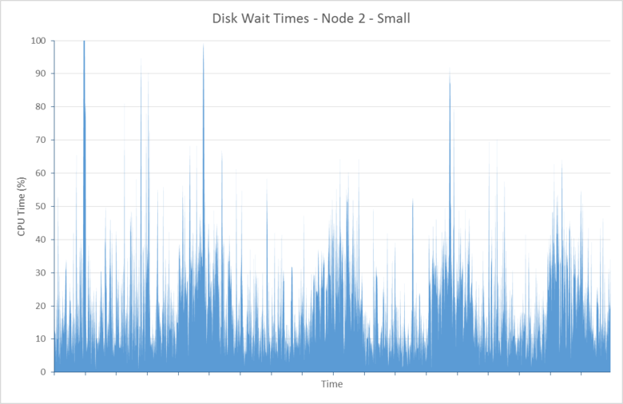
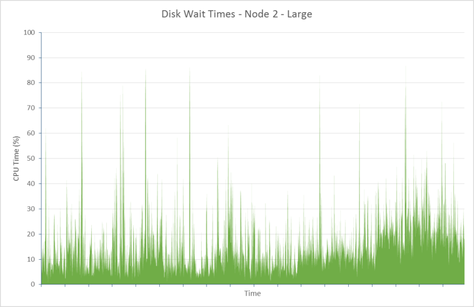
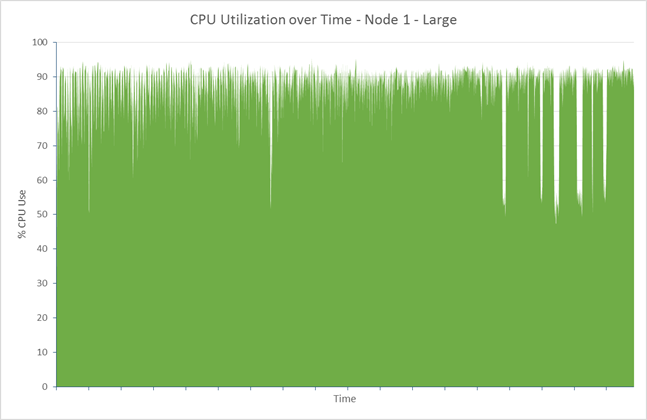
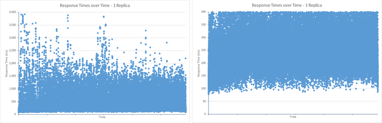
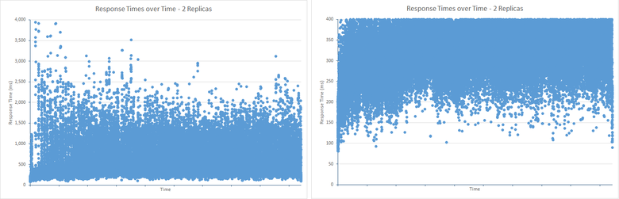

<properties
   pageTitle="Optimieren von Daten Aufnahme Leistung für Elasticsearch auf Azure | Microsoft Azure"
   description="So Daten Aufnahme Leistung mit Elasticsearch auf Azure zu optimieren."
   services=""
   documentationCenter="na"
   authors="dragon119"
   manager="bennage"
   editor=""
   tags=""/>

<tags
   ms.service="guidance"
   ms.devlang="na"
   ms.topic="article"
   ms.tgt_pltfrm="na"
   ms.workload="na"
   ms.date="09/22/2016"
   ms.author="masashin"/>

# <a name="tuning-data-ingestion-performance-for-elasticsearch-on-azure"></a>Optimieren von Daten Aufnahme Leistung für Elasticsearch auf Azure

[AZURE.INCLUDE [pnp-header](../../includes/guidance-pnp-header-include.md)]

Dieser Artikel ist [Teil einer Serie](guidance-elasticsearch.md). 

## <a name="overview"></a>(Übersicht)

Ein wichtiger Aspekt beim Erstellen einer beliebigen Suchdatenbank ist die beste Methode zum Strukturierung des Systems um durchsuchbare Daten schnelle und effiziente Aufnahme zu bestimmen. Aspekte zur diese Anforderung betreffen nicht nur die Wahl der Infrastruktur auf dem Sie das System implementieren, aber auch die verschiedenen Optimierungen, die Sie verwenden können, um sicherzustellen, dass das System mit der erwarteten Daten Eingang aufrechterhalten kann. 

Dieses Dokument beschreibt die Bereitstellung und Konfiguration Optionen, die Sie berücksichtigen sollten, für die Durchführung eines Elasticsearch Clusters, der einen hohen Anteil an Daten Aufnahme erwartet. Um einfarbige Daten für Erläuterung bereitzustellen, zeigt dieses Dokument auch die Ergebnisse der verschiedenen Konfigurationen mithilfe einer einfachen großer Datenmengen Aufnahme Arbeitsbelastung Benchmarks. Die Details der Arbeitsbelastung werden in der [Anlage](#appendix-the-bulk-load-data-ingestion-performance-test) am Ende dieses Dokuments beschrieben.

Der Zweck der Benchmarks wurde nicht absolut Leistungswerte für die Ausführung von Elasticsearch generieren oder sogar auf einen bestimmten Suchtopologie empfiehlt sich, sondern lieber Methoden zu veranschaulichen, die Sie verwenden können, für die Bewertung der Leistung, Datenknoten Ziehpunkt, und implementieren Cluster, die eigene Leistung erfüllen können. 

Wenn Sie Ihre eigenen Systeme Ziehpunkt, ist es wichtig, sorgfältig basierend auf Ihrer eigenen Auslastung Leistung zu testen. Sammeln Sie werden, die Sie erhalten Informationen zur optimalen Hardwarekonfiguration verwenden kann, und die horizontalen Skalierung Faktoren, die Sie berücksichtigen sollten. Insbesondere sollten Sie Folgendes beachten:

- Erwägen Sie die Gesamtgröße der Nutzlast gesendet und nicht nur die Anzahl der Elemente in jeder Massen Anforderung einfügen. Eine kleinere Anzahl großer Massenelemente in jede Anforderung könnte mehr als eine größere Anzahl, je nach der Ressource verfügbar, um jede Anforderung verarbeiten optimale.

Sie können die Effekte verschiedener Anfrage einfügen Massen mithilfe von [Marvel](https://www.elastic.co/products/marvel), verwenden die *Readbytes*Überwachen/*Writebytes* e/a mit [JMeter](https://jmeter.apache.org/)Indikatoren, und das Betriebssystem von tools wie *Iostat* und *Vmstat* auf Ubuntu. 

- Testen der Leistung durchführen und werden Measure CPU Verarbeitung und e/a-Wartezeiten, Datenträgerwartezeit, Durchsatz und Reaktionszeiten sammeln. Diese Informationen helfen beim Identifizieren potenzieller Engpässe und bewerten die Kosten und Vorteile von Premium-Speicher. Beachten Sie, dass CPU-als auch Datenträger Auslastung sogar auf allen Knoten, je nachdem, wie möglicherweise nicht in der mehrere Shards hinweg und Replikate auf Cluster verteilt sind (einige Knoten können weitere mehrere Shards hinweg als andere enthalten) tragen.

- Berücksichtigen Sie, wie die Anzahl der gleichzeitige Anforderungen für Ihre Arbeitsbelastung über den Cluster verteilt werden und bewerten den Einfluss der mit anderen Zahlen der Knoten dieser Arbeitsbelastung behandelt.

- Beachten Sie, wie Auslastung wächst möglicherweise Unternehmen erweitert wird. Bewerten Sie den Einfluss von diesem Wachstum auf die Kosten des virtuellen Computern und Speicher durch die Knoten verwendet.

- Erkennen Sie, dass eine größere Anzahl von Knoten mit regulären Festplatten mit einem Cluster möglicherweise effizienter Wenn Ihre Szenario eine hohe Anzahl von Anfragen setzt und die Datenträger-Infrastruktur verwaltet Durchsatz, die Ihre Service Level Agreements (SLAS) signiert werden. Erhöhen der Anzahl von Knoten kann jedoch in Form von zusätzlichen zwischen den Knoten Kommunikation und Synchronisierung Verwaltungsaufwand führen.

- Beachten Sie, dass eine höhere Anzahl der Kerne pro Knoten generieren möglicherweise mehr Datenträger Datenverkehr wie weitere Dokumente verarbeitet werden können. In diesem Fall messen Sie Datenträger Auslastung zu prüfen, ob das e/a-Subsystem Engpass zum und ermitteln die Vorteile von Premium Speicher möglicherweise ein.

- Testen und die vor-und Nachteile mit einer höheren Nummer Knoten mit weniger Kerne im Vergleich zu weniger Knoten mit mehr Kerne zu analysieren. Beachten Sie, dass die Belastung der Cluster eskaliert und möglicherweise ist es, zum Hinzufügen von Knoten erforderlich zunehmender die Anzahl der Replikate beibehalten.

- Erwägen Sie, dass mit temporärer Datenträger erfordern möglicherweise, dass Indizes häufiger wiederhergestellt werden.

- Messen Sie die Lautstärke speichernutzung zur Bewertung Kapazität, und klicken Sie unter Nutzung von Speicher. Angenommen, in diesem Szenario wir 1,5 Milliarden Dokumente mithilfe von 350GB Speicher gespeichert.

- Messen Sie die Übertragung der Einheitensätze für Ihre Auslastung, und beachten Sie, wie dabei sind wahrscheinlich, um den total e/a-Rate durchstellen Grenzwert für jedes Speicherkonto angegebenen gelangen, in dem Sie virtuelle Laufwerke erstellt haben.

## <a name="node-and-index-design"></a>Knoten und Index Entwurf

In einem System, die umfangreiche Daten Aufnahme unterstützen muss, stellen Sie die folgenden Fragen:

- **Sind Sie die Daten schnell verschieben oder relativ statisch?** Die dynamischeren die Daten, desto größer der Wartungsaufwand Aufwand für Elasticsearch. Wenn die Daten repliziert werden, wird jedes Replikat synchron beibehalten. Verschieben von Fast Daten, die nur eine begrenzte Lebensdauer hat oder einfach wiederhergestellt werden können, möglicherweise nutzbringend ganz deaktivieren der Replikation. Diese Option wird im Abschnitt erläutert [Optimieren umfangreiche Daten Aufnahme.](#tuning-large-scale-data-ingestion)

- **Wie auf dem neuesten Stand benötigen die Daten, die durch Suchen werden entdeckt Sie?** Um die Leistung zu erreichen, puffert Elasticsearch so viele Daten im Speicher wie möglich. Dies bedeutet, dass nicht alle Änderungen sofort für Suchabfragen zur Verfügung stehen. Der Prozess, die, den elasticsearch wird verwendet, um die Änderungen beibehalten und sichtbar zu machen, wird in [Beständigen Änderungen vornehmen](https://www.elastic.co/guide/en/elasticsearch/guide/current/translog.html#translog)beschrieben. 

    Werden angezeigt, die Daten Zins unterliegt den *Aktualisieren\_Intervall* des Indexes relevanten festlegen. Standardmäßig ist dieses Intervall auf 1 Sekunde festgelegt. Nicht jeder Situation erfordert jedoch wird aktualisiert, sodass diese schnell auftreten. Beispielsweise müssen Indizes Aufzeichnung Log Daten eine schnelle und kontinuierlichen Eingang Informationen bewältigen der schnell aufgenommen werden muss, erfordert jedoch nicht die Informationen für die Abfrage sofort verfügbar sein. In diesem Fall, erwägen Sie die Häufigkeit aktualisiert reduziert. Dieses Feature wird auch im Abschnitt beschrieben [Optimieren umfangreiche Daten Aufnahme.](#tuning-large-scale-data-ingestion)

- **Wie schnell ist die Daten wahrscheinlich wachsen?** Index Kapazität, wird durch die Anzahl der beim Erstellen des Indexes angegeben mehrere Shards hinweg bestimmt. Um für Wachstum zu ermöglichen, geben Sie eine ausreichende Anzahl von mehrere Shards hinweg (die Standardeinstellung ist fünf). Wenn Sie der Index in einem einzigen Knoten erstmalig erstellt wird, werden alle fünf mehrere Shards hinweg auf diesem Knoten ansässig, aber zunehmender Datenmengen zusätzliche Knoten hinzugefügt werden können und Elasticsearch werden mehrere Shards hinweg auf Knoten dynamisch verteilen. Jede Shard hat jedoch als Aufwand. Alle Suchvorgänge in einem Index werden alle mehrere Shards hinweg, Abfragen, damit der Erstellung einer großen Anzahl von mehrere Shards hinweg für eine kleine Datenmenge Abruf von Daten verlangsamt kann (das [Kagillion mehrere Shards hinweg](https://www.elastic.co/guide/en/elasticsearch/guide/current/kagillion-shards.html) Szenario vermeiden).

    Einige Auslastung (z. B. Protokollierung) möglicherweise einen neuen Index jeden Tag erstellen, und wenn Sie feststellen, dass die Anzahl der mehrere Shards hinweg nicht ausreichend für die Menge der Daten ist, sollten Sie ihn vor dem Erstellen des nächsten Indexes ändern (vorhandene Indizes werden nicht betroffen). Wenn Sie vorhandene Daten über weitere mehrere Shards hinweg verteilen müssen, ist eine Möglichkeit die Informationen neu indizieren. Erstellen Sie einen neuen Index, mit der entsprechenden Konfiguration, und kopieren Sie die Daten hinein. Dieses Verfahren kann auf Anwendungen transparent sein mithilfe von [Index Aliases](https://www.elastic.co/guide/en/elasticsearch/reference/current/indices-aliases.html).

- **Benötigt die Daten zwischen den Benutzern in einem multitenancy Szenario aufgeteilt werden?** Sie können für jeden Benutzer separate Indizes erstellen, aber dies kann teure, wenn jeder Benutzer nur eine mittlere Datenmenge sein. Stattdessen erwägen Sie das Erstellen von [freigegebenen Indizes](https://www.elastic.co/guide/en/elasticsearch/guide/current/shared-index.html) und verwenden Sie [Aliases basierend auf Filter](https://www.elastic.co/guide/en/elasticsearch/guide/current/faking-it.html) , um Anfragen zu den Daten pro Benutzer zu lenken. Um die Daten für einen Benutzer in der gleichen Shard zusammenhalten, überschreiben Sie die standardmäßige routing-Konfiguration für den Index und Routing Daten basierend auf einige Erkennungszeichen Attribut des Benutzers aus.

- **Sind die Daten lang oder kurzlebige?** Wenn Sie eine Reihe von Azure-virtuellen Computern zum Implementieren eines Elasticsearch Clusters verwenden, können Sie auf eine lokale Ressource System Festplatten anstatt auf ein angeschlossenes Laufwerk temporäre Daten speichern.
Mithilfe einer VM SKU, die eine SSD für den Datenträger Ressource nutzt kann e/a-Leistung verbessern. Jedoch alle Informationen frei, die auf dem Datenträger Ressource ist vorübergehend und verloren, wenn Sie der virtuellen Computer neu gestartet wird (finden Sie im Abschnitt Wenn werden die Daten auf einem temporären Laufwerk werden verloren Verständnis [des temporären Laufwerks auf Microsoft Azure virtuellen Computern](http://blogs.msdn.com/b/mast/archive/2013/12/07/understanding-the-temporary-drive-on-windows-azure-virtual-machines.aspx) Weitere Details). Wenn Sie Daten zwischen dem Neustart beibehalten müssen, erstellen Sie Datenlaufwerke, um diese Informationen zu halten, und verbinden Sie sie mit dem virtuellen Computer.

- **Wie aktiv sind die Daten?** Azure-virtuellen Festplatten unterliegen begrenzungsebene, wenn der Umfang der Aktivität/Lese angegebenen Parameter (aktuell 500/a-Vorgänge pro Sekunde (IOPS) für einen Datenträger eines Standard in virtuellen Computers und 5000 IOPS für einen Datenträger Premium Speicher zugeordnet) überschreitet. 

    Um die Wahrscheinlichkeit von begrenzungsebene reduzieren und e/a-Leistung erhöhen, sollten Sie mehrere Daten Datenträger für jeden virtuellen Computer erstellen und konfigurieren Sie Elasticsearch Streifen Daten über diese Datenträger in den [Datenträger und die Datei Systemanforderungen](guidance-elasticsearch-running-on-azure.md#disk-and-file-system-requirements)beschriebenen.

    Sie sollten eine Hardwarekonfiguration auswählen, die trägt dazu bei, minimieren die Anzahl der Datenträger e/a-Vorgänge lesen, indem Sie sicherstellen, dass genügend Arbeitsspeicher häufig benötigte Cachedaten zur Verfügung steht. Dies wird im Abschnitt [Speicher Anforderungen](guidance-elasticsearch-running-on-azure.md#memory-requirements) ausgeführt Elasticsearch auf Azure beschrieben.

- **Welche Art von Arbeitsbelastung müssen einzelnen Knoten unterstützt?** Elasticsearch Vorteile von Probleme Arbeitsspeicher zum Zwischenspeichern von Daten in (in Form von der Dateisystemcache) verfügbar und für den Heap JVM wie im Abschnitt [Speicher Anforderungen](guidance-elasticsearch-running-on-azure.md#memory-requirements) ausgeführt Elasticsearch auf Azure beschrieben. 

    Die Speichermenge, sind die Anzahl der CPUs und Menge der verfügbaren Festplatten durch die SKU des virtuellen Computers festgelegt. Weitere Informationen finden Sie auf der Website Azure [Virtuellen Computern Preise](http://azure.microsoft.com/pricing/details/virtual-machines/) .

### <a name="virtual-machine-options"></a>Optionen von virtuellen Computern

Sie können virtuellen Computern in einer anderen SKU dazu Azure bereitstellen. Die für eine Azure-virtuellen Computer verfügbaren Ressourcen abhängig SKU ausgewählt. Jede SKU bietet eine andere Mischung von Kerne, Arbeitsspeicher und Speicher. Sie müssen eine entsprechende Größe des virtuellen Computer auswählen, behandelt, die die erwartete Auslastung aber, die wird auch kostengünstiger Beweisen.
Beginnen Sie mit einer Konfiguration, die Ihren Anforderungen aktuellen erfüllen (durchführen, um zu testen, Benchmarks, wie weiter unten in diesem Dokument beschrieben). Sie können einen Cluster später skalieren, indem Sie mehrere virtuelle Computer ausgeführt Elasticsearch Knoten hinzufügen.

[Größen für virtuelle Computer](../virtual-machines/virtual-machines-linux-sizes.md) auf der Website Azure Dokumente die verschiedenen Optionen und Artikel verfügbar für virtuelle Computer an.

Sie sollten die Größe und Ressourcen eines virtuellen Computers, die der Rolle, die Ausführung des virtuellen Computers Knoten durchführt übereinstimmen.

Für einen Datenknoten:

- Reservieren Sie bis zu 30 GB oder 50 % der den verfügbaren RAM-Speicher zu dem Java Heaps, je nachdem, was der unteren ist. Lassen Sie den Rest des Betriebssystems zum Zwischenspeichern von Dateien verwenden. Wenn Sie Linux verwenden, können Sie angeben, dass die Größe des Arbeitsspeichers auf den Java Heap zugewiesen werden, durch die ES festlegen\_HEAP\_Größe Umgebungsvariable vor dem Elasticsearch ausführen. Sie können auch wenn Sie Windows oder Linux verwenden, können Sie vorschreiben Arbeitsspeichergröße mit den Parametern *Xmx* und *Xms* beim Starten von Elasticsearch.

    Je nach Arbeitsaufwand weniger große virtuellen Computern als effektive Leistung als mit einer großen Anzahl von bei gleicher Breite virtuellen Computern möglicherweise nicht. Sie sollten Tests durchführen, die die vor-und Nachteile zwischen den zusätzlichen Netzwerkverkehr und Wartungsaufwand und die Kosten des erhöhen die Anzahl der Kerne verfügbar und die Anzahl von Konflikten reduzierte Datenträger auf den einzelnen Knoten gemessen werden kann.

- Verwenden Sie zum Speichern von Daten Elasticsearch Premium-Speicher ein. Dies wird im Abschnitt [Speicheroptionen](#storage-options) ausführlicher erläutert.

- Verwenden Sie mehrere Datenträger der gleichen Größe und Streifen Daten über diese Datenträger aus. Die SKU Ihrer virtuellen Computer wird die maximale Anzahl von Daten Datenträger bestimmen, die Sie anfügen können. Weitere Informationen finden Sie unter [Systemanforderungen für Datenträger und die Datei](guidance-elasticsearch-running-on-azure.md#disk-and-file-system-requirements).

- Verwenden Sie eine Multi-Core CPU-SKU mit mindestens 2 Kernen, vorzugsweise 4 oder mehr. 

Für einen Clientknoten:

- Weisen Sie dem Datenträgerspeicher nicht für Elasticsearch Daten, dedizierten Clients Daten nicht auf dem Datenträger speichern.

- Stellen Sie sicher, dass ausreichend Arbeitsspeicher Auslastung verarbeitet verfügbar ist. Massen einfügen Besprechungsanfragen in den Speicher vor zu den verschiedenen Datenknoten gesendeten Daten gelesen werden werden, und die Ergebnisse von Aggregationen und Abfragen im Speicher vor dem mit der Clientanwendung zurückgegeben wird. Analysieren Sie Ihre eigenen Auslastung und Überwachen von Arbeitsspeicher verwenden mithilfe eines Tools, wie etwa Marvel oder die [JVM Informationen](https://www.elastic.co/guide/en/elasticsearch/guide/current/_monitoring_individual_nodes.html#_jvm_section) mithilfe der *Knoten/Stats* API zurückgegeben (`GET _nodes/stats`), die optimalen Anforderungen bewerten.  Insbesondere Überwachen der *Heap\_verwendet\_%* metrischen für jeden Knoten und Ziel die Heapgröße unterhalb von 75 % des den verfügbaren Speicherplatz zu belassen.

- Stellen Sie sicher, dass ausreichend CPUs empfangen und Verarbeiten der erwarteten Lautstärke Anfragen verfügbar sind.
Aktuelle Anfragen sind, wie sie vor der Verarbeitung empfangen werden, und die Lautstärke von Elementen, die in der Warteschlange gespeichert werden können, eine Funktion die Anzahl der CPUs auf den einzelnen Knoten ist. Sie können die Länge der Warteschlange überwachen, indem Sie mithilfe der Daten in die [Threadpool Informationen](https://www.elastic.co/guide/en/elasticsearch/guide/current/_monitoring_individual_nodes.html#_threadpool_section) mithilfe der Knoten/Stats API zurückgegeben. 

    Wenn die Anzahl der *abgelehnt* für eine Warteschlange gibt an, dass es sich bei Anfragen werden abgelehnt wird, bedeutet dies, dass es sich bei der Cluster Engpass gestartet wird. Dies möglicherweise aufgrund CPU-Bandbreite, werden aber möglicherweise auch aufgrund von Faktoren wie z. B. fehlender Arbeitsspeicher oder e/a-langsam werden, verwenden Sie also diese Informationen in Verbindung mit anderen Statistiken die Ursache ermitteln.

    Client-Knoten möglicherweise oder möglicherweise nicht erforderlich, je nach der Auslastung. Daten Aufnahme Auslastung meist nicht nutzbringend verwenden dedizierte Clients, während einige Suchbegriffe und Aggregationen schneller ausgeführt werden können. Analysieren Ihre eigenen Szenarien kann begonnen werden.

    Client-Knoten eignen sich primär für Applikationen, die die Transportregel-Client-API mit dem Cluster herstellen. Sie können auch Knoten-Client-API verwenden, die einen dedizierten Client für die Anwendung, die mit den Ressourcen der Umgebung Host Anwendung dynamisch erstellt. Wenn Ihre Anwendung die Knoten-Client-API verwenden, klicken Sie dann es notwendigen für Ihren Cluster vorkonfigurierten dedizierten Client-Knoten enthalten möglicherweise nicht. 
    
    Beachten Sie jedoch, dass ein Knoten erstellt, mit der Client-Knoten-API ein erster Klasse Mitglied Cluster ist und als solche im Netzwerk Chatter mit anderen Knoten beteiligt. Häufig können starten und Beenden von Client-Knoten unnötige Daten über den gesamten Cluster erstellen.

Für eine master-Knoten:

- Weisen Sie dem Datenträgerspeicher nicht für Elasticsearch Daten, dedizierte master-Knoten Daten auf dem Datenträger nicht gespeichert werden.

- CPU-Anforderungen sollten minimal sein.

- Arbeitsspeicher Anforderungen abhängig von der Größe der Cluster ab. Informationen über den Status der Cluster wird im Speicher beibehalten. Erforderliche Speichermenge für kleine Cluster ist minimal, aber für eine große, hoch aktiver Cluster, in dem Indizes erstellt werden häufig und mehrere Shards hinweg verschieben, kann die Datenmengen Zustand erheblich zunehmen. Überwachen Sie die JVM Heapgröße, um festzustellen, ob Sie mehr Arbeitsspeicher hinzufügen müssen.

> [AZURE.NOTE]Cluster Zuverlässigkeit immer mehrere master-Knoten zu erstellen und Konfigurieren der verbleibenden Knoten die Möglichkeit für einen geteilten Gehirn vermeiden. Idealerweise sollte eine ungerade Zahl von einem master-Knoten vorhanden sein. In diesem Thema wird unter [Konfigurieren von Stabilität und Wiederherstellung auf Elasticsearch auf Azure][]ausführlicher beschrieben.

### <a name="storage-options"></a>Speicheroptionen

Es gibt eine Reihe von Speicheroptionen auf Azure virtuellen Computern, die mit verschiedenen vor-und Nachteile Auswirkungen Kosten, Leistung, Verfügbarkeit und Wiederherstellung, die Sie berücksichtigen müssen zur Verfügung.

Beachten Sie, dass Sie Elasticsearch Daten auf dedizierte Daten Laufwerken speichern soll.  Dies hilft, um Konflikte mit dem Betriebssystem zu minimieren, und stellen Sie sicher, dass große Datenmengen Elasticsearch e/a in Konflikt mit Betriebssystemfunktionen für e/a-Ressourcen nicht miteinander stehen.

Azure Datenträger unterliegen Einschränkungen Leistung aus. Wenn Sie feststellen, dass ein Cluster periodisch Aktivitätsschübe durchläuft möglicherweise e/a-Anfragen gedrosselt. Um dies zu verhindern, Optimieren Sie den Entwurf, die Dokumentgröße Elasticsearch gegen die Lautstärke der Wahrscheinlichkeit von jedem Datenträger empfangen werden Anfragen abzuwägen.

Datenträger basierend auf standard-Speicher unterstützen einen Höchstwert für die Anforderung Satz von 500 IOPS aus, während Datenträger basierend auf Premium-Speicher bis zu 5.000 IOPS, abhängig von der Größe der Datenträger Daten verwendet werden können. Premium-Datenträger sind nur für die DS und GS Reihe von virtuellen Computern verfügbar. Finden Sie den maximalen Datenträger IOPS durch virtueller Speicher [Größen für virtuellen Computern in Azure](../virtual-machines/virtual-machines-linux-sizes.md). Leistung von Premium-Speicher wird durch die Größe der virtuellen Computer zusammen mit Zuordnung auf dem Datenträger Größe bestimmt. Weitere Informationen finden Sie unter [Premium Speicher: leistungsstarke Storage für Azure-virtuellen Computern Auslastung](../storage/storage-premium-storage.md).

**Beständiger Daten Datenträger**

Beständiger Datenfestplatten sind virtuelle Festplatten, die von Azure-Speicher unterstützt werden. Wenn der virtuellen Computer nach einem Fehler Bereiche neu erstellt werden muss, können einfach vorhandene virtuellen Festplatten zu den neuen virtuellen Computer angefügt werden. Virtuelle Festplatten können basierend auf standard-Speicher (drehendes Medien) oder Premium Speicher (SSDs) erstellt werden. Wenn Sie SSDs verwenden möchten, müssen Sie Erstellen von virtuellen Computern mithilfe der DS Serie oder besser. DS Autos Kosten identisch mit den virtuellen Computern entspricht D-Serie, aber Sie unterliegen zusätzliche für die Verwendung von Premium-Speicher.

Sollten Sie in Fällen, in denen die maximale durchstellen Zinssatz pro Datenträger nicht ausreichend, um die erwartete Auslastung unterstützen entweder mehrere Daten Datenträger erstellen und zulassen Sie Elasticsearch [Streifen](guidance-elasticsearch-running-on-azure.md#disk-and-file-system-requirements)Daten über diese Datenträger oder implementieren Sie Systemebene [RAID 0 striping virtuelle Laufwerke verwenden](../virtual-machines/virtual-machines-linux-configure-raid.md).

> [AZURE.NOTE]Erfahrung in Microsoft hat gezeigt, RAID 0 zum Glätten, um die e/a-Effekte eines besonders hilfreich ist, *spiky* Auslastung, die häufig verwendeten Aktivitätsschübe generieren.

Verwenden Sie Premium lokal redundante (oder lokal für redundante preisgünstige oder f & a-Auslastung) Speicher für das Speicherkonto, halten die Festplatten; Replikation über geografischen Standorten und Zonen ist nicht für hohe Verfügbarkeit Elasticsearch erforderlich. 

**Temporärer Datenträger**

Erstellen von virtuellen Computern, die Premium-Speicher unterstützen mit beständigen Datenträger basierend auf SSDs benötigt werden. Dies hat eine Auswirkung Preis. Mit dem lokalen temporärer Datenträger Elasticsearch Daten aufnehmen kann eine kostengünstiger Lösung für bei gleicher Breite Knoten mit bis zu ungefähr 800 GB Speicher Anforderung sein. Klicken Sie auf der Standard-D Reihe von virtuellen Computern werden temporärer Datenträger implementiert mit SSDs die weit größere Leistung und viele unteren Wartezeit als einfache Datenträger bereitstellen

Wenn Sie Elasticsearch verwenden, kann die Leistung bei der Verwendung von Premium Speicher anfallen identisch sein – finden Sie im Abschnitt [Adressierung Problemen aufgrund einer Wartezeit](#addressing-disk-latency-issues) für Weitere Informationen.

Die Größe der virtuellen Computer beschränkt den Abstand in temporärer Speicher verfügbar wie in den Blogbeitrag [Erwartete der D-Serie Leistung](https://azure.microsoft.com/blog/d-series-performance-expectations/)beschrieben.

Beispielsweise ein Standard\_D1 virtueller Computer bietet 50GB temporärer Speicher, ein Standard\_D2 virtueller Computer verfügt über 100GB temporärer Speicher und ein Standard\_D14 virtueller Computer bietet 800GB temporärer Abstand. Für Cluster, in denen Knoten nur diese Menge an Speicherplatz benötigen, kann das Verwenden eines D-Serie virtuellen Computers mit temporärer Speicher kostengünstiger sein.

Sie müssen den höheren Durchsatz temporärer Speicher gegenüber der Zeit und Kosten für diese Daten wiederherstellen, nach dem Neustart erhältlich abwägen. Der Inhalt des Datenträgers temporärer gehen verloren, wenn Sie der virtuellen Computer auf einen anderen Hostserver verschoben wird, wenn der Host aktualisiert wird oder wenn der Host ein Hardwarefehler auftritt. Wenn die Daten selbst eine begrenzte Lebensdauer haben, und klicken Sie dann diese Datenverlust zulässige möglicherweise. Für längere Daten möglicherweise neu Erstellen eines Indexes oder fehlenden Informationen aus einer Sicherung wiederherstellen. Es ist möglich, der mögliche Datenverluste zu minimieren, indem Sie Replikate frei, die auf anderen virtuellen Computern.

> [AZURE.NOTE]Verwenden Sie einen **einzelnen** virtuellen Computer kritische Herstellung Daten aufnehmen. Wenn der Knoten fehlschlägt, alle Daten ist nicht verfügbar. Stellen Sie sicher, dass die Daten auf mindestens eine andere Knoten repliziert werden, um wichtige Informationen.

**Azure-Dateien**

[Azure-Dateidienst](http://blogs.msdn.com/b/windowsazurestorage/archive/2014/05/12/introducing-microsoft-azure-file-service.aspx) bietet freigegebener Dateizugriff Azure-Speicher verwenden. Sie können die Dateifreigaben, die Sie dann bereitstellen können auf Azure-virtuellen Computern erstellen. Mehrere virtuelle Computer können die gleichen Dateifreigabe bereitstellen, aktivieren sie dieselben Daten zugreifen.

Aus Gründen der Leistung wird nicht empfohlen, dass Sie verwenden Dateifreigaben zum Halten von Elasticsearch Daten, die nicht für mehrere Knoten freigegeben werden müssen, normale Daten Datenträger eignen sich mehr für diesen Zweck. Dateifreigaben können zum Erstellen von Elasticsearch [Schatten Replikat Indizes](https://www.elastic.co/guide/en/elasticsearch/reference/current/indices-shadow-replicas.html)verwendet werden. Dieses Feature wird jedoch wird derzeit Versuche und sollte nicht in einer Umgebung für die Herstellung zu diesem Zeitpunkt implementiert werden. Aus diesem Grund Schatten Indizes nicht weiter in diesem Handbuch gelten.

**Netzwerkoptionen**

Azure implementiert einem freigegebenen Netzwerke Farbschema. Virtuellen Computern mit der gleichen Hardware Gestelle Netzwerk-Ressourcen in Anspruch. Daher verfügbaren Bandbreite kann abweichen, nach die Uhrzeit und die täglichen Durchlaufen der Arbeit, die auf virtuellen Computern freigeben die gleichen physischen Infrastruktur ausgeführt. Sie haben eine geringe Kontrolle über die folgenden Faktoren. Es ist wichtig zu verstehen, dass die Leistung des Netzwerks ist zu rechnen, über einen Zeitraum schwanken, also benutzererwartungen entsprechend festlegen.

## <a name="scaling-up-nodes-to-support-large-scale-data-ingestion"></a>Skalierung einrichten Knoten zur Unterstützung von umfangreichen Daten Aufnahme

Erstellen Elasticsearch Cluster mit einigermaßen moderieren Hardware, und klicken Sie dann nach oben skalieren, oder skalieren während die Datenmenge wächst und die Anzahl der Anfragen erhöht. Mit Azure Sie vergrößern, indem Sie auf Vergrößern und teurer virtuellen Computern ausgeführt, oder Sie können Skalierung mithilfe zusätzliche kleinere und kostengünstigere virtuellen Computern. 

Sie können auch eine Kombination aus beiden Strategien ausführen. Es gibt keine Lösung für alle einzusetzen in allen Szenarien, damit der jeweiligen Situation am besten bewerten, die Sie benötigen, können Sie eine Reihe Leistung durchführen kann begonnen werden überprüft.

In diesem Abschnitt mit der Skalierung Ansatz befasst, Skalierung Out wird im Abschnitt erläutert [heraus Skalierung: Schlussfolgerungen](#scaling-out-conclusions).
In diesem Abschnitt werden die Ergebnisse einer Reihe von Benchmarks, die für einen Satz Elasticsearch Cluster virtuellen Computern mit unterschiedlichen Größen mit durchgeführt wurden. Zuordnungseinheiten wurden vorgesehenen als klein, Mittel und groß. In der folgenden Tabelle werden die zugewiesenen Ressourcen für den virtuellen Computern in jedem Cluster zusammengefasst.

| Cluster | VIRTUELLER COMPUTER SKU      | Anzahl der Kerne | Anzahl der Datenträger Daten | RAM  |
|---------|-------------|-----------------|----------------------|------|
| Kleine   | Standard D2 | 2               | 4                    | 7GB  |
| Mittel  | Standard D3 | 4               | 8                    | 14GB |
| Große   | Standard D4 | 8               | 16                   | 28GB |

Jeder Elasticsearch Cluster enthaltenen 3 Datenknoten. Diese Datenknoten verarbeitet Client-Anfragen sowie zur Datenverarbeitung. Separate Client-Knoten wurden nicht verwendet werden, da sie etwas Vorteile für die Daten Aufnahme Szenario verwendet werden, indem Sie die Tests angeboten. Cluster enthalten auch drei master-Knoten, von denen durch Elasticsearch Cluster koordinieren gewählt wurde.

Die Tests wurden durchgeführt Elasticsearch 1.7.3 verwenden. Die Tests anfangs auf Cluster unter Ubuntu Linux 14.0.4 durchgeführt wurden, und klicken Sie dann wiederholt mithilfe von Windows Server 2012. Die Details der Arbeitsbelastung ausgeführte Arbeit von Tests werden in der [Anlage](#appendix-the-bulk-load-data-ingestion-performance-test)beschrieben.

### <a name="data-ingestion-performance--ubuntu-linux-1404"></a>Daten Aufnahme Leistung – Ubuntu Linux 14.0.4

In der folgenden Tabelle werden die Gesamtergebnisse der Ausführung der Tests für zwei Stunden für jede Konfiguration zusammengefasst:

| Konfiguration | Anzahl der Stichprobe | Durchschnittliche Antwortzeit (ms) | Durchsatz (Vorgänge/s) |
|---------------|--------------|----------------------------|---------------------------|
| Kleine         | 67057        | 636                        | 9.3                       |
| Mittel        | 123482       | 692                        | 17.2                      |
| Große         | 197085       | 839                        | 27,4                      |

Der Durchsatz und die Anzahl der Beispiele verarbeitet für die drei Konfigurationen in das ungefähre Verhältnis 1:2 werden: 3. Im Hinblick auf Arbeitsspeicher, CPUs und Festplatten verfügbaren Ressourcen haben jedoch das Verhältnis 1:2:4. Es wurde Ansicht werden im Wert Untersuchung läuft die Details niedriger Leistung der Knoten im Cluster bewerten, warum dies der Fall sein kann. Diese Informationen kann helfen, um festzustellen, ob Einschränkungen hinsichtlich der Skalierung nach oben und bestehen Wenn es möglicherweise besser zu berücksichtigen ist Skalierung. 

### <a name="determining-limiting-factors-network-utilization"></a>Faktoren bestimmen einschränken: Netzwerk-Auslastung

Elasticsearch hängt von Probleme ausreichend Bandbreite im Netzwerk für die Unterstützung der Eingang von Client-Anfragen sowie die Synchronisierungsinformationen, die zwischen Knoten im Cluster fließt. Als hervorgehobenen zu einer früheren Version, haben Sie Kontrolle über die Verfügbarkeit Bandbreite eingeschränkte der vielen Variablen wie Datencenter verwenden und die aktuelle Netzwerk Laden von anderen virtuellen Computern freigeben Infrastruktur des gleichen abhängt. Jedoch lohnt sich weiterhin untersuchen die Netzwerkaktivität für jeden Cluster, um sicherzustellen, dass der Umfang des Datenverkehrs nicht übermäßige ist. Das Diagramm unten zeigt einen Vergleich der Netzwerkdatenverkehr vom Knoten 2 in jedem der Cluster (den Datenträger für die anderen Knoten in jedem Cluster war sehr ähnlich).


Die durchschnittliche Anzahl von Bytes pro Sekunde für Knoten 2 in den einzelnen Cluster über den Zeitraum von zwei Stunden empfangen wurden wie folgt aus:

| Konfiguration | Durchschnittliche Anzahl von Bytes/s |
|---------------|--------------------------------------|
| Kleine         | 3993640.3                            |
| Mittel        | 7311689.9                            |
| Große         | 11893874.2                           |

Die Tests wurden ausgeführt, während das System **dauerhaft**Zustand ausgeführt wurde. Situationen, in dem Indizieren Qualifikationsprofilen oder Knoten Wiederherstellen auftritt, können Datenübertragung zwischen Knoten gedrückt primären und Replikat mehrere Shards hinweg erheblichen Netzwerkverkehr generieren. Die Effekte dieses Prozesses werden im Dokument [Konfigurieren von Stabilität und Wiederherstellung auf Elasticsearch auf Azure][]mehr beschrieben.

### <a name="determining-limiting-factors-cpu-utilization"></a>Faktoren bestimmen einschränken: CPU-Auslastung

Der verfügbaren Kapazität unterliegt zumindest teilweise Rate, Anfragen verarbeitet werden. Elasticsearch akzeptiert Massen Einfügeanforderungen über das gleichzeitige Warteschlange einfügen. Jeder Knoten verfügt über eine Reihe von Massen Warteschlangen durch die Anzahl der verfügbaren Prozessoren bestimmt einfügen. Standardmäßig ist es eine Warteschlange für jeden Prozessor und jede Warteschlange kann bis zu 50 ausstehende Anfragen enthalten, bevor sie anfangen, abgelehnt werden soll. 

Applikationen sollte Anfragen mit einer Rate senden, die keinen die Warteschlangen overspill verursacht. Die Anzahl der Elemente in jede Warteschlange jeweils ist dies eine Funktion, Anfragen vom Clientanwendungen gesendet werden und die Rate, mit der folgenden denselben Anforderungen abgerufen und verarbeiteten Elasticsearch. Daher erfasst eine wichtige Statistik Bedenken die Effektivverzinsung zurück in der folgenden Tabelle zusammengefasst.

| Konfiguration | Gesamten Stichproben | Anzahl der Fehler  | Fehler Zins |
|---------------|---------------|--------------|------------|
| Kleine         | 67057         | 0            | 0,00 %      |
| Mittel        | 123483        | 1            | 0.0008 %    |
| Große         | 200702        | 3617         | 1,8 %      |

Jede dieser Fehler wurde durch die folgende Java-Ausnahme verursacht:

```
org.elasticsearch.action.support.replication.TransportShardReplicationOperationAction$PrimaryPhase$1@75a30c1b]; ]
[219]: index [systembase], type [logs], id [AVEAioKb2TRSNcPa_8YG], message [RemoteTransportException[[esdatavm2][inet[/10.0.1.5:9300]][indices:data/write/bulk[s]]]; nested: EsRejectedExecutionException[rejected execution (queue capacity 50)
```

Die Anzahl der Warteschlangen und/oder die Länge der einzelnen Warteschlange möglicherweise reduziert die Anzahl der Fehler, aber dieser Ansatz nur unerwartet kurze Dauer bewältigen kann. Während der Ausführung einer längeren Reihe von Aufnahme Datentasks Hiermit wird einfach den Punkt verzögern, starten Sie Fehler auftritt. Darüber hinaus wird diese Änderung den Durchsatz wird nicht verbessern und die Anzeigedauer Antwort Clientanwendungen wahrscheinlich beschädigen, wie Besprechungsanfragen für mehr in Warteschlange gestellt werden vor der Verarbeitung.

Die standardmäßige Indexstruktur 5 mehrere Shards hinweg 1 Replikat (10 mehrere Shards hinweg in allen), Ergebnisse in einer bequeme Modell in Last zwischen den Knoten in einem Cluster zugeordnet, zwei Knoten enthalten, während der anderen Knoten vier enthalten sollen drei mehrere Shards hinweg aus. Der höchsten Auslastung Knoten ist wahrscheinlich das Element, das die am häufigsten Durchsatz schränkt angenommen, warum diese Knoten in jedem Fall ausgewählt wurde. 

Der folgende Satz von Diagrammen veranschaulichen die CPU-Auslastung für den höchsten Auslastung Knoten in jedem Cluster an.




Für den kleinen, mittlere und große Cluster, wurde die durchschnittliche CPU-Auslastung für diese Knoten 75.01 %, 64.93 % und 64.64 %. Selten bedeutet Auslastung tatsächlich Treffer (100 %) und Auslastung löscht als die Größe der Knoten und die verfügbaren CPU Power verfügbar erhöht. CPU-Leistung ist es wahrscheinlich nicht wird die Leistung von großen Cluster einschränken.

### <a name="determining-limiting-factors-memory"></a>Faktoren bestimmen einschränken: Arbeitsspeicher

Arbeitsspeicherverwendung ist ein weiterer wichtiger Aspekt, der Leistung beeinflussen kann. Für die Tests wurde Elasticsearch 50 % der verfügbaren Arbeitsspeicher reserviert. Dies ist in Übereinstimmung mit [Empfehlungen beschrieben](https://www.elastic.co/guide/en/elasticsearch/guide/current/heap-sizing.html#_give_half_your_memory_to_lucene). Während die Tests ausgeführt wurden, wurde die JVM auf übermäßige Garbage Collection-Aktivität (Angabe der fehlende Heapspeicher) überwacht. Klicken Sie in allen Fällen die Heapgröße unveränderliche wurde, und die JVM ausgestellt niedrig Garbage Collection-Aktivität. Das Bildschirmabbild unten zeigt eine Momentaufnahme der Marvel, Hervorhebung die Taste JVM Statistiken für kurze Zeit, während der Test, klicken Sie auf den großen Cluster ausgeführt wurde.


***JVM Arbeitsspeicher und Garbage Collection-Aktivität im großen Cluster.***

### <a name="determining-limiting-factors-disk-io-rrates"></a>Faktoren bestimmen einschränken: Datenträger e/a-rRates

Das verbleibende physische Feature auf dem Server, die Leistung einschränken möglicherweise ist die Leistung des Datenträgers e/a-Subsystem. Das Diagramm unten vergleicht die Festplattenaktivität werden für die höchsten Auslastung Knoten in jedem Cluster geschriebenen Bytes.

 

Die folgende Tabelle zeigt die durchschnittliche Anzahl von Bytes pro Sekunde für Knoten 2 in den einzelnen Cluster über den Zeitraum von zwei Stunden geschrieben:

| Konfiguration | Durchschnittliche Anzahl von Bytes geschrieben/s |
|---------------|-------------------------------------|
| Kleine         | 25502361.94                         |
| Mittel        | 48856124.5                          |
| Große         | 88137675.46                         |

Die Lautstärke der geschriebenen Daten erhöht sich mit der Anzahl von Besprechungsanfragen, die von einem Cluster verarbeitet werden, aber die e/a-Sätze sind im Rahmen der Azure-Speicher (Datenträger erstellte Organigramme Azure-Speicher können unterstützen einer längeren Sätzen 10 s zu 100 s MB/s, je nachdem, ob Standard oder Premium Speicher verwendet wird). Untersuchen die Zeitdauer gewartet Festplatte hilft zu erläutern, warum der Datenträgerdurchsatz unterschritten theoretisches Maximum ist. Die Diagramme und in der nachfolgenden Tabelle wird diese Statistik für die gleichen drei Knoten anzeigen:

> [AZURE.NOTE]Die Datenträger Wartezeit wird durch die Überwachung des Prozentsatzes der CPU-Zeit, während der Prozessoren blockiert werden, weil e/a-Vorgänge abgeschlossen, gemessen.






| Konfiguration | Durchschnittliche warten CPU-Zeit (%) |
|---------------|--------------------------------|
| Kleine         | 21.04                          |
| Mittel        | 14.48                          |
| Große         | 15.84                          |

Diese Daten zeigt an, ein erheblichen Teil der CPU-Zeit (zwischen nahezu 16 % und 21 %) entfällt, warten auf Festplatte ausführen. Dies ist die Möglichkeit des Elasticsearch Anfragen zu verarbeiten, und speichern die Daten einschränken.

Während des Testlaufs, großen Cluster mehr als **fünf Hundert Millionen Dokumente**eingefügt. Gleicht des Tests weiterhin angezeigt wurden, dass Wartezeiten erheblich erhöht, wenn die Datenbank über sechs Hundert Millionen Dokumente enthalten. Die Gründe für dieses Verhalten wurden nicht vollständig untersucht, aber aufgrund eines Datenträger Fragmentierung verursacht möglicherweise erhöhte Datenträgerwartezeit. 

Erhöhen der Cluster über mehr Knoten möglicherweise helfen, um die Auswirkungen der dieses Verhalten zu beheben. In schwerwiegenden Fällen kann es erforderlich sein, einen Datenträger defragmentieren, der übermäßige e/a-Zeiten angezeigt wird. Jedoch einer großen Festplattendefragmentierung kann längere Zeit (möglicherweise mehr als 48 Stunden für eine virtuelle Festplatte-Laufwerk 2TB) dauern, und darauf, das Laufwerk neu und gleicht Elasticsearch Wiederherstellen eines fehlenden Daten aus Replikat mehrere Shards hinweg ein kostengünstiger Ansatz könnte.

### <a name="addressing-disk-latency-issues"></a>Adressieren von Problemen aufgrund einer Wartezeit

Die Tests wurden ursprünglich durchgeführt mit virtuellen Computern mit standard Festplatten konfiguriert. Ein Standardansicht Datenträger basiert auf drehendes Medien und daher unterliegt Rotationslatenz und anderer Engpässe, die e/a-Sätzen einschränken können. Azure bietet auch Premium Speicher in der Datenträger mit SSD Medien erstellt werden. Diese Geräte verfügen über keine Rotationslatenz und daher sollten verbesserte e/a-Geschwindigkeit bereitstellen. 

In der folgenden Tabelle werden die Ergebnisse von standard Datenträger mit Premium Festplatten in den großen Cluster ersetzen (der Standard D4 virtuellen Computern im großen Cluster wurden durch Standard DS4 virtuellen Computern ersetzt; die Anzahl der Kerne, Arbeitsspeicher und Datenträger wurde für das gleiche in beiden Fällen der einzige Unterschied, dass die DS4 virtuellen Computern SSDs verwendet).

| Konfiguration    | Anzahl der Stichprobe | Durchschnittliche Antwortzeit (ms) | Durchsatz (Vorgänge/s) |
|------------------|--------------|----------------------------|---------------------------|
| Große – Standard | 197085       | 839                        | 27,4                      |
| Große – Premium  | 255985       | 581                        | 35,6                      |

Reaktionszeiten deutlich erhöht wurden in einem Durchschnittsdurchsatz viel näher mit 4 resultierender x, der dem kleinen Cluster. Dies ist in Übereinstimmung mit den verfügbaren Ressourcen auf eines Standard DS4 virtuellen Computers weitere. Durchschnittliche CPU-Auslastung auf dem höchsten Auslastung Knoten im Cluster (in diesem Fall Knoten 1) wurde erhöht, wie es weniger Zeit, warten auf e/a abgeschlossen aufgewendet:



Die Reduzierung der Datenträger Wartezeit wird sichtbar, wenn Sie das folgende Diagramm, erwägen Sie die anzeigt, dass für den höchsten Auslastung Knoten diese Statistik rund um 1 % im Durchschnitt abgelegt:


Es gibt ein Preis für diese Verbesserung, jedoch bezahlen. Die Anzahl von Fehlern bei der Erfassung wurde erhöht, um einen Faktor von 10 zu 35797 (12.3 %). In diesem Fall wurden die meisten dieser Fehler das Ergebnis der Massen einfügen Warteschlange diese überlaufen. Vorausgesetzt, dass die Hardware jetzt angezeigt wird, in der Nähe Kapazität ausgeführt werden, ist es wahrscheinlich erforderlich sind, um entweder weitere Knoten hinzufügen oder Einschränkung der Kostensatz Massen fügt zum Verringern der Lautstärke Fehler rückgängig machen. Weiter unten in diesem Dokument werden diese Probleme behandelt.

### <a name="testing-with-ephemeral-storage"></a>Testen mit temporärer Speicher

Dieselben Tests wurden in einem Cluster D4 virtueller Computer mit temporärer Speicher wiederholt. Auf D4 virtuellen Computern ist temporärer Speicher als ein einzelnes 400 GB SSD implementiert. Die Anzahl der Beispiele verarbeitet, Reaktionszeiten und Durchsatz wurden alle sehr ähnlich ist, auf die Zahlen, die für den Cluster basierend auf DS14 virtuellen Computern mit Premium Speicher gemeldet.

| Konfiguration                     | Anzahl der Stichprobe | Durchschnittliche Antwortzeit (ms) | Durchsatz (Vorgänge/s) |
|-----------------------------------|--------------|----------------------------|---------------------------|
| Große – Premium                   | 255985       | 581                        | 35,6                      |
| KGRÖSSTE – Standard (temporärer Datenträger) | 255626       | 585                        | 35,5                      |

Der Fehler Zins wurde auch ähnliche (33862 Fehler aus 289488 Anfragen insgesamt – 11.7 %).

Die folgenden Diagramme zeigen die CPU-Auslastung und Datenträger warten Statistiken für den höchsten Auslastung Knoten im Cluster (Knoten 2 diesmal):


! [] (media/guidance-elasticsearch/data-ingestion-image13.png

In diesem Fall kann im Hinblick auf Leistung allein temporärer Speicher mit eine kostengünstigere Lösung als Premium Speicher mit betrachtet werden.

### <a name="data-ingestion-performance--windows-server-2012"></a>Daten Aufnahme Leistung – Windows Server 2012

Dieselben Tests wurden wiederholt einen Satz Elasticsearch Cluster mit Windows Server 2012 ausgeführt Knoten verwenden. Der Zweck dieser Tests wurde, um festzulegen, welche Effekte, sofern vorhanden, die Auswahl des Betriebssystems auf Clusterleistung möglicherweise.

Die folgende Tabelle zeigt zum Veranschaulichen der Skalierbarkeit Elasticsearch unter Windows, die Durchsatz und Antwort-Zeiten für die kleinen, mittlere und große Clusterkonfigurationen erzielt. Beachten Sie, dass diese Tests alle mit Elasticsearch konfiguriert SSD temporärer Speicher, wie die Tests mit Ubuntu dargestellt hatten, dass die Datenträger-Gesamtwartezeit wahrscheinlich ein wichtiger Faktor bei der maximalen Leistung erreichen, war durchgeführt wurden:

| Konfiguration | Anzahl der Stichprobe | Durchschnittliche Antwortzeit (ms) | Durchsatz (Vorgänge/s) |
|---------------|--------------|----------------------------|---------------------------|
| Kleine         | 90295        | 476                        | 12.5                      |
| Mittel        | 169243       | 508                        | 23,5                      |
| Große         | 257115       | 613                        | 35,6                      |

Diese Ergebnisse zeigen an, wie Elasticsearch mit virtueller Speicher und den verfügbaren Ressourcen auf Windows skaliert.

In den folgenden Tabellen werden die Ergebnisse für den großen Cluster Ubuntu und Windows verglichen:

| Betriebssystem | Anzahl der Stichprobe | Durchschnittliche Antwortzeit (ms) | Durchsatz (Vorgänge/s) | Fehler Zins (%) |
|------------------|--------------|----------------------------|---------------------------|----------------|
| Ubuntu           | 255626       | 585                        | 35,5                      | 11.7           |
| Windows          | 257115       | 613                        | 35,6                      | 7.2            |

Der Durchsatz wurde, für die großen Ubuntu Cluster konsistent, auch wenn die Antwortzeit etwas höher wurde. Dies möglicherweise durch den unteren Fehler Satz berücksichtigt werden (Fehler werden schneller erfolgreichen Operationen gemeldet anzeigen möchten, müssen Sie also nacheinander Antwort unten).

Die CPU-Auslastung durch die Windows-Überwachungstools gemeldet wurde marginal größer als die der Ubuntu. Sie jedoch sollten direkte Vergleiche der Maße folgenden über Betriebssysteme mit vorsichtig aufgrund der Art, dass andere Betriebssysteme diese Statistiken Bericht behandeln. Darüber hinaus steht Informationen auf dem Datenträgerwartezeit in Bezug auf die CPU-Wartezeit für e/a nicht auf die gleiche Weise wie bei Ubuntu. Wichtige Punkt ist, dass die CPU-Auslastung war hoch, die angibt, dass die für Warten auf e/a Anzeigedauer war Niedrig:


### <a name="scaling-up-conclusions"></a>Skalieren: Schlussfolgerungen

Elasticsearch Leistung für einen optimierten Cluster ist wahrscheinlich Entsprechung unter Windows und Ubuntu und dass es Skalen in einem ähnlichen Muster beide unter den Betriebssystemen auszurichten. Zur Optimierung der Systemleistung **Premium Speicher zum Halten von Elasticsearch Daten verwenden**.

## <a name="scaling-out-clusters-to-support-large-scale-data-ingestion"></a>Skalierung zur Unterstützung von umfangreichen Daten Aufnahme Cluster

Skalierung ist der Grußformeln Ansatz für zentrales Skalieren untersuchten im vorherigen Abschnitt. Ein wichtiges Feature von Elasticsearch ist die gehörende horizontale Skalierbarkeit in die Software integriert. Erhöhen der Größe einer Cluster ist lediglich weitere Knoten hinzufügen. Sie müssen keine manuellen Operationen zum Verteilen von Indizes oder mehrere Shards hinweg als die folgenden Aufgaben werden automatisch, behandelt, obwohl es eine Reihe von Optionen zur Verfügung gibt, die Sie verwenden können, um dieses Verfahren beeinflussen. 

Hinzufügen von weiteren Knoten hilft für optimale Leistung durch verteilen die Last auf Weitere Maschinen. Wenn Sie weitere Knoten hinzufügen, müssen Sie berücksichtigen neu rekonstruieren Daten, um die Anzahl der verfügbaren mehrere Shards hinweg zu erhöhen. Erstellen von Indizes, weitere mehrere Shards hinweg als Anfangs Knoten zur Verfügung stehen, können Sie dieses Verfahren zu einem gewissen Grad seine trennen. Wenn weitere Knoten hinzugefügt haben, können die mehrere Shards hinweg verteilt.

Neben der horizontalen Skalierbarkeit Elasticsearch nutzen, gibt es weitere Gründe für die Indizes, die mehrere mehrere Shards hinweg als Knoten aufweisen. Jeder Shard wird als separate Datenstruktur (einen Index [Lucene](https://lucene.apache.org/) ) implementiert und verfügt über eine eigene internen Methoden zum Verwalten von Konsistenz und Parallelität behandeln. Erstellen mehrerer mehrere Shards hinweg lassen sich in einem Knoten Parallelism steigern und Verbessern der Leistung. 

Erhalten Sie jedoch die Performance während skalieren ein Lastenausgleich Act ist. Weitere Knoten und mehrere Shards hinweg, die ein Cluster enthält, ist der weitere Leistungsgesteuert für die Synchronisierung von Cluster, der den Durchsatz kann geleisteten Arbeit erforderlich. Für eine bestimmte Auslastung gibt es eine optimale Konfiguration, die Erfassung Leistung und minimiert die Wartungskosten maximiert. Diese Konfiguration ist hochgradig abhängig von der Art des die Arbeitsbelastung und Cluster; insbesondere der Lautstärke, Größe und Inhalt der Dokumente, die bei der Erfassung auftritt Rate und die Hardware auf der System ausgeführt wird.  

In diesem Abschnitt werden die Ergebnisse in Cluster für die Unterstützung der zuvor beschriebenen Leistungstests untersuchten Arbeitsbelastung vorgesehen Ziehpunkt Untersuchungen zusammengefasst. Der gleiche Test erfolgte auf Cluster mit virtuellen Computern basierend auf den großen virtuellen Computer Größe (Standard D4 mit 8 CPUs, 16 Daten Datenträger und 28GB RAM) Ausführung Ubuntu Linux 14.0.4, jedoch mit einer anderen Anzahl von Knoten und mehrere Shards hinweg konfiguriert. Die Ergebnisse sind nicht gedacht endgültigen sie gelten nur für ein bestimmtes Szenario, doch können sie dienen als einen guten Ausgangspunkt zum Analysieren der horizontalen Skalierbarkeit Ihrer Cluster Ihnen helfen und Generieren von Zahlen für das optimale Verhältnis zwischen der mehrere Shards hinweg an Knoten, die eigene erfüllen.

### <a name="baseline-results--3-nodes"></a>Geplante Ergebnisse – 3 Knoten

Um eine geplante Abbildung zu erhalten, wurde der Daten Aufnahme Leistung gegen einen Cluster mit 3 Knoten mit 5 mehrere Shards hinweg und 1 Kopie Testlauf. Dies ist die standardmäßige Konfiguration für einen Index Elasticsearch. In dieser Konfiguration Elasticsearch verteilt 2 primären mehrere Shards hinweg auf Knoten 2, und die verbleibende primären Shard wird auf dem dritten Knoten gespeichert. Die folgende Tabelle führt die Durchsatz im Hinblick auf Massen Aufnahme Vorgänge pro Sekunde und die Anzahl der Dokumente, die vom Test erfolgreich gespeichert wurden.

> [AZURE.NOTE] In den Tabellen, die in diesem Abschnitt folgen, wird die Verteilung der der primären mehrere Shards hinweg als Zahl für die einzelnen Knoten durch Striche getrennt angezeigt. Beispielsweise wird das Layout der 5-Shard 3-Knoten als 2-2-1 beschrieben. Das Layout des Replikat mehrere Shards hinweg ist nicht enthalten. Sie führen Sie eine ähnliche des Farbschemas in der primären mehrere Shards hinweg.

| Konfiguration | Dokument zählen | Durchsatz (Vorgänge/s)   | Shard layout |
|---------------|----------------|-----------------------------|--------------|
| 5 mehrere Shards hinweg      | 200560412      | 27.86                       | 2-2-1        |

### <a name="6-node-results"></a>6-Knoten Ergebnisse

Der Test wurde in einem Cluster 6 Knoten wiederholt. Der Zweck dieser Tests wurde zum Testen und Effekte des Speicherns von mehr als einem Shard auf einem Knoten genauer zu ermitteln.

| Konfiguration | Dokument zählen | Durchsatz (Vorgänge/s)   | Shard layout |
|---------------|----------------|-----------------------------|--------------|
| 4 mehrere Shards hinweg      | 227360412      | 31.58                       | 1-1-0-1-1-0  |
| 7 mehrere Shards hinweg      | 268013252      | 37.22                       | 2-1-1-1-1-1  |
| 10 mehrere Shards hinweg     | 258065854      | 35.84                       | 1-2-2-2-1-2  |
| 11 mehrere Shards hinweg     | 279788157      | 38.86                       | 2-2-2-1-2-2  |
| 12 mehrere Shards hinweg     | 257628504      | 35.78                       | 2-2-2-2-2-2  |
| 13 mehrere Shards hinweg     | 300126822      | 41.68                       | 2-2-2-2-2-3  |

Diese Ergebnisse angezeigt werden, die folgenden Trends angeben:

* Weitere mehrere Shards hinweg pro Knoten wird Durchsatz verbessert. Mit einer kleinen Anzahl von mehrere Shards hinweg pro Knoten für diese Tests erstellt haben wurde dieser Phänomen Gründen weiter oben beschriebenen erwartet.

* Eine ungerade Anzahl von mehrere Shards hinweg bietet eine bessere Leistung als eine gerade Zahl an. Gründe *für diese sind weniger löschen, aber es möglicherweise, dass der Weiterleitung Algorithmus, mit Elasticsearch zum Verteilen von Daten auf mehrere Shards hinweg in diesem Fall kann zu mehr gerade laden pro Knoten führenden* .

Klicken Sie zum Testen dieser Hypothesen wurden mehrere weiteren Tests größere Anzahl von mehrere Shards hinweg durchgeführt. Klicken Sie auf Ratschläge von Elasticsearch wurde entschieden eine Primzahl der mehrere Shards hinweg für jeden Test verwendet wird, wie diese eine angemessene Verteilung der ungerade Zahlen für den betreffenden Bereich.

| Konfiguration | Dokument zählen | Durchsatz (Vorgänge/s)   | Shard layout      |
|---------------|----------------|-----------------------------|-------------------|
| 23 mehrere Shards hinweg     | 312844185      | 43.45                       | 4-4-4-3-4-4       |
| 31 mehrere Shards hinweg     | 309930777      | 43.05                       | 5-5-5-5-6-5       |
| 43 mehrere Shards hinweg     | 316357076      | 43.94                       | 8-7-7-7-7-7       |
| mehrere Shards 61 hinweg     | 305072556      | 42.37                       | 10-11-10-10-10-10 |
| mehrere Shards 91 hinweg     | 291073519      | 40.43                       | 15-15-16-15-15-15 |
| mehrere Shards 119 hinweg    | 273596325      | 38.00                       | 20-20-20-20-20-19 |

Diese Ergebnisse vorgeschlagen, dass eine stößt bei ungefähr 23 mehrere Shards hinweg erreicht wurde. Nach diesem Zeitpunkt verursacht, erhöhen die Anzahl der mehrere Shards hinweg eine kleine Verschlechterung Leistungsabfall (der Durchsatz für mehrere Shards 43 hinweg ist möglicherweise eine Anomalie).

### <a name="9-node-results"></a>Ergebnisse der 9-Knoten

Die Tests wurden wiederholt mit einem Cluster von 9 Knoten erneut eine Primzahl der mehrere Shards hinweg.

| Konfiguration | Dokument zählen | Durchsatz (Vorgänge/s)   | Shard layout               |
|---------------|----------------|-----------------------------|----------------------------|
| mehrere Shards 17 hinweg     | 325165364      | 45.16                       | 2-2-2-2-2-2-2-2-1          |
| 19 mehrere Shards hinweg     | 331272619      | 46.01                       | 2-2-2-2-2-2-2-2-3          |
| mehrere Shards 29 hinweg     | 349682551      | 48.57                       | 3-3-3-4-3-3-3-4-3          |
| 37 mehrere Shards hinweg     | 352764546      | 49,00                       | 4-4-4-4-4-4-4-4-5          |
| 47 mehrere Shards hinweg     | 343684074      | 47.73                       | 5-5-5-6-5-5-5-6-5          |
| mehrere Shards 89 hinweg     | 336248667      | 46.70                       | 10-10-10-10-10-10-10-10-9  |
| 181 mehrere Shards hinweg    | 297919131      | 41.38                       | 20-20-20-20-20-20-20-20-21 |

Diese Ergebnisse gezeigt ein ähnliches Muster, mit einem stößt ungefähr 37 mehrere Shards hinweg.

### <a name="scaling-out-conclusions"></a>Anpassungsbereich für Out: Schlussfolgerungen

Die Ergebnisse der Tests 6 und 9-Knoten mithilfe einer Extrapolation ungefähr anzugeben, angegeben werden, werden, die in diesem Szenario bestimmten die ideale Anzahl der mehrere Shards hinweg, um die Leistung zu maximieren wurde 4n +/-1, wobei n die Anzahl der Knoten ist. Diese *möglicherweise* lauten, eine Funktion die Anzahl der Massen einfügen Threads zur Verfügung, was wiederum hängt von der Anzahl der CPUs, die Grundprinzipien wird wie folgt (Details finden Sie unter [Mehrere Dokumente Muster](https://www.elastic.co/guide/en/elasticsearch/guide/current/distrib-multi-doc.html#distrib-multi-doc) ):

- Jede Massen einfügen Anforderung von der Clientanwendung gesendet wird durch einen einzelnen Datenknoten empfangen.

- Der Datenknoten erstellt eine neue Massen einfügen Anforderung für jede primäre Shard auswirken, die ursprüngliche Anforderung und an die anderen Knoten parallel weiterleitet.

- Jede primäre Shard geschrieben wurde, wird eine andere Anforderung an jeder für die Shard gesendet. Die primäre Shard wartet die Anforderung an das abgeschlossen sein, bevor Sie abschließen.

Standardmäßig erstellt Elasticsearch eine Massen einfügen Thread für jede verfügbare CPU-Core in einen virtuellen Computer an. Bei dieser Test untersuchten D4 virtuellen Computern jede CPU 8 Kernen zu finden, sodass 8 Massen einfügen Threads erstellt wurden. Indexes verwendet erstreckt 4 (in einem Fall 5) primären mehrere Shards hinweg auf den einzelnen Knoten, aber es auch 4 (5 wurden) Replikate auf den einzelnen Knoten. Einfügen von Daten in diese mehrere Shards hinweg und Replikate kann bis zu 8 Threads auf den einzelnen Knoten pro Anforderung, die Anzahl verfügbarer übereinstimmenden nutzen. Erhöhen oder verringern die Anzahl der mehrere Shards hinweg möglicherweise Thread Effizienz Threads sind möglicherweise nicht besetzt links oder aktuelle Anfragen sind. Jedoch ohne weiteren experimentieren dies nur eine Theorie ist, und es ist nicht möglich, endgültigen sein.

Die Tests dargestellt auch ein wichtigen Punkt. In diesem Szenario erhöhen die Anzahl der Knoten Aufnahme Datendurchsatz verbessern kann, aber die Ergebnisse nicht unbedingt skalieren linear. Ausführung von weiteren Tests mit 12 und 15 Knoten Cluster konnte den Punkt anzeigen, bei der wenig Weitere Vorteile bringt. Wenn diese Anzahl Knoten nicht genügend Speicherplatz bereitstellt, ist es wahrscheinlich erforderlich sind, um die Skalierung von Strategie zurückzukehren, und verwenden weitere oder vergrößern Datenträger basierend auf Premium-Speicher.

> [AZURE.IMPORTANT] Das Verhältnis zwischen 4n +/-1 als magische Formel, die für jeden Cluster immer funktionieren nicht berücksichtigt. Wenn Sie weniger oder mehr CPUs verfügbar haben, unterscheiden sich möglicherweise die optimale Shard Konfiguration verwenden. Die Ergebnisse wurden basierend auf einer bestimmten Arbeitsbelastung, die nur Daten Aufnahme hat. Für Auslastung, die auch eine Mischung Abfragen und Aggregationen enthalten könnte die Ergebnisse sehr unterschiedlicher.

> Darüber hinaus verwendet die Daten Aufnahme Arbeitsbelastung einen einzelnen Index. In vielen Situationen ist die Daten wahrscheinlich über mehrere Indizes mit unterschiedlichen Mustern oder Ressource Nutzung von führenden verteilt werden.

> Wichtig dieser Übung ist zu verstehen, die angewandte statt der Ergebnisse erzielt. Sie sollten zum Ausführen Ihrer eigenen Skalierbarkeit Bewertung basierend auf Ihrer eigenen Auslastung, um Informationen zu erhalten, die am besten für Ihr eigenes Szenario ist, vorbereitet werden.

## <a name="tuning-large-scale-data-ingestion"></a>Optimieren von umfangreichen Daten Aufnahme

Elasticsearch lässt sich detailliert konfigurieren, mit vielen Schalter und Einstellungen, die Sie zur Optimierung der Leistung für bestimmte verwenden Fällen und Szenarien verwenden können. In diesem Abschnitt werden einige allgemeine Beispiele. Achten Sie darauf, dass die Flexibilität, die Elasticsearch in diesem Zusammenhang stellt im Lieferumfang von einer Warnung, es ist sehr einfach detune Elasticsearch und Leistung schlechter vornehmen. Wenn optimieren, stellen Sie eine nacheinander ändern und Messen immer die Auswirkungen eines vornehmen, um sicherzustellen, dass auf Ihrem System Schaden keine stehen nur.

### <a name="optimizing-resources-for-indexing-operations"></a>Optimieren von Ressourcen für Vorgänge Indizierung

Die folgende Liste enthält einige Punkte, Sie, wenn auch sollten, einen Elasticsearch Cluster zur Unterstützung von umfangreichen Daten Aufnahme optimieren. Die ersten beiden Elemente sind wahrscheinlich eine sofort offensichtlich Einfluss auf die Systemleistung haben, während der Rest mehr geringfügig, je nach Arbeitsaufwand sind:

*  Neue Dokumente, die einen Index hinzugefügt werden nur für Suchvorgänge sichtbar, wenn der Index aktualisiert wird. Aktualisieren eines Indexes ist ein teurer Vorgang, sodass statt als jedes Dokument nur regelmäßig ausgeführt wird erstellt. Das standardmäßige Aktualisierungsintervall ist 1 Sekunde. Wenn Sie Massenvorgänge ausführen möchten, sollten Sie erwägen, Vorübergehendes Deaktivieren der Index aktualisiert. Legen Sie den Index *Aktualisieren\_Intervall* auf-1 fest.

    ```http
    PUT /my_busy_index
    {
        "settings" : {
            "refresh_interval": -1
        }
    }
    ```

    Auslösen eine Aktualisierung manuell mithilfe der [* \_aktualisieren*](https://www.elastic.co/guide/en/elasticsearch/reference/current/indices-refresh.html) API am Ende des Vorgangs, um die Daten sichtbar zu machen. Weitere Informationen finden Sie unter [Massen Indizierung Verwendung](https://www.elastic.co/guide/en/elasticsearch/reference/current/indices-update-settings.html#bulk) . Weitere Details zu den [Einfluss der Änderung des Aktualisierungsintervalls auf Daten Aufnahme](#the-impact-of-changing-the-index-refresh-interval-on-data-ingestion-performance) werden später beschrieben.

* Wenn ein Index repliziert wird, jede Indizierungsvorgang (Dokument erstellen, aktualisieren oder löschen) wird auf der Replikat mehrere Shards hinweg wiederholt in der primären Shard an. Berücksichtigen Sie Deaktivieren der Replikation während Massen Importvorgänge und anschließendes erneutes Aktivieren sie nach Abschluss des Importvorgangs:

    ```http
    PUT /my_busy_index
    {
        "settings" : {
            "number_of_replicas": 0
        }
    }
    ```

    Wenn Sie Replikation wieder aktivieren, führt Elasticsearch eine Byte-für-Byte-Netzwerk-Übertragung von Daten aus dem Index an jede an. Dies ist effizienter als wiederholte der Indizierung Dokument auf den einzelnen Knoten. Das Risiko ist, dass die Daten können von der primären Knoten fehlschlägt, bei der Durchführung des Massenimports verloren, aber Wiederherstellung möglicherweise einfach wenigen importieren erneut zu starten. Den [Einfluss der Replikation auf Daten Aufnahme Leistung](#the-impact-of-replicas-on-data-ingestion-performance) wird später ausführlicher beschrieben.

* Elasticsearch versucht, zwischen diejenigen, die für die Abfrage erforderlich und diejenigen, die für die Aufnahme Daten erforderlich verfügbaren Ressourcen abzuwägen. Daher kann es Daten Aufnahme Leistung einschränken (Drosselung Ereignisse sind im Elasticsearch Protokoll aufgezeichnet). Diese Einschränkung soll verhindern, dass eine große Anzahl von Index Segmente gleichzeitig erstellt wird, die erfordern zusammenführen und speichern auf dem Datenträger, eines Prozesses, die Ressourcen vollständig belegen kann. Wenn Sie Abfragen in Ihrem System derzeit nicht ausführt, können Sie die Daten Aufnahme begrenzungsebene deaktivieren. Um die Leistung maximieren Indizierung sollte können. Sie können die begrenzungsebene für eine gesamte Cluster wie folgt deaktivieren:

    ```http
    PUT /_cluster/settings
    {
        "transient" : {
            "indices.store.throttle.type": "none"
        }
    }
    ```

    Setzen Sie den Typ der Einschränkung der Cluster auf *"Zusammenführen"* zurück, nach Abschluss der Aufnahme. Auch Notiz, die Deaktivierung begrenzungsebene zu Instabilität im Cluster, führen möglicherweise also stellen Sie sicher, dass Sie Verfahren angeordnet haben, die den Cluster bei Bedarf wiederhergestellt werden kann.

* Elasticsearch reserviert einen Anteil der Heapspeicher für Vorgänge Indizierung, der Rest wird von Abfragen und Suchbegriffe hauptsächlich verwendet. Diese Puffer dient zum Verringern der Anzahl der Datenträger e/a-Vorgänge, mit dem Ziel weniger und größere schreibt als weitere, kleinere schreibt ausführt. Der Standard-Anteil Heapspeicher zugewiesen ist 10 %. Wenn Sie eine große Datenmengen indizieren möglicherweise dieser Wert nicht ausreichend sein. Für Systeme, großer Datenmengen Aufnahme unterstützen, sollten Sie bis zu 512 MB RAM für jeden aktiven Shard im Knoten zulassen. Beispielsweise, wenn Sie Elasticsearch auf D4 virtuellen Computern (28GB RAM) ausführen und die JVM (14GB) 50 % der verfügbaren Arbeitsspeicher zugewiesen haben, werden klicken Sie dann 1,4 GB zur Verwendung verfügbar durch Indizieren Vorgänge. Wenn ein Knoten 3 aktiven mehrere Shards hinweg enthält, wird dieser Konfiguration wahrscheinlich ausreichend. Jedoch ein Knoten Weitere mehrere Shards hinweg als dies enthält, sollten Sie den Wert der Erhöhen der *indices.memory.index\_Puffer\_Größe* Parameter in der Konfigurationsdatei elasticsearch.yml. Weitere Informationen finden Sie unter [Leistungsaspekte für Elasticsearch Indizierung](https://www.elastic.co/blog/performance-considerations-elasticsearch-indexing).

    Zuweisen von mehr als 512MB pro aktiven Shard wird in den meisten Fällen nicht verbessern der Leistung bei der Indizierung und möglicherweise tatsächlich werden Schaden als weniger Speicher für andere Aufgaben verfügbar ist. Beachten Sie auch, dass Zuweisen von mehr Heapspeicher für Indexpuffer Arbeitsspeicher für andere Operationen entfernt wie Suchen und Aggregieren von Daten und kann die Leistung von Vorgängen Abfrage verlangsamen.

* Elasticsearch schränkt die Anzahl der Threads (der Standardwert ist 8), die gleichzeitig Indizierung Operationen in einer Shard ausführen können. Wenn Sie einen Knoten nur wenige mehrere Shards hinweg enthält, dann sollten Sie Erhöhen der *Index\_Parallelität* für einen Index, die eine große Anzahl von Vorgängen Indizierung unterliegt, oder ist das Ziel des Einfügens eines Massen, wie folgt festlegen:

    ```http
    PUT /my_busy_index
    {
        "settings" : {
            "index_concurrency": 20
        }
    }
    ```

* Wenn Sie eine große Anzahl von Indizierung und Massen Vorgänge für einen kurzen Zeitraum ausführen möchten, können Sie erhöhen die Anzahl der *Index* und *Massen* verfügbar im Pool und erweitern Sie die Größe der Warteschlange für jeden Datenknoten *Massen einfügen* . Dadurch wird mehr Anfragen zu in der Warteschlange anstatt verworfen werden. Weitere Informationen finden Sie unter [Thread Pool](https://www.elastic.co/guide/en/elasticsearch/reference/current/modules-threadpool.html). Wenn Sie kontinuierliche hohe Daten Aufnahme durchführen, wird dann die Anzahl der Massen Threads erhöhen nicht empfohlen. Stattdessen erstellen Sie zusätzliche Knoten und verwenden Sie Sharding, um die Indizierung Auslastung auf diese Knoten verteilen. Alternativ berücksichtigen Sie Massen einfügen Blattnamen seriell senden, anstatt parallel fügen Sie Warteschlange diese überlaufen ein, wie folgt als eine natürliche Einschränkungsmechanismus fungieren soll, die die Wahrscheinlichkeit, dass der Fehler aufgrund einer Massen reduziert werden kann.

### <a name="the-impact-of-changing-the-index-refresh-interval-on-data-ingestion-performance"></a>Der Einfluss der Änderung des Indexes Aktualisierungsintervall auf Daten Aufnahme Leistung

Des Aktualisierungsintervalls steuert die Rate zu der Motor angesaugten Daten Abfragen und Aggregationen angezeigt werden, aber häufige aktualisiert können die Leistung der Erfassung Datenoperationen auswirken. Das standardmäßige Aktualisierungsintervall ist 1 Sekunde. Sie können die Aktualisierung vollständig deaktivieren, aber dies kann nicht sinnvoll sein, Ihre Arbeitsbelastung. Sie können experimentieren, indem Sie versuchen, andere Intervallen und die kritische Zahl, die Erfassung Leistung gegen die Notwendigkeit zum Darstellen von Informationen auf dem neuesten Stand Salden einrichten.

Als ein Beispiel für den Einfluss wurde der Daten Aufnahme Leistungstest auf ein Elasticsearch Cluster, die mit 7 mehrere Shards hinweg auf Datenknoten 3 verteilt wiederholt. Index hat ein einzelnes Replikat. Jeder Datenknoten wurde auf Grundlage eines D4 virtuellen Computers (28GB RAM, 8 Prozessorkernen) SSD gesicherten temporärer Speicher zum Speichern der Daten verwenden. Jeder Test ausgeführt wurde für 1 Stunde.

In diesem Test wurde die Aktualisierungsrate auf den Standardwert 1 Sekunde festgelegt. Die folgende Tabelle zeigt die Durchsatz und Antwort Zeiten für diesen Test im Vergleich zu einer separaten ausführen, wurde die Aktualisierungsrate auf einmal alle 30 Sekunden reduziert.

| Aktualisieren von Zins | Anzahl der Stichprobe | Durchschnittliche Reaktionszeiten – erfolgreichen Operationen (ms) | Durchsatz – erfolgreiche Vorgänge (Vorgänge/s) |
|--------------|--------------|----------------------------------------------------|---------------------------------------------------|
| 1 Sekunde     | 93755        | 460                                                | 26.0                                              |
| 30 Sekunden   | 117758       | 365                                                | 32.7                                              |

In diesem Test geführt hat in einer Verbesserung 18 % Durchsatz und einer Verringerung 21 % durchschnittliche Antwortzeit ablegen Aktualisierungsrate. Die folgenden Diagramme mit Marvel generiert veranschaulichen den wichtigste Grund für diesen Unterschied. Die folgenden Zahlen Anzeigen der Index Zusammenführen Aktivitäten, die mit des Aktualisierungsintervalls festlegen auf 1 Sekunde und 30 Sekunden aufgetreten sind. 

Index Vorlagen für den Seriendruck werden ausgeführt, um zu verhindern, dass die Anzahl der in-Memory-Index Segmente zu zahlreichen. Eine 1 Sekunde Aktualisierungsintervalls eine große Anzahl von kleinen Segmente die häufig, zusammengeführt werden müssen generiert, während eine 30 Sekunde Aktualisierungsintervall generiert weniger große Segmente der mehr optimal zusammengeführt werden können.


***Index Zusammenführen Aktivität für einen Index aktualisieren Rendite 1 Sekunde***


***Index Zusammenführen Aktivität für einen Index aktualisieren Zinsfuß 30 Sekunden***

### <a name="the-impact-of-replicas-on-data-ingestion-performance"></a>Die Auswirkungen dieser Replikate auf Daten Aufnahme Leistung

Replikate sind wesentliche Funktion eine beliebige robuste Cluster sowie ohne diese Risiken Informationen verloren gehen, wenn ein Knoten nicht. Jedoch Replikate erhöhen Sie die Festplatte und das Netzwerk e/a durchgeführt werden und beeinträchtigen die Rate dessen Daten erfasst werden können. Aus Gründen der oben beschriebenen kann es Replikate vorübergehend für die Dauer der umfangreichen Upload Datenoperationen Deaktivieren von Vorteil sein.

Daten Aufnahme Leistung überprüft wurden wiederholt mit drei Konfigurationen:

* Verwenden von einem Cluster mit keine Replikate.

* Verwenden von einem Cluster mit 1 Replikat.

* Verwenden von einem Cluster mit 2 Replikate.

In allen Fällen wird der Cluster enthaltenen 7 mehrere Shards hinweg auf 3 Knoten verteilt und auf virtuellen Computern, die so konfiguriert ist, wie in den vorherigen Tests beschrieben ist. Der Testindex verwendet ein Aktualisierungsintervall von 30 Sekunden.

In der folgenden Tabelle werden die Reaktionszeiten und Durchsatz jeder Prüfung verglichen zusammengefasst:

| Konfiguration | Anzahl der Stichprobe | Durchschnittliche Reaktionszeiten – erfolgreichen Operationen (ms) | Durchsatz – erfolgreiche Vorgänge (Vorgänge/s) | Fehler bei der Erfassung von Daten |
|---------------|--------------|----------------------------------------------------|---------------------------------------------------|--------------------------|
| 0 Replikate    | 215451       | 200                                                | 59.8                                              | 0                        |
| 1 Replikat     | 117758       | 365                                                | 32.7                                              | 0                        |
| 2 Replikate    | 94218        | 453                                                | 26.1                                              | 194262                   |


Beachten Sie außerdem die große Mengen an Daten Aufnahme Fehler bei der dritten Prüfung der Rückgang bei den Leistung als die Anzahl der Replikate erhöht ist löschen. Die Nachrichten, die auf dieser Fehler angegeben, dass er Anfragen zurückgewiesen werden aufgrund der Massen einfügen-Warteschlange diese überlaufen verursacht wurden. Diese abgelehnte sehr schnell aufgetreten, deshalb die Anzahl umfangreich ist.

> [AZURE.NOTE] Die Ergebnisse des dritten Tests markieren Sie die Bedeutung der Verwendung einer Strategie intelligente "Wiederholen" aus, bei vorübergehenden wie folgt Fehlern – wieder deaktivieren für kurze Zeit in der Warteschlange Massen einfügen, um vor dem erneuten wiederholen Sie das gleichzeitige abzuleiten zulassen einfügen Vorgang.

Die nächsten Sätze von Diagrammen vergleichen die Reaktionszeiten während des Tests. In jedem Fall im erste Diagramm die generelle Reaktionszeiten werden vergrößert während der zweiten Diagramm die Reaktionszeiten für die schnellste Vorgänge (Beachten Sie, dass die Skalierung der ersten Diagramms zehn Mal, die des zweiten ist). Sie können sehen, wie das Profil der Reaktionszeiten in den drei Tests variiert.

Erstellen mit keine Replikate die meisten Vorgänge zwischen 75ms und 750ms, mit der schnellste Antwort-Zeiten ungefähr 25ms ein:


Mit 1 Replikat wurde die am häufigsten eingetragenen Reaktionszeiten im Bereich 125ms zu 1250ms aus. Die schnellsten Antworten benötigte ungefähr 75ms, obwohl weniger dieser schnelle Antworten als im Fall 0 Replikate vorhanden sind. Es wurden auch viel mehr Antworten, die erheblich länger als die am häufigsten verwendeten Fällen mehr als 1250ms gedauert haben:



Mit 2 Replikations der am häufigsten eingetragenen Antwort Zeitraums wurde 200 ms zu 1500ms, aber es wurden erheblich weniger Ergebnisse unter dem minimalen Bereich als im Test 1 Replikat. Jedoch das Muster von Ergebnissen über die Obergrenze sehr ähnlich wie die des 1 Replikat Tests wurden. Dies ist wahrscheinlich die Auswirkungen der Massen einfügen Warteschlange diese überlaufen (mehr als eine Warteschlangenlänge von 50 Anfragen). Die zusätzliche erforderliche Arbeit zum Verwalten 2 Replikate bewirkt, dass die Warteschlange häufiger überlaufen Aufnahme Vorgänge aus übermäßige Reaktionszeiten Probleme zu verhindern. Vorgänge werden schnell abgelehnt, anstatt eine längere Zeit aufzeichnen, oftmals Timeout Ausnahmen verursacht oder beeinträchtigen der Reaktionszeiten Clientanwendungen (Dies ist der Zweck des Verfahrens Warteschlange Massen einfügen):



Marvel können Sie den Effekt, der die Anzahl der Replikationen in der Warteschlange Massen Index sehen. Die folgende Abbildung zeigt die Daten aus Marvel, das darstellt, wie das gleichzeitige Warteschlange während der Prüfung ausgefüllt einfügen. Länge der Mittelwert wurde um 40 Besprechungsanfragen, aber periodisch Bursts verursacht Überlauf und Besprechungsanfragen daher abgelehnt wurden:


***Massen Index Warteschlangengröße und Anzahl der Anfragen mit 2 Replikaten zurückgewiesen.***

Sie sollten dies mit der folgenden Abbildung vergleichen die Ergebnisse für ein einzelnes Replikat anzeigt. Die Elasticsearch-Engine konnte Anfragen verarbeiten schnell genug Länge der Mittelwert bei ungefähr 25 belassen, und zu keinem Zeitpunkt hat die Länge der Warteschlange überschreiten 50 Besprechungsanfragen, sodass keine abgelehnt wurde.


***Massen Index Warteschlangengröße und Anzahl der Anfragen mit 1 Replikat zurückgewiesen.***

## <a name="best-practices-for-clients-sending-data-to-elasticsearch"></a>Bewährte Methoden zum Senden von Daten an Elasticsearch clients

Viele Aspekte der Leistung betrifft nicht nur intern innerhalb des Systems, sondern mit, wie das System von Clientanwendungen verwendet wird. Elasticsearch bietet viele Funktionen, die durch die Erfassung von Daten genutzt werden können. Generieren von eindeutigen Bezeichner für Dokumente, Beispiele Durchführung von Dokumentanalyse sowie auch scripting zum Umwandeln der Daten, wie sie gespeichert sind einige. Diese Funktionen, die alle das Laden der Elasticsearch-Engine und in vielen Fällen hinzufügen können jedoch effizienter von Clientanwendungen vor der Übertragung durchgeführt werden. 

> [AZURE.NOTE] Diese Liste der best Practices hauptsächlich im Aufnahme neuer Daten lieber Ändern von vorhandenen Daten, die bereits in einem Index gespeichert. Aufnahme Auslastung werden gemäß Anfügen von Elasticsearch, Vorgänge ausgeführt, während die Daten Änderungen als löschen/anfügen Vorgänge ausgeführt werden. Dies liegt daran Dokumente in einem Index unveränderlich sind, damit ein Dokument ändern umfasst das gesamte Dokument durch eine neue Version ersetzt werden. Sie können entweder eine Anforderung HTTP setzen, um ein vorhandenes Dokument überschreiben durchführen oder die Elasticsearch *Aktualisieren* API, die eine Abfrage zum Abrufen eines vorhandenen Dokuments fasst, führt die Änderungen zusammen, und dann führt eine bereitstellen, um das neue Dokument speichern können.

Beachten Sie darüber hinaus Implementierung der folgenden Vorgehensweisen gegebenenfalls aus:

* Deaktivieren Sie Text-Analyse für Indexfelder, die nicht analysiert werden müssen. Analyse umfasst Tokenisierung Text zum Aktivieren von Abfragen, die nach bestimmten Ausdrücken suchen können. Es können jedoch eines Vorgangs CPU ankommt werden, also werden selektiven. Wenn Sie zum Speichern von Daten Log Elasticsearch verwenden, kann es komplexe Suchvorgänge zu ermöglichen die detaillierte Protokollierung Nachrichten Verarbeitungsmethode nützlich sein. Andere Felder, wie die mit Fehlercodes oder Bezeichner wahrscheinlich kein Token sollte (wie häufig Sie wahrscheinlich die Details aller Nachrichten anfordern, deren Fehlercode sind enthält eine "3" für Example?) mit dem folgende Code wird für die Felder *Name* und *Hostip* *Protokolle* Typ des Indexes *Systembase* Analyse deaktiviert.

    ```http
    PUT /systembase
    {
        "settings" : {
            ...
        },
        "logs" : {
            ...
            "name": {
                "type": "string",
                "index" : "not_analyzed"
            },
            "hostip": {
                "type": "string",
                "index" : "not_analyzed"
            },
            ...
        }
    }
    ```

* Deaktivieren Sie das Feld *_all* eines Indexes aus, wenn es nicht erforderlich ist. Die * \_alle* Feld verkettet die Werte der Felder im Dokument zur Analyse und Indizierung. Es ist sinnvoll, für die Durchführung von Abfragen, in denen ein beliebiges Feld in einem Dokument verglichen werden können. Wenn Clients mit benannten Felder zu vergleichende erwartet werden, aktivieren Sie dann * \_alle* einfach budgetgerecht CPU- und Speicher Verwaltungsaufwand. Im folgenden Beispiel wird gezeigt, wie So deaktivieren Sie die * \_alle* für den Typ " *Protokolle* " im *Systembase* Index-Feld.

    ```http
    PUT /systembase
    {
        "settings" : {
            ...
        },
        "logs" : {
            "_all": {
                "enabled" : false
            },
            ...,
        ...
        }
    }
    ```

    Beachten Sie, dass Sie eine selektive Version erstellen können * \_alle* , die nur Informationen von bestimmter Felder enthält. Weitere Informationen finden Sie unter [Deaktivieren der \_alle Feld](https://www.elastic.co/guide/en/elasticsearch/reference/current/mapping-all-field.html#disabling-all-field).

* Vermeiden Sie dynamische Zuordnungen in Indizes. Dynamische Zuordnung ist ein leistungsfähiges Feature, aber die neuen Felder hinzufügen, um einen vorhandenen Index erfordert koordinieren ändert sich in die Indexstruktur über Knoten und verursachen kann vorübergehend den Index gesperrt werden. Dynamische Zuordnung kann auch dazu führen, dass eine Explosion in die Anzahl der Felder und die Lautstärke infolge von Metadaten für den Index ist dies nicht sorgfältig verwendet. Wiederum, führt dies höhere Speicher Anforderungen und e/a, Aufnahme Daten sowohl für beim Ausführen von Abfragen. Diese beiden Probleme beeinträchtigt die Leistung. Deaktivieren von dynamischen Zuordnung berücksichtigen und Ihre Indexstrukturen explizit definieren. Weitere Informationen finden Sie unter [Dynamische Feld zuordnen](https://www.elastic.co/guide/en/elasticsearch/reference/current/dynamic-field-mapping.html#dynamic-field-mapping).

* Verstehen Sie, wie die Arbeitsbelastung, um widersprüchliche erfüllen abzuwägen. Sie sollten immer, dass Daten Erfassung einen erheblichen Einfluss auf die Leistung von anderen gleichzeitige Vorgänge, wie Benutzer durchführen von Abfragen haben kann. Daten Aufnahme möglicherweise plötzlich gehäufte, und wenn das System versucht, alle Daten kommen sofort nutzen kann den Eingang Abfrage Sätzen verlangsamt bei einem Lager verursachen. Elasticsearch versucht, um zu verhindern, dass dieses Problem zu durch Überwachung der Zins, wird er verarbeiten, Aufnahme Anfragen durch das gleichzeitige Einfügen Warteschlange (Siehe den Abschnitt [bestimmen einschränkenden Faktoren – CPU-Auslastung](#determining-limiting-factors-cpu-utilization) für Weitere Informationen), aber dieses Verfahren wirklich als letztes Mittel behandelt werden muss. Wenn der Code der Anwendung nicht eingerichtet ist abgelehnt Besprechungsanfragen, dass Sie riskieren, dass Daten verloren gehen. Stattdessen Sie verwenden Sie ein Muster wie [Warteschlange-basierten laden Levelling](https://msdn.microsoft.com/library/dn589783.aspx) zu Rate steuern, Daten zu Elasticsearch weitergegeben werden.

* Sicherstellen Sie, dass Ihre Cluster über genügend Ressourcen verarbeitet die Arbeitsbelastung, verfügt, insbesondere dann, wenn Indizes mit mehreren Replikaten konfiguriert sind.

* Verwenden Sie das gleichzeitige Einfügen API großer Stapel Dokumente hochladen. Größe Massen ordnungsgemäß anfordert. Manchmal vergrößern Blattnamen sind nicht für die Leistung zu verbessern, und können dazu führen, dass Elasticsearch Threads und anderen Ressourcen zu einer Überlastung, um andere gleichzeitige Vorgänge. Die Dokumente in einem Stapel der Massen einfügen werden im Speicher am aufeinander abgestimmten Knoten aufrechterhalten, während der Vorgang ausgeführt wird. Die physische Größe der einzelnen Stapel ist wichtiger als die Dokumentanzahl. Es gibt keine feste Regel anderem Ort tätig, was die Stapelgröße eignet bildet zwar Elasticsearch Dokumentation empfiehlt mithilfe von 5 bis 15 MB als Ausgangspunkt für eigene Untersuchungen zeigen. Durchführen von Leistung testen, um die optimale Stapelgröße für eigene Szenarien "und" Arbeitsbelastung mischen herzustellen.

* Stellen Sie sicher, dass Massen einfügen Anfragen werden auf Knoten verteilt, sondern auf einen einzelnen Knoten geleitet. Leiten alle Anfragen auf einen einzelnen Knoten kann Speicherüberlauf verursachen, wie jede Massen einfügen Anforderung verarbeiteten im Speicher im Knoten gespeichert ist. Sie können auch Netzwerkwartezeit erhöhen, wie Besprechungsanfragen in anderen Knoten umgeleitet werden.

* Elasticsearch verwendet ein Quorum Mehrzahl der primären und Kopie Knoten beim Schreiben von Daten aus. Ein Schreibvorgang ist nicht abgeschlossen, bis das Quorum Erfolg Berichte. Dieser Ansatz wird sichergestellt, dass die Daten nicht geschrieben werden, wenn eine Mehrzahl der Knoten aufgrund einer Netzwerk-Ereignis Partition (Fehler) nicht verfügbar sind. Verwenden ein Quorum kann die Leistung von Schreibvorgängen verlangsamen. Sie können Quorum-basierten Writing *Konsistenz* den Parameter *einem* festlegen, beim Schreiben von Daten deaktivieren. Im folgenden Beispiel wird ein neues Dokument hinzugefügt, aber abgeschlossen ist, sobald die Daten in der primären Shard schreiben durchgeführt wurde.

    ```http
    PUT /my_index/my_data/104?consistency=one
    {
        "name": "Bert",
        "age": 23
    }
    ```

    Beachten Sie, dass wie bei asynchrone Replikation deaktivieren des Schreibvorgangs Quorum-basierten zu Inkonsistenzen zwischen der primären Shard und den einzelnen Replikate führen kann.

* Bei der Verwendung von Quorumdatenträger wartet Elasticsearch, wenn nicht genügend Knoten verfügbar sind, bevor bestimmt wird, dass ein Schreibvorgang abgebrochen werden soll, da ein Quorum erreicht werden kann. Diese Wartezeit wird durch das Timeout Abfrageparameter bestimmt (die Standardeinstellung ist 1 Minute). Sie können diese Einstellung mithilfe der Abfrageparameter Timeout ändern. Im folgenden Beispiel wird ein neues Dokument erstellt und wartet mit bis zu 5 Sekunden für das Quorum Antworten muss, bevor absagen:

    ```http
    PUT /my_index/my_data/104?timeout=5s
    {
        "name": "Sid",
        "age": 27
    }
    ```

    Elasticsearch ermöglicht Ihnen außerdem, verwenden Sie eine eigene Version Nummern [extern generiert](https://www.elastic.co/guide/en/elasticsearch/reference/current/docs-index_.html#_version_types).

* Deaktivieren Sie die * \_Quelle* eines Indexes-Feld. Dieses Feld enthält eine Kopie des ursprünglichen Dokuments JSON, die verwendet wurde, wenn ein Dokument gespeichert ist. Speichern dieses Feld budgetgerecht zusätzlichen Speicherkosten und e/a. Jedoch diese Kosten möglicherweise geringfügig je nach der Struktur des Dokuments und sollten Sie auch Bedenken die Deaktivierung der * \_Quelle* Feld verhindert, dass einen Client daran hindern, sich die folgenden Vorgänge ausführen:

    * Verwenden die Update-API ein Dokument ändern.
    * Ausführen der Flug Textmarker beim Ausführen von Abfragen.
    * Vollständige Daten.
    * Anzeigen des ursprünglichen Dokuments Debuggen Abfragen und Aggregationen.

    Das folgende Beispiel deaktiviert die * \_Quelle* für den Typ " *Protokolle* " im *Systembase* Index-Feld.

  ```http
  PUT /systembase
  {
        "settings" : {
            ...
        },
        "logs" : {
            "_source": {
                "enabled": false
            },
            ...,
        ...
        }
  }
  ```

## <a name="general-guidelines-for-conducting-data-ingestion-performance-testing-with-elasticsearch"></a>Allgemeine Richtlinien für die Durchführung von Daten Aufnahme Performance-Tests mit Elasticsearch

Markieren Sie die folgenden Punkte einige Elemente, die Sie berücksichtigen sollten, wenn die Leistung ausgeführt mit Elasticsearch und Analysieren der Ergebnisse überprüft.

* Testen der Leistung ist periodisch Zeit in Anspruch nehmen und teure. Sammeln Sie zumindest Statistik, die messen durchstellen Sätzen auf Datenträger und Netzwerk, CPU-Auslastung, CPU-Wartezeiten und Datenträgerwartezeit (falls möglich). Dies können Sie auf Ihre Test leistungsgesteuert mit guten Eingabe Investition schnell Feedback geben.

* Nutzen Sie alle Skriptfunktionen von Ihrer Auslastung testen Tool bereitgestellten in Kennzahlen zu erfassen, die möglicherweise nicht andernfalls zur Verfügung. Angenommen, hat Linux eine Vielzahl von zuverlässigen Leistungsstatistiken, die mit Dienstprogrammen wie *Vmstat* und *Iostat*erfasst werden können. Sie können mit JMeter Skripting diese Daten als Teil einer Testplan erfassen.

* Leistung technisch ist hauptsächlich, zum Analysieren von Statistiken auf zuverlässig und wiederholt Daten basieren. Beenden Sie nicht bei auf hoher Ebene Kennzahlen, mit die nicht die erforderlichen Einsichten erhalten werden. Informieren Sie sich mit den Daten, und nehmen Sie die Leistung Technik einen Entwickler Ops Prozess mit schnellen Feedback endlos wiedergegeben wird. Prüfen Sie immer die Statistiken vergleichen von Trends und vergangenen Ergebnisse Konfigurationen vornehmen. Auf diese Weise Sie Daten generiert werden, die Sie verstehen werden regelmäßig kann wiederholt mit Ihrer Auslastung und mit dem Sie die Auswirkungen der Änderungen in der Konfiguration und Bereitstellung bewerten können werden.

* Verwenden eines Tools, wie z. B. Marvel Cluster und Knoten Leistung beim Testen, um zu Weitere Einsichten erhalten überwachen. JMeter kann zum Erfassen von unformatierten Daten für nachfolgende Analyse effektiven sein, aber bieten Ihnen einen Eindruck in Echtzeit für Vertriebskosten wie Leistung und die möglichen Ursachen für Probleme aufgeführt und verlangsamen kann Marvel verwenden sollen Feldüberschriften. Darüber hinaus bieten viele Tools zum Laden Test keine Transparenz, um die innere Metrik der Elasticsearch. Verwenden von und den Vergleich Indizierung Durchsatzraten, Zusammenführen Segment zählt, Garbagecollector (globalen Katalog) Statistiken und begrenzungsebene Zeiten in Indexstatistik zur Verfügung. Wiederholen Sie diese Analyse in regelmäßigen Abständen aus.

* Vergleichen Sie Ihre laden Tool Prüfstatistik mit-Statistiken in Marvel (Festplatte und das Netzwerk Datenverkehr, CPU-Auslastung, Arbeitsspeicher und Thread Pool Verwendung) zu verstehen, das Korrelationskoeffizienten Muster zwischen die Zahlen, die von der Infrastruktur und bestimmte Elasticsearch Statistiken gemeldet.

* Im Allgemeinen sollten Sie *ein Knoten eine Shard* als Grundlage für Performance-Tests und bewerten Sie Anwendung Kosten durch Hinzufügen von Knoten. Jedoch hängen Sie nicht vollständig extrapolieren Leistung basierend auf eine kleine Anzahl von Knoten und mehrere Shards hinweg. Synchronisierung und Kommunikation Kosten im Cluster können möglicherweise nicht vorhersehbar Effekte der größere die Anzahl der Knoten und mehrere Shards hinweg haben.

* Prüfen Sie die Zuordnung Shard über Knoten, um die Statistik zu vergleichen. Einige Knoten haben weniger Replikate und mehrere Shards hinweg, die um ein Modell der Nutzung der Ressource zugeordnet erstellen.

* Wenn Sie ausführen möchten, laden testen, erhöhen Sie die Anzahl der Threads, die Ihre Test-Tool wird verwendet, um die Arbeit mit dem Cluster übermitteln, bis ein Fehler auftreten. Erwägen Sie zum Testen von kontinuierlichen Durchsatzes Beibehaltung der Testebene unterhalb der erwarteten Belastung aus. Wenn die Effektivverzinsung zurück, die Obergrenze überschreitet, werden die Fehler Kosten auf Back-End-Ressourcen wegen wiederherstellungsmöglichkeiten zu übernehmen. In diesen Fällen wird Durchsatz zwangsläufig im abnehmen.

* Um Reaktionen von Ihrem System auf eine unerwartet Groß Aktivitätsfolge zu reproduzieren, erwägen Sie das Ausführen von Tests, die ein Fehler Zins generieren, die der erwarteten Belastung überschreitet. Dadurch erhalten Sie Durchsatzzahlen nicht nur im Hinblick auf Kapazität, sondern auch die Kosten der wiederherstellungsmöglichkeiten.

* Verwenden Sie ein Dokument zählen, um Ihres Profils Leistung zu ermitteln, und Papierkorb Dokumente, die Ihre Arbeitsbelastung Muster folgen. Erwägen Sie, wie mehrere Dokumente hinzugefügt haben, das Performance-Profil ändern möglicherweise ein.

* Achten Sie darauf, dass der SLAs für IOPS und durchstellen Sätzen Grenzwerte für die Speicherung verwendeten Programms. Andere Speicher aufweisen (SSD, drehendes Medien) anderen durchstellen Sätzen.

* Denken Sie daran, dass die CPU-Leistung kann nicht nur aufgrund der Festplatte und das Netzwerk Aktivität ablegen, aber da Back-End-Anwendung verwenden dürfen Verfahren zur sperren und Kommunikation mit verteilten verarbeitet werden, die möglicherweise Nutzung der von der Prozessor.

* Führen Sie Leistungstests für mindestens zwei Stunden (kein paar Minuten). Indizierung kann Leistung Weise beeinträchtigen die sichtbar möglicherweise nicht sofort sind. JVM Garbage Collection-Statistik und Indizierung Vorlagen für den Seriendruck können das Performance-Profil über einen Zeitraum ändern.

* Beachten Sie, wie Index aktualisiert große Einfluss Aufnahme Datendurchsatz und mit einem Cluster Beschränkung möglicherweise.

## <a name="summary"></a>Zusammenfassung

Es ist wichtig zu verstehen, wie Sie die Lösung, wie die Datenträger von Daten und die Anzahl der Anfragen erhöht skalieren. Elasticsearch Azure ermöglicht vertikalen und horizontalen Skalierung ausgeführt. Auf Vergrößern virtuellen Computern mit mehr Ressourcen ausgeführt werden kann, und Sie können einen Elasticsearch Cluster in einem Netzwerk von virtuellen Computern verteilen. Der Bereich der Optionen kann verwirrend sein. Handelt es sich kostengünstiger zu einen Cluster auf einer großen Anzahl von kleinen virtuellen Computern, auf einem Cluster mit einer kleinen Anzahl von großen virtuellen Computern oder irgendwo in der Mitte implementieren? Darüber hinaus wie viele mehrere Shards hinweg sollte jeder Index enthalten, und was sind die vor-und Nachteile betreffend die Erfassung von Daten im Vergleich zu abfrageleistung? Die Möglichkeit, in der mehrere Shards hinweg über Knoten verteilt werden, kann einen erheblichen Einfluss auf die Erfassung Datendurchsatz haben. Mithilfe von weitere mehrere Shards hinweg kann verringern Sie die Menge der internen Konflikte, die innerhalb einer Shard auftritt, aber Sie müssen abwägen dieser Vorteil mit den zusätzlichen Aufwand, den mit vielen mehrere Shards hinweg in einem Cluster erzwingen zu kann. Sie sollten effektiv Beantwortung dieser Fragen zu Ihrem System Ermittlung die am besten geeignete Strategie testen vorbereitet werden.

Für Daten Aufnahme Auslastung ist die Leistung des Datenträgers e/a-Subsystem ein wichtiger Faktor. Mit SSDs kann Durchsatz steigern, indem der Datenträgerwartezeit schreiben Vorgänge verringern. Wenn Sie große Datenmengen Speicherplatz auf einem Knoten nicht benötigen, sollten Sie standard virtuellen Computern mit temporärer Speicher anstelle teurer virtuellen Computern, die Premium-Speicher unterstützen.

## <a name="appendix-the-bulk-load-data-ingestion-performance-test"></a>Anlage: der Massen Daten Aufnahme Leistungstest

In diesem Anhang werden die Leistung vorgenommenen gegen Elasticsearch Cluster. Die Tests wurden mithilfe von JMeter auf einem separaten Satz von virtuellen Computern ausgeführt. Details die Konfiguration der testumgebung bei der [Erstellung einer Umgebung für Elasticsearch auf Azure testen Leistung][]beschrieben werden. Zum Ausführen Ihrer eigenen Tests, können Sie Ihren eigenen JMeter Testplan manuell erstellen, oder Sie können die verfügbaren automatisierten Testskripts separat verwenden. Weitere Informationen finden Sie unter [der automatisierte Elasticsearch Leistung Test ausgeführt][] .

Die Daten Aufnahme Arbeitsbelastung durchgeführt einer umfangreichen Hochladen von Dokumenten mithilfe der Massen-API einfügen. Der Zweck des diesen Index wurde simulieren ein Repository empfangen von Log-Daten, die Systemereignisse für nachfolgende suchen und Analyse darstellt. Jedes Dokument in einem einzelnen Index mit dem Namen *Systembase*gespeichert wurde, und die *Protokolle*der Typ hatte. Alle Dokumente hatte feste dasselbe Schema in der folgenden Tabelle beschrieben:

| Feld         | Datentyp            | Beispiel                           |
|---------------|---------------------|-----------------------------------|
| @timestamp    | "DateTime"            | 2013-12-11T08:01:45.000Z          |
| Namen          | Zeichenfolge              | Checkout.Payment                  |
| Nachricht       | Zeichenfolge              | Eingehende Anforderungsnachricht          |
| severityCode  | ganze Zahl             | 1                                 |
| schwere      | Zeichenfolge              | Info                              |
| Hostname      | Zeichenfolge              | sixshot                           |
| hostip        | Zeichenfolge (IP-Adresse) | 10.0.0.4                          |
| PID           | Ganzzahl                 | 123                               |
| TID           | Ganzzahl                 | 4325                              |
| appId         | Zeichenfolge (Uuid)       | {00000000-0000-0000-000000000000} |
| appName       | Zeichenfolge              | mytestapp                         |
| appVersion    | Zeichenfolge              | 0.1.0.1234                        |
| Typ          | Ganzzahl                 | 5                                 |
| Untertyp       | Ganzzahl                 | 1                                 |
| correlationId | GUID                | {00000000-0000-0000-000000000000} |
| OS            | Zeichenfolge              | Linux                             |
| osVersion     | Zeichenfolge              | 4.1.1                             |
| Parameter    | [ ]                | {Schlüssel: Wert, Schlüssel: Wert}             |

Sie können die folgende Anforderung zum Erstellen des Indexes verwenden. Die *Zahl\_von\_Replikate*, *Aktualisieren\_Intervall*, und *Zahl\_von\_mehrere Shards hinweg* Einstellungen aus den Werten in vielen der Tests abgebildet variiert.

> [AZURE.IMPORTANT] Der Index wurde gelöscht und neu erstellt, bevor Sie jeden Testlauf.

```http
PUT /systembase
{
    "settings" : {
        "number_of_replicas": 1,
        "refresh_interval": "30s",
        "number_of_shards": "5"
    },
    "logs" : {
        "properties" : {
            "@timestamp": {
            "type": "date",
            "index" : "not_analyzed"
            },
            "name": {
                "type": "string",
                "index" : "not_analyzed"
            },
            "message": {
                "type": "string",
                "index" : "not_analyzed"
            },
            "severityCode": {
                "type": "integer",
                "index" : "not_analyzed"
            },
            "severity": {
                "type": "string",
                "index" : "not_analyzed"
            },
            "hostname": {
                "type": "string",
                "index" : "not_analyzed"
            },
            "hostip": {
                "type": "string",
                "index" : "not_analyzed"
            },
            "pid": {
                "type": "integer",
                "index" : "not_analyzed"
            },
            "tid": {
                "type": "integer",
                "index" : "not_analyzed"
            },
            "appId": {
                "type": "string",
                "index" : "not_analyzed"
            },
            "appName": {
                "type": "string",
                "index" : "not_analyzed"
            },
            "appVersion": {
                "type": "integer",
                "index" : "not_analyzed"
            },
            "type": {
                "type": "integer",
                "index" : "not_analyzed"
            },
            "subtype": {
                "type": "integer",
                "index" : "not_analyzed"
            },
            "correlationId": {
                "type": "string",
                "index" : "not_analyzed"
            },
            "os": {
                "type": "string",
                "index" : "not_analyzed"
            },
            "osVersion": {
                "type": "string",
                "index" : "not_analyzed"
            },
            "parameters": {
                "type": "string",     
                "index" : "not_analyzed"
            }
        }
    }
}
```

Jeder Massen einfügen Stapel enthaltenen 1000 Dokumente. Jedes Dokument wurde basierend auf einer Kombination der zufällige Werte für die *SeverityCode*, *Hostname*, *Hostip*, *pid*, *Tid*, *AppName*, *AppVersion*, *Typ*, *Untertyp*und *CorrelationId* Felder und eine zufällige Auswahl von Text aus einer festen Anzahl von Ausdrücken für die Felder *Name*, *Nachricht*, *schwere*, *os*, *OsVersion*, *Parameter*, *Daten1*und *data2* generiert. Die Anzahl der Client-Anwendungsinstanzen zum Hochladen von Daten verwendet wurde erfolgreich Lautstärke maximieren sorgfältig ausgewählt. Tests für zwei Stunden zum Aktivieren des Clusters lassen und Verringern des Einfluss der eine temporäre Probleme aufgeführt, in die Gesamtergebnisse ausgeführt haben. In dieser Zeit wird hochgeladen einige Tests fast 1,5 Milliarden Dokumente.

Die Daten wurde mithilfe einer benutzerdefinierten JUnit Anforderung Demo, die zu einer Threadgruppe, in einem JMeter Testplan hinzugefügt wurde dynamisch generiert. Der Code JUnit wurde mit der Vorlage JUnit Test Groß-/Kleinschreibung in der IDE "Ellipse" erstellt.

> [AZURE.NOTE] Informationen zum Erstellen eines JUnit-Tests für JMeter finden Sie unter [Bereitstellen einer JMeter JUnit Demo zum Testen der Leistung Elasticsearch][].

Der folgende Ausschnitt zeigt den Java-Code zum Testen von Elasticsearch 1.7.3. Beachten Sie, dass die JUnit Test-Klasse in diesem Beispiel *ElasticsearchLoadTest2*heißt:

```java
/* Java */
package elasticsearchtest2;

    import static org.junit.Assert.*;

    import org.junit.*;

    import java.util.*;

    import java.io.*;

    import org.elasticsearch.action.bulk.*;
    import org.elasticsearch.common.transport.*;
    import org.elasticsearch.client.transport.*;
    import org.elasticsearch.common.settings.*;
    import org.elasticsearch.common.xcontent.*;

    public class ElasticsearchLoadTest2 {

        private String [] names={"checkout","order","search","payment"};
        private String [] messages={"Incoming request from code","incoming operation succeeded with code","Operation completed time","transaction performed"};
        private String [] severity={"info","warning","transaction","verbose"};
        private String [] apps={"4D24BD62-20BF-4D74-B6DC-31313ABADB82","5D24BD62-20BF-4D74-B6DC-31313ABADB82","6D24BD62-20BF-4D74-B6DC-31313ABADB82","7D24BD62-20BF-4D74-B6DC-31313ABADB82"};

        private String hostname = "";
        private String indexstr = "";
        private String typestr = "";
        private int port = 0;
        private int itemsPerInsert = 0;
        private String clustername = "";
        private static Random rand=new Random();

        @Before
        public void setUp() throws Exception {
        }

        public ElasticsearchLoadTest2(String paras) {
        \* Paras is a string containing a set of comma separated values for:
            hostname
            indexstr
            typestr
            port
            clustername
            node
            itemsPerInsert
        */

            // Note: No checking/validation is performed

            String delims = "[ ]*,[ ]*"; // comma surrounded by zero or more spaces
            String[] items = paras.split(delims);

            hostname = items[0];
            indexstr = items[1];
            typestr = items[2];
            port = Integer.parseInt(items[3]);
            clustername = items[4];
            itemsPerInsert = Integer.parseInt(items[5]);

            if (itemsPerInsert == 0)
                itemsPerInsert = 1000;
            }

        @After
        public void tearDown() throws Exception {
        }

        @Test
        public void BulkBigInsertTest() throws IOException {

            Settings settings = ImmutableSettings.settingsBuilder().put("cluster.name", clustername).build();

            TransportClient client;
            client = new TransportClient(settings);

            try {
                client.addTransportAddress(new InetSocketTransportAddress(hostname, port));
                BulkRequestBuilder bulkRequest = client.prepareBulk();
                Random random = new Random();
                char[] exmarks = new char[12000];
                Arrays.fill(exmarks, 'x');
                String dataString = new String(exmarks);

                for(int i=1; i &lt; itemsPerInsert; i++){
                    random.nextInt(10);
                    int host=random.nextInt(20);

                    bulkRequest.add(client.prepareIndex(indexstr, typestr).setSource(XContentFactory.jsonBuilder().startObject()
                        .field("@timestamp", new Date())
                        .field("name", names[random.nextInt(names.length)])
                        .field("message", messages[random.nextInt(messages.length)])
                        .field("severityCode", random.nextInt(10))
                        .field("severity", severity[random.nextInt(severity.length)])
                        .field("hostname", "Hostname"+host)
                        .field("hostip", "10.1.0."+host)
                        .field("pid",random.nextInt(10))
                        .field("tid",random.nextInt(10))
                        .field("appId", apps[random.nextInt(apps.length)])
                        .field("appName", "application" + host)
                        .field("appVersion", random.nextInt(5))
                        .field("type", random.nextInt(6))
                        .field("subtype", random.nextInt(6))
                        .field("correlationId", UUID.randomUUID().toString())
                        .field("os", "linux")
                        .field("osVersion", "14.1.5")
                        .field("parameters", "{key:value,key:value}")
                        .field("data1",dataString)
                        .field("data2",dataString)
                    .endObject()));
                }

                BulkResponse bulkResponse = bulkRequest.execute().actionGet();
                assertFalse(bulkResponse.hasFailures());
            }
            finally {
                client.close();
            }
        }

        @Test
        public void BulkDataInsertTest() throws IOException {
            Settings settings = ImmutableSettings.settingsBuilder().put("cluster.name", clustername).build();

            TransportClient client;
            client = new TransportClient(settings);

            try {
                client.addTransportAddress(new InetSocketTransportAddress(hostname, port));
                BulkRequestBuilder bulkRequest = client.prepareBulk();

                for(int i=1; i&lt; itemsPerInsert; i++){
                    rand.nextInt(10);
                    int host=rand.nextInt(20);

                    bulkRequest.add(client.prepareIndex(indexstr, typestr).setSource(XContentFactory.jsonBuilder().startObject()
                        .field("@timestamp", new Date())
                        .field("name", names[rand.nextInt(names.length)])
                        .field("message", messages[rand.nextInt(messages.length)])
                        .field("severityCode", rand.nextInt(10))
                        .field("severity", severity[rand.nextInt(severity.length)])
                        .field("hostname", "Hostname" + host)
                        .field("hostip", "10.1.0."+host)
                        .field("pid",rand.nextInt(10))
                        .field("tid",rand.nextInt(10))
                        .field("appId", apps[rand.nextInt(apps.length)])
                        .field("appName", "application"+host)
                        .field("appVersion", rand.nextInt(5))
                        .field("type", rand.nextInt(6))
                        .field("subtype", rand.nextInt(6))
                        .field("correlationId", UUID.randomUUID().toString())
                        .field("os", "linux")
                        .field("osVersion", "14.1.5")
                        .field("parameters", "{key:value,key:value}")
                    .endObject()));
                }

                BulkResponse bulkResponse = bulkRequest.execute().actionGet();
                assertFalse(bulkResponse.hasFailures());
            }
            finally {
                client.close();
            }
        }
    }
```

Die private *Zeichenfolge* Matrizen *Namen*, *Nachrichten*, *schwere*und *apps* enthalten eine kleine Gruppe von Werten, denen Elemente aus zufällig ausgewählt sind. Die verbleibende Datenelemente für jedes Dokument werden zur Laufzeit generiert.

Der *String* -Parameter wird aufgerufen akzeptiert aus JMeter, und die Werte in der Zeichenfolge übergeben werden als Teil der Anforderung JUnit Demo-Konfiguration angegeben. Für diesen Test JUnit wird *der Parameter* erwartet, dass die folgende Informationen enthalten:

* **Hostname**. Dies ist der Name oder die IP-Adresse des Azure Lastenausgleich. Lastenausgleich versucht, die Anfrage auf die Datenknoten im Cluster verteilen. Wenn Sie nicht über ein Lastenausgleich arbeiten können, geben Sie die Adresse eines Knotens im Cluster, aber alle Anfragen zu, dass Knoten und die darin ausgestattet führen möglicherweise geleitet.

* **Indexstr**. Dies ist der Name des Indexes, der die Daten, die vom JUnit Test generierten hinzugefügt werden. Wenn Sie den Index erstellt haben, wie zuvor beschrieben, sollte dieser Wert *Systembase*sein.

* **Typestr**. Dies ist der Typ im Index, in dem die Daten gespeichert ist. Wenn Sie den Index erstellt haben, wie zuvor beschrieben, sollte dieser Wert *Protokolle*sein.

* **Port**. Dies ist der Port auf dem Host eine Verbindung zu. In den meisten Fällen sollte dies zu 9300 (den Port von Elasticsearch verwendet, um das Abhören von Client-API Besprechungsanfragen, Port 9200 wird nur für HTTP-Anfragen verwendet) festgelegt werden.

* **Clustername**. Dies ist der Name des Elasticsearch Cluster mit dem Index.

* **ItemsPerInsert**. Dies ist eine numerische Parameter, die die Anzahl von Dokumenten in jeder einfügen Massen hinzufügen. Stapel Standardgröße ist 1000.

Sie geben Sie die Daten für die Konstruktorzeichenfolge JUnit Anforderung Seite verwendet, um die Demo JUnit JMeter konfigurieren. Die folgende Abbildung zeigt ein Beispiel:


Die Methoden *BulkInsertTest* und *BigBulkInsertTest* führen die ist-Arbeit generieren und Hochladen der Daten aus. Beide Methoden sind sehr ähnlich. Verbinden mit dem Elasticsearch Cluster, und erstellen Sie eine Reihe von Dokumenten (wie durch die Zeichenfolge *ItemsPerInsert* Konstruktorparameter bestimmt). Die Dokumente werden auf den Index mithilfe der Elasticsearch Massen-API hinzugefügt. Der Unterschied zwischen den beiden Methoden ist, dass die *Daten1* / *2* Zeichenfolgenfelder in jedem Dokument, aus der Upload in der *BulkInsertTest* -Methode ausgelassen werden, jedoch mit 12000 Zeichenfolgen in der Methode *BigBulkInsertTest* ausgefüllt werden. Beachten Sie, dass Sie welche der folgenden Methoden zum Ausführen, verwenden das Feld *Methode zur Prüfung* der Anforderung JUnit Seite in JMeter (in der vorherigen Abbildung hervorgehoben) auswählen.

> [AZURE.NOTE] Der hier gezeigten Beispiel-Code verwendet die Elasticsearch 1.7.3 Transportregel-Client-Bibliothek. Wenn Sie Elasticsearch 2.0.0 oder höher, müssen Sie die richtige Bibliothek für die ausgewählte Version verwenden. Weitere Informationen zu der Bibliothek Elasticsearch 2.0.0 Transportregel-Client finden Sie unter der [Transportregel-Client](https://www.elastic.co/guide/en/elasticsearch/client/java-api/2.0/transport-client.html) -Seite auf der Website Elasticsearch.

[Konfigurieren der Stabilität und Wiederherstellung auf Elasticsearch auf Azure]: guidance-elasticsearch-configuring-resilience-and-recovery.md
[Erstellen einer Umgebung für Elasticsearch auf Azure testen Leistung]: guidance-elasticsearch-creating-performance-testing-environment.md
[Ausführen der automatisierten Elasticsearch Leistungstests]: guidance-elasticsearch-running-automated-performance-tests.md
[Bereitstellen einer JMeter JUnit Demo zum Testen der Leistung Elasticsearch]: guidance-elasticsearch-deploying-jmeter-junit-sampler.md
