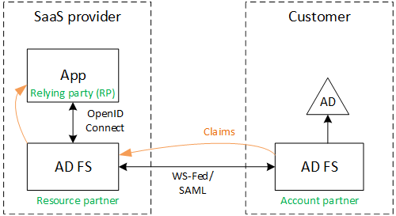

<properties
   pageTitle="Partnerverbund mit einem Kunden AD FS | Microsoft Azure"
   description="Wie ist zu vereinheitlichen mit einem Kunden AD FS in einer mandantenfähigen Anwendung"
   services=""
   documentationCenter="na"
   authors="JohnPWSharp"
   manager="roshar"
   editor=""
   tags=""/>

<tags
   ms.service="guidance"
   ms.devlang="dotnet"
   ms.topic="article"
   ms.tgt_pltfrm="na"
   ms.workload="na"
   ms.date="06/02/2016"
   ms.author="v-josha"/>

# <a name="federating-with-a-customers-ad-fs-for-multitenant-apps-in-azure"></a>Partnerverbund mit einem Kunden AD FS für mandantenfähigen in Azure-apps

[AZURE.INCLUDE [pnp-header](../../includes/guidance-pnp-header-include.md)]

Dieser Artikel ist [Teil einer Serie]. Es gibt auch eine vollständige [Beispiel-Anwendung] , die dieser Reihe begleitet.

Dieser Artikel beschreibt, wie eine SaaS-Anwendung mit mehreren Mandanten Authentifizierung über Active Directory Federation Services (AD FS), um mit einem Kunden AD FS zusammenarbeitet unterstützen.

## <a name="overview"></a>(Übersicht)

Azure Active Directory (Azure AD) erleichtert Azure AD-Mandanten, einschließlich Office365 und Dynamics CRM Online Kunden Benutzer anmelden müssen. Aber Wissenswertes zum Benutzer von mit lokalen Active Directory im Intranet?

Eine Möglichkeit ist für diese Kunden ihre AD lokal mit Azure AD, mit [Azure AD verbinden]synchronisieren. Jedoch möglicherweise einige Kunden dieser Ansatz, aufgrund von IT die Richtlinien des Unternehmens oder aus anderen Gründen nicht verwenden. In diesem Fall ist eine andere Option Föderation durch Active Directory Federation Services (AD FS) ein.

So aktivieren Sie dieses Szenario:

-   Der Kunden muss eine Internet zugänglichen AD FS-Farm sein.
-   Der Anbieter SaaS bereitstellt eigene AD FS-Farm.
-   [Föderation Trust]müssen den Kunden und den Anbieter SaaS einrichten. Dies ist ein manueller Prozess.

Es gibt drei wichtigste Rollen in der Beziehung Trust aus:

-   Der vom Kunden AD FS ist der [Kontopartner], für die Benutzer aus den Kunden Authentifizierung zuständig ist AD und Sicherheitstoken mit Ansprüchen Benutzer erstellen.
-   Den SaaS-Anbieter AD FS ist der [Ressourcenpartner], des Kontopartners vertraut und die Benutzeransprüche empfängt.
-   Die Anwendung wird als eine vertrauende (RP) in den SaaS-Anbieter AD FS konfiguriert.

    

> [AZURE.NOTE] In diesem Artikel wird davon ausgegangen die Anwendung verwendeten OpenID als Authentifizierungsprotokoll verbinden. Eine weitere Möglichkeit besteht darin, WS-Verbund verwenden.

> Für OpenID verbinden, muss der SaaS-Anbieter verwenden, AD FS 4.0 in Windows Server 2016, die derzeit in Technical Preview wird ausgeführt. AD FS 3.0 unterstützt keine OpenID verbinden.

> ASP.NET Core 1.0 enthält Out-of-Box-Unterstützung für WS-Verbund nicht.

Ein Beispiel für die Verwendung von WS-Verbund mit ASP.NET 4, finden Sie in der [Stichprobe aktiv-Directory-Dotnet-Webapp-Wsfederation][active-directory-dotnet-webapp-wsfederation].

## <a name="authentication-flow"></a>Authentifizierung Fluss

1.  Wenn der Benutzer klickt "Anmelden", leitet die Anwendung an einen Endpunkt OpenID Verbinden des SaaS-Anbieters AD FS.
2.  Der Benutzer eingibt vertretene organisationsinterne Benutzernamen ("`alice@corp.contoso.com`"). AD FS verwendet Startbereichs Suche, um die in der vom Kunden AD FS, umgeleitet, wo der Benutzer ihre Anmeldeinformationen eingibt.
3.  Der vom Kunden AD FS sendet Benutzeransprüche zu den SaaS-Anbieter AD FS, mithilfe von WF-Verbund (oder SAML).
4.  Ansprüche Datenfluss aus AD FS bei der app, die mit OpenID verbinden. Setzt einen Protokollübergang aus WS-Federation.

## <a name="limitations"></a>Einschränkungen

Zum Zeitpunkt der Erstellung dieses Dokuments erhält die Anwendung eine begrenzte Anzahl von Ansprüchen in der Id_token OpenID an, in der folgenden Tabelle aufgeführt. AD FS 4.0 wird weiterhin Vorschau, sodass Sie diesen Datensatz geändert werden kann. Es ist nicht zum Definieren von zusätzlicher Ansprüchen aktuell möglich:

Anfordern   | Beschreibung
------|-------------
also | Zielgruppe. Die Anwendung, für die die Claims ausgestellt wurden.
AuthenticationInstant   | [Sofortsuche Authentifizierung]. Der Zeitpunkt der Authentifizierung aufgetreten ist.
c_hash  | Code Hashwert. Dies ist ein Hash des Inhalts der token.
EXP | [Ablaufzeit]. Die Zeit, nach der das Token nicht mehr akzeptiert wird.
IAT | [Bei ausgestellt]. Die Uhrzeit, wann das Token ausgestellt wurde.
ISS | Herausgeber. Der Wert von dieser Anspruch ist immer des Ressourcenpartners AD FS.
Namen    | Name des Benutzers. Beispiel: `john@corp.fabrikam.com`.
NameIdentifier | [Bezeichner für Name]. Der Bezeichner für den Namen der Entität, für die das Token ausgestellt wurde.
Nonce   | Sitzung Nonce. Ein eindeutiger Wert, der von AD FS zu verhindern, dass Wiedergabe Angriffen generiert.
Benutzerprinzipalnamen | Benutzerprinzipalnamen (UPN). Beispiel:john@corp.fabrikam.com
pwd_exp | Ablaufzeitraum für das Kennwort ein. Die Anzahl von Sekunden, bis das Kennwort des Benutzers oder eine ähnliche Authentifizierung geheim, beispielsweise eine PIN. läuft ab.

> [AZURE.NOTE] Die "Iss" beanspruchen enthält die AD FS des Partners (in der Regel, diese anfordern wird die SaaS-Anbieter wie der Herausgeber identifizieren). Es können keine der vom Kunden AD FS erkannt. Sie können die Kunden Domäne als Teil der UPN suchen.

Im weiteren Verlauf dieses Artikels beschrieben, wie die Vertrauensstellung zwischen der RP (der app) und dem Kontopartner (Kunde) einrichten.

## <a name="ad-fs-deployment"></a>AD FS-Bereitstellung

Der Anbieter SaaS kann AD FS lokal oder auf Azure-virtuellen Computern bereitstellen. Für die Sicherheit und Verfügbarkeit sind wichtig die folgenden Richtlinien:

-   Bereitstellen von mindestens zwei ADFS-Server und zwei AD FS Proxy-Servern die optimale Verfügbarkeit von dem AD FS-Dienst zu erzielen.
-   Domänencontroller und AD FS-Servern sollten nie direkt mit dem Internet verfügbar gemacht werden, und sollten in einem virtuellen Netzwerk mit direkten Zugriff darauf.
-   ADFS-Server mit dem Internet veröffentlichen, müssen Web Dienstanwendungsproxys (zuvor AD FS-Proxy) verwendet werden.

Zum Einrichten von erfordert eine ähnliche Suchtopologie in Azure die Verwendung von virtuellen Netzwerken, NSGs, Azure virtuellen Computers und Verfügbarkeit Sätze. Weitere Informationen hierzu finden Sie unter [Richtlinien zum Bereitstellen von Windows Server Active Directory auf Azure virtuellen Computern][active-directory-on-azure].

## <a name="configure-openid-connect-authentication-with-ad-fs"></a>Konfigurieren der Authentifizierung OpenID Verbinden mit AD FS

SaaS-Anbieter muss zwischen der Anwendung und AD FS OpenID verbinden aktivieren. Fügen Sie hierzu in AD FS einer Anwendungsgruppe hinzu.  Sie finden Sie ausführliche Anweisungen in diesen [Blogbeitrag], klicken Sie unter "Einrichten einer Web App für OpenId verbinden melden Sie sich AD FS." 

Konfigurieren Sie anschließend die Middleware OpenID verbinden. Ist der Metadaten-Endpunkt `https://domain/adfs/.well-known/openid-configuration`, wobei Domäne den SaaS-Anbieter AD FS-Domäne ist.

Sie können dies in der Regel mit anderen Endpunkten OpenID verbinden (beispielsweise AAD) kombinieren. Sie benötigen zwei verschiedenen Anmeldung Schaltflächen oder eine andere Möglichkeit zum unterscheiden können, so dass der Benutzer an den Endpunkt erforderliche Authentifizierung gesendet wird.

## <a name="configure-the-ad-fs-resource-partner"></a>Konfigurieren des AD FS-Ressource Partners

SaaS-Anbieter muss Folgendes für jeden Kunden ausführen, die über ADFS eine Verbindung herstellen möchte:

1.  Hinzufügen einer Ansprüche Anbieter vertrauen.
2.  Hinzufügen von Regeln für Ansprüche.
3.  Aktivieren Sie Start-Bereich Discovery.

Folgen die Schritten ausführlicher aus.

### <a name="add-the-claims-provider-trust"></a>Fügen Sie das Ansprüche Anbieter vertrauen hinzu

1.  Klicken Sie im Server-Manager auf **Extras**, und wählen Sie dann auf **AD FS-Verwaltung**.
2.  Im Strukturbaum, klicken Sie unter **AD FS**nach rechts klicken Sie auf **Ansprüche Anbieter vertraut**. Wählen Sie die **Ansprüche Anbieter Trust hinzufügen**.
3.  Klicken Sie auf **Starten** , um den Assistenten zu starten.
4.  Wählen Sie die Option "Daten importieren zu den Ansprüche Anbieter veröffentlicht Online- oder in einem lokalen Netzwerk" aus. Geben Sie den URI von der vom Kunden Föderation Metadaten-Endpunkt aus. (Beispiel: `https://contoso.com/FederationMetadata/2007-06/FederationMetadata.xml`.) Sie müssen Sie diese in den Kunden abrufen.
5.  Führen Sie den Assistenten unter Verwendung der Standardoptionen an.

### <a name="edit-claims-rules"></a>Ansprüche Regeln bearbeiten

1.  Mit der rechten Maustaste in der neu hinzugefügte Ansprüche Anbieter Vertrauensstellung, und wählen Sie **Ansprüche Regeln bearbeiten**.
2.  Klicken Sie auf **Regel hinzufügen**.
3.  Wählen Sie "Übergeben bis oder Filter ein eingehenden Anspruch" aus, und klicken Sie auf **Weiter**.
    
4.  Geben Sie einen Namen für die Regel ein.
5.  Wählen Sie unter "Eingehende anfordern Typ" **UPN**aus.
6.  Wählen Sie "Pass-through-alle beanspruchen Werte" aus.
  
7.  Klicken Sie auf **Fertig stellen**.
8.  Wiederholen Sie die Schritte 2 bis 7, und **Beanspruchen Ankertyp** für den eingehenden anfordern Typ angeben.
9.  Klicken Sie auf **OK** , um den Assistenten zu beenden.

### <a name="enable-home-realm-discovery"></a>Start-Bereich Discovery aktivieren
Führen Sie das folgende PowerShell-Skript ein:

```
Set-ADFSClaimsProviderTrust -TargetName "name" -OrganizationalAccountSuffix @("suffix")
```

wobei "Name" ist der angezeigte Name der Vertrauensstellung Anbieter Ansprüche und "Suffix" ist der UPN für den Kunden ist AD (z. B. "corp.fabrikam.com").

Mit dieser Konfiguration können Endbenutzer Organisations-Konto eingeben, und AD FS wählt automatisch den entsprechenden Ansprüche Anbieter. Finden Sie unter [Anpassen der AD FS-anmelden Seiten], unter dem Abschnitt "Identitätsanbieter Konfigurieren bestimmter e-Mail-Suffixe verwenden".

## <a name="configure-the-ad-fs-account-partner"></a>Konfigurieren des AD FS-Konto Partners

Der Kunde muss folgendermaßen vorgehen:

1.  Hinzufügen einer sich verlassen Party (RP) vertrauen.
2.  Ansprüche Regeln hinzugefügt.

### <a name="add-the-rp-trust"></a>Fügen Sie die RP Vertrauensstellung hinzu.

1.  Klicken Sie im Server-Manager auf **Extras**, und wählen Sie dann auf **AD FS-Verwaltung**.
2.  Im Strukturbaum, klicken Sie unter **AD FS**nach rechts klicken Sie auf **Vertrauen verlassen**. Wählen Sie **sich zu verlassen Party Trust hinzufügen**.
3.  Wählen Sie **Bei Ansprüche beachten** , und klicken Sie auf **Start**.
4.  Wählen Sie auf der Seite **Datenquelle auswählen** die Option "Daten importieren zu den Ansprüche Anbieter veröffentlicht Online- oder in einem lokalen Netzwerk" aus. Geben Sie den URI der Föderation Metadaten-Endpunkt des SaaS-Anbieters aus.
  
5.  Geben Sie auf der Seite **Anzeigename angeben** einen beliebigen Namen ein.
6.  Wählen Sie auf der Seite **Wählen Sie Zugriffsrichtlinie** einer Richtlinie ein. Jede Person in der Organisation zulassen können, oder wählen Sie eine bestimmte Sicherheitsgruppe.
  
7.  Geben Sie alle Parameter in das Feld **Richtlinie** erforderlich.
8.  Klicken Sie auf **Weiter** , um zu den-Assistenten auszuführen.

### <a name="add-claims-rules"></a>Hinzufügen von Regeln für Ansprüche

1.  Mit der rechten Maustaste in der neu hinzugefügte sich verlassen Partei Vertrauensstellung, und wählen Sie **Anspruch Emission Richtlinie bearbeiten**.
2.  Klicken Sie auf **Regel hinzufügen**.
3.  Wählen Sie "Senden LDAP-Attribute als Ansprüche" aus, und klicken Sie auf **Weiter**.
4.  Geben Sie einen Namen für die Regel ein, beispielsweise "Benutzerprinzipalnamen" aus.
5.  Wählen Sie unter **Attribut speichern** **Active Directory**ein.
  
6.  Im Abschnitt **Zuordnung von LDAP-Attribute** :
  - Wählen Sie unter **LDAP-Attribut** **Der Tilgungsanteile Benutzernamen**ein.
  - Wählen Sie unter **Ausgehenden anfordern Typ** **UPN**aus.
  
7.  Klicken Sie auf **Fertig stellen**.
8.  Klicken Sie erneut auf **Regel hinzufügen** .
9.  Wählen Sie "Senden Ansprüche verwenden ein benutzerdefiniertes Regel", und klicken Sie auf **Weiter**.
10. Geben Sie einen Namen für die Regel ein, beispielsweise "Ankertyp anfordern" aus.
11. Klicken Sie unter **benutzerdefinierte Regel**Geben Sie Folgendes ein:

    ```
    EXISTS([Type == "http://schemas.microsoft.com/ws/2014/01/identity/claims/anchorclaimtype"])=>
      issue (Type = "http://schemas.microsoft.com/ws/2014/01/identity/claims/anchorclaimtype",
             Value = "http://schemas.xmlsoap.org/ws/2005/05/identity/claims/upn");
    ```

    Mit dieser Regel Probleme einen Antrag vom Typ `anchorclaimtype`. Der Anspruch weist die relying Party Benutzerprinzipalnamen als unveränderlich ID des Benutzers verwendet

12. Klicken Sie auf **Fertig stellen**.
13. Klicken Sie auf **OK** , um den Assistenten zu beenden.

## <a name="next-steps"></a>Nächste Schritte

- Lesen Sie den nächsten Artikel in dieser Reihe: [Client-Assertion abzurufenden Access Token aus Azure AD-verwenden][client assertion]

<!-- Links -->
[Teil einer Serie]: guidance-multitenant-identity.md
[Verbinden von Azure AD]: ../active-directory/active-directory-aadconnect.md
[Föderation trust]: https://technet.microsoft.com/library/cc770993(v=ws.11).aspx
[Kontopartner]: https://technet.microsoft.com/library/cc731141(v=ws.11).aspx
[Ressourcenpartner für]: https://technet.microsoft.com/library/cc731141(v=ws.11).aspx
[Sofortsuche Authentifizierung]: https://msdn.microsoft.com/library/system.security.claims.claimtypes.authenticationinstant%28v=vs.110%29.aspx
[Ablaufzeit]: http://tools.ietf.org/html/draft-ietf-oauth-json-web-token-25#section-4.1.4
[Ausgestellt am]: http://tools.ietf.org/html/draft-ietf-oauth-json-web-token-25#section-4.1.6
[Namensbezeichner]: https://msdn.microsoft.com/library/system.security.claims.claimtypes.nameidentifier(v=vs.110).aspx
[active-directory-on-azure]: https://msdn.microsoft.com/library/azure/jj156090.aspx
[Blogbeitrag]: http://www.cloudidentity.com/blog/2015/08/21/OPENID-CONNECT-WEB-SIGN-ON-WITH-ADFS-IN-WINDOWS-SERVER-2016-TP3/
[Anpassen der AD FS-anmelden Seiten]: https://technet.microsoft.com/library/dn280950.aspx
[Beispiel-Anwendung]: https://github.com/Azure-Samples/guidance-identity-management-for-multitenant-apps
[client assertion]: guidance-multitenant-identity-client-assertion.md
[active-directory-dotnet-webapp-wsfederation]: https://github.com/Azure-Samples/active-directory-dotnet-webapp-wsfederation
