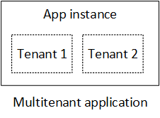

<properties
   pageTitle="Identitätsmanagement für Applikationen mandantenfähigen | Microsoft Azure"
   description="Einführung in das Identitätsmanagement in mandantenfähigen Clientanwendungen"
   services=""
   documentationCenter="na"
   authors="MikeWasson"
   manager="roshar"
   editor=""
   tags=""/>

<tags
   ms.service="guidance"
   ms.devlang="dotnet"
   ms.topic="article"
   ms.tgt_pltfrm="na"
   ms.workload="na"
   ms.date="06/02/2016"
   ms.author="mwasson"/>

# Einführung in das Identitätsmanagement für mandantenfähigen Applikationen in Microsoft Azure

[AZURE.INCLUDE [pnp-header](../../includes/guidance-pnp-header-include.md)]

Dieser Artikel ist [Teil einer Serie]. Es gibt auch eine vollständige [Beispiel-Anwendung] , die dieser Reihe begleitet.

Angenommen, Sie schreiben ein Unternehmen SaaS-Anwendung, in der Cloud gehostet werden. Die Anwendung wird natürlich Benutzer haben:

Aber diese Benutzer zu Organisationen gehören:

Beispiel: Tailspin verkauft Abonnements auf seine SaaS-Anwendung. Contoso und Fabrikam registrieren sich für die app an. Wenn Alice (`alice@contoso`) Vorzeichen in, an die Anwendung wissen sollten, dass Alice Contoso gehört.

- Alice _sollte_ Zugang zu Contoso-Daten.
- Alice _sollte nicht_ Zugang zu Fabrikam Daten.

Dieser Leitfaden wird gezeigt, wie zum Verwalten von Benutzeridentitäten in einer mandantenfähigen mit [Azure Active Directory] Anwendung[ AzureAD] (Azure AD), Anmeldung und Authentifizierung zu behandeln.

## Was ist multitenancy?

Einen _Mandanten_ ist eine Gruppe von Benutzern. In einer Anwendung SaaS ist der Mandanten ein Abonnent oder Kunden der Anwendung. _Tenancy_ ist eine Architektur, in dem mehrere Mandanten dieselbe physische Instanz der app freigeben. Obwohl Mandanten physische Ressourcen (z. B. virtuellen Computern oder Speicher) freigeben, ruft jede Mandanten eine eigene logische Instanz der app ab.

In der Regel werden Anwendungsdaten zwischen den Benutzern in einen Mandanten, jedoch nicht mit anderen Mandanten freigegeben.

Vergleichen Sie diese Architektur mit einer Single-Mandanten Architektur, bei denen jede Mandanten eine dedizierte physische Instanz ist. In einer Architektur Single-Mandanten fügen Sie Mandanten dreht von neue Instanzen der app hinzu.

### Multitenancy und horizontalen Skalierung

Zum Skalieren in der Cloud zu erreichen, ist es häufig weitere physische Instanzen hinzufügen. Dies wird als _horizontale Skalierung_ oder _Skalierung_bezeichnet. Erwägen Sie eine Web app an. Um weitere Datenverkehr zu verarbeiten, können Sie weitere Server virtuellen Computern hinzufügen und setzen sie hinter einem Lastenausgleich. Jeder virtueller Computer ausgeführt wird, eine separate physische Instanz des Web app.

Alle Anforderung kann an einer beliebigen Instanz weitergeleitet werden. Zusammen, funktioniert das System als einzelne logische Instanz ein. Beenden eines virtuellen Computers oder drehen Sicherungskopie eines neuen virtuellen Computers, ohne Benutzer können. In dieser Architektur jede physische Instanz ist mit mehreren Mandanten, und Sie skalieren, indem Sie mehrere Instanzen hinzufügen. Wenn nur eine Instanz nach unten geht, sollte es keinen Einfluss auf alle Mandanten.

## In einer app mandantenfähigen Identität

In einer app mandantenfähigen müssen Benutzer im Kontext des Mandanten berücksichtigt werden.

**Authentifizierung**

- Benutzer melden Sie sich bei der app mit ihrer Organisation Anmeldeinformationen. Sie müssen nicht neue Benutzerprofile für die app zu erstellen.
- Benutzer innerhalb derselben Organisation gehören die gleichen Mandanten.
- Wenn sich der Benutzer anmeldet, weiß die Anwendung, welche Mandanten, die der Benutzer gehört.

**Autorisierung**

- Wenn eine Benutzeraktionen (beispielsweise eine Ressource anzeigen) zu autorisieren, muss die app des Benutzers Mandanten berücksichtigen.
- Benutzer können Rollen innerhalb der Anwendung, wie etwa "Administrator" oder "Standardbenutzer" zugewiesen werden. Rollenzuweisungen sollten vom Kunden, nicht durch den SaaS-Anbieter verwaltet werden.

**Beispiel für.** Tanja arbeitet eines Mitarbeiters bei Contoso, mit der Anwendung in ihrem Browser navigiert und klickt auf die Schaltfläche "Anmelden". Anna wird auf einen Anmeldebildschirm umgeleitet, wo sie ihre corporate Anmeldeinformationen (Benutzername und Kennwort) gibt. An diesem Punkt Anna die app als angemeldet ist `alice@contoso.com`. Die Anwendung weiß auch, dass Alice ein Administratorbenutzer für diese Anwendung ist. Da Anna Administrator ist, kann ihr eine Liste aller Ressourcen angezeigt, die Contoso angehören. Allerdings kann Anna Fabrikams Ressourcen, anzeigen, da Anna Administrator nur in ihrem Mandanten ist.

In diesem Handbuch betrachten wir speziell Azure AD-für die Verwaltung von Identität.

- Wir wird davon ausgegangen, dass der Kunden ihre Benutzerprofile in Azure AD (einschließlich Office365 und Dynamics CRM Mandanten) speichert
- Kunden mit lokal Active Directory (AD) können [Azure AD verbinden] [ ADConnect] , deren AD lokal mit Azure AD synchronisieren.

Wenn ein Kunde mit lokal AD Azure AD-verbinden (aufgrund von IT die Richtlinien des Unternehmens oder aus anderen Gründen) verwenden kann, ist der Anbieter mit dem Kunden zusammenarbeitet kann SaaS AD durch Active Directory Federation Services (AD FS). Diese Option ist in [Föderation mit einem Kunden AD FS]beschrieben.

Dieser Leitfaden betrachtet nicht weitere Aspekte des Tenancy wie Datenpartitionierung, pro Mandant Konfiguration und So weiter.

## Nächste Schritte

- Lesen Sie den nächsten Artikel in dieser Reihe: [Informationen zu Tailspin Umfragen Anwendung][tailpin]

<!-- Links -->
[ADConnect]: ../active-directory/active-directory-aadconnect.md
[AzureAD]: https://azure.microsoft.com/documentation/services/active-directory/
[Teil einer Serie]: guidance-multitenant-identity.md
[Partnerverbund mit einem Kunden AD FS]: guidance-multitenant-identity-adfs.md
[Beispiel-Anwendung]: https://github.com/Azure-Samples/guidance-identity-management-for-multitenant-apps
[tailpin]: guidance-multitenant-identity-tailspin.md
