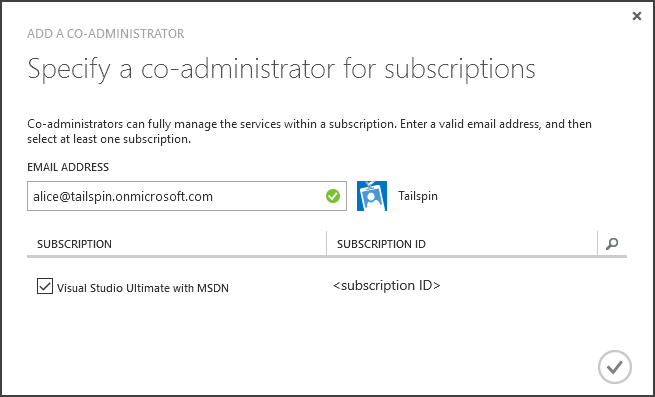

<properties
   pageTitle="Mit Schlüssel Tresor Anwendung Kennwörter schützen | Microsoft Azure"
   description="Wie eine Nutzung der Schlüssel Tresor Dienst Anwendung Kennwörter gespeichert"
   services=""
   documentationCenter="na"
   authors="MikeWasson"
   manager="roshar"
   editor=""
   tags=""/>

<tags
   ms.service="guidance"
   ms.devlang="dotnet"
   ms.topic="article"
   ms.tgt_pltfrm="na"
   ms.workload="na"
   ms.date="02/16/2016"
   ms.author="mwasson"/>

# <a name="using-azure-key-vault-to-protect-application-secrets"></a>Verwenden von Azure-Taste Tresor Anwendung Kennwörter schützen

[AZURE.INCLUDE [pnp-header](../../includes/guidance-pnp-header-include.md)]

Dieser Artikel ist [Teil einer Serie]. Es gibt auch eine vollständige [Beispiel-Anwendung] , die dieser Reihe begleitet.

## <a name="overview"></a>(Übersicht)

Es ist Anwendungseinstellungen haben, die/Kleinschreibung und geschützt werden müssen, wie üblich:

- Datenbank Verbindungszeichenfolgen
- Kennwörter
- Cryptographic Tasten

Als Erhöhung der Sicherheit Sie sollten nie speichern diese vertraulichen Daten im Datenquellen-Steuerelement. Es ist auch einfach bis verloren gehen &mdash; , auch wenn Ihre Quelle Code Repository privat ist. Und es ist nicht fast geheimen Informationen aus den allgemeinen öffentlichen. Klicken Sie auf größere Projekte möglicherweise Entwickler einschränken möchten, und Operatoren der Herstellung Kennwörter zugreifen können. (Einstellungen für Tests oder einer Entwicklung Umgebungen unterscheiden sich.)

Eine sicherere Möglichkeit besteht darin, diese Kennwörter in [Azure Schlüssel Tresor]gespeichert[KeyVault]. Tresor Schlüssel ist ein gehostete Cloud-Dienst für die Verwaltung von cryptographic Tasten und anderen vertraulichen. In diesem Artikel veranschaulicht, wie Schlüssel Tresor Konfigurationen für die Sie app gespeichert.

Die [Tailspin Umfragen] [ Surveys] Anwendung die, die folgenden Einstellungen sind Geheimnis:

- Die Datenbank-Verbindungszeichenfolge.
- Die Verbindungszeichenfolge Redis.
- Das Client-Kennwort für das Web-Anwendung.

Zum Speichern von Konfiguration Kennwörter in Schlüssel Tresor implementiert die Anwendung Umfragen einen benutzerdefinierte Konfiguration-Anbieter, dem in das ASP.NET Core 1.0- [Konfigurationssystem]eingebunden[configuration]. Der benutzerdefinierte Anbieter liest Konfiguration Einstellungen aus Tresor Schlüssel beim Start.

Die Anwendung Umfragen lädt Konfiguration Einstellungen aus den folgenden Stellen:

- Die appsettings.json-Datei
- Die [vertrauliche Benutzerdaten speichern] [ user-secrets] (Entwicklungsumgebung nur; zu Testzwecken)
- Hosting-Umgebung (Appeinstellungen in Azure Web apps)
- Key Tresor

Jede Außerkraftsetzen das vorherige Schema, damit die Änderungen an den Einstellungen Schlüssel Tresor gehörende Kehrmatrix Vorrang haben.

> [AZURE.NOTE] Standardmäßig ist der Taste Tresor Konfigurationsanbieter deaktiviert. Es ist nicht erforderlich, für die Anwendung lokal ausgeführt wird. Sie möchten sie in einer Bereitstellung Herstellung aktivieren.

> Der Taste Tresor Anbieter wird derzeit nicht unterstützt für .NET Core, da es die [Microsoft.Azure.KeyVault] erfordert[ Microsoft.Azure.KeyVault] Paket.

Beim Start die Anwendung liest Einstellungen aus jeder Anbieter registrierten Konfiguration, und anschließend zum Füllen eines Objekts stark eingegebenen Optionen verwendet werden. (Weitere Informationen finden Sie unter [Verwenden von Optionen und Konfigurationsobjekte][options].)

## <a name="implementation"></a>Implementierung

Die [KeyVaultConfigurationProvider] [ KeyVaultConfigurationProvider] Klasse ist ein Konfigurationsanbieter, die an der ASP.NET Core 1.0- [Konfigurationssystem]angeschlossen ist[configuration].

Verwenden der `KeyVaultConfigurationProvider`, rufen Sie die `AddKeyVaultSecrets` Erweiterungsmethode in der Startklasse:

```csharp
    var builder = new ConfigurationBuilder()
        .SetBasePath(appEnv.ApplicationBasePath)
        .AddJsonFile("appsettings.json");

    if (env.IsDevelopment())
    {
        builder.AddUserSecrets();
    }
    builder.AddEnvironmentVariables();
    var config = builder.Build();

    // Add key vault configuration:
    builder.AddKeyVaultSecrets(config["AzureAd:ClientId"],
        config["KeyVault:Name"],
        config["AzureAd:Asymmetric:CertificateThumbprint"],
        Convert.ToBoolean(config["AzureAd:Asymmetric:ValidationRequired"]),
        loggerFactory);
```

Beachten Sie, dass `KeyVaultConfigurationProvider` erfordert einige Einstellungen Konfiguration, die in einem anderen Quellen Konfiguration gespeichert werden müssen.

Wenn die Anwendung gestartet wird, `KeyVaultConfigurationProvider` Listet alle die vertrauliche Informationen in die wichtigsten Tresor. Für jede geheim sieht es für eine Kategorie mit dem Namen 'ConfigKey'. Der Wert der Kategorie ist der Name der Einstellung Konfiguration.

> [AZURE.NOTE] [Kategorien] [ key-tags] optionale Metadaten, die mit einem Schlüssel gespeichert sind. Kategorien werden hier verwendet werden, da die Namen der Schlüssel Doppelpunkt (:) Zeichen enthalten können.

```csharp
var kvClient = new KeyVaultClient(GetTokenAsync);
var secretsResponseList = await kvClient.GetSecretsAsync(_vault, MaxSecrets, token);
foreach (var secretItem in secretsResponseList.Value)
{
    //The actual config key is stored in a tag with the Key "ConfigKey"
    // because ':' is not supported in a shared secret name by Key Vault.
    if (secretItem.Tags != null && secretItem.Tags.ContainsKey(ConfigKey))
    {
        var secret = await kvClient.GetSecretAsync(secretItem.Id, token);
        Data.Add(secret.Tags[ConfigKey], secret.Value);
    }
}
```

> [AZURE.NOTE] Finden Sie unter [KeyVaultConfigurationProvider.cs].

## <a name="setting-up-key-vault-in-the-surveys-app"></a>Einrichten von Key Tresor in der app Umfragen

Voraussetzungen für:

- Installieren Sie die [Azure Ressourcenmanager Cmdlets][azure-rm-cmdlets].
- Konfigurieren Sie die Anwendung Umfragen in [die Umfragen läuft]beschriebenen[readme].

Allgemeine Schritte aus:

1. Richten Sie einen Administratorbenutzer in den Mandanten aus.
2. Richten Sie ein Client-Zertifikat aus.
3. Erstellen eines Key Tresor.
4. Fügen Sie die zu den wichtigsten Tresor.
5. Entfernen Sie die Kommentarzeichen des Codes, die wichtigsten Tresor ermöglicht.
6. Aktualisieren der Anwendung Benutzer Kennwörter an.

### <a name="set-up-an-admin-user"></a>Einrichten von Administrator

> [AZURE.NOTE] Zum Erstellen eines Key Tresor müssen Sie ein Konto verwenden, denen Ihr Abonnement Azure verwalten können. Darüber hinaus muss jede Anwendung, die Sie zum Lesen aus dem Key Tresor autorisieren im gleichen Mandanten als diesem Konto registriert.

In diesem Schritt werden Stellen Sie sicher, dass Sie eine Key Tresor während angemeldet als Benutzer aus den Mandanten erstellen können, in dem die app Umfragen registriert ist.

Ändern Sie zunächst Verzeichnis mit Ihrer Azure-Abonnement verknüpft ist.

1. Melden Sie sich bei der [Azure-Verwaltungsportal][azure-management-portal]

2. Klicken Sie auf **Einstellungen**.

    

3. Wählen Sie Ihr Abonnement Azure aus.

4. Klicken Sie auf **Bearbeiten Directory** am unteren Rand des Portals.

    

5. In "Ändern Sie zugeordnete Verzeichnis", wählen Sie den Azure AD-Mandanten, wo die Anwendung Umfragen registriert ist,

    

6. Klicken Sie auf die Schaltfläche mit dem Pfeil, und führen Sie im Dialogfeld.

Erstellen Sie einen Administratorbenutzer innerhalb des Azure AD-Mandanten, wo die Anwendung Umfragen registriert ist.

1. Melden Sie sich bei der [Azure-Verwaltungsportal][azure-management-portal].

2. Wählen Sie aus den Azure AD-Mandanten, in dem die Anwendung registriert wird.

3. Klicken Sie auf **Benutzer** > **Benutzer hinzufügen**.

4. Klicken Sie im Dialogfeld **Benutzer hinzufügen** weisen Sie den Benutzer zu der Rolle des globalen Administrators ein.

Fügen Sie den Administratorbenutzer als Administrator für Ihr Abonnement Azure gemeinsame hinzu.

1. Melden Sie sich bei der [Azure-Verwaltungsportal][azure-management-portal].

2. Klicken Sie auf **Einstellungen** , und wählen Sie Ihr Abonnement Azure.

3. Klicken Sie auf **Administratoren**

4. Klicken Sie auf **Hinzufügen** , am unteren Rand des Portals.

5. Geben Sie die e-Mail von der Administratorbenutzer, den Sie zuvor erstellt haben.

6. Aktivieren Sie das Kontrollkästchen für das Abonnement.

7. Klicken Sie auf die Schaltfläche mit dem Häkchen, um das Dialogfeld abzuschließen.




### <a name="set-up-a-client-certificate"></a>Richten Sie ein Client-Zertifikat

1. Ausführen der PowerShell-Skript [/Scripts/Setup-KeyVault.ps1] [ Setup-KeyVault] wie folgt:
    ```
    .\Setup-KeyVault.ps1 -Subject <<subject>>
    ```
    Für die `Subject` Parameter, geben Sie einen beliebigen Namen ein, beispielsweise "Surveysapp". Das Skript ein selbst signiertes Zertifikat generiert und im Zertifikatspeicher "Aktueller Benutzer/eigene" gespeichert wird.

2. Die Ausgabe des Skripts ist ein JSON-Fragment. Fügen Sie diese wie folgt auf das Anwendungsmanifest des Web-app:

    1. Melden Sie sich bei der [Azure-Verwaltungsportal] [ azure-management-portal] und navigieren Sie zu Ihrem Verzeichnis Azure AD-.

    2. Klicken Sie auf **Anwendungen**.

    3. Wählen Sie die Anwendung Umfragen.

    4.  Klicken Sie auf **Manifest verwalten** , und wählen Sie die **Manifest herunterladen**.

    5.  Öffnen Sie die JSON-Manifestdatei in einem Text-Editor ein. Fügen Sie das Skript in die Ausgabe der `keyCredentials` Eigenschaft. Es sollte etwa wie folgt aussehen:
    ```
            "keyCredentials": [
                {
                  "type": "AsymmetricX509Cert",
                  "usage": "Verify",
                  "keyId": "29d4f7db-0539-455e-b708-....",
                  "customKeyIdentifier": "ZEPpP/+KJe2fVDBNaPNOTDoJMac=",
                  "value": "MIIDAjCCAeqgAwIBAgIQFxeRiU59eL.....
                }
              ],
    ```          
    6.  Speichern der Änderungen auf die JSON-Datei.

    7.  Wechseln Sie wieder zum Portal. Klicken Sie auf **Verwalten Manifest** > **Manifest hochladen** und Hochladen der JSON-Datei.

3. Fügen Sie die gleichen JSON-Fragment Anwendungsmanifest der im Web-API (Surveys.WebAPI) hinzu.

4. Führen Sie den folgenden Befehl aus, um den Fingerabdruck des Zertifikats erhalten.
    ```
    certutil -store -user my [subject]
    ```
    wo `[subject]` ist der Wert, den Sie in der PowerShell-Skript zum Thema angegeben. Der Fingerabdruck ist unter "Zertifikat Hash(SHA1):" aufgeführt. Entfernen Sie die Leerzeichen zwischen den hexadezimalen Zahlen.

Verwenden Sie den Fingerabdruck später.

### <a name="create-a-key-vault"></a>Erstellen eines Key Tresor

1. Ausführen der PowerShell-Skript [/Scripts/Setup-KeyVault.ps1] [ Setup-KeyVault] wie folgt:

    ```
    .\Setup-KeyVault.ps1 -KeyVaultName <<key vault name>> -ResourceGroupName <<resource group name>> -Location <<location>>
    ```

    Wenn Sie Anmeldeinformationen aufgefordert werden, melden Sie sich als Azure AD-Benutzer, die Sie zuvor erstellt haben. Das Skript erstellt eine neue Ressourcengruppe und eine neue Key Tresor innerhalb dieser Ressourcengruppe.

    Hinweis: für den Parameter Speicherort Sie können den folgenden PowerShell-Befehl verwenden, können Sie eine Liste der gültigen Regionen gelangen:

    ```
    Get-AzureRmResourceProvider -ProviderNamespace "microsoft.keyvault" | Where-Object { $_.ResourceTypes.ResourceTypeName -eq "vaults" } | Select-Object -ExpandProperty Locations
    ```

2. Führen Sie SetupKeyVault.ps erneut, mit den folgenden Parametern aus:

    ```
    .\Setup-KeyVault.ps1 -KeyVaultName <<key vault name>> -ApplicationIds @("<<web app client ID>>", "<<web API client ID>>")
    ```

    WHERE

    - Key Tresor Name = Name, den Sie im vorherigen Schritt den wichtigsten Tresor gegeben hat.
    - Web app-Client-ID = die Client-ID für die Webanwendung Umfragen.
    - Web-api-Client-ID = die Client-ID für die Anwendung Surveys.WebAPI.

    Beispiel:
    ```
    .\Setup-KeyVault.ps1 -KeyVaultName tailspinkv -ApplicationIds @("f84df9d1-91cc-4603-b662-302db51f1031", "8871a4c2-2a23-4650-8b46-0625ff3928a6")
    ```

    > [AZURE.NOTE] Sie können den Client IDs erhalten, aus dem [Azure-Verwaltungsportal][azure-management-portal]. Wählen Sie aus den Azure AD-Mandanten, wählen Sie die Anwendung, und klicken Sie auf **Konfigurieren**.

    Mit diesem Skript wird die Web app und Web-API abzurufenden geheimen Informationen aus Ihrem Key Tresor autorisiert. Finden Sie unter [Erste Schritte mit Azure Schlüssel Tresor] [ authorize-app] Weitere Informationen.

### <a name="add-configuration-settings-to-your-key-vault"></a>Fügen Sie die zu den wichtigsten Tresor

1. Führen die SetupKeyVault.ps wie folgt aus::

    ```
    .\Setup-KeyVault.ps1 -KeyVaultName <<key vault name> -KeyName RedisCache -KeyValue "<<Redis DNS name>>.redis.cache.windows.net,password=<<Redis access key>>,ssl=true" -ConfigName "Redis:Configuration"
    ```
    WHERE

    - Key Tresor Name = Name, den Sie im vorherigen Schritt den wichtigsten Tresor gegeben hat.
    - DNS-Namen redis = der DNS-Name Ihrer Redis-Cache-Instanz.
    - Zugriffstaste redis = Tastenkombination für Ihre Redis Cacheinstanz.

    Dieser Befehl fügt einen geheimen zu den wichtigsten Tresor. Der Schlüssel ist ein Name/Wertpaar plus ein Tag:

    -   Der Name des Schlüssels wird nicht von der Anwendung verwendet, aber innerhalb der Schlüssel Tresor eindeutig sein.
    -   Der Wert ist der Wert der Option "Konfiguration" in diesem Fall die Verbindungszeichenfolge Redis.
    -   die Kategorie "ConfigKey" enthält den Namen des Konfigurations-Taste.

2. An diesem Punkt ist es eine gute Idee, testen, ob Sie die geheimen Informationen zu den wichtigsten Tresor erfolgreich gespeichert. Führen Sie den folgenden PowerShell-Befehl ein:

    ```
    Get-AzureKeyVaultSecret <<key vault name>> RedisCache | Select-Object *
    ```
    Das Ergebnis sollte die geheimen Wert sowie einige Metadaten anzeigen:

    

3. Führen Sie die SetupKeyVault.ps erneut aus, um die Verbindungszeichenfolge hinzufügen:

    ```
    .\Setup-KeyVault.ps1 -KeyVaultName <<key vault name> -KeyName ConnectionString -KeyValue <<DB connection string>> -ConfigName "Data:SurveysConnectionString"
    ```

    wo `<<DB connection string>>` ist der Wert der Verbindungszeichenfolge der Datenbank.

    Testen mit der lokalen Datenbank, kopieren Sie die Verbindungszeichenfolge aus der Datei Tailspin.Surveys.Web/appsettings.json. Wenn Sie dies tun, vergewissern Sie sich zum Ändern der umgekehrten Schrägstriche ('\\\\') in einer einzelnen umgekehrter Schrägstrich. Umgekehrten Schrägstriche ist ein Escapezeichen in der JSON-Datei.

    Beispiel:

    ```
    .\Setup-KeyVault.ps1 -KeyVaultName mykeyvault -KeyName ConnectionString -KeyValue "Server=(localdb)\MSSQLLocalDB;Database=Tailspin.SurveysDB;Trusted_Connection=True;MultipleActiveResultSets=true" -ConfigName "Data:SurveysConnectionString"
    ```

### <a name="uncomment-the-code-that-enables-key-vault"></a>Entfernen Sie die Kommentarzeichen des Codes, die Taste Tresor ermöglicht.

1. Öffnen Sie die Lösung Tailspin.Surveys.

2. In [Tailspin.Surveys.Web/Startup.cs][web-startup], suchen Sie nach den folgenden Codeblock, und entfernen Sie die Kommentarzeichen es.

    ```csharp
    //#if DNX451
    //            _configuration = builder.Build();
    //            builder.AddKeyVaultSecrets(_configuration["AzureAd:ClientId"],
    //                _configuration["KeyVault:Name"],
    //                _configuration["AzureAd:Asymmetric:CertificateThumbprint"],
    //                Convert.ToBoolean(_configuration["AzureAd:Asymmetric:ValidationRequired"]),
    //                loggerFactory);
    //#endif
    ```

3. In [Tailspin.Surveys.WebAPI/Startup.cs][web-api-startup], suchen Sie nach den folgenden Codeblock, und entfernen Sie die Kommentarzeichen es.

    ```csharp
    //#if DNX451
    //            var config = builder.Build();
    //            builder.AddKeyVaultSecrets(config["AzureAd:ClientId"],
    //                config["KeyVault:Name"],
    //                config["AzureAd:Asymmetric:CertificateThumbprint"],
    //                Convert.ToBoolean(config["AzureAd:Asymmetric:ValidationRequired"]),
    //                loggerFactory);
    //#endif
    ```

4. In [Tailspin.Surveys.Web/Startup.cs][web-startup], suchen Sie den Code, der registriert die `ICredentialService`. Kommentieren Sie die Zeile, die verwendet `CertificateCredentialService`, und kommentieren Sie die Zeile, die verwendet `ClientCredentialService`:

    ```csharp
    // Uncomment this:
    services.AddSingleton<ICredentialService, CertificateCredentialService>();
    // Comment out this:
    //services.AddSingleton<ICredentialService, ClientCredentialService>();
    ```

    Diese Änderung ermöglicht das Web app mit [Client Assertion] [ client-assertion] OAuth Access Token abgerufen. Mit Client Assertion benötigen Sie keiner OAuth Client geheim. Alternativ können Sie den Client geheim in Key Tresor speichern. Jedoch das Zertifikat Key Tresor und Client Assertion, dass beide ein Kunde, damit Sie Key Tresor aktivieren, sollten Sie auch Client Assertion aktivieren ist.

### <a name="update-the-user-secrets"></a>Aktualisieren der vertrauliche Benutzerdaten

Klicken Sie im Explorer-Lösung mit der rechten Maustaste in des Projekts Tailspin.Surveys.Web, und wählen Sie **Vertrauliche von Benutzerdaten verwalten**. Löschen Sie in der Datei secrets.json die vorhandene JSON, und fügen Sie Folgendes:

    ```
    {
      "AzureAd": {
        "ClientId": "[Surveys web app client ID]",
        "PostLogoutRedirectUri": "https://localhost:44300/",
        "WebApiResourceId": "[App ID URI of your Surveys.WebAPI application]",
        "Asymmetric": {
          "CertificateThumbprint": "[certificate thumbprint. Example: 105b2ff3bc842c53582661716db1b7cdc6b43ec9]",
          "StoreName": "My",
          "StoreLocation": "CurrentUser",
          "ValidationRequired": "false"
        }
      },
      "KeyVault": {
        "Name": "[key vault name]"
      }
    }
    ```

Ersetzen Sie die Einträge in [rechteckige Klammern gesetzt] durch die richtigen Werte ein.

- `AzureAd:ClientId`: Die Client-ID der app Umfragen.
- `AzureAd:WebApiResourceId`: Das App-ID URI, dass Sie angegeben haben, wenn Sie die Anwendung Surveys.WebAPI in Azure Active Directory erstellt haben.
- `Asymmetric:CertificateThumbprint`: Der Fingerabdruck des Zertifikats, den Sie zuvor, haben Sie bei der Erstellung von des Client-Zertifikats.
- `KeyVault:Name`: Der Name des Ihrem Key Tresor.

> [AZURE.NOTE] `Asymmetric:ValidationRequired`falsch ist, da das Zertifikat, das Sie zuvor erstellt, nicht wurde von einer Zertifizierungsstelle (CA) signiert. Verwenden Sie ein Zertifikat, das von einer Stammzertifizierungsstelle angemeldet ist, und legen Sie in der Herstellung, `ValidationRequired` true.

Speichern Sie die aktualisierte secrets.json-Datei ein.

Als Nächstes im Lösung-Explorer mit der rechten Maustaste in des Projekts Tailspin.Surveys.WebApi, und wählen Sie **Vertrauliche zum Verwalten von Benutzerdaten**aus. Löschen Sie die vorhandene JSON, und fügen Sie Folgendes:

```
{
  "AzureAd": {
    "ClientId": "[Surveys.WebAPI client ID]",
    "WebApiResourceId": "https://tailspin5.onmicrosoft.com/surveys.webapi",
    "Asymmetric": {
      "CertificateThumbprint": "[certificate thumbprint]",
      "StoreName": "My",
      "StoreLocation": "CurrentUser",
      "ValidationRequired": "false"
    }
  },
  "KeyVault": {
    "Name": "[key vault name]"
  }
}
```

Ersetzen Sie die Einträge in [rechteckige Klammern gesetzt], und speichern Sie die Datei secrets.json.

> [AZURE.NOTE] Im Web-API Vergewissern Sie sich die Client-ID für die Surveys.WebAPI-Anwendung, nicht auf die Anwendung Umfragen verwendet werden soll.


<!-- Links -->
[authorize-app]: ../key-vault/key-vault-get-started.md/#authorize
[azure-management-portal]: https://manage.windowsazure.com/
[azure-rm-cmdlets]: https://msdn.microsoft.com/library/mt125356.aspx
[client-assertion]: guidance-multitenant-identity-client-assertion.md
[configuration]: https://docs.asp.net/en/latest/fundamentals/configuration.html
[KeyVault]: https://azure.microsoft.com/services/key-vault/
[KeyVaultConfigurationProvider]: https://github.com/Azure-Samples/guidance-identity-management-for-multitenant-apps/blob/master/src/Tailspin.Surveys.Configuration.KeyVault/KeyVaultConfigurationProvider.cs
[key-tags]: https://msdn.microsoft.com/library/azure/dn903623.aspx#BKMK_Keytags
[Microsoft.Azure.KeyVault]: https://www.nuget.org/packages/Microsoft.Azure.KeyVault/
[options]: https://docs.asp.net/en/latest/fundamentals/configuration.html#using-options-and-configuration-objects
[readme]: https://github.com/Azure-Samples/guidance-identity-management-for-multitenant-apps/blob/master/docs/running-the-app.md
[Setup-KeyVault]: https://github.com/Azure-Samples/guidance-identity-management-for-multitenant-apps/blob/master/scripts/Setup-KeyVault.ps1
[Surveys]: guidance-multitenant-identity-tailspin.md
[user-secrets]: http://go.microsoft.com/fwlink/?LinkID=532709
[web-startup]: https://github.com/Azure-Samples/guidance-identity-management-for-multitenant-apps/blob/master/src/Tailspin.Surveys.Web/Startup.cs
[web-api-startup]: https://github.com/Azure-Samples/guidance-identity-management-for-multitenant-apps/blob/master/src/Tailspin.Surveys.WebAPI/Startup.cs
[Teil einer Serie]: guidance-multitenant-identity.md
[KeyVaultConfigurationProvider.cs]: https://github.com/Azure-Samples/guidance-identity-management-for-multitenant-apps/blob/master/src/Tailspin.Surveys.Configuration.KeyVault/KeyVaultConfigurationProvider.cs
[Beispiel-Anwendung]: https://github.com/Azure-Samples/guidance-identity-management-for-multitenant-apps
