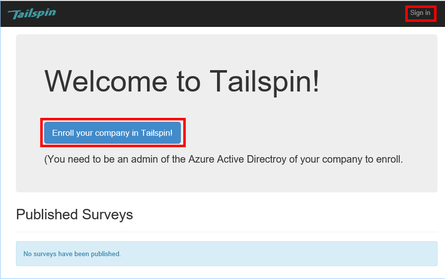
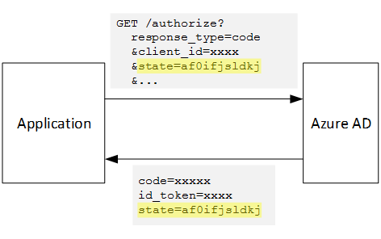

<properties
   pageTitle="Anmeldung und Mandanten Onboarding in Clientanwendungen mandantenfähigen | Microsoft Azure"
   description="Wie Sie in einer Anwendung mandantenfähigen integrierten Mandanten"
   services=""
   documentationCenter="na"
   authors="MikeWasson"
   manager="roshar"
   editor=""
   tags=""/>

<tags
   ms.service="guidance"
   ms.devlang="dotnet"
   ms.topic="article"
   ms.tgt_pltfrm="na"
   ms.workload="na"
   ms.date="05/23/2016"
   ms.author="mwasson"/>

# <a name="sign-up-and-tenant-onboarding-in-a-multitenant-application"></a>Anmeldung und Mandanten Onboarding in einer mandantenfähigen Anwendung

[AZURE.INCLUDE [pnp-header](../../includes/guidance-pnp-header-include.md)]

Dieser Artikel ist [Teil einer Serie]. Es gibt auch eine vollständige [Beispiel-Anwendung] , die dieser Reihe begleitet.

In diesem Artikel beschrieben, wie Sie implementieren eine _Anmeldung_ Prozess in einer Anwendung mit mehreren Mandanten, der einen Kunden von ihrer Organisation für eine Anwendung anmelden kann.
Es gibt verschiedene Gründe für einen Anmeldevorgang implementieren:

-   Zulassen einer AD-Administrator aus, um die Zustimmung für gesamte Organisation des Kunden, verwenden Sie die Anwendung.
-   Sammeln Sie Bezahlung per Kreditkarte oder anderen Kundeninformationen ein.
-   Führen Sie alle einmaligen pro Mandant Einrichten von Ihrer Anwendung benötigt wird.

## <a name="admin-consent-and-azure-ad-permissions"></a>Administrator Zustimmung und Azure AD-Berechtigungen

Für die Authentifizierung mit Azure AD benötigt eine Anwendung Zugriff auf das Verzeichnis des Benutzers. Mindestens benötigt die Anwendung über die Berechtigung zum Profil des Benutzers zu lesen. Das erste Mal, das ein Benutzer, signiert zeigt Azure AD eine Zustimmung-Seite, die die angeforderten Berechtigungen Listen. Indem Sie auf **annehmen**, erhält der Benutzer über die Berechtigung zur Anwendung.

Standardmäßig wird eine benutzerspezifisch Zustimmung erteilt. Jeder Benutzer, der anmeldet sieht die Zustimmung Seite. Azure AD unterstützt jedoch auch _Administrator Zustimmung_, die ein Administrator AD Zustimmung für eine gesamte Organisation kann.

Der Administrator Zustimmung Fluss verwendet wird, gibt die Seite Zustimmung an, dass der Active Directory-Administrator Berechtigungen für den gesamten Mandanten gewährt:


Nachdem der Administrator **annehmen**klickt, können andere Benutzer auf den gleichen Mandanten anmelden und Azure AD überspringt auf den Bildschirm Zustimmung.

Nur von einem Administrator AD kann Administrator Zustimmung, verleihen, da es für die gesamte Organisation über die Berechtigung erteilt. Wenn ein nicht-Administrator versucht, mit dem Administrator Zustimmung Flow authentifizieren, wird Azure AD ein Fehler angezeigt:


Wenn die Anwendung zu einem späteren Zeitpunkt zusätzliche Berechtigungen erfordert, muss der Kunde erneut anmelden und Einverständnis, das die aktualisierten Berechtigungen.  

## <a name="implementing-tenant-sign-up"></a>Implementieren der Anmeldung Mandanten

Für die [Tailspin Umfragen] [ Tailspin] Anwendung, die wir mehrere Anforderungen für den Anmeldevorgang definiert:

-   Ein Mandanten muss anmelden, bevor die Benutzer sich anmelden können.
-   Anmeldung verwendet Administrator Zustimmung illustrieren.
-   Anmeldung addiert des Benutzers Mandanten, in die Anwendungsdatenbank.
-   Nachdem Sie ein Mandanten anmeldet, zeigt die Anwendung eine Seite Onboarding aus.

In diesem Abschnitt werden wir unsere Implementierung von der Anmeldevorgang durchzuführen.
Es ist wichtig, die "Anmeldung" im Vergleich zu "Anmelden" zu verstehen ist eine Anwendung Konzept. Während des Ablaufs Authentifizierung weiß Azure AD grundsätzlich nicht, ob der Benutzer das Profil anmelden wird. Es ist von der Anwendung im Kontext verfolgen.

Wenn ein anonyme Benutzer die Anwendung Umfragen besucht, wird der Benutzer angezeigte zwei Schaltflächen, eine anmelden und eine "Registrieren Ihres Unternehmens" (Anmelden).



Dieser Schaltflächen, rufen Sie die Aktionen in der Klasse [AccountController] .

Die `SignIn` Aktion gibt eine **ChallegeResult**, wodurch die Middleware OpenID verbinden, um auf den Endpunkt Authentifizierung umleiten. Dies ist die Standardmethode zum Auslösen Authentifizierung in ASP.NET Core 1.0.  

```csharp
[AllowAnonymous]
public IActionResult SignIn()
{
    return new ChallengeResult(
        OpenIdConnectDefaults.AuthenticationScheme,
        new AuthenticationProperties
        {
            IsPersistent = true,
            RedirectUri = Url.Action("SignInCallback", "Account")
        });
}
```

Vergleichen Sie jetzt die `SignUp` Aktion:

```csharp
[AllowAnonymous]
public IActionResult SignUp()
{
    // Workaround for https://github.com/aspnet/Security/issues/546
    HttpContext.Items.Add("signup", "true");

    var state = new Dictionary<string, string> { { "signup", "true" }};
    return new ChallengeResult(
        OpenIdConnectDefaults.AuthenticationScheme,
        new AuthenticationProperties(state)
        {
            RedirectUri = Url.Action(nameof(SignUpCallback), "Account")
        });
}
```

Wie `SignIn`, die `SignUp` Aktion auch gibt eine `ChallengeResult`. Aber dieses Mal, wir eine Zustand Information zum Hinzufügen der `AuthenticationProperties` in der `ChallengeResult`:

-   Beim registrieren: booleschen Kennzeichen, gibt an, dass der Benutzer den Anmeldevorgang gestartet hat.

Informationen über den Zustand in `AuthenticationProperties` der OpenID verbinden [Zustand] Parameter, bei dem runden Schleifen während des Ablaufs Authentifizierung hinzugefügt wird.



Nachdem der Benutzer in Azure Active Directory authentifiziert und an die Anwendung weitergeleitet, enthält das Authentifizierungsticket den Status aus. Wir verwenden diese Fact um sicherzustellen, dass der Wert "Anmeldung" über den gesamten Authentifizierung Fluss weiterhin besteht.

## <a name="adding-the-admin-consent-prompt"></a>Die Administrator Zustimmung Aufforderung hinzufügen

In Azure AD ist Administrator Zustimmung illustrieren durch Hinzufügen eines Parameters "Eingabeaufforderung" in der Abfragezeichenfolge in der Besprechungsanfrage Authentifizierung ausgelöst:

```
/authorize?prompt=admin_consent&...
```

Die Anwendung Umfragen addiert die Aufforderung während der `RedirectToAuthenticationEndpoint` Ereignis. Dieses Ereignis ist rechts aufgerufen, bevor die Middleware an den Endpunkt Authentifizierung leitet.

```csharp
public override Task RedirectToAuthenticationEndpoint(RedirectContext context)
{
    if (context.IsSigningUp())
    {
        context.ProtocolMessage.Prompt = "admin_consent";
    }

    _logger.RedirectToIdentityProvider();
    return Task.FromResult(0);
}
```

> [AZURE.NOTE] Finden Sie unter [SurveyAuthenticationEvents.cs].

Festlegen von` ProtocolMessage.Prompt` weist die Middleware, um den Parameter "Eingabeaufforderung" der Authentifizierung Anforderung hinzufügen.

Beachten Sie, dass die Aufforderung nur bei der Anmeldung erforderlich ist. Normale Anmeldung sollte nicht enthalten. Um diese zu unterscheiden, prüfen wir die `signup` Wert in den Authentifizierungszustand. Diese Bedingung überprüft die folgende Erweiterungsmethode:

```csharp
internal static bool IsSigningUp(this BaseControlContext context)
{
    Guard.ArgumentNotNull(context, nameof(context));

    string signupValue;
    object obj;
    // Check the HTTP context and convert to string
    if (context.HttpContext.Items.TryGetValue("signup", out obj))
    {
        signupValue = (string)obj;
    }
    else
    {
        // It's not in the HTTP context, so check the authentication ticket.  If it's not there, we aren't signing up.
        if ((context.AuthenticationTicket == null) ||
            (!context.AuthenticationTicket.Properties.Items.TryGetValue("signup", out signupValue)))
        {
            return false;
        }
    }

    // We have found the value, so see if it's valid
    bool isSigningUp;
    if (!bool.TryParse(signupValue, out isSigningUp))
    {
        // The value for signup is not a valid boolean, throw                
        throw new InvalidOperationException($"'{signupValue}' is an invalid boolean value");
    }

    return isSigningUp;
}
```

> [AZURE.NOTE] Finden Sie unter [BaseControlContextExtensions.cs].

> [AZURE.NOTE] Hinweis: Dieser Code enthält eine Umgehung für ein bekanntes Problem in ASP.NET Core 1.0 RC1 an. In der `RedirectToAuthenticationEndpoint` Ereignis, gibt es keine Möglichkeit zum Abrufen der Authentifizierungseigenschaften, die den Status "Anmeldung" enthält. Problem zu umgehen der `AccountController.SignUp` Methode versetzt auch den Status "Anmeldung" in der `HttpContext`. Dies funktioniert, da `RedirectToAuthenticationEndpoint` geschieht vor der Umleitung, damit wir noch haben `HttpContext`.

## <a name="registering-a-tenant"></a>Registrieren einen Mandanten

Die Anwendung Umfragen werden einige Informationen zu den einzelnen Mandanten und Benutzer in der Anwendungsdatenbank gespeichert.


In der Tabelle Mandanten ist IssuerValue der Wert des Herausgebers Antrags für den Mandanten. Bei Azure AD ist dies `https://sts.windows.net/<tentantID>` und bietet einen eindeutigen Wert pro Mandant.

Wenn anmeldet ein neuer Mandanten, die Anwendung Umfragen schreibt einen Mandanten Eintrag in der Datenbank. In diesem Fall innerhalb der `AuthenticationValidated` Ereignis. (Erledigen Sie nicht vor dem Ereignis, da das Token-ID wird nicht noch, bestätigt werden, damit Sie nicht die Werte anfordern vertrauen können. Finden Sie unter [Authentifizierung].

Hier wird der entsprechende Code aus der Anwendung Umfragen aus:

```csharp
public override async Task AuthenticationValidated(AuthenticationValidatedContext context)
{
    var principal = context.AuthenticationTicket.Principal;
    var userId = principal.GetObjectIdentifierValue();
    var tenantManager = context.HttpContext.RequestServices.GetService<TenantManager>();
    var userManager = context.HttpContext.RequestServices.GetService<UserManager>();
    var issuerValue = principal.GetIssuerValue();
    _logger.AuthenticationValidated(userId, issuerValue);

    // Normalize the claims first.
    NormalizeClaims(principal);
    var tenant = await tenantManager.FindByIssuerValueAsync(issuerValue)
        .ConfigureAwait(false);

    if (context.IsSigningUp())
    {
        // Originally, we were checking to see if the tenant was non-null, however, this would not allow
        // permission changes to the application in AAD since a re-consent may be required.  Now we just don't
        // try to recreate the tenant.
        if (tenant == null)
        {
            tenant = await SignUpTenantAsync(context, tenantManager)
                .ConfigureAwait(false);
        }

        // In this case, we need to go ahead and set up the user signing us up.
        await CreateOrUpdateUserAsync(context.AuthenticationTicket, userManager, tenant)
            .ConfigureAwait(false);
    }
    else
    {
        if (tenant == null)
        {
            _logger.UnregisteredUserSignInAttempted(userId, issuerValue);
            throw new SecurityTokenValidationException($"Tenant {issuerValue} is not registered");
        }

        await CreateOrUpdateUserAsync(context.AuthenticationTicket, userManager, tenant)
            .ConfigureAwait(false);
    }
}
```

> [AZURE.NOTE] Finden Sie unter [SurveyAuthenticationEvents.cs].

Dieser Code führt Folgendes aus:

1.  Überprüfen Sie, ob des Mandanten Herausgeber Wert bereits in der Datenbank vorhanden ist. Wenn Sie der Mandanten nicht angemeldet hat, nach oben, `FindByIssuerValueAsync` gibt null zurück.
2.  Wenn der Benutzer anmelden:
  1.    Fügen Sie den Mandanten in der Datenbank (`SignUpTenantAsync`).
  2.    Fügen Sie den authentifizierten Benutzer zur Datenbank (`CreateOrUpdateUserAsync`).
3.  Führen Sie andernfalls normalen Fluss Anmeldung an:
  1.    Wenn der Herausgeber des Mandanten in der Datenbank nicht gefunden wurde, bedeutet dies, der Mandanten ist nicht registriert, und der Kunde muss registrieren. In diesem Fall auf eine Ausnahme, wenn Sie dazu führen, dass die Authentifizierung fehlschlägt.
  2.    Erstellen Sie andernfalls Datenbank ein Datensatz für diesen Benutzer, falls es noch kein (`CreateOrUpdateUserAsync`).

Hier ist die [SignUpTenantAsync] -Methode, die den Mandanten in der Datenbank hinzufügt.

```csharp
private async Task<Tenant> SignUpTenantAsync(BaseControlContext context, TenantManager tenantManager)
{
    Guard.ArgumentNotNull(context, nameof(context));
    Guard.ArgumentNotNull(tenantManager, nameof(tenantManager));

    var principal = context.AuthenticationTicket.Principal;
    var issuerValue = principal.GetIssuerValue();
    var tenant = new Tenant
    {
        IssuerValue = issuerValue,
        Created = DateTimeOffset.UtcNow
    };

    try
    {
        await tenantManager.CreateAsync(tenant)
            .ConfigureAwait(false);
    }
    catch(Exception ex)
    {
        _logger.SignUpTenantFailed(principal.GetObjectIdentifierValue(), issuerValue, ex);
        throw;
    }

    return tenant;
}
```

Hier finden Sie eine Zusammenfassung des gesamten Anmeldung Flusses in der Anwendung Umfragen an:

1.  Der Benutzer klickt auf die Schaltfläche **Registrieren** .
2.  Die `AccountController.SignUp` Aktion führt zu einem Ergebnis Kundenbeispiele.  Die Authentifizierung Systemzustand "Anmeldung"-Wert.
3.  In der `RedirectToAuthenticationEndpoint` Ereignis, fügen Sie die `admin_consent` auffordern.
4.  Die Middleware OpenID verbinden zu Azure AD leitet und den Benutzer authentifiziert.
5.  In der `AuthenticationValidated` Ereignis, suchen Sie nach den Status "Anmeldung".
6.  Fügen Sie den Mandanten in der Datenbank ein.

## <a name="next-steps"></a>Nächste Schritte

- Lesen Sie den nächsten Artikel in dieser Reihe: [Anwendungsrollen in mandantenfähigen Clientanwendungen][app roles]


<!-- Links -->
[app roles]: guidance-multitenant-identity-app-roles.md
[Tailspin]: guidance-multitenant-identity-tailspin.md
[Teil einer Serie]: guidance-multitenant-identity.md
[AccountController]: https://github.com/Azure-Samples/guidance-identity-management-for-multitenant-apps/blob/master/src/Tailspin.Surveys.Web/Controllers/AccountController.cs
[Bundesstaat]: http://openid.net/specs/openid-connect-core-1_0.html#AuthRequest
[SurveyAuthenticationEvents.cs]: https://github.com/Azure-Samples/guidance-identity-management-for-multitenant-apps/blob/master/src/Tailspin.Surveys.Web/Security/SurveyAuthenticationEvents.cs
[BaseControlContextExtensions.cs]: https://github.com/Azure-Samples/guidance-identity-management-for-multitenant-apps/blob/master/src/Tailspin.Surveys.Web/Security/BaseControlContextExtensions.cs
[Authentifizierung]: guidance-multitenant-identity-authenticate.md
[SignUpTenantAsync]: https://github.com/Azure-Samples/guidance-identity-management-for-multitenant-apps/blob/master/src/Tailspin.Surveys.Web/Security/SurveyAuthenticationEvents.cs
[Beispiel-Anwendung]: https://github.com/Azure-Samples/guidance-identity-management-for-multitenant-apps
