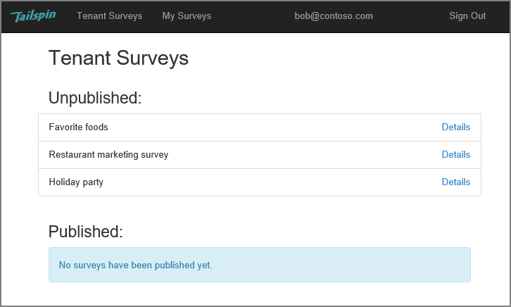
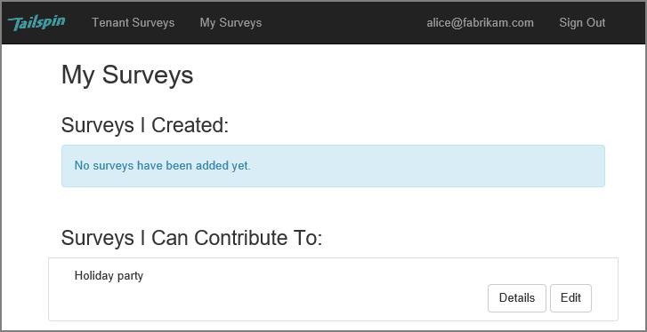

<properties
   pageTitle="Über die Anwendung Tailspin Umfragen | Microsoft Azure"
   description="Übersicht über die Anwendung von Tailspin Umfragen"
   services=""
   documentationCenter="na"
   authors="MikeWasson"
   manager="roshar"
   editor=""
   tags=""/>

<tags
   ms.service="guidance"
   ms.devlang="dotnet"
   ms.topic="article"
   ms.tgt_pltfrm="na"
   ms.workload="na"
   ms.date="05/23/2016"
   ms.author="mwasson"/>

# Über die Anwendung Tailspin Umfragen

[AZURE.INCLUDE [pnp-header](../../includes/guidance-pnp-header-include.md)]

Dieser Artikel ist [Teil einer Serie]. Es gibt auch eine vollständige [Beispiel-Anwendung] , die dieser Reihe begleitet.

Tailspin ist ein fiktives Unternehmen, das eine SaaS-Anwendung, die mit dem Namen Umfragen entwickelt. Diese Anwendung ermöglicht Organisationen zu erstellen und Veröffentlichen von online-Umfragen.

- Eine Organisation kann für die Anwendung registrieren.
- Nachdem die Organisation registriert ist, können Benutzer in die Anwendung über ihre Organisation Anmeldeinformationen anmelden.
- Benutzer können erstellen, bearbeiten und Veröffentlichen von Umfragen.

> [AZURE.NOTE] Um mit der Anwendung anzufangen, finden Sie unter [Ausführen der Anwendung Umfragen].

## Benutzer können erstellen, bearbeiten und Anzeigen von Umfragen

Einem authentifizierten Benutzer kann die Umfragen, die er erstellt hat oder verfügt über Mitwirkender Berechtigungen zum Anzeigen und neue Umfragen erstellen. Beachten Sie, dass der Benutzer, mit seiner organisationsidentität angemeldet ist, `bob@contoso.com`.

Diese Abbildung zeigt die Seite der Umfrage bearbeiten:

Benutzer können auch alle von anderen Benutzern innerhalb des gleichen Mandanten erstellt Umfragen anzeigen.

## Umfrage Besitzer können Mitwirkenden einladen.

Wenn ein Benutzer eine Umfrage erstellt, können hingegen als Mitwirkende auf die Umfrage andere Personen einladen. Mitwirkenden können bearbeiten die Umfrage, jedoch können nicht löschen oder bereitstellen.  

Ein Benutzer kann aus anderen Mandanten, Mitwirkenden hinzufügen ermöglicht Cross-Mandanten Freigabe von Ressourcen. In diesem Screenshot Bob (`bob@contoso.com`) ist das Hinzufügen von Alice (`alice@fabrikam.com`) als Mitwirkender zu einer Umfrage, die Bob erstellt.

Wenn Alice anmeldet, sieht sie die Umfrage unter "Umfragen ich zur beitragen können" aufgeführt.

Beachten Sie, dass Alice in ein eigenes Mandanten, nicht als Gast von den Contoso-Mandanten signiert. Alice weist Teilnehmerberechtigungen nur für die Umfrage &mdash; Anna kann keine anderen Umfragen aus den Contoso-Mandanten anzeigen.

## Architektur

Die Anwendung Umfragen besteht aus einem Web-front-End und ein Web-API Back-End. Beide werden mithilfe von [ASP.NET Core 1.0]implementiert.

Die Webanwendung verwendet Azure Active Directory (Azure AD) zum Authentifizieren von Benutzern. Die Webanwendung ruft auch Azure AD um OAuth 2 Access Token für die Web-API zu erhalten. Access-Token, die in Azure Redis Cache zwischengespeichert werden. Der Cache ermöglicht mehrere Instanzen denselben token Cache (z. B. in einer Serverfarm) freigeben.

## Nächste Schritte

- Lesen Sie den nächsten Artikel in dieser Reihe: [Authentifizierung mandantenfähigen Apps, die mit Azure Active Directory und OpenID verbinden][authentication]

<!-- Links -->

[authentication]: guidance-multitenant-identity-authenticate.md
[Teil einer Serie]: guidance-multitenant-identity.md
[Ausführen der Anwendung Umfragen]: https://github.com/Azure-Samples/guidance-identity-management-for-multitenant-apps/blob/master/docs/running-the-app.md
[ASP.NET Core 1.0]: https://docs.asp.net/en/latest/
[Beispiel-Anwendung]: https://github.com/Azure-Samples/guidance-identity-management-for-multitenant-apps
