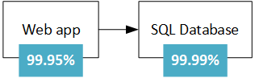
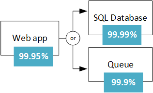
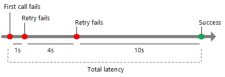
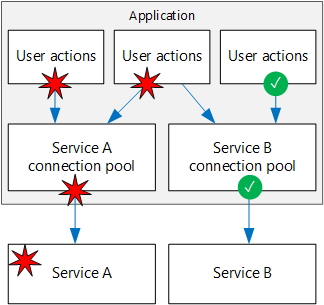

<properties
   pageTitle="Robuste Anwendungen entwerfen | Microsoft Azure"
   description="So erstellen Sie robuste Anwendungen in Azure für hohen Verfügbarkeit und Disaster Wiederherstellung."
   services=""
   documentationCenter="na"
   authors="MikeWasson"
   manager="christb"
   editor=""
   tags=""/>

<tags
   ms.service="guidance"
   ms.devlang="na"
   ms.topic="article"
   ms.tgt_pltfrm="na"
   ms.workload="na"
   ms.date="08/18/2016"
   ms.author="mwasson"/>
   
# Für Azure robuste Anwendungen entwerfen

In einem verteilten System tritt bei. Hardware kann ein Fehler auftreten. Das Netzwerk kann vorübergehende Fehler haben. Selten, eine gesamte Service / Ihrer Region kann eine Unterbrechung auftreten, aber auch die geplant werden müssen. 

Erstellen einer zuverlässigen Anwendungs in der Cloud unterscheidet sich von einer zuverlässigen Anwendung in einer Organisation erstellen.  Während in der Vergangenheit Sie High-End-Hardware skalieren erworben haben möglicherweise, in einen Cloud-Umgebung, die Sie müssen skalieren statt nach oben. Kosten für Cloud-Umgebungen sind bestimmte gängige Hardware gering gehalten. Anstatt die Vermeiden von Fehlern und optimieren "durchschnittliche Zeit zwischen Fehlern", wechselt in dieser neuen Umgebung der Fokus um "bedeutet, dass Anzeigedauer wiederherstellen." Ziel ist es, den Einfluss von einem Fehler zu minimieren.

Dieser Artikel bietet einen Überblick über die Vorgehensweise zum robuste Anwendungen in Microsoft Azure. Es beginnt mit einer Definition der Ausdruck *Stabilität* und verwandte Konzepte. Klicken Sie dann eine Vorgehensweise erreichen Stabilität, verwenden einen strukturierten Ansatz über die Nutzungsdauer einer Anwendung zu Bereitstellung und Betrieb von Planung und Implementierung, wird es beschrieben.

## Was ist der Stabilität?

**Stabilität** ist die Möglichkeit zum Wiederherstellen von Fehlern und weiterhin ausgeführt wird. Es ist nicht zu *Vermeiden von* Fehlern, sondern *reagiert* auf Fehler in eine Möglichkeit, die Ausfallzeiten oder Datenverluste vermieden werden. Das Ziel der Stabilität wird die Anwendung in eine voll funktionsfähige Zustand nach einem Fehler zurückgegeben.

Zwei wichtige Aspekte der Stabilität sind hohe Verfügbarkeit und Wiederherstellung.

- **Hohe Verfügbarkeit** (HA) ist die Möglichkeit der Anwendung, die in einem ordnungsgemäßen Zustand, ohne längere Downtime weiterhin ausgeführt. Unter "ordnungsgemäßen Zustand" verstehen wir die Anwendung reagiert ist, und die Benutzer eine Verbindung mit der Anwendung und damit interagieren können.  

- **Wiederherstellung** (DR) ist die Option zum Wiederherstellen von seltene aber Haupt-Fälle: Dauerhaftes, umfangreiche Fehler, wie z. B. dienststörung, die eine ganze Region auswirkt. Wiederherstellung enthält Daten sichern und Archivierung und manuelle Maßnahmen, wie z. B. Wiederherstellen einer Datenbank aus einer Sicherung einschließen. 

Eine Möglichkeit besteht darin, im Vergleich zu DR HA anzustellen ist, dass DR gestartet wird, wenn die Auswirkung eines Fehlers die Möglichkeit des Entwurfs HA zur Behandlung überschreitet. Beispielsweise werden mit mehreren virtuellen Computern hinter einem Lastenausgleich Verfügbarkeit zur Verfügung stellen, wenn ein virtueller Computer schlägt fehl, aber nicht, wenn sie alle gleichzeitig fehl. 

Wenn Sie eine Anwendung zu flexibel entwerfen, müssen Sie Ihren Anforderungen Verfügbarkeit zu verstehen. Wie viel Ausfallzeit zulässig ist? Dies ist teilweise Funktion der Kosten. Wie viel kostet potenziellen Ausfallzeiten Ihr Unternehmen? Wie viel investieren Sie in der Anwendung hochgradig verfügbar machen? Sie haben auch zum Definieren von Bedeutung für die Anwendung zur Verfügung. Beträgt beispielsweise die Anwendung "nach unten" an, wenn ein Kunde Ordnung senden kann, aber das System kann nicht in den normalen Zeitrahmen verarbeiten?

Eine andere allgemeiner Ausdruck **Geschäftskontinuität** (BC), einer Zahlenmenge ist die Möglichkeit, wichtige Geschäftsfunktionen während und nach einem Datenverlust durchzuführen. BC behandelt den gesamten Vorgang des Unternehmens, einschließlich Gebäuden, Personen, Kommunikation, Verkehrs, und IT. In diesem Artikel wir gerade Cloud Applikationen dienten sind, aber Stabilität Planung im Kontext Anforderungen für insgesamt BC ausgeführt werden muss. 

## Prozess Stabilität erzielen.

Stabilität ist kein Add-on. Sie müssen in das System entwickelt und in Betrieb Übungsbeispiel setzen. Hier ist ein allgemeines Modell, denen Sie folgen:

1.  **Definieren** der Ihren Anforderungen Verfügbarkeit basierend auf geschäftliche Anforderungen

2.  **Entwerfen** der Anwendung für Stabilität. Beginnen mit einer Architektur, die bewährte Methoden folgt, und klicken Sie dann die Punkte möglicherweise Fehler in dieser Architektur zu identifizieren.

3.  **Implementieren** Strategien erkennen und Beheben von Fehlern. 

4.  **Testen** der Implementierung von Fehlern simulieren und erzwungene Failovers auslösen. 

5.  **Bereitstellen** der Anwendung in Betrieb mithilfe eines Prozesses zuverlässigen, wiederholt. 

6.  **Überwachen** der Anwendung zum Ermitteln von Fehlern. Durch das System für die Überwachung, können Sie die Integrität der Anwendung-Zeitachse und Antworten auf Fälle, bei Bedarf. 

7.  Wenn es gibt Fälle, die manuelle Maßnahmen erfordern zu **Antworten** .

Im weiteren Verlauf dieses Artikels erläutern wir der einzelnen Schritte ausführlicher.

## Definieren Ihren Anforderungen Stabilität

Planen der Stabilität beginnt mit Business Anforderungen. Hier sind einige Vorgehensweisen für denken Stabilität in diese Ausdrücke ein.

### Gliedern von Arbeitsbelastung

Viele Cloudlösungen bestehen aus mehreren Auslastung. Der Begriff "Arbeitsbelastung" in diesem Zusammenhang bedeutet eine diskrete Videofunktionen oder computing Aufgabe, die von anderen Vorgängen, im Hinblick auf geschäftliche Logik und Daten Speicher Anforderungen logisch voneinander getrennt werden kann. Eine app e-Commerce enthalten möglicherweise die folgenden Auslastung:

- Navigieren und Suchen eines Produktkatalogs.

- Erstellen und Nachverfolgen von Aufträgen.

- Empfehlungen anzeigen

Möglicherweise müssen Sie diese Auslastung unterschiedliche Anforderungen für Verfügbarkeit, Skalierbarkeit, Konsistenz der Daten, Wiederherstellung usw.. In diesem Fall handelt es sich Business Entscheidungen.

Denken Sie auch Verwendungsmuster aus. Gibt es bestimmte wichtigen Zeiträumen, wenn das System verfügbar sein müssen? Beispielsweise kann kein Dienst für Steuer-Ablage mit direkt vor dem Termin für Ablage mit gelangen nach unten; ein Video streaming Service muss während eines Ereignisses große Sportarten von bleiben; und so weiter. In der wichtigen Zeiträumen haben Sie möglicherweise überflüssige Bereitstellungen über mehrere Bereiche, damit die Anwendung über fehl konnte, wenn eine Region fehlgeschlagen ist. Eine Bereitstellung mit mehreren Region ist jedoch teurer, sodass weniger kritisch Zeiten Sie die Anwendung in einem einzigen Bereich ausführen können.  

### RTO und RPO

Zwei wichtige Kennzahlen zu berücksichtigen sind die Ziel-Wiederherstellung Zeit und Wiederherstellung Punkt Ziel:

- **Ziel der Wiederherstellung-Zeit** (RTO) wird die Zeit von maximal zulässigen, die eine Anwendung nach einem Vorfall nicht verfügbar sein können. Wenn Ihre RTO 90 Minuten ist, müssen Sie die Anwendung in einer laufenden Zustand innerhalb von 90 Minuten ab dem Anfang der einem Datenverlust wiederherstellen sein. Wenn Sie eine sehr niedrig RTO haben, möglicherweise Sie eine zweite Bereitstellung Standby, zum Schutz vor einem regionalen Ausfall ständig ausgeführt beibehalten.

- **Zeigen Sie Ziel Wiederherstellung** (RPO) ist die maximale Dauer von Datenverlusten, die bei einem Datenverlust zulässig ist. Wenn Sie Daten in einer einzelnen Datenbank, mit keine Replikation auf andere Datenbanken speichern und stündliche Sicherungen ausführen, könnten Sie beispielsweise bis zu einer Stunde nach Daten verlieren. 

RTO und RPO sind Business Anforderungen. Eine andere allgemeine Metrisch ist der **Zwischenzeit wiederherstellen** (MTTR), welche ist die durchschnittliche Zeit, die benötigt wird, um die Anwendung nach einem Fehler wiederherzustellen. MTTR ist ein Summen-über ein System. Wenn MTTR das RTO überschreitet, wird ein Fehler im System einer Unterbrechung inakzeptabel Business führen, da es nicht möglich, das System in den definierten RTO wiederherstellen kann nicht. 

### SLAs

In Azure [Service Level Agreement] [ sla] (Vereinbarung zum SERVICELEVEL) werden von Microsoft Zusagen für Verfügbarkeit und Verbindungsproblemen. Ist der Vereinbarung zum SERVICELEVEL für einen bestimmten Dienst 99,9 %, bedeutet dies, dass Sie den Dienst zur Verfügung 99,9 % der Zeit erwarten sollte.

> [AZURE.NOTE] Der Azure Vereinbarung zum SERVICELEVEL enthält darüber hinaus Vorschriften für eine Gutschrift für den Dienst erhalten, wenn der Vereinbarung zum SERVICELEVEL zusammen mit bestimmten Definitionen "Verfügbarkeit" für jeden Dienst nicht erfüllt ist. Dieser Aspekt der Vereinbarung zum SERVICELEVEL fungiert als einer Richtlinie Durchsetzung. 

Sie sollten Ihre eigenen Ziel SLAs für jede Arbeitsbelastung in Ihre Lösung definieren. Eine Vereinbarung zum SERVICELEVEL macht es möglich, Grund zur Architektur, und gibt an, ob die Architektur die geschäftliche Anforderungen erfüllt. Beispielsweise, wenn eine Arbeitsbelastung 99,99 % Verfügbarkeit erfordert, aber einem Dienst mit einer 99,9 % Vereinbarung zum SERVICELEVEL abhängig, diesen Dienst einen zentralen Punkt des Fehlers im System nicht möglich. Eine verzögerte besteht darin, Sie haben einen alternativen Pfad aus, für den Fall, dass der Dienst nicht oder andere Maßnahmen zur Wiederherstellung bei einem Absturz in diesem Dienst. 

Die folgende Tabelle zeigt die kumulierten mögliche Downtime für verschiedene Vereinbarung zum SERVICELEVEL Ebenen. 

| VEREINBARUNG ZUM SERVICELEVEL     | Ausfallzeiten pro Woche | Ausfallzeiten pro Monat | Ausfallzeit pro Jahr |
|---------|-------------------|--------------------|-------------------|
| 99 %     | 1,68 Stunden        | 7,2 Stunden          | 3.65 Tage         |
| 99,9 %   | 10.1 Minuten      | 43,2 Minuten       | 8.76 Stunden        |
| 99,95 %  | 5 Minuten         | 21,6 Minuten       | 4,38 Stunden        |
| 99,99 %  | 1.01 Minuten      | 4,32 Minuten       | 52.56 Minuten     |
| 99,999 % | 6 Sekunden         | 25.9 Sekunden       | 5,26 Minuten      |

Natürlich ist höherer Verfügbarkeit besser, sonst alles gleich. Aber wie weitere 9 s möglichst, Kosten und Komplexität, um die Verfügbarkeit zu erzielen immer umfangreicher wird. Eine Verfügbarkeit von 99,99 % übersetzt in etwa 5 Minuten total Ausfall pro Monat. Lohnt sich die zusätzliche Komplexität und Kosten, um die fünf 9 s erreicht haben? Die Antwort hängt von den Business Anforderungen ab. 

Hier sind einige weitere Aspekte beim Definieren einer Vereinbarung zum SERVICELEVEL:

- Um die vier 9 des (99,99 %) zu erreichen, können nicht Sie wahrscheinlich auf manuellen Eingriff von Fehlern wiederherstellen verlassen. Die Anwendung muss Self Diagnosezwecken und automatische Korrektur. 

- Neben vier 9 es ist eine Herausforderung Ausfall schnell genug erkennen, die der Vereinbarung zum SERVICELEVEL stattfinden.

- Denken Sie an das Zeitfenster, dem der Vereinbarung zum SERVICELEVEL gegen gemessen werden. Je kleiner das Fenster, desto geringer der Toleranzen. Es wird nicht wahrscheinlich sinnvoll, der Vereinbarung zum SERVICELEVEL im Hinblick auf stündlich oder täglich Verfügbarkeit definieren. 

### Zusammengesetzte SLAs

Erwägen Sie eine App-Dienst-Web-app, die mit Azure SQL-Datenbank schreibt ein. Zum Zeitpunkt der Erstellung dieses Dokuments stehen diese Azure Dienste die folgenden SLAs.

- App-Dienst Web Apps = 99,95 %

- SQL-Datenbank = 99,99 %

Was ist der maximale Ausfall, die Sie erwarten für diese Anwendung? Wenn entweder Service schlägt fehl, wird die gesamte Anwendung nicht. Im Allgemeinen ist die Wahrscheinlichkeit, dass jeder Dienst fehlerhaften unabhängig, also der zusammengesetzte Vereinbarung zum SERVICELEVEL für diese Anwendung 99,95 % x 99,99 % = 99.94 %. Werden, kleiner als der einzelnen SLAs die überraschende, ist nicht, da die Anwendung, die mehrere Dienste benötigt mehr mögliche Fehlerpunkte hat. 

Andererseits, können Sie die zusammengesetzte Vereinbarung zum SERVICELEVEL durch Erstellen von unabhängigen fallbackabfragen Pfaden verbessern. Wenn beispielsweise SQL-Datenbank nicht verfügbar ist, setzen Transaktionen in einer Warteschlange, zu einem späteren Zeitpunkt verarbeitet werden.

Mit diesem Entwurf ist die Anwendung immer noch zur Verfügung, auch wenn es keine Verbindung mit der Datenbank herstellen kann. Jedoch schlägt sie die Datenbank und die Warteschlange zur gleichen Zeit fehl. Der erwartete Prozentsatz der Zeit für einen Gleichzeitiges Fehler ist 0,0001 x 0.001, damit der zusammengesetzte Vereinbarung zum SERVICELEVEL für diese kombinierten Pfad ist  

- Datenbank oder Warteschlange = 1,0 &minus; (0,0001 &times; 0,001) = 99,99999 %

Der gesamte zusammengesetzte Vereinbarung zum SERVICELEVEL ist:

- Web app und (Datenbank oder Warteschlange) = 99,95 % &times; 99,99999 % = ~99.95%

Es gibt jedoch einige Nachteile bei dieser Vorgehensweise. Die Anwendungslogik ist komplexer, Sie Zahlen für die Warteschlange und möglicherweise Daten Konsistenz Punkte zu berücksichtigen.

**Vereinbarung zum SERVICELEVEL für mehrere Region Bereitstellungen**. Eine andere HA Technik ist Sie die Anwendung in mehreren Region bereitstellen, und Azure Datenverkehr Manager über ein Fehler auftreten, wenn die Anwendung in einem Region fehlschlägt. Für eine Bereitstellung von zwei-Region wird der zusammengesetzte Vereinbarung zum SERVICELEVEL wie folgt berechnet. 

Lassen Sie *N* der zusammengesetzte Vereinbarung zum SERVICELEVEL für die Anwendung in einem Region bereitgestellt werden. Ist die erwartete Chance, die die Anwendung in beiden Regionen nicht funktioniert, zur gleichen Zeit (1 &minus; N) &times; (1 &minus; N). Daher

- Vereinbarung zum SERVICELEVEL für beide Regionen kombiniert = 1 &minus; (1 &minus; N) (1 &minus; N) = N + (1 &minus; N) N

Sie müssen schließlich Faktor in der [Vereinbarung zum SERVICELEVEL für den Datenverkehr Manager][tm-sla]. Ab wann in diesem Artikel geschrieben wurde wird der Vereinbarung zum SERVICELEVEL für den Datenverkehr Manager Vereinbarung zum SERVICELEVEL 99,99 %.

- Zusammengesetzte Vereinbarung zum SERVICELEVEL 99,99 % = &times; (kombiniert Vereinbarung zum SERVICELEVEL für beide Regionen)

Eine weitere Details ist, dass fehlerhafte über nicht erfolgt ist, was zu langweilig bei einem Failover führen. Finden Sie unter [den Datenverkehr Manager Endpunkt Überwachung und Failover][tm-failover].

Die Anzahl der berechnete Vereinbarung zum SERVICELEVEL ist ein Basisplan hilfreich, aber es nicht die ganze Geschichte feststellen, über die Verfügbarkeit. Häufig kann Anwendung ordnungsgemäß eingeschränkt werden, wenn ein nicht-kritischen Weg fehlschlägt. Erwägen Sie die Anwendung, die einen Katalog für Bücher anzeigt. Wenn die Anwendung die Miniaturansicht für das Deckblatt abrufen kann, wird es möglicherweise ein Platzhalterbild angezeigt. In diesem Fall weiß nicht mit dem Bild wird verringert nicht, Verfügbarkeit der Anwendung, auch wenn sie den Eindruck des Benutzers wirkt sich auf.  

## Entwerfen für Stabilität

Führen Sie während der Entwurfsphase eine Fehler Modus Analyse (FMA). Ziel eines FMA ist Ausfall zu identifizieren und definieren, wie die Anwendung auf diese Fehler reagieren.

- Wie wird die Anwendung dieses Fehlertyp erkennen?

- Wie wird die Anwendung auf diese Art von Fehler reagieren?

- Wie werden Sie überwachen dieser Fehlertyp und melden Sie sich? 

Weitere Informationen zu den Prozess FMA mit bestimmten Empfehlungen für Azure, finden Sie unter [Stabilität Azure Anleitungen: Fehler Modus Analyse][fma].

### Beispiel für identifizieren Fehlermodi und Erkennung Strategie

**Fehler Punkt:** Rufen Sie an einen externen Webdienst-API.

| Fehler bei der Modus | Erkennung Strategie |
|--------------|--------------------|
| Dienst ist nicht verfügbar | HTTP-5xx |
| Begrenzungsebene | HTTP 429 (zu viele Anfragen) | 
| Authentifizierung | HTTP 401 (nicht autorisiert) | 
| Langsame Antwort | Timeout anfordern |

## Stabilität Strategien

Dieser Abschnitt enthält einige allgemeine Stabilität Strategien eine Umfrage. Die meisten dieser sind nicht für eine bestimmte Technologie beschränkt. Die Beschreibungen in diesem Abschnitt werden die allgemeine Idee jede Methode, mit Links zu weiteren Lesebereich zusammenfassen auffällt.

### Wiederholen Sie vorübergehende Fehler

Vorübergehende Fehler können durch vorübergehende Verlust der Netzwerkkonnektivität, eine gelöschte datenbankverbindung oder ein Timeout verursacht werden, wenn ein Dienst ausgelastet ist. Häufig kann ein vorübergehender Fehler einfach, durch Wiederholung der Anforderung gelöst werden. Für viele Azure Dienste implementiert das Client-SDK automatisch wiederholt auf eine Weise, die für Anrufer transparent ist; [Wiederholen von bestimmter Hinweise zu Diensten]finden Sie unter[retry-service-specific guidance].

Fügt die Gesamtwartezeit jeden Versuch "Wiederholen". Darüber hinaus können zu viele fehlgeschlagene Anfragen ein, wie anstehende Anfragen in der Warteschlange leistungsstufenpunkte Engpass. Diese gesperrten Anfragen halten Sie möglicherweise kritische Systemressourcen wie z. B. Arbeitsspeicher, Threads, Datenbankverbindungen und usw., die cascading Fehlern führen kann. Um dies zu vermeiden, erhöhen Sie die Verzögerung zwischen den einzelnen versuchen Sie es erneut versuchen, und beschränken Sie die Gesamtzahl der Fehler beim Anfragen zu.

Weitere Informationen finden Sie unter [Muster wiederholen][retry-pattern].

### Lastenausgleich mehrerer Instanzen erstellen

Für Skalierbarkeit sollte eine Cloudanwendung, skalieren, indem Sie mehrere Instanzen hinzufügen können. Dieser Ansatz verbessert auch Stabilität, da fehlerhafte Instanzen von Drehung durchgeführt werden können.  

Beispiel:

- Setzen Sie mindestens zwei virtuellen Computern hinter einem Lastenausgleich. Lastenausgleich verteilt Datenverkehr mit den virtuellen Computern. [Ausführen von mehreren virtuellen Computern auf Azure für Skalierbarkeit und Verfügbarkeit]finden Sie unter[ra-multi-vm].

- Auschecken einer App-Verwaltungsdienst Azure-app zu mehrerer Instanzen skalieren. App-Dienst automatisch geladen Salden mehrerer Instanzen erstellen. [Grundlegende Web-Anwendung]finden Sie unter[ra-basic-web].

- Mit dem [Azure Datenverkehr-Manager] [ tm] um den Datenverkehr auf eine Reihe von Endpunkten verteilen.

### Replikation von Daten

Die Replikation von Daten ist eine allgemeine Strategie für den Umgang mit dauerhaftes Fehlern in einem Datenspeicher. Viele Technologien bieten integrierte Replikation, einschließlich Azure SQL-Datenbank, DocumentDB und Apache Cassandra.  

Es ist wichtig, sollten Sie beide lesen und Schreiben Pfade. Je nach Technologie Speicher haben Sie möglicherweise mehrere beschreibbare Replikate, oder ein einzelnes beschreibbare Replikat und mehrere schreibgeschützte Replikate. 

Größtmögliche Verfügbarkeit können Replikate in mehreren Regionen platziert werden. Dies erhöht jedoch die Wartezeit, um die Daten repliziert. Üblicherweise Replikation über Regionen asynchrone, erfolgt ein Modell tatsächlichen Konsistenz und möglichem d. h., wenn ein Replikat fehlschlägt. 

### Ohne Probleme

Wenn ein Dienst fehlschlägt, und es kein Failover Pfad ist, die Anwendung möglicherweise ordnungsgemäß, auf eine Weise beeinträchtigt werden, die immer noch eine zulässigen Benutzerfunktionalität bereitstellt. Beispiel:

- Setzen Sie dient auf eine Warteschlange, um später ausgeführt werden soll. 

- Geschätzte Rückgabewert 

- Verwenden Sie lokal gespeicherte Daten. 

- Anzeigen des Benutzers eine Fehlermeldung angezeigt. (Diese Option ist besser als die Anwendung beenden Besprechungsanfragen beantworten müssen.)

### Schränken Sie umfangreicher Benutzer

Manchmal erstellen eine kleine Anzahl von Benutzern eine übermäßige Auslastung. Die können auf anderen Benutzern, die allgemeine Verfügbarkeit der Anwendung verringern auswirken.

Wenn ein einzelner Client zu viele Anfragen vornimmt, möglicherweise die Anwendung den Client für einen bestimmten Zeitraum einschränken. Im Drosselung Zeitraum einige Lösungsvorschläge: der Anwendungs einige oder alle Anfragen dieser Desktopclient (je nach den genauen Drosselung Strategie). Der vom Kunden Service Ebene möglicherweise der Schwellenwert für begrenzungsebene abhängig sind. 

Begrenzungsebene impliziert nicht, dass der Client periodisch Absicht fungiert wurde. Dies bedeutet lediglich, dass der Kunden ihre Service-Kontingent überschritten.  In einigen Fällen möglicherweise ein Consumer konsistente überschreiten ihre Quote oder anderweitig falsch anders. In diesem Fall möglicherweise Sie weiter gehen und den Benutzer sperren. In der Regel, geschieht dies durch einen API-Schlüssel oder einen IP-Adressenbereich blockiert.

Weitere Informationen finden Sie unter [Muster Begrenzungsebene][throttling-pattern].

### Verwenden Sie eine Sicherung  

Das Sicherung Muster kann verhindern, dass eine Anwendung immer wieder versuchen, einen Vorgang, die wahrscheinlich fehlschlägt. Um auf den besteht darin, eine physische Sicherung, Option, die unterbrochen illustrieren des aktuellen, wenn eine Verbindung überlastet ist.

Die Sicherung umschließt Anrufe an einen Dienst. Es besteht aus drei Zustände:

- **Geschlossen**. Dies ist der normalen Zustand. Die Sicherung sendet Anfragen an den Dienst und ein Indikator verfolgt die Anzahl der aktuelle Fehler. Wenn die Anzahl der Fehler in einem bestimmten Zeitraum einen Schwellenwert überschreitet, wechselt die Sicherung in den geöffneten Zustand. 

- **Öffnen**. In diesem Zustand schlägt die Sicherung sofort alle Besprechungsanfragen, ohne Aufrufen des Diensts. Die Anwendung sollte einen Reduzierung Pfad, z. B. Lesen von Daten von einer Replikation oder einfach einen Fehler zurückgeben, für den Benutzer verwenden. Wechselt die Sicherung zu öffnen, wird einen Zeitgeber gestartet. Wenn der Zeitgeber abläuft, wechselt die Sicherung in den Zustand halb offenen.

- **Halb offenen**. In diesem Zustand ermöglicht die Sicherung eine eingeschränkte Anzahl von Anfragen aufzurufen, mit dem Dienst an. Wenn sie erfolgreich ist, wird angenommen, dass des Diensts wiederhergestellt werden, und die Sicherung wieder zur im geschlossenen Zustand wechselt. Andernfalls wird es im geöffneten Zustand zurückgesetzt. Im halb offenen Zustand wird verhindert, dass einen Dienst wiederhergestellt plötzlich mit Anforderungen überhäuft.

Weitere Informationen finden Sie unter [Schutzschalter Muster][circuit-breaker-pattern].

### Verwenden Sie laden Abgleich, um Spitzen im Datenverkehr Glätten

Applikationen abgestimmten können plötzliche Spitzen im Datenverkehr, die Dienste auf die Back-End-überlastet können. Wenn ein Back-End-Dienst schnell genug auf Anfragen reagieren kann, es möglicherweise Anfragen (sichern) Warteschlange beeinträchtigen oder bewirken, dass den Dienst schränken Sie die Anwendung.

Um dies zu vermeiden, können Sie eine Warteschlange als Puffer verwenden. Wenn es ein neues Element der Arbeit wird, rufen Sie den Back-End-Dienst sofort sondern, stellt die Anwendung dient asynchrone Warteschlange. Die Warteschlange fungiert als Puffer, der sich die Last Spitzen glättet. 

Weitere Informationen finden Sie unter [Warteschlange-basierten laden Kapazitätsabgleich Muster][load-leveling-pattern].

### Isolieren wichtige Ressourcen 

Fehler in einem Subsystem können manchmal überlappend Fehlern in andere Teile der Anwendung verursacht. Dies kann geschehen, wenn ein Fehler bewirkt, dass einige Ressourcen, z. B. Threads oder Sockets, nicht zeitgerecht, um Ressourcen Erschöpfung führenden freigegeben abrufen. 

Um dies zu vermeiden, können Sie ein System in Gruppen isoliert, aufteilen, damit ein Fehler in einer Partition nicht unten im gesamten System gesetzt wird. Dieses Verfahren wird auch das sein Muster bezeichnet.

Beispiele:

- Partitionieren einer Datenbank – beispielsweise durch Mandanten –, und weisen Sie einem separaten Ressourcenpool Web Server-Instanzen für jede Partition.  
- Verwenden Sie separate Threadpools, um Anrufe an andere Dienste isolieren. Dadurch werden um cascading Fehler zu verhindern, wenn einer der Dienste fehlschlägt. Ein Beispiel, finden Sie in der Netflix [Hystrix Bibliothek][hystrix].

- Mithilfe von [Containern] [ containers] die verfügbaren Ressourcen für ein bestimmtes Subsystem einschränken. 

### Anwenden von Kompensationstransaktionen 

Eine kompensierende Transaktion ist eine Transaktion, die die Effekte von einem anderen abgeschlossene Transaktion Rückgängigmachen.

In einem verteilten System kann das sehr schwer zu erzielen signifikante Konsistenz sein. Kompensationstransaktionen sind eine Möglichkeit zum Konsistenz mithilfe einer Reihe von kleinere, einzelne Transaktionen, die bei jedem Schritt rückgängig gemacht werden kann.

Um einer Reise buchen, möglicherweise ein Kunde beispielsweise ein Auto, einem Hotelzimmer und einen Flug reservieren. Fällt eine der folgenden Schritte aus, schlägt der gesamte Vorgang. Anstatt beim Versuch, eine einzelne verteilte Transaktion für den gesamten Vorgang zu verwenden, können Sie eine kompensierende Transaktion für jeden Schritt definiert. Um eine Reservierung Auto rückgängig zu machen, brechen Sie beispielsweise die Reservierung. Um den gesamten Vorgang abgeschlossen haben, führt Maßnahme ist nützlich jeden Schritt aus. Wenn alle Schritt fehlschlägt, gilt der Koordinator Kompensationstransaktionen, um alle Schritte rückgängig zu machen, die durchgeführt wurden. 

Weitere Informationen finden Sie unter [Compensating Transaktion Muster][compensating-transaction-pattern]. 

## Testen der Stabilität

Sie können nicht im allgemeinen Stabilität auf die gleiche Weise testen, Anwendungsfunktionalität testen (durch Einheit Tests usw.). In diesem Fall müssen Sie testen, wie die End-to-End-Arbeitsbelastung unter Umständen Fehler führt aus denen per Definition ständig im Vorfeld.

Testen ist Bestandteil der einen iterativen Prozess. Testen Sie die Anwendung, die das Ergebnis messen, analysieren und Beheben von Fehlern, die Ergebnis, und wiederholen Sie den Vorgang.

**Fehlerstrukturanalyse einfügen testen**. Testen Sie die Stabilität des Systems auf Fehler, entweder durch Auslösen von ist-Fehlern oder über diese simulieren. Hier sind einige häufige Fehlerszenarien zu testen:

- Fahren Sie virtueller Computer Instanzen aus.

- Abstürzen Sie Prozesse an.

- Am Zertifikate ab.

- Ändern der Zugriffstasten.

- Fahren Sie den DNS-Dienst auf Domänencontroller aus.

- Verfügbare Systemressourcen, z. B. RAM oder Threadanzahl zu beschränken.

- Hängen Sie Datenträger aus.

- Erneutes Bereitstellen eines virtuellen Computers aus.

Messen Sie die Wiederherstellungszeiten, und stellen Sie sicher, dass sie Ihre Bedürfnisse zuschneiden. Kombinationen von Ausfall-Modi, sowie zu testen. Stellen Sie sicher, dass Fehler nicht überlappend, und isoliert Weise gehandhabt werden.

Dies ist ein weiterer Grund, warum es möglicherweise Fehlerpunkte während der Entwurfsphase analysieren wichtig ist. Die Ergebnisse dieser Analyse sollten Eingaben in den Testplan.

**Testen Sie laden**. Laden Sie die Anwendung mithilfe eines Tools wie [Visual Studio Team Services] Test[ vsts] oder [Apache JMeter] [ jmeter] laden testen wiederum ist entscheidend, Identifizieren von Fehlern, die ausgeführt werden nur Auslastung, wie etwa die Back-End-Datenbank überlastet oder Dienst begrenzungsebene. Testen Sie Höchstwert laden, mit der Herstellung oder synthetische Daten, die möglichst ähnlich Herstellung Daten wie möglich ist. Das Ziel ist zu sehen, wie die Anwendung unter Umständen praktisches verhält sich.   

## Robuste Bereitstellung

Nachdem eine Anwendung auf Herstellung bereitgestellt wird, sind die Updates eine mögliche Quelle der Fehler. In den ungünstigsten Fall kann eine fehlerhafte Aktualisierung Downtime zur Folge haben. Um dies zu vermeiden, muss der Bereitstellungsprozess vorhersehbar und wiederholt. Bereitstellung umfasst Azure Ressourcen bereitgestellt, die Anwendungscode Bereitstellung und Konfiguration Einstellungen anwenden. Ein Update kann alle drei oder eine Teilmenge beinhalten. 

Die entscheidend ist, dass die manuelle Bereitstellungen zu zurückgegeben werden. Daher weist empfohlen, dass einen automatisierte, Idempotent Prozess, den Sie bei Bedarf ausführen können, und führen Sie erneut aus, wenn ein Fehler auftritt. 

- Automatisierung der Bereitstellung von Azure Ressourcen mithilfe Ressourcenmanager Vorlagen.

- Verwenden der [Azure Automatisierung gewünscht Zustand Konfiguration] [ dsc] (DSC) virtuellen Computern konfigurieren.

- Verwenden Sie einen automatisierte Bereitstellungsprozess für die Anwendungscode ein.

Zwei Konzepte zum robuste verwandte Bereitstellung sind *Infrastruktur als Code* und *unveränderlich Infrastruktur*.

- **Infrastruktur als Code** ist die Verwendung des Codes zum Bereitstellen und Konfigurieren der Infrastruktur. Infrastruktur als Code möglicherweise einen deklarativen Ansatz oder eine unbedingt Ansatz (oder eine Kombination aus beiden) verwenden. Ressourcenmanager Vorlagen finden Sie ein Beispiel für einen deklarativen Ansatz. PowerShell-Skripts sind ein Beispiel für eine unbedingt Ansatz.

- **Unveränderlich Infrastruktur** ist das Prinzip, Infrastruktur dürfen nicht ändern, nachdem es in der Herstellung bereitgestellt wird. Andernfalls können Sie erhalten in einem Zustand, in dem ad-hoc-Änderungen angewendet wurden, damit es ist schwer zu wissen, was sich genau geändert und schwer zu Grund über das System. 

Eine weitere Frage ist, wie ein Anwendungsupdate bereit. Wir empfehlen Techniken wie Blaugrün Bereitstellung oder Kanarische Versionen, welche Updates hochgradig in Pushbenachrichtigungen gesteuert Möglichkeit, um mögliche Nachteile aus einer schlechten Bereitstellung zu minimieren.

- [Blaugrün Bereitstellung] [ blue-green] ist ein Verfahren, in dem Sie eine Aktualisierung in einer separaten Herstellung-Umgebung aus der live-Anwendung bereitstellen. Nachdem Sie die Bereitstellung überprüfen, wechseln Sie den Datenverkehr weiterleiten an die aktualisierte Version. Beispielsweise können diese Azure App Dienst Web Apps mit [staging Steckplätze][staging-slots]. 

- [Kanarischen Versionen] [ canary-release] Blaugrün Bereitstellung ähneln. Statt der gesamten Verkehr zu aktualisierte Version wechseln, drehen Sie die Aktualisierung auf einen kleinen Prozentsatz der Benutzer, indem Sie einen Teil der Datenverkehr in die neue Bereitstellung routing. Ist ein Problem aufgetreten, deaktivieren sichern Sie und Wiederherstellen Sie, um die alte Bereitstellung. Andernfalls Datenverkehr mehr auf die neue Version, bis 100 % des Datenverkehrs erreicht wird.

Für welchen Ansatz Sie übernehmen möchten, stellen Sie sicher, dass Sie die letzten bekannten funktionierenden-Bereitstellung wiederherstellen können, für den Fall, dass Sie die neue Version nicht funktioniert. Auch wenn Fehler auftreten, muss es möglich, über die Anwendungsprotokolle feststellen, welche Version des Fehlers verursacht. 

## Überwachung und Diagnose

Überwachung und Diagnose sind entscheidend für Stabilität. Wenn ein Fehler auftritt, müssen Sie wissen, dass es fehlgeschlagen ist, und Sie Einblicke in die Ursache des Fehlers benötigen. 

Überwachen von einem umfassenden verteilten System stellt eine signifikante Herausforderung. Denken Sie an eine Anwendung, die auf ein paar Dutzend virtuellen Computern ausgeführt wird – es ist nicht sinnvoll, melden Sie sich bei jeder virtuellen Computer einzeln nacheinander, und suchen Sie Protokolldateien, bei dem Versuch, ein Problem zu lösen. Darüber hinaus ist die Anzahl der Instanzen virtueller Computer wahrscheinlich nicht statisch. Virtuellen Computern erhalten hinzugefügt und verkleinern als die Anwendung Skalen entfernt und gelegentlich eine Instanz möglicherweise ein Fehler auftreten, reprovisioned werden müssen. Darüber hinaus eine typische Cloudanwendung möglicherweise mehrere Datenspeicher (Azure-Speicher, SQL-Datenbank, DocumentDB, Redis Cache) verwenden, und eine einzelne Benutzeraktion kann mehrere Teilsystemen erstrecken. 

Sie können als eine Verkaufspipeline mit mehreren unterschiedlichen Phasen des Prozesses für die Überwachung und Diagnose vorstellen:

- **Instrumentation**. Die unformatierten Daten für die Überwachung und Diagnose stammen aus einer Vielzahl von Quellen, einschließlich Anwendungsprotokolle, Web Serverprotokolle, OS-Datenquellen, Datenbankprotokolle und Diagnose in der Azure-Plattform integriert. Die meisten Azure Services haben ein Diagnosefeature, das Sie verwenden können, die Ursache von Problemen zu ermitteln.

- **Sammlung und Speicher**. Die unformatierten Instrumentationsdaten können in einer Vielzahl von Speicherorten und mit unterschiedlichen Formaten (Anwendung Spur Protokolle, Indikatoren für Datenereignis, IIS-Protokolle) gehalten werden. Diese unterschiedlichen Quellen werden gesammelt, konsolidierte und zuverlässigen Speicher gebracht.

- **Analyse und Diagnose**. Nachdem die Daten konsolidiert werden, können sie analysiert werden müssen, um zu behandeln von Problemen, und geben Sie einen Überblick über die Integrität der Anwendung.

- **Visualisierung und Benachrichtigungen**. In diesem Schritt werden werden Daten so dargestellt, dass ein Operator schnell Trends oder Probleme erkennen kann. Beispiel für Dashboards enthalten oder e-Mail-Benachrichtigungen.  

Überwachung unterscheidet sich Erkennung von Fehlern. Angenommen, die Anwendung einer vorübergehend erkennen möglicherweise Fehler, und wiederholen, was ohne Ausfallzeiten. Aber den Vorgang "Wiederholen", sollten auch aufzeichnen, damit die Effektivverzinsung zurück, und Sie erhalten einen Überblick über die Anwendung Integrität überwacht werden kann. 

Anwendungsprotokolle sind eine wichtige Datenquelle Diagnose. Hier sind einige bewährte Methoden für die Anwendung Protokollierung:

- Melden Sie sich bei Herstellung. Andernfalls verlieren Sie einen Einblick der sehr vorkommen, wenn Sie es die am häufigsten benötigen.

- Melden Sie sich am Dienst Begrenzung Ereignisse. Einschließen einer Korrelations-ID, die über Dienst hinweg fließt. Wenn mehrere Dienste und eine von Ihnen fehlschlägt Transaktion X durchläuft, die Korrelations-ID hilft Ihnen Pinpoint warum Fehler bei die Transaktion.

- Verwenden semantische Protokollierung, die Abkürzung strukturierten Protokollierung. Unstrukturierte Protokolle machen Sie es schwierig zu automatisieren, den Verbrauch und die Analyse der Log-Daten, die bei Cloud benötigt wird.

- Verwenden Sie die asynchrone Protokollierung. Andernfalls kann das Protokollierungssystem selbst die Anwendung von bewirken, dass Anfragen zu sichern, während sie warten auf ein Ereignis Protokollierung schreiben blockieren fehlschlägt, verursachen.

- Anwendung Protokollierung ist nicht identisch mit Überwachung. Überwachung kann für Compliance oder rechtliche Gründe erfolgen. Als solche Audit-Datensätzen müssen abgeschlossen sein, und es ist nicht zu legen Sie während der Transaktionen akzeptiert. Wenn eine Anwendung erfordert, Überwachung, sollte dies von Diagnoseprotokolle getrennt werden. 

Weitere Informationen zum Überwachen und Diagnose, [Überwachung und Diagnose Anleitungen]finden Sie unter[monitoring-guidance].

## Fehler bei der manuellen Antworten

Vorherige Abschnitten haben automatisierte Wiederherstellungsstrategien, sich der Fokus auf die hohen Verfügbarkeit von Bedeutung sind. Jedoch es ist manchmal manueller Eingriff erforderlich.

- **Benachrichtigungen**. Überwachen Sie Ihrer Anwendung für Warnsignale, die erstellter aktiv Eingriff erfordern möglicherweise an. Wenn Sie sehen, dass die SQL-Datenbank oder DocumentDB konsistente Ihrer Anwendung Steuerung, müssen Sie beispielsweise Kapazität der Datenbank erhöhen oder Optimieren Ihrer Abfragen. In diesem Beispiel, obwohl die Anwendung der Drosselung Fehler transparent behandeln möglicherweise sollte Ihre werden weiterhin eine Benachrichtigung auslösen, damit Sie nachverfolgen können.  

- **Manuelles Failover**. Einige Systeme können nicht automatisch über fehl, und ein manuelles Failover erforderlich. 

- **Einsatzbereitschaft zu testen**. Ihre Anwendung über sekundäre Region fehlschlägt, sollten Sie einen Einsatzbereitschaft Test durchführen, bevor Sie wieder in die primäre Region nicht. Der Test sollte überprüfen, ob die primäre Region fehlerfrei und zum Empfangen von Datenverkehr erneut bereit ist.

- **Datenkonsistenz zu überprüfen**. Wenn ein Fehler in einem Datenspeicher geschieht, es möglicherweise Dateninkonsistenzen Wenn im Store erneut verfügbar ist insbesondere dann, wenn die Daten repliziert wurde. 

- **Wiederherstellen aus einer Sicherung**. Wenn SQL-Datenbank auf einem regionalen Ausfall auftritt, können Sie die Datenbank aus der neuesten Sicherung Geo-wiederherstellen.

Dokumentieren Sie und Testen Sie Ihr Plan zur Wiederherstellung. Schließen Sie schriftliche Verfahren für eine manuelle Schritte, wie z. B. Manuelles Failover, Wiederherstellen von Daten aus einer Sicherungskopie ein, usw. 

## Zusammenfassung

In diesem Artikel betrachtet Stabilität vollständiger im Hinblick auf einige der einmalige Herausforderung der Cloud hervorheben. Hierzu gehören die verteilte Natur des Cloud-computing, die Verwendung von gängige Hardware und dem Vorhandensein von Transience Netzwerk Fehlern durch.

Hier sind die wichtigsten Punkte Weg in diesem Artikel ausführen:

- Stabilität leads höhere Verfügbarkeit und kürzere von Fehlern wiederherstellen. 

- Stabilität erreichen, in der Cloud erfordert eine andere Gruppe von Techniken aus herkömmlichen lokalen Lösungen. 

- Stabilität geschieht nicht versehentlich. Es muss entwickelt und dem Ausgangsdatum in erstellt wurde.

- Stabilität berührt jeder Teil des Lebenszyklus der Anwendung, von der Planung und Codierung der Vorgänge.

- Testen und überwachen!

## Nächste Schritte

- [Checkliste Stabilität] [ resiliency-checklist] enthält eine Empfehlungen, mit deren Hilfe Sie bei der Planung für eine Vielzahl von Fehlermodi, die auftreten können.

- [Fehler bei der Modus Analyse] [ fma] (FMA) ist ein Vorgang zum Erstellen von Stabilität in einem System, indem Sie möglicherweise Fehlerpunkte. Dieser Artikel enthält als Ausgangspunkt für den Prozess FMA einen Katalog von mögliche Fehlermodi und deren Problembehebungen an. 

- Sie können finden Sie hier weitere Ressourcen: [Azure Stabilität technische Anleitung](../resiliency/resiliency-technical-guidance.md) 

<!-- links -->

[blue-green]: http://martinfowler.com/bliki/BlueGreenDeployment.html
[canary-release]: http://martinfowler.com/bliki/CanaryRelease.html
[circuit-breaker-pattern]: https://msdn.microsoft.com/library/dn589784.aspx
[compensating-transaction-pattern]: https://msdn.microsoft.com/library/dn589804.aspx
[containers]: https://en.wikipedia.org/wiki/Operating-system-level_virtualization
[dsc]: https://azure.microsoft.com/documentation/articles/automation-dsc-overview/
[fma]: guidance-resiliency-failure-mode-analysis.md
[hystrix]: http://techblog.netflix.com/2012/11/hystrix.html
[jmeter]: http://jmeter.apache.org/
[load-leveling-pattern]: https://msdn.microsoft.com/library/dn589783.aspx
[monitoring-guidance]: https://azure.microsoft.com/documentation/articles/best-practices-monitoring/
[ra-basic-web]: https://azure.microsoft.com/documentation/articles/guidance-web-apps-basic/
[ra-multi-vm]: https://azure.microsoft.com/documentation/articles/guidance-compute-multi-vm/
[resiliency-checklist]: guidance-resiliency-checklist.md
[retry-pattern]: https://msdn.microsoft.com/library/dn589788.aspx
[retry-service-specific guidance]: https://azure.microsoft.com/documentation/articles/best-practices-retry-service-specific/
[sla]: https://azure.microsoft.com/support/legal/sla/
[staging-slots]: https://azure.microsoft.com/documentation/articles/guidance-web-apps-basic/
[throttling-pattern]: https://msdn.microsoft.com/library/dn589798.aspx
[tm]: https://azure.microsoft.com/services/traffic-manager/
[tm-failover]: https://azure.microsoft.com/documentation/articles/traffic-manager-monitoring/
[tm-sla]: https://azure.microsoft.com/support/legal/sla/traffic-manager/v1_0/
[vsts]: https://www.visualstudio.com/features/vso-cloud-load-testing-vs.aspx
