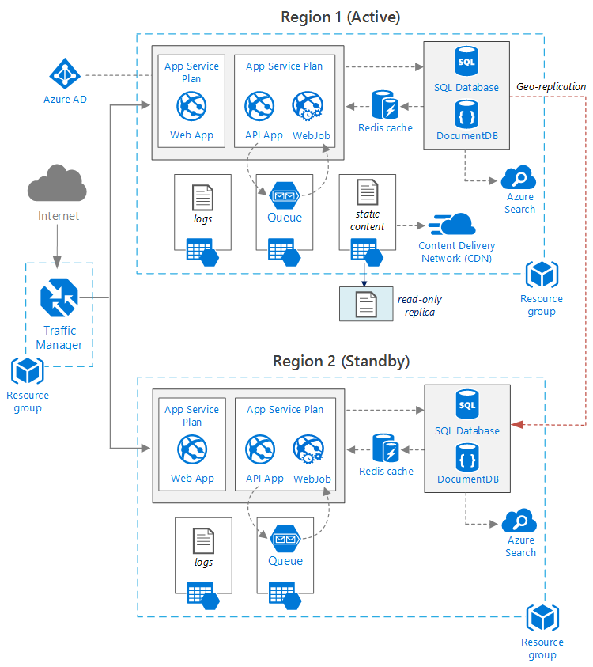

<properties
   pageTitle="Webseiten-Anwendung mit hoher Verfügbarkeit | Azure Bezug Architektur | Microsoft Azure"
   description="Empfohlene Architektur für Webanwendung mit hoher Verfügbarkeit, in Microsoft Azure ausgeführt."
   services="app-service,app-service\web,sql-database" 
   documentationCenter="na"
   authors="MikeWasson"
   manager="roshar"
   editor=""
   tags=""/>

<tags
   ms.service="guidance"
   ms.devlang="na"
   ms.topic="article"
   ms.tgt_pltfrm="na"
   ms.workload="na"
   ms.date="06/27/2016"
   ms.author="mwasson"/>

# <a name="azure-reference-architecture-web-application-with-high-availability"></a>Azure Bezug Architektur: Web-Anwendung mit hoher Verfügbarkeit

[AZURE.INCLUDE [pnp-RA-branding](../../includes/guidance-pnp-header-include.md)]

In diesem Artikel zeigt eine empfohlene Architektur für eine Webanwendung mit hoher Verfügbarkeit, klicken Sie auf Microsoft Azure ausgeführt. Die Architektur basiert auf [Azure Bezug Architektur: Verbessern der Skalierbarkeit in einer Webanwendung][guidance-web-apps-scalability].

## <a name="architecture-diagram"></a>Architekturdiagramm



Diese Architektur basiert auf den abgebildeten in [Verbesserung Skalierbarkeit in einer Webanwendung][guidance-web-apps-scalability]. Die wichtigsten Unterschiede sind:

- **Primären und sekundären Regionen**. Diese Architektur verwendet zwei Bereiche, um höhere Verfügbarkeit zu erzielen. Die Anwendung wird in den einzelnen Regionen bereitgestellt. Bei normalen Vorgängen wird Netzwerkverkehr an die primäre Region weitergeleitet. Aber wenn, die nicht mehr verfügbar ist, den Datenverkehr an die sekundäre Region weitergeleitet wird. Details zum Failover finden Sie unter [Verwalten von Failover](#managing-failover-and-failback).

- **Azure Datenverkehr-Manager**. [Datenverkehr Manager] [ traffic-manager] eingehende Anfragen an die primäre Region weitergeleitet. Wenn die Region Ausführung die Anwendung nicht mehr verfügbar ist, wechselt Datenverkehr-Manager auf der Sekundärachse Region. 

- **Geo-Replikation** der SQL-Datenbank und DocumentDB.

## <a name="recommendations"></a>Empfehlungen

### <a name="regional-pairing"></a>Landes-/ Verbindung

Jede Azure Region ist mit einer anderen Region innerhalb der gleichen Geography kombiniert. Wählen Sie im Allgemeinen Regionen aus dem gleichen Landes-/ Paar (z. B. ostasiatischen US 2 und zentralen USA) aus. Auf diese Weise bietet folgende Vorteile:

- Ist eine umfassende einem Dienstausfall, Wiederherstellung von mindestens eine Region aus jeder Paar erhält.
- Geplanten Azure System-Updates werden, die für Regionen sequenziell Variationswebsites um mögliche Ausfallzeiten zu minimieren.
- Befinden sich in den meisten Fällen Paare innerhalb der gleichen "geography", die Daten vor-Ort-erfüllen.

Jedoch stellen Sie sicher, dass beide Regionen alle Azure Dienste für eine Anwendung erforderlich unterstützt. [Services nach Region]finden Sie unter[services-by-region]. Weitere Informationen zu regionalen paarweise angegeben werden, finden Sie unter [Business Continuity- und Disaster Wiederherstellung (BCDR): Azure gepaart Regionen][regional-pairs].

### <a name="resource-groups"></a>Ressourcengruppen

Es sinnvoll sein, die primäre Region, sekundäre Region und den Datenverkehr Manager in separaten [Ressourcengruppen][resource groups]. Auf diese Weise können Sie die Ressourcen bereitgestellt, die in jeder Region als eine Sammlung verwalten &mdash; können Sie diese separat bereitstellen, löschen die Bereitstellung und usw. verursacht. 

### <a name="traffic-manager"></a>Datenverkehr-Manager

**Routing.** Datenverkehr Manager unterstützt mehrere [routing Algorithmen][tm-routing]. Verwenden Sie für die in diesem Artikel beschriebenen Szenario _Priorität_ routing (vormals als _Failover_ routing bezeichnet). Mit dieser Einstellung sendet den Datenverkehr Manager alle Anfragen an die primäre Region an, es sei denn, der Endpunkt für diese Region nicht mehr erreichbar ist. An diesem Punkt wechselt es automatisch auf der Sekundärachse Region. Finden Sie unter [Konfigurieren von Failover routing Methode][tm-configure-failover].

**Gesundheit Prüfpunkt.** Datenverkehr Manager verwendet eine Prüfpunkt HTTP (oder HTTPS), um die Verfügbarkeit der einzelnen Endpunkt zu überwachen. Der Prüfpunkt bietet Datenverkehr-Manager einen Test bestanden wurden oder für fehlerhafte über die sekundäre Region. Diese Funktion sendet eine Besprechungsanfrage zu einem angegebenen URL-Pfad. Wenn sie eine Antwort nicht 200 innerhalb einer bestimmten Zeit erhält, schlägt der Prüfpunkt. Nach vier fehlgeschlagener Anfragen Datenverkehr Manager den Endpunkt kennzeichnet, als heruntergestuft und wechselt auf den anderen Endpunkt. Details finden Sie unter [den Datenverkehr Manager Endpunkt Überwachung und Failover][tm-monitoring].

Als bewährte Methode erstellen Sie einen Systemzustand Prüfpunkt Endpunkt, der den gesamten der Anwendung Integritätsberichte, und verwenden Sie diesen Endpunkt für den Systemzustand Prüfpunkt. Der Endpunkt sollten kritische Abhängigkeiten wie der App-Service-apps, Speicherwarteschlange und SQL-Datenbank. Der Prüfpunkt andernfalls möglicherweise einen Endpunkt "fehlerfreien" melden, wenn kritische Teile der Anwendung tatsächlich Fehler aufgetreten sind. 

Andererseits, verwenden Sie nicht den Dienststatus Prüfpunkt niedriger Priorität Services prüfen. Wenn ein e-Mail-Dienst fällt aus, kann die Anwendung beispielsweise wechseln zu einer zweiten Anbieter oder nur e-Mails später senden. Die Anwendung sollte nicht in diesem Fall wahrscheinlich über fehl. Weitere Informationen finden Sie unter [Dienststatus Endpunkt Überwachung Muster][health-endpoint-monitoring-pattern].
  
### <a name="sql-database"></a>SQL-Datenbank

Verwenden der [Aktiven Geo-Replikation] [ sql-replication] zu einen lesbaren sekundären in einem anderen Bereich zu erstellen. Sie können bis zu vier lesbare sekundäre haben. Wenn die primäre Datenbank fehlschlägt, oder einfach, offline zu verwendenden muss können Sie Failover mit einer der sekundären Datenbanken. Aktive Geo-Replikation kann für eine Datenbank in einem beliebigen flexible Datenbank Pool konfiguriert werden.

### <a name="documentdb"></a>DocumentDB

DocumentDB unterstützt Regionen Geo-Replikation. Eine Region als beschreibbare festgelegt ist, und die anderen schreibgeschützte Replikate sind. 

Ist ein regionalen Ausfall, können Sie nicht durch Auswählen einer anderen Region in der Region schreiben sein. Der DocumentDB-Client, die automatisch SDK sendet schreiben Anfragen für den aktuellen Bereich schreiben, damit Sie nicht die Konfiguration des Clients nach einem Failover zu aktualisieren. Weitere Informationen finden Sie unter [Verteilen von Daten mit DocumentDB Global][docdb-geo]. 

> [AZURE.NOTE] Alle Replikate zu derselben Ressourcengruppe gehören.

### <a name="storage"></a>Speicher

Verwenden Sie für Azure-Speicher [Lesezugriff Geo redundante Speicher] [ ra-grs] (RAS-GRS). Mit RAS GRS Speicher werden die Daten zu einer sekundären Region repliziert. Sie haben schreibgeschützten Zugriff auf die Daten in der sekundäre Region, bis eine separate Endpunkt aus. Ist eine regionalen Ausfall oder einer, möglicherweise das Team Azure-Speicher, einen Geo-Failover auf der Sekundärachse Region ausführen. Es ist keine Kunden-Aktion, die für diese Failover erforderlich ist.

Erstellen Sie für Warteschlange-Speicher eine Sicherungskopie Warteschlange in der sekundäre Region ein. Während des Failovers können die app die Sicherung Warteschlange, bis die primäre Region wieder verfügbar ist. Auf diese Weise kann die Anwendung weiterhin neue Anfragen bearbeitet werden. 

## <a name="availability-considerations"></a>Verfügbarkeit Aspekte

Eine Architektur mit mehreren Region kann höheren Verfügbarkeit als bereitstellen für eine einzelne Region bereitstellen. Wenn ein regionalen Ausfall die primäre Region beeinträchtigt, können Sie über die Region ein anderes sekundäre fehl. Diese Architektur kann auch hilfreich, wenn eine einzelne Subsystem der Anwendung schlägt fehl.  
     
Es gibt mehrere allgemeine Verfahren zum Erreichen einer hohen Verfügbarkeit über Data Center:      
- Aktiv/Passiv mit tollen Standby. Datenverkehr geht an eine Region, während die anderen wartet auf Standby. Die Anwendung ist bereitgestellten und ausgeführten in der sekundäre Region ein. Sie möglicherweise beginnen mit einer kleineren Anzahl der Instanzen in sekundäre Data Center und dann Skalieren je nach Bedarf. 

- Aktiv/Passiv mit kalt Standby. Die gleiche, aber Anwendung wird erst bereitgestellt für Failover erforderlich. Dieser Ansatz Kosten kleiner ausgeführt werden, allerdings werden in der Regel mehr Zeiten bei einem Fehler. 

- Aktiv/aktiv. Beide Regionen aktiv, und Serviceanfragen sind Lastenausgleich dazwischen. Wenn eine Datacenter nicht mehr verfügbar ist, wird diese außerhalb des Drehung übernommen. 

Dieser Artikel befasst sich aktiv/passiv wichtiges Standby-Modus, mit dem [Azure Datenverkehr-Manager] [ traffic-manager] für die Weiterleitung Verkehr in den Bereich. 

### <a name="traffic-manager"></a>Datenverkehr-Manager

Datenverkehr-Manager kann automatisch über auf, wenn die primäre Region nicht mehr verfügbar ist. Über den Datenverkehr Manager schlägt fehl, gibt es ein Zeitraum Wenn Clients die Anwendung, die mehrere Minuten sein kann erreichen kann. Zwei Faktoren wirken sich auf die gesamte Dauer:

- Der Dienststatus Prüfpunkt muss erkannt werden, dass das primäre Data Center nicht erreichbar ist.

- DNS-Server müssen die zwischengespeicherten DNS-Einträge für die IP-Adresse Aktualisieren der abhängt, die DNS-Time to live (TTL). Die Standard-TTL ist 300 Sekunden (5 Minuten), aber Sie können diesen Wert konfigurieren, wenn Sie das Profil Datenverkehr Manager erstellen.

Details finden Sie unter [Informationen zu den Datenverkehr Manager Überwachung][tm-monitoring]. 

Datenverkehr-Manager ist ein Punkt möglicherweise Fehler im System. Wenn der Dienst fehlschlägt, können keine Clients Ihrer Anwendung während der Ausfall zugreifen. Überprüfen Sie den [Datenverkehr Manager Vereinbarung zum SERVICELEVEL][tm-sla], und feststellen, ob Datenverkehr Manager alleine mit Ihren geschäftlichen Anforderungen für eine hohe Verfügbarkeit entspricht. Wenn dies nicht der Fall ist, fügen Sie ein anderes Datenverkehr Management-Lösung als ein Failback hinzu. Wenn der Dienst-Manager Azure-Datenverkehr fehlschlägt, Ändern der CNAME-Einträge in DNS auf den Datenverkehr-Verwaltungsdienst verweisen. (Dieser Schritt muss manuell ausgeführt werden, und Ihrer Anwendung nicht verfügbar ist, bis die DNS-Änderungen weitergegeben werden). 

### <a name="sql-database"></a>SQL-Datenbank

Die Wiederherstellung Punkt Ziel (RPO) und die geschätzte Wiederherstellungszeit (Einfügen) für SQL-Datenbank beschrieben sind [hier][sql-rpo]. 

### <a name="storage"></a>Speicher

RAS GRS Speicher bietet dauerhaften Speicher, aber es ist wichtig zu verstehen, was bei einem Ausfall auftreten können: 

- Wenn ein Speicher Ausfall auftritt, werden eine bestimmten Zeitspanne, wenn Sie Schreibzugriff auf die Daten besitzen. Sie können weiterhin vom sekundären Endpunkt während der Ausfall lesen.

- Wenn eine regionalen Ausfall oder einer wirkt sich auf die gewohnten Standort befinden, und die Daten dort nicht wiederhergestellt werden kann, kann das Team Azure-Speicher einen Geo-Failover auf der Sekundärachse Region ausführen festlegen. 

- Replikation der Daten in der Region sekundäre wird asynchrone ausgeführt. Wenn ein Geo-Failover durchgeführt werden, ist daher Datenverlust möglich, wenn die Daten aus der primären Region nicht wiederhergestellt werden können.

- Vorübergehende Fehler, wie ein Netzwerkausfall werden keine Speicherfailover auslösen. Entwerfen Sie die Anwendung flexibel in Bezug auf vorübergehende Fehler sein. Mögliche Problembehebungen:

    - Lesen Sie die sekundäre.

    - Wechseln Sie vorübergehend an ein anderes Konto von Speicherplatz für neue Vorgänge (z. B. Nachrichten in eine Warteschlange). 

    - Kopieren Sie Daten aus der sekundären an ein anderes Speicherkonto an.

    - Bereitstellen Sie eingeschränkter Funktionalität, bis das System wieder fehlschlägt.

Weitere Informationen finden Sie unter [Vorgehensweise bei einem Azure-Speicher Ausfall][storage-outage].

## <a name="managing-failover-and-failback"></a>Verwalten von Failover und failback

### <a name="traffic-manager"></a>Datenverkehr-Manager

Datenverkehr-Manager kann automatisch über auf, wenn die primäre Region nicht mehr verfügbar ist. Standardmäßig tritt es auch automatisch wieder, ein Fehler, sobald die primäre Region wieder verfügbar ist.

Wir empfehlen jedoch manuelle Failback durchführen, anstatt weiß nicht automatisch zurück. Bevor wieder fehlschlägt, stellen Sie sicher, dass alle Anwendung Teilsystemen fehlerfrei sind. Andernfalls können Sie eine Situation erstellen, in dem die Anwendung vorwärts und rückwärts zwischen Data Center spiegelt. 

Zum Automatisches Failback zu verhindern, müssen senken Sie die Priorität der primären Region manuell nach einer Failoverereignisses. Nehmen Sie beispielsweise an die primäre Region ist Priorität 1 und des sekundären Priorität 2. Legen Sie nach einem Failover die primäre Region auf Priorität 3, um automatische Failback verhindern, dass ein. Wenn Sie nicht mehr zurück wechseln möchten, setzen Sie die Priorität auf 1 zurück.

Die folgenden Befehle aktualisieren die Priorität.

**PowerShell** 

```bat
$endpoint = Get-AzureRmTrafficManagerEndpoint -Name <endpoint> -ProfileName <profile> -ResourceGroupName <resource-group> -Type AzureEndpoints
$endpoint.Priority = 3
Set-AzureRmTrafficManagerEndpoint -TrafficManagerEndpoint $endpoint
```

Weitere Informationen finden Sie unter [Azure Datenverkehr Manager Cmdlets][tm-ps].

**Azure CLI**

```bat
azure network traffic-manager endpoint set --name <endpoint> --profile-name <profile> --resource-group <resource-group> --type AzureEndpoints --priority 3
```    

### <a name="sql-database"></a>SQL-Datenbank

Wenn die primäre Datenbank fehlschlägt, führen Sie ein manuelles Failover auf die sekundäre Datenbank ein. [Wiederherstellen einer Azure SQL-Datenbank oder Failover zu einem sekundären]finden Sie unter[sql-failover]. Bis Sie über ein Fehler auftreten, bleibt die sekundäre Datenbank schreibgeschützt. 


<!-- links -->

[azure-sql-db]: https://azure.microsoft.com/en-us/documentation/services/sql-database/
[docdb-geo]: ../documentdb/documentdb-distribute-data-globally.md
[guidance-web-apps-scalability]: guidance-web-apps-scalability.md
[health-endpoint-monitoring-pattern]: https://msdn.microsoft.com/library/dn589789.aspx
[ra-grs]: ../storage/storage-redundancy.md#read-access-geo-redundant-storage
[regional-pairs]: ../best-practices-availability-paired-regions.md
[resource groups]: ../resource-group-overview.md
[services-by-region]: https://azure.microsoft.com/en-us/regions/#services
[sql-failover]: ../sql-database/sql-database-disaster-recovery.md
[sql-replication]: ../sql-database/sql-database-geo-replication-overview.md
[sql-rpo]: ../sql-database/sql-database-business-continuity.md#sql-database-business-continuity-features
[storage-outage]: ../storage/storage-disaster-recovery-guidance.md
[tm-configure-failover]: ../traffic-manager/traffic-manager-configure-failover-routing-method.md
[tm-monitoring]: ../traffic-manager/traffic-manager-monitoring.md
[tm-ps]: https://msdn.microsoft.com/en-us/library/mt125941.aspx
[tm-routing]: ../traffic-manager/traffic-manager-routing-methods.md
[tm-sla]: https://azure.microsoft.com/en-us/support/legal/sla/traffic-manager/v1_0/
[traffic-manager]: https://azure.microsoft.com/en-us/services/traffic-manager/
