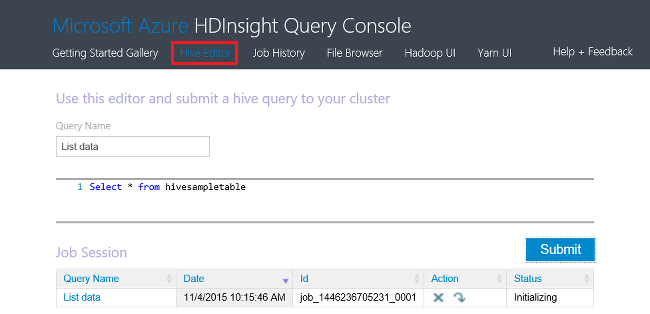

<properties
    pageTitle="Hadoop Cluster in Verwenden des Portals Azure HDInsight verwalten | Microsoft Azure"
    description="Erfahren Sie, wie HDInsight Service verwalten. Erstellen eines HDInsight Clusters, öffnen Sie die interaktive JavaScript-Verwaltungskonsole, und öffnen Sie den Befehl Console Hadoop."
    services="hdinsight"
    documentationCenter=""
    tags="azure-portal"
    authors="mumian"
    manager="jhubbard"
    editor="cgronlun"/>

<tags
    ms.service="hdinsight"
    ms.workload="big-data"
    ms.tgt_pltfrm="na"
    ms.devlang="na"
    ms.topic="article"
    ms.date="09/14/2016"
    ms.author="jgao"/>

# Verwalten von Hadoop Cluster in HDInsight mithilfe des Azure-Portals

[AZURE.INCLUDE [selector](../../includes/hdinsight-portal-management-selector.md)]

Verwenden des [Azure-Portal][azure-portal], können Sie in Azure HDInsight Hadoop-Cluster erstellen, Hadoop Benutzerkennwort ändern und (Remotedesktopprotokoll) aktivieren, damit Sie den Befehl Console Hadoop auf den Cluster zugreifen können.

Die Informationen in diesem Artikel gilt nur für Fenster-basierten HDInsight Cluster. Informationen zum Verwalten von Linux-basierten Cluster klicken Sie auf das tabstoppauswahlsymbol oben.

Klicken Sie auf das tabstoppauswahlsymbol Informationen zum Erstellen von Hadoop Cluster in HDInsight mit anderen Tools. 

**Erforderliche Komponenten**

Vorbemerkung in diesem Artikel müssen Sie Folgendes:

- **Ein Azure-Abonnement**. Finden Sie [kostenlose Testversion Azure abrufen](https://azure.microsoft.com/documentation/videos/get-azure-free-trial-for-testing-hadoop-in-hdinsight/).
- **Speicher Azure-Konto** – ein HDInsight Cluster verwendet einen Azure BLOB-Speichercontainer als Standard-Dateisystem. Weitere Informationen darüber, wie Azure Blob-Speicher problemlos mit HDInsight Cluster bereitstellt finden Sie unter [Verwenden von Azure BLOB-Speicher mit HDInsight](hdinsight-hadoop-use-blob-storage.md). Details zum Erstellen eines Kontos Azure-Speicher finden Sie unter [So erstellen Sie ein Konto Speicher](../storage/storage-create-storage-account.md).

##Öffnen Sie das Portal

1. Melden Sie sich bei [https://portal.azure.com](https://portal.azure.com).
2. Nachdem Sie das Portal geöffnet haben, können Sie:

    - Klicken Sie auf **neu** aus dem linken Menü, um einen neuen Cluster zu erstellen:
    
        
    - Klicken Sie im Menü links auf **HDInsight Cluster** .
    
        

    Wenn **HDInsight** im linken Menü angezeigt wird, klicken Sie auf **Durchsuchen**. 

    

##Cluster erstellen

Die Anleitung zum Erstellen eines im Portal verwenden finden Sie unter [Erstellen HDInsight Cluster](hdinsight-provision-clusters.md#create-using-the-preview-portal).

HDInsight funktioniert mit einer Breite von Hadoop-Komponenten. Für die Liste der Komponenten, die überprüft und unterstützt wurden, finden Sie unter [welche Version Hadoop in Azure HDInsight](hdinsight-component-versioning.md). Sie können HDInsight anpassen, indem Sie eine der folgenden Optionen:

- Verwenden Sie Skript-Aktion, um benutzerdefinierte Skripts ausgeführt, die einen Cluster um Cluster-Konfiguration ändern oder benutzerdefinierte Komponenten, wie z. B. Giraph oder Solr installieren angepasst werden können. Weitere Informationen finden Sie unter [Anpassen HDInsight Cluster mithilfe der Aktion Skript](hdinsight-hadoop-customize-cluster.md).
- Verwenden Sie die Cluster Anpassungsparameter in der HDInsight .NET SDK oder Azure PowerShell während der Clustererstellung aus. Diese Konfiguration Änderungen werden dann über die Gültigkeitsdauer der Cluster beibehalten und sind von Cluster Knoten Reimages, die Azure-Plattform regelmäßig für die Wartung durchführt nicht betroffen. Weitere Informationen zur Verwendung der Cluster Anpassungsparameter finden Sie unter [Erstellen von HDInsight Cluster](hdinsight-provision-clusters.md).
- Einige systemeigenen Java-Komponenten, wie Mahout und verknüpften, können als JAR-Dateien auf dem Cluster ausgeführt werden. Diese JAR-Dateien können an Azure Blob-Speicher verteilt und auf HDInsight Cluster über Hadoop Auftrag Einreichung Verfahren gesendet werden. Weitere Informationen finden Sie unter [Senden Hadoop Aufträge programmgesteuert](hdinsight-submit-hadoop-jobs-programmatically.md).

    >[AZURE.NOTE] Wenn Sie Probleme beim Bereitstellen von JAR-Dateien in HDInsight Cluster oder beim Aufrufen von JAR-Dateien auf HDInsight Cluster haben, wenden Sie sich an den [Microsoft-Support](https://azure.microsoft.com/support/options/).

    > Überlappung von HDInsight nicht unterstützt wird, und ist nicht für Microsoft Support berechtigt. Listen der unterstützten Komponenten, finden Sie unter [Neuigkeiten in den Cluster Versionen von HDInsight bereitgestellten?](hdinsight-component-versioning.md).

Installation von benutzerdefinierten Software auf dem Cluster über Remote Desktop-Verbindung wird nicht unterstützt. Sie sollten nicht gleichzeitig Speichern von Dateien auf den Laufwerken des am Knotens, da diese verloren geht, wenn Sie die Cluster neu erstellen müssen. Es empfiehlt sich, Speichern von Dateien auf Azure Blob-Speicher. BLOB-Speicher ist beständig.

##Hinzufügen und Anzeigen von Cluster

1. Melden Sie sich bei [https://portal.azure.com](https://portal.azure.com).
2. Klicken Sie im Menü links auf **HDInsight Cluster** .
3. Klicken Sie auf den Clusternamen. Wenn die Liste Cluster lang ist, können Sie Filter am oberen Rand der Seite.
4. Doppelklicken Sie auf einem Cluster aus der Liste aus, um die Details anzuzeigen.

    **Menü und Essentials**:

    
    
    - Um das Menü anzupassen, mit der rechten Sie Maustaste auf das Menü, und klicken Sie dann auf **Anpassen**.
    - **Einstellungen** und **Alle**: Zeigt das Blade **Einstellungen** für den Cluster, dem Sie detaillierte Konfigurationsinformationen für den Cluster zugreifen kann.
    - **Dashboard**, **Dashboard Cluster** und **URL: Dies sind alle Vorgänge auf das Dashboard Cluster zugreifen, die Ambari Web für Linux-basierten Cluster ist. - **Secure Shell **: Zeigt die Anweisungen, um zum Cluster mithilfe von Secure Shell (SSH) Verbindung herstellen können.
    - **Maßstab Cluster**: ermöglicht es Ihnen, die Anzahl der Worker Knoten für diesen Cluster ändern.
    - **Löschen**: Löscht den Cluster.
    - **Schnellstart ()**: Zeigt Informationen an, mit denen Sie erste Schritte mit HDInsight.
    - **Benutzer ()**: Festlegen von Berechtigungen für die _Verwaltung der Portalseite_ für diesen Cluster für andere Benutzer Ihres Abonnements Azure ermöglicht.
    
        > [AZURE.IMPORTANT] Diese _nur_ wirkt sich auf Access und Berechtigungen mit diesem Cluster im Azure-Portal, und hat keine Auswirkung auf, wer Herstellen einer Verbindung mit oder Aufträge zum Cluster HDInsight senden können.
    - **Kategorien ()**: Kategorien können Sie die Schlüssel/Wert-Paare zum Definieren einer benutzerdefinierten Taxonomie Ihrer Cloud-Dienste zu bestimmen. Sie können beispielsweise erstellen Sie einen Schlüssel mit dem Namen __Project__und verwenden Sie dann einen gemeinsamen Wert für alle Dienste, die einem bestimmten Projekt zugeordnet.
    - **Ambari Ansichten**: Links zu Ambari Web.
    
    > [AZURE.IMPORTANT] Sie müssen zum Verwalten der Dienste von HDInsight Cluster Ambari Web oder die Ambari REST-API verwenden. Weitere Informationen zur Verwendung von Ambari finden Sie unter [Verwalten von HDInsight Cluster Ambari verwenden](hdinsight-hadoop-manage-ambari.md).

    **Verwendung**:
    
    
    
5. Klicken Sie auf **Einstellungen**.

    

    - **Eigenschaften**: Anzeigen der Clustereigenschaften.
    - **Cluster AAD Identität**: 
    - **Tasten der Azure-Speicher**: Anzeigen des Standardkontos für den Speicher und den zugehörigen Schlüssel. Das Speicherkonto ist Konfiguration beim Erstellen der Cluster.
    - **Cluster Login**: Ändern der Cluster HTTP-Benutzernamen und Ihr Kennwort ein.
    - **Externe Metastores**: Anzeigen der Struktur und Oozie Metastores. Die Metastores kann nur beim Erstellen der Cluster konfiguriert werden.
    - **Maßstab Cluster**: erhöhen und Verringern der Anzahl der Cluster Worker Knoten.
    - **Remotedesktop**: Aktivieren und deaktivieren Remotedesktop (RDP) zugreifen und Konfigurieren der RDP-Benutzername.  Der Benutzername RDP dürfen den HTTP-Benutzernamen unterscheiden.
    - **Eingetragener Partner**:
    
    > [AZURE.NOTE] Dies ist eine generische Liste von Einstellungen zur Verfügung. nicht alle wird für alle Clustertypen vorhanden sein.

6. Klicken Sie auf **Eigenschaften**:

    Die Eigenschaften werden die folgenden Listen:
    
    - **Hostname**: Cluster-Name.
    - **Cluster-URL**.
    - **Status**: einschließen abgebrochen, akzeptiert, ClusterStorageProvisioned, AzureVMConfiguration, HDInsightConfiguration, Betrieb, ausgeführt, Fehler, löschen, gelöscht haben, Timedout DeleteQueued DeleteTimedout DeleteError PatchQueued CertRolloverQueued ResizeQueued, ClusterCustomization
    - **Region**: Azure-Speicherort. Eine Liste der unterstützten Azure Orte finden Sie unter **Region** Dropdown-Listenfeld auf [HDInsight Preise](https://azure.microsoft.com/pricing/details/hdinsight/).
    - **Daten erstellt**.
    - **Betriebssystem**: entweder **Windows** oder **Linux**.
    - **Type**: Hadoop, HBase, Sturm, aufzeigen. 
    - **Version**. Finden Sie unter [HDInsight Versionen](hdinsight-component-versioning.md)
    - **Abonnements**: Abonnementname.
    - **Abonnement-ID**.
    - **Primäre Datenquelle**. Das Azure BLOB-Speicherkonto verwendet Hadoop Dateisystem als Standardwert.
    - **Worker Knoten Preise Ebene**.
    - **Kopf Knoten Preisgestaltung Ebene**.

##Cluster löschen

Löschen einer Cluster Löschen des Standardkontos für den Speicher oder alle Speicherkonten verknüpfte nicht. Sie können den Cluster neu erstellen, mit den gleichen Speicherkonten und die gleichen Metastores.

1. Melden Sie sich mit dem [Portal][azure-portal].
2. Klicken Sie im Menü links auf **Alle durchsuchen** , klicken Sie auf **HDInsight Cluster**, klicken Sie auf Ihren Clusternamen.
3. Klicken Sie im oberen Menü auf **Löschen** , und folgen Sie dann die Anweisungen.

Siehe auch [Anhalten/Cluster beenden](#pauseshut-down-clusters).

##Maßstab Cluster
Cluster Skalierung Feature ermöglicht Ihnen, ändern die Anzahl der Worker-Knoten verwendet, die für einen Cluster, der in Azure HDInsight ausgeführt wird, ohne den Cluster erneut erstellen.

>[AZURE.NOTE] Nur mit HDInsight Version 3.1.3 Cluster oder höher werden unterstützt. Wenn Sie die Version von Ihren Cluster kennen, können Sie auf die Seite Eigenschaften überprüfen.  Finden Sie unter [Liste und anzeigen Cluster](#list-and-show-clusters).

Die Auswirkung zum Ändern der Anzahl der Datenknoten für jede Art von Cluster von HDInsight unterstützt:

- Hadoop

    Sie können nahtlos die Anzahl der Worker-Knoten in einem Cluster Hadoop erhöhen, die ohne zu beeinträchtigen Ausstehend oder laufenden Aufträge ausgeführt wird. Neue Aufträge können auch gesendet werden, während der Vorgang ausgeführt wird. Fehler bei einer Skalierung sind ordnungsgemäß behandelt, sodass der Cluster funktionsfähig immer offen steht.

    Wenn ein Cluster Hadoop nach unten durch Verringern der Anzahl der Datenknoten skaliert ist, werden einige der Dienste im Cluster neu gestartet. Dadurch alle laufenden und anstehende Aufträge nach Abschluss des Vorgangs Skalierung fehlschlägt. Sie können, jedoch die Aufträge erneut, nachdem der Vorgang abgeschlossen ist.

- HBase

    Sie können nahtlos hinzufügen oder Entfernen von Knoten zum Cluster HBase während der Ausführung. Innerhalb weniger Minuten der Abschluss der Skalierung Operation sind automatisch Landes-/ Server ausgelastet. Sie können jedoch auch manuell die regionalen Server Saldo, nach in der Headnode der Cluster Protokollierung, und führen die folgenden Befehle aus, ein Eingabeaufforderungsfenster:

        >pushd %HBASE_HOME%\bin
        >hbase shell
        >balancer

    Weitere Informationen zur Verwendung der HBase-Verwaltungsshell finden Sie unter]
- Storm

    Nahtloses können Sie hinzufügen oder Entfernen von Datenknoten zum Cluster Storm während der Ausführung. Müssen Sie jedoch nach einer erfolgreichen Abschluss des Vorgangs Skalierung, wird der Suchtopologie neu zu verteilen.

    Qualifikationsprofilen kann auf zwei Arten erreicht werden:

    * Storm Web-Benutzeroberfläche
    * Tool line Interface (CLI)

    Lizenzinformationen finden Sie in der [Dokumentation Apache Storm](http://storm.apache.org/documentation/Understanding-the-parallelism-of-a-Storm-topology.html) Weitere Details.

    Das Storm Web-Benutzeroberfläche steht im Cluster HDInsight zur Verfügung:

    

    Hier ist ein Beispiel, wie Sie mithilfe des Befehls CLI um der Suchtopologie Storm neu zu verteilen:

        ## Reconfigure the topology "mytopology" to use 5 worker processes,
        ## the spout "blue-spout" to use 3 executors, and
        ## the bolt "yellow-bolt" to use 10 executors

        $ storm rebalance mytopology -n 5 -e blue-spout=3 -e yellow-bolt=10

**Zum Skalieren Cluster**

1. Melden Sie sich mit dem [Portal][azure-portal].
2. Klicken Sie im Menü links auf **Alle durchsuchen** , klicken Sie auf **HDInsight Cluster**, klicken Sie auf Ihren Clusternamen.
3. Klicken Sie im oberen Menü auf **Einstellungen** , und klicken Sie dann auf **Farben-Skala Cluster**.
4. Geben Sie die **Anzahl der Worker-Knoten**. Die maximale Anzahl der Cluster-Knoten variiert zwischen Azure-Abonnements. Sie können den Support zum Erhöhen des Grenzwert kontaktieren.  Die Kosteninformationen werden die Änderungen wirken sich aus, die Sie in die Anzahl der Knoten vorgenommen haben.

    

##Beenden Sie anhalten/Cluster

Die meisten Hadoop Aufträge sind, die Stapelverarbeitung abgeschlossen, die nur gelegentlich ausgeführt haben. Für die meisten Hadoop Cluster gibt es großen Zeiträume, die der Cluster nicht für die Verarbeitung verwendet wird. Mit HDInsight Ihre Daten in Azure-Speicher gespeichert, sodass Sie problemlos einen Cluster löschen können, wenn es nicht verwendet wird.
Sie unterliegen auch nach einem HDInsight Cluster, auch wenn es nicht verwendet wird. Da die Gebühren für den Cluster oft mehr als die Gebühren für Speicher sind, ist es economic sinnvoll Cluster löschen, wenn er nicht verwendet werden.

Es gibt viele Möglichkeiten, die Sie den Prozess Programmierung verwenden können:

- Benutzer Azure Daten Factory. Bei Bedarf und selbst definierten HDInsight verknüpft Services finden Sie unter [Verknüpfte Azure HDInsight-Dienst](../data-factory/data-factory-compute-linked-services.md) und [Transformieren und analysieren, indem Sie die Daten Factory Azure](../data-factory/data-factory-data-transformation-activities.md) .
- Verwenden von Azure PowerShell.  Finden Sie unter [Analysieren Verzögerung Flugdaten](hdinsight-analyze-flight-delay-data.md).
- Verwenden von Azure CLI. Finden Sie unter [Verwalten HDInsight Cluster Azure CLI verwenden](hdinsight-administer-use-command-line.md).
- Verwenden Sie HDInsight .NET SDK. Finden Sie unter [Senden Hadoop Aufträge](hdinsight-submit-hadoop-jobs-programmatically.md).

Die Preisinformationen finden Sie unter [HDInsight Preise](https://azure.microsoft.com/pricing/details/hdinsight/). Um einen Cluster aus dem Portal löschen möchten, finden Sie unter [Cluster löschen](#delete-clusters)

##Änderung Cluster Benutzername

Ein HDInsight Cluster kann zwei Benutzerkonten verfügen. Beim Erstellen der wird das HDInsight Cluster Benutzerkonto erstellt. Sie können auch eine RDP-Benutzerkonto für den Zugriff auf den Cluster über RDP erstellen. Finden Sie unter [Aktivieren von Remotedesktop](#connect-to-hdinsight-clusters-by-using-rdp).

**So ändern Sie die HDInsight Cluster-Benutzernamen und das Kennwort**

1. Melden Sie sich mit dem [Portal][azure-portal].
2. Klicken Sie im Menü links auf **Alle durchsuchen** , klicken Sie auf **HDInsight Cluster**, klicken Sie auf Ihren Clusternamen.
3. Klicken Sie im oberen Menü auf **Einstellungen** , und klicken Sie dann auf **Cluster Login**.
4. Wenn **Cluster Login** aktiviert wurde, müssen Sie klicken Sie auf **Deaktivieren**, und klicken Sie dann auf **Aktivieren** , bevor Sie den Benutzernamen und das Kennwort ändern können...
4. Ändern Sie der **Anmeldename Cluster** und/oder das **Anmeldekennwort Cluster**, und klicken Sie dann auf **Speichern**.

    

##Zugriff gewähren/widerrufen

HDInsight Cluster stehen die folgenden HTTP-Webdienste (alle der folgenden Dienste verwenden REST-Endpunkten):

- ODBC
- JDBC
- Ambari
- Oozie
- Templeton

Standardmäßig werden diese Dienste für den Zugriff erteilt. Sie können widerrufen/Zugriff vom Azure-Portal erteilen.

>[AZURE.NOTE] Durch den Zugriff gewähren/aufheben, werden Sie Cluster Benutzername und Kennwort zurücksetzen.

**Zum Erteilen/HTTP-Dienste Webzugriff widerrufen**

1. Melden Sie sich mit dem [Portal][azure-portal].
2. Klicken Sie im Menü links auf **Alle durchsuchen** , klicken Sie auf **HDInsight Cluster**, klicken Sie auf Ihren Clusternamen.
3. Klicken Sie im oberen Menü auf **Einstellungen** , und klicken Sie dann auf **Cluster Login**.
4. Wenn **Cluster Login** aktiviert wurde, müssen Sie klicken Sie auf **Deaktivieren**, und klicken Sie dann auf **Aktivieren** , bevor Sie den Benutzernamen und das Kennwort ändern können...
6. Geben Sie für **Cluster-Benutzernamen** und das **Anmeldekennwort Cluster**den neuen Benutzernamen und das Kennwort (jeweils) für den Cluster.
7. Klicken Sie auf **Speichern**.

    

##Suchen des Standardkontos-Speicher

Jeder Cluster HDInsight verfügt über kein Speicher Standardkonto. Das Standardkonto für den Speicher und deren Schlüssel für einen Cluster angezeigt wird, klicken Sie unter **Einstellungen**/**Eigenschaften**/**Azure-Speicher-Taste**. Finden Sie unter [Liste und anzeigen Cluster](#list-and-show-clusters).

    
##Suchen nach der Ressourcengruppe 

Im Modus Azure Ressourcenmanager wird jede HDInsight Cluster mit einer Azure Ressourcengruppe erstellt. Die Azure Ressourcengruppe, der zu ein Cluster gehört, wird in:

- Die Liste Cluster verfügt über eine Spalte **Ressourcengruppe** .
- **Grundlegende** Cluster-Kachel.  

Finden Sie unter [Liste und anzeigen Cluster](#list-and-show-clusters).
   
##Geöffnete HDInsight Abfrage-Konsole

Die Abfrage HDInsight Konsole umfasst die folgenden Features:

- **Erste Schritte-Katalog**: um den Katalog zu verwenden, finden Sie unter [Informationen Hadoop mithilfe der Azure HDInsight erste Schritte-Katalog](hdinsight-learn-hadoop-use-sample-gallery.md).
- **Struktur Editor**: A-Benutzeroberfläche-Web für Struktur Aufträge weiterleiten.  Finden Sie unter [Ausführen Struktur Abfragen mithilfe der Verwaltungskonsole für die Abfrage](hdinsight-hadoop-use-hive-query-console.md)ein.

    

- **Historie**: Monitor Hadoop Aufträge.  

    

    Klicken Sie auf **Abfragenamen** , um die Position Eigenschaften **Auftrag Abfrage**, einschließlich Details anzuzeigen und ** Auftragsausgabe. Sie können auch die Abfrage, und die Ausgabe an Ihre Arbeitsstationen herunterladen.

- **Datei-Browser**: Durchsuchen des Standardkontos für den Speicher und die verknüpfte Speicherkonten.

    

    Klicken Sie auf den Screenshot der **<Account>** Typ zeigt an, das Element ist ein Konto Azure-Speicher.  Klicken Sie auf den Namen des Kontos, um die Dateien zu navigieren.
    
- **Hadoop-Benutzeroberfläche**.

    
    
    Aus **Hadoop-Benutzeroberfläche*, können Sie Dateien suchen und Protokolle überprüfen. 

- **Aus Benutzeroberfläche**.

    

##Ausführen von Abfragen Struktur

Um Struktur Aufträge aus dem Portal ausgeführt wird, klicken Sie auf **Struktur Editor** in der Verwaltungskonsole HDInsight Abfrage. Finden Sie unter [Abfrage öffnen HDInsight Console](#open-hdinsight-query-console).

##Monitor Aufträge

Zum Überwachen der Einzelvorgänge aus dem Portal, klicken Sie in der Verwaltungskonsole HDInsight Abfrage auf **Historie** . Finden Sie unter [Abfrage öffnen HDInsight Console](#open-hdinsight-query-console).

##Durchsuchen von Dateien

Klicken Sie zum Durchsuchen von Dateien, die in das Standardkonto für den Speicher und die verknüpfte Speicherkonten gespeichert, in der Abfrage HDInsight-Verwaltungskonsole auf **Datei-Browser** . Finden Sie unter [Abfrage öffnen HDInsight Console](#open-hdinsight-query-console).

Sie können auch das Programm **Durchsuchen des Dateisystems** aus der **Hadoop-Benutzeroberfläche** in der Konsole HDInsight verwenden.  Finden Sie unter [Abfrage öffnen HDInsight Console](#open-hdinsight-query-console).

##Monitor Cluster Verwendung

Im Abschnitt __Verwendung__ des Blades Cluster HDInsight zeigt Informationen über die Anzahl der verfügbaren Kerne für Ihr Abonnement für die Verwendung mit HDInsight als auch die Anzahl der Kerne reserviert diesen Cluster und wie sie für die Knoten in diesem Cluster zugewiesen sind. Finden Sie unter [Liste und anzeigen Cluster](#list-and-show-clusters).

> [AZURE.IMPORTANT] Zum Überwachen der Dienste von HDInsight Cluster, müssen Sie Ambari Web oder die Ambari REST-API verwenden. Weitere Informationen zur Verwendung von Ambari finden Sie unter [Verwalten von HDInsight Cluster mit Ambari](hdinsight-hadoop-manage-ambari.md)

##Hadoop-Benutzeroberfläche öffnen

Zum Überwachen der Cluster, das Dateisystem durchsuchen, und überprüfen die Protokolle, klicken Sie in der Abfrage HDInsight-Verwaltungskonsole auf **Hadoop-Benutzeroberfläche** . Finden Sie unter [Abfrage öffnen HDInsight Console](#open-hdinsight-query-console).

##Öffnen Sie aus UI

Wenn aus Benutzeroberfläche verwenden möchten, klicken Sie auf **Aus Benutzeroberfläche** in der Verwaltungskonsole HDInsight Abfrage. Finden Sie unter [Abfrage öffnen HDInsight Console](#open-hdinsight-query-console).

##Herstellen einer Verbindung mit RDP Cluster mit

Die Anmeldeinformationen für den Cluster, den Sie bei seiner Erstellung bereitgestellt gewähren Sie Zugriff auf die Dienste auf dem Cluster, jedoch nicht in den Cluster über Remote Desktop. Sie können Remotedesktop Zugriff aktivieren, wenn Sie einen Cluster bereitstellen oder nach ein Cluster bereitgestellt wird. Die Anweisungen zum Aktivieren des Remote Desktop bei der Erstellung finden Sie unter [Cluster HDInsight zu erstellen](hdinsight-provision-clusters.md).

**Aktivieren von Remotedesktop**

1. Melden Sie sich mit dem [Portal][azure-portal].
2. Klicken Sie im Menü links auf **Alle durchsuchen** , klicken Sie auf **HDInsight Cluster**, klicken Sie auf Ihren Clusternamen.
3. Klicken Sie im oberen Menü auf **Einstellungen** , und klicken Sie dann auf **Remotedesktop**.
4. Geben Sie **Läuft ab am**, **Remote Desktop-Benutzernamen** und **Kennwort für Remote Desktop**, und klicken Sie dann auf **Aktivieren**.

    

    Die Standardwerte für läuft ab am ist eine Woche.
> [AZURE.NOTE] HDInsight .NET SDK können Sie auch den Remotedesktop auf einem Cluster aktivieren. Verwenden Sie die **EnableRdp** -Methode der HDInsight-Client-Objekt in folgender Weise: **Client. EnableRdp (Clustername, Speicherort, "Rdpuser", "Rdppassword", DateTime.Now.AddDays(6))**. Um Remote Desktop auf dem Cluster zu deaktivieren, können Sie auf ähnliche Weise **Client verwenden. DisableRdp (Clustername, Speicherort)**. Weitere Informationen zu diesen Methoden finden Sie unter [HDInsight .NET SDK-Referenz](http://go.microsoft.com/fwlink/?LinkId=529017). Dies gilt nur für HDInsight-Cluster unter Windows.

**Verbindung zu einem Cluster über RDP**

1. Melden Sie sich mit dem [Portal][azure-portal].
2. Klicken Sie im Menü links auf **Alle durchsuchen** , klicken Sie auf **HDInsight Cluster**, klicken Sie auf Ihren Clusternamen.
3. Klicken Sie im oberen Menü auf **Einstellungen** , und klicken Sie dann auf **Remotedesktop**.
4. Klicken Sie auf **Verbinden** , und folgen Sie den Anweisungen. Wenn verbinden deaktivieren ist, müssen Sie es zuerst aktivieren. Vergewissern Sie sich mithilfe der Remote Desktop-Benutzernamen und Ihr Kennwort ein.  Sie können nicht die Benutzeranmeldeinformationen Cluster verwenden.

##Hadoop Befehlszeile öffnen

Um mit dem Cluster mithilfe von Remotedesktop verbinden, und verwenden die Befehlszeile Hadoop, müssen Sie zuerst Remotedesktop Zugriff auf den Cluster aktiviert haben wie im vorherigen Abschnitt beschrieben.

**So öffnen Sie eine Befehlszeile Hadoop**

1. Verbinden Sie mit dem Cluster mithilfe von Remotedesktop.
8. Doppelklicken Sie auf den Desktop auf **Hadoop Befehlszeile**.

    ![HDI. HadoopCommandLine][image-hadoopcommandline]

    Weitere Informationen zu Hadoop-Befehlen finden Sie unter [Hadoop Befehle verweisen](http://hadoop.apache.org/docs/current/hadoop-project-dist/hadoop-common/CommandsManual.html).

In den vorherigen Screenshot enthält den Namen des Ordners die Hadoop Versionsnummer eingebettet. Die Versionsnummer kann je nach der Version der auf dem Cluster installierten Komponenten Hadoop geändert. Hadoop-Umgebungsvariablen können auf diesen Ordner verweisen. Beispiel:

    cd %hadoop_home%
    cd %hive_home%
    cd %hbase_home%
    cd %pig_home%
    cd %sqoop_home%
    cd %hcatalog_home%
    
##Nächste Schritte
In diesem Artikel haben Sie so erstellen Sie einen Cluster HDInsight mithilfe des Portals, und wie Sie das Befehlszeile Hadoop-Verwaltungstool geöffnet haben gelernt. Weitere Informationen finden Sie unter den folgenden Artikeln:

* [Verwalten Sie mithilfe der PowerShell Azure HDInsight](hdinsight-administer-use-powershell.md)
* [Verwalten von mit CLI Azure HDInsight](hdinsight-administer-use-command-line.md)
* [HDInsight Cluster erstellen](hdinsight-provision-clusters.md)
* [Hadoop Aufträge programmgesteuert übermitteln](hdinsight-submit-hadoop-jobs-programmatically.md)
* [Erste Schritte mit Azure HDInsight](hdinsight-hadoop-linux-tutorial-get-started.md)
* [Welche Version von Hadoop Azure HDInsight wird?](hdinsight-component-versioning.md)

[azure-portal]: https://portal.azure.com
[image-hadoopcommandline]: ./media/hdinsight-administer-use-management-portal/hdinsight-hadoop-command-line.png "Hadoop Befehlszeile"
