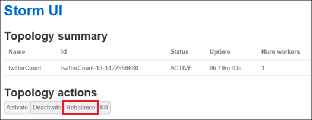

<properties
    pageTitle="Verwalten von Hadoop Cluster in HDInsight mit PowerShell | Microsoft Azure"
    description="Informationen Sie zum Ausführen von Verwaltungsaufgaben für die Hadoop Cluster in mithilfe der PowerShell Azure HDInsight."
    services="hdinsight"
    editor="cgronlun"
    manager="jhubbard"
    tags="azure-portal"
    authors="mumian"
    documentationCenter=""/>

<tags
    ms.service="hdinsight"
    ms.workload="big-data"
    ms.tgt_pltfrm="na"
    ms.devlang="na"
    ms.topic="article"
    ms.date="08/10/2016"
    ms.author="jgao"/>

# Verwalten von Hadoop Cluster in HDInsight mithilfe von Azure PowerShell

[AZURE.INCLUDE [selector](../../includes/hdinsight-portal-management-selector.md)]

Azure PowerShell handelt es sich um eine leistungsfähige Skriptingtools-Umgebung, die Sie zum Steuern und Automatisierung der Bereitstellung und Verwaltung von Ihrer Auslastung in Azure verwenden können. In diesem Artikel erfahren Sie, wie Hadoop Cluster in Azure HDInsight mithilfe einer lokalen Azure PowerShell-Konsole durch die Verwendung von Windows PowerShell verwaltet werden. Die Liste der HDInsight PowerShell-Cmdlets finden Sie unter [HDInsight Cmdlet Bezug][hdinsight-powershell-reference].

**Erforderliche Komponenten**

Vorbemerkung in diesem Artikel müssen Sie Folgendes:

- **Ein Azure-Abonnement**. Finden Sie [kostenlose Testversion Azure abrufen](https://azure.microsoft.com/documentation/videos/get-azure-free-trial-for-testing-hadoop-in-hdinsight/).

##Installieren von Azure PowerShell

[AZURE.INCLUDE [upgrade-powershell](../../includes/hdinsight-use-latest-powershell.md)]

Wenn Sie Azure PowerShell Version 0.9 installiert haben X, müssen Sie dies deinstallieren sie vor der Neuinstallation einer neueren Version.

So überprüfen Sie die Version des installierten PowerShell:

    Get-Module *azure*
    
Um die ältere Version deinstallieren möchten, führen Sie Programme und Funktionen in der Systemsteuerung ein. 

##Cluster erstellen

Finden Sie unter [Erstellen von Linux-basierten Cluster in mithilfe der PowerShell Azure HDInsight](hdinsight-hadoop-create-linux-clusters-azure-powershell.md)

##Liste Cluster
Verwenden Sie den folgenden Befehl aus, um alle Cluster im aktuellen Abonnement Liste:

    Get-AzureRmHDInsightCluster

##Cluster anzeigen

Verwenden Sie den folgenden Befehl zum Anzeigen von Details zu einem bestimmten Cluster in das aktuelle Abonnement ein:

    Get-AzureRmHDInsightCluster -ClusterName <Cluster Name>

##Cluster löschen

Verwenden Sie den folgenden Befehl zum Löschen eines Clusters aus:

    Remove-AzureRmHDInsightCluster -ClusterName <Cluster Name>

Sie können auch einen Cluster löschen, indem Sie die Ressourcengruppe aus, die den Cluster enthält. Beachten Sie, dass dadurch alle Ressourcen in der Gruppe, einschließlich des Standardkontos-Speicher gelöscht werden.

    Remove-AzureRmResourceGroup -Name <Resource Group Name>
            
##Maßstab Cluster
Cluster Skalierung Feature ermöglicht Ihnen, ändern die Anzahl der Worker-Knoten verwendet, die für einen Cluster, der in Azure HDInsight ausgeführt wird, ohne den Cluster erneut erstellen.

>[AZURE.NOTE] Nur mit HDInsight Version 3.1.3 Cluster oder höher werden unterstützt. Wenn Sie die Version von Ihren Cluster kennen, können Sie auf die Seite Eigenschaften überprüfen.  Finden Sie unter [Liste und anzeigen Cluster](hdinsight-administer-use-portal-linux.md#list-and-show-clusters).

Die Auswirkung zum Ändern der Anzahl der Datenknoten für jede Art von Cluster von HDInsight unterstützt:

- Hadoop

    Sie können nahtlos die Anzahl der Worker-Knoten in einem Cluster Hadoop erhöhen, die ohne zu beeinträchtigen Ausstehend oder laufenden Aufträge ausgeführt wird. Neue Aufträge können auch gesendet werden, während der Vorgang ausgeführt wird. Fehler bei einer Skalierung sind ordnungsgemäß behandelt, sodass der Cluster funktionsfähig immer offen steht.

    Wenn ein Cluster Hadoop nach unten durch Verringern der Anzahl der Datenknoten skaliert ist, werden einige der Dienste im Cluster neu gestartet. Dadurch alle laufenden und anstehende Aufträge nach Abschluss des Vorgangs Skalierung fehlschlägt. Sie können, jedoch die Aufträge erneut, nachdem der Vorgang abgeschlossen ist.

- HBase

    Sie können nahtlos hinzufügen oder Entfernen von Knoten zum Cluster HBase während der Ausführung. Innerhalb weniger Minuten der Abschluss der Skalierung Operation sind automatisch Landes-/ Server ausgelastet. Sie können jedoch auch manuell die regionalen Server Saldo, nach Anmelden bei der Headnode der Cluster und Ausführen der folgenden Befehle aus ein Eingabeaufforderungsfenster:

        >pushd %HBASE_HOME%\bin
        >hbase shell
        >balancer

- Storm

    Nahtloses können Sie hinzufügen oder Entfernen von Datenknoten zum Cluster Storm während der Ausführung. Müssen Sie jedoch nach einer erfolgreichen Abschluss des Vorgangs Skalierung, wird der Suchtopologie neu zu verteilen.

    Qualifikationsprofilen kann auf zwei Arten erreicht werden:

    * Storm Web-Benutzeroberfläche
    * Tool line Interface (CLI)

    Lizenzinformationen finden Sie in der [Dokumentation Apache Storm](http://storm.apache.org/documentation/Understanding-the-parallelism-of-a-Storm-topology.html) Weitere Details.

    Das Storm Web-Benutzeroberfläche steht im Cluster HDInsight zur Verfügung:

    

    Hier ist ein Beispiel, wie Sie mithilfe des Befehls CLI um der Suchtopologie Storm neu zu verteilen:

        ## Reconfigure the topology "mytopology" to use 5 worker processes,
        ## the spout "blue-spout" to use 3 executors, and
        ## the bolt "yellow-bolt" to use 10 executors

        $ storm rebalance mytopology -n 5 -e blue-spout=3 -e yellow-bolt=10

Führen Sie zum Ändern der Größe der Zuordnungseinheiten Hadoop Azure PowerShell mit den folgenden Befehl aus einem Clientcomputer:

    Set-AzureRmHDInsightClusterSize -ClusterName <Cluster Name> -TargetInstanceCount <NewSize>
    

##Zugriff gewähren/widerrufen

HDInsight Cluster stehen die folgenden HTTP-Webdienste (alle der folgenden Dienste verwenden REST-Endpunkten):

- ODBC
- JDBC
- Ambari
- Oozie
- Templeton

Standardmäßig werden diese Dienste für den Zugriff erteilt. Sie können widerrufen/den Zugriff gewähren. Um zu widerrufen:

    Revoke-AzureRmHDInsightHttpServicesAccess -ClusterName <Cluster Name>

So gewähren:

    $clusterName = "<HDInsight Cluster Name>"

    # Credential option 1
    $hadoopUserName = "admin"
    $hadoopUserPassword = "<Enter the Password>"
    $hadoopUserPW = ConvertTo-SecureString -String $hadoopUserPassword -AsPlainText -Force
    $credential = New-Object System.Management.Automation.PSCredential($hadoopUserName,$hadoopUserPW)

    # Credential option 2
    #$credential = Get-Credential -Message "Enter the HTTP username and password:" -UserName "admin"
    
    Grant-AzureRmHDInsightHttpServicesAccess -ClusterName $clusterName -HttpCredential $credential

>[AZURE.NOTE] Durch den Zugriff gewähren/aufheben, werden Sie Cluster Benutzername und Kennwort zurücksetzen.

Dies kann auch über das Portal erfolgen. [Verwalten von HDInsight mithilfe des Azure-Portals]finden Sie unter[hdinsight-admin-portal].

##HTTP-Benutzeranmeldeinformationen aktualisieren

Es ist dasselbe Verfahren, das als [Zugriff gewähren/widerrufen HTTP](#grant/revoke-access). Wenn der Cluster den HTTP-Zugriff gewährt wurde, müssen Sie zuerst widerrufen.  Und gewähren Sie den Zugriff mit neuen HTTP-Benutzeranmeldeinformationen.

##Suchen des Standardkontos-Speicher

Das folgende Powershell-Skript veranschaulicht, wie Name des Standardkontos Speicher und die Verwendung der standardmäßigen Speicher kontoschlüssel für einen Cluster.

    $clusterName = "<HDInsight Cluster Name>"
    
    $cluster = Get-AzureRmHDInsightCluster -ClusterName $clusterName
    $resourceGroupName = $cluster.ResourceGroup
    $defaultStorageAccountName = ($cluster.DefaultStorageAccount).Replace(".blob.core.windows.net", "")
    $defaultBlobContainerName = $cluster.DefaultStorageContainer
    $defaultStorageAccountKey = (Get-AzureRmStorageAccountKey -ResourceGroupName $resourceGroupName -Name $defaultStorageAccountName)[0].Value
    $defaultStorageAccountContext = New-AzureStorageContext -StorageAccountName $defaultStorageAccountName -StorageAccountKey $defaultStorageAccountKey 

##Suchen nach der Ressourcengruppe

Im Modus Ressourcenmanager jeder HDInsight Cluster ein Azure Ressourcengruppe gehört.  So suchen Sie die Ressourcengruppe

    $clusterName = "<HDInsight Cluster Name>"
    
    $cluster = Get-AzureRmHDInsightCluster -ClusterName $clusterName
    $resourceGroupName = $cluster.ResourceGroup

##Aufträge senden

**MapReduce Aufträge senden**

Finden Sie unter [Ausführen Hadoop MapReduce Beispiele in Windows-basierten HDInsight](hdinsight-run-samples.md).

**Struktur Aufträge senden** 

Finden Sie unter [Ausführen Struktur Abfragen mithilfe der PowerShell](hdinsight-hadoop-use-hive-powershell.md).

**Schwein Aufträge senden**

Finden Sie unter [Ausführen Schwein Aufträge mithilfe der PowerShell](hdinsight-hadoop-use-pig-powershell.md).

**Sqoop Aufträge senden**

Finden Sie unter [Verwenden von Sqoop mit HDInsight](hdinsight-use-sqoop.md).

**Oozie Aufträge senden**

Finden Sie unter [Verwenden von Oozie mit Hadoop definieren und Ausführen eines Workflows in HDInsight](hdinsight-use-oozie.md).

##Hochladen von Daten in Azure Blob-Speicher
[Hochladen von Daten mit HDInsight]finden Sie unter[hdinsight-upload-data].

## Siehe auch
* [Dokumentation zur HDInsight cmdlet][hdinsight-powershell-reference]
* [Verwalten von HDInsight mithilfe des Azure-Portals][hdinsight-admin-portal]
* [Verwalten einer Line Schnittstelle HDInsight][hdinsight-admin-cli]
* [HDInsight Cluster erstellen][hdinsight-provision]
* [Hochladen von Daten mit HDInsight][hdinsight-upload-data]
* [Hadoop Aufträge programmgesteuert übermitteln][hdinsight-submit-jobs]
* [Erste Schritte mit Azure HDInsight][hdinsight-get-started]

[azure-purchase-options]: http://azure.microsoft.com/pricing/purchase-options/
[azure-member-offers]: http://azure.microsoft.com/pricing/member-offers/
[azure-free-trial]: http://azure.microsoft.com/pricing/free-trial/

[hdinsight-get-started]: hdinsight-hadoop-linux-tutorial-get-started.md
[hdinsight-provision]: hdinsight-provision-clusters.md
[hdinsight-provision-custom-options]: hdinsight-provision-clusters.md#configuration
[hdinsight-submit-jobs]: hdinsight-submit-hadoop-jobs-programmatically.md

[hdinsight-admin-cli]: hdinsight-administer-use-command-line.md
[hdinsight-admin-portal]: hdinsight-administer-use-management-portal.md
[hdinsight-storage]: hdinsight-hadoop-use-blob-storage.md
[hdinsight-use-hive]: hdinsight-use-hive.md
[hdinsight-use-mapreduce]: hdinsight-use-mapreduce.md
[hdinsight-upload-data]: hdinsight-upload-data.md
[hdinsight-flight]: hdinsight-analyze-flight-delay-data.md

[hdinsight-powershell-reference]: https://msdn.microsoft.com/library/dn858087.aspx

[powershell-install-configure]: powershell-install-configure.md

[image-hdi-ps-provision]: ./media/hdinsight-administer-use-powershell/HDI.PS.Provision.png
