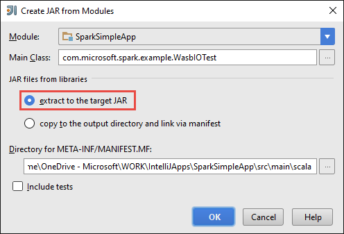
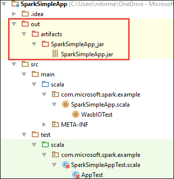

<properties
    pageTitle="Erstellen von eigenständigen Scala Applikationen auf HDInsight Spark Cluster ausführen | Microsoft Azure"
    description="Informationen Sie zum Erstellen eines eigenständiges Spark Anwendung HDInsight Spark Cluster ausgeführt."
    services="hdinsight"
    documentationCenter=""
    authors="nitinme"
    manager="jhubbard"
    editor="cgronlun"
    tags="azure-portal"/>

<tags
    ms.service="hdinsight"
    ms.workload="big-data"
    ms.tgt_pltfrm="na"
    ms.devlang="na"
    ms.topic="article"
    ms.date="10/28/2016"
    ms.author="nitinme"/>

# Erstellen eines eigenständigen Scala Anwendung auf Apache Spark Cluster auf HDInsight Linux ausgeführt

Dieser Artikel enthält eine schrittweise Anleitung zur Entwicklung von eigenständigen Spark Applications in Scala geschrieben Maven mit IntelliJ IDEE verwenden. Im Artikel Apache Maven verwendet, wie das System erstellen und beginnt mit einer vorhandenen Maven Urtyp für Scala von IntelliJ IDEE bereitgestellt.  Auf hoher wird Erstellen einer Scala Anwendung in IntelliJ IDEE die folgenden Schritte umfassen:

* Verwenden Sie Maven, wie das System erstellen.
* Aktualisieren Sie Project Objekt Modell (POM) Datei um Spark Modul Abhängigkeiten zu beheben.
* Schreiben Sie eine Anwendung in Scala ein.
* Generieren einer JAR-Datei, die an HDInsight Spark Cluster gesendet werden kann.
* Führen Sie die Anwendung auf Spark Cluster Livius verwenden.

>[AZURE.NOTE] HDInsight enthält auch ein IntelliJ IDEE-Plug-Tool, um die Vorgehensweise zum Erstellen und Senden von Applications zu einem HDInsight Spark Cluster unter Linux zu erleichtern. Weitere Informationen finden Sie unter [Verwenden HDInsight Tools-Plug-In für IntelliJ IDEE zu erstellen und Spark beantragen](hdinsight-apache-spark-intellij-tool-plugin.md).

**Erforderliche Komponenten**

* Ein Azure-Abonnement. Finden Sie [kostenlose Testversion Azure abrufen](https://azure.microsoft.com/documentation/videos/get-azure-free-trial-for-testing-hadoop-in-hdinsight/).
* Eine Apache Spark Cluster auf HDInsight Linux. Anweisungen finden Sie unter [Erstellen von Apache Spark Cluster in Azure HDInsight](hdinsight-apache-spark-jupyter-spark-sql.md).
* Oracle Java Development Kit. Sie können ihn [hier](http://www.oracle.com/technetwork/java/javase/downloads/jdk8-downloads-2133151.html)installieren.
* Eine Java IDE. In diesem Artikel wird die IntelliJ IDEE 15.0.1 verwendet. Sie können ihn [hier](https://www.jetbrains.com/idea/download/)installieren.

## Installieren von Scala-Plug-In für IntelliJ IDEE

Wenn IntelliJ IDEE Installation nicht nicht auffordert für das Scala-Plug-in aktivieren, starten Sie IntelliJ IDEE zu, und wechseln Sie über die folgenden Schritte aus, die-Plug-Ins zu installieren:

1. Starten Sie IntelliJ IDEE zu, und klicken Sie im Bildschirm Willkommen auf **Konfigurieren** , und dann auf **-Plug-Ins**.

    

2. Klicken Sie in dem nächsten Bildschirm auf **Installieren JetBrains-Plug-** in der unteren linken Ecke. Klicken Sie im Dialogfeld **Durchsuchen von JetBrains-Plug-Ins** Scala suchen Sie, und klicken Sie dann auf **Installieren**.

    

3. Nachdem das Plug-In erfolgreich installiert wurde, klicken Sie auf die **Schaltfläche IntelliJ IDEE neu starten** , um die IDE neu starten.

## Erstellen eines eigenständigen Scala Projekts

1. Starten Sie IntelliJ IDEE und Erstellen eines neuen Projekts. Im Dialogfeld Neues Projekt folgende Schritte aus, und klicken Sie dann auf **Weiter**.

    

    * Wählen Sie als Projekttyp **Maven** aus.
    * Geben Sie ein **Projekt SDK**. Klicken Sie auf neu, und navigieren Sie zu dem Installationsverzeichnis Java normalerweise `C:\Program Files\Java\jdk1.8.0_66`.
    * Wählen Sie die Option **aus Urtyp erstellen** aus.
    * Wählen Sie aus der Liste der Archetypes **org.scala-tools.archetypes:scala-Urtyp – einfach**aus. Erstellt die richtigen Directory-Struktur und die erforderlichen Standard Abhängigkeiten zum Schreiben Scala Programm herunterladen.

2. Geben Sie relevante Werte für die **Gruppen-ID**, **ArtifactId**und **Version**aus. Klicken Sie auf **Weiter**.

3. Akzeptieren Sie im nächsten Dialogfeld, in dem Sie Maven home-Verzeichnis und andere benutzereinstellungen angeben die Standardeinstellungen, und klicken Sie auf **Weiter**.

4. Klicken Sie im Dialogfeld letzten Geben Sie an, einen Projektnamen und einen Speicherort aus, und klicken Sie dann auf **Fertig stellen**.

5. Löschen Sie die Datei **MySpec.Scala** **Src\test\scala\com\microsoft\spark\example**. Nicht benötigen dies für die Anwendung.

6. Falls erforderlich, benennen Sie die standardmäßigen Quell- und Test-Dateien. Navigieren Sie im linken Bereich in die IntelliJ IDEE zu **src\main\scala\com.microsoft.spark.example**. Mit der rechten Maustaste **App.scala**auf **gestalten**, klicken Sie auf Datei umbenennen, und geben Sie im Dialogfeld den neuen Namen für die Anwendung und klicken Sie dann auf zu **gestalten**.

      

7. Die folgenden Schritte aktualisieren Sie die pom.xml, um die Abhängigkeiten für die Anwendung Spark Scala definieren. Für diese Abhängigkeiten heruntergeladen und automatisch aufgelöst werden müssen Sie Maven entsprechend konfigurieren.

    

    1. Klicken Sie im Menü **Datei** auf **Einstellungen**.
    2. Navigieren Sie im Dialogfeld **Einstellungen** zu **erstellen, Ausführung, Bereitstellung** > **Tools erstellen** > **Maven** > **Importieren**.
    3. Wählen Sie die Option zum **Importieren Maven Projekte automatisch**aus.
    4. Klicken Sie auf **Übernehmen**, und klicken Sie dann auf **OK**.

8. Aktualisieren Sie die Quelldatei Scala zum Einschließen des Anwendungscodes ein. Öffnen Sie und Ersetzen Sie den Code Stichproben mit den folgenden Code ein, und speichern Sie die Änderungen zu. Dieser Code liest die Daten aus der HVAC.csv (verfügbar auf alle HDInsight Spark Cluster), ruft die Zeilen, die nur eine Ziffer in der sechsten Spalte aufweisen, und schreibt die Ausgabe in **/HVACOut** unter dem standardmäßigen Speichercontainer für den Cluster.

        package com.microsoft.spark.example

        import org.apache.spark.SparkConf
        import org.apache.spark.SparkContext

        /**
          * Test IO to wasb
          */
        object WasbIOTest {
          def main (arg: Array[String]): Unit = {
            val conf = new SparkConf().setAppName("WASBIOTest")
            val sc = new SparkContext(conf)

            val rdd = sc.textFile("wasbs:///HdiSamples/HdiSamples/SensorSampleData/hvac/HVAC.csv")

            //find the rows which have only one digit in the 7th column in the CSV
            val rdd1 = rdd.filter(s => s.split(",")(6).length() == 1)

            rdd1.saveAsTextFile("wasbs:///HVACout")
          }
        }

9. Aktualisieren der pom.xml.

    1.  In `<project>\<properties>` fügen Sie Folgendes:

            <scala.version>2.10.4</scala.version>
            <scala.compat.version>2.10.4</scala.compat.version>
            <scala.binary.version>2.10</scala.binary.version>

    2. In `<project>\<dependencies>` fügen Sie Folgendes:

            <dependency>
              <groupId>org.apache.spark</groupId>
              <artifactId>spark-core_${scala.binary.version}</artifactId>
              <version>1.4.1</version>
            </dependency>

    Speichern Sie Änderungen auf pom.xml ein.

10. Erstellen Sie die Datei .jar. IntelliJ IDEE ermöglicht die Erstellung von JAR als ein Element eines Projekts. Führen Sie die folgenden Schritte aus.

    1. Klicken Sie im Menü **Datei** auf **Projektstruktur**.
    2. Klicken Sie auf **Elemente** , und klicken Sie dann auf das Pluszeichen, klicken Sie im Dialogfeld **Project-Struktur** . Popup-Dialogfeld auf **JAR-**, und klicken Sie dann auf **aus Modulen mit Abhängigkeiten**.

        

    3. Klicken Sie im Dialogfeld **Aus Modulen JAR erstellen** , klicken Sie auf die Auslassungspunkte ( ) anhand der **Primär Class**.

    4. Klicken Sie im Dialogfeld **Wählen Sie primär Klasse** wählen Sie die Klasse, die standardmäßig angezeigt wird, und klicken Sie dann auf **OK**.

        

    5. Klicken Sie im Dialogfeld **Erstellen von Module JAR-** stellen Sie sicher, dass die Option zum **extrahieren an die Zielwebsite JAR** ausgewählt ist, und klicken Sie dann auf **OK**. Dadurch wird einem einzelnen Glas mit allen Abhängigkeiten erstellt.

        

    6. Die Ausgabe-Registerkarte "Layout" listet alle Gläser, die als Teil des Projekts Maven enthalten sind. Sie können auswählen, und löschen Sie diejenigen auf dem weist keine direkte Abhängigkeit von der Anwendungs Scala. Für die Anwendung, die wir hier erstellen, können Sie alle bis auf die letzte entfernen eine (**SparkSimpleApp kompilieren Ausgabe**). Wählen Sie die Gläser zu löschen, und klicken Sie dann auf das Symbol **Löschen** .

        

        Stellen Sie sicher, dass **auf Tabellenerstellungsabfrage erstellen** im Feld ausgewählt ist, womit sichergestellt wird, dass der Jar erstellt wird jedes Mal, wenn das Projekt erstellt oder aktualisiert wird. Klicken Sie auf **Übernehmen** und dann auf **OK**.

    7. Klicken Sie in der Menüleiste klicken Sie auf **Erstellen**, und klicken Sie dann auf **Projekt erstellen**. Klicken Sie auf **Elemente erstellen** , um die JAR-Datei zu erstellen. Die Ausgabe JAR-Datei wird unter **\out\artifacts**erstellt.

        

## Führen Sie die Anwendung auf dem Cluster Spark

Wenn Sie die Anwendung auf dem Cluster ausführen zu können, müssen Sie Folgendes ausführen:

* **Kopieren Sie die Anwendung JAR-Datei in den Speicher Azure Blob** Cluster zugeordnet. Sie können [**AzCopy**](../storage/storage-use-azcopy.md), ein Programm Befehlszeile dazu verwenden. Es gibt zahlreiche sowie andere Clients, die Sie zum Hochladen von Daten verwenden können. Sie können mehr über diese am [Hochladen von Daten für Hadoop Aufträge in HDInsight](hdinsight-upload-data.md)suchen.

* **Verwenden Livius eine Anwendung Position und übermitteln Sie Remote** zum Spark Cluster. Spark Cluster auf HDInsight enthält Livius, die REST-Endpunkte um Remote Spark Aufträge übermitteln macht. Weitere Informationen finden Sie unter [Senden Spark Aufträge mit Remote Livius mit Spark Cluster auf HDInsight](hdinsight-apache-spark-livy-rest-interface.md).

## Siehe auch

* [Übersicht: Apache Spark auf Azure HDInsight](hdinsight-apache-spark-overview.md)

### Szenarien

* [Spark mit BI: Ausführen interaktiven Datenanalyse mithilfe von Spark in HDInsight mit BI-Tools](hdinsight-apache-spark-use-bi-tools.md)

* [Spark mit maschinellen Schulung: Verwenden Sie Spark in HDInsight zum Analysieren von Gebäude Temperatur HKL-Daten verwenden](hdinsight-apache-spark-ipython-notebook-machine-learning.md)

* [Spark mit maschinellen Schulung: verwenden Spark in HDInsight Lebensmittel Prüfungsergebnissen Vorhersagen](hdinsight-apache-spark-machine-learning-mllib-ipython.md)

* [Spark Streaming: Verwenden Sie Spark in HDInsight zum Erstellen von in Echtzeit streaming Clientanwendungen](hdinsight-apache-spark-eventhub-streaming.md)

* [Website-Protokoll-Datenanalyse mithilfe von Spark in HDInsight](hdinsight-apache-spark-custom-library-website-log-analysis.md)

### Erstellen und Ausführen von applications

* [Führen Sie Aufträge Remote auf einem Spark Cluster Livius verwenden](hdinsight-apache-spark-livy-rest-interface.md)

### Tools und Erweiterungen

* [Verwenden Sie zum Erstellen und übermitteln Spark Scala Applikationen HDInsight Tools-Plug-In für IntelliJ IDEE](hdinsight-apache-spark-intellij-tool-plugin.md)

* [Verwenden von HDInsight Tools-Plug-In für IntelliJ IDEE Spark Applikationen Remote-Debuggen](hdinsight-apache-spark-intellij-tool-plugin-debug-jobs-remotely.md)

* [Verwenden von Zeppelin Notizbücher mit einem Spark Cluster auf HDInsight](hdinsight-apache-spark-use-zeppelin-notebook.md)

* [Kernels für Jupyter-Notizbuch in Spark Cluster für HDInsight verfügbar](hdinsight-apache-spark-jupyter-notebook-kernels.md)

* [Verwenden von externen Paketen mit Jupyter-Notizbüchern](hdinsight-apache-spark-jupyter-notebook-use-external-packages.md)

* [Jupyter auf Ihrem Computer installieren und Verbinden mit einem HDInsight Spark cluster](hdinsight-apache-spark-jupyter-notebook-install-locally.md)

### Verwalten von Ressourcen

* [Verwalten von Ressourcen für den Apache Spark Cluster in Azure HDInsight](hdinsight-apache-spark-resource-manager.md)

* [Verfolgen und Debuggen Aufträge in einem Apache Spark Cluster in HDInsight](hdinsight-apache-spark-job-debugging.md)
