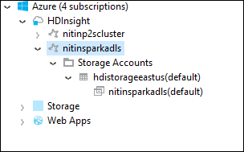
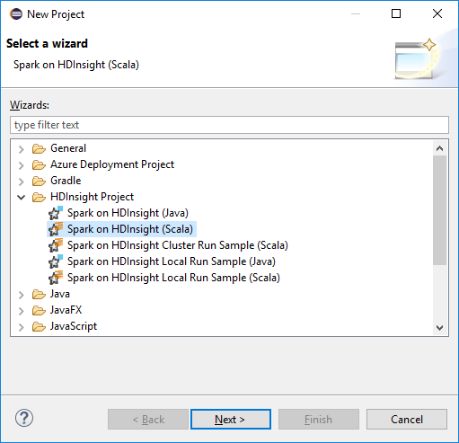
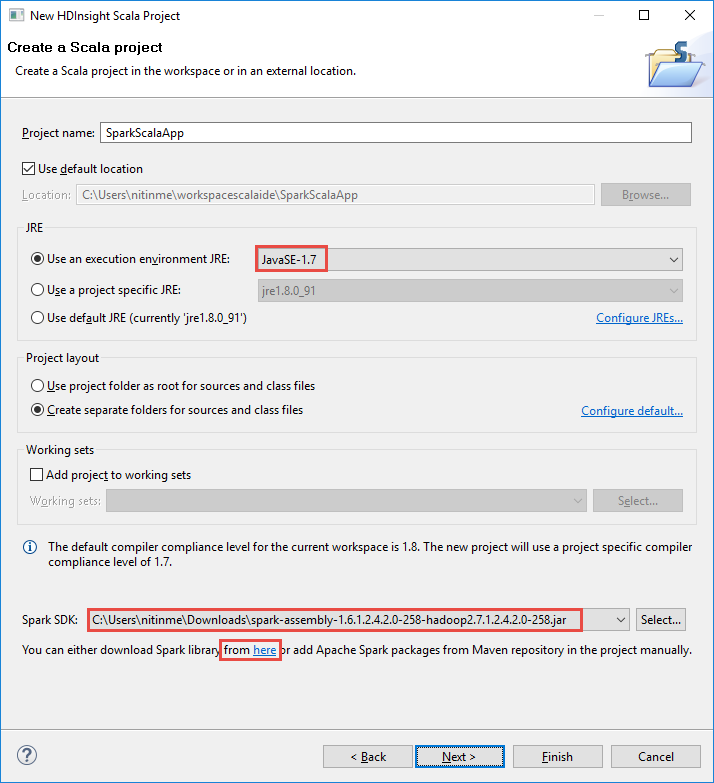
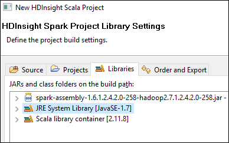
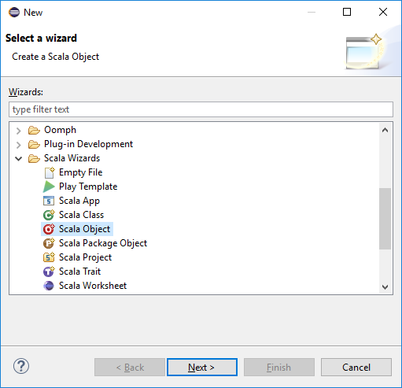
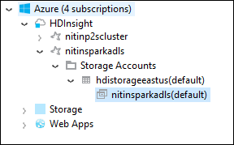

 <properties
    pageTitle="Erstellen Spark Scala Applikationen mithilfe von Tools HDInsight Azure-Toolkit für "Ellipse" | Microsoft Azure"
    description="Informationen Sie zum Erstellen eines eigenständiges Spark Anwendung HDInsight Spark Cluster ausgeführt."
    services="hdinsight"
    documentationCenter=""
    authors="nitinme"
    manager="jhubbard"
    editor="cgronlun"
    tags="azure-portal"/>

<tags
    ms.service="hdinsight"
    ms.workload="big-data"
    ms.tgt_pltfrm="na"
    ms.devlang="na"
    ms.topic="article"
    ms.date="08/30/2016"
    ms.author="nitinme"/>

# Verwenden Sie HDInsight-Tools in Azure Toolkit für "Ellipse" Spark Applikationen für HDInsight Spark Linux Cluster erstellen

Dieser Artikel enthält schrittweise Anleitung zum Entwickeln Spark Applications in Scala und übermitteln darauf, um eine HDInsight Spark cluster mithilfe von Tools HDInsight Azure-Toolkit für "Ellipse" geschrieben. Sie können die Tools in verschiedene Weise verwenden:

* Entwickeln und senden Sie eine Anwendung Scala Spark auf einem Cluster HDInsight Spark
* Zugriff auf Ihre Azure HDInsight Spark Clusterressourcen
* Entwickeln, und führen Sie eine Anwendung Scala Spark lokal

>[AZURE.IMPORTANT] Dieses Tool kann zum Erstellen und Übermitteln von Applications nur für eine HDInsight Spark Cluster unter Linux verwendet werden.

##Erforderliche Komponenten

* Ein Azure-Abonnement. Finden Sie [kostenlose Testversion Azure abrufen](https://azure.microsoft.com/documentation/videos/get-azure-free-trial-for-testing-hadoop-in-hdinsight/).

* Eine Apache Spark Cluster auf HDInsight Linux. Anweisungen finden Sie unter [Erstellen von Apache Spark Cluster in Azure HDInsight](hdinsight-apache-spark-jupyter-spark-sql.md).

* Oracle Java Development kit Version 7 und 8. 
    * **Java SDK 7** dient zum Kompilieren Spark Projekte, wie die HDInsight Cluster Version 7 Java unterstützen. Sie können Java SDK 7 [hier](http://www.oracle.com/technetwork/java/javase/downloads/jdk7-downloads-1880260.html)herunterladen.
    * **Java SDK 8** wird für "Ellipse" IDE Runtime verwendet. Sie können ihn [hier](http://www.oracle.com/technetwork/java/javase/downloads/jdk8-downloads-2133151.html)herunterladen.

* Ellipse IDE. In diesem Artikel wird die Ellipse Neon verwendet. Sie können ihn [hier](https://www.eclipse.org/downloads/)installieren.

* Scala IDE für "Ellipse". 
    * **Wenn Sie die Ellipse IDE installiert haben**, können Sie die Scala IDE-Plug-In hinzufügen, indem Sie ihm **helfen** -> **Neue SoftWare installieren**, und fügen Sie [http://download.scala-ide.org/sdk/lithium/e44/scala211/stable/site](http://download.scala-ide.org/sdk/lithium/e44/scala211/stable/site) als Quelle Scala Plugin für "Ellipse" herunterladen. 
    * **Wenn Sie keine Ellipse IDE installiert haben**, können Sie direkt von [hier](http://scala-ide.org/download/sdk.html)Scala IDE installieren. Sie können über diesen Link die ZIP-Datei nicht herunterladen, extrahieren Sie die Datei, navigieren Sie zu dem Ordner **/eclipse** und führen Sie dann von dort aus **eclipse.exe** -Datei.
    
    >[AZURE.NOTE] Die Schritte in diesem Dokument basieren auf mithilfe von "Ellipse" IDE mit Scala-Plug-In installiert ist.

* Spark SDK. Sie können ihn [hier](http://go.microsoft.com/fwlink/?LinkID=723585&clcid=0x409)herunterladen.

* Installieren Sie e (fx) Clipse von [https://www.eclipse.org/efxclipse/install.html](https://www.eclipse.org/efxclipse/install.html).

## Installieren von HDInsight Tools in Azure-Toolkit für "Ellipse"

HDInsight tools für "Ellipse" verfügbar ist als Teil der Azure-Toolkit für "Ellipse". Anweisungen zum Installieren des Azure-Toolkit finden Sie unter [Installieren der Azure-Toolkit für "Ellipse"](../azure-toolkit-for-eclipse-installation.md).

## Melden Sie sich bei Ihrem Azure-Abonnement

1. Starten Sie die Ellipse IDE und öffnen Sie der Azure-Explorer. Klicken Sie aus dem Menü **Fenster** in der IDE auf **Anzeigen** , und klicken Sie dann auf **andere**. Klicken Sie im daraufhin angezeigten Dialogfeld erweitern Sie **Azure**, **Azure-Explorer**auf und klicken Sie dann auf **OK**.

    

2. Mit der rechten Maustaste in des **Azure** -Knotens in der **Azure-Explorer**, und klicken Sie dann auf **Abonnements verwalten**.

3. Klicken Sie im Dialogfeld **Abonnements verwalten** auf **Anmelden** , und geben Sie Ihre Anmeldeinformationen Azure.

    

4. Nachdem Sie angemeldet sind, alle Azure Abonnements, die den Anmeldeinformationen zugeordnet ist im Dialogfeld **Abonnements verwalten** aufgeführt. Klicken Sie auf **Schließen** im Dialogfeld.

5. Erweitern Sie in der Registerkarte Explorer Azure **HDInsight** , um die HDInsight Spark Cluster unter Ihres Abonnements finden Sie unter aus.

    

6. Sie können einen Cluster Name-Knoten, um die Cluster zugeordneten Ressourcen (z. B. Speicherkonten) finden Sie unter Weitere erweitern.

    

## Einrichten eines Projekts Spark Scala für eine HDInsight Spark cluster

1. Klicken Sie aus den Arbeitsbereich "Ellipse" IDE auf **Datei**, klicken Sie auf **neu**, und klicken Sie dann auf **Projekt**. 

2. Im Assistenten **Neues Projekt** erweitern Sie **HDInsight**, **Spark auf HDInsight (Scala)**wählen Sie aus, und klicken Sie dann auf **Weiter**.

    

3. Klicken Sie im Dialogfeld **Neues Projekt von HDInsight Scala** eingeben/auswählen der Werte wie in der folgenden Abbildung dargestellt, und klicken Sie dann auf **Weiter**.

    

    * Geben Sie einen Namen für das Projekt aus.
    * Im Feld **JRE** sicherzustellen Sie, dass die **Verwendung einer Ausführung Umgebung JRE** auf **JavaSE-1.7**festgelegt ist.
    * Stellen Sie sicher, dass an die Position Spark SDK festgelegt wurden, in dem Sie das SDK heruntergeladen haben. Die Verknüpfung mit der Downloadspeicherort ist in den [erforderlichen Komponenten](#prerequisites) weiter oben in diesem Thema enthalten. Aus den Hyperlink in diesem Dialogfeld können Sie auch das SDK herunterladen, wie in der vorstehende Abbildung gezeigt.    

4. Klicken Sie im Dialogfeld nächsten Klicken Sie auf der Registerkarte **Bibliotheken** , und doppelklicken Sie dann auf **JRE System Library [JavaSE-1.7]**.

    

5. Klicken Sie im Dialogfeld **Bearbeiten Bibliothek** sicherzustellen Sie, dass die **Ausführung-Umgebung** auf **JavaSE-1.7(jdk1.7.0_79)**festgelegt ist. Wenn dies nicht als Option verfügbar ist, führen Sie die folgenden Schritte aus.

    1. Wählen Sie die Option **Alternative JRE** und ob **JavaSE-1.7(jdk1.7.0_79)** verfügbar ist.
    2. Wenn dies nicht der Fall ist, klicken Sie auf die Schaltfläche **JREs installiert** .

          

    3. Klicken Sie im Dialogfeld **JREs installiert haben** auf **Hinzufügen**.

            

    4. Klicken Sie im Dialogfeld **JRE Typ** wählen Sie **Standard virtuellen Computer**aus, und klicken Sie dann auf **Weiter**

            

    5. Klicken Sie im Dialogfeld **JRE Definition** Verzeichnis, klicken Sie auf und dann navigieren Sie zum Speicherort für die Installation von JDK 7, und wählen Sie aus dem Stammordner für **Jdk1.7.0_79**.

            

    6. Klicken Sie auf **Fertig stellen**. Wählen Sie im Dialogfeld **JREs installiert haben** die neu hinzugefügte JRE aus, und klicken Sie dann auf **OK**.

           

    7. Für **Die Ausführung-Umgebung**sollte die neu hinzugefügte JRE aufgeführt sein. Klicken Sie auf **Fertig stellen**.

           

6. Doppelklicken Sie auf **Scala Bibliothekscontainer [2.11.8]**, klicken Sie auf der Registerkarte **Bibliotheken** . Wählen Sie im Dialogfeld **Bibliothek bearbeiten** **feste Scala Bibliothek Container: 2.10.6**. 

    

    Klicken Sie auf **Fertig stellen** , bis Sie im Dialogfeld Project-Einstellungen zu beenden.

## Erstellen Sie eine Anwendung Scala für HDInsight Spark cluster

1. In der IDE bereits geöffneten "Ellipse" aus dem **Paket-Explorer**erweitern Sie das Projekt, die, das Sie zuvor erstellt haben, mit der rechten Maustaste **Src**, zeigen Sie auf **neu**, und klicken Sie dann auf **andere**.

2. Klicken Sie im Dialogfeld **Wählen Sie einen Assistenten** erweitern Sie **Scala Assistenten**, klicken Sie auf **Scala Objekt**, und klicken Sie dann auf **Weiter**.

    

3. Klicken Sie im Dialogfeld **Neue Datei erstellen** Geben Sie einen Namen für das Objekt, und klicken Sie dann auf **Fertig stellen**.

    

4. Fügen Sie den folgenden Code im Text-Editor ein.

        import org.apache.spark.SparkConf
        import org.apache.spark.SparkContext
    
        object MyClusterApp{
          def main (arg: Array[String]): Unit = {
            val conf = new SparkConf().setAppName("MyClusterApp")
            val sc = new SparkContext(conf)
        
            val rdd = sc.textFile("wasbs:///HdiSamples/HdiSamples/SensorSampleData/hvac/HVAC.csv")
        
            //find the rows which have only one digit in the 7th column in the CSV
            val rdd1 =  rdd.filter(s => s.split(",")(6).length() == 1)
        
            rdd1.saveAsTextFile("wasbs:///HVACOut")
          }     
        }

5. Führen Sie die Anwendung in einem Cluster HDInsight Spark aus.

    1. Aus dem **Paket-Explorer**mit der rechten Maustaste in des Projektnamen ein, und wählen Sie dann auf **Senden Spark Anwendung HDInsight**.      

    2. Klicken Sie im Dialogfeld **Spark Einreichung** bieten Sie die folgenden Werte.

        * **Cluster Name**wählen Sie den HDInsight Spark Cluster, auf dem Sie die Anwendung ausführen möchten.

        * Sie müssen wählen Sie ein Element aus dem Projekt "Ellipse", oder wählen Sie eine von Festplatte.

        * Gegen das Textfeld **Klassennamen primär** , geben Sie den Namen des Objekts, das Sie in den Code angegeben haben (siehe Abbildung unten).

            

        * Da der Anwendungscode in diesem Beispiel keine Befehlszeilenargumente erforderlich oder Bezug Gläser oder Dateien ist, können Sie die restlichen Textfelder leer lassen.

        * Klicken Sie auf **Absenden**.

    3. Die Registerkarte **Spark Übermittlung** sollte die Anzeige von des Fortschritts beginnen. Sie können die Anwendung beenden, indem Sie auf die rote Schaltfläche im Fenster "Spark Beitrag". Sie können auch die Protokolle für diese bestimmte Anwendung ausführen, indem Sie auf das Globussymbol (gekennzeichnet durch das Bild im Feld blau) anzeigen.

        

    Im nächsten Abschnitt erfahren Sie, wie zum Zugreifen auf des Auftrags mit den Tools HDInsight Azure-Toolkit für "Ellipse" ausgegeben.

## Zugreifen auf und Verwalten von HDInsight Spark Cluster mit den Tools HDInsight Azure-Toolkit für "Ellipse"

Sie können eine Vielzahl von Vorgängen mit den Tools HDInsight ausführen.

### Zugriff auf den Container Speicherplatz für den cluster

1. Erweitern Sie Azure-Explorer **HDInsight** Stammknoten, um eine Liste der HDInsight Spark Cluster anzuzeigen, die verfügbar sind.

3. Erweitern Sie den Clusternamen, um das Speicherkonto und die standardmäßige Speichercontainer für den Cluster anzuzeigen.

    

4. Klicken Sie auf den Speicher Containernamen Cluster zugeordnet. Im rechten Bereich sollte einen Ordner namens **HVACOut**angezeigt werden. Doppelklicken Sie auf den Ordner, und Sie öffnen sehen **Webpart -*** Dateien. Öffnen Sie eine dieser Dateien, um die Ausgabe der Anwendung anzuzeigen.

### Zugriff auf den Server Spark Verlauf

1. Aus dem **Azure-Explorer**mit der rechten Maustaste in Ihren Spark Clusternamen aus, und wählen Sie dann **Öffnen Spark Verlauf Benutzeroberfläche**. Wenn Sie dazu aufgefordert werden, geben Sie die Administrator-Anmeldeberechtigungen für den Cluster aus. Sie müssen diese während der Bereitstellung Cluster angegeben haben.

2. Im Dashboard Spark Verlauf Server, Sie können Suchen Sie nach der Anwendung Sie gerade fertig ausgeführt, indem Sie den Namen der Anwendung. In der obigen Code Sie festlegen der Anwendung mit `val conf = new SparkConf().setAppName("MyClusterApp")`. Daher wurde der Name Ihrer Anwendung Spark **MyClusterApp**.

### Starten Sie das Ambari-portal

Aus dem **Azure-Explorer**mit der rechten Maustaste in Ihren Spark Clusternamen aus, und wählen Sie dann **Öffnen Cluster Verwaltungsportal (Ambari)**. Wenn Sie dazu aufgefordert werden, geben Sie die Administrator-Anmeldeberechtigungen für den Cluster aus. Sie müssen diese während der Bereitstellung Cluster angegeben haben.

### Verwalten von Azure-Abonnements

Standardmäßig werden in die HDInsight Tools Azure-Toolkit für "Ellipse" Spark Zuordnungseinheiten alle Ihre Azure Abonnements aufgelistet. Falls erforderlich, können Sie die Abonnements angeben, für die Sie Zugriff auf den Cluster möchten. Mit der rechten Maustaste in des **Azure** Stamm-Knotens der **Azure-Explorer**und klicken Sie dann auf **Abonnements verwalten**. Deaktivieren Sie im Dialogfeld die Kontrollkästchen für das Abonnement, das gewünschte nicht zugreifen, und klicken Sie dann auf **Schließen**. Sie können auch **Abmelden** klicken, wenn Sie von Ihrem Azure-Abonnement abmelden möchten.

## Führen Sie eine Anwendung Spark Scala lokal

Die HDInsight-Tools können in Azure Toolkit für "Ellipse" Sie Spark Scala Applikationen lokal auf Ihrem Computer ausführen. In der Regel solche Applikationen nicht müssen auf Clusterressourcen wie Speichercontainer zugreifen und ausführen und getestet werden können lokal.

### Voraussetzung

Während die lokale Spark Scala Anwendung auf einem Windows-Computer ausgeführt wird, erhalten Sie möglicherweise eine Ausnahme, wie in [SPARK-2356](https://issues.apache.org/jira/browse/SPARK-2356) erläutert, die aufgrund einer fehlenden **WinUtils.exe** auf Windows-Betriebssystem auftritt. Zum Beheben dieses Fehlers arbeiten möchten, müssen Sie sich an einem Speicherort wie **C:\WinUtils\bin** [die ausführbare Datei hier herunterladen](http://public-repo-1.hortonworks.com/hdp-win-alpha/winutils.exe) . Sie müssen dann fügen Sie einer Umgebungsvariable **HADOOP_HOME** hinzu und legen Sie den Wert der Variablen zu **C\WinUtils**.

### Führen Sie eine lokale Spark Scala Anwendung  

1. Starten Sie "Ellipse" und Erstellen eines neuen Projekts. Im Dialogfeld Neues Projekt folgende Schritte aus, und klicken Sie dann auf **Weiter**.

    

    * Wählen Sie im linken Bereich **HDInsight**.
    * Wählen Sie im rechten Bereich **Spark HDInsight lokale Ausführen Stichprobe (Scala)**.
    * Klicken Sie auf **Weiter**.

2. Um die Projektdetails bereitzustellen, führen Sie die Schritte 3 bis 6 wie aus dem vorherigen Abschnitt [Richten Sie ein Projekt Spark Scala Anwendung nach einem HDInsight Spark Cluster](#set-up-a-spark-scala-application-project-for-an-hdinsight-spark cluster)dargestellt.

3. Die Vorlage fügt einen Beispielcode (**LogQuery**) unter dem **Src** -Ordner, den die lokal auf Ihrem Computer ausgeführt werden können.

    

4.  Klicken Sie mit der rechten Maustaste auf die Anwendung **LogQuery** , zeigen Sie auf **Ausführen als**, und klicken Sie dann auf **1 Scala Anwendung**. Sehen Sie ein Ergebnis wie folgt in die Registerkarte **Console** unten ein.

    

## Feedback und bekannte Probleme

Aktuell angezeigten Spark gibt direkt nicht unterstützt wird, und wir arbeiten an, die.

Können Sie Wenn Sie Vorschläge oder Feedback haben oder Probleme auftreten, wenn Sie dieses Tool verwenden, uns eine e-Mail-Nachricht an Hdivstool bei Microsoft Punkt Com einfügen.

## Siehe auch

* [Übersicht: Apache Spark auf Azure HDInsight](hdinsight-apache-spark-overview.md)

### Szenarien

* [Spark mit BI: Ausführen interaktiven Datenanalyse mithilfe von Spark in HDInsight mit BI-Tools](hdinsight-apache-spark-use-bi-tools.md)

* [Spark mit maschinellen Schulung: Verwenden Sie Spark in HDInsight zum Analysieren von Gebäude Temperatur HKL-Daten verwenden](hdinsight-apache-spark-ipython-notebook-machine-learning.md)

* [Spark mit maschinellen Schulung: verwenden Spark in HDInsight Lebensmittel Prüfungsergebnissen Vorhersagen](hdinsight-apache-spark-machine-learning-mllib-ipython.md)

* [Spark Streaming: Verwenden Sie Spark in HDInsight zum Erstellen von in Echtzeit streaming Clientanwendungen](hdinsight-apache-spark-eventhub-streaming.md)

* [Website-Protokoll-Datenanalyse mithilfe von Spark in HDInsight](hdinsight-apache-spark-custom-library-website-log-analysis.md)

### Erstellen und Ausführen von applications

* [Erstellen Sie eine eigenständige Anwendung Scala](hdinsight-apache-spark-create-standalone-application.md)

* [Führen Sie Aufträge Remote auf einem Spark Cluster Livius verwenden](hdinsight-apache-spark-livy-rest-interface.md)

### Tools und Erweiterungen

* [Verwenden Sie HDInsight-Tools in Azure-Toolkit für IntelliJ zum Erstellen und übermitteln Spark Scala Applikationen](hdinsight-apache-spark-intellij-tool-plugin.md)

* [Verwenden Sie HDInsight Tools in Azure-Toolkit für IntelliJ Debuggen aufzeigen Applikationen Remote](hdinsight-apache-spark-intellij-tool-plugin-debug-jobs-remotely.md)

* [Verwenden von Zeppelin Notizbücher mit einem Spark Cluster auf HDInsight](hdinsight-apache-spark-use-zeppelin-notebook.md)

* [Kernels für Jupyter-Notizbuch in Spark Cluster für HDInsight verfügbar](hdinsight-apache-spark-jupyter-notebook-kernels.md)

* [Verwenden von externen Paketen mit Jupyter-Notizbüchern](hdinsight-apache-spark-jupyter-notebook-use-external-packages.md)

* [Jupyter auf Ihrem Computer installieren und Verbinden mit einem HDInsight Spark cluster](hdinsight-apache-spark-jupyter-notebook-install-locally.md)

### Verwalten von Ressourcen

* [Verwalten von Ressourcen für den Apache Spark Cluster in Azure HDInsight](hdinsight-apache-spark-resource-manager.md)

* [Verfolgen und Debuggen Aufträge in einem Apache Spark Cluster in HDInsight](hdinsight-apache-spark-job-debugging.md)
