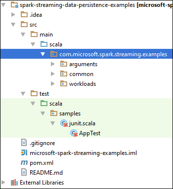
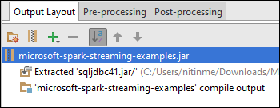

<properties 
    pageTitle="Verwenden von Azure Ereignis Hubs mit Apache Spark in HDInsight streaming Daten verarbeiten | Microsoft Azure" 
    description="Eine schrittweise Anleitung zum Senden einer mit Azure Ereignis Hub Streamen und erhalten dann diese Ereignisse in Spark mithilfe einer Anwendungs scala" 
    services="hdinsight" 
    documentationCenter="" 
    authors="nitinme" 
    manager="jhubbard" 
    editor="cgronlun"
    tags="azure-portal"/>

<tags 
    ms.service="hdinsight" 
    ms.workload="big-data" 
    ms.tgt_pltfrm="na" 
    ms.devlang="na" 
    ms.topic="article" 
    ms.date="09/30/2016" 
    ms.author="nitinme"/>

# Spark Streaming: Verarbeiten von Ereignissen aus Azure Ereignis Hubs mit Apache Spark Cluster auf HDInsight Linux

Spark Streaming erweitert das Herzstück Spark-API skalierbare hohem Durchsatz, Fehlertoleranz Stream Verarbeitung von Applications erstellen. Daten können aus vielen Quellen aufgenommen werden. In diesem Artikel wird mit Azure Ereignis Hubs Aufnahme Daten. Ereignis Hubs ist ein hochgradig skalierbare Aufnahme-System Diese können Aufnahme Millionen von Ereignissen pro Sekunde. 

In diesem Lernprogramm erfahren Sie, so erstellen Sie ein Ereignis Azure-Hub, wie Nachrichten an ein Ereignis-Hub verwenden eine Console-Anwendung in Java Aufnahme und diese mit einer Spark-Anwendung geschrieben in Scala parallel abzurufen. Diese Anwendung verwendet die Daten durch Ereignis Hubs gestreamt und leitet sie an die anderen Ausgaben (BLOB-Speicher von Azure, strukturtabelle und SQL-Tabelle).

> [AZURE.NOTE] Um die in diesem Artikel werden nachstehend behandelt, haben Sie beide Versionen des Portals Azure verwenden. Verwenden Sie zum Erstellen eines Ereignisses Hub im [klassischen Azure-Portal](https://manage.windowsazure.com). Verwenden Sie zum Arbeiten mit dem HDInsight Spark Cluster im [Portal Azure](https://portal.azure.com/).  

**Voraussetzungen für:**

Sie müssen die folgenden:

- Ein Azure-Abonnement. Finden Sie [kostenlose Testversion Azure abrufen](https://azure.microsoft.com/documentation/videos/get-azure-free-trial-for-testing-hadoop-in-hdinsight/).
- Ein Cluster Apache Spark. Anweisungen finden Sie unter [Erstellen von Apache Spark Cluster in Azure HDInsight](hdinsight-apache-spark-jupyter-spark-sql.md).
- Oracle Java Development Kit. Sie können ihn [hier](http://www.oracle.com/technetwork/java/javase/downloads/jdk8-downloads-2133151.html)installieren.
- Eine Java IDE. In diesem Artikel wird die IntelliJ IDEE 15.0.1 verwendet. Sie können ihn [hier](https://www.jetbrains.com/idea/download/)installieren.
- Microsoft JDBC-Treiber für SQL Server, Version 4.1 oder höher. Dies ist erforderlich, die Daten in einer SQL Server-Datenbank schreiben. Sie können ihn [hier](https://msdn.microsoft.com/sqlserver/aa937724.aspx)installieren.
- Einer SQL Azure-Datenbank. Anweisungen finden Sie unter [Erstellen einer SQL-Datenbank in Minuten](../sql-database/sql-database-get-started.md).

## Welche Funktion hat diese Lösung?

Dies ist die Lösung streaming wie fließt:

1. Erstellen einer Azure Ereignis Hub an, der einen Videodatenstrom Ereignisse empfangen werden.

2. Führen Sie einer lokale eigenständige Anwendung, die Ereignisse erzeugt und legt es den Azure-Hub Ereignis. Beispiel-Anwendung, die dazu wird am [https://github.com/hdinsight/spark-streaming-data-persistence-examples](https://github.com/hdinsight/spark-streaming-data-persistence-examples)veröffentlicht.

2. Führen Sie eine Anwendung streaming Remote auf einem Spark Cluster, der streaming Ereignisse aus Azure Ereignis Hub liest und legt es sich an unterschiedlichen Standorten (Azure Blob, strukturtabelle und SQL-Datenbanktabelle). 

## Erstellen von Azure Ereignis Hub

1. Wählen Sie aus dem [Azure-Portal](https://manage.windowsazure.com) **neu** > **Dienstbus** > **Ereignis Hub** > **Benutzerdefinierte erstellen**.

2. Geben Sie einen **Namen des Ereignisses Hub**, wählen Sie die **Region** erstellen den Hub, und erstellen einen neuen Namespace oder ein vorhandenes Layout auszuwählen, auf dem Bildschirm **Hinzufügen einer neuen Ereignis Hub** . Klicken Sie auf den **Pfeil** , um den Vorgang fortzusetzen.

    ![Seite 1 des Assistenten] (./media/hdinsight-apache-spark-eventhub-streaming/hdispark.streaming.create.event.hub.png "Erstellen Sie einen Ereignis Azure-Hub")

    > [AZURE.NOTE] Sie sollten am selben **Speicherort** wie Ihre Apache Spark Cluster in HDInsight Wartezeit und Kosten verringern auswählen.

3. Geben Sie auf dem Bildschirm **Ereignis Hub konfigurieren** die Werte **Partitionsanzahl** und **Beibehaltung der Nachricht** , und klicken Sie dann auf das Häkchen. Verwenden Sie für dieses Beispiel Partitionsanzahl von 10 und einer Nachricht Aufbewahrung von 1 ein. Beachten Sie die Partitionsanzahl, da Sie diesen Wert später benötigen.

    ![Seite des Assistenten 2] (./media/hdinsight-apache-spark-eventhub-streaming/hdispark.streaming.create.event.hub2.png "Angeben Partition Größe und Aufbewahrung Tage für Ereignis-Hub")

4. Klicken Sie auf das Ereignis-Hub, die Sie erstellt haben, klicken Sie auf **Konfigurieren**, und erstellen Sie dann zwei Access-Richtlinien für das Ereignis Hub.

    <table>
    <tr><th>Namen</th><th>Berechtigungen</th></tr>
    <tr><td>mysendpolicy</td><td>Senden</td></tr>
    <tr><td>myreceivepolicy</td><td>Abhören</td></tr>
    </table>

    Nachdem Sie die Berechtigungen erstellt haben, wählen Sie das **Speichern** -Symbol am unteren Rand der Seite. Dies erstellt die freigegebenen Access-Richtlinien, die zum Senden (**Mysendpolicy**) und dieses Ereignis Hub anhören (**Myreceivepolicy**) verwendet werden.

    ![Richtlinien] (./media/hdinsight-apache-spark-eventhub-streaming/hdispark.streaming.event.hub.policies.png "Erstellen von Ereignis-Hub Richtlinien")

    
5. Klicken Sie auf derselben Seite Beachten Sie von der Richtlinie Tasten für die zwei Richtlinien generiert. Speichern Sie diese Schlüssel, da sie später verwendet werden.

    ![Richtlinie Tasten] (./media/hdinsight-apache-spark-eventhub-streaming/hdispark.streaming.event.hub.policy.keys.png "Speichern Sie die Richtlinie Tasten")

6. Klicken Sie auf der Seite **Dashboard** vom unteren abrufen und speichern die Verbindungszeichenfolgen für das Ereignis Hub verwenden die beiden Richtlinien **Verbindungsinformationen** auf.

    ![Richtlinie Tasten] (./media/hdinsight-apache-spark-eventhub-streaming/hdispark.streaming.event.hub.policy.connection.strings.png "Speichern Sie die Richtlinie Verbindungszeichenfolgen")

## Verwenden Sie zum Senden von Nachrichten an Ereignis Hub eine Anwendung Scala

In diesem Abschnitt verwenden Sie eine lokale Scala Anwendung von eigenständigen, um einen Stream von Ereignissen an Azure Ereignis Hub zu senden, die Sie im vorherigen Schritt erstellt haben. Diese Anwendung ist auf GitHub bei [https://github.com/hdinsight/eventhubs-sample-event-producer](https://github.com/hdinsight/eventhubs-sample-event-producer)zur Verfügung. Hier die Schritte wird davon ausgegangen, dass Sie diese GitHub Repository bereits gespalten haben.

1. Öffnen Sie die Anwendung, **EventhubsSampleEventProducer**, in IntelliJ IDEE ein.
    
2. Erstellen Sie das Projekt an. Klicken Sie im Menü **Erstellen** auf **Projekt erstellen**. Die Ausgabe JAR-Datei wird unter **\out\artifacts**erstellt.

>[AZURE.TIP] Sie können auch eine Option in IntelliJ IDEE verfügbar verwenden, des Projekts direkt aus einem Repository GitHub zu erstellen. Um zu verstehen, wie dieser Ansatz, verwenden Sie die Anweisungen im nächsten Abschnitt Anleitung. Beachten Sie, dass eine Vielzahl von Schritten, die im nächsten Abschnitt beschrieben sind nicht verfügbar für die Scala-Anwendung, die Sie in diesem Schritt erstellen. Beispiel:

> * Sie müssen nicht die POM zum Einschließen der Spark Version aktualisieren. Dies ist, da es besteht keine Abhängigkeit auf Spark für diese Anwendung erstellen
> * Sie müssen nicht der Projektbibliothek einige Gläser Abhängigkeit hinzufügen. Dies ist, da diese Gläser nicht für dieses Projekt erforderlich sind.

## Aktualisieren Sie die Anwendung für den Empfang der Ereignissen streaming Scala

Eine Stichprobe Scala Anwendung das Ereignis empfangen und an verschiedenen Ziele weiterleiten ist unter [https://github.com/hdinsight/spark-streaming-data-persistence-examples](https://github.com/hdinsight/spark-streaming-data-persistence-examples)verfügbar. Gehen Sie folgendermaßen vor, aktualisieren die Anwendung und der Ausgabe Jar erstellen.

1. Starten Sie IntelliJ IDEE und auf dem Bildschirm Launch wählen Sie **Auschecken aus der Versionskontrolle** **Git**klicken Sie dann auf.
        
    

2. Geben Sie im Dialogfeld **Datenbeschriftungsreihe Repository** URL zum Repository Git aus klonen, geben Sie das Verzeichnis zu klonen, und klicken Sie dann auf **Datenbeschriftungsreihe**ein.

    

    
3. Folgen Sie den Anweisungen, bis das Projekt vollständig Klonen sind. Drücken Sie **Alt + 1** um die **Projektansicht**zu öffnen. Es sollte wie folgt.

    
    
4. Stellen Sie sicher, dass der Anwendungscode mit Java8 kompiliert wurde. Um dies sicherzustellen, klicken Sie auf **Datei**, klicken Sie auf **Projekt-Struktur**, und klicken Sie auf der Registerkarte **Projekt** sicherzustellen Sie, dass die Sprache auf Projektebene auf **8 - Lambda, Typ Anmerkungen usw.**festgelegt ist.

    

5. Öffnen Sie die **pom.xml** , und stellen Sie sicher, dass die Version Spark korrekt ist. Klicken Sie unter <properties> Knoten, suchen Sie nach den folgenden Codeausschnitt, und überprüfen Sie die Version Spark.

        <scala.version>2.10.4</scala.version>
        <scala.compat.version>2.10.4</scala.compat.version>
        <scala.binary.version>2.10</scala.binary.version>
        <spark.version>1.6.2</spark.version>
    
5. Die Anwendung erfordert zwei Abhängigkeit Gläser:

    * **EventHub Empfänger Jar**. Dies ist für Spark zur Nutzung von Ereignis Hub erforderlich. Um diese Jar verwenden zu können, aktualisieren Sie die **pom.xml** zum Hinzufügen von unter der Folgendes `<dependencies>`.

            <dependency>
              <groupId>com.microsoft.azure</groupId>
              <artifactId>spark-streaming-eventhubs_2.10</artifactId>
              <version>1.6.0</version>
            </dependency> 

    * **JDBC-Treiber Jar**. Dies ist erforderlich, die vom Ereignis Hub in eine SQL Azure-Datenbank empfangenen Nachrichten zu schreiben. Sie können die Version 4.1 herunterladen oder höher dieser JAR-Datei aus [hier](https://msdn.microsoft.com/sqlserver/aa937724.aspx). Verweis auf diese Jar in der Projektbibliothek hinzufügen. Führen Sie die folgenden Schritte aus:

        1. IntelliJ IDEE Fenster, in dem Sie die Anwendung öffnen, und klicken Sie auf **Datei**haben, klicken Sie auf **Projektstruktur**und klicken Sie dann auf **Bibliotheken**. 
        
        2. Klicken Sie auf das Symbol hinzufügen (), klicken Sie auf **Java**, und navigieren Sie zu dem Speicherort, in dem Sie die JAR-JDBC-Treiber heruntergeladen haben. Führen Sie die Anweisungen, um die JAR-Datei zur Projektbibliothek hinzuzufügen.

            ![Hinzufügen fehlende Abhängigkeiten] (./media/hdinsight-apache-spark-eventhub-streaming/add-missing-dependency-jars.png "Hinzufügen fehlender Abhängigkeit Gläser")

        3. Klicken Sie auf **Übernehmen**.

6. Die Ausgabe JAR-Datei zu erstellen. Führen Sie die folgenden Schritte aus.
    1. Klicken Sie auf **Elemente** , und klicken Sie dann auf das Pluszeichen, klicken Sie im Dialogfeld **Project-Struktur** . Popup-Dialogfeld auf **JAR-**, und klicken Sie dann auf **aus Modulen mit Abhängigkeiten**.

        

    1. Klicken Sie im Dialogfeld **Aus Modulen JAR erstellen** , klicken Sie auf die Auslassungspunkte () anhand der **Primär Class**.

    1. Klicken Sie im Dialogfeld **Wählen Sie primär Klasse** wählen Sie eine der verfügbaren Klassen, und klicken Sie dann auf **OK**.

        

    1. Klicken Sie im Dialogfeld **Erstellen von Module JAR-** stellen Sie sicher, dass die Option zum **extrahieren an die Zielwebsite JAR** ausgewählt ist, und klicken Sie dann auf **OK**. Dadurch wird einem einzelnen Glas mit allen Abhängigkeiten erstellt.

        

    1. Die Registerkarte **Layout Ausgabe** Listet alle Gläser, die als Teil des Projekts Maven enthalten sind. Sie können auswählen, und löschen Sie diejenigen auf dem weist keine direkte Abhängigkeit von der Anwendungs Scala. Für die Anwendung, die wir hier erstellen, können Sie alle bis auf die letzte entfernen eine (**Microsoft Spark streaming Beispiele kompiliert Ausgabe**). Wählen Sie die Gläser zu löschen, und klicken Sie dann auf das Symbol **Löschen** ().

        

        Stellen Sie sicher, dass **auf Tabellenerstellungsabfrage erstellen** im Feld ausgewählt ist, womit sichergestellt wird, dass der Jar erstellt wird jedes Mal, wenn das Projekt erstellt oder aktualisiert wird. Klicken Sie auf **Übernehmen** und dann auf **OK**.

    1. In der Ausgabe Registerkarte **Layout** rechts unten im Feld **Verfügbare Elemente** müssen Sie die SQL JDBC JAR-Datei, die Sie zuvor in die Projektbibliothek hinzugefügt. Sie müssen diese auf der Registerkarte **Layout Ausgabe** hinzufügen. Mit der rechten Maustaste in der JAR-Datei, und klicken Sie dann auf **Extrahieren in Ausgabe aus**.

          

        Die Registerkarte **Layout Ausgabe** sollte nun wie folgt aussehen.

             

        Klicken Sie im Dialogfeld **Project-Struktur** klicken Sie auf **Übernehmen** , und klicken Sie dann auf **OK**. 

    1. Klicken Sie in der Menüleiste klicken Sie auf **Erstellen**, und klicken Sie dann auf **Projekt erstellen**. Klicken Sie auf **Elemente erstellen** , um die JAR-Datei zu erstellen. Die Ausgabe JAR-Datei wird unter **\out\artifacts**erstellt.

        

## Führen Sie die Applikationen Remote auf einem Spark Cluster Livius verwenden

Wir verwenden Livius, um die streaming Anwendung per Remotezugriff auf einem Spark Cluster ausführen. Ausführliche Informationen zum Livius mit HDInsight Spark Cluster verwenden finden Sie unter [übermitteln Aufträge per Remotezugriff auf einem Apache Spark Cluster auf Azure HDInsight](hdinsight-apache-spark-livy-rest-interface.md). Bevor Sie beginnen können ausgeführt werden Stream Ereignisse Spark es mithilfe der remote Vorgänge ein paar Dinge, die Sie ausführen sollten:

1. Starten Sie die lokale eigenständige Anwendung zum Generieren von Ereignissen und Ereignis Hub gesendet. Verwenden Sie dazu den folgenden Befehl ein:

        java -cp EventhubsSampleEventProducer.jar com.microsoft.eventhubs.client.example.EventhubsClientDriver --eventhubs-namespace "mysbnamespace" --eventhubs-name "myeventhub" --policy-name "mysendpolicy" --policy-key "<policy key>" --message-length 32 --thread-count 32 --message-count -1

2. Kopieren Sie das streaming Jar (**Microsoft Spark streaming examples.jar**) auf den Azure Blob-Speicher Cluster zugeordnet. Dadurch wird die Jar Livius zugreifen können. Sie können [**AzCopy**](../storage/storage-use-azcopy.md), ein Programm Befehlszeile dazu verwenden. Es gibt zahlreiche andere Clients, die Sie zum Hochladen von Daten verwenden können. Sie können mehr über diese am [Hochladen von Daten für Hadoop Aufträge in HDInsight](hdinsight-upload-data.md)suchen.

3. Installieren Sie CURL auf dem Computer, auf dem Sie diese Applications aus ausgeführt werden. Wir verwenden CURL, um die Endpunkte Livius, um die Einzelvorgänge Remote ausführen aufzurufen.

### Führen Sie die Anwendung der Ereignisse in einer Azure-Speicher Blob als Text erhalten

Öffnen Sie ein Eingabeaufforderungsfenster, navigieren Sie zu dem Verzeichnis, in dem Sie CURL installiert, und führen Sie den folgenden Befehl (ersetzen Benutzername und Kennwort und Cluster Name):

    curl -k --user "admin:mypassword1!" -v -H "Content-Type: application/json" -X POST --data @C:\Temp\inputBlob.txt "https://mysparkcluster.azurehdinsight.net/livy/batches"

Die Parameter in der Datei **inputBlob.txt** sind wie folgt definiert:

    { "file":"wasbs:///example/jars/microsoft-spark-streaming-examples.jar", "className":"com.microsoft.spark.streaming.examples.workloads.EventhubsEventCount", "args":["--eventhubs-namespace", "mysbnamespace", "--eventhubs-name", "myeventhub", "--policy-name", "myreceivepolicy", "--policy-key", "<put-your-key-here>", "--consumer-group", "$default", "--partition-count", 10, "--batch-interval-in-seconds", 20, "--checkpoint-directory", "/EventCheckpoint", "--event-count-folder", "/EventCount/EventCount10"], "numExecutors":20, "executorMemory":"1G", "executorCores":1, "driverMemory":"2G" }

Lassen Sie uns zu verstehen, was die Parameter in die Eingabe Datei sind:

* **Datei** ist den Pfad für die Anwendung JAR-Datei auf dem Azure-Speicherkonto Cluster zugeordnet.
* **Objektname** ist der Name der Klasse in das Glas.
* **Args** ist die Liste der Argumente, die von der Klasse erforderlich
* **NumExecutors** ist die Anzahl der Kerne von Spark verwendet, um die streaming Anwendung ausführen. Dies sollte immer mindestens zwei Mal die Anzahl der Ereignis-Hub Partitionen sein.
* **ExecutorMemory**, **ExecutorCores**, **DriverMemory** sind Parameter verwendet, um das streaming Anwendung erforderliche Ressourcen zuweisen.

>[AZURE.NOTE] Sie müssen nicht die Ausgabeordner (EventCheckpoint, EventCount/EventCount10) erstellen, die als Parameter verwendet werden. Die streaming-Anwendung, die sie für Sie erstellt.
    
Wenn Sie den Befehl ausführen, sollte eine Ausgabe wie die folgende angezeigt werden:

    < HTTP/1.1 201 Created
    < Content-Type: application/json; charset=UTF-8
    < Location: /18
    < Server: Microsoft-IIS/8.5
    < X-Powered-By: ARR/2.5
    < X-Powered-By: ASP.NET
    < Date: Tue, 01 Dec 2015 05:39:10 GMT
    < Content-Length: 37
    <
    {"id":1,"state":"starting","log":[]}* Connection #0 to host mysparkcluster.azurehdinsight.net left intact

Notieren Sie sich den Stapel-ID in der letzten Zeile der Ausgabe (in diesem Beispiel ist "1"). Um zu überprüfen, dass die Anwendung erfolgreich ausgeführt wird, können betrachten Sie Ihre Azure-Speicherkonto Cluster zugeordnet und den **/EventCount/EventCount10** Ordner erstellt es sollte angezeigt werden. Diesen Ordner sollte Blobs, die die Anzahl der innerhalb des angegebenen Zeitraums für den Parameter **Stapel Intervall in Sekunden**verarbeiteten Ereignisse erfasst werden, enthalten.

Die Anwendung wird weiterhin ausgeführt, bis Sie es beenden. Verwenden Sie hierzu den folgenden Befehl aus:

    curl -k --user "admin:mypassword1!" -v -X DELETE "https://mysparkcluster.azurehdinsight.net/livy/batches/1"

### Führen Sie die Anwendung der Ereignisse in einer Azure-Speicher Blob als JSON erhalten

Öffnen Sie ein Eingabeaufforderungsfenster, navigieren Sie zu dem Verzeichnis, in dem Sie CURL installiert, und führen Sie den folgenden Befehl (ersetzen Benutzername und Kennwort und Cluster Name):

    curl -k --user "admin:mypassword1!" -v -H "Content-Type: application/json" -X POST --data @C:\Temp\inputJSON.txt "https://mysparkcluster.azurehdinsight.net/livy/batches"

Die Parameter in der Datei **inputJSON.txt** sind wie folgt definiert:

    { "file":"wasbs:///example/jars/microsoft-spark-streaming-examples.jar", "className":"com.microsoft.spark.streaming.examples.workloads.EventhubsToAzureBlobAsJSON", "args":["--eventhubs-namespace", "mysbnamespace", "--eventhubs-name", "myeventhub", "--policy-name", "myreceivepolicy", "--policy-key", "<put-your-key-here>", "--consumer-group", "$default", "--partition-count", 10, "--batch-interval-in-seconds", 20, "--checkpoint-directory", "/EventCheckpoint", "--event-count-folder", "/EventCount/EventCount10", "--event-store-folder", "/EventStore10"], "numExecutors":20, "executorMemory":"1G", "executorCores":1, "driverMemory":"2G" }

Die Parameter ähneln für die Textausgabe im vorherigen Schritt angegeben haben. In diesem Fall müssen Sie nicht die Ausgabeordner (EventCheckpoint, EventCount/EventCount10) erstellen, die als Parameter verwendet werden. Die streaming-Anwendung, die sie für Sie erstellt.

 Nachdem Sie den Befehl ausgeführt haben, können Sie Ihre Azure-Speicher-Konto zugeordnet Cluster prüfen und den **/EventStore10** Ordner erstellt es sollte angezeigt werden. Öffnen auftreten eine Datei mit dem Präfix **Webpart –** und Sie die Ereignisse im JSON-Format verarbeitet.

### Führen Sie die Anwendung der Ereignisse in eine strukturtabelle erhalten

Wenn Sie die Anwendung ausführen, die Ereignisse in eine strukturtabelle streamt benötigen Sie einige zusätzlichen Komponenten. Dies sind:

* Datanucleus-api-Jdo-3.2.6.jar
* Datanucleus-Rdbms-3.2.9.jar
* Datanucleus-Core-3.2.10.jar
* Struktur-site.xml

Die **.jar** -Dateien stehen auf Ihre HDInsight Spark Cluster bei `/usr/hdp/current/spark-client/lib`. Die **Struktur-site.xml** finden Sie unter `/usr/hdp/current/spark-client/conf`.

[WinScp](http://winscp.net/eng/download.php) können Sie über diese Dateien aus dem Cluster mit Ihrem lokalen Computer kopieren. Tools können dann um diese Dateien über Ihrem Cluster zugeordnet Speicher-Konto zu kopieren. Weitere Informationen zum Hochladen von Dateien mit dem Speicherkonto finden Sie unter [Daten für Hadoop Aufträge in HDInsight hochladen](hdinsight-upload-data.md).

Nachdem Sie die Dateien mit Ihrem Konto Azure-Speicher kopiert haben, öffnen Sie ein Eingabeaufforderungsfenster, navigieren Sie zu dem Verzeichnis, in dem Sie CURL installiert, und führen Sie den folgenden Befehl (ersetzen Benutzername und Kennwort und Cluster Name):

    curl -k --user "admin:mypassword1!" -v -H "Content-Type: application/json" -X POST --data @C:\Temp\inputHive.txt "https://mysparkcluster.azurehdinsight.net/livy/batches"

Die Parameter in der Datei **inputHive.txt** sind wie folgt definiert:

    { "file":"wasbs:///example/jars/microsoft-spark-streaming-examples.jar", "className":"com.microsoft.spark.streaming.examples.workloads.EventhubsToHiveTable", "args":["--eventhubs-namespace", "mysbnamespace", "--eventhubs-name", "myeventhub", "--policy-name", "myreceivepolicy", "--policy-key", "<put-your-key-here>", "--consumer-group", "$default", "--partition-count", 10, "--batch-interval-in-seconds", 20, "--checkpoint-directory", "/EventCheckpoint", "--event-count-folder", "/EventCount/EventCount10", "--event-hive-table", "EventHiveTable10" ], "jars":["wasbs:///example/jars/datanucleus-api-jdo-3.2.6.jar", "wasbs:///example/jars/datanucleus-rdbms-3.2.9.jar", "wasbs:///example/jars/datanucleus-core-3.2.10.jar"], "files":["wasbs:///example/jars/hive-site.xml"], "numExecutors":20, "executorMemory":"1G", "executorCores":1, "driverMemory":"2G" }

Die Parameter ähneln für die Textausgabe in den vorherigen Schritten angegeben haben. Erneut, Sie müssen nicht die Ausgabeordner (EventCheckpoint, EventCount/EventCount10) oder die Ausgabe erstellen strukturtabelle (EventHiveTable10), die als Parameter verwendet werden. Die streaming-Anwendung, die sie für Sie erstellt. Beachten Sie, dass die Option **Gläser** und **Dateien** enthält Pfade für die .jar-Dateien und die Struktur site.xml, die Sie mit dem Speicherkonto kopiert.

Um zu überprüfen, dass die strukturtabelle erfolgreich erstellt wurde, können Sie SSH in den Cluster und Ausführen Struktur Abfragen an. Anweisungen finden Sie unter [Verwendung mit Hadoop in HDInsight mit SSH Struktur](hdinsight-hadoop-use-hive-ssh.md). Nachdem Sie mithilfe von SSH verbunden sind, können Sie den folgenden Befehl aus, um sicherzustellen, dass die strukturtabelle, **EventHiveTable10**, erstellt wurde ausführen.

    show tables;

Sie sollte eine Ausgabe ähnlich der folgenden angezeigt:

    OK
    eventhivetable10
    hivesampletable

Sie können auch eine SELECT-Abfrage zum Anzeigen des Inhalts der Tabelle ausführen.

    SELECT * FROM eventhivetable10 LIMIT 10;

Sie sollte eine Ausgabe wie die folgende angezeigt:

    ZN90apUSQODDTx7n6Toh6jDbuPngqT4c
    sor2M7xsFwmaRW8W8NDwMneFNMrOVkW1
    o2HcsU735ejSi2bGEcbUSB4btCFmI1lW
    TLuibq4rbj0T9st9eEzIWJwNGtMWYoYS
    HKCpPlWFWAJILwR69MAq863nCWYzDEw6
    Mvx0GQOPYvPR7ezBEpIHYKTKiEhYammQ
    85dRppSBSbZgThLr1s0GMgKqynDUqudr
    5LAWkNqorLj3ZN9a2mfWr9rZqeXKN4pF
    ulf9wSFNjD7BZXCyunozecov9QpEIYmJ
    vWzM3nvOja8DhYcwn0n5eTfOItZ966pa
    Time taken: 4.434 seconds, Fetched: 10 row(s)

### Führen Sie die Anwendung der Ereignisse in eine SQL Azure-Datenbank-Tabelle zu erhalten

Stellen Sie bevor dieses Schritts sicher, dass Sie eine SQL Azure-Datenbank erstellt haben. Sie benötigen die Werte für Datenbankname, Datenbankservername und die Anmeldeinformationen des Administrators als Parameter. Sie müssen nicht die Datenbanktabelle aber keine erstellen. Die streaming Anwendung erstellt, die für Sie.

Öffnen Sie ein Eingabeaufforderungsfenster, navigieren Sie zu dem Verzeichnis, in dem Sie CURL installiert, und führen Sie den folgenden Befehl aus:

    curl -k --user "admin:mypassword1!" -v -H "Content-Type: application/json" -X POST --data @C:\Temp\inputSQL.txt "https://mysparkcluster.azurehdinsight.net/livy/batches"

Die Parameter in der Datei **inputSQL.txt** sind wie folgt definiert:

    { "file":"wasbs:///example/jars/microsoft-spark-streaming-examples.jar", "className":"com.microsoft.spark.streaming.examples.workloads.EventhubsToAzureSQLTable", "args":["--eventhubs-namespace", "mysbnamespace", "--eventhubs-name", "myeventhub", "--policy-name", "myreceivepolicy", "--policy-key", "<put-your-key-here>", "--consumer-group", "$default", "--partition-count", 10, "--batch-interval-in-seconds", 20, "--checkpoint-directory", "/EventCheckpoint", "--event-count-folder", "/EventCount/EventCount10", "--sql-server-fqdn", "<database-server-name>.database.windows.net", "--sql-database-name", "mysparkdatabase", "--database-username", "sparkdbadmin", "--database-password", "<put-password-here>", "--event-sql-table", "EventContent" ], "numExecutors":20, "executorMemory":"1G", "executorCores":1, "driverMemory":"2G" }

Um zu überprüfen, dass die Anwendung erfolgreich ausgeführt wird, können Sie mit der SQL Azure-Datenbank mit SQL Server Management Studio verbinden. Informationen dazu, wie das geht finden Sie unter [Verbinden mit SQL-Datenbank mit SQL Server Management Studio](../sql-database/sql-database-connect-query-ssms.md). Nachdem Sie mit der Datenbank verbunden sind, können Sie der Tabelle **EventContent** navigieren, die von der Anwendung streaming erstellt wurde. Sie können eine schnelle Abfrage zum Abrufen von Daten aus der Tabelle ausführen. Führen Sie die folgende Abfrage:

    SELECT * FROM EventCount

Ähnlich wie der folgende Ausgabe sollte angezeigt werden:

    00046b0f-2552-4980-9c3f-8bba5647c8ee
    000b7530-12f9-4081-8e19-90acd26f9c0c
    000bc521-9c1b-4a42-ab08-dc1893b83f3b
    00123a2a-e00d-496a-9104-108920955718
    0017c68f-7a4e-452d-97ad-5cb1fe5ba81b
    001KsmqL2gfu5ZcuQuTqTxQvVyGCqPp9
    001vIZgOStka4DXtud0e3tX7XbfMnZrN
    00220586-3e1a-4d2d-a89b-05c5892e541a
    0029e309-9e54-4e1b-84be-cd04e6fce5ec
    003333cf-874f-4045-9da3-9f98c2b4ea49
    0043c07e-8d73-420a-9af7-1fcb94575356
    004a11a9-0c2c-4bc0-a7d5-2e0ebd947ab9

    
## Siehe auch

* [Übersicht: Apache Spark auf Azure HDInsight](hdinsight-apache-spark-overview.md)

### Szenarien

* [Spark mit BI: Ausführen interaktiven Datenanalyse mithilfe von Spark in HDInsight mit BI-Tools](hdinsight-apache-spark-use-bi-tools.md)

* [Spark mit maschinellen Schulung: Verwenden Sie Spark in HDInsight zum Analysieren von Gebäude Temperatur HKL-Daten verwenden](hdinsight-apache-spark-ipython-notebook-machine-learning.md)

* [Spark mit maschinellen Schulung: verwenden Spark in HDInsight Lebensmittel Prüfungsergebnissen Vorhersagen](hdinsight-apache-spark-machine-learning-mllib-ipython.md)

* [Website-Protokoll-Datenanalyse mithilfe von Spark in HDInsight](hdinsight-apache-spark-custom-library-website-log-analysis.md)

### Erstellen und Ausführen von applications

* [Erstellen Sie eine eigenständige Anwendung Scala](hdinsight-apache-spark-create-standalone-application.md)

* [Führen Sie Aufträge Remote auf einem Spark Cluster Livius verwenden](hdinsight-apache-spark-livy-rest-interface.md)

### Tools und Erweiterungen

* [Verwenden Sie zum Erstellen und übermitteln Spark Scala Applikationen HDInsight Tools-Plug-In für IntelliJ IDEE](hdinsight-apache-spark-intellij-tool-plugin.md)

* [Verwenden von HDInsight Tools-Plug-In für IntelliJ IDEE Spark Applikationen Remote-Debuggen](hdinsight-apache-spark-intellij-tool-plugin-debug-jobs-remotely.md)

* [Verwenden von Zeppelin Notizbücher mit einem Spark Cluster auf HDInsight](hdinsight-apache-spark-use-zeppelin-notebook.md)

* [Kernels für Jupyter-Notizbuch in Spark Cluster für HDInsight verfügbar](hdinsight-apache-spark-jupyter-notebook-kernels.md)

* [Verwenden von externen Paketen mit Jupyter-Notizbüchern](hdinsight-apache-spark-jupyter-notebook-use-external-packages.md)

* [Jupyter auf Ihrem Computer installieren und Verbinden mit einem HDInsight Spark cluster](hdinsight-apache-spark-jupyter-notebook-install-locally.md)

### Verwalten von Ressourcen

* [Verwalten von Ressourcen für den Apache Spark Cluster in Azure HDInsight](hdinsight-apache-spark-resource-manager.md)

* [Verfolgen und Debuggen Aufträge in einem Apache Spark Cluster in HDInsight](hdinsight-apache-spark-job-debugging.md)

[hdinsight-versions]: hdinsight-component-versioning.md
[hdinsight-upload-data]: hdinsight-upload-data.md
[hdinsight-storage]: hdinsight-hadoop-use-blob-storage.md

[azure-purchase-options]: http://azure.microsoft.com/pricing/purchase-options/
[azure-member-offers]: http://azure.microsoft.com/pricing/member-offers/
[azure-free-trial]: http://azure.microsoft.com/pricing/free-trial/
[azure-management-portal]: https://manage.windowsazure.com/
[azure-create-storageaccount]: ../storage-create-storage-account/ 
