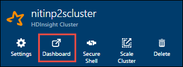

 <properties
    pageTitle="Verwenden HDInsight Tools in Azure Toolkit für IntelliJ HDInsight Spark Cluster ausgeführt Applications Remote Debuggen | Microsoft Azure"
    description="Erfahren Sie, wie mithilfe HDInsight Tools in Azure-Toolkit für IntelliJ Remote Debuggen von Applications HDInsight Spark Cluster ausgeführt."
    services="hdinsight"
    documentationCenter=""
    authors="nitinme"
    manager="jhubbard"
    editor="cgronlun"
    tags="azure-portal"/>

<tags
    ms.service="hdinsight"
    ms.workload="big-data"
    ms.tgt_pltfrm="na"
    ms.devlang="na"
    ms.topic="article"
    ms.date="09/09/2016"
    ms.author="nitinme"/>

# Verwenden Sie HDInsight-Tools in Azure-Toolkit für IntelliJ Debuggen Spark Applikationen Remote auf HDInsight Spark Linux cluster

Dieser Artikel enthält eine schrittweise Anleitung zum Verwenden der HDInsight Tools in Azure-Toolkit für IntelliJ Absenden eines Auftrags Spark auf HDInsight Spark Cluster, und klicken Sie dann aus dem Desktopcomputer Remote Debuggen an. Dazu müssen Sie die folgenden allgemeinen Schritte ausführen:

1. Erstellen eines Standort-zu-Standort oder Punkt-zu-Standort, virtuellen Azure-Netzwerks. Die Schritte in diesem Dokument wird davon ausgegangen, dass Sie eine Website-zu-Standort-Netzwerk verwenden.

2. Erstellen eines Clusters Spark Azure HDInsight, die Teil des virtuellen Netzwerks zwischen Standorten Azure ist.

3. Überprüfen Sie die Verbindung zwischen der Cluster Headnode und Ihren Desktop aus.

4. Erstellen Sie eine Anwendung Scala in IntelliJ IDEE, und konfigurieren Sie ihn für das Debuggen Remoteprozeduraufruf.

5. Ausführen und Debuggen der Anwendung.

##Erforderliche Komponenten

* Ein Azure-Abonnement. Finden Sie [kostenlose Testversion Azure abrufen](https://azure.microsoft.com/documentation/videos/get-azure-free-trial-for-testing-hadoop-in-hdinsight/).

* Eine Apache Spark Cluster auf HDInsight Linux. Anweisungen finden Sie unter [Erstellen von Apache Spark Cluster in Azure HDInsight](hdinsight-apache-spark-jupyter-spark-sql.md).
 
* Oracle Java Development Kit. Sie können ihn [hier](http://www.oracle.com/technetwork/java/javase/downloads/jdk8-downloads-2133151.html)installieren.
 
* IntelliJ IDEE. In diesem Artikel wird die Version 15.0.1 verwendet. Sie können ihn [hier](https://www.jetbrains.com/idea/download/)installieren.
 
* HDInsight Tools in Azure Toolkit für IntelliJ. HDInsight Tools für IntelliJ stehen als Teil der Azure-Toolkit für IntelliJ. Anweisungen zum Installieren des Azure-Toolkit finden Sie unter [Installieren der Azure-Toolkit für IntelliJ](../azure-toolkit-for-intellij-installation.md).

* Melden Sie sich bei Ihrem Azure-Abonnement aus IntelliJ IDEE. Gehen Sie wie [hier](hdinsight-apache-spark-intellij-tool-plugin.md#log-into-your-azure-subscription).
 
* Während der Ausführung von Spark Scala Anwendung für den remote-Debuggen auf einem Windows-Computer, erhalten Sie möglicherweise eine Ausnahme, wie in [SPARK-2356](https://issues.apache.org/jira/browse/SPARK-2356) erläutert, die aufgrund einer fehlenden WinUtils.exe unter Windows auftritt. Zum Beheben dieses Fehlers arbeiten möchten, müssen Sie sich an einem Speicherort wie **C:\WinUtils\bin** [die ausführbare Datei hier herunterladen](http://public-repo-1.hortonworks.com/hdp-win-alpha/winutils.exe) . Sie müssen dann fügen Sie einer Umgebungsvariable **HADOOP_HOME** hinzu und legen Sie den Wert der Variablen zu **C\WinUtils**.

## Schritt 1: Erstellen eines Azure virtuellen Netzwerks

Führen Sie die Schritte in der unten Links zu einer Azure-virtuellen Netzwerk erstellen, und überprüfen die Konnektivität zwischen dem Desktop- und Azure-virtuellen Netzwerk.

* [Erstellen einer VNet mit einer Website-zu-Standort VPN-Verbindung mithilfe von Azure-Portal](../vpn-gateway/vpn-gateway-howto-site-to-site-resource-manager-portal.md)
* [Erstellen einer VNet mit einem Website-zu-Standort VPN-Verbindung mithilfe der PowerShell](../vpn-gateway/vpn-gateway-create-site-to-site-rm-powershell.md)
* [Konfigurieren einer Punkt-zu-Standort-Verbindung zu einem virtuellen Netzwerk mithilfe der PowerShell](../vpn-gateway/vpn-gateway-howto-point-to-site-rm-ps.md)

## Schritt 2: Erstellen eines HDInsight Spark Clusters

Sie sollten einen Apache Spark Cluster auch auf Azure HDInsight erstellen, die Teil der Azure-virtuellen Netzwerk ist, die Sie erstellt haben. Verwenden Sie die Informationen zur Verfügung am [Erstellen Linux-basierten Cluster in HDInsight](hdinsight-hadoop-provision-linux-clusters.md). Wählen Sie als Teil der Konfiguration optional das virtuelle Azure-Netzwerk, die Sie im vorherigen Schritt erstellt haben.

## Schritt 3: Überprüfen der Konnektivität zwischen den Cluster Headnode und Ihrem desktop

1. Abrufen der IP-Adresse der Headnode an. Öffnen Sie Ambari UI für den Cluster ein. Klicken Sie auf **Dashboard**, aus dem Blade Cluster.

    

2. Klicken Sie auf **Hosts**, aus der UI Ambari in der oberen rechten Ecke.

    

3. Es sollte eine Liste der Headnodes, Worker Knoten und Zookeeper Knoten angezeigt. Die Headnodes haben die **hn*** Präfix. Klicken Sie auf der ersten Headnode.

    

4. Kopieren Sie die IP-Adresse der Headnode und der Hostname am unteren Rand der Seite, die aus dem Feld **Zusammenfassung** wird geöffnet.

    

5. Enthalten Sie die IP-Adresse und den Hostnamen des der Headnode zur **Hosts** -Datei auf dem Computer aus, in ausführen und Remote Debuggen Spark Aufträge werden soll. Dadurch wird die Kommunikation mit der Headnode verwenden die IP-Adresse als auch die Hostname aktiviert.

    1. Öffnen Sie einen Editor mit erweiterten Berechtigungen aus. Klicken Sie im Dateimenü auf **Öffnen** , und navigieren Sie zu dem Speicherort der Hosts-Datei. Auf einem Windows-Computer, es ist `C:\Windows\System32\Drivers\etc\hosts`.

    2. Fügen Sie den folgenden **Hosts** -Datei.

            # For headnode0
            192.xxx.xx.xx hn0-nitinp
            192.xxx.xx.xx hn0-nitinp.lhwwghjkpqejawpqbwcdyp3.gx.internal.cloudapp.net

            # For headnode1
            192.xxx.xx.xx hn1-nitinp
            192.xxx.xx.xx hn1-nitinp.lhwwghjkpqejawpqbwcdyp3.gx.internal.cloudapp.net

5. Vom Computer, den Sie mit dem Azure-virtuellen-Netzwerk verbunden, die vom HDInsight Cluster verwendet wird, stellen Sie sicher, dass Sie sowohl die Headnodes verwenden die IP-Adresse als auch die Hostname anpingen können.

6. SSH in den Cluster Headnode anhand der Anweisungen am [Verbinden mit einem HDInsight Cluster SSH verwenden](hdinsight-hadoop-linux-use-ssh-windows.md#connect-to-a-linux-based-hdinsight-cluster). Pingen Sie aus der Headnode Cluster die IP-Adresse des desktop-Computers. Testen Sie die Verbindung zu sowohl die IP-Adressen zugewiesen an den Computer, eine für die Verbindung und die andere für das virtuelle Azure-Netzwerk, die mit der Computer verbunden ist.

7. Wiederholen Sie die Schritte für die anderen Headnode ebenfalls ein. 

## Schritt 4: Erstellen einer Spark Scala-Anwendung, die mit den Tools HDInsight Azure-Toolkit für IntelliJ und konfigurieren Sie ihn für das Debuggen Remoteprozeduraufruf

1. Starten Sie IntelliJ IDEE und Erstellen eines neuen Projekts. Im Dialogfeld Neues Projekt folgende Schritte aus, und klicken Sie dann auf **Weiter**.

    

    * Wählen Sie im linken Bereich **HDInsight**.
    * Wählen Sie im rechten Bereich **Spark auf HDInsight (Scala)**.
    * Klicken Sie auf **Weiter**.

2. Geben Sie im nächsten Fenster die Projektdetails.

    * Geben Sie einen Projektnamen und den Projektspeicherort.
    * **Project SDK**Vergewissern Sie sich, dass Sie keine Java-Version größer als 7 angeben.
    * **Scala SDK**klicken Sie auf **Erstellen**, klicken Sie auf **herunterladen**, und wählen Sie dann auf die Version von Scala verwenden. **Stellen Sie sicher, verwenden Sie nicht Version 2.11.x**. In diesem Beispiel wird die Version **2.10.6**verwendet.

        

    * **Spark SDK**herunterladen Sie und verwenden Sie das SDK von [hier](http://go.microsoft.com/fwlink/?LinkID=723585&clcid=0x409). Sie können auch dies ignorieren und [Spark Maven Repository](http://mvnrepository.com/search?q=spark) jedoch stattdessen verwenden stellen Sie sicher, dass das richtigen Maven Repository installiert sein, damit der Entwicklung einer Spark. (Z. B. müssen Sie sicherstellen, dass Sie haben das Streaming Spark Webpart installiert, wenn Sie Spark Streaming verwenden; Auch Bitte stellen Sie sicher, dass Sie das Repository Scala 2.10 markiert verwenden werden: Verwenden Sie nicht das Repository als Scala 2.11 markiert.)

        

    * Klicken Sie auf **Fertig stellen**.

3. Das Projekt Spark erstellt automatisch ein für Sie. Gehen Sie folgendermaßen vor, um das Element anzuzeigen.

    1. Klicken Sie im Menü **Datei** auf **Projektstruktur**.
    2. Klicken Sie auf **Elemente** , um das Standard-Element anzuzeigen, das erstellt wird, klicken Sie im Dialogfeld **Project-Struktur** .

        

    Sie können auch eigene Element erstellen Assembly, indem Sie auf die **+** Symbol, das vorstehende Abbildung hervorgehoben.

4. Klicken Sie auf **Projekt**, klicken Sie im Dialogfeld **Project-Struktur** . Wenn das **Projekt SDK** 1.8 eingestellt ist, stellen Sie sicher, dass die **Sprache Projektebene** ist schieben **7 - Rauten, Cloud, mehrere Catch, usw.**.

    

4. Hinzufügen von Bibliotheken zum Projekt. Zum Hinzufügen einer Bibliothek mit der rechten Maustaste in des Namens des Projekts in der Projektstruktur, und klicken Sie dann auf **Öffnen Modul-Einstellungen**. Klicken Sie im Dialogfeld **Project-Struktur** , klicken Sie im linken Bereich auf **Bibliotheken**, klicken Sie auf das Pluszeichen (+) Symbol-, und klicken Sie dann auf **Aus Maven**. 

     

    Klicken Sie im Dialogfeld **Download Library aus Maven Repository** suchen Sie, und fügen Sie die folgenden Bibliotheken hinzu.

    * `org.scalatest:scalatest_2.10:2.2.1`
    * `org.apache.hadoop:hadoop-azure:2.7.1`

5. Kopieren `yarn-site.xml` und `core-site.xml` aus der Cluster Headnode und dem Projekt hinzuzufügen. Verwenden Sie die folgenden Befehle, um die Dateien zu kopieren. Sie können [Cygwin](https://cygwin.com/install.html) zum Ausführen der Folgendes `scp` Befehle zum Kopieren der Dateien aus der Cluster Headnodes.

        scp <ssh user name>@<headnode IP address or host name>://etc/hadoop/conf/core-site.xml .

    Da wir die Headnode IP-Adresse und Hostnamen bereits hinzugefügt fo die Hosts-Datei auf dem Desktop, können wir die Befehle **scp** auf folgende Weise verwenden.

        scp sshuser@hn0-nitinp:/etc/hadoop/conf/core-site.xml .
        scp sshuser@hn0-nitinp:/etc/hadoop/conf/yarn-site.xml .

    Diese Dateien zum Projekt hinzufügen, indem Sie sie unter dem **Ordner/src** in Ihrem Projektstruktur, beispielsweise Kopieren `<your project directory>\src`.

6. Aktualisieren der `core-site.xml` die folgenden Änderungen vornehmen.

    1. `core-site.xml`enthält die verschlüsselte-Taste, um den Cluster zugeordnete Speicherplatz Konto an. In der `core-site.xml` , dass Sie dem Projekt hinzugefügt, ersetzen den verschlüsselten Schlüssel mit dem Speicherschlüssel ist-des Standardkontos-Speicher zugeordnet. Finden Sie unter [verwalten die Zugriffstasten Speicher](../storage/storage-create-storage-account.md#manage-your-storage-account).

            <property>
                <name>fs.azure.account.key.hdistoragecentral.blob.core.windows.net</name>
                <value>access-key-associated-with-the-account</value>
            </property>

    2. Entfernen Sie die folgenden Einträge aus der `core-site.xml`.

            <property>
                <name>fs.azure.account.keyprovider.hdistoragecentral.blob.core.windows.net</name>
                <value>org.apache.hadoop.fs.azure.ShellDecryptionKeyProvider</value>
            </property>

            <property>
                <name>fs.azure.shellkeyprovider.script</name>
                <value>/usr/lib/python2.7/dist-packages/hdinsight_common/decrypt.sh</value>
            </property>

            <property>
                <name>net.topology.script.file.name</name>
                <value>/etc/hadoop/conf/topology_script.py</value>
            </property>

    3. Speichern Sie die Datei ein.

7. Fügen Sie der Klasse primär für eine Anwendung. Aus dem **Projekt-Explorer**mit der rechten Maustaste **Src**, zeigen Sie auf **neu**, und klicken Sie dann auf **Scala Class**.

    

8. Klicken Sie im Dialogfeld **Neue Scala Klasse erstellen** Geben Sie einen Namen für die **Art** select **Objekt**, und klicken Sie dann auf **OK**.

    

9. In der `MyClusterAppMain.scala` ablegen, fügen Sie den folgenden Code. Dieser Code erstellt die Spark Kontext bereitstellen und startet eine `executeJob` Methode aus der `SparkSample` Objekt.

        import org.apache.spark.{SparkConf, SparkContext}

        object SparkSampleMain {
          def main (arg: Array[String]): Unit = {
            val conf = new SparkConf().setAppName("SparkSample")
                                      .set("spark.hadoop.validateOutputSpecs", "false")
            val sc = new SparkContext(conf)
        
            SparkSample.executeJob(sc,
                                   "wasbs:///HdiSamples/HdiSamples/SensorSampleData/hvac/HVAC.csv",
                                   "wasbs:///HVACOut")
          }
        }

10. Wiederholen Sie die Schritte 8 und 9 aus, um ein neues Scala-Objekt namens hinzuzufügen `SparkSample`. Fügen Sie dieser Klasse den folgenden Code ein. Dieser Code liest die Daten aus der HVAC.csv (verfügbar auf alle HDInsight Spark Cluster), ruft die Zeilen, die nur eine Ziffer in der siebten Spalte in der CSV-aufweisen und schreibt die Ausgabe in **/HVACOut** unter dem standardmäßigen Speichercontainer für den Cluster.

        import org.apache.spark.SparkContext
    
        object SparkSample {
          def executeJob (sc: SparkContext, input: String, output: String): Unit = {
            val rdd = sc.textFile(input)
        
            //find the rows which have only one digit in the 7th column in the CSV
            val rdd1 =  rdd.filter(s => s.split(",")(6).length() == 1)
        
            val s = sc.parallelize(rdd.take(5)).cartesian(rdd).count()
            println(s)
        
            rdd1.saveAsTextFile(output)
            //rdd1.collect().foreach(println)
          }
        
        }

11. Wiederholen Sie die Schritte 8 und 9 oben, um das Hinzufügen eines neuen Klasse mit dem Namen `RemoteClusterDebugging`. Diese Klasse implementiert Spark Framework zum Testen der, das für das Debuggen von Applications verwendet wird. Fügen Sie den folgenden Code ein, um die `RemoteClusterDebugging` Class.

        import org.apache.spark.{SparkConf, SparkContext}
        import org.scalatest.FunSuite
        
        class RemoteClusterDebugging extends FunSuite {
        
          test("Remote run") {
            val conf = new SparkConf().setAppName("SparkSample")
                                      .setMaster("yarn-client")
                                      .set("spark.yarn.am.extraJavaOptions", "-Dhdp.version=2.4")
                                      .set("spark.yarn.jar", "wasbs:///hdp/apps/2.4.2.0-258/spark-assembly-1.6.1.2.4.2.0-258-hadoop2.7.1.2.4.2.0-258.jar")
                                      .setJars(Seq("""C:\WORK\IntelliJApps\MyClusterApp\out\artifacts\MyClusterApp_DefaultArtifact\default_artifact.jar"""))
                                      .set("spark.hadoop.validateOutputSpecs", "false")
            val sc = new SparkContext(conf)
        
            SparkSample.executeJob(sc,
              "wasbs:///HdiSamples/HdiSamples/SensorSampleData/hvac/HVAC.csv",
              "wasbs:///HVACOut")
          }
        }

    Paar wichtige Dinge zu beachten:
    
    * Für `.set("spark.yarn.jar", "wasbs:///hdp/apps/2.4.2.0-258/spark-assembly-1.6.1.2.4.2.0-258-hadoop2.7.1.2.4.2.0-258.jar")`, stellen Sie sicher, die Assembly Spark JAR auf dem Cluster-Speicher unter dem angegebenen Pfad zur Verfügung.
    * Für `setJars`, geben Sie den Speicherort, in dem der Jar Element erstellt werden. In der Regel ist es `<Your IntelliJ project directory>\out\<project name>_DefaultArtifact\default_artifact.jar`. 

11. In der `RemoteClusterDebugging` Klasse, mit der rechten Maustaste im `test` Schlüsselwort, und wählen Sie **RemoteClusterDebugging-Konfiguration erstellen**.

    

12. Klicken Sie im Dialogfeld Geben Sie einen Namen für die Konfiguration, und wählen Sie die **Art der Test** als **Testnamen**. Lassen Sie alle anderen Werte als Standard, klicken Sie auf **Übernehmen**, und klicken Sie dann auf **OK**.

    

13. Es sollte jetzt eine Konfiguration **Remote ausführen** Dropdown-Liste in der Menüleiste angezeigt. 

    

## Schritt 5: Führen Sie die Anwendung im Debuggen-Modus

1. Öffnen Sie in Ihrem Projekt IntelliJ IDEE `SparkSample.scala` und Erstellen einer fortzuschreiten neben 'Val rdd1'. Wählen Sie im Popupmenü zum Erstellen einer fortzuschreiten **Tabellenzeile Funktion ExecuteJob**aus.

    

2. Klicken Sie auf die Schaltfläche **Debuggen ausführen** , neben der Konfiguration **Remote ausführen** Dropdown-Liste für die Ausführung der Anwendung zu starten.

    

3. Wenn die Ausführung des Programms die fortzuschreiten erreicht, sollte eine Registerkarte **Debugger** im unteren Bereich angezeigt werden.

    

4. Klicken Sie auf der (**+**) Symbol, um eine Überwachung hinzuzufügen, wie in der nachstehenden Abbildung gezeigt. 

    

    Hier ist, da die Anwendung vor der Variablen eingestellt wurde `rdd1` erstellt wurde, verwenden diese anzeigen, können wir sehen, was die ersten 5 Zeilen in der Variablen sind `rdd`. Drücken Sie die **EINGABETASTE**.

    

    Im Bild oben finden Sie, dass zur Laufzeit Sie, TB unterstützt von Daten und Debuggen Abfragen könnten ist wie der Anwendung fortschreitet. In der Ausgabe im Bild oben angezeigt wird, können Sie beispielsweise sehen, dass die erste Zeile der Ausgabe einer Kopfzeile ist. Anhand dieser können Sie Ihrer Anwendungscode, um die Kopfzeile zu überspringen, falls erforderlich ändern.

5. Sie können jetzt das **Programm Lebenslauf** -Symbol, um fahren Sie mit der Ausführung der Anwendung klicken.

    

6. Wenn die Anwendung erfolgreich abgeschlossen ist, sollte eine Ausgabe wie die folgende angezeigt werden.

    

 

## Siehe auch

* [Übersicht: Apache Spark auf Azure HDInsight](hdinsight-apache-spark-overview.md)

### Szenarien

* [Spark mit BI: Ausführen interaktiven Datenanalyse mithilfe von Spark in HDInsight mit BI-Tools](hdinsight-apache-spark-use-bi-tools.md)

* [Spark mit maschinellen Schulung: Verwenden Sie Spark in HDInsight zum Analysieren von Gebäude Temperatur HKL-Daten verwenden](hdinsight-apache-spark-ipython-notebook-machine-learning.md)

* [Spark mit maschinellen Schulung: verwenden Spark in HDInsight Lebensmittel Prüfungsergebnissen Vorhersagen](hdinsight-apache-spark-machine-learning-mllib-ipython.md)

* [Spark Streaming: Verwenden Sie Spark in HDInsight zum Erstellen von in Echtzeit streaming Clientanwendungen](hdinsight-apache-spark-eventhub-streaming.md)

* [Website-Protokoll-Datenanalyse mithilfe von Spark in HDInsight](hdinsight-apache-spark-custom-library-website-log-analysis.md)

### Erstellen und Ausführen von applications

* [Erstellen Sie eine eigenständige Anwendung Scala](hdinsight-apache-spark-create-standalone-application.md)

* [Führen Sie Aufträge Remote auf einem Spark Cluster Livius verwenden](hdinsight-apache-spark-livy-rest-interface.md)

### Tools und Erweiterungen

* [Verwenden Sie HDInsight-Tools in Azure-Toolkit für IntelliJ zum Erstellen und übermitteln Spark Scala Applikationen](hdinsight-apache-spark-intellij-tool-plugin.md)

* [Verwenden Sie HDInsight-Tools in Azure-Toolkit für "Ellipse" Spark Applications erstellen](hdinsight-apache-spark-eclipse-tool-plugin.md)

* [Verwenden von Zeppelin Notizbücher mit einem Spark Cluster auf HDInsight](hdinsight-apache-spark-use-zeppelin-notebook.md)

* [Kernels für Jupyter-Notizbuch in Spark Cluster für HDInsight verfügbar](hdinsight-apache-spark-jupyter-notebook-kernels.md)

* [Verwenden von externen Paketen mit Jupyter-Notizbüchern](hdinsight-apache-spark-jupyter-notebook-use-external-packages.md)

* [Jupyter auf Ihrem Computer installieren und Verbinden mit einem HDInsight Spark cluster](hdinsight-apache-spark-jupyter-notebook-install-locally.md)

### Verwalten von Ressourcen

* [Verwalten von Ressourcen für den Apache Spark Cluster in Azure HDInsight](hdinsight-apache-spark-resource-manager.md)

* [Verfolgen und Debuggen Aufträge in einem Apache Spark Cluster in HDInsight](hdinsight-apache-spark-job-debugging.md)
