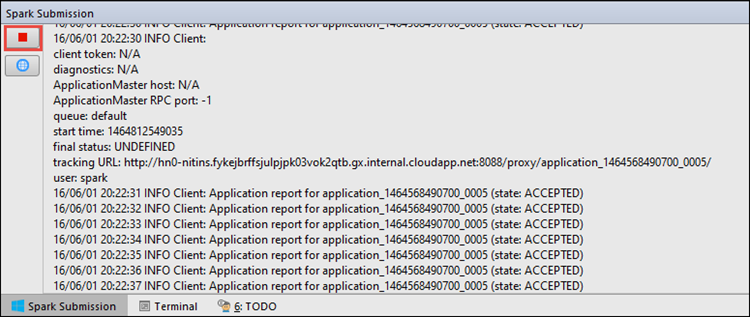
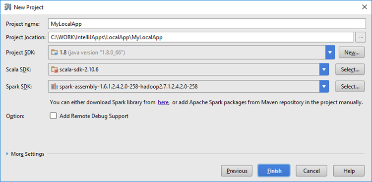

 <properties
    pageTitle="Erstellen Spark Scala Applikationen mithilfe von Tools HDInsight in Azure Toolkit für IntelliJ | Microsoft Azure"
    description="Informationen Sie zum Erstellen eines eigenständiges Spark Anwendung HDInsight Spark Cluster ausgeführt."
    services="hdinsight"
    documentationCenter=""
    authors="nitinme"
    manager="jhubbard"
    editor="cgronlun"
    tags="azure-portal"/>

<tags
    ms.service="hdinsight"
    ms.workload="big-data"
    ms.tgt_pltfrm="na"
    ms.devlang="na"
    ms.topic="article"
    ms.date="09/09/2016"
    ms.author="nitinme"/>

# Verwenden Sie HDInsight-Tools in Azure-Toolkit für IntelliJ Spark Applikationen für HDInsight Spark Linux Cluster erstellen

Dieser Artikel enthält schrittweise Anleitung zum Entwickeln Spark Applications in Scala und übermitteln darauf, um eine HDInsight Spark cluster mithilfe von Tools HDInsight Azure-Toolkit für IntelliJ geschrieben.  Sie können die Tools in verschiedene Weise verwenden:

* Entwickeln und senden Sie eine Anwendung Scala Spark auf einem Cluster HDInsight Spark
* Zugriff auf Ihre Azure HDInsight Spark Clusterressourcen
* Entwickeln, und führen Sie eine Anwendung Scala Spark lokal

Sie können auch ein video [hier](https://mix.office.com/watch/1nqkqjt5xonza) fangen Sie folgen.

>[AZURE.IMPORTANT] Dieses Tool kann zum Erstellen und Übermitteln von Applications nur für eine HDInsight Spark Cluster unter Linux verwendet werden.

##Erforderliche Komponenten

* Ein Azure-Abonnement. Finden Sie [kostenlose Testversion Azure abrufen](https://azure.microsoft.com/documentation/videos/get-azure-free-trial-for-testing-hadoop-in-hdinsight/).

* Eine Apache Spark Cluster auf HDInsight Linux. Anweisungen finden Sie unter [Erstellen von Apache Spark Cluster in Azure HDInsight](hdinsight-apache-spark-jupyter-spark-sql.md).

* Oracle Java Development Kit. Sie können ihn [hier](http://www.oracle.com/technetwork/java/javase/downloads/jdk8-downloads-2133151.html)installieren.

* IntelliJ IDEE. In diesem Artikel wird die Version 15.0.1 verwendet. Sie können ihn [hier](https://www.jetbrains.com/idea/download/)installieren.

## Installieren von HDInsight Tools in Azure Toolkit für IntelliJ

HDInsight tools für IntelliJ zur Verfügung steht im Rahmen des Toolkit Azure für IntelliJ. Anweisungen zum Installieren des Azure-Toolkit finden Sie unter [Installieren der Azure-Toolkit für IntelliJ](../azure-toolkit-for-intellij-installation.md).

## Melden Sie sich bei Ihrem Azure-Abonnement

1. Starten der IntelliJ IDE und der Azure-Explorer öffnen. In der IDE im Menü **Ansicht** auf **Tool Windows** und klicken Sie dann auf **Azure-Explorer**.

    

2. Mit der rechten Maustaste in des **Azure** -Knotens in der **Azure-Explorer**, und klicken Sie dann auf **Abonnements verwalten**.

3. Klicken Sie im Dialogfeld **Abonnements verwalten** auf **Anmelden** , und geben Sie Ihre Anmeldeinformationen Azure.

    

4. Nachdem Sie angemeldet sind, alle Azure Abonnements, die den Anmeldeinformationen zugeordnet ist im Dialogfeld **Abonnements verwalten** aufgeführt. Klicken Sie auf **Schließen** im Dialogfeld.

5. Erweitern Sie in der Registerkarte **Explorer Azure** **HDInsight** , um die HDInsight Spark Cluster unter Ihres Abonnements finden Sie unter aus.

    

6. Sie können einen Cluster Name-Knoten, um die Cluster zugeordneten Ressourcen (z. B. Speicherkonten) finden Sie unter Weitere erweitern.

    

## Führen Sie eine Spark Scala Anwendung auf einer HDInsight Spark cluster

1. Starten Sie IntelliJ IDEE und Erstellen eines neuen Projekts. Im Dialogfeld Neues Projekt folgende Schritte aus, und klicken Sie dann auf **Weiter**.

    

    * Wählen Sie im linken Bereich **HDInsight**.
    * Wählen Sie im rechten Bereich **Spark auf HDInsight (Scala)**.
    * Klicken Sie auf **Weiter**.

2. Geben Sie im nächsten Fenster die Projektdetails.

    * Geben Sie einen Projektnamen und den Projektspeicherort.
    * **Project SDK**Vergewissern Sie sich, dass Sie keine Java-Version größer als 7 angeben.
    * **Scala SDK**klicken Sie auf **Erstellen**, klicken Sie auf **herunterladen**, und wählen Sie dann auf die Version von Scala verwenden. **Stellen Sie sicher, verwenden Sie nicht Version 2.11.x**. In diesem Beispiel wird die Version **2.10.6**verwendet.

        

    * **Spark SDK**herunterladen Sie und verwenden Sie das SDK von [hier](http://go.microsoft.com/fwlink/?LinkID=723585&clcid=0x409). Sie können auch dies ignorieren und [Spark Maven Repository](http://mvnrepository.com/search?q=spark) jedoch stattdessen verwenden stellen Sie sicher, dass das richtigen Maven Repository installiert sein, damit der Entwicklung einer Spark. (Z. B. müssen Sie sicherstellen, dass Sie haben das Streaming Spark Webpart installiert, wenn Sie Spark Streaming verwenden; Auch Bitte stellen Sie sicher, dass Sie das Repository Scala 2.10 markiert verwenden werden: Verwenden Sie nicht das Repository als Scala 2.11 markiert.)

        

    * Klicken Sie auf **Fertig stellen**.

3. Das Projekt Spark erstellt automatisch ein für Sie. Gehen Sie folgendermaßen vor, um das Element anzuzeigen.

    1. Klicken Sie im Menü **Datei** auf **Projektstruktur**.
    2. Klicken Sie auf **Elemente** , um das Standard-Element anzuzeigen, das erstellt wird, klicken Sie im Dialogfeld **Project-Struktur** .

        

    Sie können auch eigene Element erstellen Assembly, indem Sie auf die **+** Symbol, das vorstehende Abbildung hervorgehoben.

4. Klicken Sie auf **Projekt**, klicken Sie im Dialogfeld **Project-Struktur** . Wenn das **Projekt SDK** 1.8 eingestellt ist, stellen Sie sicher, dass die **Sprache Projektebene** ist schieben **7 - Rauten, Cloud, mehrere Catch, usw.**.

    

5. Hinzufügen von Quellcode Ihrer Anwendung.

    1. Aus dem **Projekt-Explorer**mit der rechten Maustaste **Src**, zeigen Sie auf **neu**, und klicken Sie dann auf **Scala Class**.

        

    2. Klicken Sie im Dialogfeld **Neue Scala Klasse erstellen** Geben Sie einen Namen für die **Art** select **Objekt**, und klicken Sie dann auf **OK**.

        

    3. Fügen Sie in der Datei **MyClusterApp.scala** den folgenden Code ein. Dieser Code liest die Daten aus der HVAC.csv (verfügbar auf alle HDInsight Spark Cluster), ruft die Zeilen, die nur eine Ziffer in der siebten Spalte in der CSV-aufweisen und schreibt die Ausgabe in **/HVACOut** unter dem standardmäßigen Speichercontainer für den Cluster.

            import org.apache.spark.SparkConf
            import org.apache.spark.SparkContext

            object MyClusterApp{
              def main (arg: Array[String]): Unit = {
                val conf = new SparkConf().setAppName("MyClusterApp")
                val sc = new SparkContext(conf)

                val rdd = sc.textFile("wasbs:///HdiSamples/HdiSamples/SensorSampleData/hvac/HVAC.csv")

                //find the rows which have only one digit in the 7th column in the CSV
                val rdd1 =  rdd.filter(s => s.split(",")(6).length() == 1)

                rdd1.saveAsTextFile("wasbs:///HVACOut")
              }

            }

5. Führen Sie die Anwendung in einem Cluster HDInsight Spark aus.

    1. Im **Projekt-Explorer**mit der rechten Maustaste in des Projektnamen ein, und wählen Sie dann auf **Senden Spark Anwendung HDInsight**.

        

    2. Sie werden aufgefordert, Ihre Anmeldeinformationen Azure-Abonnement einzugeben. Klicken Sie im Dialogfeld **Spark Einreichung** bieten Sie die folgenden Werte.

        * **Spark Cluster (nur Linux)**wählen Sie den HDInsight Spark Cluster, auf dem Sie die Anwendung ausführen möchten.

        * Sie müssen entweder wählen Sie ein Element aus dem Projekt IntelliJ aus, oder wählen Sie eine von Festplatte.

        * Für das Textfeld **Klassennamen primär** , klicken Sie auf die Auslassungspunkte ( ), wählen Sie im Hauptfenster Klasse im Quellcode Ihrer Anwendung, und klicken Sie dann auf **OK**.

            

        * Da der Anwendungscode in diesem Beispiel keine Befehlszeilenargumente erforderlich oder Bezug Gläser oder Dateien ist, können Sie die restlichen Textfelder leer lassen.

        * Das Dialogfeld sollte folgendermaßen aussehen, nach der alle Eingaben.

            

        * Klicken Sie auf **Absenden**.

    3. Die Registerkarte **Spark Einreichung** am unteren Rand des Fensters sollte starten den Status anzeigt. Sie können auch die Anwendung beenden, indem Sie auf die rote Schaltfläche im Fenster "Spark Beitrag".

        

    Im nächsten Abschnitt erfahren Sie, wie zum Zugreifen auf des Auftrags mit den Tools HDInsight Azure-Toolkit für IntelliJ ausgegeben.

## Zugreifen auf und Verwalten von HDInsight Spark Cluster mit den Tools HDInsight Azure-Toolkit für IntelliJ

Sie können eine Vielzahl von Vorgängen anhand der HDInsight-Tools, die Bestandteil von Azure-Toolkit für IntelliJ ausführen.

### Zugriff auf die Position Ansicht direkt aus der HDInsight-tools

1. **Explorer Azure**-erweitern Sie **HDInsight**zu, erweitern Sie den Namen der Spark Cluster und klicken Sie dann auf **Projekte**.

2. Im rechten Bereich zeigt die Registerkarte **Spark Auftrag Ansicht** alle Programme, die auf dem Cluster ausgeführt wurden. Klicken Sie auf den Namen der Anwendung, für den Sie weitere Details anzeigen möchten.

    

3. Die Kontrollkästchen für die **Fehlermeldung**, **Position Ausgabe**, **Livius Auftrag Protokolle**und **Spark Treiber Protokolle** werden aufgefüllt basierend auf der Anwendung, die Sie auswählen.

4. Sie können auch die **Spark Verlauf Benutzeroberfläche** und der **Benutzeroberfläche aus** (Ebene der Anwendung) öffnen, indem Sie auf die entsprechenden Schaltflächen am oberen Rand des Bildschirms.

### Zugriff auf den Server Spark Verlauf

1. **Azure-Explorer**- **HDInsight**zu erweitern, mit der rechten Maustaste in Ihren Spark Cluster ein, und wählen Sie dann auf **Öffnen Spark Verlauf Benutzeroberfläche**. Wenn Sie dazu aufgefordert werden, geben Sie die Administrator-Anmeldeberechtigungen für den Cluster aus. Sie müssen diese während der Bereitstellung Cluster angegeben haben.

2. Im Dashboard Spark Verlauf Server, Sie können Suchen Sie nach der Anwendung Sie gerade fertig ausgeführt, indem Sie den Namen der Anwendung. In der obigen Code Sie festlegen der Anwendung mit `val conf = new SparkConf().setAppName("MyClusterApp")`. Daher wurde der Name Ihrer Anwendung Spark **MyClusterApp**.

### Starten Sie das Ambari-portal

**Explorer Azure**- **HDInsight**zu erweitern, mit der rechten Maustaste in Ihren Spark Clusternamen ein, und wählen Sie **Öffnen Cluster Verwaltungsportal (Ambari)**. Wenn Sie dazu aufgefordert werden, geben Sie die Administrator-Anmeldeberechtigungen für den Cluster aus. Sie müssen diese während der Bereitstellung Cluster angegeben haben.

### Verwalten von Azure-Abonnements

Standardmäßig werden die Spark Cluster alle Ihre Azure Abonnements die Tools HDInsight aufgeführt. Falls erforderlich, können Sie die Abonnements angeben, für die Sie Zugriff auf den Cluster möchten. Mit der rechten Maustaste in des **Azure** Stamm-Knotens der **Azure-Explorer**und klicken Sie dann auf **Abonnements verwalten**. Deaktivieren Sie im Dialogfeld die Kontrollkästchen für das Abonnement, das gewünschte nicht zugreifen, und klicken Sie dann auf **Schließen**. Sie können auch **Abmelden** klicken, wenn Sie von Ihrem Azure-Abonnement abmelden möchten.

## Führen Sie eine Anwendung Spark Scala lokal

Die HDInsight-Tools können in Azure Toolkit für IntelliJ Sie Spark Scala Applikationen lokal auf Ihrem Computer ausführen. In der Regel solche Applikationen nicht müssen auf Clusterressourcen wie Speichercontainer zugreifen und ausführen und getestet werden können lokal.

### Voraussetzung

Während die lokale Spark Scala Anwendung auf einem Windows-Computer ausgeführt wird, erhalten Sie möglicherweise eine Ausnahme, wie in [SPARK-2356](https://issues.apache.org/jira/browse/SPARK-2356) erläutert, die aufgrund einer fehlenden WinUtils.exe unter Windows auftritt. Zum Beheben dieses Fehlers arbeiten möchten, müssen Sie sich an einem Speicherort wie **C:\WinUtils\bin** [die ausführbare Datei hier herunterladen](http://public-repo-1.hortonworks.com/hdp-win-alpha/winutils.exe) . Sie müssen dann fügen Sie einer Umgebungsvariable **HADOOP_HOME** hinzu und legen Sie den Wert der Variablen zu **C\WinUtils**.

### Führen Sie eine lokale Spark Scala Anwendung  

1. Starten Sie IntelliJ IDEE und Erstellen eines neuen Projekts. Im Dialogfeld Neues Projekt folgende Schritte aus, und klicken Sie dann auf **Weiter**.

    

    * Wählen Sie im linken Bereich **HDInsight**.
    * Wählen Sie im rechten Bereich **Spark HDInsight lokale Ausführen Stichprobe (Scala)**.
    * Klicken Sie auf **Weiter**.

2. Geben Sie im nächsten Fenster die Projektdetails.

    * Geben Sie einen Projektnamen und den Projektspeicherort.
    * **Project SDK**Vergewissern Sie sich, dass Sie keine Java-Version größer als 7 angeben.
    * **Scala SDK**klicken Sie auf **Erstellen**, klicken Sie auf **herunterladen**, und wählen Sie dann auf die Version von Scala verwenden. **Stellen Sie sicher, verwenden Sie nicht Version 2.11.x**. In diesem Beispiel wird die Version **2.10.6**verwendet.

        

    * **Spark SDK**herunterladen Sie und verwenden Sie das SDK von [hier](http://go.microsoft.com/fwlink/?LinkID=723585&clcid=0x409). Sie können auch dies ignorieren und [Spark Maven Repository](http://mvnrepository.com/search?q=spark) jedoch stattdessen verwenden stellen Sie sicher, dass das richtigen Maven Repository installiert sein, damit der Entwicklung einer Spark. (Z. B. müssen Sie sicherstellen, dass Sie haben das Streaming Spark Webpart installiert, wenn Sie Spark Streaming verwenden; Auch Bitte stellen Sie sicher, dass Sie das Repository Scala 2.10 markiert verwenden werden: Verwenden Sie nicht das Repository als Scala 2.11 markiert.)

        

    * Klicken Sie auf **Fertig stellen**.

3. Die Vorlage fügt einen Beispielcode (**LogQuery**) unter dem **Src** -Ordner, den die lokal auf Ihrem Computer ausgeführt werden können.

    

4.  Klicken Sie mit der rechten Maustaste auf die Anwendung **LogQuery** , und klicken Sie dann auf **"Ausführen 'LogQuery'"**. Sehen Sie ein Ergebnis wie folgt auf der Registerkarte **Ausführen** , klicken Sie unten ein.

    

## Konvertieren von vorhandenen IntelliJ IDEE Applikationen mit den HDInsight Tools in Azure-Toolkit für IntelliJ

Sie können auch Ihre vorhandenen Spark Scala Applikationen erstellt in IntelliJ IDEE mit den HDInsight Tools in Azure-Toolkit für IntelliJ kompatibel konvertieren. Dies ermöglicht Ihnen das Tool zum Übermitteln der Anwendungen zu einem HDInsight Spark Cluster verwenden. Sie können dazu die folgenden Schritte ausführen:

1. Öffnen Sie für eine vorhandene Spark Scala-Anwendung erstellt IntelliJ IDEE die zugehörigen .iml-Datei ein.
2. Auf der Stammebene wird ein **Modul** Element wie folgt angezeigt:

        <module org.jetbrains.idea.maven.project.MavenProjectsManager.isMavenModule="true" type="JAVA_MODULE" version="4">

3. Bearbeiten Sie das hinzuzufügende Element `UniqueKey="HDInsightTool"` , damit das **Modul** Element wie folgt aussieht:

        <module org.jetbrains.idea.maven.project.MavenProjectsManager.isMavenModule="true" type="JAVA_MODULE" version="4" UniqueKey="HDInsightTool">

4. Die Änderungen zu speichern. Die Anwendung sollte jetzt mit den Tools HDInsight in Azure-Toolkit für IntelliJ kompatibel sein. Sie können dies testen, indem Sie mit der rechten Maustaste auf den Namen des Projekts im Projekt-Explorer. Im Popupmenü sollte jetzt die Option zum **Übermitteln Spark Anwendung mit HDInsight**verfügen.

## Behandlung von Problemen

### "Verwenden Sie eine größere Heapgröße" Fehler in lokalen ausführen

In Spark 1.6 Wenn Sie eine 32-Bit-Java SDK während der lokalen Ausführung verwenden können die folgenden Fehler auftreten:

    Exception in thread "main" java.lang.IllegalArgumentException: System memory 259522560 must be at least 4.718592E8. Please use a larger heap size.
        at org.apache.spark.memory.UnifiedMemoryManager$.getMaxMemory(UnifiedMemoryManager.scala:193)
        at org.apache.spark.memory.UnifiedMemoryManager$.apply(UnifiedMemoryManager.scala:175)
        at org.apache.spark.SparkEnv$.create(SparkEnv.scala:354)
        at org.apache.spark.SparkEnv$.createDriverEnv(SparkEnv.scala:193)
        at org.apache.spark.SparkContext.createSparkEnv(SparkContext.scala:288)
        at org.apache.spark.SparkContext.<init>(SparkContext.scala:457)
        at LogQuery$.main(LogQuery.scala:53)
        at LogQuery.main(LogQuery.scala)
        at sun.reflect.NativeMethodAccessorImpl.invoke0(Native Method)
        at sun.reflect.NativeMethodAccessorImpl.invoke(NativeMethodAccessorImpl.java:57)
        at sun.reflect.DelegatingMethodAccessorImpl.invoke(DelegatingMethodAccessorImpl.java:43)
        at java.lang.reflect.Method.invoke(Method.java:606)
        at com.intellij.rt.execution.application.AppMain.main(AppMain.java:144)

Dies ist, da die Heapgröße nicht genügend Speicherplatz für Spark ausführen, da Spark mindestens 471 MB erfordert (Weitere Details [SPARK-12081](https://issues.apache.org/jira/browse/SPARK-12081) erhalten Sie bei Bedarf), ist. Eine einfache Lösung ist eine 64-Bit-Java SDK verwenden. Sie können auch die Einstellungen für JVM IntelliJ ändern, indem Sie hinzufügen die folgenden Optionen:

    -Xms128m -Xmx512m -XX:MaxPermSize=300m -ea

## Feedback und bekannte Probleme

Aktuell angezeigten Spark gibt direkt nicht unterstützt wird, und wir arbeiten an, die.

Können Sie Wenn Sie Vorschläge oder das Feedback haben oder Probleme auftreten, wenn Sie dieses Tool verwenden, uns eine e-Mail-Nachricht an Hdivstool bei Microsoft Punkt Com einfügen.

## Siehe auch

* [Übersicht: Apache Spark auf Azure HDInsight](hdinsight-apache-spark-overview.md)

### Szenarien

* [Spark mit BI: Ausführen interaktiven Datenanalyse mithilfe von Spark in HDInsight mit BI-Tools](hdinsight-apache-spark-use-bi-tools.md)

* [Spark mit maschinellen Schulung: Verwenden Sie Spark in HDInsight zum Analysieren von Gebäude Temperatur HKL-Daten verwenden](hdinsight-apache-spark-ipython-notebook-machine-learning.md)

* [Spark mit maschinellen Schulung: verwenden Spark in HDInsight Lebensmittel Prüfungsergebnissen Vorhersagen](hdinsight-apache-spark-machine-learning-mllib-ipython.md)

* [Spark Streaming: Verwenden Sie Spark in HDInsight zum Erstellen von in Echtzeit streaming Clientanwendungen](hdinsight-apache-spark-eventhub-streaming.md)

* [Website-Protokoll-Datenanalyse mithilfe von Spark in HDInsight](hdinsight-apache-spark-custom-library-website-log-analysis.md)

### Erstellen und Ausführen von applications

* [Erstellen Sie eine eigenständige Anwendung Scala](hdinsight-apache-spark-create-standalone-application.md)

* [Führen Sie Aufträge Remote auf einem Spark Cluster Livius verwenden](hdinsight-apache-spark-livy-rest-interface.md)

### Tools und Erweiterungen

* [Verwenden Sie HDInsight Tools in Azure-Toolkit für IntelliJ Debuggen aufzeigen Applikationen Remote](hdinsight-apache-spark-intellij-tool-plugin-debug-jobs-remotely.md)

* [Verwenden Sie HDInsight-Tools in Azure-Toolkit für "Ellipse" Spark Applications erstellen](hdinsight-apache-spark-eclipse-tool-plugin.md)

* [Verwenden von Zeppelin Notizbücher mit einem Spark Cluster auf HDInsight](hdinsight-apache-spark-use-zeppelin-notebook.md)

* [Kernels für Jupyter-Notizbuch in Spark Cluster für HDInsight verfügbar](hdinsight-apache-spark-jupyter-notebook-kernels.md)

* [Verwenden von externen Paketen mit Jupyter-Notizbüchern](hdinsight-apache-spark-jupyter-notebook-use-external-packages.md)

* [Jupyter auf Ihrem Computer installieren und Verbinden mit einem HDInsight Spark cluster](hdinsight-apache-spark-jupyter-notebook-install-locally.md)

### Verwalten von Ressourcen

* [Verwalten von Ressourcen für den Apache Spark Cluster in Azure HDInsight](hdinsight-apache-spark-resource-manager.md)

* [Verfolgen und Debuggen Aufträge in einem Apache Spark Cluster in HDInsight](hdinsight-apache-spark-job-debugging.md)
