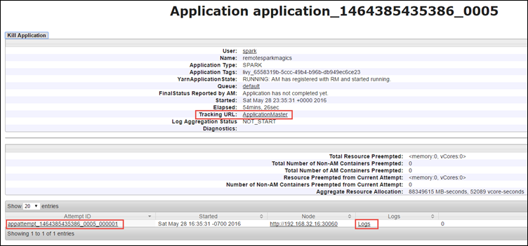
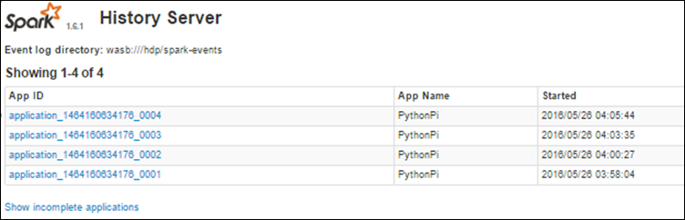

<properties 
    pageTitle="Verfolgen und Debuggen Aufträge in Apache Spark cluster in HDInsight | Microsoft Azure" 
    description="Verwenden von aus UI, Spark Benutzeroberfläche und Spark Verlauf Server zum Nachverfolgen und Debuggen Aufträge in einem Cluster Spark in Azure HDInsight" 
    services="hdinsight" 
    documentationCenter="" 
    authors="nitinme" 
    manager="jhubbard" 
    editor="cgronlun"
    tags="azure-portal"/>

<tags 
    ms.service="hdinsight" 
    ms.workload="big-data" 
    ms.tgt_pltfrm="na" 
    ms.devlang="na" 
    ms.topic="article" 
    ms.date="08/25/2016" 
    ms.author="nitinme"/>

# Verfolgen und Debuggen Aufträge in Apache Spark Cluster in HDInsight Linux

In diesem Artikel erfahren Sie, wie nachverfolgen und Debuggen Spark Aufträge mit der Benutzeroberfläche aus, Spark Benutzeroberfläche und den Server Spark Verlauf. In diesem Artikel wird zunächst einen Spark Auftrag mithilfe eines Notizbuchs verfügbar mit dem Cluster Spark **Computer Schulung: Vorhersage Analysen Lebensmittel Prüfung Daten mithilfe von MLLib**. Sie können die folgenden Schritte zur Anwendung zu verfolgen, die Sie auch ursprünglich eingereicht verwenden Sie eine andere Methode ebenfalls, beispielsweise **Spark übermitteln**.

##Erforderliche Komponenten

Sie müssen die folgenden:

- Ein Azure-Abonnement. Finden Sie [kostenlose Testversion Azure abrufen](https://azure.microsoft.com/documentation/videos/get-azure-free-trial-for-testing-hadoop-in-hdinsight/).
- Eine Apache Spark Cluster auf HDInsight Linux. Anweisungen finden Sie unter [Erstellen von Apache Spark Cluster in Azure HDInsight](hdinsight-apache-spark-jupyter-spark-sql.md).
- Sie sollten nun im Notizbuch ausgeführt **[Computer Schulung: Vorhersage Analysen Lebensmittel Prüfung Daten mithilfe von MLLib](hdinsight-apache-spark-machine-learning-mllib-ipython.md)**. Anweisungen zum Ausführen dieses Notizbuchs auf den Link.  

## Verfolgen Sie die Anwendung in der Benutzeroberfläche aus

1. Starten Sie die Benutzeroberfläche aus. Klicken Sie auf **Cluster Dashboard**aus dem Blade Cluster, und klicken Sie dann auf **aus**.

    

    >[AZURE.TIP] Alternativ können Sie auch die Benutzeroberfläche aus finden Sie in der Ambari UI starten. Zum Starten der UI Ambari aus dem Cluster Blade, klicken Sie auf **Cluster Dashboard**, und klicken Sie dann auf **HDInsight Cluster Dashboard**. Klicken Sie aus der Ambari UI auf **aus**, klicken Sie auf **Quicklinks**, klicken Sie auf der aktiven Ressourcenmanager und klicken Sie dann auf **Ressourcen-Manager-Benutzeroberfläche**.  

3. Da Sie den Spark Auftrag Jupyter Notizbücher mit gestartet, muss die Anwendung den Namen **Remotesparkmagics** (Dies ist der Name für alle Programme, die aus den Notizbüchern gestartet werden). Klicken Sie auf der Anwendung gegen den Namen der Anwendung zu erhalten weitere Informationen zu den Auftrag ID. Dadurch wird die Ansicht der Anwendung gestartet.

    

    Für solche Applikationen, die die Jupyter Notizbücher gestartet werden, ist der Status immer **ausgeführt** , bis Sie das Notizbuch schließen.

4. In der Ansicht Anwendung können Sie um finden Sie heraus, die Container der Anwendung und die Protokolle (Stdout/Stderr) zugeordnet Drilldowns. Sie können auch die Benutzeroberfläche Spark starten, indem Sie auf die Verknüpfung entsprechend dem **URL nachverfolgen**, wie unten dargestellt. 

    

## Anwendung auf der Benutzeroberfläche Spark nachverfolgen

Auf der Benutzeroberfläche Spark angezeigt wird können Sie in der Einzelvorgänge Spark Drilldowns, die von der Anwendung erzeugt werden, die Sie zuvor begonnen.

1. Zum Starten der Benutzeroberfläche Spark, finden Sie in der Anwendung befinden, klicken Sie auf den Link für die **Überwachung URL**, wie auf dem Bildschirmfoto über dargestellt. Sie können alle Spark Aufträge anzeigen, die von der Ausführung im Notizbuch Jupyter Anwendung gestartet werden.

    

2. Klicken Sie auf der Registerkarte **Executors** Verarbeitung und Speicherung Informationen für jede Executor finden. Sie können auch den Anruf Stapel abrufen, indem Sie auf den Link **Thread zu sichern** .

    
 
3. Klicken Sie auf der Registerkarte **Phasen** , um die der Anwendung zugeordneten Phasen finden Sie unter.

    

    Jede Phase kann haben mehrere Aufgaben, die für die Sie Ausführungsstatistiken können, wie anzeigen unten gezeigt.

     

4. Starten Sie von der Seite Details Phase so Visualisierung. Erweitern Sie den Link **So Visualisierung** am oberen Rand der Seite aus, wie unten dargestellt.

    

    So oder direkte Aclyic Diagramm stellt die verschiedenen Stufen in der Anwendung. Jedes Feld blau im Diagramm stellt eine Operation Spark, die aus der Anwendung.

5. Auf der Detailseite Phase können Sie auch die Anwendung Zeitachsenansicht starten. Erweitern Sie den Link **Zeitachse für Ereignisse** am oberen Rand der Seite aus, wie unten dargestellt.

    

    Dies zeigt die Spark Ereignisse in Form einer Zeitachse an. Die Zeitachsenansicht ist auf drei Ebenen über Aufträge, innerhalb eines Auftrags, und klicken Sie in einer Phase verfügbar. Die vorstehende Abbildung erfasst die Zeitachsenansicht für eine bestimmte Phase.

    >[AZURE.TIP] Wenn Sie das Kontrollkästchen **aktivieren, Zoomen** auswählen, können Sie links und rechts der Zeitachsenansicht einen Bildlauf.

6. Andere Registerkarten auf der Benutzeroberfläche Spark bieten nützlichen Informationen über die Spark-Instanz.

    * Registerkarte für Speicher - durch die Anwendung einer RDDs, erstellt können Informationen zu den auf der Registerkarte Speicher suchen.
    * Registerkarte Umgebung - dieser Registerkarte bietet viele nützliche Informationen über Ihre Spark Instanz wie die 
        * Scala-version
        * Ereignisprotokoll Directory Cluster zugeordnet sind.
        * Anzahl der Executor Kerne für die Anwendung
        * Usw.

## Suchen nach Informationen zu abgeschlossenen Aufträge mithilfe des Spark Verlauf-Servers

Nachdem Sie ein Projekt abgeschlossen ist, wird die Informationen zu den Auftrag im Verlauf Spark Server beibehalten.

1. Zum Starten der Spark Verlauf Server, aus dem Blade Cluster klicken Sie auf **Cluster Dashboard**, und klicken Sie dann auf **Spark Verlauf Server**.

    

    >[AZURE.TIP] Alternativ können Sie auch die Spark Verlauf Server-Benutzeroberfläche finden Sie in der Ambari UI starten. Zum Starten der UI Ambari aus dem Cluster Blade, klicken Sie auf **Cluster Dashboard**, und klicken Sie dann auf **HDInsight Cluster Dashboard**. Die UI Ambari auf **Spark**, klicken Sie auf **Quicklinks**und klicken Sie dann auf **Spark Verlauf Server-Benutzeroberfläche**.

2. Alle fertigen aufgeführten Programme werden angezeigt. Klicken Sie auf eine Anwendung ID Drilldown in einer Anwendung, um weitere Informationen anzuzeigen.

    
    

## Siehe auch

* [Übersicht: Apache Spark auf Azure HDInsight](hdinsight-apache-spark-overview.md)

### Szenarien

* [Spark mit BI: Ausführen interaktiven Datenanalyse mithilfe von Spark in HDInsight mit BI-Tools](hdinsight-apache-spark-use-bi-tools.md)

* [Spark mit maschinellen Schulung: Verwenden Sie Spark in HDInsight zum Analysieren von Gebäude Temperatur HKL-Daten verwenden](hdinsight-apache-spark-ipython-notebook-machine-learning.md)

* [Spark mit maschinellen Schulung: verwenden Spark in HDInsight Lebensmittel Prüfungsergebnissen Vorhersagen](hdinsight-apache-spark-machine-learning-mllib-ipython.md)

* [Spark Streaming: Verwenden Sie Spark in HDInsight zum Erstellen von in Echtzeit streaming Clientanwendungen](hdinsight-apache-spark-eventhub-streaming.md)

* [Website-Protokoll-Datenanalyse mithilfe von Spark in HDInsight](hdinsight-apache-spark-custom-library-website-log-analysis.md)

### Erstellen und Ausführen von applications

* [Erstellen Sie eine eigenständige Anwendung Scala](hdinsight-apache-spark-create-standalone-application.md)

* [Führen Sie Aufträge Remote auf einem Spark Cluster Livius verwenden](hdinsight-apache-spark-livy-rest-interface.md)

### Tools und Erweiterungen

* [Verwenden Sie zum Erstellen und übermitteln Spark Scala Applikationen HDInsight Tools-Plug-In für IntelliJ IDEE](hdinsight-apache-spark-intellij-tool-plugin.md)

* [Verwenden von HDInsight Tools-Plug-In für IntelliJ IDEE Spark Applikationen Remote-Debuggen](hdinsight-apache-spark-intellij-tool-plugin-debug-jobs-remotely.md)

* [Verwenden von Zeppelin Notizbücher mit einem Spark Cluster auf HDInsight](hdinsight-apache-spark-use-zeppelin-notebook.md)

* [Kernels für Jupyter-Notizbuch in Spark Cluster für HDInsight verfügbar](hdinsight-apache-spark-jupyter-notebook-kernels.md)

* [Verwenden von externen Paketen mit Jupyter-Notizbüchern](hdinsight-apache-spark-jupyter-notebook-use-external-packages.md)

* [Jupyter auf Ihrem Computer installieren und Verbinden mit einem HDInsight Spark cluster](hdinsight-apache-spark-jupyter-notebook-install-locally.md)

### Verwalten von Ressourcen

* [Verwalten von Ressourcen für den Apache Spark Cluster in Azure HDInsight](hdinsight-apache-spark-resource-manager.md)
