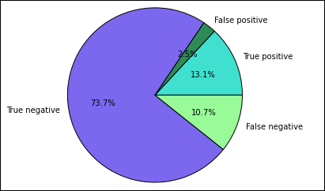

<properties 
    pageTitle="Verwenden Sie Apache Spark maschinellen Learning Applikationen auf HDInsight erstellen | Microsoft Azure" 
    description="Eine schrittweise Anleitung zum Verwenden von Notizbüchern mit Apache Spark maschinellen Learning Applications erstellen" 
    services="hdinsight" 
    documentationCenter="" 
    authors="nitinme" 
    manager="jhubbard" 
    editor="cgronlun"
    tags="azure-portal"/>

<tags 
    ms.service="hdinsight" 
    ms.workload="big-data" 
    ms.tgt_pltfrm="na" 
    ms.devlang="na" 
    ms.topic="article" 
    ms.date="10/05/2016" 
    ms.author="nitinme"/>

# Rechner Schulung: Vorhersage Analysen Lebensmittel Prüfung Daten mithilfe von MLlib mit Apache Spark auf HDInsight Linux cluster

> [AZURE.TIP] In diesem Lernprogramm steht auch als Jupyter Notizbuch auf einer Cluster Spark (Linux), den Sie in HDInsight zu erstellen. Die Notizbuch-Oberfläche können Sie die Python Codeausschnitte aus dem Notizbuch selbst ausführen. Wenn Sie das Lernprogramm aus in einem Notizbuch ausführen zu können, erstellen Sie einen Cluster Spark, starten Sie ein Notizbuch Jupyter (`https://CLUSTERNAME.azurehdinsight.net/jupyter`), und führen Sie dann das Notizbuch **Spark maschinellen Learning - Vorhersage Analysen Lebensmittel Prüfung Daten mithilfe von MLLib.ipynb** unter dem Ordner **Python** .

In diesem Artikel veranschaulicht, wie **MLLib**, Spark des integrierten maschinellen learning Bibliotheken für eine einfache Vorhersage Analyse an einer geöffneten Dataset zur Verfügung. MLLib ist eine Core Spark-Bibliothek, die eine Reihe von Dienstprogrammen bereitstellt, nützlich für maschinelle Learning Aufgaben sind, einschließlich Dienstprogramme, die für geeignet sind:

* Klassifizierung

* Regressionsanalyse

* Cluster

* Thema Modellierung

* Im Singular Wert Gliederung (VSK) und Hauptbenutzer Komponente Analyse (PCA)

* Hypothese testen und Berechnen von Statistiken Stichprobe

Dieser Artikel bietet einen einfachen Ansatz *Klassifizierung* bis logistische Regression.

## Was sind Klassifizierung und logistische Regression?

*Klassifizierung*, eine sehr allgemeine maschinellen learning Aufgabe wird die Vorgehensweise zum Sortieren von Daten in Kategorien. Es ist den Auftrag eines Klassifizierung Algorithmus zu ermitteln, wie "Beschriftungen", um die Eingabe von Daten, die Sie bereitstellen zuweisen. Angenommen, man könnte einen Computer Learning-Algorithmus, der vorhandenen Informationen als Eingabe akzeptiert und unterteilt den Bestand in zwei Kategorien: Bestände, die Sie verkaufen sollte und Bestände, die Sie beibehalten werden soll.

Logistische Regression ist der Algorithmus, den Sie für die Klassifizierung verwenden. Die Spark logistische Regression API eignet sich für *binäre Klassifizierung*oder Klassifizierung von Eingabedaten in einer von zwei Gruppen. Weitere Informationen zu logistischen Regressionen finden Sie unter [Wikipedia](https://en.wikipedia.org/wiki/Logistic_regression).

Zusammenfassung erzeugt die Vorgehensweise zum logistische Regression eine *logistic (Funktion)* , die mit die Wahrscheinlichkeit Vorhersagen, dass ein Eingabe Vektor in einer Gruppe oder anderen gehört werden kann.  

## Was wir in diesem Artikel ausführen möchten?

Spark benötigen einige Vorhersage Analyse Lebensmittel Prüfung Daten (**Food_Inspections1.csv**) ausführen möchten, die über den [Ort der Chicago Portal "Daten"](https://data.cityofchicago.org/)erworben wurde. Dieses Dataset enthält Informationen zur Lebensmittel Kontrolle, die in Chicago, einschließlich Informationen zu jeder Lebensmittel Betrieb, der überprüft wurde, die Verletzung jeweils die gefundenen (falls vorhanden) und die Ergebnisse der Prüfung durchgeführt wurden. Die CSV-Datei ist bereits in der Cluster am **/HdiSamples/HdiSamples/FoodInspectionData/Food_Inspections1.csv**zugeordnete Speicherplatz Konto verfügbar.

In den folgenden Schritten entwickeln Sie ein Modell, um finden Sie unter Was benötigt wird, um erfolgreich oder eine Lebensmittel Überprüfung Fehler aus. 

## Starten Sie eine Computer Learning-Anwendung, die mit Spark MLlib erstellen

1. Klicken Sie auf die Kachel für Ihren Cluster Spark, aus dem [Azure-Portal](https://portal.azure.com/), mithilfe der Startboard (Wenn Sie es an die Startboard angeheftet). Sie können auch navigieren Sie zu Ihren Cluster unter **Alle durchsuchen** > **HDInsight Cluster**.   

2. Klicken Sie aus dem Spark Cluster Blade auf **Cluster Dashboard**, und klicken Sie dann auf **Jupyter Notizbuch**. Wenn Sie dazu aufgefordert werden, geben Sie die Administrator-Anmeldeberechtigungen für den Cluster aus.

    > [AZURE.NOTE] Sie möglicherweise auch das Notizbuch Jupyter für Ihren Cluster erreichen, indem Sie den folgenden URL in Ihrem Browser öffnen. Ersetzen Sie __CLUSTERNAME__ mit dem Namen der Cluster aus:
    >
    > `https://CLUSTERNAME.azurehdinsight.net/jupyter`

2. Erstellen eines neuen Notizbuchs an. Klicken Sie auf **neu**, und klicken Sie dann auf **PySpark**.

    ![Erstellen eines neuen Jupyter Notizbuchs] (./media/hdinsight-apache-spark-machine-learning-mllib-ipython/hdispark.note.jupyter.createnotebook.png "Erstellen eines neuen Jupyter Notizbuchs")

3. Ein neues Notizbuch erstellt und mit dem Namen Untitled.pynb geöffnet. Klicken Sie auf den Notizbuchnamen oben, und geben Sie einen Anzeigenamen ein.

    ![Bereitstellen einen Namen für das Notizbuch] (./media/hdinsight-apache-spark-machine-learning-mllib-ipython/hdispark.note.jupyter.notebook.name.png "Bereitstellen einen Namen für das Notizbuch")

3. Da Sie ein Notizbuch, mit dem die PySpark Kernel erstellt haben, müssen Sie keine Kontexte explizit zu erstellen. Die Kontexte Spark und Struktur werden automatisch für Sie erstellt werden, wenn Sie die erste Zelle der Code ausführen. Sie können beginnen, Erstellen von Ihrem Computer learning Anwendung durch Importieren der Datentypen für dieses Szenario erforderlich ist. Dazu platzieren Sie den Cursor in die Zelle, und drücken Sie **UMSCHALT + EINGABETASTE**.

        from pyspark.ml import Pipeline
        from pyspark.ml.classification import LogisticRegression
        from pyspark.ml.feature import HashingTF, Tokenizer
        from pyspark.sql import Row
        from pyspark.sql.functions import UserDefinedFunction
        from pyspark.sql.types import *

## Erstellen Sie eine Eingabe dataframe

Wir können `sqlContext` zu strukturierten Datentransformation. Die erste Aufgabe besteht, die Beispieldaten ((**Food_Inspections1.csv**)) in eine SQL Spark *Dataframe*zu laden. 

1. Da die unformatierten Daten in eine CSV-Format ist, müssen wir Spark Kontext zu verwenden, um jede Zeile der Datei in den Speicher als unstrukturierten Text ziehen. Klicken Sie dann verwenden Sie den Python CSV-Bibliothek jede Zeile einzeln zu analysieren. 

        def csvParse(s):
            import csv
            from StringIO import StringIO
            sio = StringIO(s)
            value = csv.reader(sio).next()
            sio.close()
            return value
        
        inspections = sc.textFile('wasbs:///HdiSamples/HdiSamples/FoodInspectionData/Food_Inspections1.csv')\
                        .map(csvParse)

2. Wir haben nun die CSV-Datei als eine RDD ein. Lassen Sie uns Abrufen einer einzigen Zeile aus der RDD zu verstehen, das Schema der Daten ein.

        inspections.take(1)

    Sie sollte eine Ausgabe wie die folgende angezeigt:

        # -----------------
        # THIS IS AN OUTPUT
        # -----------------

        [['413707',
          'LUNA PARK INC',
          'LUNA PARK  DAY CARE',
          '2049789',
          "Children's Services Facility",
          'Risk 1 (High)',
          '3250 W FOSTER AVE ',
          'CHICAGO',
          'IL',
          '60625',
          '09/21/2010',
          'License-Task Force',
          'Fail',
          '24. DISH WASHING FACILITIES: PROPERLY DESIGNED, CONSTRUCTED, MAINTAINED, INSTALLED, LOCATED AND OPERATED - Comments: All dishwashing machines must be of a type that complies with all requirements of the plumbing section of the Municipal Code of Chicago and Rules and Regulation of the Board of Health. OBSEVERD THE 3 COMPARTMENT SINK BACKING UP INTO THE 1ST AND 2ND COMPARTMENT WITH CLEAR WATER AND SLOWLY DRAINING OUT. INST NEED HAVE IT REPAIR. CITATION ISSUED, SERIOUS VIOLATION 7-38-030 H000062369-10 COURT DATE 10-28-10 TIME 1 P.M. ROOM 107 400 W. SURPERIOR. | 36. LIGHTING: REQUIRED MINIMUM FOOT-CANDLES OF LIGHT PROVIDED, FIXTURES SHIELDED - Comments: Shielding to protect against broken glass falling into food shall be provided for all artificial lighting sources in preparation, service, and display facilities. LIGHT SHIELD ARE MISSING UNDER HOOD OF  COOKING EQUIPMENT AND NEED TO REPLACE LIGHT UNDER UNIT. 4 LIGHTS ARE OUT IN THE REAR CHILDREN AREA,IN THE KINDERGARDEN CLASS ROOM. 2 LIGHT ARE OUT EAST REAR, LIGHT FRONT WEST ROOM. NEED TO REPLACE ALL LIGHT THAT ARE NOT WORKING. | 35. WALLS, CEILINGS, ATTACHED EQUIPMENT CONSTRUCTED PER CODE: GOOD REPAIR, SURFACES CLEAN AND DUST-LESS CLEANING METHODS - Comments: The walls and ceilings shall be in good repair and easily cleaned. MISSING CEILING TILES WITH STAINS IN WEST,EAST, IN FRONT AREA WEST, AND BY THE 15MOS AREA. NEED TO BE REPLACED. | 32. FOOD AND NON-FOOD CONTACT SURFACES PROPERLY DESIGNED, CONSTRUCTED AND MAINTAINED - Comments: All food and non-food contact equipment and utensils shall be smooth, easily cleanable, and durable, and shall be in good repair. SPLASH GUARDED ARE NEEDED BY THE EXPOSED HAND SINK IN THE KITCHEN AREA | 34. FLOORS: CONSTRUCTED PER CODE, CLEANED, GOOD REPAIR, COVING INSTALLED, DUST-LESS CLEANING METHODS USED - Comments: The floors shall be constructed per code, be smooth and easily cleaned, and be kept clean and in good repair. INST NEED TO ELEVATE ALL FOOD ITEMS 6INCH OFF THE FLOOR 6 INCH AWAY FORM WALL.  ',
          '41.97583445690982',
          '-87.7107455232781',
          '(41.97583445690982, -87.7107455232781)']]

3. Die Ausgabe die obige (datumuhrzeitschlüssel) eine Vorstellung davon das Schema der eingegebenen Datei; die Datei enthält den Namen des jede Niederlassung, den Typ der Einrichtung, die Adresse, die Daten von der Kontrolle und den Speicherort ein, unter anderem an. Wählen Sie uns ein paar Spalten, die für unsere Vorhersage Analyse nützlich sein und Gruppieren der Ergebnisse als eine Dataframe, die wir dann verwenden, um eine temporäre Tabelle erstellen.

        schema = StructType([
        StructField("id", IntegerType(), False), 
        StructField("name", StringType(), False), 
        StructField("results", StringType(), False), 
        StructField("violations", StringType(), True)])

        df = sqlContext.createDataFrame(inspections.map(lambda l: (int(l[0]), l[1], l[12], l[13])) , schema)
        df.registerTempTable('CountResults')

4. Wir haben nun eine *Dataframe*, `df` auf dem wir unsere Analyse ausführen können. Wir haben auch eine temporäre Tabelle **CountResults**anrufen. Wir haben 4 Spalten in der Dataframe relevante enthalten: **Id**, **Name**, **Ergebnisse**und **Verstöße**. 
    
    Lassen Sie uns erhalten Sie einige Beispiele für die Daten ein:

        df.show(5)

    Sie sollte eine Ausgabe wie die folgende angezeigt:

        # -----------------
        # THIS IS AN OUTPUT
        # -----------------

        +------+--------------------+-------+--------------------+
        |    id|                name|results|          violations|
        +------+--------------------+-------+--------------------+
        |413707|       LUNA PARK INC|   Fail|24. DISH WASHING ...|
        |391234|       CAFE SELMARIE|   Fail|2. FACILITIES TO ...|
        |413751|          MANCHU WOK|   Pass|33. FOOD AND NON-...|
        |413708|BENCHMARK HOSPITA...|   Pass|                    |
        |413722|           JJ BURGER|   Pass|                    |
        +------+--------------------+-------+--------------------+

## Grundlegendes zu den Daten

1. Lassen Sie uns beginnen erhalten einen Eindruck davon, was unser Dataset enthält. Was sind beispielsweise die verschiedenen Werte in der Spalte **Ergebnisse** ?

        df.select('results').distinct().show()

    
    Sie sollte eine Ausgabe wie die folgende angezeigt:

        # -----------------
        # THIS IS AN OUTPUT
        # -----------------
    
        +--------------------+
        |             results|
        +--------------------+
        |                Fail|
        |Business Not Located|
        |                Pass|
        |  Pass w/ Conditions|
        |     Out of Business|
        +--------------------+
    
2. Eine schnelle Visualisierung kann helfen Sie uns Grund über die Verteilung der diese Ergebnisse. Wir haben bereits die Daten in einer temporären Tabelle **CountResults**. Sie können die folgende SQL-Abfrage ausführen, anhand der Tabelle, um besser zu verstehen, der wie die Ergebnisse verteilt werden.

        %%sql -o countResultsdf
        SELECT results, COUNT(results) AS cnt FROM CountResults GROUP BY results

    Die `%%sql` magische gefolgt von `-o countResultsdf` wird sichergestellt, dass die Ausgabe der Abfrage lokal auf dem Server Jupyter (in der Regel die Headnode Cluster) beibehalten werden. Die Ausgabe wird als eine [Pandas](http://pandas.pydata.org/) Dataframe mit der angegebenen Namen **CountResultsdf**beibehalten.
    
    Sie sollte eine Ausgabe wie die folgende angezeigt:
    
    ![Die Ausgabe der SQL-Abfrage] (./media/hdinsight-apache-spark-machine-learning-mllib-ipython/query.output.png "Die Ausgabe der SQL-Abfrage")

    Weitere Informationen zu den `%%sql` magische sowie andere zur Verfügung, mit dem Kernel PySpark Magics finden Sie unter [Kerneln Jupyter Notizbücher mit Spark HDInsight Cluster zur Verfügung](hdinsight-apache-spark-jupyter-notebook-kernels.md#why-should-i-use-the-new-kernels).

3. Matplotlib, eine Bibliothek verwendet, um die Visualisierung von Daten erstellen können Sie auch um eine Zeichnung zu erstellen. Da der Zeichnung aus der lokal gespeicherten **CountResultsdf** Dataframe erstellt werden muss, muss der Codeausschnitt beginnen, mit der `%%local` magische. Dadurch wird sichergestellt, dass der Code lokal auf dem Server Jupyter ausgeführt wird.

        %%local
        %matplotlib inline
        import matplotlib.pyplot as plt
        
        
        labels = countResultsdf['results']
        sizes = countResultsdf['cnt']
        colors = ['turquoise', 'seagreen', 'mediumslateblue', 'palegreen', 'coral']
        plt.pie(sizes, labels=labels, autopct='%1.1f%%', colors=colors)
        plt.axis('equal')

    Sie sollte eine Ausgabe wie die folgende angezeigt:

    

4. Sie können sehen, dass es gibt 5 unterschiedliche Ergebnisse, die eine Überprüfung enthalten kann:
    
    * Business nicht gefunden 
    * Möglicher Fehler
    * Übergeben
    * PSS w / Bedingungen, und
    * Aus dem Geschäft 

    Lassen Sie uns entwickeln Sie ein Modell, das das Ergebnis einer Überprüfung Lebensmittel denken, können Sie die Verletzung jeweils angegebenen. Da logistische Regression eine Klassifizierungsmethode binäre ist, ist es sinnvoll, unsere Daten in zwei Kategorien gruppiert: **ein Fehler auftreten** und **übergeben**. Eine "übergeben w / Bedingungen" ist nach wie vor einem Durchgang, damit wir das Modell Schulen, wir die beiden Ergebnisse entspricht berücksichtigen werden. Daten mit den anderen Ergebnissen ("Business nicht gefunden", "Abwesend Business") sind nicht sinnvoll, damit wir ihnen aus unserem Schulung entfernt werden. Dies sollte kein Problem sein, da diese beiden Kategorien einen geringen Anteil der Ergebnisse trotzdem zusammensetzt.

5. Lassen Sie uns fortfahren und unsere vorhandene Dataframe konvertieren (`df`) in eine neue Dataframe, wo jeder Kontrolle als Bezeichnung-Verstöße Paar dargestellt wird. In diesem Fall ein Etikett aus `0.0` entspricht einem Ausfall, eine Beschriftung der `1.0` steht für einen Erfolg und eine Beschriftung der `-1.0` einige Ergebnisse neben diese beiden darstellt. Wir werden diese anderen Ergebnisse herausfiltern, wenn Sie den neuen Datenrahmen zu berechnen.

        def labelForResults(s):
            if s == 'Fail':
                return 0.0
            elif s == 'Pass w/ Conditions' or s == 'Pass':
                return 1.0
            else:
                return -1.0
        label = UserDefinedFunction(labelForResults, DoubleType())
        labeledData = df.select(label(df.results).alias('label'), df.violations).where('label >= 0')

    Lassen Sie uns Abrufen einer einzigen Zeile aus der beschrifteten Daten zu sehen, wie es aussieht.

        labeledData.take(1)

    Sie sollte eine Ausgabe wie die folgende angezeigt:
    
        # -----------------
        # THIS IS AN OUTPUT
        # -----------------
    
        [Row(label=0.0, violations=u"41. PREMISES MAINTAINED FREE OF LITTER, UNNECESSARY ARTICLES, CLEANING  EQUIPMENT PROPERLY STORED - Comments: All parts of the food establishment and all parts of the property used in connection with the operation of the establishment shall be kept neat and clean and should not produce any offensive odors.  REMOVE MATTRESS FROM SMALL DUMPSTER. | 35. WALLS, CEILINGS, ATTACHED EQUIPMENT CONSTRUCTED PER CODE: GOOD REPAIR, SURFACES CLEAN AND DUST-LESS CLEANING METHODS - Comments: The walls and ceilings shall be in good repair and easily cleaned.  REPAIR MISALIGNED DOORS AND DOOR NEAR ELEVATOR.  DETAIL CLEAN BLACK MOLD LIKE SUBSTANCE FROM WALLS BY BOTH DISH MACHINES.  REPAIR OR REMOVE BASEBOARD UNDER DISH MACHINE (LEFT REAR KITCHEN). SEAL ALL GAPS.  REPLACE MILK CRATES USED IN WALK IN COOLERS AND STORAGE AREAS WITH PROPER SHELVING AT LEAST 6' OFF THE FLOOR.  | 38. VENTILATION: ROOMS AND EQUIPMENT VENTED AS REQUIRED: PLUMBING: INSTALLED AND MAINTAINED - Comments: The flow of air discharged from kitchen fans shall always be through a duct to a point above the roofline.  REPAIR BROKEN VENTILATION IN MEN'S AND WOMEN'S WASHROOMS NEXT TO DINING AREA. | 32. FOOD AND NON-FOOD CONTACT SURFACES PROPERLY DESIGNED, CONSTRUCTED AND MAINTAINED - Comments: All food and non-food contact equipment and utensils shall be smooth, easily cleanable, and durable, and shall be in good repair.  REPAIR DAMAGED PLUG ON LEFT SIDE OF 2 COMPARTMENT SINK.  REPAIR SELF CLOSER ON BOTTOM LEFT DOOR OF 4 DOOR PREP UNIT NEXT TO OFFICE.")]

## Erstellen eines Modells logistische Regression aus der Eingabewerte dataframe

Unsere endgültige Aufgabe besteht darin, die beschrifteten Daten in einem Format zu konvertieren, die in logistische Regression analysiert werden können. Die Eingabe für eine logistic Regression-Algorithmus sollten eine Reihe von *Bezeichnung-Feature Vektor paarweise angegeben werden*, wo finde ich "Feature Vektor" ein Vektor von Zahlen, die die Eingabewerte in irgendeiner Weise darstellt. Ja, benötigen wir eine Möglichkeit, die teilweise strukturierten und enthält viele Kommentare frei-Text, um ein Array reeller Zahlen, die ein Computer ohne weiteres verstehen konnte die Spalte "Verstöße" zu konvertieren. 

Eine Standardansicht maschinellen learning Ansatz für die Verarbeitung von natürlicher Sprache besteht darin, weisen Sie jeder distinct-Wort "Index" und anschließend einen Vektor mit dem Computer Algorithmus learning, sodass des Indexes Wert die relative Häufigkeit dieses Worts in der Textzeichenfolge enthält übergeben. 

MLLib bietet eine einfache Möglichkeit für diesen Vorgang. Zunächst wir wird "verwenden zum Aufteilen Token" jede Zeichenfolge Verstöße, um die einzelnen Wörter in den einzelnen Zeichenfolgen erhalten und anschließend verwenden wir eine `HashingTF` jeden Satz von Token in einem Vektor Feature konvertieren, die dann an die logistic Regression-Algorithmus zum Erstellen eines Modells weitergegeben werden können. Wir werden alle Schritte nacheinander mit einem "Verkaufspipeline" durchführen.

    tokenizer = Tokenizer(inputCol="violations", outputCol="words")
    hashingTF = HashingTF(inputCol=tokenizer.getOutputCol(), outputCol="features")
    lr = LogisticRegression(maxIter=10, regParam=0.01)
    pipeline = Pipeline(stages=[tokenizer, hashingTF, lr])
    
    model = pipeline.fit(labeledData)

## Auswerten des Modells auf einer separaten Test-dataset

Wir können das Modell zuvor *Vorhersagen* welche die Ergebnisse der erstellte neuen Kontrolle werden, basierend auf die Verletzung jeweils, die beobachtet wurden. Wir gelernt dieses Modell auf das Dataset **Food_Inspections1.csv**. Lassen Sie uns verwenden Sie ein zweites Dataset **Food_Inspections2.csv**, *ausgewertet werden* die Stärke der dieses Modell auf neue Daten ein. Diese zweite Datengruppe (**Food_Inspections2.csv**) sollte bereits in der standardmäßige Speichercontainer Cluster zugeordnet.

1. Der folgenden Codeausschnitt erstellt eine neue Dataframe, **PredictionsDf** , die die Vorhersage mithilfe des Modells erstellte enthält. Der Codeausschnitt erstellt auch eine temporäre Tabelle der Dataframe **Vorhersagen** abhängig.

        testData = sc.textFile('wasbs:///HdiSamples/HdiSamples/FoodInspectionData/Food_Inspections2.csv')\
                 .map(csvParse) \
                 .map(lambda l: (int(l[0]), l[1], l[12], l[13]))
        testDf = sqlContext.createDataFrame(testData, schema).where("results = 'Fail' OR results = 'Pass' OR results = 'Pass w/ Conditions'")
        predictionsDf = model.transform(testDf)
        predictionsDf.registerTempTable('Predictions')
        predictionsDf.columns

    Sie sollte eine Ausgabe wie die folgende angezeigt:
    
        # -----------------
        # THIS IS AN OUTPUT
        # -----------------
        
        ['id',
         'name',
         'results',
         'violations',
         'words',
         'features',
         'rawPrediction',
         'probability',
         'prediction']

2. Schauen Sie sich eine der Vorhersagen. Führen Sie diese Codeausschnitt:

        predictionsDf.take(1)

    Sie sehen die Vorhersage für den ersten Eintrag in der Datenmenge testen.

3. Die `model.transform()` Methode dieselbe Transformation anwenden, um neuen Daten mit dem Schema und einer Vorhersage wie die Daten zu klassifizieren eintreffen wird. Wir können einige einfachen Statistiken um erhalten einen Eindruck davon, wie genau unsere Vorhersagen wurden ausführen:

        numSuccesses = predictionsDf.where("""(prediction = 0 AND results = 'Fail') OR 
                                              (prediction = 1 AND (results = 'Pass' OR 
                                                                   results = 'Pass w/ Conditions'))""").count()
        numInspections = predictionsDf.count()
        
        print "There were", numInspections, "inspections and there were", numSuccesses, "successful predictions"
        print "This is a", str((float(numSuccesses) / float(numInspections)) * 100) + "%", "success rate"

    Die Ausgabe sieht wie folgt aus:
    
        # -----------------
        # THIS IS AN OUTPUT
        # -----------------
    
        There were 9315 inspections and there were 8087 successful predictions
        This is a 86.8169618894% success rate

    Logistische Regression mit Spark verwenden, erhalten Sie ein Modell genau der Beziehung zwischen Verstöße Beschreibungen in Englisch und ob einer angegebenen Business übergeben möchten, oder eine Überprüfung Lebensmittel fehl. 

## Erstellen Sie eine visuelle Darstellung der Vorhersage

Nun können wir eine endgültige Visualisierung helfen Sie uns Grund über die Ergebnisse dieser Prüfung erstellen. 

1. Zunächst durch Extrahieren der anderen Vorhersagen und die Ergebnisse aus der zuvor erstellten temporären **Vorhersagen** -Tabelle. Die folgenden Abfragen die Ausgabe als *True_positive*, *False_positive*, *True_negative*und *False_negative*zu trennen. In den folgenden Abfragen, wir Deaktivieren der Visualisierung mithilfe `-q` und speichern Sie die Ausgabe auch (mithilfe von `-o`) als Dataframes, die dann mit verwendet werden, können die `%%local` magische. 

        %%sql -q -o true_positive
        SELECT count(*) AS cnt FROM Predictions WHERE prediction = 0 AND results = 'Fail'

        %%sql -q -o false_positive
        SELECT count(*) AS cnt FROM Predictions WHERE prediction = 0 AND (results = 'Pass' OR results = 'Pass w/ Conditions')

        %%sql -q -o true_negative
        SELECT count(*) AS cnt FROM Predictions WHERE prediction = 1 AND results = 'Fail'

        %%sql -q -o false_negative
        SELECT count(*) AS cnt FROM Predictions WHERE prediction = 1 AND (results = 'Pass' OR results = 'Pass w/ Conditions') 

2. Schließlich verwenden Sie den folgenden Codeausschnitt, um die Zeichnung mit **Matplotlib**generieren.

        %%local
        %matplotlib inline
        import matplotlib.pyplot as plt
        
        labels = ['True positive', 'False positive', 'True negative', 'False negative']
        sizes = [true_positive['cnt'], false_positive['cnt'], false_negative['cnt'], true_negative['cnt']]
        colors = ['turquoise', 'seagreen', 'mediumslateblue', 'palegreen', 'coral']
        plt.pie(sizes, labels=labels, autopct='%1.1f%%', colors=colors)
        plt.axis('equal')
    
    Die folgende Ausgabe sollte angezeigt werden.
    
    

    In diesem Diagramm bezieht sich ein Ergebnis "Positives" auf die Überprüfung Fehler beim Essen, während ein negatives Ergebnis auf eine übergebene Überprüfung bezieht.

## Fahren Sie das Notizbuch

Nachdem Sie die Ausführung der Anwendung abgeschlossen haben, sollten Sie war(en) das Notizbuch, um die Ressourcen freizugeben. Klicken Sie dazu im Menü **Datei** auf dem Notizbuch, auf **Schließen und Anhalten**. Diese wird geschlossen und schließen Sie das Notizbuch.

## Siehe auch

* [Übersicht: Apache Spark auf Azure HDInsight](hdinsight-apache-spark-overview.md)

### Szenarien

* [Spark mit BI: Ausführen interaktiven Datenanalyse mithilfe von Spark in HDInsight mit BI-Tools](hdinsight-apache-spark-use-bi-tools.md)

* [Spark mit maschinellen Schulung: Verwenden Sie Spark in HDInsight zum Analysieren von Gebäude Temperatur HKL-Daten verwenden](hdinsight-apache-spark-ipython-notebook-machine-learning.md)

* [Spark Streaming: Verwenden Sie Spark in HDInsight zum Erstellen von in Echtzeit streaming Clientanwendungen](hdinsight-apache-spark-eventhub-streaming.md)

* [Website-Protokoll-Datenanalyse mithilfe von Spark in HDInsight](hdinsight-apache-spark-custom-library-website-log-analysis.md)

### Erstellen und Ausführen von applications

* [Erstellen Sie eine eigenständige Anwendung Scala](hdinsight-apache-spark-create-standalone-application.md)

* [Führen Sie Aufträge Remote auf einem Spark Cluster Livius verwenden](hdinsight-apache-spark-livy-rest-interface.md)

### Tools und Erweiterungen

* [Verwenden Sie zum Erstellen und übermitteln Spark Scala Applikationen HDInsight Tools-Plug-In für IntelliJ IDEE](hdinsight-apache-spark-intellij-tool-plugin.md)

* [Verwenden von HDInsight Tools-Plug-In für IntelliJ IDEE Spark Applikationen Remote-Debuggen](hdinsight-apache-spark-intellij-tool-plugin-debug-jobs-remotely.md)

* [Verwenden von Zeppelin Notizbücher mit einem Spark Cluster auf HDInsight](hdinsight-apache-spark-use-zeppelin-notebook.md)

* [Kernels für Jupyter-Notizbuch in Spark Cluster für HDInsight verfügbar](hdinsight-apache-spark-jupyter-notebook-kernels.md)

* [Verwenden von externen Paketen mit Jupyter-Notizbüchern](hdinsight-apache-spark-jupyter-notebook-use-external-packages.md)

* [Jupyter auf Ihrem Computer installieren und Verbinden mit einem HDInsight Spark cluster](hdinsight-apache-spark-jupyter-notebook-install-locally.md)

### Verwalten von Ressourcen

* [Verwalten von Ressourcen für den Apache Spark Cluster in Azure HDInsight](hdinsight-apache-spark-resource-manager.md)

* [Verfolgen und Debuggen Aufträge in einem Apache Spark Cluster in HDInsight](hdinsight-apache-spark-job-debugging.md)
