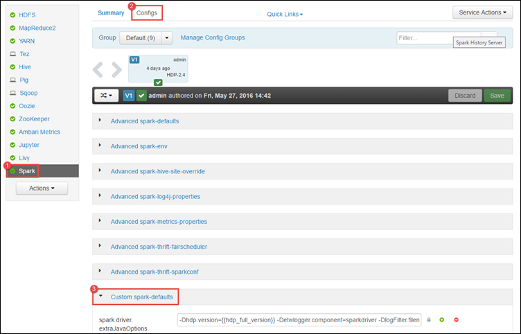
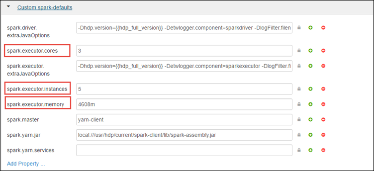
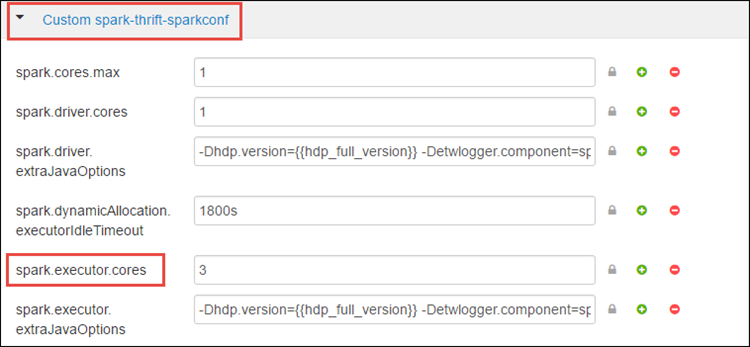

<properties 
    pageTitle="Verwenden der Ressourcenmanager Apache Spark Cluster in HDInsight Ressourcen zuordnen | Microsoft Azure" 
    description="Erfahren Sie, wie der Ressourcenmanager für für eine bessere Leistung auf HDInsight Spark Cluster verwendet werden soll." 
    services="hdinsight" 
    documentationCenter="" 
    authors="nitinme" 
    manager="jhubbard" 
    editor="cgronlun"
    tags="azure-portal"/>

<tags 
    ms.service="hdinsight" 
    ms.workload="big-data" 
    ms.tgt_pltfrm="na" 
    ms.devlang="na" 
    ms.topic="article" 
    ms.date="08/25/2016" 
    ms.author="nitinme"/>

# Verwalten von Ressourcen für den Apache Spark Cluster auf HDInsight Linux

In diesem Artikel erfahren Sie, wie Sie zugreifen auf die Schnittstellen wie Ambari UI, Benutzeroberfläche aus, und Server Verlauf Spark Spark Cluster zugeordnet sind. Sie lernen auch Informationen zum Optimieren der Cluster-Konfigurations für optimale Leistung.

**Voraussetzungen für:**

Sie müssen die folgenden:

- Ein Azure-Abonnement. Finden Sie [kostenlose Testversion Azure abrufen](https://azure.microsoft.com/documentation/videos/get-azure-free-trial-for-testing-hadoop-in-hdinsight/).
- Eine Apache Spark Cluster auf HDInsight Linux. Anweisungen finden Sie unter [Erstellen von Apache Spark Cluster in Azure HDInsight](hdinsight-apache-spark-jupyter-spark-sql.md).

## Wie werden der Web-Benutzeroberfläche Ambari gestartet?

1. Klicken Sie auf die Kachel für Ihren Cluster Spark, aus dem [Azure-Portal](https://portal.azure.com/), mithilfe der Startboard (Wenn Sie es an die Startboard angeheftet). Sie können auch navigieren Sie zu Ihren Cluster unter **Alle durchsuchen** > **HDInsight Cluster**. 
 
2. Klicken Sie aus dem Spark Cluster Blade auf **Dashboard**. Wenn Sie dazu aufgefordert werden, geben Sie für den Spark Cluster Administrator-Anmeldeberechtigungen.

    ![Ambari starten] (./media/hdinsight-apache-spark-resource-manager/hdispark.cluster.launch.dashboard.png "Ressourcenmanager starten")

3. Daraufhin sollte der Ambari Web-Benutzeroberfläche gestartet, wie unten dargestellt.

    ![Ambari Web-Benutzeroberfläche] (./media/hdinsight-apache-spark-resource-manager/ambari-web-ui.png "Ambari Web-Benutzeroberfläche")   

## Wie werden die Spark Verlauf Server gestartet?

1. Klicken Sie auf die Kachel für Ihren Cluster Spark, aus dem [Azure-Portal](https://portal.azure.com/), mithilfe der Startboard (Wenn Sie es an die Startboard angeheftet).

2. Klicken Sie unter **Quicklinks**, aus dem Blade Cluster auf **Cluster Dashboard**. Klicken Sie in das Blade **Cluster Dashboard** **Spark Verlauf Server**aus.

    ![Spark Verlauf Server] (./media/hdinsight-apache-spark-resource-manager/launch-history-server.png "Spark Verlauf Server")

    Wenn Sie dazu aufgefordert werden, geben Sie für den Spark Cluster Administrator-Anmeldeberechtigungen.

## Wie starten Sie die Benutzeroberfläche aus?

Die Benutzeroberfläche aus können Sie Applikationen überwachen, die aktuell im Spark Cluster ausgeführt werden. 

1. Klicken Sie auf **Cluster Dashboard**aus dem Blade Cluster, und klicken Sie dann auf **aus**.

    

    >[AZURE.TIP] Alternativ können Sie auch die Benutzeroberfläche aus finden Sie in der Ambari UI starten. Zum Starten der UI Ambari aus dem Cluster Blade, klicken Sie auf **Cluster Dashboard**, und klicken Sie dann auf **HDInsight Cluster Dashboard**. Klicken Sie aus der Ambari UI auf **aus**, klicken Sie auf **Quicklinks**, klicken Sie auf der aktiven Ressourcenmanager und klicken Sie dann auf **Ressourcen-Manager-Benutzeroberfläche**.

## Was ist der optimale Cluster-Konfiguration Spark Applikationen ausführen?

Sind die drei wichtigsten Parameter, die für Spark Konfiguration je nach Anwendung Anforderungen verwendet werden können `spark.executor.instances`, `spark.executor.cores`, und `spark.executor.memory`. Ein Executor umfasst für eine Spark-Anwendung gestartet wird. Klicken Sie auf den Knoten Worker ausgeführt und zum Ausführen der Aufgaben für die Anwendung verantwortlich ist. Die Standardanzahl von Executors und die Executor Größen für jeden Cluster wird die Anzahl der Worker Knoten und die Größe der Worker Knoten basierend berechnet. Diese befinden sich am `spark-defaults.conf` auf die am Cluster-Knoten. 

Die der drei Konfigurationsparameter konfiguriert werden können, auf der Clusterebene (für alle Programme, die auf dem Cluster ausgeführt werden) oder für jede einzelne Anwendung ebenfalls angegeben werden.

### Ändern der Parameter mit Ambari UI

1. Die Ambari UI **Spark**auf, klicken Sie auf **Konfigurationen**und erweitern Sie dann auf **benutzerdefinierte Spark-Standardeinstellungen**.

    

2. Die angezeigten Werte sind gute 4 Spark Applikationen gleichzeitig auf dem Cluster ausgeführt haben. Sie können Änderungen diese Werte aus der Benutzeroberfläche, wie unten dargestellt.

    

3. Klicken Sie auf **Speichern** , um die Konfiguration Änderungen zu speichern. Am oberen Rand der Seite werden Sie aufgefordert, alle betroffenen Dienste neu zu starten. Klicken Sie auf **neu starten**.

    

### Ändern Sie die Parameter für eine Anwendung mit Jupyter Notizbuch

Für Applikationen im Notizbuch Jupyter ausführen, können Sie die `%%configure` magische, um die Konfiguration Änderungen vorzunehmen. Idealerweise müssen Sie diese Änderungen am Anfang der Anwendung, bevor Sie die erste Zelle der Code ausführen. Dadurch wird sichergestellt, dass die Konfiguration der Sitzung Livius übernommen wird bei seiner Erstellung erhält. Wenn Sie die Konfiguration zu einem späteren Zeitpunkt in der Anwendung ändern möchten, müssen Sie verwenden die `-f` Parameter. Jedoch von ausführen, damit alle höchstwahrscheinlich in der Anwendung verloren.

Der folgenden Codeausschnitt wird gezeigt, wie zum Ändern der Konfiguration für eine Anwendung in Jupyter ausgeführt wird.

    %%configure 
    {"executorMemory": "3072M", "executorCores": 4, “numExecutors”:10}

Konfigurationsparameter müssen als eine JSON-Zeichenfolge übergeben werden und in der nächsten Zeile nach der magische werden müssen, wie in der Beispielspalte dargestellt. 

### Änderung, die die Parameter für eine Anwendung über eingereicht Spark senden

Folgen Befehl ist ein Beispiel für die Konfigurationsparameter für eine Anwendung Stapel ändern, die mithilfe gesendet wird `spark-submit`.

    spark-submit --class <the application class to execute> --executor-memory 3072M --executor-cores 4 –-num-executors 10 <location of application jar file> <application parameters>

### Ändern Sie die Parameter für einen Antrag cURL

Folgenden Befehl ist ein Beispiel für die Konfigurationsparameter für eine Anwendung Stapel ändern, die mithilfe von mit cURL gesendet wird.

    curl -k -v -H 'Content-Type: application/json' -X POST -d '{"file":"<location of application jar file>", "className":"<the application class to execute>", "args":[<application parameters>], "numExecutors":10, "executorMemory":"2G", "executorCores":5' localhost:8998/batches

### Wie ändere ich diese Parameter auf einem Spark Thrift Server?

Spark Thrift Server bietet JDBC/ODBC-Zugriff auf einen Cluster Spark und wird verwendet, um den Dienst Spark SQL-Abfragen. Tools wie Tableaus usw. Power BI. Verwenden Sie ODBC-Protokoll zur Kommunikation mit Spark Thrift Server Spark SQL-Abfragen als Spark Anwendung ausführen. Wenn ein Spark Cluster erstellt wurde, werden zwei Instanzen des Servers Thrift Spark gestartet, auf jedem am Knoten. Jede Spark Thrift Server wird als eine Anwendung Spark in der Benutzeroberfläche aus angezeigt. 

Spark Thrift Server verwendet Spark dynamische Executor Zuteilung und somit die `spark.executor.instances` wird nicht verwendet. Stattdessen Spark Thrift Server verwendet `spark.dynamicAllocation.minExecutors` und `spark.dynamicAllocation.maxExecutors` die Anzahl der Executor angeben. Die Konfigurationsparameter `spark.executor.cores` und `spark.executor.memory` wird verwendet, um die Größe der Executor ändern. Sie können diese Parameter ändern, wie unten dargestellt.

* Erweitern Sie die Kategorie **Erweitert Spark-Thrift-Sparkconf** , um die Parameter zu aktualisieren `spark.dynamicAllocation.minExecutors`, `spark.dynamicAllocation.maxExecutors`, und `spark.executor.memory`.

     

* Erweitern Sie die Kategorie **benutzerdefinierte Spark-Thrift-Sparkconf** , um den Parameter zu aktualisieren `spark.executor.cores`.

    

### Wie kann ich den Treiber Arbeitsspeicher des Servers Thrift Spark ändern?

Spark Thrift Server-Treiber Arbeitsspeicher ist so konfiguriert, dass 25 % der Größe am Knoten RAM, vorausgesetzt, dass die Gesamtgröße der RAM des am Knotens größer als 14GB ist. Die Ambari UI können Sie die Treiber Arbeitsspeicher-Konfiguration ändern, wie unten dargestellt.

* Die Ambari UI **Spark**klicken Sie auf, klicken Sie auf **Konfigurationen**, **Erweiterte Spark-Env**erweitern und dann den Wert für **Spark_thrift_cmd_opts**bereitstellen.

    

## Ich kann nicht BI mit Spark Cluster verwenden. Wie nehme ich die Ressourcen wieder?

Da wir Spark dynamischen Zuteilung verwenden, sind die nur Ressourcen, die vom Server Thrift verbraucht werden die Ressourcen für die Anwendung zwei Master-Shapes. Um diese Ressourcen freizugeben, müssen Sie die Thrift Server-Dienste, die im Cluster ausgeführten beenden.

1. Klicken Sie auf die UI Ambari aus im linken Bereich auf **Spark**.

2. Klicken Sie auf der nächsten Seite auf **Spark Thrift-Servern**.

    

3. Es sollte die zwei Headnodes angezeigt, auf denen Server Thrift Spark ausgeführt wird. Klicken Sie auf eine der Headnodes.

    

4. Die nächste Seite listet alle Dienste für die Headnode ausgeführt. Klicken Sie auf die Dropdown-Schaltfläche neben Spark Thrift Server aus der Liste aus, und klicken Sie dann auf **Beenden**.

    

5. Wiederholen Sie diese Schritte auf die anderen Headnode ebenfalls an.

## Meine Jupyter Notizbücher werden nicht wie erwartet ausgeführt. Wie kann ich den Dienst neu starten?

1. Starten der Ambari Web-Benutzeroberfläche an, wie oben gezeigt. Klicken Sie im linken Navigationsbereich **Jupyter**klicken Sie auf, klicken Sie auf **Dienst Aktionen**, und klicken Sie dann auf **Alle neu starten**. Dadurch wird den Jupyter-Dienst auf alle die Headnodes gestartet.

    ![Starten Sie erneut Jupyter] (./media/hdinsight-apache-spark-resource-manager/restart-jupyter.png "Starten Sie erneut Jupyter")

    

## Siehe auch

* [Übersicht: Apache Spark auf Azure HDInsight](hdinsight-apache-spark-overview.md)

### Szenarien

* [Spark mit BI: Ausführen interaktiven Datenanalyse mithilfe von Spark in HDInsight mit BI-Tools](hdinsight-apache-spark-use-bi-tools.md)

* [Spark mit maschinellen Schulung: Verwenden Sie Spark in HDInsight zum Analysieren von Gebäude Temperatur HKL-Daten verwenden](hdinsight-apache-spark-ipython-notebook-machine-learning.md)

* [Spark mit maschinellen Schulung: verwenden Spark in HDInsight Lebensmittel Prüfungsergebnissen Vorhersagen](hdinsight-apache-spark-machine-learning-mllib-ipython.md)

* [Spark Streaming: Verwenden Sie Spark in HDInsight zum Erstellen von in Echtzeit streaming Clientanwendungen](hdinsight-apache-spark-eventhub-streaming.md)

* [Website-Protokoll-Datenanalyse mithilfe von Spark in HDInsight](hdinsight-apache-spark-custom-library-website-log-analysis.md)

### Erstellen und Ausführen von applications

* [Erstellen Sie eine eigenständige Anwendung Scala](hdinsight-apache-spark-create-standalone-application.md)

* [Führen Sie Aufträge Remote auf einem Spark Cluster Livius verwenden](hdinsight-apache-spark-livy-rest-interface.md)

### Tools und Erweiterungen

* [Verwenden Sie zum Erstellen und übermitteln Spark Scala Applikationen HDInsight Tools-Plug-In für IntelliJ IDEE](hdinsight-apache-spark-intellij-tool-plugin.md)

* [Verwenden von HDInsight Tools-Plug-In für IntelliJ IDEE Spark Applikationen Remote-Debuggen](hdinsight-apache-spark-intellij-tool-plugin-debug-jobs-remotely.md)

* [Verwenden von Zeppelin Notizbücher mit einem Spark Cluster auf HDInsight](hdinsight-apache-spark-use-zeppelin-notebook.md)

* [Kernels für Jupyter-Notizbuch in Spark Cluster für HDInsight verfügbar](hdinsight-apache-spark-jupyter-notebook-kernels.md)

* [Verwenden von externen Paketen mit Jupyter-Notizbüchern](hdinsight-apache-spark-jupyter-notebook-use-external-packages.md)

* [Jupyter auf Ihrem Computer installieren und Verbinden mit einem HDInsight Spark cluster](hdinsight-apache-spark-jupyter-notebook-install-locally.md)

### Verwalten von Ressourcen

* [Verfolgen und Debuggen Aufträge in einem Apache Spark Cluster in HDInsight](hdinsight-apache-spark-job-debugging.md)

[hdinsight-versions]: hdinsight-component-versioning.md
[hdinsight-upload-data]: hdinsight-upload-data.md
[hdinsight-storage]: hdinsight-hadoop-use-blob-storage.md

[azure-purchase-options]: http://azure.microsoft.com/pricing/purchase-options/
[azure-member-offers]: http://azure.microsoft.com/pricing/member-offers/
[azure-free-trial]: http://azure.microsoft.com/pricing/free-trial/
[azure-management-portal]: https://manage.windowsazure.com/
[azure-create-storageaccount]: storage-create-storage-account.md 
