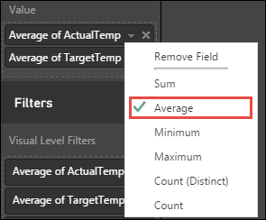

<properties 
    pageTitle="Verwenden von BI-Tools mit Apache Spark auf HDInsight | Microsoft Azure" 
    description="Eine schrittweise Anleitung zum Verwenden von Notizbüchern mit Apache Spark Schemas auf unformatierten Daten erstellt Struktur Tabellen speichern, und verwenden Sie dann BI-Tools auf die strukturtabelle für Daten analytics" 
    services="hdinsight" 
    documentationCenter="" 
    authors="nitinme" 
    manager="jhubbard" 
    editor="cgronlun"
    tags="azure-portal"/>

<tags 
    ms.service="hdinsight" 
    ms.workload="big-data" 
    ms.tgt_pltfrm="na" 
    ms.devlang="na" 
    ms.topic="article" 
    ms.date="10/05/2016" 
    ms.author="nitinme"/>

# Verwenden von BI-Tools mit Apache Spark Cluster auf HDInsight Linux

Erfahren Sie, wie Apache Spark in Azure HDInsight verwenden, um eine der folgenden Aktionen ausführen:

* Nehmen Sie unformatierten Beispieldaten und eine strukturtabelle speichern
* Verwenden von BI-Tools, wie Power BI und Tableaus zum Analysieren und Visualisieren von Daten.

> [AZURE.NOTE] In diesem Lernprogramm steht nur für Spark 1.5.2 Cluster in Azure HDInsight erstellt.

In diesem Lernprogramm steht auch als Jupyter Notizbuch auf einer Cluster Spark (Linux), den Sie in HDInsight zu erstellen. Die Notizbuch-Oberfläche können Sie die Python Codeausschnitte aus dem Notizbuch selbst ausführen. Wenn Sie das Lernprogramm aus in einem Notizbuch ausführen zu können, erstellen Sie einen Cluster Spark, starten Sie ein Notizbuch Jupyter (`https://CLUSTERNAME.azurehdinsight.net/jupyter`), und führen Sie dann das Notizbuch **verwenden BI-Tools mit Apache Spark auf HDInsight.ipynb** unter dem Ordner **Python** .

**Voraussetzungen für:**

Sie müssen die folgenden:

- Ein Azure-Abonnement. Finden Sie [kostenlose Testversion Azure abrufen](https://azure.microsoft.com/documentation/videos/get-azure-free-trial-for-testing-hadoop-in-hdinsight/).
- Eine Apache Spark Cluster auf HDInsight Linux. Anweisungen finden Sie unter [Erstellen von Apache Spark Cluster in Azure HDInsight](hdinsight-apache-spark-jupyter-spark-sql.md).
- Computer mit Microsoft Spark ODBC-Treiber installiert (für Spark auf HDInsight für die Arbeit mit Tableaus erforderlich). Sie können den Treiber von [hier](http://go.microsoft.com/fwlink/?LinkId=616229)installieren.
- BI-Tools wie [Power BI](http://www.powerbi.com/) oder [Tableaus Desktop](http://www.tableau.com/products/desktop). Sie können ein Abonnement kostenlose Vorschau von Power BI aus [http://www.powerbi.com/](http://www.powerbi.com/)erhalten.

##Speichern von unformatierten Daten als strukturtabelle

In diesem Abschnitt verwenden wir das [Jupyter](https://jupyter.org) Notizbuch eine Apache Spark Cluster in HDInsight zugeordnet Auftrag ausführen, die Ihre unformatierten Beispieldaten zu verarbeiten und speichern Sie es als eine strukturtabelle aus. Die Beispieldaten ist eine CSV-Datei (hvac.csv) verfügbar auf alle Cluster standardmäßig an.

Nachdem die Daten als strukturtabelle gespeichert wurde, wird im nächsten Abschnitt wir die strukturtabelle mit BI-Tools, wie Power BI und Tableaus Verbindung.

1. Klicken Sie auf die Kachel für Ihren Cluster Spark, aus dem [Azure-Portal](https://portal.azure.com/), mithilfe der Startboard (Wenn Sie es an die Startboard angeheftet). Sie können auch navigieren Sie zu Ihren Cluster unter **Alle durchsuchen** > **HDInsight Cluster**.   

2. Klicken Sie aus dem Spark Cluster Blade auf **Cluster Dashboard**, und klicken Sie dann auf **Jupyter Notizbuch**. Wenn Sie dazu aufgefordert werden, geben Sie die Administrator-Anmeldeberechtigungen für den Cluster aus.

    > [AZURE.NOTE] Sie möglicherweise auch das Notizbuch Jupyter für Ihren Cluster erreichen, indem Sie den folgenden URL in Ihrem Browser öffnen. Ersetzen Sie __CLUSTERNAME__ mit dem Namen der Cluster aus:
    >
    > `https://CLUSTERNAME.azurehdinsight.net/jupyter`

2. Erstellen eines neuen Notizbuchs an. Klicken Sie auf **neu**, und klicken Sie dann auf **PySpark**.

    ![Erstellen eines neuen Jupyter Notizbuchs] (./media/hdinsight-apache-spark-use-bi-tools/hdispark.note.jupyter.createnotebook.png "Erstellen eines neuen Jupyter Notizbuchs")

3. Ein neues Notizbuch erstellt und mit dem Namen Untitled.pynb geöffnet. Klicken Sie auf den Notizbuchnamen oben, und geben Sie einen Anzeigenamen ein.

    ![Bereitstellen einen Namen für das Notizbuch] (./media/hdinsight-apache-spark-use-bi-tools/hdispark.note.jupyter.notebook.name.png "Bereitstellen einen Namen für das Notizbuch")

4. Da Sie ein Notizbuch, mit dem die PySpark Kernel erstellt haben, müssen Sie keine Kontexte explizit zu erstellen. Die Kontexte Spark und Struktur werden automatisch für Sie erstellt werden, wenn Sie die erste Zelle der Code ausführen. Sie können beginnen, durch Importieren der Datentypen für dieses Szenario erforderlich ist. Dazu platzieren Sie den Cursor in die Zelle, und drücken Sie **UMSCHALT + EINGABETASTE**.

        from pyspark.sql import *
        
    
5. Laden Sie Beispieldaten in eine temporäre Tabelle ein. Wenn Sie einen Cluster Spark in HDInsight erstellen, wird die Daten Beispieldatei **hvac.csv**, auf das zugehörige Speicher-Konto unter **\HdiSamples\HdiSamples\SensorSampleData\hvac**kopiert.

    Fügen Sie den folgenden Codeausschnitt, in eine leere Zelle und drücken Sie **UMSCHALT + EINGABETASTE**. Dieser Ausschnitt registriert die Daten in eine strukturtabelle **HKL-System**bezeichnet.

        # Create an RDD from sample data
        hvacText = sc.textFile("wasbs:///HdiSamples/HdiSamples/SensorSampleData/hvac/HVAC.csv")
        
        # Create a schema for our data
        Entry = Row('Date', 'Time', 'TargetTemp', 'ActualTemp', 'BuildingID')
        
        # Parse the data and create a schema
        hvacParts = hvacText.map(lambda s: s.split(',')).filter(lambda s: s[0] != 'Date')
        hvac = hvacParts.map(lambda p: Entry(str(p[0]), str(p[1]), int(p[2]), int(p[3]), int(p[6])))
        
        # Infer the schema and create a table       
        hvacTable = sqlContext.createDataFrame(hvac)
        hvacTable.registerTempTable('hvactemptable')
        dfw = DataFrameWriter(hvacTable)
        dfw.saveAsTable('hvac')

5. Stellen Sie sicher, dass die Tabelle erfolgreich erstellt wurde. Sie können die `%%sql` magische auszuführenden Struktur direkt in Abfragen. Weitere Informationen zu den `%%sql` magische sowie andere zur Verfügung, mit dem Kernel PySpark Magics finden Sie unter [Kerneln Jupyter Notizbücher mit Spark HDInsight Cluster zur Verfügung](hdinsight-apache-spark-jupyter-notebook-kernels.md#why-should-i-use-the-new-kernels).

        %%sql
        SHOW TABLES

    Sie sehen eine Ausgabe wie folgt aus:

        +-----------+---------------+
        |isTemporary|tableName      | 
        +-----------+---------------+
        |       true|hvactemptable  |
        |      false|hivesampletable|
        |      false|hvac           |
        +-----------+---------------+

    Nur die Tabellen, die unter der Spalte **IsTemporary** falsch enthalten sind die Struktur von Tabellen, die die Metastore gespeichert werden soll, und BI-Tools zugegriffen werden können. In diesem Lernprogramm wird der **HKL** -Tabelle verbinden, die wir gerade erstellt haben.

6. Stellen Sie sicher, dass die Tabelle die gewünschten Daten enthält. Kopieren Sie in eine leere Zelle im Notizbuch den folgenden Codeausschnitt, und drücken Sie **UMSCHALT + EINGABETASTE**.

        %%sql
        SELECT * FROM hvac LIMIT 10
    
7. Sie können jetzt war(en) das Notizbuch, um die Ressourcen freizugeben. Klicken Sie dazu im Menü **Datei** auf dem Notizbuch, auf **Schließen und Anhalten**. Diese wird geschlossen und schließen Sie das Notizbuch.

##Verwenden von Power BI zum Analysieren der Daten in der Tabelle Struktur

Nachdem Sie die Daten als strukturtabelle gespeichert haben, können Sie Power BI eine Verbindung mit den Daten und Visualisieren von darauf, um Berichte, Dashboards usw. erstellen.

1. Melden Sie sich bei [Power BI](http://www.powerbi.com/).

2. Klicken Sie auf dem Bildschirm Willkommen auf **Datenbanken und vieles mehr**.

    ![Abrufen von Daten in Power BI] (./media/hdinsight-apache-spark-use-bi-tools/hdispark.powerbi.get.data.png "Abrufen von Daten in Power BI")

3. Klicken Sie auf dem nächsten Bildschirm **Spark auf Azure HDInsight** klicken Sie auf, und klicken Sie dann auf **Verbinden**. Wenn Sie dazu aufgefordert werden, geben Sie die Cluster-URL (`mysparkcluster.azurehdinsight.net`) und die Anmeldeinformationen für die Verbindung mit dem Cluster.

    Nachdem die Verbindung hergestellt wurde, wird Power BI gestartet, Importieren von Daten aus dem Cluster Spark auf HDInsight.

5. Power BI importiert die Daten und fügt ein neues Spark Dataset unter der Überschrift **Datasets** hinzu. Klicken Sie auf den Datensatz ein, um ein neues Arbeitsblatt zum Darstellen der Daten zu öffnen. Sie können auch das Arbeitsblatt als Bericht speichern. Klicken Sie zum Speichern eines Arbeitsblatts, im Menü **Datei** auf **Speichern**.

    ![Spark Kachel auf Power BI-dashboard] (./media/hdinsight-apache-spark-use-bi-tools/hdispark.powerbi.tile.png "Spark Kachel auf Power BI-dashboard")

6. Beachten Sie, dass die Liste **Felder** auf der rechten Seite die **HKL** -Tabelle enthält, die Sie zuvor erstellt haben. Erweitern Sie die Tabelle um die Felder in der Tabelle angezeigt werden, wie Sie im Notizbuch zuvor definiert sind.

      ![Struktur der Liste Tabellen] (./media/hdinsight-apache-spark-use-bi-tools/hdispark.powerbi.display.tables.png "Struktur der Liste Tabellen")

7. Erstellen Sie eine Visualisierung, um die Varianz zwischen Ziel Temperatur und tatsächlichen Temperatur für jedes Gebäude anzuzeigen. Wählen Sie zum Darstellen Ihrer Daten **Flächendiagramm** (Siehe rote Feld) aus. Zum Definieren von der Achse, ziehen und Ablegen des Felds **BuildingID** unter **Achse**und **ActualTemp**/**TargetTemp** Felder unter **Wert**.

    ![Erstellen von Visualisierungen] (./media/hdinsight-apache-spark-use-bi-tools/hdispark.powerbi.visual1.png "Erstellen von Visualisierungen")

8. Standardmäßig wird die Visualisierung die Summe für **ActualTemp** und **TargetTemp**. Für beide die Felder aus der Dropdownliste wählen Sie **Mittelwert** ein Mittelwert der tatsächlichen und Ziel Temperaturen für beide Gebäude abrufen.

    
    
9. Visualisierung von Daten sollte ähnlich wie der folgende aus. Bewegen Sie den Cursor über der Visualisierung QuickInfos mit relevanten Daten abgerufen.

    

10. Klicken Sie im oberen Menü auf **Speichern** , und geben Sie einen Bericht an. Sie können auch das visuelle anheften. Wenn Sie eine Visualisierung anheften, wird es auf dem Dashboard gespeichert, sodass Sie den letzten Wert auf einen Blick verfolgen können. 

    Sie können beliebig viele Visualisierungen, wie Sie für das gleiche Dataset und sie dem Dashboard für eine Momentaufnahme der Daten fixieren hinzufügen. Darüber hinaus Spark Cluster auf HDInsight mit direkte mit Power BI verbunden sind verbinden. Dies bedeutet, dass Power BI immer die aktuellste aus Ihrem Cluster, sodass Sie nicht aktualisiert, für das Dataset planen müssen.

##Verwenden Sie zum Analysieren der Daten in der Tabelle Struktur Tableaus Desktop
    
1. Starten Sie Tableaus Desktop. Klicken Sie im linken Bereich, in der Liste der Server für die Verbindung zu **Spark SQL**auf. Spark SQL standardmäßig im linken Bereich nicht aufgeführt ist, finden Sie es durch Klicken Sie auf **Weitere Server**. 

2. Klicken Sie im Dialogfeld Verbindung Spark SQL geben Sie die Werte aus, wie unten dargestellt, und klicken Sie dann auf **OK**.

    ![Verbinden mit einem Spark cluster] (./media/hdinsight-apache-spark-use-bi-tools/hdispark.tableau.connect.png "Verbinden mit einem Spark cluster")

    Die Authentifizierung Dropdownlisten **Microsoft Azure HDInsight Dienst** als Option, nur, wenn Sie den [Microsoft Spark ODBC-Treiber](http://go.microsoft.com/fwlink/?LinkId=616229) auf dem Computer installiert.

3. Klicken Sie auf dem nächsten Bildschirm, aus der Dropdownliste **Schema** klicken Sie auf das Symbol **Suchen** , und klicken Sie dann auf **Standard**.

    ![Suchen nach schema] (./media/hdinsight-apache-spark-use-bi-tools/hdispark.tableau.find.schema.png "Suchen nach schema")

4. Klicken Sie auf das Symbol **Suchen** erneut aus, um alle verfügbaren im Cluster Struktur Tabellen aufzulisten, für das Feld **Tabelle** . **HKL** -Tabelle, die Sie zuvor mit dem Notizbuch erstellt haben, sollte angezeigt werden.

    ![Suchen von Tabellen] (./media/hdinsight-apache-spark-use-bi-tools/hdispark.tableau.find.table.png "Suchen von Tabellen")

5. Drag & drop der Tabelle in das obere Feld auf der rechten Seite. Tableaus importiert die Daten und zeigt das Schema als hervorgehobenen im roten Kästchen an.

    ![Hinzufügen von Tabellen nach Tableaus] (./media/hdinsight-apache-spark-use-bi-tools/hdispark.tableau.drag.table.png "Hinzufügen von Tabellen nach Tableaus")

6. Klicken Sie auf die Registerkarte **Tabelle1** unten links. Stellen Sie eine Visualisierung, die das Ziel Mittelwert und die tatsächliche Temperaturen für alle Gebäude für jedes Datum angezeigt. Ziehen Sie **Datum** und **Gebäude-ID** in **Spalten** und **tatsächlichen Temp**/**Ziel Temp** auf **Zeilen**. Wählen Sie unter **Marken**, **Bereich** mit einer kartenvisualisierung Bereich ein.

     ![Hinzufügen von Feldern für Visualisierung] (./media/hdinsight-apache-spark-use-bi-tools/hdispark.tableau.drag.fields.png "Hinzufügen von Feldern für Visualisierung")

7. Standardmäßig die Felder Temperatur angezeigt als Aggregat. Wenn Sie stattdessen die durchschnittlichen Temperaturen anzeigen möchten, können Sie aus der Dropdownliste vorgehen wie unten dargestellt.

    ![Durchschnittliche Temperatur übernehmen] (./media/hdinsight-apache-spark-use-bi-tools/hdispark.tableau.temp.avg.png "Durchschnittliche Temperatur übernehmen")

8. Sie können auch Super-eine Temperatur Karte zu erhalten eine bessere Verhalten der Unterschied zwischen Ziel- und tatsächlichen Temperaturen übereinander liegende vorgangseinschränkung. Bewegen Sie den Mauszeiger in der Ecke der Karte unteren Bereich, bis das Handle Shape ein roter Kreis hervorgehoben angezeigt. Ziehen Sie die Karte in der anderen Karte oben, und lassen Sie die Maustaste los, wenn Sie das Shape in Rot Rechteck hervorgehoben angezeigt wird.

    ![Zusammenführen von Karten] (./media/hdinsight-apache-spark-use-bi-tools/hdispark.tableau.merge.png "Zusammenführen von Karten")

     Visualisierung von Daten sollte wie folgt ändern:

    ![Visualisierung] (./media/hdinsight-apache-spark-use-bi-tools/hdispark.tableau.final.visual.png "Visualisierung")
     
9. Klicken Sie auf **Speichern** , um das Arbeitsblatt zu speichern. Sie können Dashboards erstellen, und fügen Sie eine oder mehrere Arbeitsblätter hinzu.

##Siehe auch

* [Übersicht: Apache Spark auf Azure HDInsight](hdinsight-apache-spark-overview.md)

### Szenarien

* [Spark mit maschinellen Schulung: Verwenden Sie Spark in HDInsight zum Analysieren von Gebäude Temperatur HKL-Daten verwenden](hdinsight-apache-spark-ipython-notebook-machine-learning.md)

* [Spark mit maschinellen Schulung: verwenden Spark in HDInsight Lebensmittel Prüfungsergebnissen Vorhersagen](hdinsight-apache-spark-machine-learning-mllib-ipython.md)

* [Spark Streaming: Verwenden Sie Spark in HDInsight zum Erstellen von in Echtzeit streaming Clientanwendungen](hdinsight-apache-spark-eventhub-streaming.md)

* [Website-Protokoll-Datenanalyse mithilfe von Spark in HDInsight](hdinsight-apache-spark-custom-library-website-log-analysis.md)

### Erstellen und Ausführen von applications

* [Erstellen Sie eine eigenständige Anwendung Scala](hdinsight-apache-spark-create-standalone-application.md)

* [Führen Sie Aufträge Remote auf einem Spark Cluster Livius verwenden](hdinsight-apache-spark-livy-rest-interface.md)

### Tools und Erweiterungen

* [Verwenden Sie zum Erstellen und übermitteln Spark Scala Applikationen HDInsight Tools-Plug-In für IntelliJ IDEE](hdinsight-apache-spark-intellij-tool-plugin.md)

* [Verwenden von HDInsight Tools-Plug-In für IntelliJ IDEE Spark Applikationen Remote-Debuggen](hdinsight-apache-spark-intellij-tool-plugin-debug-jobs-remotely.md)

* [Verwenden von Zeppelin Notizbücher mit einem Spark Cluster auf HDInsight](hdinsight-apache-spark-use-zeppelin-notebook.md)

* [Kernels für Jupyter-Notizbuch in Spark Cluster für HDInsight verfügbar](hdinsight-apache-spark-jupyter-notebook-kernels.md)

* [Verwenden von externen Paketen mit Jupyter-Notizbüchern](hdinsight-apache-spark-jupyter-notebook-use-external-packages.md)

* [Jupyter auf Ihrem Computer installieren und Verbinden mit einem HDInsight Spark cluster](hdinsight-apache-spark-jupyter-notebook-install-locally.md)

### Verwalten von Ressourcen

* [Verwalten von Ressourcen für den Apache Spark Cluster in Azure HDInsight](hdinsight-apache-spark-resource-manager.md)

* [Verfolgen und Debuggen Aufträge in einem Apache Spark Cluster in HDInsight](hdinsight-apache-spark-job-debugging.md)

[hdinsight-versions]: hdinsight-component-versioning.md
[hdinsight-upload-data]: hdinsight-upload-data.md
[hdinsight-storage]: hdinsight-hadoop-use-blob-storage.md

[azure-purchase-options]: http://azure.microsoft.com/pricing/purchase-options/
[azure-member-offers]: http://azure.microsoft.com/pricing/member-offers/
[azure-free-trial]: http://azure.microsoft.com/pricing/free-trial/
[azure-management-portal]: https://manage.windowsazure.com/
[azure-create-storageaccount]: storage-create-storage-account.md
