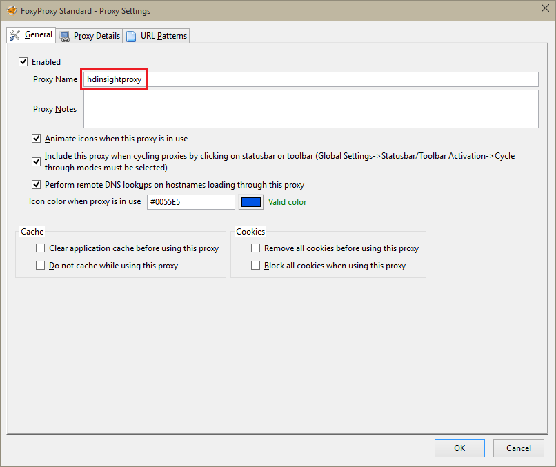

<properties 
    pageTitle="Installieren von Zeppelin Notizbücher für Apache Spark Cluster auf HDInsight Linux | Microsoft Azure" 
    description="Eine schrittweise Anleitung zum Installieren und Verwenden von Zeppelin Notizbücher mit Spark Cluster auf HDInsight Linux." 
    services="hdinsight" 
    documentationCenter="" 
    authors="nitinme" 
    manager="jhubbard" 
    editor="cgronlun"/>

<tags 
    ms.service="hdinsight" 
    ms.workload="big-data" 
    ms.tgt_pltfrm="na" 
    ms.devlang="na" 
    ms.topic="article" 
    ms.date="10/28/2016" 
    ms.author="nitinme"/>

# Installieren von Zeppelin Notizbücher für Apache Spark Cluster auf HDInsight Linux

Erfahren Sie, wie Sie Zeppelin Notizbücher auf Apache Spark Cluster installieren und wie die Zeppelin Notizbücher Spark Aufträge ausgeführt werden.

> [AZURE.IMPORTANT] Zeppelin Notizbücher sind jetzt standardmäßig mit Spark Cluster verfügbar. Sie müssen nicht explizit diese auf einem Spark Cluster nicht mehr installieren. Weitere Informationen finden Sie unter [verwenden Zeppelin Notizbücher mit Apache Spark cluster auf HDInsight Linux](hdinsight-apache-spark-zeppelin-notebook.md). 

**Voraussetzungen für:**

* Bevor Sie dieses Lernprogramm beginnen, müssen Sie ein Azure-Abonnement verfügen. Finden Sie [kostenlose Testversion Azure abrufen](https://azure.microsoft.com/documentation/videos/get-azure-free-trial-for-testing-hadoop-in-hdinsight/).
* Ein Cluster Apache Spark. Anweisungen finden Sie unter [Erstellen von Apache Spark Cluster in Azure HDInsight](hdinsight-apache-spark-jupyter-spark-sql.md).
* SSH-Client. Für die Verteilung von Linux und Unix oder Macintosh OS X die `ssh` Befehl wird mit dem Betriebssystem bereitgestellt. Für Windows empfehlen wir [kitten](http://www.chiark.greenend.org.uk/~sgtatham/putty/download.html)

    > [AZURE.NOTE] Wenn Sie mit anderen als SSH-Client verwenden möchten `ssh` oder kitten, wenden Sie sich bitte die Dokumentation für Ihren Kunden, wie Sie einen Tunnel SSH einrichten.

* Einen Webbrowser, der Verwendung eines Proxys SOCKS konfiguriert werden können

* __(optional)__: ein Plug-in, z. B. [FoxyProxy](http://getfoxyproxy.org/,) , die anwenden können von Regeln, die nur bestimmte Anfragen durch den Tunnel weiterleiten.

    > [AZURE.WARNING] Ohne ein Plug-in wie FoxyProxy können alle Besprechungsanfragen, die über den Browser vorgenommen durch den Tunnel weitergeleitet werden. Dies kann dazu führen, dass das Laden von Webseiten in Ihrem Browser.

## Installieren von Zeppelin auf einem Spark cluster

Sie können in einem Spark Cluster mithilfe der Skriptaktion Zeppelin installieren. Skript für Aktion verwendet benutzerdefinierte Skripts zur Installation von Komponenten auf dem Cluster, die nicht standardmäßig verfügbar sind. Benutzerdefinierte Skript können mithilfe von HDInsight .NET SDK oder mithilfe der PowerShell Azure Zeppelin aus dem Azure-Portal zu installieren. Das Skript können, um entweder als Teil der Clustererstellung oder nach der Cluster einsatzbereit ist Zeppelin zu installieren. Links in den folgenden Abschnitten finden Sie die Anweisungen zum hierzu. 

### Verwenden des Azure-Portals

Anweisungen zum Azure-Portal zu verwenden, um das Skriptaktion ausführen, Zeppelin zu installieren finden Sie unter [Anpassen HDInsight Cluster mithilfe der Aktion Skript](hdinsight-hadoop-customize-cluster-linux.md#use-a-script-action-from-the-azure-portal). Sie müssen ein paar Änderungen an den Anweisungen in diesem Artikel vornehmen.

* Sie müssen das Skript verwenden, um Zeppelin zu installieren. Das benutzerdefinierte Skript Zeppelin auf einem Cluster Spark auf HDInsight installiert ist unter den folgenden Links verfügbar:
    * Für Spark 1.6.0 Cluster-`https://hdiconfigactions.blob.core.windows.net/linuxincubatorzeppelinv01/install-zeppelin-spark160-v01.sh`
    * Für Spark 1.5.2 Cluster-`https://hdiconfigactions.blob.core.windows.net/linuxincubatorzeppelinv01/install-zeppelin-spark151-v01.sh`

* Sie müssen die Skriptaktion nur auf die Headnode ausführen.

* Das Skript benötigt keine Parameter. 

### HDInsight .NET SDK verwenden

Anweisungen zum HDInsight .NET SDK verwenden Sie zum Ausführen der Skriptaktion Zeppelin installieren finden Sie unter [Anpassen HDInsight Cluster mithilfe der Aktion Skript](hdinsight-hadoop-customize-cluster-linux.md#use-a-script-action-from-the-hdinsight-net-sdk). Sie müssen ein paar Änderungen an den Anweisungen in diesem Artikel vornehmen.

* Sie müssen das Skript verwenden, um Zeppelin zu installieren. Das benutzerdefinierte Skript Zeppelin auf einem Cluster Spark auf HDInsight installiert ist unter den folgenden Links verfügbar:
    * Für Spark 1.6.0 Cluster-`https://hdiconfigactions.blob.core.windows.net/linuxincubatorzeppelinv01/install-zeppelin-spark160-v01.sh`
    * Für Spark 1.5.2 Cluster-`https://hdiconfigactions.blob.core.windows.net/linuxincubatorzeppelinv01/install-zeppelin-spark151-v01.sh`

* Das Skript benötigt keine Parameter. 

* Legen Sie den Clustertyp zu erstellende auf Spark.

### Mithilfe der PowerShell Azure

Verwenden Sie den folgenden PowerShell-Codeausschnitt, um einen Cluster Spark auf HDInsight Linux mit Zeppelin installiert zu erstellen. Abhängig davon, welche Version von Spark Cluster stehen Ihnen, müssen Sie den PowerShell-Codeausschnitt unten, um die Verknüpfung zu den entsprechenden benutzerdefiniertes Skript enthalten aktualisieren. 

* Für Spark 1.6.0 Cluster-`https://hdiconfigactions.blob.core.windows.net/linuxincubatorzeppelinv01/install-zeppelin-spark160-v01.sh`
* Für Spark 1.5.2 Cluster-`https://hdiconfigactions.blob.core.windows.net/linuxincubatorzeppelinv01/install-zeppelin-spark151-v01.sh`

[AZURE.INCLUDE [upgrade-powershell](../../includes/hdinsight-use-latest-powershell.md)]

    Login-AzureRMAccount
    
    # PROVIDE VALUES FOR THE VARIABLES
    $clusterAdminUsername="admin"
    $clusterAdminPassword="<<password>>"
    $clusterSshUsername="adminssh"
    $clusterSshPassword="<<password>>"
    $clusterName="<<clustername>>"
    $clusterContainerName=$clusterName
    $resourceGroupName="<<resourceGroupName>>"
    $location="<<region>>"
    $storage1Name="<<storagename>>"
    $storage1Key="<<storagekey>>"
    $subscriptionId="<<subscriptionId>>"
    
    Select-AzureRmSubscription -SubscriptionId $subscriptionId
    
    $passwordAsSecureString=ConvertTo-SecureString $clusterAdminPassword -AsPlainText -Force
    $clusterCredential=New-Object System.Management.Automation.PSCredential ($clusterAdminUsername, $passwordAsSecureString)
    $passwordAsSecureString=ConvertTo-SecureString $clusterSshPassword -AsPlainText -Force
    $clusterSshCredential=New-Object System.Management.Automation.PSCredential ($clusterSshUsername, $passwordAsSecureString)
    
    $azureHDInsightConfigs= New-AzureRmHDInsightClusterConfig -ClusterType Spark
    $azureHDInsightConfigs.DefaultStorageAccountKey = $storage1Key
    $azureHDInsightConfigs.DefaultStorageAccountName = "$storage1Name.blob.core.windows.net"
    
    Add-AzureRMHDInsightScriptAction -Config $azureHDInsightConfigs -Name "Install Zeppelin" -NodeType HeadNode -Parameters "void" -Uri "https://hdiconfigactions.blob.core.windows.net/linuxincubatorzeppelinv01/install-zeppelin-spark151-v01.sh"
    
    New-AzureRMHDInsightCluster -Config $azureHDInsightConfigs -OSType Linux -HeadNodeSize "Standard_D12" -WorkerNodeSize "Standard_D12" -ClusterSizeInNodes 2 -Location $location -ResourceGroupName $resourceGroupName -ClusterName $clusterName -HttpCredential $clusterCredential -DefaultStorageContainer $clusterContainerName -SshCredential $clusterSshCredential -Version "3.3"
 
## Einrichten von SSH zum Zugreifen auf ein Notizbuch Zeppelin Tunnel

Sie werden SSH Tunnel verwenden, um die Zeppelin Notizbücher ausgeführt Spark Cluster unter HDInsight Linux zugreifen. So erstellen Sie einen SSH Tunnel mithilfe von ssh Befehlszeile (Linux) und kitten (Windows) führen Sie die Schritte vor.

### Erstellen Sie einen Tunnel mit dem Befehl SSH (Linux)

Verwenden Sie der folgende Befehl zum Erstellen einer SSH tunnel mithilfe der `ssh` Befehl. Ersetzen Sie __USERNAME__ mit einem Benutzer SSH für Ihren Cluster HDInsight, und Ersetzen Sie __CLUSTERNAME__ mit dem Namen der Cluster HDInsight

    ssh -C2qTnNf -D 9876 USERNAME@CLUSTERNAME-ssh.azurehdinsight.net

Dadurch wird eine Verbindung aus, die den Datenverkehr auf lokale Port 9876 Cluster über SSH weiterleiten erstellt. Die Optionen sind:

* **D 9876** - lokalen Port, die durch den Tunnel Datenverkehr weiterleiten wird.

* **C** - alle Daten komprimiert werden, da der Web-Verkehr hauptsächlich Text ist.

* **2** - Force SSH, Protocol, Version 2 nur zu testen.

* **f** - stillen Modus.

* **T** - Pseudo tty Zuteilung deaktivieren, da wir gerade einen Port weitergeleitet werden.

* **n** - verhindern, dass das Lesen eines STDIN, da wir gerade einen Port weitergeleitet werden.

* **N** - keinen remote-Befehl nicht ausführen, da wir gerade einen Port weitergeleitet werden.

* **f** - im Hintergrund ausgeführt werden.

Wenn Sie mit einem SSH Schlüssel Cluster konfiguriert haben, können Sie benötigen verwenden die `-i` Parameter, und geben Sie den Pfad für die privaten Schlüssel SSH.

Nachdem der Befehl abgeschlossen ist, den Datenverkehr an Anschluss 9876 auf dem lokalen Computer gesendeten über weitergeleitet werden, Layer SSL (Secure Sockets) mit dem Cluster Knoten leiten und angezeigt werden, um es in diesem Fenster stammen.

### Erstellen Sie einen Tunnel mit kitten (Windows)

Gehen Sie folgendermaßen vor, um eine SSH Tunnel mit kitten zu erstellen.

1. Öffnen Sie kitten, und geben Sie die Verbindungsinformationen. Wenn Sie nicht mit kitten vertraut sind, finden Sie unter [Verwenden SSH mit Linux-basierten Hadoop auf HDInsight von Windows](hdinsight-hadoop-linux-use-ssh-windows.md) Informationen zur gemeinsamen Nutzung, mit HDInsight.

2. Im Abschnitt **Kategorie** auf der linken Seite des Dialogfelds erweitern Sie **Verbindung** **SSH**, und wählen Sie dann auf **Tunnel**.

3. Geben Sie die folgenden Informationen im Formular **Optionen steuern SSH Port zum Weiterleiten** an:

    * **Quellport** : den Port auf dem Client, den Sie weiterleiten möchten. Beispielsweise **9876**.

    * **Ziel** - das SSH-Adresse für den Cluster Linux-basierten HDInsight. Beispielsweise **MeinCluster-ssh.azurehdinsight.net**.

    * **Dynamic** - ermöglicht dynamische SOCKS Proxy routing.

    

4. Klicken Sie auf **Hinzufügen** , um die Einstellungen hinzufügen, und klicken Sie dann auf **Öffnen** , um eine SSH-Verbindung zu öffnen.

5. Wenn Sie dazu aufgefordert werden, melden Sie sich auf dem Server. Dies Aufbau einer SSH-Sitzung, und aktivieren Sie den Tunnel.

### Verwenden Sie den Tunnel im Browser

> [AZURE.NOTE] Die Schritte in diesem Abschnitt verwenden den FireFox-Browser, wie es für Linux, Unix, Macintosh OS X und Windows-Betriebssysteme kostenlos verfügbar ist. Andere modernen Browsern wie Google Chrome, Microsoft Edge oder Apple Safari sollten auch zusammenarbeiten; jedoch das FoxyProxy-Plug-in einige Schritte verwendet werden möglicherweise nicht zur Verfügung für alle Browser.

1. Konfigurieren Sie den Browser, um **Localhost:9876** als **v5 SOCKS** Proxy verwenden. Hier wird das Aussehen der Firefox-Einstellungen. Wenn Sie einen anderen Anschluss als 9876 verwendet haben, ändern Sie den Port nach dem von Ihnen verwendete vorkommen:

    

    > [AZURE.NOTE] Auswählen der **Remote-DNS-** Anfragen (DNS = Domain Name System) zum Auflösen HDInsight Cluster. Wenn dies nicht ausgewählt ist, wird DNS lokal aufgelöst werden.

2. Stellen Sie sicher, dass Datenverkehr durch den Tunnel weitergeleitet wird von einer Website wie [http://www.whatismyip.com/](http://www.whatismyip.com/) mit den Proxyeinstellungen aktiviert und deaktiviert in Firefox vising. Während die Einstellungen aktiviert sind, werden die IP-Adresse für einen Computer im Microsoft Azure Datencenter.

### Browsererweiterungen

Konfigurieren den Browser, um den Tunnel verwenden arbeitet, möchten nicht Sie normalerweise gesamten Verkehr über den Tunnel weiterleiten. Browsererweiterungen wie [FoxyProxy](http://getfoxyproxy.org/) unterstützen Muster Abgleich für URL-Anfragen (FoxyProxy Standard oder nur Plus), sodass nur die Anforderung von bestimmter URLs über den Tunnel gesendet werden.

Wenn Sie FoxyProxy Standard installiert haben, gehen Sie folgendermaßen vor, um nur den Datenverkehr für HDInsight weiterleiten, über den Tunnel konfigurieren.

1. Öffnen Sie die Erweiterung FoxyProxy in Ihrem Browser ein. Wählen Sie beispielsweise in Firefox, das FoxyProxy-Symbol neben dem Adressfeld ein.

    

2. Wählen Sie **Neuen Proxy hinzufügen**, wählen Sie die Registerkarte **Allgemein** , und geben Sie einen Proxynamen von **HDInsightProxy**.

    

3. Wählen Sie die Registerkarte **Proxy-Details** , und füllen Sie die folgenden Felder aus:

    * **Host oder IP-Adresse** – Dies ist Localhost, da wir einen Tunnel SSH auf dem lokalen Computer verwenden.

    * **Port** – Dies ist der Port, die Sie für den Tunnel SSH verwendet.

    * **SOCKS-Proxy** - wählen Sie diese Option, um den Tunnel als Proxy zu verwendende Browser aktivieren aus.

    * **SOCKS v5** – wählen Sie diese Option, um die erforderliche Version für den Proxy festlegen.

    

4. Wählen Sie die Registerkarte **URL Muster** aus, und wählen Sie dann auf **Neues Muster hinzufügen**. Verwenden Sie die folgenden zum Definieren des Musters aus, und klicken Sie dann auf **OK**:

    * **Muster Namen** - **Zeppelinnotebook** – Dies ist nur einen Anzeigenamen für die Muster.

    * **URL-Muster** - **\*hn0** * – Dies definiert ein Muster aus, die den internen vollqualifizierten Domänennamen Endpunkt entspricht, in dem die Notizbücher Zeppelin gehostet werden. Da Zeppelin Notizbücher nur auf der headnode0 im Cluster stehen und der Endpunkt normalerweise lautet `http://hn0-<string>.internal.cloudapp.net`, unter Verwendung des Musters * *hn0** wird sichergestellt, dass die Anforderung an den Endpunkt Zeppelin umgeleitet wird.

        

4. Klicken Sie auf **OK** , um den Proxy hinzuzufügen und **Proxyeinstellungen**zu schließen.

5. Am oberen Rand des Dialogfelds FoxyProxy ändern Sie **Modus wählen Sie** auf **Proxys verwenden basierend auf deren vordefinierte Muster und Prioritäten**, und klicken Sie dann auf **Schließen**.

    

Nach den folgenden Schritten, werden nur die Anforderung von URLs, die die Zeichenfolge __hn0__ enthalten über den SSL-Tunnel weitergeleitet. 

## Zugriff auf das Notizbuch Zeppelin

Nachdem Sie Setup Tunnel SSH haben, können die folgenden Schritten Sie Zeppelin Notizbuch auf dem Cluster Spark zugreifen, indem Sie die nachstehenden Schritte durchführen. In diesem Abschnitt sehen Sie, wie Sql % und % Struktur Anweisungen ausgeführt.

1. Öffnen Sie im Webbrowser den folgenden Endpunkt aus:

        http://hn0-myspar:9995

    * Um eine **hn0** headnode0
    * **Myspar** ist die ersten sechs Zeichen des Namens Cluster Spark.
    * **9995** handelt es sich um den Port, in dem Notizbuch Zeppelin zugegriffen werden kann.

2. Erstellen eines neuen Notizbuchs an. Klicken Sie auf **Notizbuch**aus dem Kopfzeilenbereich, und klicken Sie dann auf **Neue Notiz erstellen**.

    ![Erstellen eines neuen Zeppelin Notizbuchs] (./media/hdinsight-apache-spark-use-zeppelin-notebook/hdispark.createnewnote.png "Erstellen eines neuen Zeppelin Notizbuchs")

    Klicken Sie auf derselben Seite, unter der Überschrift **Notizbuch** sollte ein neues Notizbuch mit dem Namen **Notiz XXXXXXXXX**angefangen angezeigt werden. Klicken Sie auf das neue Notizbuch.

3. Klicken Sie auf der Webseite für das neue Notizbuch klicken Sie auf die Überschrift, und ändern Sie den Namen des Notizbuchs, wenn Sie möchten. Drücken Sie die EINGABETASTE, um die Namensänderung zu speichern. Darüber hinaus stellen Sie sicher, dass einen **verbunden** Status in die Kopfzeile Notizbuch in der oberen rechten Ecke wird.

    ![Zeppelin Notizbuch status] (./media/hdinsight-apache-spark-use-zeppelin-notebook/hdispark.newnote.connected.png "Zeppelin Notizbuch status")

### Ausführen von SQL-Anweisungen

4. Laden Sie Beispieldaten in eine temporäre Tabelle ein. Wenn Sie einen Cluster Spark in HDInsight erstellen, wird die Daten Beispieldatei **hvac.csv**, auf das zugehörige Speicher-Konto unter **\HdiSamples\SensorSampleData\hvac**kopiert.

    Fügen Sie in den leeren Absatz, der standardmäßig in das neue Notizbuch erstellt wird den folgenden Codeausschnitt.

        // Create an RDD using the default Spark context, sc
        val hvacText = sc.textFile("wasbs:///HdiSamples/HdiSamples/SensorSampleData/hvac/HVAC.csv")
        
        // Define a schema
        case class Hvac(date: String, time: String, targettemp: Integer, actualtemp: Integer, buildingID: String)
        
        // Map the values in the .csv file to the schema
        val hvac = hvacText.map(s => s.split(",")).filter(s => s(0) != "Date").map(
            s => Hvac(s(0), 
                    s(1),
                    s(2).toInt,
                    s(3).toInt,
                    s(6)
            )
        ).toDF()
        
        // Register as a temporary table called "hvac"
        hvac.registerTempTable("hvac")
        
    Drücken Sie **UMSCHALT + EINGABETASTE** , oder klicken Sie auf **die Wiedergabeschaltfläche für den Codeausschnitt Ausführen des Absatzes** . Der Status auf der rechten Ecke des Absatzes sollte Fortschreiten sofort, Ausstehend Ausführung in beendet. Die Ausgabe wird am unteren Rand des gleichen Absatzes. Der Screenshot sieht wie folgt aus:

    ![Erstellen Sie eine temporäre Tabelle aus unformatierten Daten] (./media/hdinsight-apache-spark-use-zeppelin-notebook/hdispark.note.loaddDataintotable.png "Erstellen Sie eine temporäre Tabelle aus unformatierten Daten")

    Sie können auch einen Titel jeder Absatz bereitstellen. Klicken Sie auf das Symbol **Einstellungen** , und klicken Sie dann auf **Achsentitel anzeigen**, aus der rechten Ecke.

5. Sie können jetzt Spark SQL-Anweisungen für die Tabelle **HKL-System** ausführen. Fügen Sie die folgende Abfrage in einem neuen Absatz ein. Die Abfrage ruft die Gebäude-ID sowie die Differenz zwischen dem Ziel und den tatsächlichen Temperaturen für jedes Gebäude auf ein angegebenes Datum zurück. Drücken Sie **UMSCHALT + EINGABETASTE**.

        %sql
        select buildingID, (targettemp - actualtemp) as temp_diff, date 
        from hvac
        where date = "6/1/13" 

    Die **% Sql** -Anweisung am Anfang weist das Notizbuch mit den Interpreter Spark SQL verwenden. Sie können die definierten Interpreter auf der Registerkarte **Interpreter** in der Kopfzeile Notizbuch anzeigen.

    Das folgende Bildschirmabbild zeigt die Ausgabe an.

    ![Ausführen eine Spark SQL-Anweisung, die mit dem Notizbuch] (./media/hdinsight-apache-spark-use-zeppelin-notebook/hdispark.note.sparksqlquery1.png "Ausführen eine Spark SQL-Anweisung, die mit dem Notizbuch")

     Klicken Sie auf Anzeigeoptionen (Rechteck hervorgehoben) zum Umschalten zwischen verschiedenen Darstellungen für das gleiche Ergebnis. Klicken Sie auf **Einstellungen** , um welche stellt der Schlüssel und die Werte in der Ausgabe auszuwählen. Über das Bildschirmfoto verwendet **BuildingID** als Schlüssel und den Mittelwert der **Temp_diff** als Wert ein.

    
6. Sie können auch Spark-SQL-Anweisungen verwenden von Variablen in der Abfrage ausführen. Der nächste Ausschnitt wird gezeigt, wie Definieren einer Variablen zu speichern, **Temp**, in der Abfrage mit den möglichen Werten, dass Sie mit Abfragen möchten. Beim Ausführen der Abfrage wird automatisch eine Dropdownliste mit den Werten aufgefüllt, die Sie für die Variable angegeben haben.

        %sql
        select buildingID, date, targettemp, (targettemp - actualtemp) as temp_diff
        from hvac
        where targettemp > "${Temp = 65,65|75|85}" 

    Fügen Sie einen neuen Absatz dieser Ausschnitt, und drücken Sie **UMSCHALT + EINGABETASTE**. Das folgende Bildschirmabbild zeigt die Ausgabe an.

    ![Ausführen eine Spark SQL-Anweisung, die mit dem Notizbuch] (./media/hdinsight-apache-spark-use-zeppelin-notebook/hdispark.note.sparksqlquery2.png "Ausführen eine Spark SQL-Anweisung, die mit dem Notizbuch")

    Für spätere Abfragen können Sie wählen Sie einen neuen Wert aus der Dropdownliste aus und führen Sie die Abfrage erneut aus. Klicken Sie auf **Einstellungen** , um welche stellt der Schlüssel und die Werte in der Ausgabe auszuwählen. Die oben aufgeführten Bildschirmaufnahme verwendet **BuildingID** als Schlüssel, den Mittelwert der **Temp_diff** als Wert und **Targettemp** wie die Gruppe ein.

7. Starten den Interpreter Spark SQL zum Beenden der Anwendung erneut. Klicken Sie auf der Registerkarte **Interpreter** am oberen und für die Spark Interpreter, klicken Sie auf **neu starten**.

    ![Starten der Zeppelin intepreter] (./media/hdinsight-apache-spark-use-zeppelin-notebook/hdispark.zeppelin.restart.interpreter.png "Starten der Zeppelin intepreter")

### Führen Sie die Anweisungen Struktur

1. Klicken Sie auf die Schaltfläche **Interpreter** , aus dem Notizbuch Zeppelin.

    ![Update Struktur interpreter] (./media/hdinsight-apache-spark-use-zeppelin-notebook/zeppelin-update-hive-interpreter-1.png "Update Struktur interpreter")

2. Klicken Sie für die **Struktur** Interpreter auf **Bearbeiten**.

    ![Update Struktur interpreter] (./media/hdinsight-apache-spark-use-zeppelin-notebook/zeppelin-update-hive-interpreter-2.png "Update Struktur interpreter")

    Aktualisieren Sie die folgenden Eigenschaften.

    * **Default.password** auf das Kennwort für die angegebene für den Administratorbenutzer beim Erstellen des HDInsight Spark Clusters festgelegt.
    * Legen Sie **default.url** auf `jdbc:hive2://<spark_cluster_name>.azurehdinsight.net:443/default;ssl=true?hive.server2.transport.mode=http;hive.server2.thrift.http.path=/hive2`. Ersetzen Sie ** \<Spark_cluster_name >** mit dem Namen der Spark Cluster.
    * Legen Sie **default.user** auf den Namen des Administratorbenutzers an, die Sie beim Erstellen des Clusters angegeben haben. Beispielsweise *Admin*.

3. Wenn Sie aufgefordert werden, den Struktur Interpreter neu zu starten, klicken Sie auf **OK**, und klicken Sie auf **Speichern** .

4. Erstellen eines neuen Notizbuchs, und führen Sie die folgende Anweisung aus, um die Struktur Tabellen auf dem Cluster aufzulisten.

        %hive
        SHOW TABLES

    Ein Cluster HDInsight verfügt standardmäßig über eine Beispieltabelle **Hivesampletable** aufgerufen, damit folgende Ausgabe angezeigt werden soll.

    ![Die Ausgabe Struktur] (./media/hdinsight-apache-spark-use-zeppelin-notebook/zeppelin-update-hive-interpreter-3.png "Die Ausgabe Struktur")

5. Führen Sie die folgende Anweisung aus, um die Einträge in der Tabelle anzuzeigen.

        %hive
        SELECT * FROM hivesampletable LIMIT 5

    Sie sollten eine Ausgabe wie folgt aus.

    ![Die Ausgabe Struktur] (./media/hdinsight-apache-spark-use-zeppelin-notebook/zeppelin-update-hive-interpreter-4.png "Die Ausgabe Struktur")

## Siehe auch

* [Übersicht: Apache Spark auf Azure HDInsight](hdinsight-apache-spark-overview.md)

### Szenarien

* [Spark mit BI: Ausführen interaktiven Datenanalyse mithilfe von Spark in HDInsight mit BI-Tools](hdinsight-apache-spark-use-bi-tools.md)

* [Spark mit maschinellen Schulung: Verwenden Sie Spark in HDInsight zum Analysieren von Gebäude Temperatur HKL-Daten verwenden](hdinsight-apache-spark-ipython-notebook-machine-learning.md)

* [Spark mit maschinellen Schulung: verwenden Spark in HDInsight Lebensmittel Prüfungsergebnissen Vorhersagen](hdinsight-apache-spark-machine-learning-mllib-ipython.md)

* [Spark Streaming: Verwenden Sie Spark in HDInsight zum Erstellen von in Echtzeit streaming Clientanwendungen](hdinsight-apache-spark-eventhub-streaming.md)

* [Website-Protokoll-Datenanalyse mithilfe von Spark in HDInsight](hdinsight-apache-spark-custom-library-website-log-analysis.md)

### Erstellen und Ausführen von applications

* [Erstellen Sie eine eigenständige Anwendung Scala](hdinsight-apache-spark-create-standalone-application.md)

* [Führen Sie Aufträge Remote auf einem Spark Cluster Livius verwenden](hdinsight-apache-spark-livy-rest-interface.md)

### Tools und Erweiterungen

* [Verwenden Sie zum Erstellen und übermitteln Spark Scala Applikationen HDInsight Tools-Plug-In für IntelliJ IDEE](hdinsight-apache-spark-intellij-tool-plugin.md)

* [Verwenden von HDInsight Tools-Plug-In für IntelliJ IDEE Spark Applikationen Remote-Debuggen](hdinsight-apache-spark-intellij-tool-plugin-debug-jobs-remotely.md)

* [Kernels für Jupyter-Notizbuch in Spark Cluster für HDInsight verfügbar](hdinsight-apache-spark-jupyter-notebook-kernels.md)

* [Verwenden von externen Paketen mit Jupyter-Notizbüchern](hdinsight-apache-spark-jupyter-notebook-use-external-packages.md)

* [Jupyter auf Ihrem Computer installieren und Verbinden mit einem HDInsight Spark cluster](hdinsight-apache-spark-jupyter-notebook-install-locally.md)

### Verwalten von Ressourcen

* [Verwalten von Ressourcen für den Apache Spark Cluster in Azure HDInsight](hdinsight-apache-spark-resource-manager.md)

* [Verfolgen und Debuggen Aufträge in einem Apache Spark Cluster in HDInsight](hdinsight-apache-spark-job-debugging.md)

[hdinsight-versions]: hdinsight-component-versioning.md
[hdinsight-upload-data]: hdinsight-upload-data.md
[hdinsight-storage]: hdinsight-hadoop-use-blob-storage.md

[azure-purchase-options]: http://azure.microsoft.com/pricing/purchase-options/
[azure-member-offers]: http://azure.microsoft.com/pricing/member-offers/
[azure-free-trial]: http://azure.microsoft.com/pricing/free-trial/
[azure-management-portal]: https://manage.windowsazure.com/
[azure-create-storageaccount]: storage-create-storage-account.md 

