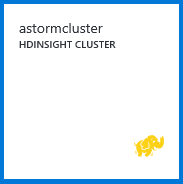
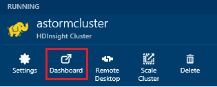
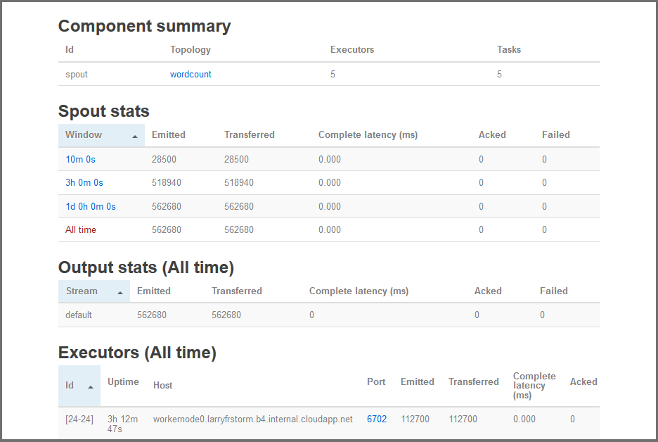

<properties
    pageTitle="Apache Storm Lernprogramm: Erste Schritte mit Storm | Microsoft Azure"
    description="Erste Schritte mit big Data Analytics Apache Storm und in den Beispielen Storm Starter auf HDInsight verwenden. Informationen Sie zum Verwenden von Storm zum Verarbeiten von Daten in Echtzeit."
    keywords="Apache Storm, Apache Storm Lernprogramm, big Data Analytics Storm starter"
    services="hdinsight"
    documentationCenter=""
    authors="Blackmist"
    manager="jhubbard"
    editor="cgronlun"
    tags="azure-portal"/>

<tags
   ms.service="hdinsight"
   ms.devlang="java"
   ms.topic="article"
   ms.tgt_pltfrm="na"
   ms.workload="big-data"
   ms.date="09/07/2016"
   ms.author="larryfr"/>

# Apache Storm Lernprogramm: Erste Schritte mit der Storm Starter Beispiele für big Data Analytics auf HDInsight

Apache Storm ist eine skalierbare, Fehlertoleranz, verteilt, in Echtzeit Berechnung System für die Verarbeitung von Daten Streams. Mit Storm auf Microsoft Azure HDInsight können Sie einen cloudbasierten Storm Cluster erstellen, der big Data Analytics in Echtzeit ausführt. 

> [AZURE.NOTE] Die Schritte in diesem Artikel erstellen Sie einen Windows-basierten HDInsight Cluster. Schritte zum Erstellen eines Sturms Linux-basierten HDInsight Cluster, finden Sie unter [Apache Storm Lernprogramm: Erste Schritte mit der Storm Starter Stichprobe mit Daten Analytics auf HDInsight](hdinsight-apache-storm-tutorial-get-started-linux.md)

## Erforderliche Komponenten

[AZURE.INCLUDE [delete-cluster-warning](../../includes/hdinsight-delete-cluster-warning.md)]

Sie müssen dieses Lernprogramm Apache Storm erfolgreich abgeschlossen mit die folgenden:

- **Ein Azure-Abonnement**. Finden Sie [kostenlose Testversion Azure abrufen](https://azure.microsoft.com/documentation/videos/get-azure-free-trial-for-testing-hadoop-in-hdinsight/).

### Anforderungen für Access-Steuerelement

[AZURE.INCLUDE [access-control](../../includes/hdinsight-access-control-requirements.md)]

## Erstellen Sie einen Cluster Storm

Storm auf HDInsight verwendet Azure Blob-Speicher zum Speichern von Protokolldateien und Topologien zum Cluster übermittelt. Gehen Sie folgendermaßen vor, um ein Konto Azure-Speicher für die Verwendung mit Ihren Cluster zu erstellen:

1. Melden Sie sich bei der [Azure-Portal][preview-portal].

2. Wählen Sie **neu**, wählen Sie __Daten Analytics__aus, und wählen Sie dann auf __HDInsight__.

    

3. Geben Sie einen __Clusternamen__aus. Ein grünes Häkchen neben den __Namen der Cluster__ aus, sofern verfügbar.

4. Wenn Sie mehr als ein Abonnement besitzen, wählen Sie den Eintrag __Abonnement__ Azure-Abonnement auswählen, das für den Cluster verwendet werden.

5.  Verwenden Sie __Clustertyp auswählen__ , um einen Cluster __Storm__ ausgewählt haben. Wählen Sie für das __Betriebssystem__Windows ein. Wählen Sie für __Cluster Ebene__STANDARD aus. Verwenden Sie schließlich die Schaltfläche auswählen, um diese Einstellungen zu speichern.

    

5. Für __Ressourcengruppe__können Sie uns die Dropdown-Liste, um eine Liste der vorhandenen Ressourcengruppen finden Sie unter, und wählen Sie dann die Optionen, um den Cluster in zu erstellen. Oder wählen Sie __neu__ und geben Sie den Namen der neuen Ressourcengruppe. Ein grünes Häkchen angezeigt wird, um anzugeben, ob Sie der neuen Gruppennamen ein verfügbar ist.

6. Wählen Sie __Berechtigungen__aus, und geben Sie eine __Cluster-Benutzernamen__ und das __Anmeldekennwort Cluster__. Verwenden Sie schließlich __Wählen Sie__ die Anmeldeinformationen festlegen. Remotedesktop wird nicht in diesem Dokument verwendet werden, damit Sie es deaktiviert lassen können.

    

6. Sie können für die __Datenquelle__wählen Sie den Eintrag aus einer vorhandenen Datenquelle oder Erstellen eines neuen Kontos.

    

    Zurzeit können Sie ein Konto Azure-Speicher als Datenquelle für einen Cluster HDInsight auswählen. Verwenden Sie die folgenden um zu verstehen, die Einträge in der __Datenquelle__ Blade aus.

    - __Auswahlmethode__: Legen Sie den Wert __alle Abonnements__ Durchsuchen von Speicherkonten auf Ihrer Abonnements aktivieren. Legen Sie auf __Zugriffstaste__ , wenn Sie die __Storage Name__ und __Zugriffstaste__ eines vorhandenen Speicher-Kontos eingeben möchten.

    - __Neu erstellen__: Verwenden Sie diese Option zum Erstellen eines neuen Kontos mit Speicher. Verwenden Sie das Feld, das zur Eingabe des Namens des Speicherkontos angezeigt wird. Ein grünes Häkchen angezeigt wird, wenn der Name verfügbar ist.

    - __Wählen Sie Standardcontainer__: Verwenden Sie diese Option zur Eingabe des Namens des Standardcontainers für Cluster verwendet werden soll. Obwohl Sie hier einen beliebigen Namen eingeben können, empfehlen wir, mit demselben Namen wie des Clusters, damit Sie leicht erkennen können, dass der Container für diesen bestimmten Cluster verwendet wird.

    - __Standort__: das geografische Region, die für das Speicherkonto befindet sich in oder erstellt werden.

        > [AZURE.IMPORTANT] Markieren den Speicherort für die Standarddatenquelle legt auch den Speicherort der HDInsight Cluster aus. Die Datenquelle Cluster und Standardwert muss im selben Bereich befinden.

    - __Wählen Sie aus__: Hiermit können Sie um die Datenquellenkonfiguration zu speichern.

7. Wählen Sie __Knoten Preise Ebenen__ , um Informationen zu den Knoten anzuzeigen, die für diesen Cluster erstellt wird. Standardmäßig ist die Anzahl der Worker Knoten __4__festgelegt. Legen Sie den __1__, wie dies ausreichend für dieses Lernprogramm ist und die Kosten für den Cluster reduziert. Die geschätzte Kosten für den Cluster wird am Ende dieses Blade angezeigt.

    

    Verwenden Sie __Wählen Sie aus__ , um die __Knoten Preise Ebenen__ Informationen zu speichern.

8. Wählen Sie __Optional Konfiguration__. Diese Blade ermöglicht Ihnen, wählen Sie die Clusterversion sowie andere optionalen Einstellungen wie beitreten zu einem __Virtuellen Netzwerk__konfigurieren.

    

9. Stellen Sie sicher, dass __an Startboard anheften__ ausgewählt ist, und wählen Sie dann auf __Erstellen__. Dies erstellt den Cluster und die Startboard von Ihrer Azure-Portal eine Kachel dafür hinzugefügt. Das Symbol gibt an, dass der Cluster ist die Bereitstellung von Änderungen zum Anzeigen des HDInsight-Symbols einmal bereitgestellt wurde durchgeführt.

  	| Während der Bereitstellung | Bereitstellung abgeschlossen |
  	| ------------------ | --------------------- |
  	|  |  |

    > [AZURE.NOTE] Es dauert einige Zeit für den Cluster, normalerweise ungefähr 15 Minuten erstellt werden. Verwenden Sie die Kachel auf die Startboard oder den Eintrag __Benachrichtigungen__ auf der linken Seite auf der Seite, um auf die Bereitstellung Prozess überprüfen.

## Ausführen einer Stichprobe Storm Starter auf HDInsight

In diesem Lernprogramm Apache Storm werden big Data Analytics verwenden der Storm Starter-Beispiele auf GitHub vorgestellt.

Jede Storm auf HDInsight Cluster im Lieferumfang von dem Dashboard Storm, dem Hochladen und Storm Topologien Cluster ausgeführt werden können. Jeder Cluster verfügt außerdem über Beispieltopologien, die direkt aus dem Dashboard Storm ausgeführt werden können.

### Verbinden mit dem dashboard

Das Dashboard befindet sich unter **https://&lt;Clustername >.azurehdinsight.net//**, wobei **Clustername** den Namen der Cluster ist. Sie können auch einen Link zu dem Dashboard, indem den Cluster, aus der Startboard auswählen die __Dashboard__ -Verknüpfung am oberen Rand der Blade und suchen.

> [AZURE.NOTE] Bei der Verbindung mit dem Dashboard werden Sie aufgefordert, einen Benutzernamen und ein Kennwort einzugeben. Dies ist der Name des Administrators (**Administrator**) und das Kennwort verwendet, wenn Sie den Cluster erstellt haben.

Nachdem das Dashboard Storm geladen, sehen Sie das Formular **Suchtopologie übermitteln** .

Das Formular **Übermitteln Suchtopologie** kann verwendet werden, Sie hochladen, und führen Sie .jar-Dateien, die Storm Topologien enthalten. Darüber hinaus mehrere grundlegende Beispiele, die mit dem Cluster bereitgestellt werden.

### Führen Sie das Wortanzahl Beispiel aus dem Projekt Storm Starter in GitHub

Mit dem Cluster bereitgestellten Beispiele enthalten mehrere Variationen von einer Suchtopologie zählen von Word. Diese Beispiele enthalten eine **spout** , die zufällig gibt Sätze und **bolts** , die unterbrechen jeden Satz in einzelne Wörter zählen, wie oft jedes Worts aufgetreten ist. In diesen Beispielen werden von der [Storm Starter Beispiele](https://github.com/apache/storm/tree/master/examples/storm-starter), ein Bestandteil von Apache Storm.

Führen Sie die folgenden Schritte aus, um eine Stichprobe Storm Starter ausführen:

1. Wählen Sie **StormStarter - WordCount** aus der Dropdownliste **JAR-Datei** ein. Dadurch wird die Felder **Klassennamen** und **Zusätzliche Parameter** mit den Parametern für dieses Beispiel ausgefüllt.

    

    * **Klassennamen** - der Klasse in der .jar-Datei, die von der Suchtopologie übermittelt.
    * **Zusätzliche Parameter** - alle erforderlichen der Suchtopologie Parameter. In diesem Beispiel wird das Feld verwendet, um einen Anzeigenamen für das übermittelte Suchtopologie bereitzustellen.

2. Klicken Sie auf **Absenden**. Nach kurzer zeigt das **Ergebnis** Feld den Befehl verwendet, um den Auftrag als auch die Ergebnisse des Befehls Senden an. Das Feld " **zurück** " zeigt auftretende Fehler in der Suchtopologie übermitteln.

    

    > [AZURE.NOTE] Die Ergebnisse bedeuten nicht, dass der Suchtopologie wurde abgeschlossen - **eines Sturms Suchtopologie, einmal gestartet wird, wird ausgeführt, bis Sie it. Anhalten** Die Wortanzahl Suchtopologie generiert zufällige Sätze und behält die Anzahl der wie oft sie jedem Wort, stößt, bis Sie die Wiedergabe beenden.

### Überwachen der Suchtopologie

Die Benutzeroberfläche Storm können zum Überwachen der Suchtopologie verwendet werden.

1. Wählen Sie oben auf dem Dashboard Storm **Storm Benutzeroberfläche** . Hierdurch werden zusammenfassende Informationen für den Cluster und alle laufenden Topologien angezeigt.

    

    Von der Seite sehen Sie sich die Zeit, die der Suchtopologie aktiv war, als auch die Anzahl der Kollegen, Executors und Aufgaben verwendet wird.

    > [AZURE.NOTE] Die Spalte **Name** enthält den Anzeigenamen, die zuvor über das Feld **Zusätzliche Parameter** angegeben.

4. Wählen Sie unter **Zusammenfassung Suchtopologie** **Wordcount** Eintrags in der Spalte **Name** aus. Weitere Informationen zu den Suchtopologie angezeigt.

    

    Diese Seite enthält die folgende Informationen:

    * **Suchtopologie Stats** - allgemeine Informationen auf die Leistung Suchtopologie organisiert in Zeitfenster.

        > [AZURE.NOTE] Auswählen einer bestimmten Zeitfensters Änderungen des Zeitfensters Informationen in anderen Abschnitten der Seite angezeigt.

    * **Spouts** – grundlegende Informationen zu Spouts, einschließlich des letzten Fehlers zurückgegebene jedes Schnauze.

    * **Bolts** - grundlegende Informationen zu Schrauben.

    * **Suchtopologie Konfigurations** - detaillierte Informationen zur Konfiguration Suchtopologie.

    Diese Seite enthält auch Aktionen, die auf der Suchtopologie ausgeführt werden können:

    * **Aktivieren** - Lebensläufe Verarbeitung von einer Suchtopologie deaktiviert.

    * **Deaktivieren** – hält einer laufenden Suchtopologie.

    * **Neu zu verteilen** – passt die Parallelität von der Suchtopologie an. Sie sollten laufende Topologien neu zu verteilen, nachdem Sie die Anzahl der Knoten im Cluster geändert haben. Dadurch wird die Suchtopologie Parallelität für die erhöhte/geringere Anzahl der Knoten im Cluster zukommen lassen anpassen. Weitere Informationen finden Sie unter [Grundlegendes zu den Parallelismus von einem Storm Suchtopologie](http://storm.apache.org/documentation/Understanding-the-parallelism-of-a-Storm-topology.html).

    * **Beenden** - beendet ein Suchtopologie Storm nach dem angegebenen Timeout.

5. Wählen Sie auf dieser Seite einen Eintrag aus dem Abschnitt **Spouts** oder **Bolts** aus. Hierdurch werden Informationen zum ausgewählten Komponente angezeigt.

    

    Diese Seite zeigt die folgenden Informationen:

    * **Schnauze/herstellt Stats** - allgemeine Informationen auf die Leistung Komponente organisiert in Zeitfenster.

        > [AZURE.NOTE] Auswählen einer bestimmten Zeitfensters Änderungen des Zeitfensters Informationen in anderen Abschnitten der Seite angezeigt.

    * **Eingabe stats** (nur Bolzen) – Informationen zu Komponenten, die Daten von der herstellt verbraucht zu erzeugen.

    * **Die Ausgabe Stats** - Informationen auf Daten ausgegeben wird, indem Sie diese an.

    * **Executors** - Informationen zu Instanzen der Komponente.

    * **Fehler** : Fehler, die von dieser Komponente gefertigt.

5. Beim Anzeigen von Details zu einer Schnauze oder herstellt, wählen Sie einen Eintrag in der Spalte **Port** im Abschnitt **Executors** Details zu einer bestimmten Instanz der Komponente angezeigt.

        2015-01-27 14:18:02 b.s.d.task [INFO] Emitting: split default ["with"]
        2015-01-27 14:18:02 b.s.d.task [INFO] Emitting: split default ["nature"]
        2015-01-27 14:18:02 b.s.d.executor [INFO] Processing received message source: split:21, stream: default, id: {}, [snow]
        2015-01-27 14:18:02 b.s.d.task [INFO] Emitting: count default [snow, 747293]
        2015-01-27 14:18:02 b.s.d.executor [INFO] Processing received message source: split:21, stream: default, id: {}, [white]
        2015-01-27 14:18:02 b.s.d.task [INFO] Emitting: count default [white, 747293]
        2015-01-27 14:18:02 b.s.d.executor [INFO] Processing received message source: split:21, stream: default, id: {}, [seven]
        2015-01-27 14:18:02 b.s.d.task [INFO] Emitting: count default [seven, 1493957]

    Anhand dieser Daten können Sie sehen, dass die Word **sieben** 1,493,957 Zeiten aufgetreten ist. Dies ist wie oft aufgetreten sind, da diese Suchtopologie eingeleitet wurde.

### Beenden der Suchtopologie

Kehren Sie zur Seite **Zusammenfassung Suchtopologie** für die Wortanzahl Suchtopologie, und wählen Sie dann aus dem Abschnitt **Suchtopologie Aktionen** **zu beenden** . Wenn Sie dazu aufgefordert werden, geben Sie 10 für die Sekunden warten, bevor Sie die Suchtopologie beenden aus. Nach dem Punkt Zeitlimit wird der Suchtopologie nicht mehr angezeigt, wenn Sie im Abschnitt **Storm Benutzeroberfläche** des Dashboards besuchen.

##Löschen des Clusters

[AZURE.INCLUDE [delete-cluster-warning](../../includes/hdinsight-delete-cluster-warning.md)]

## Zusammenfassung

In diesem Lernprogramm Apache Storm haben Sie die Storm Starter verwendet, um Informationen zum Erstellen eines Sturms auf HDInsight Cluster und dem Dashboard Storm bereitstellen, überwachen und Verwalten von Storm Topologien verwenden.

## Nächste Schritte

* **HDInsight Tools für Visual Studio** - HDInsight Tools ermöglicht Ihnen, verwenden Sie Visual Studio übermitteln, überwachen und Storm Topologien ähnelt dem weiter oben erwähnten Storm-Dashboard verwalten. HDInsight Tools auch bietet die Möglichkeit zum Erstellen von c# Storm Topologien und enthält Beispieltopologien, die Sie bereitstellen und Ihren Cluster ausführen können.

    Weitere Informationen finden Sie unter [Erste Schritte mit dem HDInsight Tools for Visual Studio](hdinsight-hadoop-visual-studio-tools-get-started.md).

* **Beispieldateien** - Cluster im HDInsight Storm finden Sie Beispiele im Verzeichnis **%STORM_HOME%\contrib** . Jedes Beispiel sollte Folgendes enthalten:

    * Der Quellcode – beispielsweise Storm-Starter-0.9.1.2.1.5.0-2057-sources.jar

    * Die Java-Dokumente – beispielsweise Storm-Starter-0.9.1.2.1.5.0-2057-javadoc.jar

    * Im Beispiel – beispielsweise storm-starter-0.9.1.2.1.5.0-2057-jar-with-dependencies.jar

    Verwenden Sie den Befehl 'Jar', um den Quellcode oder Java-Dokumenten extrahieren. Beispielsweise ' Jar - Xvf Storm-Starter-0.9.1.2.1.5.0.2057-Javadoc.jar'.

    > [AZURE.NOTE] Java-Dokumente bestehen aus Webseiten. Sobald extrahiert, verwenden Sie einen Browser, um die Datei **index.html** anzuzeigen.

    In diesen Beispielen zugreifen zu können, müssen Sie Remotedesktop für die Storm auf HDInsight Cluster aktivieren, und kopieren Sie die Dateien aus **%STORM_HOME%\contrib**.

* Das folgende Dokument enthält eine Liste der anderen Beispiele, bei die mit Storm auf HDInsight verwendet werden kann:

    * [Beispiel für Topologien für Storm auf HDInsight](hdinsight-storm-example-topology.md)

[apachestorm]: https://storm.incubator.apache.org
[stormdocs]: http://storm.incubator.apache.org/documentation/Documentation.html
[stormstarter]: https://github.com/apache/storm/tree/master/examples/storm-starter
[stormjavadocs]: https://storm.incubator.apache.org/apidocs/
[azureportal]: https://manage.windowsazure.com/
[hdinsight-provision]: hdinsight-provision-clusters.md
[preview-portal]: https://portal.azure.com/
