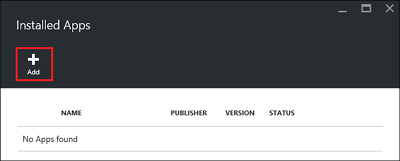

<properties
    pageTitle="Installieren von Applications Hadoop auf HDInsight | Microsoft Azure"
    description="Informationen Sie zum HDInsight auf HDInsight Applikationen installieren."
    services="hdinsight"
    documentationCenter=""
    authors="mumian"
    manager="jhubbard"
    editor="cgronlun"
    tags="azure-portal"/>

<tags
    ms.service="hdinsight"
    ms.devlang="na"
    ms.topic="hero-article"
    ms.tgt_pltfrm="na"
    ms.workload="big-data"
    ms.date="09/14/2016"
    ms.author="jgao"/>

# Installieren von Applications HDInsight

Eine HDInsight-Anwendung ist eine Anwendung, die Benutzer in einem HDInsight Linux-basierten Cluster installieren können. Diese Anwendung können von Microsoft, unabhängigen Software-Anbietern (ISV) oder sich selbst entwickelt werden. In diesem Artikel erfahren Sie, wie Sie eine veröffentlichte Anwendung zu installieren. Eigene Anwendung installiert haben, finden Sie unter [Installieren von benutzerdefinierten HDInsight Applikationen](hdinsight-apps-install-custom-applications.md). 

Aktuell besteht eine veröffentlichte Anwendung:

- **Datameer**: [Datameer](http://www.datameer.com/documentation/display/DAS50/Home?ls=Partners&lsd=Microsoft&c=Partners&cd=Microsoft) Analysten bietet eine interaktive Möglichkeit zur Erkennung, analysieren und die Ergebnisse auf Big Data visualisieren. Ziehen Sie einfach zu entdecken Sie neue Beziehungen und die Antworten ein, die Sie schnell müssen zusätzliche Datenquellen.

>[AZURE.NOTE] Datameer gibt es zurzeit nur in Azure HDInsight Version 3,2 Cluster unterstützt.

Verwenden Sie die Anweisungen in diesem Artikel beschriebenen Azure-Portal aus. Sie können auch die Ressourcenmanager Azure-Vorlage aus dem Portal exportieren oder erhalten eine Kopie der Vorlage Ressourcenmanager von Lieferanten, und verwenden Azure PowerShell und Azure CLI die Vorlage bereitstellen.  Finden Sie unter [Erstellen Linux-basierten Hadoop Cluster in HDInsight Ressourcenmanager Vorlagen verwenden](hdinsight-hadoop-create-linux-clusters-arm-templates.md).

## Erforderliche Komponenten

Wenn Sie HDInsight Anwendungen auf einem vorhandenen HDInsight Cluster installieren möchten, müssen Sie einen HDInsight Cluster verfügen. Um eine zu erstellen, finden Sie unter [Cluster erstellen](hdinsight-hadoop-linux-tutorial-get-started.md#create-cluster). Sie können auch HDInsight Applikationen installieren, wenn Sie einen Cluster HDInsight erstellen.

## Installieren von Applications zu vorhandener Cluster

Das folgende Verfahren veranschaulicht die HDInsight Applikationen zu einem vorhandenen HDInsight Cluster installieren.

**So installieren Sie die Anwendung HDInsight**

1. Melden Sie sich mit dem [Azure-Portal](https://portal.azure.com)aus.
2. Klicken Sie im linken Menü auf **HDInsight Cluster** .  Wenn Sie es nicht sehen, klicken Sie auf **Durchsuchen**, und klicken Sie dann auf **HDInsight Cluster**.
3. Klicken Sie auf eine HDInsight Cluster.  Wenn Sie eine haben, müssen Sie eine erstellen ersten.  finden Sie unter [Erstellen Cluster](hdinsight-hadoop-linux-tutorial-get-started.md#create-cluster).
4. Klicken Sie aus dem Blade **Einstellungen** unter der Kategorie **Allgemein** auf **Applications** . Das Blade **Apps installiert** werden alle installierten Anwendungen aufgeführt. 

    

5. Klicken Sie im Menü Blade auf **Hinzufügen** . 

    

    So finden Sie unter eine Liste der vorhandenen HDInsight Anwendungen.

    

6. Klicken Sie auf eine Anwendung, akzeptieren Sie die Vertragsbedingungen, und klicken Sie auf **auswählen**.

Sie können den Installationsstatus für die von der Portalseite Benachrichtigungen anzeigen (klicken Sie auf das Glockensymbol am oberen Rand des Portals). Nachdem die Anwendung installiert ist, wird die Anwendung auf das Blade Apps installiert angezeigt.

## Installieren von Applications während der Clustererstellung

Sie haben die Möglichkeit, HDInsight Applikationen zu installieren, wenn Sie einen Cluster erstellen. Während des Prozesses sind HDInsight Applikationen installiert nach der Cluster erstellt wird und im laufenden Zustand ist. Das folgende Verfahren veranschaulicht die HDInsight Applikationen installieren, wenn Sie einen Cluster erstellen.

**So installieren Sie die Anwendung HDInsight**

1. Melden Sie sich mit dem [Azure-Portal](https://portal.azure.com)aus.
2. Klicken Sie auf **neu**, klicken Sie auf **Daten + Analytics**, und klicken Sie dann auf **HDInsight**.
3. Geben Sie **Ein Cluster**: dieser Name muss global eindeutig sein.
4. Klicken Sie auf **Abonnement** zum Auswählen der Azure-Abonnements, die für den Cluster verwendet werden.
5. Klicken Sie auf **Cluster Typ auswählen**, und wählen Sie dann aus:

    - **Clustertyp**: Wenn Sie nicht, dass Was wissen auswählen, wählen Sie **Hadoop**aus. Es ist den Clustertyp der am häufigsten verwendeten.
    - **Betriebssystem**: Wählen Sie **Linux**.
    - **Version**: die Standardversion verwenden, wenn Sie wissen nicht, was auswählen. Weitere Informationen finden Sie unter [HDInsight Cluster Versionen](hdinsight-component-versioning.md).
    - **Cluster Ebene**: Azure HDInsight stellt die Cloud-Angebote big Data in zwei Kategorien: Standard Ebene und Premium Ebene. Weitere Informationen finden Sie unter [Cluster Ebenen](hdinsight-hadoop-provision-linux-clusters.md#cluster-tiers).
6. Klicken Sie auf **Applikationen**, klicken Sie auf eine der veröffentlichten Programme, und klicken Sie auf **auswählen**.
6. Klicken Sie auf **Anmeldeinformationen** , und geben Sie ein Kennwort für den Administratorbenutzer aus. Sie müssen auch eingeben einer **SSH Benutzernamen** und ein **Kennwort** oder **Öffentlicher Schlüssel**, die zum Authentifizieren des Benutzers SSH verwendet wird. Es wird empfohlen, die mit einem öffentlichen Schlüssel. Klicken Sie zum Speichern der Anmeldeinformationen Konfiguration klicken Sie unten auf **auswählen** .
8. Klicken Sie auf die **Datenquelle**, wählen Sie eine der vorhandenen Speicher-Konto, oder erstellen Sie ein neues Speicherkonto als Standardkonto Speicherplatz für den Cluster verwendet werden.
9. Klicken Sie auf die **Ressourcengruppe** , um eine vorhandene Ressourcengruppe auszuwählen, oder klicken Sie auf **neu** , um eine neue Ressourcengruppe erstellen

10. In der **Neuen HDInsight Cluster** Blade stellen Sie sicher, dass **an Startboard anheften** ausgewählt ist, und klicken Sie dann auf **Erstellen**. 

## Liste der installierten HDInsight apps und Eigenschaften

Im Portal zeigt eine Liste der installierten Programme HDInsight für einen Cluster und die Eigenschaften eines einzelnen installierte Anwendung.

**Liste der Anwendung HDInsight und Anzeigen von Eigenschaften**

1. Melden Sie sich mit dem [Azure-Portal](https://portal.azure.com)aus.
2. Klicken Sie im linken Menü auf **HDInsight Cluster** .  Wenn Sie es nicht sehen, klicken Sie auf **Durchsuchen**, und klicken Sie dann auf **HDInsight Cluster**.
3. Klicken Sie auf eine HDInsight Cluster.
4. Klicken Sie aus dem Blade **Einstellungen** unter der Kategorie **Allgemein** auf **Applications** . Das Blade Apps installiert werden alle installierten Anwendungen aufgeführt. 

    

5. Klicken Sie auf eine der installierten Programme aus, um die Eigenschaft anzuzeigen. Die Eigenschaft Blade Listen:

    - App-Name: Name der Anwendung.
    - Status: Anwendungsstatus. 
    - Webseite: Die URL der Website, die Sie auf den Rand Knoten bereitgestellt haben, ist es eine. Die Anmeldeinformationen unterscheidet sich die HTTP-Benutzeranmeldeinformationen, die Sie für den Cluster konfiguriert haben.
    - HTTP-Endpunkt: die Anmeldeinformationen unterscheidet sich von der HTTP-Benutzeranmeldeinformationen, die Sie für den Cluster konfiguriert haben. 
    - SSH Endpunkt: können [SSH](hdinsight-hadoop-linux-use-ssh-unix.md) auf den Rand Knoten verbinden. Die SSH-Anmeldeinformationen sind identisch mit den SSH Benutzeranmeldeinformationen, die Sie für den Cluster konfiguriert haben.

6. Um eine Anwendung zu löschen, mit der rechten Maustaste in der Anwendungs, und klicken Sie dann im Kontextmenü auf **Löschen** .

## Verbinden Sie mit den Rand Knoten

Sie können auf den Rand Knoten über HTTP und SSH verbinden. Die Endpunktinformationen kann vom [Portal](#list-installed-hdinsight-apps-and-properties)gefunden werden. Weitere Informationen zur Verwendung von SSH finden Sie unter [Verwenden SSH mit Linux-basierten Hadoop auf HDInsight von Linux, Unix, oder OS X](hdinsight-hadoop-linux-use-ssh-unix.md). 

Die HTTP-Endpunkt Anmeldeinformationen sind die HTTP-Benutzeranmeldeinformationen, die Sie für den Cluster HDInsight konfiguriert haben. SSH Endpunkt Anmeldeinformationen sind die SSH-Anmeldeinformationen, die Sie für den Cluster HDInsight konfiguriert haben.

## Behandeln von Problemen mit

Finden Sie unter [Problembehandlung der Installation](hdinsight-apps-install-custom-applications.md#troubleshoot-the-installation).

## Nächste Schritte

- [Installieren von benutzerdefinierten HDInsight Applications](hdinsight-apps-install-custom-applications.md): erfahren Sie, wie eine dauerhaften veröffentlichte HDInsight Anwendung mit HDInsight bereitstellen.
- [Veröffentlichen von HDInsight Applications](hdinsight-apps-publish-applications.md): erfahren Sie, wie Ihre benutzerdefinierten HDInsight Applikationen zu Azure Marketplace veröffentlichen.
- [MSDN: Installieren Sie die Anwendung HDInsight](https://msdn.microsoft.com/library/mt706515.aspx): Informationen zum Definieren von Applications HDInsight.
- [Anpassen von Linux-basierten HDInsight Cluster mithilfe der Aktion Skript](hdinsight-hadoop-customize-cluster-linux.md): erfahren Sie, wie Skript-Aktion verwenden, um zusätzliche Applikationen zu installieren.
- [Hadoop erstellen Linux-basierten Cluster in HDInsight mithilfe von Vorlagen Ressourcenmanager](hdinsight-hadoop-create-linux-clusters-arm-templates.md): erfahren Sie, wie Ressourcenmanager Vorlagen zum Erstellen von HDInsight Cluster aufrufen.
- [Leere Kante Knoten in HDInsight verwenden](hdinsight-apps-use-edge-node.md): erfahren, wie Sie einen leeren Kantenknoten für den Zugriff auf HDInsight Cluster, HDInsight Applikationen testen und Hosten von Applications HDInsight zu verwenden.

