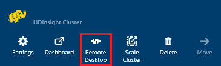
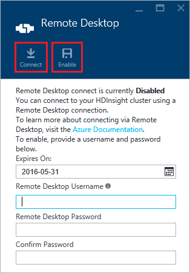
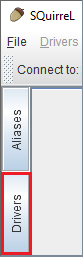

<properties
 pageTitle="Verwenden von JDBC Abfrage Struktur auf Azure HDInsight"
 description="Informationen Sie zum Verwenden von JDBC zum Verbinden mit Struktur auf Azure HDInsight und Remote Abfragen von Daten in der Cloud gespeichert."
 services="hdinsight"
 documentationCenter=""
 authors="Blackmist"
 manager="jhubbard"
 editor="cgronlun"
    tags="azure-portal"/>

<tags
 ms.service="hdinsight"
 ms.devlang="java"
 ms.topic="article"
 ms.tgt_pltfrm="na"
 ms.workload="big-data"
 ms.date="08/23/2016"
 ms.author="larryfr"/>

#Verbinden Sie mit Struktur auf Azure HDInsight mithilfe des Struktur JDBC-Treibers

[AZURE.INCLUDE [ODBC-JDBC-selector](../../includes/hdinsight-selector-odbc-jdbc.md)]

In diesem Dokument erfahren Sie, wie JDBC Java-Anwendung verwenden, um die Struktur Abfragen zu einem Cluster HDInsight Remote zu übermitteln. Sie erfahren, wie von den Eichhörnchen SQL-Client eine Verbindung herstellen und Herstellung der Verbindung programmgesteuert von Java.

Weitere Informationen über die Struktur JDBC-Schnittstelle finden Sie unter [HiveJDBCInterface](https://cwiki.apache.org/confluence/display/Hive/HiveJDBCInterface).

##Erforderliche Komponenten

Um die Schritte in diesem Artikel ausführen zu können, benötigen Sie Folgendes:

* Eine Hadoop auf HDInsight Cluster. Entweder Linux-basierten oder Windows-basierten Cluster funktionieren.

* [Eichhörnchen SQL](http://squirrel-sql.sourceforge.net/). Eichhörnchen ist eine JDBC-Clientanwendung.

Zum Erstellen und Ausführen der Beispiel Java-Anwendungs, die in diesem Artikel verknüpft, benötigen Sie Folgendes.

* [Java Developer Kit (JDK) Version 7](https://www.oracle.com/technetwork/java/javase/downloads/jdk7-downloads-1880260.html) oder höher.

* [Apache Maven](https://maven.apache.org). Maven ist ein Projekt erstellen System für Projekte, die Java, indem Sie das Projekt in diesem Artikel zugeordnet verwendet wird.

##Verbindungszeichenfolge

JDBC Verbindungen zu einem HDInsight Cluster auf Azure über 443 vorgenommen wurden, und der Datenverkehr wird über SSL geschützt. Öffentliche Gateways, die die Cluster hinter ungefähr leitet den Datenverkehr an den Port, dem HiveServer2 tatsächlich überwacht. Daher möchte eine typische Verbindungszeichenfolge Folgendes:

    jdbc:hive2://CLUSTERNAME.azurehdinsight.net:443/default;ssl=true?hive.server2.transport.mode=http;hive.server2.thrift.http.path=/hive2

Ersetzen Sie __CLUSTERNAME__ mit dem Namen der HDInsight Cluster ein.

##Authentifizierung

Beim Herstellen der Verbindungs, müssen Sie die HDInsight Cluster Administratornamen und das Kennwort für das Gateway Cluster authentifizieren verwenden. Bei der Verbindung von JDBC-Clients wie z. B. Eichhörnchen SQL müssen Sie Clienteinstellungen den Administratornamen und das Kennwort eingeben.

Aus einer Java-Anwendung müssen Sie den Namen und das Kennwort beim Herstellen einer Verbindung verwenden. Der folgende Java-Code wird beispielsweise eine neue Verbindung mithilfe der Verbindungszeichenfolge, Administratornamen und das Kennwort:

    DriverManager.getConnection(connectionString,clusterAdmin,clusterPassword);

##Verbinden Sie mit Eichhörnchen SQL client

Eichhörnchen SQL ist ein JDBC-Client, der mit dem Remote Struktur Abfragen mit Ihren Cluster HDInsight ausgeführt werden kann. Die folgenden Schritte setzen voraus, dass Sie Eichhörnchen SQL bereits installiert haben, und Sie führt durch das Herunterladen und die Treiber für Struktur konfigurieren.

1. Kopieren Sie die Struktur JDBC-Treiber aus Ihrem HDInsight Cluster ein.

    * Gehen Sie für __Linux-basierte HDInsight__folgendermaßen vor, die erforderlichen JAR-Dateien heruntergeladen.

        1. Erstellen Sie ein neues Verzeichnis, das die Dateien enthalten sollen. Beispielsweise `mkdir hivedriver`.

        2. Befehlszeile, Bash, PowerShell oder andere Befehlszeile wechseln Sie in das neue Verzeichnis und kopieren Sie die Dateien aus dem Cluster HDInsight mithilfe der folgenden Befehle.

                scp USERNAME@CLUSTERNAME:/usr/hdp/current/hive-client/lib/hive-jdbc*standalone.jar .
                scp USERNAME@CLUSTERNAME:/usr/hdp/current/hadoop-client/hadoop-common.jar .
                scp USERNAME@CLUSTERNAME:/usr/hdp/current/hadoop-client/hadoop-auth.jar .

            Ersetzen Sie __USERNAME__ durch den SSH Konto Benutzernamen für den Cluster ein. Ersetzen Sie __CLUSTERNAME__ mit dem HDInsight Clusternamen ein.

            > [AZURE.NOTE] Klicken Sie auf Windows-Umgebungen müssen Sie das Programm PSCP statt scp verwenden. Sie können ihn von [http://www.chiark.greenend.org.uk/~sgtatham/putty/download.html](http://www.chiark.greenend.org.uk/~sgtatham/putty/download.html)herunterladen.

    * Gehen Sie für __Windows-basiertem HDInsight__folgendermaßen vor, die JAR-Dateien heruntergeladen.

        1. Vom Azure-Portal wählen Sie Ihren Cluster HDInsight aus, und wählen Sie dann auf das Symbol __Remotedesktop__ .

            

        2. Klicken Sie auf das Blade Remotedesktop verwenden Sie die Schaltfläche __Verbinden__ Verbindung zum Cluster aus. Wenn der Remotedesktop nicht aktiviert ist, geben Sie einen Benutzernamen und Ihr Kennwort ein, wählen Sie dann __Aktivieren__ , aktivieren Sie Remotedesktop für den Cluster mithilfe des Formulars.

            

            Nachdem Sie auf __Verbindung herstellen__, wird eine RDP-Datei heruntergeladen werden. Verwenden Sie diese Datei, um den Remote-Desktopclient starten. Wenn Sie dazu aufgefordert werden, verwenden Sie Benutzername und Kennwort für Remote Desktop Zugriff eingegebene.

        3. Nachdem die Verbindung hergestellt wurde, kopieren Sie die folgenden Dateien aus der Remotedesktop-Sitzung auf Ihrem Computer. Setzen sie in einem lokalen Verzeichnis mit dem Namen `hivedriver`.

            * C:\apps\dist\hive-0.14.0.2.2.9.1-7\lib\hive-JDBC-0.14.0.2.2.9.1-7-Standalone.jar
            * C:\apps\dist\hadoop-2.6.0.2.2.9.1-7\share\hadoop\common\hadoop-Common-2.6.0.2.2.9.1-7.jar
            * C:\apps\dist\hadoop-2.6.0.2.2.9.1-7\share\hadoop\common\lib\hadoop-AUTH-2.6.0.2.2.9.1-7.jar

            > [AZURE.NOTE] Die im Lieferumfang der Pfade und Dateinamen Versionsnummern können für Ihren Cluster abweichen.

        4. Trennen Sie die Sitzung Remote Desktop, wenn Sie fertig sind, kopieren die Dateien.

3. Starten Sie die Eichhörnchen SQL-Anwendung. Wählen Sie in der linken Seite des Fensters __Treiber__aus.

    

4. Die Symbole am oberen Rand des Dialogfelds __Treiber__ , wählen Sie aus der __+__ Symbol, um einen neuen Treiber zu erstellen.

    

5. Fügen Sie im Dialogfeld Treiber hinzufügen die folgende Informationen ein.

    * __Name__: Struktur
    * __Beispiel-URL__: jdbc:hive2://localhost:443/default;ssl=true?hive.server2.transport.mode=http;hive.server2.thrift.http.path=/hive2
    * __Zusätzliche Klassenpfad__: Verwenden Sie die Schaltfläche "hinzufügen" zum Hinzufügen der JAR-Dateien einer früheren Version heruntergeladen
    * __Klassennamen__: org.apache.hive.jdbc.HiveDriver

    

    Klicken Sie auf __OK__ , um diese Einstellungen zu speichern.

6. Wählen Sie auf der linken Seite des Fensters SQL Eichhörnchen __Aliases__aus. Klicken Sie dann auf die __+__ Symbol, um einen neuen Alias für die Verbindung zu erstellen.

    

7. Verwenden Sie die folgenden Werte für das Dialogfeld __Alias hinzufügen__ .

    * __Namen__: Klicken Sie auf HDInsight Struktur
    * __Treiber__: den __Struktur__ -Treiber wählen Sie mithilfe der Dropdown-Liste
    * __URL__: jdbc:hive2://CLUSTERNAME.azurehdinsight.net:443/default;ssl=true?hive.server2.transport.mode=http;hive.server2.thrift.http.path=/hive2

        Ersetzen Sie __CLUSTERNAME__ mit dem Namen der HDInsight Cluster ein.

    * __Benutzername__: der Name des Cluster Login für Ihren Cluster HDInsight. Die Standardeinstellung ist `admin`.
    * __Kennwort__: das Kennwort für das Konto Cluster Login. Dies ist ein Kennwort ein, die Sie beim Erstellen des HDInsight Clusters bereitgestellt.

    

    Verwenden Sie die Schaltfläche __Testen__ , um sicherzustellen, dass die Verbindung funktioniert. Wenn __Herstellen einer Verbindung mit: Struktur auf HDInsight__ Dialogfeld angezeigt wird, wählen Sie __Verbinden__ zum Ausführen des Tests aus. Wenn der Test erfolgreich ist, wird ein Dialogfeld für die __Verbindung erfolgreich__ angezeigt.

    Verwenden Sie die Schaltfläche __Ok__ am unteren Rand des Dialogfelds __Alias hinzufügen__ , um den Alias für die Verbindung zu speichern.

8. Wählen Sie aus der Dropdownliste __Herstellen einer Verbindung mit__ den oben Eichhörnchen SQL __auf HDInsight Struktur__. Wenn Sie dazu aufgefordert werden, wählen Sie __Verbinden__.

    

9. Nachdem die Verbindung hergestellt wurde, geben Sie die folgende Abfrage in das Dialogfeld des SQL-Abfrage, und wählen Sie dann auf das Symbol __Ausführen__ . Der Ergebnisbereich sollten die Ergebnisse der Abfrage anzeigen.

        select * from hivesampletable limit 10;

    

##Verbinden von Beispiel Java-Anwendung

Ein Beispiel für die Verwendung eines Java-Clients Abfrage Struktur auf HDInsight ist unter [https://github.com/Azure-Samples/hdinsight-java-hive-jdbc](https://github.com/Azure-Samples/hdinsight-java-hive-jdbc)verfügbar. Führen Sie die Schritte im Repository zu erstellen, und führen Sie das Beispiel aus.

##Behandlung von Problemen

### Bei dem Versuch, eine SQL-Verbindung zu öffnen, ist ein unerwarteter Fehler aufgetreten.

__Symptome__: beim Herstellen einer Verbindung, die Version 3.3 oder 3.4 ist, zu einem Cluster HDInsight, erhalten Sie möglicherweise eine Fehlermeldung, die ein unerwarteter Fehler aufgetreten sind. Der Stapel Spur für diesen Fehler beginnt mit den folgenden Positionen:

    java.util.concurrent.ExecutionException: java.lang.RuntimeException: java.lang.NoSuchMethodError: org.apache.commons.codec.binary.Base64.<init>(I)V
    at java.util.concurrent.FutureTas...(FutureTask.java:122)
    at java.util.concurrent.FutureTask.get(FutureTask.java:206)

__Ursache__: Dieser Fehler wird durch einen Konflikt in der Version der Datei Commons-codec.jar verwendeten Eichhörnchen und das Schema erforderlich, durch die Struktur JDBC Komponenten aus dem Cluster HDInsight heruntergeladen verursacht.

__Lösung__: Gehen Sie folgendermaßen vor, um diesen Fehler zu beheben.

1. Herunterladen der Commons-Codec JAR-Datei aus Ihrem Cluster HDInsight.

        scp USERNAME@CLUSTERNAME:/usr/hdp/current/hive-client/lib/commons-codec*.jar ./commons-codec.jar

2. Beenden Sie Eichhörnchen, und wechseln Sie dann zu dem Verzeichnis dem Eichhörnchen auf Ihrem Computer installiert ist. Im Verzeichnis Eichhörnchen unter der `lib` Verzeichnis, ersetzen die vorhandenen Commons codec.jar mit der aus dem Cluster HDInsight heruntergeladen.

3. Starten Sie Eichhörnchen neu. Der Fehler sollte nicht mehr auftreten, bei der Verbindung mit Struktur auf HDInsight.

##Nächste Schritte

Jetzt, da Sie JDBC verwenden, für die Arbeit mit Struktur vertraut gemacht haben, verwenden Sie die folgenden Links, um andere Methoden für die Arbeit mit Azure HDInsight untersuchen.

* [Hochladen von Daten mit HDInsight](hdinsight-upload-data.md)
* [Verwenden Sie die Struktur mit HDInsight](hdinsight-use-hive.md)
* [Schwein mit HDInsight verwenden](hdinsight-use-pig.md)
* [Verwenden von MapReduce Aufträge mit HDInsight](hdinsight-use-mapreduce.md)
