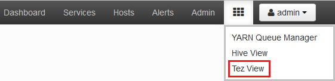
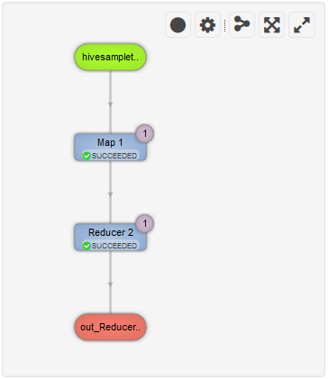

<properties
pageTitle="Verwenden von Ambari Tez Ansicht mit HDInsight | Azure"
description="Erfahren Sie, wie die Ansicht Ambari Tez Tez Aufträge auf HDInsight Debuggen verwenden."
services="hdinsight"
documentationCenter=""
authors="Blackmist"
manager="jhubbard"
editor="cgronlun"/>

<tags
ms.service="hdinsight"
ms.devlang="na"
ms.topic="article"
ms.tgt_pltfrm="na"
ms.workload="big-data"
ms.date="10/04/2016"
ms.author="larryfr"/>

# Verwenden Sie Ansichten Tez Aufträge auf HDInsight Debuggen Ambari

Der Ambari Web-Benutzeroberfläche für HDInsight enthält eine Tez Ansicht, die verwendet werden kann, zu verstehen und Debuggen Einzelvorgänge, die Tez als Execution-Engine verwenden. Die Ansicht Tez können Sie den Auftrag als ein Diagramm der verbundenen Elemente visualisieren, detailliert auswerten jedes Element und Statistiken und protokollierten Informationen abrufen.

> [AZURE.NOTE] Die Informationen in diesem Dokument ist für Linux-basierte HDInsight Cluster spezifisch. Informationen über das Debuggen von Tez für Aufträge mithilfe von Windows-basierten HDInsight finden Sie unter [Verwenden der Tez Benutzeroberfläche zum Debuggen Tez Aufträge auf Windows basierende HDInsight](hdinsight-debug-tez-ui.md).

## Erforderliche Komponenten

* Ein Cluster Linux-basierten HDInsight. Schritte zum Erstellen eines neuen Clusters finden Sie unter [Erste Schritte mit Linux-basierten HDInsight](hdinsight-hadoop-linux-tutorial-get-started.md).

* Eine moderne Webbrowser, HTML5 unterstützt.

## Grundlegendes zu Tez

Tez ist ein extensible Framework für die Verarbeitung von Daten in Hadoop, die höhere Geschwindigkeit als herkömmliche MapReduce Verarbeitung bereitstellt. HDInsight Linux-basierten Cluster ist es Standard-Engine für Struktur.

Bei der Arbeit an Tez gesendet wird, erstellt eine geleitet acyclische Graph (so), die die Reihenfolge der Ausführung der Aktionen erforderlich, indem Sie den Auftrag beschreibt. Einzelne Aktionen werden auch Scheitelpunkte genannt, und führen Sie einen Teil des gesamten Auftrags. Die tatsächliche Ausführung der Arbeit durch einen Eckpunkt beschrieben heißt ein Vorgangs und auf mehreren Knoten im Cluster verteilt werden kann.

### Grundlegendes zu den Tez anzeigen

Die Ansicht Tez enthält Informationen zu Prozessen, die ausgeführt werden, oder zuvor war mit Tez. Dies zulässt, können Sie anzeigen, die so generiert Tez, indem Sie es Verteilung auf Cluster, wie z. B. Arbeitsspeicher von Vorgängen und Eckpunkte sowie Fehlerinformationen verwendeten Indikatoren. Nützliche Informationen in den folgenden Szenarien bietet möglicherweise an:

* Überwachung langer Geschäftsprozesse Anzeigen des Verlaufs der Karte und Aufgaben zu verringern.

* Analysieren von zurückliegenden Daten für erfolgreiche oder fehlgeschlagene Prozesse, um zu erfahren, wie Verarbeitung verbessert werden könnte oder Gründe für den Fehler aus.

## Generieren einer so

Die Ansicht Tez wird nur Daten ist ein Projekt enthalten, die verwendet die Tez-Engine aktuell ausgeführte oder wurde in der Vergangenheit ausgeführt haben. Einfache Struktur Abfragen können in der Regel aufgelöst werden ohne Tez, jedoch komplexere Abfragen, die durchführen filtern, Gruppierung, Sortierung, Verknüpfungen usw. normalerweise Tez erforderlich.

Gehen Sie folgendermaßen vor, um eine Struktur Abfrage ausführen, die mit Tez ausgeführt wird.

1. Navigieren Sie in einem Webbrowser zu https://CLUSTERNAME.azurehdinsight.net, darin __CLUSTERNAME__ auf den Namen der Cluster HDInsight.

2. Klicken Sie im Menü am oberen Rand der Seite Wählen Sie das Symbol __Ansichten__ . Es sieht wie eine Reihe von Quadrate. Wählen Sie in der Dropdownliste aus, die angezeigt wird die __Struktur der anzeigen__. 

    

3. Anzeigen die Struktur geladen wird, klicken Sie den folgenden Text in den Abfrage-Editor, und klicken Sie dann auf __Ausführen__.

        select market, state, country from hivesampletable where deviceplatform='Android' group by market, country, state;
    
    Nachdem der Job abgeschlossen ist, sollten Sie die Ausgabe im Abschnitt __Prozess Abfrageergebnisse__ angezeigt sehen. Die Ergebnisse sollten ähnlich wie der folgende
    
        market  state       country
        en-GB   Hessen      Germany
        en-GB   Kingston    Jamaica
        
4. Wählen Sie die Registerkarte __Protokoll__ aus. Ähnlich wie der folgende Informationen werden angezeigt:
    
        INFO : Session is already open
        INFO :

        INFO : Status: Running (Executing on YARN cluster with App id application_1454546500517_0063)

    Speichern Sie den __App-Id__ -Wert wie folgt im nächsten Abschnitt verwendet werden.

## Verwenden der Ansicht Tez

1. Klicken Sie im Menü am oberen Rand der Seite Wählen Sie das Symbol __Ansichten__ . Wählen Sie in der Dropdownliste aus, die angezeigt wird, __Tez Ansicht__ein.

    

2. Beim Laden der Ansicht Tez, sehen Sie sich, dass eine Liste der DAGs, die zurzeit ausgeführt werden, oder Waren auf Cluster ausgeführt wurde. Die Standardansicht enthält Dag Name, Id, Absender, Status, Anfangszeit, Endzeit, Dauer, ID der Anwendung, und Warteschlange. Weitere Spalten können mit dem Zahnradsymbol am rechten Rand der Seite hinzugefügt werden.

    

3. Wenn Sie nur einen Eintrag haben, werden sie für die Abfrage, die Sie im vorherigen Abschnitt ausgeführt haben. Wenn Sie mehrere Einträge verfügen, können Sie durch Eingeben der Anwendung-ID in das Feld __ID Anwendung__ suchen, und drücken Sie dann die EINGABETASTE.

4. Wählen Sie den __Namen so__ein. Informationen zu den so, als auch die Option JSON-Dateien als ZIP-Datei herunterladen, die Informationen zu den so enthalten werden angezeigt.

    

5. Sind Sie über die __Details so__ mehrere Verknüpfungen, die verwendet werden können, um Informationen zu den so anzuzeigen.

    * __So Indikatoren__ zeigt Indikatoren für diese so.
    
    * __Grafisch__ wird von diesem so grafisch dargestellt.
    
    * __Alle Scheitelpunkte__ zeigt eine Liste der Scheitelpunkte in dieser so.
    
    * __Alle Vorgänge__ zeigt eine Liste der Aufgaben aus, um alle Scheitelpunkte in dieser so.
    
    * __Alle TaskAttempts__ zeigt Informationen über die Versuche, diese so Aufgaben ausführen.
    
    > [AZURE.NOTE] Wenn Sie die Spaltenanzeige für Eckpunkte, Aufgaben und TaskAttempts einen Bildlauf durchführen, beachten Sie, dass es Links zu __Indikatoren__ und __anzeigen oder Herunterladen von Protokollen__ für jede Zeile anzeigen.

    Wenn es wurde ein Fehler bei der Position aus, werden die Details so einen Status fehlgeschlagen, sowie Links zu Informationen über die fehlgeschlagene Aufgabe angezeigt. Diagnoseinformationen wird unter die Details so angezeigt werden soll.
    
    

7. Wählen Sie __grafisch__an. Hierdurch werden grafisch dargestellt, die so angezeigt. Sie können die Maus über jede Scheitelpunkt in der Ansicht zum Anzeigen von Informationen dazu platzieren.

    

8. Klicken auf einen Scheitelpunkt, laden Sie die __Scheitelpunkt Details__ für dieses Element. Klicken Sie auf den Scheitelpunkt __Karte 1__ Informationen für dieses Element angezeigt.

    

9. Beachten Sie, dass Sie verfügen nun über die Links am oberen Rand der Seite, die Scheitelpunkte und Vorgänge verknüpft sind.

    > [AZURE.NOTE] Sie können auch auf dieser Seite durch zurückgehen __So__Details, indem __Scheitelpunkt Details__, auswählen und dann den __Karte 1__ Scheitelpunkt eintreffen.

    * __Scheitelpunkt Indikatoren__ zeigt Indikator für diese Eckpunkts.
    
    * __Aufgaben__ werden Aufgaben für diese Eckpunkts angezeigt.
    
    * __Aufgabe versucht__ zeigt Informationen zum Ausführen von Aufgaben für diese Eckpunkts Versuche an.
    
    * __Quellen und senken__ zeigt Datenquellen und für diese Eckpunkts senken.

    > [AZURE.NOTE] Als können Sie mit der vorherigen Menü die Spaltenanzeige für Aufgaben, Task versucht, und Quellen & Sinks__ Anzeigen von Links zu weiteren Informationen für jedes Element blättern.

10. Wählen Sie __Vorgänge__aus, und wählen Sie dann das Element mit der Bezeichnung __00_000000__. __Aufgabendetails__ werden für diese Aufgabe angezeigt. Dieser Bildschirm können Sie die __Aufgabe Indikatoren__ und __Versuche Vorgang__anzeigen.

    

## Nächste Schritte

Jetzt, da Sie die Ansicht Tez verwenden vertraut gemacht haben, erfahren Sie mehr zur [Verwendung auf HDInsight Struktur](hdinsight-use-hive.md).

Detailliertere Informationen auf Tez finden Sie unter der [Tez-Seite unter Hortonworks](http://hortonworks.com/hadoop/tez/).

Weitere Informationen zum Verwenden von Ambari mit HDInsight finden Sie unter [Verwalten von HDInsight Cluster mithilfe der Ambari Web-Benutzeroberfläche](hdinsight-hadoop-manage-ambari.md)
