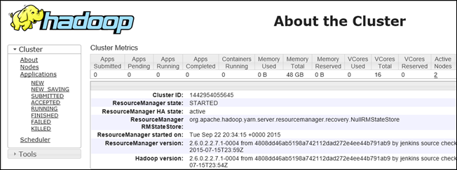

<properties
    pageTitle="Hadoop in HDInsight Debuggen: Protokolle anzeigen und interpretieren Fehlermeldungen | Microsoft Azure"
    description="Informationen Sie zu den Fehlermeldungen, die Sie erhalten möglicherweise bei der Verwaltung von HDInsight mithilfe der PowerShell und Schritte, die Sie ergreifen können, um wiederherzustellen."
    services="hdinsight"
    tags="azure-portal"
    editor="cgronlun"
    manager="jhubbard"
    authors="mumian"
    documentationCenter=""/>

<tags
    ms.service="hdinsight"
    ms.workload="big-data"
    ms.tgt_pltfrm="na"
    ms.devlang="na"
    ms.topic="article"
    ms.date="09/02/2016"
    ms.author="jgao"/>

# Analysieren Sie HDInsight Protokolle

Jeder Hadoop Cluster in Azure HDInsight verfügt über ein Azure-Speicher-Konto als Standard-Dateisystem verwendet. Das Speicherkonto wird als Standardkonto Speicher bezeichnet. Cluster verwendet Azure Tabellenspeicher und Blob-Speicher auf das Speicher-Standardkonto, um seine Protokolle speichern.  Das Standardkonto-Speicher für Ihren Cluster finden Sie finden Sie unter [Verwalten von Hadoop Cluster in HDInsight](hdinsight-administer-use-management-portal.md#find-the-default-storage-account). Die Protokolle beibehalten in das Konto Speicher, auch nachdem der Cluster gelöscht wird.

##Protokolle geschrieben mit Azure-Tabellen

Die Protokolle in Azure Tabellen geschrieben bieten einen Einblick in was mit einem Cluster HDInsight passiert.

Beim Erstellen eines HDInsight Clusters werden 6 Tabellen für Linux-basierten Cluster in Tabellenspeicher Standard automatisch erstellt:

- hdinsightagentlog
- Syslog
- daemonlog
- hadoopservicelog
- ambariserverlog
- ambariagentlog

3-Tabellen sind für Windows-basiertem Cluster erstellt:

- Setuplog: Protokollieren von Ereignissen/Ausnahmen in provisioning/Einrichtung der HDInsight Cluster aufgetreten ist.
- Hadoopinstalllog: Protokollieren von Ereignissen/Ausnahmen beim Installieren von Hadoop auf Cluster aufgetreten. In dieser Tabelle sein Debuggen von Problemen im Zusammenhang mit Cluster erstellt mit benutzerdefinierten Parametern hilfreich.
- Hadoopservicelog: Protokollieren von Ereignissen/Ausnahmen von Diensten für alle Hadoop aufgezeichnet. In dieser Tabelle sein Debuggen von Problemen im Zusammenhang mit Auftrag-Fehlern bei HDInsight Cluster hilfreich.

Die Tabelle Dateinamen sind **u<ClusterName>DDMonYYYYatHHMMSSsss<TableName>**.

In diesen Tabellen enthält die folgenden Felder:

- ClusterDnsName
- Komponentenname
- EventTimestamp
- Host
- MALoggingHash
- Nachricht
- N
- PreciseTimeStamp
- Rolle
- RowIndex
- Mandanten
- ZEITSTEMPEL
- TraceLevel

### Tools für den Zugriff auf die Protokolle

Es gibt viele Tools für den Zugriff auf Daten in diesen Tabellen zur Verfügung:

-  Visual Studio
-  Azure-Speicher-Explorer
-  Power Query für Excel

#### Verwenden von Power Query für Excel

Power Query kann von [www.microsoft.com/en-us/download/details.aspx?id=39379]( http://www.microsoft.com/en-us/download/details.aspx?id=39379)installiert werden. Sehen Sie die Downloadseite für die Systemanforderungen

**Verwenden von Power Query öffnen und Analysieren der Dienst log**

1. **Microsoft Excel**zu öffnen.
2. Klicken Sie im Menü **Power Query** auf **Aus Azure**, und klicken Sie dann auf **aus Microsoft Azure Table Storage**.
 
    
3. Geben Sie den Namen des Kontos Speicher aus. Dies kann entweder den kurzen Namen oder den vollqualifizierten Domänennamen sein.
4. Geben Sie im Speicher kontoschlüssel ein. Sie müssen eine Liste der Tabellen finden Sie unter:

    
5. Mit der rechten Maustaste in der Tabelle Hadoopservicelog im Bereich **Navigator** , und wählen Sie **Bearbeiten**aus. 4 Spalten wird angezeigt. Löschen Sie optional **Partitionsschlüssel**, **Zeilenschlüssel**und **Zeitstempel** Spalten, indem Sie sie auswählen **Spalten entfernen** aus den Optionen im Menüband.
6. Klicken Sie auf das Symbol zum Erweitern auf die Spalte Content, um die Spalten auszuwählen, die Sie in der Excel-Kalkulationstabelle importieren möchten. Für diese Demo ich habe TraceLevel und Komponentenname: sie können mir einige grundlegenden Informationen, die auf die Komponenten Problemen geführt.

    
7. Klicken Sie auf **OK** , um die Daten zu importieren.
8. Wählen Sie die Spalten **TraceLevel**, Rolle und **Komponentenname** aus, und klicken Sie dann auf **Group By** -Steuerelement auf der Multifunktionsleiste.
9. Klicken Sie auf **OK** im Dialogfeld Gruppieren nach
10. Klicken Sie auf** anwenden und schließen**.
 
Sie können jetzt Excel zum Filtern und Sortieren nach Bedarf. Offensichtlich, wenn Sie andere Spalten (z. B. Nachricht) enthalten, um einen Drilldown auftreten, wenn sie auftreten, aber Markierens und Gruppierens von die oben beschriebenen Spalten bietet eine ordentliche Bild was passiert mit den Diensten von Hadoop möchten. Die gleiche Idee kann mit den Tabellen Setuplog und Hadoopinstalllog angewendet werden.

#### Verwenden Sie Visual Studio

**Verwenden von Visual Studio**

1. Öffnen Sie Visual Studio.
2. Klicken Sie im Menü **Ansicht** auf **Explorer Cloud**. Oder klicken Sie einfach auf **STRG +\, STRG + X**.
3. Wählen Sie aus der **Cloud Explorer** **Ressourcentypen**aus.  Die andere verfügbare Option ist die **Ressourcengruppen**.
4. Erweitern Sie **Speicher-Konten**, das Standardkonto-Speicher für Ihren Cluster und dann auf **Tabellen**.
5. Doppelklicken Sie auf **Hadoopservicelog**.
6. Fügen Sie einen Filter ein. Beispiel:
    
        TraceLevel eq 'ERROR'

    

    Weitere Informationen zum Erstellen von Filtern finden Sie unter [Filtern von Zeichenfolgen für den Tabellen-Designer erstellen](../vs-azure-tools-table-designer-construct-filter-strings.md).
 
##Protokolle in Azure Blob-Speicher geschrieben

[Die Protokolle in Azure Tabellen geschrieben](#log-written-to-azure-tables) bieten einen Einblick in was mit einem Cluster HDInsight passiert. In diesen Tabellen bieten jedoch keine Vorgangsebene Protokolle, die in Ausführen von Drilldowns hilfreich sein können weitere auftreten, wenn sie auftreten. Zum Bereitstellen dieser nächsten Detailebene sind HDInsight Cluster so konfiguriert, dass um Task-Protokolle bei Ihrem Konto Blob-Speicher für eine beliebige Position zu schreiben, die über Templeton gesendet wird. In der Praxis bedeutet dies Aufträge mit Microsoft Azure PowerShell-Cmdlets oder .NET Auftrag Einreichung APIs, nicht durch RDP/Befehlszeilenversion-Befehlszeile Zugriff auf den Cluster übermittelten Aufträge übermittelt. 

Zum Anzeigen der Protokolle finden Sie in der [Anwendung von Access aus anmeldet Linux-basierten HDInsight](hdinsight-hadoop-access-yarn-app-logs-linux.md).

Weitere Informationen zu Anwendungsprotokolle finden Sie unter [Simplifying meldet Benutzer Management und Access in aus](http://hortonworks.com/blog/simplifying-user-logs-management-and-access-in-yarn/).
 
 
## Anzeigen von Clusterprotokollen Gesundheit und Position

###Hadoop-Benutzeroberfläche

Klicken Sie im Portal Azure auf einen HDInsight Cluster ein, um das Blade Cluster zu öffnen. Klicken Sie auf **Dashboard**, aus dem Blade Cluster.

Wenn Sie dazu aufgefordert werden, geben Sie die Administratorberechtigungen Cluster aus. Klicken Sie in der Abfrage-Verwaltungskonsole, das geöffnet wird auf **Hadoop-Benutzeroberfläche**.

###Zugriff auf die Benutzeroberfläche aus

Klicken Sie im Portal Azure auf einen HDInsight Cluster ein, um das Blade Cluster zu öffnen. Klicken Sie auf **Dashboard**, aus dem Blade Cluster. Wenn Sie dazu aufgefordert werden, geben Sie die Administratorberechtigungen Cluster aus. Klicken Sie in der Abfrage-Verwaltungskonsole, das geöffnet wird auf **Benutzeroberfläche aus**.

Die Benutzeroberfläche aus können Sie eine der folgenden Aktionen ausführen:

* **Cluster Status zu erhalten**. Im linken Bereich erweitern Sie **Cluster**zu, und klicken Sie auf **Info**. Diese präsentieren cluster Statusdetails wie Summe zugeordneten Speichers, Kerne verwendet, Zustand des Ressourcenmanager Cluster, cluster-Version usw..

    

* **Abrufen von Knoten Status**. Erweitern Sie **Cluster**im linken Bereich, und klicken Sie auf **Knoten**. Hier werden alle Knoten im Cluster, HTTP-Adresse der einzelnen Knoten zugewiesenen Ressourcen für die einzelnen Knoten usw. aufgeführt.

* **Projektstatus überwachen**. Im linken Bereich erweitern Sie **Cluster**zu, und klicken Sie dann auf **Anwendungen** , um eine Liste aller Aufträge im Cluster. Wenn Sie möchten, schauen Sie sich Aufträge in einem bestimmten Zustand (z. B. neue, gesendete, Ausführung, usw.), klicken Sie auf die entsprechende Verknüpfung unter **Applications**. Sie können den Auftragsnamen, um weitere Informationen zu den Auftrag solche, einschließlich der Ausgabe, Protokolle usw. finden Weiter klicken.

###Zugriff auf die HBase-Benutzeroberfläche

Klicken Sie im Portal Azure auf einen HDInsight HBase Cluster ein, um das Blade Cluster zu öffnen. Klicken Sie auf **Dashboard**, aus dem Blade Cluster. Wenn Sie dazu aufgefordert werden, geben Sie die Administratorberechtigungen Cluster aus. Klicken Sie in der Abfrage-Verwaltungskonsole, das geöffnet wird auf **HBase Benutzeroberfläche**.

## Fehlercodes HDInsight

Die Fehlermeldungen, die in diesem Abschnitt aufgeschlüsselt werden bereitgestellt, die Benutzer in Azure HDInsight Hadoop mögliche Fehler zu verstehen, die dabei auftreten können, wenn Sie den Dienst mithilfe der PowerShell Azure verwalten sowie zu den Schritten informiert, die durchgeführt werden können, um den Fehler zu beheben.

Einige dieser Fehlermeldungen konnte auch im Portal Azure angezeigt werden, wenn sie zum Verwalten von HDInsight Cluster verwendet wird. Aber andere Fehlermeldungen treten möglicherweise weniger detaillierte aufgrund der Einschränkungen für die Maßnahmen, die in diesem Zusammenhang möglich sind. Andere Fehlermeldungen werden in den Kontexten bereitgestellt, in dem die Problembehebung offensichtlich ist. 

### AtleastOneSqlMetastoreMustBeProvided
- **Beschreibung**: Geben Sie die Details der SQL Azure-Datenbank für mindestens eine Komponente um benutzerdefinierte Einstellungen für die Struktur und Oozie Metastores verwenden.
- **Reduzierung**: der Benutzer muss eine gültige SQL Azure-Metastore angeben, und wiederholen Sie die Anforderung.  

### AzureRegionNotSupported
- **Beschreibung**: Cluster konnte nicht in der Region *NameOfYourRegion*erstellt werden. Verwenden eines gültigen HDInsight Bereichs, und wiederholen Sie die Anfrage.
- **Reduzierung**: Kunden sollte das Cluster Region, die sie derzeit unterstützt erstellen: oder Asien, Westen Europe, North Europe, ostasiatischen US oder Westen US.  

### ClusterContainerRecordNotFound
- **Beschreibung**: der Server den Eintrag angeforderten Cluster nicht gefunden.  
- **Reduzierung**: Wiederholen Sie den Vorgang.

### ClusterDnsNameInvalidReservedWord
- **Beschreibung**: Cluster DNS Namen *YourDnsName* ist ungültig. Stellen Sie sicher, Name beginnt und endet mit alphanumerische und können nur enthalten ' – ' Sonderzeichen  
- **Reduzierung**: Stellen Sie sicher, dass Sie einen gültigen DNS-Namen verwendet haben, für Ihren Cluster, das beginnt und endet mit alphanumerische und enthält keine Inhalte mit anderen als den Gedankenstrich Zeichen ' – ', und wiederholen Sie den Vorgang.

### ClusterNameUnavailable
- **Beschreibung**: Cluster Namen *YourClusterName* ist nicht verfügbar. Wählen Sie einen anderen Namen ein.  
- **Reduzierung**: der Benutzer sollte angeben einer Clustername, der eindeutig ist und nicht vorhanden sein, und versuchen Sie erneut. Wenn der Benutzer im Portal verwendet wird, benachrichtigt die Benutzeroberfläche sie, wenn während der Schritte erstellen ein Clusternamen bereits verwendet wird.

### ClusterPasswordInvalid
- **Beschreibung**: Cluster Kennwort ist ungültig. Kennwort muss mindestens 10 Zeichen lang sein und muss mindestens eine Zahl, Großbuchstaben, Kleinbuchstaben und Sonderzeichen ohne Leerzeichen enthalten und sollte der Benutzername als Teil davon nicht enthalten.  
- **Reduzierung**: Geben Sie einen gültigen Cluster Kennwort ein, und wiederholen Sie den Vorgang.

### ClusterUserNameInvalid
- **Beschreibung**: Cluster Benutzername ist ungültig. Stellen Sie sicher, dass Benutzername keine Sonderzeichen oder Leerzeichen enthält.  
- **Reduzierung**: Geben Sie einen gültigen Cluster Benutzernamen, und wiederholen Sie den Vorgang.

### ClusterUserNameInvalidReservedWord
- **Beschreibung**: Cluster DNS Namen *YourDnsClusterName* ist ungültig. Stellen Sie sicher, Name beginnt und endet mit alphanumerische und können nur enthalten ' – ' Sonderzeichen  
- **Reduzierung**: Geben Sie einen gültigen DNS-Cluster Benutzernamen, und wiederholen Sie den Vorgang.

### ContainerNameMisMatchWithDnsName
- **Beschreibung**: Containernamen URI *YourcontainerURI* und DNS-Namen *YourDnsName* in Anforderungstexts müssen identisch sein.  
- **Reduzierung**: Stellen Sie sicher, dass Ihre Container Name und Ihre DNS-Namen gleich sind, und wiederholen Sie den Vorgang.

### DataNodeDefinitionNotFound
- **Beschreibung**: Ungültige Cluster-Konfiguration. Keine Daten Knotendefinitionen Knoten Größe gefunden.  
- **Reduzierung**: Wiederholen Sie den Vorgang.

### DeploymentDeletionFailure
- **Beschreibung**: Fehler beim Löschen der Bereitstellung für den Cluster  
- **Reduzierung**: Wiederholen Sie den Löschvorgang.

### DnsMappingNotFound
- **Beschreibung**: Konfiguration Dienstfehler. Erforderlichen DNS-Informationen über die Zuordnung nicht gefunden.  
- **Reduzierung**: Cluster löschen und erstellen Sie einen neuen Cluster.

### DuplicateClusterContainerRequest
- **Beschreibung**: Cluster Container Erstellung Versuch duplizieren. Datensatz für *NameOfYourContainer* vorhanden, jedoch Etags stimmen nicht überein.
- **Reduzierung**: Geben Sie einen eindeutigen Namen für den Container, und wiederholen Sie den Erstellungsvorgang.

### DuplicateClusterInHostedService
- **Beschreibung**: gehosteten Dienst *NameOfYourHostedService* bereits einen Cluster enthält. Ein verwalteter Service kann nicht mehrere Cluster enthalten.  
- **Reduzierung**: Cluster in einem anderen gehosteten Dienst hosten.

### FailureToUpdateDeploymentStatus
- **Beschreibung**: der Server konnte den Status der Clusterbereitstellung nicht aktualisiert werden.  
- **Reduzierung**: Wiederholen Sie den Vorgang. In diesem Fall mehrmals wenden Sie sich an den CSS.

### HdiRestoreClusterAltered
- **Beschreibung**: Cluster *YourClusterName* wurde als Teil der Wartung gelöscht. Erstellen Sie Cluster erneut.
- **Reduzierung**: Cluster neu zu erstellen.

### HeadNodeConfigNotFound
- **Beschreibung**: Ungültige Cluster-Konfiguration. Erforderlicher am Knotenkonfiguration in Knoten Größen nicht gefunden.
- **Reduzierung**: Wiederholen Sie den Vorgang.

### HostedServiceCreationFailure
- **Beschreibung**: kann nicht gehosteten Dienst *NameOfYourHostedService*erstellt werden. Wiederholen Sie die Anfrage.  
- **Reduzierung**: Wiederholen Sie die Anforderung.

### HostedServiceHasProductionDeployment
- **Beschreibung**: gehosteten Dienst *NameOfYourHostedService* bereits über eine Bereitstellung Herstellung verfügt. Ein verwalteter Service kann nicht mehrere Herstellung Bereitstellungen enthalten. Wiederholen Sie die Anforderung mit einem anderen Clusternamen ein.
- **Reduzierung**: Verwenden Sie einen anderen Clusternamen, und wiederholen Sie die Anforderung.

### HostedServiceNotFound
- **Beschreibung**: Dienst *NameOfYourHostedService* gehostet, für der Cluster wurde nicht gefunden.  
- **Reduzierung**: ist der Cluster Fehlerstatus, löschen Sie ihn, und versuchen Sie es dann erneut.

### HostedServiceWithNoDeployment
- **Beschreibung**: gehosteten Dienst *NameOfYourHostedService* weist keine zugeordneten Bereitstellung.  
- **Reduzierung**: ist der Cluster Fehlerstatus, löschen Sie ihn, und versuchen Sie es dann erneut.

### InsufficientResourcesCores
- **Beschreibung**: der SubscriptionId *YourSubscriptionId* hat keinen Kerne links Cluster *YourClusterName*erstellen. Erforderlich: *ResourcesRequired*, verfügbar: *ResourcesAvailable*.  
- **Reduzierung**: Freigeben von Ressourcen in Ihrem Abonnement oder vergrößern Sie die verfügbaren Ressourcen für das Abonnement aus, und versuchen Sie, den Cluster erneut zu erstellen.

### InsufficientResourcesHostedServices
- **Beschreibung**: Abonnement-ID *YourSubscriptionId* hat keinen Kontingent für eine neue HostedService Cluster *YourClusterName*erstellen.  
- **Reduzierung**: Freigeben von Ressourcen in Ihrem Abonnement oder vergrößern Sie die verfügbaren Ressourcen für das Abonnement aus, und versuchen Sie, den Cluster erneut zu erstellen.

### InternalErrorRetryRequest
- **Beschreibung**: der Server ist ein internen Fehler aufgetreten. Wiederholen Sie die Anfrage.  
- **Reduzierung**: Wiederholen Sie die Anforderung.

### InvalidAzureStorageLocation
- **Beschreibung**: Azure-Speicher Speicherort *DataRegionName* ist kein gültiger Speicherort. Stellen Sie sicher, dass die Region korrekt ist, und wiederholen Sie die Anfrage.
- **Reduzierung**: Wählen Sie einen Speicherort, der HDInsight unterstützt, überprüfen Sie, dass Ihre Cluster gemeinsame befindet, und wiederholen Sie den Vorgang.

### InvalidNodeSizeForDataNode
- **Beschreibung**: Ungültige virtueller Speicher für Datenknoten. Nur 'Großen virtueller' Speicher ist für alle Datenknoten unterstützt.  
- **Reduzierung**: Geben Sie die unterstützten Knotengröße für den Datenknoten, und wiederholen Sie den Vorgang.

### InvalidNodeSizeForHeadNode
- **Beschreibung**: Ungültige virtueller Speicher für am Knoten. Nur 'ExtraLarge virtueller' Speicher wird am Knoten unterstützt.  
- **Reduzierung**: Geben Sie die unterstützten Knotengröße für den Knoten am, und wiederholen Sie den Vorgang

### InvalidRightsForDeploymentDeletion
- **Beschreibung**: Abonnement-ID *YourSubscriptionId* verwendeten keine ausreichende Berechtigungen, um den Löschvorgang für Cluster *YourClusterName*ausführen.  
- **Reduzierung**: ist der Cluster Fehlerstatus, legen Sie es ab, und versuchen Sie es dann erneut.  

### InvalidStorageAccountBlobContainerName
- **Beschreibung**: externe Speicher Konto Blob Container Namen *YourContainerName* ist ungültig. Vergewissern Sie sich Namen mit einem Buchstaben beginnt und Kleinbuchstaben, Zahlen und Bindestrich enthält.  
- **Reduzierung**: Geben Sie einen gültigen Speicher Konto Blob Container an, und wiederholen Sie den Vorgang.

### InvalidStorageAccountConfigurationSecretKey
- **Beschreibung**: Konfiguration für externe Speicher Konto *YourStorageAccountName* ist erforderlich, geheimen wichtigen Details festgelegt werden können.  
- **Reduzierung**: Geben Sie einen gültigen geheimen Schlüssel für den Speicherkonto, und wiederholen Sie den Vorgang.

### InvalidVersionHeaderFormat
- **Beschreibung**: Version Kopfzeile *YourVersionHeader* kein gültiges Format der jjjj-mm-tt.  
- **Reduzierung**: Geben Sie ein gültiges Format für Kopf der Version, und wiederholen Sie die Anforderung.

### MoreThanOneHeadNode
- **Beschreibung**: Ungültige Cluster-Konfiguration. Gefundene Konfiguration mit mehr als einem am Knoten.  
- **Reduzierung**: Bearbeiten Sie die Konfiguration, damit, dass ein am Onloy-Knoten angegeben ist.

### OperationTimedOutRetryRequest
- **Beschreibung**: der Vorgang nicht innerhalb der zulässigen Zeit abgeschlossen werden konnte oder die maximale Wiederholungsversuche möglich. Wiederholen Sie die Anfrage.  
- **Reduzierung**: Wiederholen Sie die Anforderung.

### ParameterNullOrEmpty
- **Beschreibung**: Parameter *YourParameterName* nicht null oder leer sein.  
- **Reduzierung**: Geben Sie einen gültigen Wert für den Parameter.

### PreClusterCreationValidationFailure
- **Beschreibung**: ein oder mehrere Cluster Erstellung Anforderung Eingaben ist ungültig. Vergewissern Sie sich die Eingabewerte korrekt sind, und wiederholen Sie die Anfrage.  
- **Reduzierung**: Stellen Sie sicher, die Eingabewerte korrekt sind, und wiederholen Sie die Anfrage.

### RegionCapabilityNotAvailable
- **Beschreibung**: Region Videofunktionen für Region *YourRegionName* und Abonnement-ID *YourSubscriptionId*nicht verfügbar.  
- **Reduzierung**: Geben Sie einen Bereich, der HDInsight Cluster unterstützt. Sind die öffentlich unterstützten Regionen: oder Asien, Westen Europe, North Europe, ostasiatischen US oder Westen US.

### StorageAccountNotColocated
- **Beschreibung**: Speicher Konto *YourStorageAccountName* befindet sich in der Region *CurrentRegionName*. Sie sollten die Cluster Region *YourClusterRegionName*identisch sein.  
- **Reduzierung**: Geben Sie ein Speicherkonto in derselben Region, die Ihren Cluster ist oder wenn Ihre Daten bereits im Speicherkonto ist, erstellen Sie einen neuen Cluster in derselben Region als die vorhandenen Speicherkonto. Wenn Sie das Portal verwenden, werden die Benutzeroberfläche über dieses Problem im Voraus benachrichtigt.

### SubscriptionIdNotActive
- **Beschreibung**: vorhandener Abonnement-ID *YourSubscriptionId* ist nicht aktiv.  
- **Reduzierung**: Aktivieren Sie Ihr Abonnement erneut oder ein neues gültiges Abonnement erhalten.

### SubscriptionIdNotFound
- **Beschreibung**: Abonnement-ID- *YourSubscriptionId* wurde nicht gefunden.  
- **Reduzierung**: Überprüfen Sie, dass Ihr Abonnement-ID gültig ist, und wiederholen Sie den Vorgang.

### UnableToResolveDNS
- **Beschreibung**: nicht auflösen von DNS- *YourDnsUrl*. Stellen Sie sicher, dass die vollqualifizierte URL für den Blob-Endpunkt bereitgestellt wird.  
- **Reduzierung**: Geben Sie eine gültige Blob-URL. Die URL muss vollständig gültige, einschließlich mit *http://* beginnen und enden in *.com*.

### UnableToVerifyLocationOfResource
- **Beschreibung**: nicht Speicherort der Ressource *YourDnsUrl*überprüfen. Stellen Sie sicher, dass die vollqualifizierte URL für den Blob-Endpunkt bereitgestellt wird.  
- **Reduzierung**: Geben Sie eine gültige Blob-URL. Die URL muss vollständig gültige, einschließlich mit *http://* beginnen und enden in *.com*.

### VersionCapabilityNotAvailable
- **Beschreibung**: Version Videofunktionen für Version *SpecifiedVersion* und Abonnement-ID *YourSubscriptionId*nicht verfügbar.  
- **Reduzierung**: Wählen Sie eine Version, die verfügbar ist, und wiederholen Sie den Vorgang.

### VersionNotSupported
- **Beschreibung**: Version *SpecifiedVersion* nicht unterstützt.
- **Reduzierung**: Wählen Sie eine Version, die unterstützt wird, und wiederholen Sie den Vorgang.

### VersionNotSupportedInRegion
- **Beschreibung**: Version *SpecifiedVersion* ist nicht verfügbar in Azure Region *SpecifiedRegion*.  
- **Reduzierung**: Wählen Sie eine Version, die in der angegebenen Region unterstützt wird, und wiederholen Sie den Vorgang.

### WasbAccountConfigNotFound
- **Beschreibung**: Ungültige Cluster-Konfiguration. Erforderliche WASB Kontokonfiguration in externe Konten nicht gefunden.  
- **Reduzierung**: Stellen Sie sicher, dass das Konto vorhanden und ordnungsgemäß in der Konfiguration angegebenen und wiederholen Sie den Vorgang.

## Nächste Schritte

- [Verwenden Sie Ansichten Tez Aufträge auf HDInsight Debuggen Ambari](hdinsight-debug-ambari-tez-view.md)
- [Aktivieren Sie Heapdumps für Hadoop Dienste auf Linux-basierten HDInsight](hdinsight-hadoop-collect-debug-heap-dump-linux.md)
- [Verwalten von HDInsight Cluster mithilfe der Ambari Web-Benutzeroberfläche](hdinsight-hadoop-manage-ambari.md)
