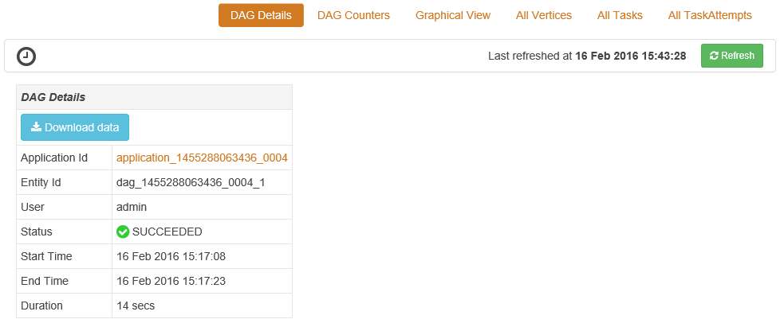

<properties
pageTitle="Verwenden Sie Tez-Benutzeroberfläche mit Windows-basierten HDInsight | Azure"
description="Erfahren Sie, wie die Tez UI Tez Aufträge auf Windows basierende HDInsight HDInsight Debuggen."
services="hdinsight"
documentationCenter=""
authors="Blackmist"
manager="jhubbard"
editor="cgronlun"/>

<tags
ms.service="hdinsight"
ms.devlang="na"
ms.topic="article"
ms.tgt_pltfrm="na"
ms.workload="big-data"
ms.date="10/04/2016"
ms.author="larryfr"/>

# Verwenden Sie die Tez UI Tez Aufträge auf Windows basierende HDInsight Debuggen

Die Tez UI ist eine Webseite anzuzeigen, die zu verstehen und Debuggen Aufträge mit Tez als Execution-Engine auf einem Windows-basierten HDInsight Cluster verwendet werden können. Die Tez UI können Sie den Auftrag als ein Diagramm der verbundenen Elemente visualisieren, detailliert auswerten jedes Element und Statistiken und protokollierten Informationen abrufen.

> [AZURE.NOTE] Die Informationen in diesem Dokument ist für Windows-basiertem HDInsight Cluster spezifisch. Informationen zum Anzeigen und für das Debuggen Tez auf Linux-basierten HDInsight finden Sie unter [Verwenden Ambari Ansichten Tez Aufträge auf HDInsight Debuggen](hdinsight-debug-ambari-tez-view.md).

## Erforderliche Komponenten

* Ein Windows-basiertes HDInsight Cluster. Schritte zum Erstellen eines neuen Clusters finden Sie unter [Erste Schritte mit Windows-basierten HDInsight](hdinsight-hadoop-tutorial-get-started-windows.md).

    > [AZURE.IMPORTANT] Die Tez UI ist nur verfügbar, auf Windows basierende HDInsight Cluster nach 8. Februar 2016 erstellt.

* Ein Windows-basiertem Remotedesktop-Client.

## Grundlegendes zu Tez

Tez ist ein extensible Framework für die Verarbeitung von Daten in Hadoop, die höhere Geschwindigkeit als herkömmliche MapReduce Verarbeitung bereitstellt. Für Windows-basiertem HDInsight Cluster empfiehlt es sich um eine optionale-Engine, die Sie für Struktur aktivieren können, indem Sie mit dem folgenden Befehl als Teil Ihrer Abfrage Struktur:

    set hive.execution.engine=tez;

Bei der Arbeit an Tez gesendet wird, erstellt eine geleitet acyclische Graph (so), die die Reihenfolge der Ausführung der Aktionen erforderlich, indem Sie den Auftrag beschreibt. Einzelne Aktionen werden auch Scheitelpunkte genannt, und führen Sie einen Teil des gesamten Auftrags. Die tatsächliche Ausführung der Arbeit durch einen Eckpunkt beschrieben heißt ein Vorgangs und auf mehreren Knoten im Cluster verteilt werden kann.

### Grundlegendes zu den Tez-Benutzeroberfläche

Informationen zu Prozessen, die ausgeführt werden, oder zuvor war Tez mit einer Webseite zeigt ist die Tez UI. Dies zulässt, können Sie anzeigen, die so generiert Tez, indem Sie es Verteilung auf Cluster, wie z. B. Arbeitsspeicher von Vorgängen und Eckpunkte sowie Fehlerinformationen verwendeten Indikatoren. Nützliche Informationen in den folgenden Szenarien bietet möglicherweise an:

* Überwachung langer Geschäftsprozesse Anzeigen des Verlaufs der Karte und Aufgaben zu verringern.

* Analysieren von zurückliegenden Daten für erfolgreiche oder fehlgeschlagene Prozesse, um zu erfahren, wie Verarbeitung verbessert werden könnte oder Gründe für den Fehler aus.

## Generieren einer so

Die Tez UI wird nur Daten ist ein Projekt enthalten, die verwendet die Tez-Engine aktuell ausgeführte oder wurde in der Vergangenheit ausgeführt haben. Einfache Struktur Abfragen können in der Regel aufgelöst werden ohne Tez, jedoch komplexere Abfragen, die durchführen filtern, Gruppierung, Sortierung, Verknüpfungen usw. normalerweise Tez erforderlich.

Gehen Sie folgendermaßen vor, um eine Struktur Abfrage ausführen, die mit Tez ausgeführt wird.

1. Navigieren Sie in einem Webbrowser zu https://CLUSTERNAME.azurehdinsight.net, darin __CLUSTERNAME__ auf den Namen der Cluster HDInsight.

2. Wählen Sie im Menü am oberen Rand der Seite die __Struktur Editor__ein. Dadurch wird eine Seite mit dem folgenden Beispielabfrage angezeigt.

        Select * from hivesampletable

    Löschen Sie die Beispiel für eine Abfrage, und Ersetzen Sie ihn mit den folgenden.

        set hive.execution.engine=tez;
        select market, state, country from hivesampletable where deviceplatform='Android' group by market, country, state;

3. Wählen Sie die __Senden__ -Schaltfläche. Im Abschnitt __Sitzung Job__ am unteren Rand der Seite wird den Status der Abfrage angezeigt. Nachdem der Status auf __abgeschlossen__wird, wählen Sie den Link __Anzeigen von Details__ zum Anzeigen der Ergebnisse aus. Die __Position Ausgabe__ sollte ähnlich wie der folgende aussehen:
        
        en-GB   Hessen      Germany
        en-GB   Kingston    Jamaica
        en-GB   Nairobi Area    Kenya

## Verwenden Sie die Tez-Benutzeroberfläche

> [AZURE.NOTE] Der Tez UI ist nur verfügbar, vom Desktop der Cluster am Knoten, daher Sie Remotedesktop verwenden müssen, die Verbindung zu den am Knoten.

1. Wählen Sie im [Portal Azure](https://portal.azure.com)-HDInsight Cluster aus. Wählen Sie oben auf das HDInsight Blade das __Remote Desktop__ -Symbol. Dadurch wird das remote desktop Blade angezeigt.

    

2. Wählen Sie aus dem Blade Remote Desktop __Verbinden__ Verbindung zum am Cluster-Knoten. Wenn Sie dazu aufgefordert werden, verwenden Sie zur Authentifizierung der Verbindung Cluster Remote Desktop-Benutzername und Kennwort an.

    

    > [AZURE.NOTE] Wenn Sie Remote Desktop-Konnektivität nicht aktiviert haben, geben Sie einen Benutzernamen, Ihr Kennwort ein, und Ablaufdatum, und wählen Sie dann __Aktivieren__ aus, um den Remotedesktop aktivieren. Nachdem sie aktiviert wurde, verwenden Sie die vorherigen Schritte Verbindung aus.

3. Nachdem die Verbindung hergestellt wurde, öffnen Sie Internet Explorer auf dem Remotedesktop, wählen Sie in der oberen rechten Ecke des Browsers das Zahnradsymbol, und wählen Sie dann auf __Kompatibilität Ansichtseinstellungen__.

4. Deaktivieren Sie von unten __Kompatibilität Ansichtsoptionen__das Kontrollkästchen für die __Anzeige Intranet-Websites in der Ansicht Kompatibilität__ und __Verwenden Sie Microsoft Compatibility Listen__, und wählen Sie dann auf __Schließen__.

5. Navigieren Sie in Internet Explorer zu Http://headnodehost:8188/Tezui / #/. Dadurch wird die Tez UI angezeigt.

    

    Beim Laden der Tez UI, sehen Sie sich, dass eine Liste der DAGs, die zurzeit ausgeführt werden, oder Waren auf Cluster ausgeführt wurde. Die Standardansicht enthält Dag Name, Id, Absender, Status, Anfangszeit, Endzeit, Dauer, ID der Anwendung, und Warteschlange. Weitere Spalten können mit dem Zahnradsymbol am rechten Rand der Seite hinzugefügt werden.

    Wenn Sie nur einen Eintrag haben, werden sie für die Abfrage, die Sie im vorherigen Abschnitt ausgeführt haben. Wenn Sie mehrere Einträge verfügen, können Sie durch Eingabe von Suchkriterien in die Felder über die DAGs suchen und dann drücken __Sie die EINGABETASTE__.

4. Wählen Sie den __Namen so__ für den letzten Eintrag so aus. Informationen zu den so, als auch die Option JSON-Dateien als ZIP-Datei herunterladen, die Informationen zu den so enthalten werden angezeigt.

    

5. Sind Sie über die __Details so__ mehrere Verknüpfungen, die verwendet werden können, um Informationen zu den so anzuzeigen.

    * __So Indikatoren__ zeigt Indikatoren für diese so.
    
    * __Grafisch__ wird von diesem so grafisch dargestellt.
    
    * __Alle Scheitelpunkte__ zeigt eine Liste der Scheitelpunkte in dieser so.
    
    * __Alle Vorgänge__ zeigt eine Liste der Aufgaben aus, um alle Scheitelpunkte in dieser so.
    
    * __Alle TaskAttempts__ zeigt Informationen über die Versuche, diese so Aufgaben ausführen.
    
    > [AZURE.NOTE] Wenn Sie die Spaltenanzeige für Eckpunkte, Aufgaben und TaskAttempts einen Bildlauf durchführen, beachten Sie, dass es Links zu __Indikatoren__ und __anzeigen oder Herunterladen von Protokollen__ für jede Zeile anzeigen.

    Wenn es wurde ein Fehler bei der Position aus, werden die Details so einen Status fehlgeschlagen, sowie Links zu Informationen über die fehlgeschlagene Aufgabe angezeigt. Diagnoseinformationen wird unter die Details so angezeigt werden soll.

7. Wählen Sie __grafisch__an. Hierdurch werden grafisch dargestellt, die so angezeigt. Sie können die Maus über jede Scheitelpunkt in der Ansicht zum Anzeigen von Informationen dazu platzieren.

    

8. Klicken auf einen Scheitelpunkt, laden Sie die __Scheitelpunkt Details__ für dieses Element. Klicken Sie auf den Scheitelpunkt __Karte 1__ Informationen für dieses Element angezeigt. Wählen Sie __bestätigen__ , um die Navigation zu bestätigen.

    

9. Beachten Sie, dass Sie verfügen nun über die Links am oberen Rand der Seite, die Scheitelpunkte und Vorgänge verknüpft sind.

    > [AZURE.NOTE] Sie können auch auf dieser Seite durch zurückgehen __So__Details, indem __Scheitelpunkt Details__, auswählen und dann den __Karte 1__ Scheitelpunkt eintreffen.

    * __Scheitelpunkt Indikatoren__ zeigt Indikator für diese Eckpunkts.
    
    * __Aufgaben__ werden Aufgaben für diese Eckpunkts angezeigt.
    
    * __Aufgabe versucht__ zeigt Informationen zum Ausführen von Aufgaben für diese Eckpunkts Versuche an.
    
    * __Quellen und senken__ zeigt Datenquellen und für diese Eckpunkts senken.

    > [AZURE.NOTE] Als können Sie mit der vorherigen Menü die Spaltenanzeige für Aufgaben, Task versucht, und Quellen & Sinks__ Anzeigen von Links zu weiteren Informationen für jedes Element blättern.

10. Wählen Sie __Vorgänge__aus, und wählen Sie dann das Element mit der Bezeichnung __00_000000__. __Aufgabendetails__ werden für diese Aufgabe angezeigt. Dieser Bildschirm können Sie die __Aufgabe Indikatoren__ und __Versuche Vorgang__anzeigen.

    

## Nächste Schritte

Jetzt, da Sie die Ansicht Tez verwenden vertraut gemacht haben, erfahren Sie mehr zur [Verwendung auf HDInsight Struktur](hdinsight-use-hive.md).

Detailliertere Informationen auf Tez finden Sie unter der [Tez-Seite unter Hortonworks](http://hortonworks.com/hadoop/tez/).
